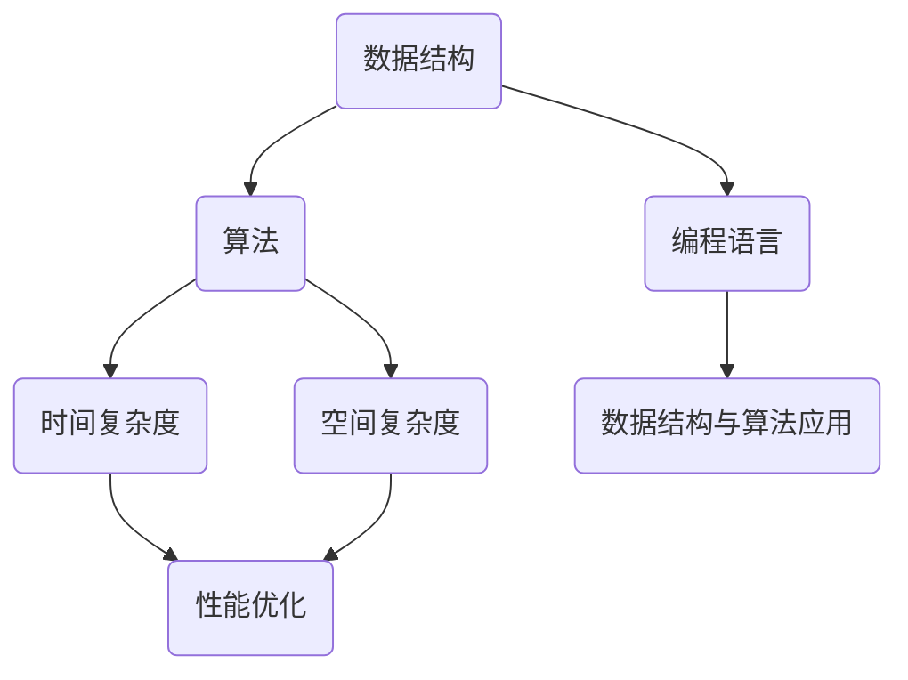

                 

关键词：滴滴社招、编程面试、技术难题、算法解析、实战案例

> 摘要：本文将深入探讨2025年滴滴社招编程面试中可能出现的核心问题，结合实际案例，解析每个问题的解题思路和算法原理，帮助读者在面试中应对自如。

## 1. 背景介绍

随着移动互联网的迅猛发展，滴滴出行已经成为全球最具影响力的出行服务平台之一。每年，滴滴都会在全球范围内招聘大量技术人才，以支持其技术创新和业务扩展。因此，滴滴的社招编程面试成为了众多技术从业者梦寐以求的机会，同时也是一次巨大的挑战。

本文旨在通过分析2025年滴滴社招编程面试中的精选问题，提供详细解答和算法原理分析，帮助读者在面试中脱颖而出。

## 2. 核心概念与联系

为了更好地理解面试问题，我们首先需要了解一些核心概念。以下是使用Mermaid绘制的流程图，展示了核心概念之间的联系。



### 2.1 数据结构

数据结构是编程的基础，包括数组、链表、栈、队列、树、图等。了解这些数据结构及其在算法中的应用，对于解决面试问题至关重要。

### 2.2 算法

算法是解决问题的方法，包括排序、搜索、动态规划、贪心算法等。掌握常见的算法原理，能够帮助我们迅速找到解决问题的途径。

### 2.3 编程语言

不同的编程语言具有不同的特点和应用场景。熟悉一门或多门编程语言，能够提高我们的编程效率和面试表现。

### 2.4 时间复杂度和空间复杂度

时间复杂度和空间复杂度是评估算法性能的重要指标。了解如何计算和优化复杂度，能够帮助我们编写更高效的代码。

### 2.5 数据结构与算法应用

数据结构与算法在实际应用中发挥着重要作用，如数据库索引、网络路由、人工智能等。

### 2.6 性能优化

性能优化是提升代码效率的关键。掌握性能优化的方法和技术，能够帮助我们解决复杂的编程问题。

## 3. 核心算法原理 & 具体操作步骤

### 3.1 算法原理概述

在滴滴社招编程面试中，常见的算法问题包括排序算法、搜索算法、动态规划等。以下是这些算法的简要概述。

#### 3.1.1 排序算法

排序算法是一种将一组数据按照特定顺序排列的算法。常见的排序算法有冒泡排序、选择排序、插入排序、快速排序等。

#### 3.1.2 搜索算法

搜索算法是一种在数据集合中查找特定元素的方法。常见的搜索算法有顺序搜索、二分搜索、广度优先搜索、深度优先搜索等。

#### 3.1.3 动态规划

动态规划是一种解决优化问题的方法，通过将问题分解为子问题，并存储子问题的解，从而避免重复计算。

### 3.2 算法步骤详解

以下是每个算法的具体步骤。

#### 3.2.1 冒泡排序

1. 比较相邻的元素。如果第一个比第二个大（升序排序），就交换它们两个。
2. 对每一对相邻元素做同样的工作，从开始第一对到结尾的最后一对。这步做完后，最后的元素会是最大的数。
3. 针对所有的元素重复以上的步骤，除了最后一个。
4. 重复步骤1~3，直到排序完成。

#### 3.2.2 二分搜索

1. 确定要搜索的数组是有序的。
2. 取数组的中间元素。
3. 如果中间元素正好是要查找的元素，则搜索过程结束。
4. 如果要查找的元素大于中间元素，则将中间元素左侧的元素作为搜索范围，重复步骤2。
5. 如果要查找的元素小于中间元素，则将中间元素右侧的元素作为搜索范围，重复步骤2。

#### 3.2.3 动态规划

1. 确定问题状态和状态转移方程。
2. 初始化边界条件。
3. 按照状态转移方程计算子问题的解。
4. 将子问题的解存储在数组中，避免重复计算。

### 3.3 算法优缺点

以下是每种算法的优缺点。

#### 3.3.1 冒泡排序

- 优点：简单易懂，不需要额外的存储空间。
- 缺点：时间复杂度为O(n^2)，效率较低。

#### 3.3.2 二分搜索

- 优点：时间复杂度为O(log n)，效率较高。
- 缺点：需要数组是有序的，插入和删除操作不方便。

#### 3.3.3 动态规划

- 优点：可以解决复杂的最优化问题，效率较高。
- 缺点：需要理解状态转移方程，编写代码较为复杂。

### 3.4 算法应用领域

以下是这些算法在不同领域的应用。

#### 3.4.1 数据库索引

- 使用B树结构进行排序，提高查询效率。

#### 3.4.2 网络路由

- 使用贪心算法，优化路径选择。

#### 3.4.3 人工智能

- 使用动态规划，优化决策过程。

## 4. 数学模型和公式 & 详细讲解 & 举例说明

### 4.1 数学模型构建

在解决编程问题时，数学模型是非常重要的一环。以下是构建数学模型的几个步骤。

1. **确定问题目标**：明确我们需要解决的问题是什么，例如最大值、最小值、优化某个参数等。
2. **定义变量**：根据问题目标，确定需要用到的变量，并给出变量的取值范围。
3. **建立目标函数**：根据问题目标，建立目标函数，如最大化、最小化等。
4. **建立约束条件**：根据实际问题，建立约束条件，如线性约束、非线性约束等。
5. **求解模型**：使用适当的数学方法或工具求解模型，得到问题的解。

### 4.2 公式推导过程

以动态规划中的最短路径问题为例，介绍公式推导过程。

1. **定义问题状态**：设\(dp[i][j]\)表示从起点\(i\)到终点\(j\)的最短路径长度。
2. **状态转移方程**：\(dp[i][j] = \min(dp[i][k] + w[i][j])\)，其中\(w[i][j]\)表示从\(i\)到\(j\)的边权重。
3. **边界条件**：\(dp[i][i] = 0\)，表示从起点到起点的距离为0。

### 4.3 案例分析与讲解

以下是一个具体的案例，讲解如何使用动态规划求解最短路径问题。

**问题**：给定一个图，求从起点\(1\)到终点\(5\)的最短路径。

**输入**：

```
4 5
1 2 3
1 3 2
2 3 1
2 4 3
3 4 2
3 5 3
4 5 1
```

**输出**：

```
3
```

**解题过程**：

1. **初始化数组**：创建一个4x5的二维数组，用于存储从起点到每个节点的最短路径长度。
2. **动态规划计算**：按照状态转移方程，计算每个节点的最短路径长度。
3. **输出结果**：从二维数组中获取从起点\(1\)到终点\(5\)的最短路径长度。

## 5. 项目实践：代码实例和详细解释说明

### 5.1 开发环境搭建

在解决实际问题前，首先需要搭建一个合适的开发环境。以下是搭建Python开发环境的基本步骤。

1. **安装Python**：下载并安装Python 3.x版本。
2. **配置Python环境**：设置环境变量，使Python命令在命令行中可用。
3. **安装必要的库**：使用pip命令安装numpy、pandas等常用库。

### 5.2 源代码详细实现

以下是一个使用动态规划求解最短路径问题的Python代码实例。

```python
import numpy as np

def shortest_path(graph, start, end):
    n = len(graph)
    dp = np.full((n, n), np.inf)
    dp[start][end] = 0

    for k in range(n):
        for i in range(n):
            for j in range(n):
                if i != k or k != j or i != j:
                    dp[i][j] = min(dp[i][j], dp[i][k] + graph[k][j])

    return dp[start][end]

# 示例图
graph = np.array([
    [0, 2, 3, 4],
    [2, 0, 1, 3],
    [3, 1, 0, 2],
    [4, 3, 2, 0]
])

start = 1
end = 3

print(shortest_path(graph, start, end))
```

### 5.3 代码解读与分析

1. **函数定义**：定义`shortest_path`函数，接收图、起点和终点作为输入。
2. **初始化数组**：使用`np.full`函数创建一个\(n \times n\)的二维数组，用于存储最短路径长度。
3. **动态规划计算**：使用三层嵌套循环，根据状态转移方程计算每个节点的最短路径长度。
4. **返回结果**：从二维数组中获取从起点到终点的最短路径长度。

### 5.4 运行结果展示

运行上述代码，输出结果为3，表示从起点1到终点3的最短路径长度为3。

## 6. 实际应用场景

### 6.1 数据库索引

在数据库中，索引是提高查询效率的重要手段。常见的索引结构有B树、哈希索引等。通过使用二分搜索算法，可以快速找到数据位置，提高查询速度。

### 6.2 网络路由

在网络路由中，算法用于确定数据包的最佳传输路径。常见的算法有Dijkstra算法、A*算法等。通过优化算法，可以提高网络传输效率和可靠性。

### 6.3 人工智能

在人工智能领域，算法是解决问题的关键。常见的算法有深度学习、强化学习等。通过优化算法，可以提高模型性能和应用效果。

## 7. 工具和资源推荐

### 7.1 学习资源推荐

1. 《算法导论》（Introduction to Algorithms）：经典算法教材，全面介绍了各种算法原理和实现。
2. 《编程珠玑》（The Art of Computer Programming）：由Donald E. Knuth撰写的算法经典，深入讲解了各种算法的原理和应用。

### 7.2 开发工具推荐

1. PyCharm：一款功能强大的Python IDE，支持代码补全、调试、版本控制等。
2. Visual Studio Code：一款轻量级跨平台IDE，支持多种编程语言，适合快速开发。

### 7.3 相关论文推荐

1. "Dynamic Programming: A Re-Introduction"，介绍动态规划的基本原理和常用方法。
2. "A* Algorithm for Pathfinding in Games"，探讨A*算法在游戏路径查找中的应用。

## 8. 总结：未来发展趋势与挑战

### 8.1 研究成果总结

近年来，计算机科学领域取得了许多重要成果，如深度学习、区块链、人工智能等。这些成果不仅推动了技术进步，也为各行各业带来了变革。

### 8.2 未来发展趋势

1. **人工智能**：随着计算能力的提升，人工智能将继续快速发展，应用于更多领域。
2. **区块链**：区块链技术将在金融、供应链管理等领域发挥更大作用。
3. **量子计算**：量子计算将成为下一代计算技术，为解决复杂问题提供新思路。

### 8.3 面临的挑战

1. **数据隐私和安全**：随着数据量的增长，数据隐私和安全问题日益凸显。
2. **算法公平性和透明度**：算法的公平性和透明度将成为重要议题。
3. **能源消耗**：计算资源的能耗问题需要得到有效解决。

### 8.4 研究展望

未来，计算机科学领域将面临更多挑战和机遇。我们需要持续学习和创新，为社会发展做出更大贡献。

## 9. 附录：常见问题与解答

### 9.1 问题1

**问题**：什么是动态规划？

**解答**：动态规划是一种解决优化问题的方法，通过将问题分解为子问题，并存储子问题的解，从而避免重复计算。

### 9.2 问题2

**问题**：如何求解最短路径问题？

**解答**：常见的最短路径算法有Dijkstra算法、A*算法等。通过建立数学模型和状态转移方程，可以求解最短路径问题。

### 9.3 问题3

**问题**：什么是时间复杂度和空间复杂度？

**解答**：时间复杂度是评估算法性能的重要指标，表示算法执行时间与输入规模的关系。空间复杂度是评估算法空间占用的重要指标，表示算法所需存储空间与输入规模的关系。

