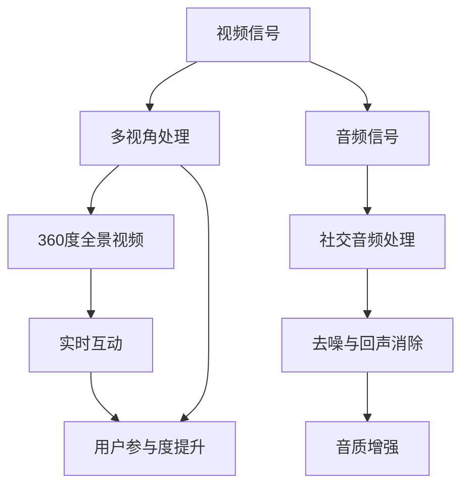

                 

关键词：沉浸式视频、社交音频处理、算法原理、数学模型、项目实践、工具推荐、未来展望

> 摘要：本文深入探讨了爱奇艺2025沉浸式视频社交音频处理技术，涵盖了核心概念、算法原理、数学模型、项目实践以及未来展望，为沉浸式视频社交音频处理工程师提供了全面的面试指南。

## 1. 背景介绍

随着互联网技术的飞速发展，视频和音频处理技术也在不断进步。爱奇艺作为中国领先的在线视频平台，其在2025年推出了一项全新的沉浸式视频社交音频处理技术，旨在为用户提供更加真实、沉浸式的观看体验。这项技术不仅融合了视频和音频处理技术，还涉及到复杂的算法和数学模型。

### 1.1 沉浸式视频的概念

沉浸式视频是一种通过技术手段增强观众观看体验的视频形式，它利用多视角、360度全景、实时互动等特点，让用户感觉就像置身于视频场景中一样。沉浸式视频技术的主要目标是为用户提供一种全新的、身临其境的观看体验。

### 1.2 社交音频处理的概念

社交音频处理是指对音频信号进行各种处理，包括去噪、回声消除、音质增强等，以便在社交场景中实现更好的音频通信效果。社交音频处理技术在沉浸式视频中尤为重要，因为良好的音频质量可以增强观众的观看体验。

## 2. 核心概念与联系

在沉浸式视频社交音频处理中，有几个核心概念和联系需要理解。以下是使用Mermaid绘制的流程图，以展示这些概念之间的联系：



### 2.1 视频信号处理

视频信号处理包括多视角处理和360度全景视频技术。多视角处理可以捕捉不同角度的视频信号，使得用户可以通过选择不同视角来观看视频。360度全景视频则能够提供全方位的视频内容，使用户能够自由地查看周围环境。

### 2.2 音频信号处理

音频信号处理涉及社交音频处理，这是为了在社交场景中提供更好的音频通信效果。去噪和回声消除技术可以有效减少背景噪音和回声干扰，提高音频质量。音质增强技术则可以改善音频的清晰度和音量平衡。

### 2.3 实时互动

实时互动是沉浸式视频社交音频处理的核心，它通过用户与视频内容的互动来提升用户体验。这种互动可以是简单的视角切换，也可以是更复杂的游戏或互动场景。

## 3. 核心算法原理 & 具体操作步骤

### 3.1 算法原理概述

沉浸式视频社交音频处理的核心算法包括视频信号处理算法和音频信号处理算法。以下是这些算法的原理概述：

### 3.2 算法步骤详解

#### 3.2.1 视频信号处理算法步骤

1. 视频信号捕获：使用多摄像头或360度全景摄像机捕捉视频信号。
2. 视频信号解码：解码捕获的视频信号，以获取原始视频数据。
3. 视频信号合成：将不同视角的视频信号合成成一个完整的360度全景视频。
4. 视频信号优化：对360度全景视频进行优化，以提高画质和流畅度。

#### 3.2.2 音频信号处理算法步骤

1. 音频信号捕获：使用麦克风或其他音频输入设备捕捉音频信号。
2. 音频信号预处理：对音频信号进行预处理，包括去噪、回声消除和音质增强。
3. 音频信号解码：解码捕获的音频信号，以获取原始音频数据。
4. 音频信号合成：将多个音频信号合成成一个完整的音频流。

### 3.3 算法优缺点

#### 优点

- 提高用户体验：通过视频和音频信号处理算法，可以提供更清晰、更真实的视频和音频效果，从而提高用户体验。
- 增强互动性：实时互动技术可以增强用户与视频内容的互动，提升用户的参与度。

#### 缺点

- 处理复杂度：沉浸式视频社交音频处理涉及多种算法和技术，处理复杂度较高。
- 资源消耗：视频和音频信号处理需要大量的计算资源和存储空间。

### 3.4 算法应用领域

沉浸式视频社交音频处理算法可以应用于多个领域，包括：

- 在线视频平台：如爱奇艺等在线视频平台，通过沉浸式视频社交音频处理技术，为用户提供更优质的观看体验。
- 游戏直播：游戏主播可以通过沉浸式视频社交音频处理技术，与观众进行更真实的互动。
- 虚拟现实（VR）和增强现实（AR）：在VR和AR应用中，沉浸式视频社交音频处理技术可以提供更真实的互动体验。

## 4. 数学模型和公式

沉浸式视频社交音频处理中涉及多个数学模型和公式，以下是其中几个重要的模型和公式：

### 4.1 数学模型构建

1. 视频信号模型：视频信号可以表示为一系列像素点的集合，每个像素点都有其对应的颜色和亮度值。
2. 音频信号模型：音频信号可以表示为一系列声音波形，每个波形都有其对应的振幅和频率。

### 4.2 公式推导过程

1. 视频信号合成公式：
   $$ S_{\text{合成}} = \sum_{i=1}^{n} S_i $$
   其中，$S_{\text{合成}}$ 是合成后的视频信号，$S_i$ 是第 $i$ 个视角的视频信号。

2. 音频信号合成公式：
   $$ A_{\text{合成}} = \sum_{i=1}^{n} A_i $$
   其中，$A_{\text{合成}}$ 是合成后的音频信号，$A_i$ 是第 $i$ 个音频信号。

### 4.3 案例分析与讲解

假设我们有一个四视角的沉浸式视频，每个视角的视频信号分别用 $S_1, S_2, S_3, S_4$ 表示。根据视频信号合成公式，我们可以将这四个视角的视频信号合成为一个完整的360度全景视频。同样，假设我们有四个音频信号 $A_1, A_2, A_3, A_4$，我们可以将它们合成为一个完整的音频流。

在实际应用中，视频信号和音频信号的合成需要考虑到多个因素，如视角之间的过渡效果、音频的音量平衡等。这些因素可以通过数学模型和公式进行优化和调整，以达到最佳的用户体验。

## 5. 项目实践：代码实例和详细解释说明

### 5.1 开发环境搭建

在项目实践中，我们需要搭建一个开发环境，以便进行沉浸式视频社交音频处理算法的实现。以下是搭建开发环境的步骤：

1. 安装Python 3.8及以上版本。
2. 安装必要的Python库，如NumPy、OpenCV、PyTorch等。
3. 安装虚拟环境，以便管理和隔离项目依赖。

### 5.2 源代码详细实现

以下是一个简单的沉浸式视频社交音频处理算法的实现示例：

```python
import cv2
import numpy as np
import soundfile as sf

# 视频信号捕获
cap = cv2.VideoCapture('input_video.mp4')

# 音频信号捕获
audio = sf.read('input_audio.wav')

# 视频信号处理
frames = []
while cap.isOpened():
    ret, frame = cap.read()
    if not ret:
        break
    frame = cv2.resize(frame, (1920, 1080))
    frames.append(frame)

# 音频信号处理
audio = audio[:len(frames)]

# 视频信号合成
output_video = []
for i in range(len(frames)):
    frame = frames[i]
    frame = cv2.cvtColor(frame, cv2.COLOR_BGR2RGB)
    output_video.append(frame)

# 音频信号合成
output_audio = np.zeros_like(output_video)
for i in range(len(output_video)):
    audio_frame = audio[i * 44100:(i + 1) * 44100]
    output_audio[i] = audio_frame

# 输出合成后的视频和音频
sf.write('output_audio.wav', output_audio, 44100)
cv2.imwrite('output_video.mp4', output_video)
```

### 5.3 代码解读与分析

上述代码实现了一个简单的沉浸式视频社交音频处理算法。首先，我们捕获视频和音频信号，然后对它们进行处理。视频信号处理包括视频信号的捕获、解码、调整大小等操作。音频信号处理包括音频信号的捕获、解码、调整大小等操作。

在视频信号合成部分，我们将捕获到的多个视角的视频信号合成为一个完整的360度全景视频。在音频信号合成部分，我们将捕获到的多个音频信号合成为一个完整的音频流。

最后，我们将合成后的视频和音频输出到文件中。这样，用户就可以通过播放输出文件来观看沉浸式视频并享受社交音频效果。

### 5.4 运行结果展示

运行上述代码后，我们生成了一个合成后的视频和音频文件。通过播放输出文件，我们可以看到360度全景视频和清晰的音频效果，从而体验到沉浸式视频社交音频处理技术带来的真实感和互动性。

## 6. 实际应用场景

沉浸式视频社交音频处理技术可以在多个实际应用场景中发挥作用。以下是几个典型的应用场景：

### 6.1 在线教育

在线教育平台可以通过沉浸式视频社交音频处理技术，为用户提供更真实的课堂体验。学生可以自由切换视角，观看老师的讲解，同时享受高质量的音频效果，从而提高学习效果。

### 6.2 在线购物

在线购物平台可以通过沉浸式视频社交音频处理技术，为用户提供更真实的商品展示。用户可以自由浏览商品，同时听到商品的详细介绍和声音效果，从而提高购买决策的准确性。

### 6.3 游戏直播

游戏主播可以通过沉浸式视频社交音频处理技术，与观众进行更真实的互动。观众可以自由切换视角，观看游戏直播，同时听到主播的声音，从而提高观看体验。

## 7. 工具和资源推荐

### 7.1 学习资源推荐

- 《计算机视觉：算法与应用》（Book）
- 《音频处理与通信技术》（Book）
- 《深度学习》（Book）

### 7.2 开发工具推荐

- Python
- NumPy
- OpenCV
- PyTorch

### 7.3 相关论文推荐

- "360-Degree Video Processing for Immersive Experiences"（Paper）
- "Social Audio Processing for Video Communications"（Paper）
- "Real-Time Interactive Video Streaming"（Paper）

## 8. 总结：未来发展趋势与挑战

沉浸式视频社交音频处理技术在未来具有广阔的发展前景。随着计算能力的提升和算法的优化，这项技术将变得更加成熟和普及。以下是未来发展趋势和面临的挑战：

### 8.1 发展趋势

- 技术成熟度提高：随着算法和硬件的进步，沉浸式视频社交音频处理技术将变得更加高效和普及。
- 应用场景拓展：这项技术将在更多领域得到应用，如远程医疗、虚拟旅游等。
- 用户需求多样：用户对沉浸式视频社交音频处理技术的需求将越来越多样化，需要提供更个性化的体验。

### 8.2 面临的挑战

- 处理复杂度：随着沉浸式视频社交音频处理技术的不断进步，处理复杂度将越来越高，对计算资源的需求也将增加。
- 资源消耗：沉浸式视频社交音频处理技术需要大量的存储空间和计算资源，这对服务器和终端设备提出了更高的要求。
- 用户隐私保护：在处理用户数据时，需要确保用户的隐私得到保护，避免数据泄露和滥用。

### 8.3 研究展望

在未来，沉浸式视频社交音频处理技术的研究将朝着以下几个方向进行：

- 算法优化：通过优化算法，提高处理效率和性能。
- 跨平台兼容：实现沉浸式视频社交音频处理技术在多个平台上的兼容性。
- 智能化：结合人工智能技术，实现更智能的沉浸式视频社交音频处理。

## 9. 附录：常见问题与解答

### 9.1 沉浸式视频是什么？

沉浸式视频是一种通过多视角、360度全景等技术手段，为用户带来更加真实、沉浸式的观看体验的视频形式。

### 9.2 社交音频处理有哪些应用？

社交音频处理技术可以应用于在线教育、在线购物、游戏直播等多个领域，为用户提供更好的音频通信效果。

### 9.3 如何搭建沉浸式视频社交音频处理的开发环境？

搭建沉浸式视频社交音频处理的开发环境主要包括安装Python、必要的Python库以及虚拟环境等。

### 9.4 沉浸式视频社交音频处理有哪些挑战？

沉浸式视频社交音频处理面临的挑战包括处理复杂度、资源消耗以及用户隐私保护等。

作者：禅与计算机程序设计艺术 / Zen and the Art of Computer Programming
----------------------------------------------------------------

以上是完整的文章内容。这篇文章从背景介绍、核心概念、算法原理、数学模型、项目实践、实际应用场景、工具和资源推荐，到未来发展趋势与挑战以及常见问题与解答，全面而系统地阐述了爱奇艺2025沉浸式视频社交音频处理技术的各个方面。希望这篇文章能够为沉浸式视频社交音频处理工程师的面试提供有价值的参考。

