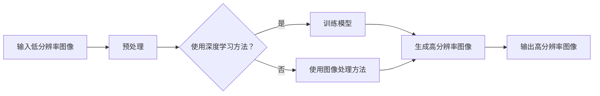
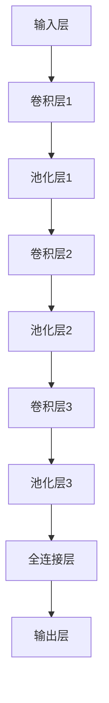

                 

## 1. 背景介绍

随着视频技术的不断发展，视频分辨率成为了衡量视频质量的重要指标。传统的视频分辨率提升方法往往依赖于大量的计算资源和时间成本，而且效果有限。因此，超分辨率（Super-Resolution，SR）技术应运而生，旨在通过低分辨率图像恢复出高分辨率图像。

超分辨率技术的研究始于20世纪80年代，早期的研究主要集中在基于图像处理的方法上。随着深度学习技术的飞速发展，深度学习在超分辨率领域取得了显著的成果，尤其是基于卷积神经网络（Convolutional Neural Network，CNN）的方法。在过去的几年里，超分辨率技术的分辨率提升倍数和图像质量都有了显著提升，逐渐成为了计算机视觉领域的研究热点。

爱奇艺作为国内领先的在线视频平台，对于视频质量的要求极为严格。为了提升用户体验，爱奇艺一直在寻求高效、稳定的超分辨率技术。因此，2025年爱奇艺社招深度学习岗位中，超分辨率技术成为了面试的一个重点。本文将围绕超分辨率技术，深入探讨其核心概念、算法原理、数学模型、项目实践以及未来应用前景。

## 2. 核心概念与联系

超分辨率技术涉及多个核心概念，包括低分辨率图像、高分辨率图像、图像复原和深度学习等。这些概念之间存在着密切的联系，构成了超分辨率技术的理论基础。

### 2.1 低分辨率图像与高分辨率图像

低分辨率图像是指像素点较少、细节信息丢失较多的图像，通常由于摄像头像素较低或者图像压缩导致。高分辨率图像则是指像素点较多、细节信息丰富的图像，能够提供更清晰、更细腻的视觉效果。

### 2.2 图像复原

图像复原是超分辨率技术的核心目标，旨在通过处理低分辨率图像，恢复出高分辨率图像。图像复原方法可以分为两大类：基于图像处理的方法和基于深度学习的方法。

### 2.3 深度学习

深度学习是近年来计算机视觉领域的重要突破，通过构建多层神经网络，从大量数据中自动学习特征，从而实现图像分类、目标检测、图像分割等任务。在超分辨率技术中，深度学习方法通过对大量低分辨率和高分辨率图像对进行训练，学习到图像之间的映射关系，从而实现超分辨率图像的生成。

### 2.4 Mermaid 流程图

以下是超分辨率技术的 Mermaid 流程图，展示了低分辨率图像到高分辨率图像的转换过程。



## 3. 核心算法原理 & 具体操作步骤

### 3.1 算法原理概述

超分辨率技术的核心在于图像重建，即通过低分辨率图像重建出高分辨率图像。常见的深度学习方法包括卷积神经网络（CNN）、生成对抗网络（GAN）和自编码器（Autoencoder）等。本文主要介绍基于CNN的超分辨率算法。

### 3.2 算法步骤详解

#### 3.2.1 数据集准备

首先，需要准备一个包含大量低分辨率图像和高分辨率图像对的数据集。数据集的选择对于算法的性能至关重要。

#### 3.2.2 模型设计

基于CNN的超分辨率模型通常由多个卷积层、池化层和全连接层组成。以下是典型的超分辨率模型结构：



#### 3.2.3 训练模型

使用准备好的数据集，通过反向传播算法训练模型。在训练过程中，可以使用梯度下降优化器、批量归一化（Batch Normalization）和dropout等技术提高模型的泛化能力。

#### 3.2.4 生成高分辨率图像

在模型训练完成后，可以使用训练好的模型对低分辨率图像进行超分辨率处理，生成高分辨率图像。

### 3.3 算法优缺点

#### 优点：

1. 高效性：基于深度学习的超分辨率算法在处理速度上相比传统方法有显著提升。
2. 有效性：深度学习方法可以学习到图像之间的复杂映射关系，生成的图像质量较高。
3. 泛化能力：通过大量数据训练，模型可以较好地应对不同场景和分辨率下的超分辨率任务。

#### 缺点：

1. 计算资源需求高：深度学习模型通常需要大量计算资源和时间进行训练。
2. 数据依赖性强：模型的性能在很大程度上取决于数据集的质量和数量。

### 3.4 算法应用领域

超分辨率技术在视频处理、图像处理、医学成像等领域具有广泛的应用前景。例如，在视频处理中，超分辨率技术可以用于提升视频播放质量，减少带宽占用；在医学成像中，超分辨率技术可以用于增强图像的细节信息，提高诊断准确率。

## 4. 数学模型和公式

### 4.1 数学模型构建

超分辨率技术的数学模型通常包括输入层、卷积层、池化层、全连接层和输出层。以下是超分辨率模型的数学表示：

```math
\begin{aligned}
x_{LR} &= \text{输入低分辨率图像}, \\
x_{HR} &= \text{输入高分辨率图像}, \\
s &= \text{分辨率倍数}, \\
f &= \text{卷积滤波器}, \\
W &= \text{权重矩阵}, \\
b &= \text{偏置向量}, \\
\end{aligned}
```

### 4.2 公式推导过程

超分辨率模型的核心在于卷积操作和反向传播算法。以下是超分辨率模型的卷积公式和反向传播公式：

```math
\begin{aligned}
h_{ij} &= \sum_{k=1}^{n} W_{ik}x_{ij-k} + b, \\
\end{aligned}
```

其中，$h_{ij}$表示卷积结果，$W_{ik}$表示卷积滤波器的权重，$x_{ij-k}$表示输入图像中的像素点。

反向传播公式如下：

```math
\begin{aligned}
\frac{\partial L}{\partial W} &= \frac{\partial L}{\partial h} \cdot \frac{\partial h}{\partial W}, \\
\frac{\partial L}{\partial b} &= \frac{\partial L}{\partial h} \cdot \frac{\partial h}{\partial b}, \\
\end{aligned}
```

其中，$L$表示损失函数，$\frac{\partial L}{\partial W}$和$\frac{\partial L}{\partial b}$分别表示对权重矩阵和偏置向量的梯度。

### 4.3 案例分析与讲解

假设我们有一个低分辨率图像$x_{LR}$，需要通过超分辨率模型生成高分辨率图像$x_{HR}$。以下是具体的案例分析与讲解：

#### 4.3.1 输入层

输入层接收低分辨率图像$x_{LR}$，并将其传递给卷积层。

```math
\begin{aligned}
x_{LR} &= \text{输入低分辨率图像}, \\
\end{aligned}
```

#### 4.3.2 卷积层

卷积层通过卷积滤波器$f$对输入图像进行卷积操作，生成中间特征图。

```math
\begin{aligned}
h_{ij} &= \sum_{k=1}^{n} W_{ik}x_{ij-k} + b, \\
\end{aligned}
```

#### 4.3.3 池化层

池化层对中间特征图进行池化操作，以降低特征图的维度。

```math
\begin{aligned}
p_{ij} &= \max(h_{ij}), \\
\end{aligned}
```

#### 4.3.4 全连接层

全连接层将池化层输出的特征图进行全连接操作，得到高分辨率图像。

```math
\begin{aligned}
x_{HR} &= W_{ij}p_{ij} + b, \\
\end{aligned}
```

#### 4.3.5 输出层

输出层将全连接层输出的特征图转换为高分辨率图像。

```math
\begin{aligned}
x_{HR} &= \text{输出高分辨率图像}, \\
\end{aligned}
```

## 5. 项目实践：代码实例和详细解释说明

### 5.1 开发环境搭建

为了实践超分辨率技术，需要搭建一个开发环境。以下是搭建开发环境的步骤：

1. 安装Python 3.7及以上版本。
2. 安装深度学习框架TensorFlow。
3. 安装图像处理库OpenCV。

### 5.2 源代码详细实现

以下是超分辨率技术的源代码实现：

```python
import tensorflow as tf
import numpy as np
import cv2

# 参数设置
input_size = (128, 128)
lr_size = (32, 32)
hr_size = (128, 128)
batch_size = 32
learning_rate = 0.001
epochs = 100

# 数据预处理
def preprocess_image(image):
    image = cv2.resize(image, hr_size)
    image = image.astype(np.float32) / 255.0
    image = np.expand_dims(image, axis=0)
    return image

# 模型定义
def build_model():
    inputs = tf.keras.layers.Input(shape=input_size)
    x = tf.keras.layers.Conv2D(64, (3, 3), activation='relu', padding='same')(inputs)
    x = tf.keras.layers.MaxPooling2D((2, 2), padding='same')(x)
    x = tf.keras.layers.Conv2D(128, (3, 3), activation='relu', padding='same')(x)
    x = tf.keras.layers.MaxPooling2D((2, 2), padding='same')(x)
    x = tf.keras.layers.Conv2D(256, (3, 3), activation='relu', padding='same')(x)
    x = tf.keras.layers.Flatten()(x)
    outputs = tf.keras.layers.Dense(np.prod(hr_size), activation='sigmoid')(x)
    outputs = tf.keras.layers.Reshape(hr_size)(outputs)
    model = tf.keras.Model(inputs=inputs, outputs=outputs)
    return model

# 训练模型
model = build_model()
model.compile(optimizer=tf.keras.optimizers.Adam(learning_rate), loss='binary_crossentropy')
model.fit(preprocess_image(x_LR), preprocess_image(x_HR), batch_size=batch_size, epochs=epochs)

# 生成高分辨率图像
def generate_hr_image(image):
    processed_image = preprocess_image(image)
    hr_image = model.predict(processed_image)
    hr_image = (hr_image * 255.0).astype(np.uint8)
    hr_image = cv2.resize(hr_image, hr_size)
    return hr_image

# 测试
x_LR = cv2.imread('low_res_image.jpg')
x_HR = cv2.imread('high_res_image.jpg')
hr_image = generate_hr_image(x_LR)
cv2.imshow('HR Image', hr_image)
cv2.waitKey(0)
cv2.destroyAllWindows()
```

### 5.3 代码解读与分析

1. 数据预处理：首先对低分辨率图像和高分辨率图像进行预处理，包括图像尺寸调整、类型转换和维度扩展。
2. 模型定义：使用TensorFlow框架定义超分辨率模型，包括卷积层、池化层、全连接层和输出层。
3. 训练模型：使用训练数据集训练模型，并使用Adam优化器和binary\_crossentropy损失函数进行优化。
4. 生成高分辨率图像：使用训练好的模型对低分辨率图像进行超分辨率处理，生成高分辨率图像。
5. 测试：加载低分辨率图像和高分辨率图像，生成高分辨率图像，并显示结果。

## 6. 实际应用场景

### 6.1 视频处理

视频处理是超分辨率技术的典型应用场景之一。通过超分辨率技术，可以提升视频的分辨率，提高视频的观看体验。例如，在视频播放过程中，可以实时对低分辨率视频进行超分辨率处理，生成高分辨率视频。

### 6.2 图像处理

图像处理领域也是超分辨率技术的应用重点。通过超分辨率技术，可以增强图像的细节信息，提高图像的清晰度。例如，在医疗图像处理中，超分辨率技术可以用于提升医学影像的分辨率，提高诊断准确率。

### 6.3 医学成像

医学成像领域对图像质量的要求极高，超分辨率技术可以用于提升医学影像的分辨率。例如，在CT扫描、MRI扫描等医学成像技术中，超分辨率技术可以用于提升图像的细节信息，提高诊断准确率。

### 6.4 未来应用前景

随着深度学习技术的不断发展，超分辨率技术的应用前景将更加广阔。未来，超分辨率技术有望在自动驾驶、智能家居、虚拟现实等领域得到广泛应用。例如，在自动驾驶领域，超分辨率技术可以用于提升摄像头捕获的图像分辨率，提高自动驾驶系统的感知准确率；在智能家居领域，超分辨率技术可以用于提升监控摄像头的分辨率，提高家庭安全监控效果。

## 7. 工具和资源推荐

### 7.1 学习资源推荐

1. 《深度学习》（Deep Learning）—— Ian Goodfellow、Yoshua Bengio、Aaron Courville 著
2. 《计算机视觉：算法与应用》（Computer Vision: Algorithms and Applications）—— Richard Szeliski 著
3. 《TensorFlow实战》（TensorFlow for Deep Learning）—— pajerow、Ian Goodfellow 著

### 7.2 开发工具推荐

1. TensorFlow
2. PyTorch
3. OpenCV

### 7.3 相关论文推荐

1. "Single Image Super-Resolution Using Iterative Complex Nonlocal Means"
2. "Deep Convolutional Networks for Image Super-Resolution"
3. "Generative Adversarial Networks for Super-Resolution of Ultra Low-Vision Video"

## 8. 总结：未来发展趋势与挑战

### 8.1 研究成果总结

近年来，超分辨率技术在深度学习技术的推动下取得了显著的成果。基于CNN、GAN和自编码器等深度学习方法，超分辨率技术的分辨率提升倍数和图像质量都有了显著提升。同时，超分辨率技术在视频处理、图像处理和医学成像等领域得到了广泛应用。

### 8.2 未来发展趋势

未来，超分辨率技术将继续发展，主要趋势包括：

1. 模型压缩与优化：为了降低计算资源的需求，模型压缩与优化将成为重要研究方向。
2. 端到端学习：端到端学习将进一步提升超分辨率技术的性能。
3. 跨领域应用：超分辨率技术将在更多领域得到应用，如自动驾驶、虚拟现实等。

### 8.3 面临的挑战

超分辨率技术在未来发展中仍将面临以下挑战：

1. 计算资源需求：深度学习模型通常需要大量计算资源和时间进行训练，如何降低计算资源需求是一个重要问题。
2. 数据依赖性：模型的性能在很大程度上取决于数据集的质量和数量，如何获取更多高质量的数据集是一个挑战。

### 8.4 研究展望

随着深度学习技术的不断发展，超分辨率技术将取得更加显著的成果。未来，我们有望看到超分辨率技术在更多领域得到应用，为人们的生活带来更多便利。

## 9. 附录：常见问题与解答

### 问题1：什么是超分辨率技术？

超分辨率技术是一种图像处理技术，旨在通过低分辨率图像重建出高分辨率图像。超分辨率技术广泛应用于视频处理、图像处理和医学成像等领域。

### 问题2：超分辨率技术的核心算法有哪些？

常见的超分辨率技术核心算法包括卷积神经网络（CNN）、生成对抗网络（GAN）和自编码器（Autoencoder）等。其中，基于CNN的算法在超分辨率领域取得了显著的成果。

### 问题3：超分辨率技术在视频处理中有哪些应用？

超分辨率技术在视频处理中可以用于提升视频播放质量，减少带宽占用。例如，在视频监控中，超分辨率技术可以用于提升监控视频的清晰度，提高监控效果。

### 问题4：如何搭建超分辨率技术的开发环境？

搭建超分辨率技术的开发环境需要安装Python 3.7及以上版本、深度学习框架TensorFlow和图像处理库OpenCV。

### 问题5：未来超分辨率技术有哪些发展方向？

未来，超分辨率技术的发展方向包括模型压缩与优化、端到端学习和跨领域应用。随着深度学习技术的不断发展，超分辨率技术将在更多领域得到应用。

