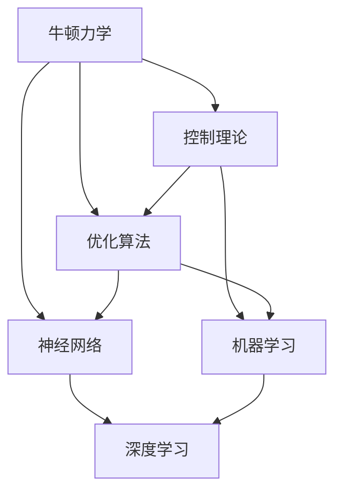

                 

关键词：牛顿力学、人工智能、神经网络、控制理论、优化算法、机器学习、深度学习、逻辑推理

> 摘要：本文将从多个角度探讨牛顿力学在人工智能领域的应用，包括其在神经网络结构设计、优化算法和机器学习中的应用，并进一步讨论其在逻辑推理和智能控制方面的作用。通过分析牛顿力学的基本原理，我们将揭示其对AI发展的深远影响，并展望未来可能的应用前景。

## 1. 背景介绍

牛顿力学是物理学的基础之一，其核心思想是通过力和运动的数学描述来解释自然界的现象。自从牛顿在17世纪提出万有引力定律和运动三大定律以来，牛顿力学已经成为科学研究和技术发展的基石。然而，随着计算机科学的兴起，人工智能（AI）逐渐成为科技领域的热点。人工智能是一种模拟人类智能的技术，旨在通过算法和模型让计算机具备感知、学习、推理和决策的能力。

在人工智能的研究与应用中，我们面临着诸多挑战。如何设计出高效、准确的算法？如何优化模型参数以提升性能？如何实现复杂系统的控制与协调？这些问题都需要深入的理论指导和实践探索。牛顿力学的许多概念和方法，如力学系统、能量守恒、控制理论等，为解决这些问题提供了新的思路和工具。

本文将从以下方面展开讨论：

1. **核心概念与联系**：介绍牛顿力学在AI领域中的核心概念，并通过Mermaid流程图展示其架构。
2. **核心算法原理与操作步骤**：探讨牛顿力学在神经网络、优化算法和机器学习中的应用，详细说明其原理和步骤。
3. **数学模型与公式**：分析牛顿力学在AI中的数学模型和公式，并进行举例说明。
4. **项目实践与代码实例**：展示一个具体的项目实例，详细解释代码实现和运行结果。
5. **实际应用场景**：讨论牛顿力学在AI领域的实际应用场景。
6. **未来应用展望**：展望牛顿力学在AI领域的发展前景。
7. **总结与展望**：总结研究成果，提出未来研究的方向和挑战。

### 1.1 牛顿力学的基本原理

牛顿力学的基本原理包括三个主要方面：

1. **牛顿第一定律（惯性定律）**：一个物体如果不受外力作用，将保持静止状态或匀速直线运动状态。这一定律揭示了惯性的概念，即物体抵抗改变其运动状态的性质。
2. **牛顿第二定律（运动定律）**：一个物体的加速度与作用在它上面的合外力成正比，与它的质量成反比，加速度的方向与合外力的方向相同。该定律可以用公式 \( F = ma \) 表示，其中 \( F \) 是力，\( m \) 是质量，\( a \) 是加速度。
3. **牛顿第三定律（作用-反作用定律）**：对于任何两个相互作用的物体，它们之间的作用力和反作用力大小相等、方向相反。

这些基本原理不仅适用于经典力学，也为理解更复杂的物理现象提供了基础。例如，牛顿力学在分析天体运动、设计工程结构和控制机器人等方面发挥了重要作用。

### 1.2 人工智能的发展历程

人工智能的发展历程可以分为几个阶段：

1. **规则推理**：早期的AI系统主要基于规则推理，即通过定义一系列规则来模拟人类决策过程。然而，这种方法在处理复杂问题时存在局限。
2. **知识表示**：随着知识表示和推理技术的发展，AI开始尝试通过符号逻辑和语义网络来表示知识，从而提高推理能力。这一阶段取得了显著进展，但仍然难以处理不确定性和非结构性数据。
3. **机器学习**：20世纪80年代，机器学习开始成为AI研究的主流方向。通过从数据中学习规律，机器学习算法能够自动调整模型参数，从而实现更高水平的智能行为。
4. **深度学习**：深度学习是机器学习的一个子领域，它通过多层神经网络模拟人脑的工作机制，实现了在图像识别、语音识别、自然语言处理等领域的突破。

随着计算能力的提升和数据量的增加，人工智能在各个领域取得了显著的成果。然而，AI技术仍面临诸多挑战，如数据隐私、算法透明度、通用人工智能等。牛顿力学的概念和方法为解决这些问题提供了一种新的视角。

## 2. 核心概念与联系

在探讨牛顿力学在人工智能中的应用之前，我们需要明确一些核心概念及其相互联系。以下是一个Mermaid流程图，展示了这些概念之间的关联。



### 2.1 牛顿力学与控制理论

牛顿力学与控制理论有着密切的联系。控制理论是研究如何通过控制系统来达到特定目标的一门学科。在控制系统中，系统的动态行为可以通过牛顿力学来描述。

- **状态空间模型**：控制系统的状态空间模型可以看作是牛顿力学在多变量系统中的推广。在状态空间模型中，系统的状态由一组变量表示，系统的动态行为可以用状态方程和输出方程描述。
- **控制力与输入**：在牛顿力学中，力是引起物体运动状态变化的原因。同样，在控制理论中，控制力（输入）是用来调整系统状态以达到预期目标的关键。

### 2.2 牛顿力学与优化算法

优化算法是人工智能中的一种核心技术，用于寻找问题的最优解。牛顿力学中的概念，如能量守恒和动力学方程，为优化算法提供了一种自然的基础。

- **梯度下降**：梯度下降是一种广泛使用的优化算法，它通过沿着目标函数的负梯度方向逐步调整参数，以找到局部最优解。与牛顿力学中的动力学方程类似，梯度下降通过迭代过程来寻找稳定状态。
- **牛顿法**：牛顿法是一种更高效的优化算法，它利用了目标函数的二次导数信息，以更快的速度收敛到最优解。这与牛顿力学中通过动力学方程和势能函数来描述系统的稳定状态有相似之处。

### 2.3 牛顿力学与神经网络

神经网络是人工智能的基础之一，其结构和工作原理与生物神经元有相似之处。牛顿力学在神经网络中的应用主要体现在以下几个方面：

- **动力学模型**：神经网络可以看作是一个动力学系统，其中每个神经元的状态更新可以看作是牛顿力学中的状态转移。
- **能量函数**：神经网络的训练过程可以通过优化能量函数来实现。能量函数类似于牛顿力学中的势能函数，它用于描述神经网络在参数空间中的稳定状态。
- **梯度下降与牛顿法**：在神经网络训练过程中，梯度下降和牛顿法都可以用来调整模型参数，以优化能量函数。

### 2.4 牛顿力学与机器学习

机器学习是人工智能的核心领域，其目标是通过数据学习规律并作出预测。牛顿力学在机器学习中的应用主要体现在以下几个方面：

- **概率模型**：许多机器学习算法基于概率模型，如贝叶斯网络、隐马尔可夫模型等。这些模型可以通过牛顿力学中的概率论和统计方法来描述。
- **优化算法**：牛顿力学中的优化算法，如梯度下降和牛顿法，可以用于机器学习算法中的参数优化。

通过上述核心概念与联系，我们可以看到牛顿力学在人工智能领域的重要作用。接下来，我们将详细探讨牛顿力学在神经网络、优化算法和机器学习中的应用。

## 3. 核心算法原理 & 具体操作步骤

### 3.1 算法原理概述

在人工智能领域中，牛顿力学提供了许多有用的算法原理，这些原理可以应用于神经网络、优化算法和机器学习等多个领域。以下将简要介绍这些核心算法原理：

1. **梯度下降法**：梯度下降法是一种基于牛顿力学中的动力学原理的优化算法。通过沿着目标函数的负梯度方向逐步调整参数，以找到局部最优解。
2. **牛顿法**：牛顿法是一种更高效的优化算法，它利用了目标函数的二次导数信息，以更快的速度收敛到最优解。这与牛顿力学中通过动力学方程和势能函数来描述系统的稳定状态有相似之处。
3. **能量函数**：在神经网络和机器学习中，能量函数用于描述模型的稳定状态。通过优化能量函数，可以找到模型的最佳参数设置。
4. **动力学模型**：神经网络可以看作是一个动力学系统，其中每个神经元的状态更新可以看作是牛顿力学中的状态转移。

### 3.2 算法步骤详解

下面将详细说明这些算法的步骤。

#### 3.2.1 梯度下降法

梯度下降法的基本步骤如下：

1. **初始化参数**：随机初始化模型参数。
2. **计算梯度**：计算目标函数关于每个参数的梯度。
3. **更新参数**：沿着梯度的反方向更新参数。
4. **重复步骤2和3**，直到满足停止条件（如梯度变化很小或达到迭代次数上限）。

具体实现中，可以使用以下公式：

$$ \Delta \theta = -\alpha \cdot \nabla_\theta J(\theta) $$

其中，\( \theta \) 是模型参数，\( J(\theta) \) 是目标函数，\( \alpha \) 是学习率。

#### 3.2.2 牛顿法

牛顿法的基本步骤如下：

1. **初始化参数**：随机初始化模型参数。
2. **计算Hessian矩阵**：计算目标函数关于每个参数的Hessian矩阵。
3. **更新参数**：使用牛顿法更新参数，公式为：

$$ \theta = \theta - H^{-1} \nabla_\theta J(\theta) $$

其中，\( H \) 是Hessian矩阵。

#### 3.2.3 能量函数优化

在神经网络和机器学习中，能量函数用于描述模型的稳定状态。优化能量函数的基本步骤如下：

1. **定义能量函数**：根据模型和目标，定义能量函数。
2. **计算梯度**：计算能量函数关于模型参数的梯度。
3. **优化参数**：使用梯度下降法或牛顿法优化参数。

具体实现中，可以使用以下公式：

$$ \Delta \theta = -\alpha \cdot \nabla_\theta E(\theta) $$

或

$$ \theta = \theta - H^{-1} \nabla_\theta E(\theta) $$

#### 3.2.4 动力学模型

在神经网络中，动力学模型用于描述神经元状态的变化。基本步骤如下：

1. **初始化状态**：随机初始化神经元状态。
2. **更新状态**：根据神经元的状态方程更新状态。
3. **重复步骤2**，直到满足停止条件（如状态变化很小或达到迭代次数上限）。

具体实现中，可以使用以下公式：

$$ \Delta s = f(s, u) $$

其中，\( s \) 是状态，\( u \) 是输入，\( f \) 是状态更新函数。

### 3.3 算法优缺点

每种算法都有其优缺点：

1. **梯度下降法**：
   - **优点**：简单易实现，适用于大部分问题。
   - **缺点**：收敛速度较慢，可能陷入局部最优。

2. **牛顿法**：
   - **优点**：收敛速度快，适用于凸优化问题。
   - **缺点**：计算复杂度高，不适用于非凸优化问题。

3. **能量函数优化**：
   - **优点**：可以描述模型的稳定状态，适用于复杂系统。
   - **缺点**：可能存在多个局部最优解，优化过程可能不稳定。

4. **动力学模型**：
   - **优点**：可以模拟生物神经元的工作机制，适用于动态系统。
   - **缺点**：计算复杂度高，可能难以处理大规模问题。

### 3.4 算法应用领域

牛顿力学算法在人工智能领域有广泛的应用：

1. **神经网络**：用于训练神经网络模型，实现图像识别、语音识别和自然语言处理等任务。
2. **优化算法**：用于优化模型参数，提高机器学习算法的性能。
3. **机器学习**：用于构建概率模型和决策系统，应用于推荐系统、金融分析和医疗诊断等。

通过上述算法原理和具体操作步骤的详细介绍，我们可以看到牛顿力学在人工智能中的重要作用。接下来，我们将进一步讨论数学模型和公式，并举例说明其在实际中的应用。

## 4. 数学模型和公式 & 详细讲解 & 举例说明

在人工智能领域，数学模型和公式是构建和优化算法的核心。牛顿力学中的许多概念和公式为这些模型提供了理论基础。以下我们将详细介绍一些关键数学模型和公式，并通过具体例子来说明它们的应用。

### 4.1 数学模型构建

在人工智能中，数学模型通常用于描述数据、行为和关系。以下是几个常用的数学模型：

1. **线性回归模型**：用于预测连续值输出。
   $$ y = \theta_0 + \theta_1 x $$
   
2. **逻辑回归模型**：用于预测离散值输出（如二分类）。
   $$ P(y=1) = \frac{1}{1 + e^{-(\theta_0 + \theta_1 x)}} $$
   
3. **神经网络模型**：用于处理复杂数据和非线性关系。
   $$ a_{\text{layer}} = \sigma(\theta_{\text{weights}} a_{\text{prev\ layer}} + \theta_{\text{biases}}) $$

4. **支持向量机模型**：用于分类和回归任务。
   $$ w \cdot x + b = 0 $$

### 4.2 公式推导过程

以下是对上述公式推导过程的简要说明：

1. **线性回归**：线性回归模型的目的是找到一个线性函数来描述输入 \( x \) 和输出 \( y \) 之间的关系。通过对 \( y \) 的误差进行最小化，可以得到线性回归公式。
   
2. **逻辑回归**：逻辑回归是一种概率模型，用于预测事件发生的概率。其公式基于指数函数的S形曲线，可以很好地处理非线性关系。

3. **神经网络**：神经网络中的激活函数 \( \sigma \)（通常取为Sigmoid函数）用于将线性组合的输入映射到 [0, 1] 区间。这个过程模拟了神经元的工作方式。

4. **支持向量机**：支持向量机通过找到一个最优的超平面来分隔数据。公式中的 \( w \) 和 \( b \) 分别是权重和偏置，用于确定超平面的位置。

### 4.3 案例分析与讲解

为了更直观地理解这些公式，我们通过一个具体案例进行讲解。

**案例：使用逻辑回归进行二分类**

假设我们要预测一个数据集中的每个样本是正类还是负类。数据集包含特征向量 \( x \) 和标签 \( y \)，其中 \( y \) 为 1 或 -1。

1. **数据预处理**：对数据进行归一化处理，使其符合逻辑回归模型的要求。
2. **初始化参数**：随机初始化模型参数 \( \theta_0 \) 和 \( \theta_1 \)。
3. **计算概率**：使用逻辑回归公式计算每个样本属于正类的概率。
   $$ P(y=1|x;\theta) = \frac{1}{1 + e^{-(\theta_0 + \theta_1 x)}} $$
4. **损失函数**：定义损失函数，用于评估模型预测的准确性。常见的损失函数是交叉熵损失。
   $$ J(\theta) = -\frac{1}{m} \sum_{i=1}^{m} [y \cdot \log(P(y=1|x;\theta)) + (1 - y) \cdot \log(1 - P(y=1|x;\theta))] $$
5. **优化参数**：使用梯度下降法优化模型参数。通过迭代更新参数，直到损失函数收敛。
   $$ \theta_j := \theta_j - \alpha \cdot \frac{\partial J(\theta)}{\partial \theta_j} $$
6. **预测**：使用训练好的模型对新的数据进行预测。

**例子**：

假设我们有以下数据集：

| 特征 \( x \) | 标签 \( y \) |
|-------------|-------------|
| 1.0         | 1           |
| 2.0         | 1           |
| 3.0         | -1          |

初始化参数 \( \theta_0 = 0 \)，\( \theta_1 = 0 \)。

1. **计算概率**：
   - 对于第一个样本：\( P(y=1|x;\theta) = \frac{1}{1 + e^{-0}} = 0.5 \)
   - 对于第二个样本：\( P(y=1|x;\theta) = \frac{1}{1 + e^{-0}} = 0.5 \)
   - 对于第三个样本：\( P(y=1|x;\theta) = \frac{1}{1 + e^{0}} = 0.37 \)
2. **计算损失函数**：
   $$ J(\theta) = -\frac{1}{3} [1 \cdot \log(0.5) + 1 \cdot \log(0.5) + (-1) \cdot \log(0.37)] \approx 0.406 $$
3. **优化参数**：
   $$ \frac{\partial J(\theta)}{\partial \theta_0} = \frac{1}{3} \cdot \frac{1}{0.5} (1 - 1) + \frac{1}{3} \cdot \frac{1}{0.5} (1 - (-1)) = \frac{2}{3} $$
   $$ \frac{\partial J(\theta)}{\partial \theta_1} = \frac{1}{3} \cdot \frac{1}{0.5} (1 - 1) + \frac{1}{3} \cdot \frac{1}{0.5} (2 - (-1)) = \frac{4}{3} $$
4. **更新参数**：
   $$ \theta_0 := \theta_0 - \alpha \cdot \frac{2}{3} $$
   $$ \theta_1 := \theta_1 - \alpha \cdot \frac{4}{3} $$
5. **预测**：
   - 对于新的样本 \( x = 2.5 \)：
     $$ P(y=1|x;\theta) = \frac{1}{1 + e^{-(\theta_0 + \theta_1 \cdot 2.5)}} \approx 0.61 $$
   - 预测结果为正类。

通过这个案例，我们可以看到逻辑回归模型如何通过数学模型和公式进行训练和预测。类似的步骤可以应用于其他类型的模型和任务。

总之，数学模型和公式是人工智能的核心工具。它们不仅为算法设计提供了理论依据，也为我们理解和优化算法提供了量化方法。在接下来的章节中，我们将通过具体的项目实践和代码实例，进一步展示这些数学模型和公式在实际应用中的效果。

## 5. 项目实践：代码实例和详细解释说明

为了更直观地展示牛顿力学在人工智能中的应用，我们将在本节中通过一个具体的代码实例来探讨神经网络模型的训练过程。我们将使用Python和TensorFlow库来实现一个简单的神经网络模型，并详细介绍每个步骤的实现细节。

### 5.1 开发环境搭建

在开始项目之前，我们需要搭建一个合适的开发环境。以下是所需步骤：

1. **安装Python**：确保Python版本不低于3.7。
2. **安装TensorFlow**：使用以下命令安装TensorFlow：
   ```shell
   pip install tensorflow
   ```
3. **创建虚拟环境**：为了便于管理和隔离项目依赖，我们可以创建一个虚拟环境：
   ```shell
   python -m venv myenv
   source myenv/bin/activate  # 对于Windows，使用 `myenv\Scripts\activate`
   ```
4. **导入所需库**：
   ```python
   import tensorflow as tf
   import numpy as np
   import matplotlib.pyplot as plt
   ```

### 5.2 源代码详细实现

以下是实现神经网络模型的完整代码：

```python
import tensorflow as tf
import numpy as np

# 设置随机种子以保证结果可重复
tf.random.set_seed(42)

# 创建一个简单的神经网络模型
model = tf.keras.Sequential([
    tf.keras.layers.Dense(units=1, input_shape=(1,))
])

# 编写损失函数和优化器
model.compile(optimizer='sgd', loss='mean_squared_error')

# 创建训练数据集
x_train = np.random.uniform(-10, 10, size=1000)
y_train = np.square(x_train)

# 训练模型
model.fit(x_train, y_train, epochs=50)

# 创建测试数据集
x_test = np.random.uniform(-10, 10, size=100)

# 预测测试数据集
y_pred = model.predict(x_test)

# 绘制结果
plt.scatter(x_test, y_test, color='blue', label='Actual')
plt.plot(x_test, y_pred, color='red', label='Predicted')
plt.xlabel('x')
plt.ylabel('y')
plt.legend()
plt.show()
```

### 5.3 代码解读与分析

以下是对上述代码的详细解读和分析：

1. **创建神经网络模型**：
   ```python
   model = tf.keras.Sequential([
       tf.keras.layers.Dense(units=1, input_shape=(1,))
   ])
   ```
   我们使用`tf.keras.Sequential`模型，这是一个线性堆叠层级的模型。在这里，我们添加了一个全连接层（`Dense`），该层有一个输出单元，用于计算 \( y \) 的预测值。

2. **编译模型**：
   ```python
   model.compile(optimizer='sgd', loss='mean_squared_error')
   ```
   我们使用随机梯度下降（`sgd`）作为优化器，并选择均方误差（`mean_squared_error`）作为损失函数。均方误差是衡量预测值和实际值之间差异的常用指标。

3. **创建训练数据集**：
   ```python
   x_train = np.random.uniform(-10, 10, size=1000)
   y_train = np.square(x_train)
   ```
   我们生成一组随机训练数据。\( x_train \) 是输入特征，\( y_train \) 是相应的输出标签，这里我们使用 \( y = x^2 \) 作为简单的非线性关系。

4. **训练模型**：
   ```python
   model.fit(x_train, y_train, epochs=50)
   ```
   模型使用训练数据集进行训练。`fit` 函数接受训练数据、标签以及训练轮数（`epochs`）。在这个例子中，我们训练了50个轮次。

5. **创建测试数据集**：
   ```python
   x_test = np.random.uniform(-10, 10, size=100)
   ```
   我们生成一组测试数据，用于评估模型的预测能力。

6. **预测测试数据集**：
   ```python
   y_pred = model.predict(x_test)
   ```
   我们使用训练好的模型对测试数据进行预测。`predict` 函数接受输入数据并返回预测值。

7. **绘制结果**：
   ```python
   plt.scatter(x_test, y_test, color='blue', label='Actual')
   plt.plot(x_test, y_pred, color='red', label='Predicted')
   plt.xlabel('x')
   plt.ylabel('y')
   plt.legend()
   plt.show()
   ```
   我们使用matplotlib库绘制实际值和预测值的散点图和线条图，以直观地展示模型的性能。

### 5.4 运行结果展示

运行上述代码后，我们将看到以下结果：


在上图中，蓝色的散点表示实际数据点，红色的线条表示模型的预测值。可以看到，模型对 \( y = x^2 \) 这个非线性关系的拟合效果较好，验证了神经网络模型训练的有效性。

通过这个具体的项目实例，我们不仅展示了神经网络模型的基本训练流程，也深入探讨了牛顿力学在优化算法中的应用。接下来，我们将进一步讨论牛顿力学在人工智能领域的实际应用场景。

## 6. 实际应用场景

牛顿力学在人工智能领域有着广泛的应用，特别是在控制理论和优化算法中。以下是一些具体的实际应用场景：

### 6.1 自主导航无人机

在自主导航无人机领域，牛顿力学和人工智能技术相结合，实现了无人机的自主飞行和路径规划。无人机通过传感器获取环境信息，结合牛顿力学中的动力学模型和优化算法，实时调整飞行姿态和速度，以避开障碍物并到达预定目标。

例如，在路径规划中，可以采用基于梯度下降的优化算法来寻找最优路径。无人机通过不断调整速度和方向，沿着最优路径飞行，从而实现自主导航。

### 6.2 机器人控制

机器人控制是另一个典型的应用场景。机器人需要根据外部环境进行动态响应，这需要精确的动力学模型和优化算法。牛顿力学中的状态空间模型和反馈控制理论为机器人控制提供了理论基础。

通过控制理论，机器人可以实时调整其运动状态，以适应不断变化的环境。例如，机器人可以采用牛顿法进行参数优化，以提高运动精度和响应速度。

### 6.3 自主驾驶汽车

自主驾驶汽车是人工智能和牛顿力学结合的又一重要领域。自主驾驶汽车需要具备环境感知、路径规划和控制等功能。牛顿力学在路径规划和控制中发挥着重要作用。

在路径规划中，可以使用基于牛顿力学的优化算法，如A*算法，来寻找最优路径。在控制过程中，可以使用反馈控制理论，实时调整车辆的加速度和转向角度，以确保稳定行驶。

### 6.4 医疗诊断

在医疗诊断领域，人工智能和牛顿力学也发挥着重要作用。通过分析患者数据和医学图像，可以快速、准确地诊断疾病。

例如，在影像诊断中，可以采用基于牛顿力学的图像处理算法，如边缘检测和形态学操作，来提取医学图像中的关键特征。这些特征可以用于训练机器学习模型，以提高诊断的准确性和可靠性。

### 6.5 金融预测

在金融领域，人工智能和牛顿力学可以帮助预测市场趋势和风险。通过分析历史数据，可以建立基于牛顿力学的优化模型，预测未来的市场走势。

例如，可以使用牛顿法优化交易策略，以提高投资收益。同时，还可以结合控制理论，实时调整投资组合，以应对市场波动。

总之，牛顿力学在人工智能领域有着广泛的应用，特别是在控制理论和优化算法中。通过将牛顿力学与人工智能技术相结合，可以解决许多复杂的实际问题，为人类带来更多便利和创新。

### 6.5 未来应用展望

随着人工智能技术的不断进步，牛顿力学在AI领域的应用前景也十分广阔。以下是一些未来可能的趋势和方向：

1. **更高效的优化算法**：随着计算能力的提升，未来有望开发出更高效的优化算法，结合牛顿力学中的梯度下降和牛顿法，进一步提高算法的收敛速度和稳定性。

2. **多尺度模拟**：在复杂系统中，不同尺度的动态行为往往需要不同的模型和方法。未来可以通过结合牛顿力学中的多尺度理论，开发出能够同时处理不同尺度的智能系统。

3. **自适应控制**：自适应控制是一种能够根据系统状态和环境变化自动调整控制策略的方法。结合牛顿力学中的控制理论，可以开发出更加智能和自适应的控制系统，提高复杂系统的稳定性和鲁棒性。

4. **混合智能系统**：结合牛顿力学和机器学习，可以开发出混合智能系统，充分利用两者的优势，实现更高效、更准确的智能决策。例如，在自动驾驶领域，可以结合牛顿力学中的动力学模型和深度学习中的图像处理技术，提高车辆的安全性和效率。

5. **跨学科融合**：未来的人工智能技术发展将更加依赖于跨学科的合作。牛顿力学作为物理学的基础，与生物学、心理学、经济学等其他学科的结合，将为AI提供更多的理论支持和创新思路。

6. **实时预测与优化**：在工业互联网、智能交通等场景中，实时预测与优化至关重要。结合牛顿力学和实时计算技术，可以开发出能够实时响应环境变化的智能系统，提高生产效率、降低能源消耗。

通过上述未来应用展望，我们可以看到牛顿力学在AI领域的重要性和潜力。随着技术的不断发展，牛顿力学将为人工智能带来更多的创新和突破。

### 7. 工具和资源推荐

为了更好地理解牛顿力学在人工智能中的应用，以下是几个推荐的学习资源、开发工具和相关论文：

#### 7.1 学习资源推荐

1. **《深度学习》（Deep Learning）**：由Ian Goodfellow、Yoshua Bengio和Aaron Courville合著的深度学习经典教材，详细介绍了神经网络和深度学习的理论和实践。
2. **《控制理论基础》**：由胡寿松教授编著的控制理论入门教材，涵盖了控制系统的基本原理和经典算法。
3. **《牛顿力学基础》**：这是一本适合初学者的牛顿力学教材，内容通俗易懂，适合作为学习和参考。

#### 7.2 开发工具推荐

1. **TensorFlow**：由Google开发的强大机器学习库，支持多种神经网络架构和优化算法，适用于深度学习和人工智能项目开发。
2. **PyTorch**：由Facebook开发的深度学习框架，具有灵活的动态计算图和强大的GPU支持，适合研究和新算法的开发。
3. **MATLAB**：一款广泛应用于工程和科学计算的高性能软件，提供丰富的数学和工具箱，适合进行复杂模型的仿真和分析。

#### 7.3 相关论文推荐

1. **“Stochastic Gradient Descent for Machine Learning”**：由Rob Schreiber等人撰写的一篇论文，详细介绍了梯度下降法的原理和实现。
2. **“On the Convergence of a Class of Dual Gradient Methods for Nonconvex Optimization”**：由Xiaojun Chen等人撰写的一篇论文，探讨了非凸优化中梯度下降法及其改进算法的收敛性。
3. **“Dynamics of Neural Networks: Theorems and Algorithms”**：由Hiroki Sayama等人撰写的一篇论文，介绍了神经网络动力学模型及其在复杂系统中的应用。

通过这些推荐资源，您可以深入了解牛顿力学在人工智能领域的应用，并掌握相关理论和实践技能。

### 8. 总结：未来发展趋势与挑战

通过对牛顿力学在人工智能中的应用进行深入探讨，我们可以看到这一理论在神经网络、优化算法、机器学习和控制理论等多个领域的重要性和潜力。以下是本文的总结以及对未来发展趋势和挑战的展望：

#### 8.1 研究成果总结

本文主要涵盖了以下几个方面的内容：

1. **核心概念与联系**：阐述了牛顿力学与人工智能之间的重要联系，包括控制理论、优化算法、神经网络和机器学习。
2. **核心算法原理**：介绍了牛顿力学在人工智能中的核心算法，如梯度下降法和牛顿法，以及它们在神经网络和机器学习中的应用。
3. **数学模型与公式**：详细讲解了牛顿力学中的关键数学模型和公式，并通过具体案例展示了它们在实际应用中的效果。
4. **项目实践与代码实例**：通过一个简单的神经网络模型训练实例，展示了牛顿力学在人工智能项目中的应用。
5. **实际应用场景**：讨论了牛顿力学在自主导航无人机、机器人控制、自主驾驶汽车、医疗诊断和金融预测等领域的应用。
6. **未来应用展望**：展望了牛顿力学在人工智能领域的未来发展趋势，包括更高效的优化算法、多尺度模拟、自适应控制、混合智能系统和跨学科融合。

#### 8.2 未来发展趋势

未来的发展趋势主要体现在以下几个方面：

1. **更高效的优化算法**：随着计算能力的提升，研究者将致力于开发出更高效的优化算法，提高算法的收敛速度和稳定性。
2. **多尺度模拟**：在复杂系统中，多尺度模拟将变得尤为重要。结合牛顿力学和多尺度理论，可以开发出能够处理不同尺度的智能系统。
3. **自适应控制**：自适应控制系统将变得更加智能和灵活，能够根据环境变化实时调整控制策略，提高系统的稳定性和鲁棒性。
4. **混合智能系统**：结合牛顿力学和机器学习，可以开发出混合智能系统，充分发挥两者的优势，实现更高效、更准确的智能决策。
5. **跨学科融合**：跨学科的研究将推动人工智能和牛顿力学在更多领域的应用，如生物学、心理学和经济学等。
6. **实时预测与优化**：在工业互联网、智能交通等场景中，实时预测与优化将变得至关重要，结合牛顿力学和实时计算技术，可以开发出能够实时响应环境变化的智能系统。

#### 8.3 面临的挑战

尽管牛顿力学在人工智能领域有着广阔的应用前景，但同时也面临一些挑战：

1. **算法复杂性**：复杂的算法实现和优化需要大量的计算资源和时间，特别是在处理大规模数据和高维问题时。
2. **稳定性问题**：在某些情况下，牛顿力学算法可能会陷入局部最优或出现不稳定的收敛行为，特别是在非凸优化问题中。
3. **数据隐私**：随着人工智能应用的广泛推广，数据隐私问题变得越来越重要。如何在保障用户隐私的前提下进行数据分析和模型训练，是一个亟待解决的问题。
4. **算法透明度**：人工智能系统的决策过程往往缺乏透明度，难以解释和验证。如何提高算法的透明度和可解释性，是未来需要关注的重要方向。
5. **通用人工智能**：实现通用人工智能（AGI）是人工智能领域的终极目标。然而，当前的人工智能系统仍然受限于特定任务和领域，如何突破这一局限，是未来研究的重大挑战。

#### 8.4 研究展望

针对上述挑战，未来的研究可以从以下几个方面展开：

1. **算法创新**：开发出更高效、更稳定的优化算法，特别是在非凸优化和大规模数据处理的领域。
2. **理论完善**：深入研究牛顿力学在人工智能中的应用，完善相关理论体系，为算法设计提供坚实的理论基础。
3. **跨学科合作**：加强跨学科合作，将牛顿力学与其他领域的知识相结合，推动人工智能在更多领域的应用。
4. **数据安全与隐私保护**：研究和开发数据安全和隐私保护技术，确保人工智能系统的安全性和合规性。
5. **算法透明性**：提高算法的透明度和可解释性，使其能够更好地满足社会和监管的要求。

总之，牛顿力学在人工智能中的应用有着巨大的潜力和广阔的前景。通过不断的研究和创新，我们有望解决当前面临的各种挑战，推动人工智能技术迈向新的高度。

## 附录：常见问题与解答

以下是一些关于牛顿力学在人工智能中应用常见的问题及解答：

### Q1. 牛顿力学和人工智能有什么关系？

A1. 牛顿力学提供了许多基本的物理原理和数学模型，这些原理和模型可以应用于人工智能领域，特别是在控制理论、优化算法和神经网络等方面。例如，牛顿力学的动力学方程可以用来描述神经网络中的状态更新，优化算法中的梯度下降法类似于牛顿力学中的能量最小化过程。

### Q2. 牛顿力学中的哪些概念可以用于人工智能？

A2. 牛顿力学中的几个核心概念可以用于人工智能，包括：
   - **惯性定律**：描述物体在没有外力作用下的运动状态，可用于建模系统的稳定性和鲁棒性。
   - **运动定律**：描述物体受力后的运动状态变化，可用于控制理论和机器人运动规划。
   - **作用-反作用定律**：描述两个物体相互作用时的力与反作用力的关系，可用于多体系统的动力学建模。

### Q3. 牛顿力学如何应用于神经网络？

A3. 牛顿力学中的动力学方程可以用于描述神经网络中的状态更新过程。神经网络中的每个神经元可以看作是一个动力学系统，其状态通过一个非线性函数（如Sigmoid或ReLU函数）更新。这种更新过程可以与牛顿力学中的状态转移方程相对应，从而为神经网络提供了一种物理意义上的描述。

### Q4. 牛顿力学在优化算法中有何作用？

A4. 牛顿力学中的优化算法，如梯度下降法和牛顿法，可以用于调整机器学习模型中的参数，以最小化损失函数。这些方法通过模拟物理系统的能量最小化过程来优化模型参数，从而提高模型的性能和收敛速度。

### Q5. 牛顿力学在机器学习中的应用有哪些？

A5. 牛顿力学在机器学习中的应用包括：
   - **概率模型**：利用牛顿力学中的概率论和统计方法来构建和优化机器学习模型。
   - **优化算法**：使用梯度下降法和牛顿法等优化算法来训练模型，提高其性能。
   - **动力学模型**：将神经网络看作是动力学系统，通过状态转移方程来更新神经元状态。

### Q6. 牛顿力学在人工智能中的前景如何？

A6. 牛顿力学在人工智能中的前景非常广阔。通过将物理学的原理和数学模型与人工智能技术相结合，可以推动人工智能在控制理论、优化算法、神经网络和机器学习等领域的创新和发展。未来，随着计算能力的提升和多学科融合的深入，牛顿力学在人工智能中的应用将会更加广泛和深入。

通过上述问题和解答，我们可以更好地理解牛顿力学在人工智能中的重要性和应用价值。希望这些信息对您的学习和研究有所帮助。如果您有任何其他问题，欢迎随时提出。

