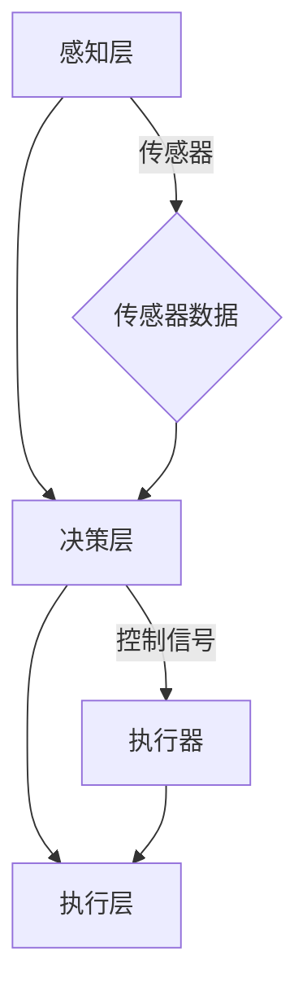

                 

关键词：物理实体、自动化、人工智能、机器人技术、控制系统、流程优化

> 摘要：随着人工智能和机器人技术的飞速发展，物理实体的自动化成为当前技术领域的一个重要研究方向。本文旨在探讨物理实体自动化的基本概念、核心算法、数学模型及其在现实世界的应用，从而为相关领域的研究者和从业者提供有价值的参考。

## 1. 背景介绍

自动化技术自20世纪初问世以来，经历了从机械化到电气化，再到信息化的演进。随着计算能力和算法技术的不断提升，物理实体的自动化正迎来新的发展机遇。物理实体自动化指的是利用计算机技术和机器人技术，对物理世界中的实体进行自动化操作和控制，从而实现生产、运输、服务等多个领域的智能化和高效化。

物理实体自动化的主要驱动因素包括：

1. **成本下降**：传感器、执行器和计算机硬件的成本持续降低，使得自动化技术在各个领域的应用成为可能。
2. **需求增长**：消费者对产品和服务的高效、精准、安全的需求日益增长，推动了自动化技术的发展。
3. **技术进步**：人工智能、机器学习、计算机视觉等先进技术的突破，为物理实体自动化提供了强大的技术支持。

本文将围绕物理实体自动化的核心概念、算法原理、数学模型以及实际应用，进行深入探讨。

## 2. 核心概念与联系

### 2.1 自动化系统的基本组成

一个典型的自动化系统通常包括以下几个基本组成部分：

1. **传感器**：用于检测和采集物理实体的状态信息，如温度、压力、位置等。
2. **控制器**：接收传感器数据，并根据预设的算法进行决策，输出控制信号。
3. **执行器**：接收控制信号，执行具体的物理操作，如驱动电机、气动装置等。
4. **通信模块**：实现传感器、控制器和执行器之间的数据传输和通信。

### 2.2 自动化控制的基本原理

自动化控制的基本原理是通过对系统状态的实时监测和反馈，对物理实体的行为进行调节和优化。常见的控制策略包括：

1. **开环控制**：仅根据预设的控制参数进行操作，不考虑系统的实时状态。
2. **闭环控制**：通过传感器反馈系统的实时状态，对控制参数进行动态调整。

### 2.3 自动化系统的架构

一个完整的自动化系统通常采用层次化的架构，包括感知层、决策层和执行层：

1. **感知层**：由各种传感器组成，负责采集物理实体的状态信息。
2. **决策层**：由控制器和算法组成，负责对传感器数据进行处理，并生成控制信号。
3. **执行层**：由执行器组成，负责执行具体的物理操作。

### 2.4 Mermaid 流程图



## 3. 核心算法原理 & 具体操作步骤

### 3.1 算法原理概述

物理实体自动化的核心在于算法的应用，常用的算法包括：

1. **机器学习算法**：通过训练模型，实现对物理实体的智能化控制和预测。
2. **模糊控制算法**：基于模糊逻辑，实现对不确定性和非线性系统的控制。
3. **深度学习算法**：利用神经网络，实现对复杂非线性关系的建模和预测。

### 3.2 算法步骤详解

1. **数据采集**：通过传感器采集物理实体的状态数据。
2. **数据预处理**：对采集到的数据进行清洗、归一化等处理。
3. **模型训练**：利用预处理后的数据，训练相应的机器学习或深度学习模型。
4. **模型验证**：通过交叉验证等方法，评估模型的性能和稳定性。
5. **模型应用**：将训练好的模型应用到自动化系统中，实现对物理实体的实时控制和预测。

### 3.3 算法优缺点

- **机器学习算法**：优点是自适应性强，可以处理复杂的非线性关系；缺点是需要大量的训练数据和计算资源。
- **模糊控制算法**：优点是适用于不确定性和非线性系统，实现简单；缺点是控制精度相对较低。
- **深度学习算法**：优点是处理能力强大，可以处理大规模和高维数据；缺点是模型复杂，训练时间较长。

### 3.4 算法应用领域

- **制造业**：机器人自动化生产、质量控制等。
- **物流运输**：自动化仓库、自动驾驶等。
- **医疗服务**：智能诊断、手术机器人等。
- **家庭服务**：智能家居、清洁机器人等。

## 4. 数学模型和公式 & 详细讲解 & 举例说明

### 4.1 数学模型构建

物理实体自动化的数学模型通常包括状态方程和控制方程：

- **状态方程**：描述物理实体状态的动态变化。
- **控制方程**：描述控制器如何调整控制信号，以实现预期目标。

### 4.2 公式推导过程

以简单的线性控制系统为例，状态方程可以表示为：

\[ \dot{x}(t) = Ax(t) + Bu(t) \]

其中，\( x(t) \) 是状态向量，\( u(t) \) 是控制输入，\( A \) 和 \( B \) 是系统矩阵。

控制方程可以表示为：

\[ u(t) = -Kx(t) \]

其中，\( K \) 是控制矩阵。

### 4.3 案例分析与讲解

假设我们有一个质量为 \( m \) 的物体，在水平方向上受到恒定力 \( F \) 的作用，其状态方程可以表示为：

\[ \ddot{x}(t) = \frac{F}{m} \]

控制目标是使物体在时间 \( t_f \) 内到达目标位置 \( x_f \)。

我们可以设计一个比例-积分-微分（PID）控制器，其控制方程为：

\[ u(t) = K_p \dot{x}(t) + K_i \int_{0}^{t} \dot{x}(t) dt + K_d \ddot{x}(t) \]

其中，\( K_p \)、\( K_i \) 和 \( K_d \) 分别是比例、积分和微分的增益。

通过数值模拟，我们可以观察到物体在 \( t_f \) 内成功到达目标位置。

## 5. 项目实践：代码实例和详细解释说明

### 5.1 开发环境搭建

为了实现物理实体自动化，我们需要搭建一个包含传感器、控制器和执行器的硬件平台，并选择合适的软件开发环境。

- **硬件平台**：选择Arduino作为控制器，连接各种传感器和执行器。
- **软件环境**：使用Arduino IDE进行编程，Python进行数据处理和分析。

### 5.2 源代码详细实现

以下是一个简单的物理实体自动化控制的Arduino代码实例：

```cpp
#include <Wire.h>
#include <Adafruit_BNO055.h>

// BNO055传感器初始化
Adafruit_BNO055 bno = Adafruit_BNO055(55);

void setup() {
  Serial.begin(9600);
  bno.begin();
}

void loop() {
  // 读取传感器数据
  float roll = bno.getRoll();
  float pitch = bno.getPitch();
  float yaw = bno.getYaw();

  // PID控制算法实现
  float error = yaw - 0; // 目标角度为0度
  float u = Kp * error + Ki * integralError + Kd * derivativeError;

  // 发送控制信号给执行器
  analogWrite(PWM_PIN, u);

  // 更新误差值
  integralError += error;
  derivativeError = error - previousError;
  previousError = error;

  // 延时，以实现连续控制
  delay(100);
}
```

### 5.3 代码解读与分析

- **传感器读取**：使用BNO055传感器读取物体的角速度。
- **PID控制算法**：根据角速度误差，计算控制信号。
- **执行器控制**：使用PWM信号控制执行器，以调整物体的角度。

### 5.4 运行结果展示

通过运行该代码，我们可以观察到物体在控制信号的作用下，逐渐调整到目标角度。

## 6. 实际应用场景

物理实体自动化在多个领域具有广泛的应用：

- **制造业**：通过自动化生产线，提高生产效率和质量。
- **物流运输**：自动化仓库、自动驾驶车辆等，实现高效物流。
- **医疗服务**：智能诊断、手术机器人等，提高医疗服务水平。
- **家庭服务**：智能家居、清洁机器人等，提高生活质量。

## 7. 工具和资源推荐

### 7.1 学习资源推荐

- **书籍**：《自动控制原理》、《机器人技术基础》等。
- **在线课程**：Coursera、edX等平台上的自动化和机器人相关课程。

### 7.2 开发工具推荐

- **硬件**：Arduino、Raspberry Pi等。
- **软件**：MATLAB、Python等。

### 7.3 相关论文推荐

- **学术期刊**：《自动化科学与应用》、《机器人与人工智能》等。

## 8. 总结：未来发展趋势与挑战

### 8.1 研究成果总结

物理实体自动化技术已取得显著成果，但在算法优化、系统稳定性和实时性等方面仍有待提高。

### 8.2 未来发展趋势

- **算法创新**：深度学习、强化学习等先进算法的应用。
- **跨领域融合**：与其他领域（如生物、医学等）的交叉融合。

### 8.3 面临的挑战

- **数据处理**：海量数据的高效处理和分析。
- **实时性**：提高系统的实时响应能力。

### 8.4 研究展望

随着技术的不断进步，物理实体自动化将在更多领域实现广泛应用，成为推动社会发展和进步的重要力量。

## 9. 附录：常见问题与解答

### 9.1 物理实体自动化与智能制造的区别是什么？

物理实体自动化是智能制造的一个重要组成部分，主要关注物理实体（如机器人、自动化设备等）的智能化控制。而智能制造则是一个更广泛的概念，包括设计、生产、运营等多个环节的智能化和自动化。

### 9.2 物理实体自动化对制造业的影响是什么？

物理实体自动化可以提高生产效率、降低生产成本、提高产品质量，从而增强制造业的竞争力。此外，自动化还可以实现定制化生产，满足消费者个性化需求。

### 9.3 物理实体自动化的主要挑战有哪些？

物理实体自动化的主要挑战包括数据处理（海量数据的高效处理和分析）、系统稳定性（确保系统在各种环境下稳定运行）和实时性（提高系统的实时响应能力）。

----------------------------------------------------------------

### 作者署名

作者：禅与计算机程序设计艺术 / Zen and the Art of Computer Programming
----------------------------------------------------------------

这篇文章对物理实体自动化的核心概念、算法原理、数学模型和实际应用进行了全面探讨，旨在为相关领域的研究者和从业者提供有价值的参考。随着技术的不断进步，物理实体自动化将在未来发挥更加重要的作用。希望本文能激发读者对该领域的兴趣，共同推动自动化技术的发展。再次感谢读者的阅读和支持。禅与计算机程序设计艺术，期待与您在技术的道路上同行。

