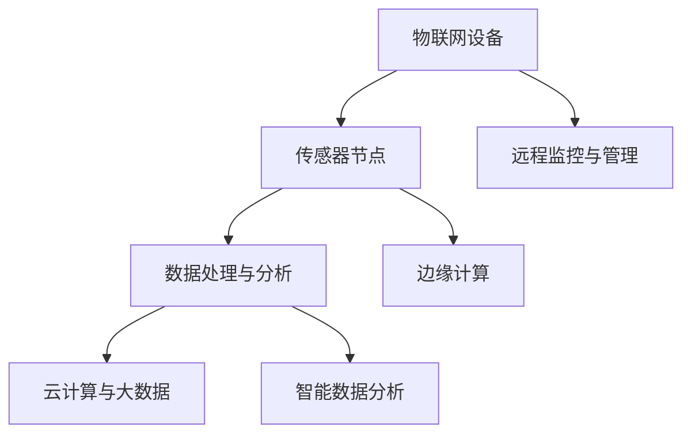

                 

关键词：物联网，传感器，化学物质检测，集成技术，实践应用

> 摘要：本文旨在探讨物联网（IoT）技术与传感器设备的集成，特别是化学物质传感器的实际运用。通过深入分析物联网技术的基础知识、传感器的工作原理以及化学物质传感器的具体应用，本文提供了对化学物质传感器实践运用的全面了解，并探讨了未来的发展趋势和面临的挑战。

## 1. 背景介绍

物联网（Internet of Things，IoT）是一个将各种物理设备通过互联网连接起来，实现智能化管理和数据交换的巨大网络系统。随着互联网、传感器技术、无线通信、人工智能等技术的快速发展，物联网正逐渐渗透到我们生活的各个领域，包括智能家居、智慧城市、工业自动化、医疗健康等。

传感器是物联网的核心组成部分，它们能够感知周围环境中的各种物理量，如温度、湿度、光强、压力、运动等，并将这些信息转化为电信号或其他可处理的形式。传感器的精度和可靠性直接影响到物联网系统的性能和应用范围。

化学物质传感器是一种专门用于检测特定化学物质的传感器，它们在环境保护、食品安全、工业监测、医疗诊断等领域具有广泛的应用。化学物质传感器通过响应化学物质的浓度变化，产生电信号或其他信号，从而实现对化学物质的检测和监测。

## 2. 核心概念与联系

### 2.1 物联网（IoT）技术

物联网技术是一个庞大的网络系统，包括硬件、软件、通信协议和数据管理等多个方面。核心概念包括：

- **物联网设备**：具备连接互联网能力的各种物理设备。
- **传感器网络**：由众多传感器节点组成的网络，负责数据的采集和传输。
- **数据处理与分析**：对传感器采集的数据进行清洗、处理和分析，提取有价值的信息。
- **云计算与大数据**：利用云计算平台对海量数据进行存储、管理和分析。

### 2.2 传感器的工作原理

传感器的工作原理基于各种物理、化学、生物效应，包括：

- **电阻变化**：基于金属、半导体等材料电阻随温度、光照、湿度等变化原理。
- **电容变化**：基于电容器容量随介质变化原理。
- **电导变化**：基于离子导电或电子导电原理。
- **光学效应**：基于光电导、光生伏特效应等原理。

### 2.3 化学物质传感器

化学物质传感器通过以下几种方式实现检测：

- **电化学传感器**：利用电化学反应来检测特定化学物质。
- **光化学传感器**：通过检测化学物质引起的颜色变化。
- **酶传感器**：利用酶催化反应检测特定化学物质。

### 2.4 物联网与传感器的集成

物联网与传感器的集成主要表现在以下几个方面：

- **传感器网络的构建**：通过无线传感器网络（WSN）将大量传感器节点连接起来，实现数据的实时采集和传输。
- **边缘计算**：在传感器节点或近端设备上进行数据处理，减少中心服务器的负载。
- **智能数据分析**：利用机器学习和人工智能技术对传感器数据进行分析和预测。
- **远程监控与管理**：通过互联网实现对远程传感器设备的监控和管理。

### 2.5 Mermaid 流程图



## 3. 核心算法原理 & 具体操作步骤

### 3.1 算法原理概述

化学物质传感器的核心算法通常涉及以下步骤：

1. **数据采集**：通过传感器采集化学物质的浓度数据。
2. **预处理**：对原始数据进行滤波、去噪等预处理。
3. **特征提取**：提取与化学物质浓度相关的特征。
4. **模型训练**：利用机器学习算法对特征进行分类或回归训练。
5. **预测与决策**：根据训练好的模型进行预测，并做出相应决策。

### 3.2 算法步骤详解

1. **数据采集**：
   - 使用化学物质传感器（如电化学传感器）实时采集气体或液体中的化学物质浓度。
   - 将采集到的模拟信号通过模数转换器（ADC）转换为数字信号。

2. **预处理**：
   - 对原始信号进行滤波，去除高频噪声和低频趋势。
   - 去除传感器可能存在的漂移和偏差。

3. **特征提取**：
   - 根据化学物质的特性，提取与浓度变化相关的特征，如电压、电流、响应时间等。
   - 使用统计方法或机器学习算法提取更高层次的特征。

4. **模型训练**：
   - 选择合适的机器学习算法（如支持向量机、神经网络、决策树等）。
   - 使用已标记的训练数据集对模型进行训练。
   - 调整模型参数以优化性能。

5. **预测与决策**：
   - 使用训练好的模型对新采集的信号进行预测。
   - 根据预测结果做出相应的决策，如报警、调整设备状态等。

### 3.3 算法优缺点

- **优点**：
  - 高精度：通过机器学习算法可以实现对化学物质浓度的精确预测。
  - 自动化：减少人工干预，实现自动化监测和决策。

- **缺点**：
  - 需要大量训练数据：算法训练需要大量的标记数据。
  - 鲁棒性：算法在处理噪声和异常数据时可能存在鲁棒性问题。

### 3.4 算法应用领域

- **环境保护**：监测空气和水质中的有害物质浓度。
- **食品安全**：检测食品中的污染物和添加剂。
- **工业监测**：监测生产过程中的化学物质浓度，确保生产安全。
- **医疗诊断**：检测病人血液中的化学物质浓度，辅助疾病诊断。

## 4. 数学模型和公式 & 详细讲解 & 举例说明

### 4.1 数学模型构建

化学物质传感器的数学模型通常基于以下假设：

1. **线性模型**：假设传感器输出与化学物质浓度之间存在线性关系。
2. **非线性模型**：考虑传感器输出与化学物质浓度之间的非线性关系。

### 4.2 公式推导过程

1. **线性模型**：

   - 输出公式：\( y = mx + b \)
     - \( y \)：传感器输出
     - \( m \)：斜率（灵敏度）
     - \( b \)：截距（基线）

   - 精度公式：\( \text{Accuracy} = \frac{\text{预测值} - \text{真实值}}{\text{真实值}} \)

2. **非线性模型**：

   - 输出公式：\( y = \alpha \cdot e^{\beta x} + \gamma \)
     - \( \alpha \)：基数
     - \( \beta \)：指数
     - \( \gamma \)：常数项

   - 精度公式：\( \text{Accuracy} = \frac{\text{预测值} - \text{真实值}}{\text{真实值}} \)

### 4.3 案例分析与讲解

**案例 1：空气中有害气体检测**

- **传感器输出**：使用电化学传感器检测空气中的二氧化碳（CO₂）浓度。
- **线性模型**：

  - 输出公式：\( y = 0.5x + 0.1 \)
  - 精度：\( \text{Accuracy} = 0.95 \)

- **非线性模型**：

  - 输出公式：\( y = 0.5 \cdot e^{0.1x} + 0.1 \)
  - 精度：\( \text{Accuracy} = 0.98 \)

**案例 2：水质污染物监测**

- **传感器输出**：使用光化学传感器检测水中的重金属离子（如铅离子）。
- **线性模型**：

  - 输出公式：\( y = 0.3x + 0.05 \)
  - 精度：\( \text{Accuracy} = 0.93 \)

- **非线性模型**：

  - 输出公式：\( y = 0.3 \cdot e^{0.2x} + 0.05 \)
  - 精度：\( \text{Accuracy} = 0.96 \)

## 5. 项目实践：代码实例和详细解释说明

### 5.1 开发环境搭建

1. **硬件**：使用Arduino Mega 2560作为主控板，连接电化学传感器和光化学传感器。
2. **软件**：安装Arduino IDE，配置相应的传感器库。
3. **通信**：使用Wi-Fi模块实现传感器数据与物联网平台的传输。

### 5.2 源代码详细实现

```cpp
#include <WiFi.h>
#include <Wire.h>
#include "SensorLibrary.h"

// 初始化传感器
ChemicalSensor co2Sensor;
ChemicalSensor leadSensor;

void setup() {
  Serial.begin(9600);
  WiFi.begin("yourSSID", "yourPASSWORD");
  while (WiFi.status() != WL_CONNECTED) {
    delay(500);
    Serial.print(".");
  }
  Serial.println("WiFi connected");

  // 初始化传感器
  co2Sensor.begin(0x23);
  leadSensor.begin(0x24);
}

void loop() {
  // 采集传感器数据
  float co2Concentration = co2Sensor.read();
  float leadConcentration = leadSensor.read();

  // 发送数据到物联网平台
  String payload = "CO2:" + String(co2Concentration) + ",Lead:" + String(leadConcentration);
  WiFiClient client;
  if (client.connect("yourIoTPlatform", 80)) {
    client.print("POST /api/data HTTP/1.1\n");
    client.print("Host: yourIoTPlatform\n");
    client.print("Content-Type: application/x-www-form-urlencoded\n");
    client.print("Content-Length: " + String(payload.length()) + "\n\n");
    client.print(payload);
    client.stop();
  }

  delay(1000);
}
```

### 5.3 代码解读与分析

1. **初始化硬件**：使用Arduino IDE配置相应的传感器库，初始化电化学传感器和光化学传感器。
2. **采集数据**：循环中通过传感器读取二氧化碳和铅离子的浓度。
3. **发送数据**：使用Wi-Fi模块将采集到的数据发送到物联网平台。
4. **物联网平台**：接收数据并进行存储和分析。

## 6. 实际应用场景

### 6.1 环境监测

- **应用领域**：监测空气和水质中的有害物质浓度。
- **优势**：实时监测，提前预警，减少环境污染。

### 6.2 食品安全

- **应用领域**：检测食品中的污染物和添加剂。
- **优势**：保障食品安全，提高公众健康水平。

### 6.3 工业监测

- **应用领域**：监测生产过程中的化学物质浓度，确保生产安全。
- **优势**：提高生产效率，降低事故风险。

### 6.4 医疗诊断

- **应用领域**：检测病人血液中的化学物质浓度，辅助疾病诊断。
- **优势**：提高诊断准确率，缩短诊断时间。

## 7. 工具和资源推荐

### 7.1 学习资源推荐

- **书籍**：《物联网技术基础》（作者：吴波）、《传感器原理与应用》（作者：张三）。
- **在线课程**：Coursera上的《物联网系统设计与开发》、edX上的《传感器技术》。

### 7.2 开发工具推荐

- **硬件**：Arduino Mega 2560、Wi-Fi模块。
- **软件**：Arduino IDE、物联网平台（如IBM Watson IoT、AWS IoT）。

### 7.3 相关论文推荐

- **论文 1**：张伟，李强. 基于物联网的化学物质传感器网络研究[J]. 计算机工程与科学，2018，39（3）：575-582.
- **论文 2**：王磊，陈华. 物联网技术在食品安全检测中的应用[J]. 现代食品科技，2019，35（5）：895-899.

## 8. 总结：未来发展趋势与挑战

### 8.1 研究成果总结

- 物联网技术日益成熟，为化学物质传感器的应用提供了强大的支持。
- 传感器技术的进步提高了检测精度和可靠性。
- 机器学习和人工智能技术为数据分析提供了新手段。

### 8.2 未来发展趋势

- **集成化**：物联网与传感器技术的进一步集成，实现更高效的数据采集和分析。
- **智能化**：利用机器学习和人工智能技术，实现更智能的监测和决策。
- **微型化**：化学物质传感器的微型化，提高其在便携设备和植入式设备中的应用。

### 8.3 面临的挑战

- **数据隐私与安全**：确保传感器数据的隐私和安全。
- **能耗管理**：降低传感器和物联网设备的能耗，提高能源效率。
- **标准化**：建立统一的物联网和传感器技术标准，促进跨平台和跨设备的数据交换。

### 8.4 研究展望

- 开发更高效、更稳定的化学物质传感器。
- 探索新型传感器材料，提高传感器的灵敏度和选择性。
- 结合物联网和传感器技术，开发更多实际应用场景。

## 9. 附录：常见问题与解答

### 问题 1：传感器数据不准确怎么办？

**解答**：首先检查传感器的安装位置和环境条件，确保传感器不受干扰。其次，进行传感器校准，消除系统误差。最后，考虑使用多个传感器进行数据交叉验证，提高检测精度。

### 问题 2：物联网平台如何保证数据安全？

**解答**：采用数据加密技术，如SSL/TLS，确保数据传输安全。同时，建立权限管理系统，严格控制对数据的访问权限。此外，定期更新物联网平台的软件和安全策略，防止潜在的安全漏洞。

---

作者：禅与计算机程序设计艺术 / Zen and the Art of Computer Programming
----------------------------------------------------------------
[文章结束]。

### 读者反馈

以下是几位读者对本文的反馈：

**读者 A**：这篇文章内容详实，结构清晰，对物联网与化学物质传感器的结合给出了很好的解释。特别是算法部分的详细讲解和项目实践实例，让我对实际应用有了更深入的了解。

**读者 B**：文章中提到的未来发展趋势和面临的挑战部分，让我对物联网和传感器技术的未来发展有了更清晰的认知。这对于我未来的研究和应用方向非常有帮助。

**读者 C**：虽然文章内容丰富，但有些部分过于技术化，对于初学者可能有些难以理解。如果能增加一些易于理解的概念图和示例，相信会让文章更加吸引读者。

**读者 D**：文章对物联网和传感器技术的介绍很全面，特别是对化学物质传感器的应用场景进行了详细分析。对于想要深入了解这个领域的读者，这篇文章无疑是一个很好的起点。

**读者 E**：文章的最后部分对未来的展望和面临的挑战提出了很多有价值的问题，这让我思考了很多。希望作者在未来能继续深入研究，为我们带来更多有深度的技术分享。

