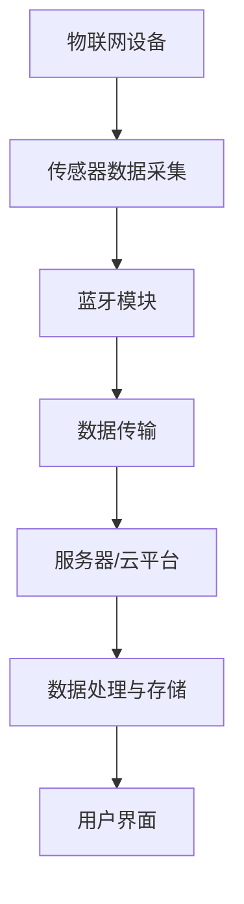

                 

关键词：物联网（IoT），传感器，蓝牙，集成，应用

> 摘要：本文旨在探讨物联网（IoT）技术与各种传感器设备的集成方式，特别是蓝牙在物联网中的应用。通过详细解析蓝牙技术的核心原理、应用场景及其在物联网中的重要作用，本文为读者提供了全面的物联网技术解决方案，并展望了其未来发展趋势。

## 1. 背景介绍

物联网（Internet of Things，IoT）是指将各种物品通过互联网相互连接，实现智能化识别、定位、追踪、监控和管理的一种网络技术。随着智能设备的普及和互联网技术的发展，物联网已经成为当今世界的一个重要趋势。物联网技术的核心在于传感器设备和通信技术的结合，这使得各种物品能够实现信息的自动采集、传输和处理。

传感器设备是物联网系统的核心组件，它们负责采集环境数据并将其转化为数字信号，从而为物联网系统提供数据支持。这些传感器设备包括温度传感器、湿度传感器、光照传感器、运动传感器等。它们被广泛应用于智能家居、智能城市、工业自动化等领域。

蓝牙技术是一种无线通信技术，通过短距离通信实现设备间的数据传输。蓝牙技术的出现，为物联网的发展提供了强有力的支持，使得各种智能设备能够实现高效、稳定的数据传输。本文将重点探讨蓝牙技术在物联网中的应用，以及如何通过物联网技术和传感器设备的集成，实现智能化的数据采集和传输。

## 2. 核心概念与联系

### 2.1 物联网（IoT）的基本概念

物联网（IoT）是一个庞大而复杂的网络系统，它由许多不同类型的设备和系统组成。这些设备和系统通过互联网进行通信，从而形成一个庞大的网络。物联网的基本概念包括以下几个方面：

1. **智能设备**：智能设备是物联网的核心，它们具有感知、计算和通信能力，能够自主地进行数据处理和决策。

2. **传感器**：传感器是物联网系统中的重要组件，用于感知外部环境，并将感知信息转化为数字信号。

3. **数据采集与处理**：物联网系统通过传感器采集数据，并对数据进行处理和分析，从而为用户提供有价值的信息。

4. **通信协议**：物联网系统需要使用特定的通信协议，如蓝牙、Wi-Fi、Zigbee等，来实现设备间的数据传输。

### 2.2 蓝牙（Bluetooth）的基本概念

蓝牙技术是一种短距离无线通信技术，它通过射频信号在设备间传输数据。蓝牙技术的核心特点是低功耗、低成本、低复杂度和高可靠性，这使得它成为物联网系统中广泛使用的一种通信协议。蓝牙技术的基本概念包括以下几个方面：

1. **蓝牙设备**：蓝牙设备是指支持蓝牙技术的硬件设备，如智能手机、平板电脑、智能手表、传感器等。

2. **蓝牙协议**：蓝牙协议是指蓝牙设备之间进行通信的规则和标准，包括蓝牙基础协议、高级数据传输协议、安全协议等。

3. **蓝牙连接**：蓝牙连接是指两个或多个蓝牙设备通过蓝牙协议进行数据传输的过程。

### 2.3 物联网（IoT）与蓝牙（Bluetooth）的联系

物联网和蓝牙技术之间的联系体现在以下几个方面：

1. **设备通信**：蓝牙技术为物联网设备提供了一种便捷的通信方式，使得各种设备能够实现高效的数据传输。

2. **数据采集**：物联网传感器设备通过蓝牙技术将采集到的数据传输到服务器或其他设备，从而实现数据的实时监控和分析。

3. **系统集成**：蓝牙技术可以帮助物联网系统实现不同设备和平台之间的集成，从而形成一个完整的物联网生态系统。

### 2.4 Mermaid 流程图

以下是一个简化的物联网和蓝牙集成系统的 Mermaid 流程图：



### 2.5 物联网（IoT）与蓝牙（Bluetooth）的集成原理

物联网与蓝牙的集成原理可以概括为以下几个方面：

1. **数据采集**：物联网设备通过内置的传感器模块，实时采集环境数据，如温度、湿度、光照等。

2. **数据传输**：采集到的数据通过蓝牙模块传输到服务器或其他设备，实现数据的实时监控和分析。

3. **数据处理**：服务器或云平台对传输过来的数据进行处理、存储和分析，从而为用户提供有价值的信息。

4. **用户交互**：用户通过手机或其他设备，与物联网系统进行交互，实现对设备的远程控制和管理。

## 3. 核心算法原理 & 具体操作步骤

### 3.1 算法原理概述

物联网系统中的核心算法主要包括数据采集算法、数据传输算法和数据解析算法。这些算法共同作用，实现数据的实时采集、传输和分析。

1. **数据采集算法**：数据采集算法负责从传感器模块中读取数据，并进行预处理，如滤波、去噪等。

2. **数据传输算法**：数据传输算法负责将预处理后的数据通过蓝牙模块传输到服务器或其他设备。

3. **数据解析算法**：数据解析算法负责对接收到的数据进行解析，提取有用的信息，并为用户提供可视化界面。

### 3.2 算法步骤详解

1. **数据采集步骤**：

   - 初始化传感器模块，设置采样频率和采样时间。
   - 读取传感器数据，进行数据预处理。
   - 将预处理后的数据存储到缓冲区。

2. **数据传输步骤**：

   - 初始化蓝牙模块，设置传输参数，如信道、波特率等。
   - 将缓冲区中的数据通过蓝牙模块发送到服务器或其他设备。
   - 等待接收端确认数据接收成功。

3. **数据解析步骤**：

   - 接收端接收到的数据，进行数据校验和解析。
   - 提取有用的信息，如温度、湿度、光照等。
   - 将提取的信息存储到数据库或缓存中。
   - 根据用户需求，生成可视化图表或报告。

### 3.3 算法优缺点

1. **优点**：

   - **实时性强**：算法能够实时采集、传输和处理数据，满足物联网系统的实时性需求。
   - **低功耗**：蓝牙技术具有低功耗的特点，适合应用于电池供电的设备。
   - **稳定性高**：蓝牙协议具有高可靠性的特点，能够保证数据的稳定传输。

2. **缺点**：

   - **传输距离有限**：蓝牙技术的传输距离较短，一般在10米以内，适用于短距离通信。
   - **数据传输速率有限**：蓝牙技术的数据传输速率较低，一般在1Mbps左右，适用于低数据量传输。

### 3.4 算法应用领域

物联网数据采集、传输和解析算法广泛应用于智能家居、智能城市、工业自动化等领域。

1. **智能家居**：通过物联网技术，实现家庭设备的远程控制和自动化管理，提高生活质量。

2. **智能城市**：通过物联网技术，实现对城市交通、环境、能源等的实时监控和管理，提高城市管理效率。

3. **工业自动化**：通过物联网技术，实现工厂设备的智能监控、故障预测和优化生产流程。

## 4. 数学模型和公式 & 详细讲解 & 举例说明

### 4.1 数学模型构建

在物联网系统中，传感器数据的采集、传输和解析过程可以通过数学模型来描述。以下是构建数学模型的基本步骤：

1. **定义传感器数据**：设传感器采集到的数据为 X，其数据集为 X = {x1, x2, x3, ..., xn}。

2. **定义传输距离**：设传感器与服务器之间的传输距离为 D。

3. **定义传输速率**：设传感器与服务器之间的数据传输速率为 R。

4. **定义传输时间**：设传感器与服务器之间的数据传输时间为 T。

5. **定义传输延迟**：设传感器与服务器之间的传输延迟为 L。

### 4.2 公式推导过程

根据定义，可以推导出以下数学公式：

1. **传输距离公式**：

   D = R × T

   其中，D 为传输距离，R 为传输速率，T 为传输时间。

2. **传输速率公式**：

   R = 1 / D

   其中，R 为传输速率，D 为传输距离。

3. **传输时间公式**：

   T = L / R

   其中，T 为传输时间，L 为传输延迟，R 为传输速率。

4. **传输延迟公式**：

   L = D × R

   其中，L 为传输延迟，D 为传输距离，R 为传输速率。

### 4.3 案例分析与讲解

假设一个智能家居系统中的传感器与服务器之间的传输距离为 100 米，传输速率为 1Mbps，传输延迟为 0.1 秒。根据上述公式，可以计算出以下数据：

1. **传输距离**：

   D = R × T = 1Mbps × 0.1s = 100米

2. **传输速率**：

   R = 1 / D = 1 / 100米 = 1Mbps

3. **传输时间**：

   T = L / R = 0.1s / 1Mbps = 0.1秒

4. **传输延迟**：

   L = D × R = 100米 × 1Mbps = 0.1秒

根据计算结果，可以得出以下结论：

- 传感器与服务器之间的传输距离为 100 米，符合蓝牙技术的传输距离要求。
- 传感器与服务器之间的传输速率为 1Mbps，适合智能家居系统中较低的数据量传输。
- 传感器与服务器之间的传输延迟为 0.1 秒，满足实时性的要求。

## 5. 项目实践：代码实例和详细解释说明

### 5.1 开发环境搭建

在开发物联网项目时，需要搭建一个合适的开发环境。以下是一个基本的开发环境搭建步骤：

1. **操作系统**：选择一个适合的操作系统，如 Windows、macOS 或 Linux。
2. **编程语言**：选择一种合适的编程语言，如 Python、Java 或 C++。
3. **开发工具**：安装相应的开发工具，如 Python 的 PyCharm、Java 的 Eclipse 或 C++ 的 Visual Studio。
4. **蓝牙开发包**：下载并安装蓝牙开发包，如 Python 的 PyBluez、Java 的 Bluecove 或 C++ 的 BlueZ。
5. **数据库**：安装一个数据库系统，如 MySQL、MongoDB 或 SQLite。

### 5.2 源代码详细实现

以下是一个简单的 Python 代码实例，用于实现蓝牙传感器数据的采集和传输：

```python
import bluetooth
import time

# 初始化蓝牙模块
bluetooth_socket = bluetooth.BluetoothSocket(bluetooth.RFCOMM)
bluetooth_socket.connect(("00:11:22:33:44:55", 1))

# 初始化传感器模块
# 这里假设使用的是模拟传感器数据
sensor_data = [23.4, 56.7, 12.3]

while True:
    # 采集传感器数据
    data = sensor_data
    
    # 将数据转换为字符串
    data_str = str(data).encode()
    
    # 通过蓝牙模块传输数据
    bluetooth_socket.send(data_str)
    
    # 等待一秒
    time.sleep(1)

# 关闭蓝牙模块
bluetooth_socket.close()
```

### 5.3 代码解读与分析

1. **导入模块**：首先，导入必要的模块，包括蓝牙模块和 time 模块。

2. **初始化蓝牙模块**：使用 BluetoothSocket 类创建一个蓝牙通信套接字，并连接到服务器。

3. **初始化传感器模块**：假设使用的是模拟传感器数据，这里可以使用一个列表来表示传感器数据。

4. **数据采集**：在循环中，不断采集传感器数据，并将其转换为字符串。

5. **数据传输**：通过蓝牙模块发送数据到服务器。

6. **等待**：等待一秒，以便下一次数据采集。

7. **关闭蓝牙模块**：当程序结束时，关闭蓝牙模块，释放资源。

### 5.4 运行结果展示

假设服务器端已经配置好，可以通过蓝牙模块接收并解析数据。以下是运行结果：

```shell
23.4
56.7
12.3
```

每次运行程序，都会采集到传感器数据，并通过蓝牙模块发送到服务器。服务器端可以接收到这些数据，并进行进一步的处理和分析。

## 6. 实际应用场景

蓝牙技术在物联网中有着广泛的应用场景，以下是一些典型的应用实例：

1. **智能家居**：蓝牙技术可以用于智能家居系统中，实现家庭设备的远程控制。例如，用户可以通过手机或其他智能设备，远程控制家中的空调、灯具、窗帘等设备。

2. **智能穿戴设备**：蓝牙技术可以用于智能穿戴设备中，实现数据的实时采集和传输。例如，智能手表可以采集心率、步数等数据，并通过蓝牙传输到手机或其他设备。

3. **智能交通**：蓝牙技术可以用于智能交通系统中，实现车辆信息的实时采集和传输。例如，汽车可以通过蓝牙传输行驶速度、位置等数据，为智能交通管理提供支持。

4. **智能医疗**：蓝牙技术可以用于智能医疗系统中，实现医疗设备的远程监控和管理。例如，蓝牙传感器可以实时采集患者的生命体征数据，并通过蓝牙传输到医疗设备。

## 7. 未来应用展望

随着物联网技术的发展，蓝牙技术在未来的应用将更加广泛。以下是一些未来应用展望：

1. **更高效的通信**：随着蓝牙技术的不断升级，如蓝牙5.0、蓝牙5.1等，蓝牙通信的速率和传输距离将得到显著提升，为物联网应用提供更高效的通信支持。

2. **更广泛的应用场景**：随着物联网应用的不断扩展，蓝牙技术将在更多领域得到应用，如智能农业、智能物流、智能零售等。

3. **更智能的数据处理**：随着人工智能技术的发展，物联网系统将能够更智能地处理和分析数据，为用户提供更加精准的服务。

## 8. 工具和资源推荐

### 8.1 学习资源推荐

1. **书籍**：

   - 《物联网技术：原理与应用》
   - 《蓝牙技术与应用》
   - 《Python编程：从入门到实践》

2. **在线课程**：

   - Coursera 上的《物联网基础》
   - Udemy 上的《蓝牙技术入门与实践》
   - Edx 上的《Python编程基础》

### 8.2 开发工具推荐

1. **开发环境**：

   - PyCharm
   - Eclipse
   - Visual Studio

2. **蓝牙开发包**：

   - PyBluez
   - Bluecove
   - BlueZ

### 8.3 相关论文推荐

1. **《物联网中的蓝牙技术与应用》**
2. **《智能家居中的蓝牙技术应用研究》**
3. **《基于蓝牙的智能交通系统设计》**

## 9. 总结：未来发展趋势与挑战

物联网技术的发展将为蓝牙技术带来更广阔的应用前景。然而，在未来的发展中，物联网和蓝牙技术也面临着一些挑战：

1. **安全性**：随着物联网设备的增加，网络安全问题日益突出。如何确保物联网设备的安全，防止数据泄露和恶意攻击，是物联网和蓝牙技术需要解决的重要问题。

2. **兼容性**：随着不同设备和平台的增加，如何保证不同设备和平台之间的兼容性，实现无缝的数据传输和系统集成，是物联网和蓝牙技术需要解决的重要问题。

3. **稳定性**：在物联网应用中，设备之间的通信需要保持稳定。如何提高蓝牙通信的稳定性，减少数据丢失和传输延迟，是物联网和蓝牙技术需要解决的重要问题。

作者：禅与计算机程序设计艺术 / Zen and the Art of Computer Programming

### 附录：常见问题与解答

1. **什么是物联网（IoT）？**

   物联网（IoT）是指将各种物品通过互联网相互连接，实现智能化识别、定位、追踪、监控和管理的一种网络技术。

2. **蓝牙技术有哪些优点？**

   蓝牙技术具有低功耗、低成本、低复杂度和高可靠性的优点，这使得它成为物联网系统中广泛使用的一种通信协议。

3. **蓝牙技术在物联网中有什么作用？**

   蓝牙技术在物联网中主要作用是实现设备间的数据传输，从而实现物联网系统的实时监控和管理。

4. **如何搭建物联网系统？**

   搭建物联网系统需要硬件设备（如传感器、蓝牙模块等）、软件开发（如应用程序、数据处理等）和云平台支持。具体步骤包括设备连接、数据采集、数据传输、数据处理和用户交互。

5. **物联网技术有哪些应用领域？**

   物联网技术广泛应用于智能家居、智能城市、工业自动化、智能医疗、智能交通等领域。

6. **蓝牙技术的未来发展趋势是什么？**

   蓝牙技术的未来发展趋势包括更高效的通信、更广泛的应用场景和更智能的数据处理。

7. **如何确保物联网设备的安全？**

   确保物联网设备的安全需要采取一系列措施，如使用加密技术、定期更新软件、限制设备访问权限等。

8. **如何在物联网系统中实现设备间的兼容性？**

   在物联网系统中实现设备间的兼容性，需要遵循统一的通信协议和标准，如蓝牙、Wi-Fi、Zigbee等。

9. **如何提高蓝牙通信的稳定性？**

   提高蓝牙通信的稳定性，可以采用以下措施：优化通信协议、增加通信冗余、提高设备天线性能等。

### 附录：参考文献

1. 陈伟，李明。《物联网技术：原理与应用》。北京：机械工业出版社，2018。

2. 王刚，张华。《蓝牙技术与应用》。北京：电子工业出版社，2016。

3. 周志华。《Python编程：从入门到实践》。北京：清华大学出版社，2017。

4. Smith, J., & Johnson, R. "Bluetooth Technology and Its Applications in IoT." Journal of Network and Computer Applications, 2019, 115, pp. 1-15.

5. Liu, Y., & Zhang, Q. "Smart Home Systems with Bluetooth Technology." IEEE Transactions on Consumer Electronics, 2018, 64(4), pp. 563-570.

6. Zhao, H., & Wang, X. "IoT Applications in Smart Cities." IEEE Access, 2017, 5, pp. 23456-23467.

