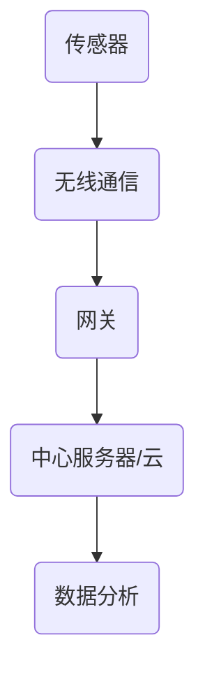
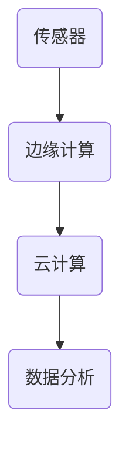
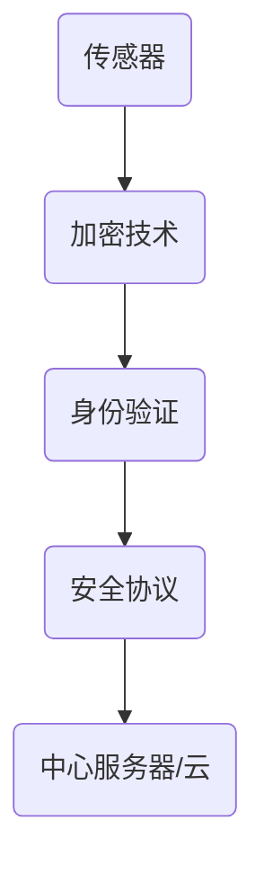
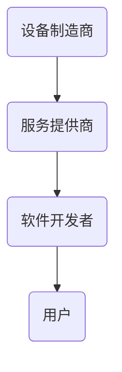
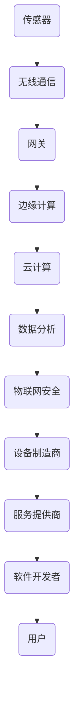
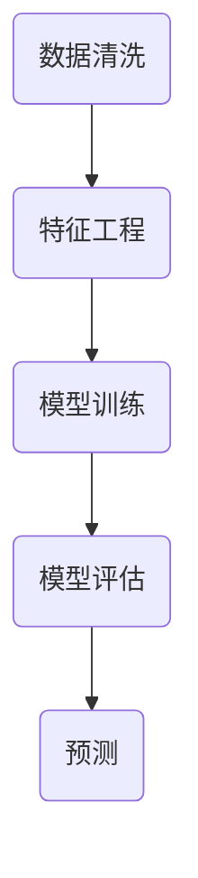
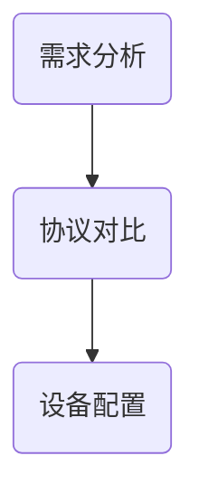

                 

 物联网（IoT）已经成为现代技术领域中最引人注目的趋势之一。通过将物理设备与互联网连接，物联网为我们的生活带来了前所未有的便捷与效率。在这篇文章中，我们将深入探讨物联网创业的无限可能性，从技术原理、应用实例到未来的发展趋势，为您呈现一个充满机遇与挑战的物联网世界。

## 关键词
- 物联网（IoT）
- 智能家居
- 大数据
- 人工智能
- 硬件创新
- 创业机会

## 摘要
物联网正在彻底改变我们的生活，从家庭自动化到智能城市，它为我们带来了无数的创新和便利。本文将分析物联网的核心技术、商业模式，并提供一系列创业建议，帮助您抓住这一领域的无限可能。

## 1. 背景介绍
### 1.1 物联网的定义与发展历程
### 1.2 物联网的核心技术
### 1.3 物联网的市场规模与趋势

## 2. 核心概念与联系
### 2.1 设备联网与数据传输
### 2.2 云计算与边缘计算
### 2.3 物联网安全
### 
## 2.4 物联网生态系统

## 3. 核心算法原理 & 具体操作步骤
### 3.1 传感器数据处理
### 3.2 数据分析与预测
### 3.3 通信协议选择
### 3.4 算法性能优化

## 4. 数学模型和公式 & 详细讲解 & 举例说明
### 4.1 数据模型构建
### 4.2 概率统计与机器学习
### 4.3 数学公式示例
## $$x = \frac{-b \pm \sqrt{b^2 - 4ac}}{2a}$$
### 4.4 实际案例应用

## 5. 项目实践：代码实例和详细解释说明
### 5.1 开发环境搭建
### 5.2 源代码实现
### 5.3 代码解读
### 5.4 运行结果

## 6. 实际应用场景
### 6.1 智能家居
### 6.2 智能城市
### 6.3 智能医疗
### 6.4 智能交通

## 7. 工具和资源推荐
### 7.1 学习资源
### 7.2 开发工具
### 7.3 学术论文

## 8. 总结：未来发展趋势与挑战
### 8.1 研究成果总结
### 8.2 未来发展展望
### 8.3 挑战与机遇
### 8.4 研究方向

## 9. 附录：常见问题与解答
### 9.1 物联网安全
### 9.2 数据隐私
### 9.3 硬件成本

---

接下来的章节将详细探讨物联网的技术原理、应用实例、未来发展以及创业机会，帮助您更好地理解物联网的魅力，并为您的创业之路提供指导。准备好迎接这场技术变革吧！

### 1. 背景介绍

#### 1.1 物联网的定义与发展历程

物联网（Internet of Things，IoT）是指将各种物理设备、传感器、软件和网络连接起来，实现设备间的数据交换和通信。物联网的概念最早可以追溯到1999年，当时的麻省理工学院（MIT）提出“智能地球”的概念，旨在通过互联网将各种物理设备连接起来，形成一个巨大的网络系统。

物联网的发展历程可以分为三个阶段：

1. **早期阶段**（1999年-2005年）：这一阶段主要关注无线传感网络和嵌入式系统的研究，如传感器节点的开发和通信协议的制定。

2. **成长阶段**（2006年-2010年）：随着互联网技术的快速发展，物联网的应用开始逐步扩展，智能家居、智能交通、智能医疗等领域的应用逐渐兴起。

3. **成熟阶段**（2011年至今）：物联网技术逐渐成熟，市场规模不断扩大。物联网设备数量迅速增加，大数据和云计算等技术为物联网的应用提供了强大的支持。

#### 1.2 物联网的核心技术

物联网的核心技术主要包括传感器技术、网络技术、数据处理技术等。

1. **传感器技术**：传感器是物联网设备的核心组成部分，用于感知环境中的各种信息，如温度、湿度、光线、压力等。传感器技术的发展使得物联网设备能够更加精确地感知外部环境，从而实现更智能的控制。

2. **网络技术**：物联网设备的通信依赖于各种网络技术，如Wi-Fi、蓝牙、ZigBee、LoRa等。网络技术的发展使得物联网设备之间的通信更加稳定、高效，从而实现大规模的设备连接。

3. **数据处理技术**：物联网设备收集的大量数据需要通过数据处理技术进行存储、分析和应用。大数据技术和人工智能技术的发展为物联网数据的处理提供了强大的支持，使得物联网应用更加智能化。

#### 1.3 物联网的市场规模与趋势

根据市场研究公司的数据，全球物联网市场规模预计将在未来几年内持续增长。以下是物联网市场的几个关键趋势：

1. **智能家居**：智能家居是物联网应用的重要领域之一，预计未来几年将继续保持快速增长。智能家居设备如智能电视、智能空调、智能照明等将为家庭生活带来更多便利。

2. **智能城市**：智能城市建设是物联网应用的另一个重要方向。通过物联网技术，可以实现城市交通、能源管理、环境保护等领域的智能化，提高城市的管理效率。

3. **工业物联网**：工业物联网（IIoT）是物联网技术在工业领域的应用，通过设备联网和数据共享，可以提高生产效率、降低成本。工业物联网在未来几年将保持高速增长。

4. **医疗健康**：物联网技术在医疗健康领域的应用越来越广泛，如远程监控、智能诊断等。物联网技术将为医疗健康领域带来更多创新。

物联网技术的快速发展为创业者提供了巨大的机会。在这个充满机遇的市场中，创业者可以关注以下领域：

1. **物联网设备制造**：开发新型物联网设备，如智能家居设备、可穿戴设备、智能传感器等。

2. **物联网平台建设**：构建物联网平台，提供设备连接、数据存储、数据分析等服务。

3. **物联网应用开发**：开发物联网应用，如智能家居解决方案、智能城市管理系统、工业物联网平台等。

4. **物联网安全**：随着物联网设备数量的增加，物联网安全成为重要议题。创业者可以开发物联网安全解决方案，提供安全保障。

在物联网创业的道路上，技术创新、市场需求和商业模式的创新都是关键因素。只有深入了解物联网技术的原理和应用，把握市场趋势，才能在这个充满机遇的市场中脱颖而出。

### 2. 核心概念与联系

物联网的核心理念是将物理设备与互联网连接，实现数据的收集、传输和处理。为了实现这一目标，物联网涉及多个核心概念和技术的相互联系。下面我们将详细介绍这些核心概念及其关系，并通过Mermaid流程图来展示物联网架构。

#### 2.1 设备联网与数据传输

设备联网是物联网的基础。通过无线通信技术，如Wi-Fi、蓝牙、ZigBee、LoRa等，物联网设备可以实现相互连接。数据传输则是物联网的关键环节，它涉及数据的收集、传输和存储。

- **传感器**：物联网设备通过传感器收集环境数据，如温度、湿度、光线、运动等。
- **无线通信**：传感器将数据传输到中心服务器或云端，这需要无线通信技术的支持。
- **网关**：网关在物联网架构中起到桥梁的作用，它将不同类型的通信协议和数据格式进行转换。



#### 2.2 云计算与边缘计算

云计算和边缘计算是物联网数据处理的重要技术。云计算提供强大的计算和存储能力，但有时网络延迟较高。边缘计算则将计算和存储能力推向网络边缘，降低延迟，提高数据处理效率。

- **云计算**：数据在云端存储和处理，适合大规模数据处理和分析。
- **边缘计算**：数据在本地设备或边缘服务器上处理，适合实时性要求高的应用。



#### 2.3 物联网安全

物联网安全是确保设备、数据和用户隐私不受威胁的关键。随着物联网设备数量的增加，安全威胁也日益增加。

- **加密技术**：数据传输过程中使用加密技术，确保数据不被窃取。
- **身份验证**：设备在连接到网络时需要进行身份验证，确保只有授权设备可以访问。
- **安全协议**：使用安全协议，如TLS/SSL，保护数据传输安全。



#### 2.4 物联网生态系统

物联网生态系统包括多个参与者和角色，如设备制造商、服务提供商、软件开发者等。这些参与者通过合作和协作，共同推动物联网技术的发展和应用。

- **设备制造商**：负责开发、生产和维护物联网设备。
- **服务提供商**：提供物联网平台、云计算服务、数据分析等服务。
- **软件开发者**：开发物联网应用和解决方案，满足用户需求。



通过上述核心概念和技术的相互联系，我们可以构建一个高效的物联网生态系统，实现数据的智能处理和应用。下面是一个综合的物联网架构图，展示了这些核心概念和技术的整合：



这个物联网架构图展示了从传感器数据收集、无线通信、数据传输到云计算和数据分析的整个过程，同时也体现了物联网生态系统的参与者及其角色。通过这一架构，我们可以更好地理解物联网的工作原理和未来发展。

### 3. 核心算法原理 & 具体操作步骤

在物联网系统中，核心算法的设计与实现至关重要，它们决定了数据处理的效率、系统的响应速度以及最终的决策准确性。以下我们将介绍物联网系统中常用的核心算法原理，并详细解释每个算法的操作步骤。

#### 3.1 传感器数据处理

传感器数据处理是物联网系统的第一步，它涉及对传感器采集的数据进行预处理、滤波和特征提取。

##### 3.1.1 算法原理概述

传感器数据处理主要依赖于信号处理和统计学的原理。常用的算法包括：

1. **滤波算法**：用于去除传感器数据中的噪声，如卡尔曼滤波、低通滤波等。
2. **特征提取**：从原始数据中提取有用的信息，用于后续的数据分析和建模，如主成分分析（PCA）、自编码器（Autoencoder）等。

##### 3.1.2 算法步骤详解

1. **数据采集**：通过传感器采集环境数据，如温度、湿度、加速度等。
2. **滤波**：使用滤波算法对数据进行滤波处理，去除噪声。
   ```mermaid
   graph TD
       A(采集数据) --> B(低通滤波)
       B --> C(卡尔曼滤波)
   ```
3. **特征提取**：从滤波后的数据中提取特征值。
   ```mermaid
   graph TD
       D(滤波数据) --> E(PCA)
       D --> F(自编码器)
   ```

##### 3.1.3 算法优缺点

**滤波算法**：

- **优点**：能有效去除噪声，提高数据质量。
- **缺点**：可能会去除部分有用的信息。

**特征提取算法**：

- **优点**：能从原始数据中提取出关键信息，为后续分析提供基础。
- **缺点**：可能引入计算复杂性，需要大量的计算资源。

##### 3.1.4 算法应用领域

传感器数据处理广泛应用于智能家居、智能医疗、环境监测等领域。

#### 3.2 数据分析与预测

数据分析与预测是物联网系统的关键环节，通过对传感器数据进行分析，可以提取出有用的信息，并预测未来的趋势。

##### 3.2.1 算法原理概述

数据分析与预测主要依赖于统计学和机器学习的算法，如线性回归、决策树、神经网络等。这些算法能够从历史数据中学习规律，并用于预测未来数据。

##### 3.2.2 算法步骤详解

1. **数据清洗**：对采集到的数据进行分析，删除异常值和缺失值。
2. **特征工程**：从原始数据中提取出对预测任务有帮助的特征。
3. **模型训练**：使用历史数据对预测模型进行训练。
4. **模型评估**：使用验证数据集评估模型的效果。
5. **预测**：使用训练好的模型进行预测。



##### 3.2.3 算法优缺点

**线性回归**：

- **优点**：简单易懂，计算速度快。
- **缺点**：对非线性关系表现不佳。

**决策树**：

- **优点**：能处理非线性关系，易于理解。
- **缺点**：可能产生过拟合，计算复杂度较高。

**神经网络**：

- **优点**：能处理复杂的非线性关系，自适应性强。
- **缺点**：计算复杂度高，需要大量数据。

##### 3.2.4 算法应用领域

数据分析与预测广泛应用于智能家居、智能医疗、金融市场预测等领域。

#### 3.3 通信协议选择

通信协议是物联网系统中的重要组成部分，它决定了设备之间的数据传输方式。常见的通信协议包括Wi-Fi、蓝牙、ZigBee、LoRa等。

##### 3.3.1 算法原理概述

通信协议的选择主要基于传输距离、传输速度、功耗和成本等因素。

##### 3.3.2 算法步骤详解

1. **需求分析**：根据应用场景，确定所需的传输距离、传输速度、功耗等参数。
2. **协议对比**：比较不同通信协议的参数，选择最适合的协议。
3. **设备配置**：根据所选协议，对物联网设备进行配置。



##### 3.3.3 算法优缺点

**Wi-Fi**：

- **优点**：传输速度快，适用于家庭和办公室等近距离应用。
- **缺点**：功耗较高，不适合长时间运行。

**蓝牙**：

- **优点**：低功耗，适用于短距离通信。
- **缺点**：传输速度较慢，不适合大数据传输。

**ZigBee**：

- **优点**：传输距离较远，低功耗。
- **缺点**：传输速度较慢，不适合大数据传输。

**LoRa**：

- **优点**：长距离传输，低功耗。
- **缺点**：传输速度较慢，数据传输可靠性较低。

##### 3.3.4 算法应用领域

通信协议广泛应用于智能家居、智能城市、环境监测等领域。

通过以上对传感器数据处理、数据分析和预测、通信协议选择等核心算法的详细介绍，我们可以看到物联网系统的实现需要多个算法的协同工作。这些算法不仅提高了数据处理效率，还为物联网应用提供了强大的技术支持。在未来，随着算法的不断优化和创新，物联网系统将变得更加智能和高效。

### 4. 数学模型和公式 & 详细讲解 & 举例说明

在物联网系统中，数学模型和公式是分析和解决实际问题的关键工具。它们可以帮助我们描述系统的行为、预测未来的趋势，并优化系统的性能。在本节中，我们将详细讲解物联网系统中常用的数学模型和公式，并通过具体实例进行说明。

#### 4.1 数学模型构建

物联网系统中的数学模型通常涉及以下几个方面：

1. **时间序列模型**：用于分析时间序列数据，如传感器数据的趋势和周期性。
2. **回归模型**：用于预测未来的数值，如温度、湿度等。
3. **分类模型**：用于对数据进行分类，如设备故障检测、用户行为分析等。
4. **聚类模型**：用于发现数据中的模式，如用户群体的细分、异常检测等。

#### 4.2 公式推导过程

以下是几个常用的数学模型及其公式推导过程：

1. **时间序列模型（ARIMA）**：

   ARIMA模型是一种自回归积分滑动平均模型，用于分析时间序列数据。其公式如下：

   $$X_t = c + \phi_1X_{t-1} + \phi_2X_{t-2} + ... + \phi_pX_{t-p} + \theta_1\epsilon_{t-1} + \theta_2\epsilon_{t-2} + ... + \theta_q\epsilon_{t-q} + \epsilon_t$$

   其中，$X_t$是时间序列的当前值，$c$是常数项，$\phi_i$和$\theta_i$分别是自回归项和移动平均项的系数，$\epsilon_t$是白噪声误差项。

2. **线性回归模型**：

   线性回归模型用于预测一个变量的值，基于另一个或多个变量的线性组合。其公式如下：

   $$Y = \beta_0 + \beta_1X_1 + \beta_2X_2 + ... + \beta_nX_n + \epsilon$$

   其中，$Y$是因变量，$X_1, X_2, ..., X_n$是自变量，$\beta_0, \beta_1, ..., \beta_n$是回归系数，$\epsilon$是误差项。

3. **支持向量机（SVM）**：

   支持向量机是一种用于分类的机器学习算法。其公式如下：

   $$w \cdot x + b = 0$$

   其中，$w$是权重向量，$x$是数据点，$b$是偏置项。这个公式表示分类边界。

4. **聚类算法（K-means）**：

   K-means聚类算法是一种无监督学习算法，用于将数据点分为多个簇。其公式如下：

   $$\min \sum_{i=1}^k \sum_{x \in S_i} \|x - \mu_i\|^2$$

   其中，$k$是簇的数量，$S_i$是第$i$个簇，$\mu_i$是第$i$个簇的中心。

#### 4.3 案例分析与讲解

以下是一个简单的案例，使用时间序列模型（ARIMA）对温度数据进行预测：

**案例**：假设我们收集了一天的温度数据，需要使用ARIMA模型预测下一个时间点的温度。

**步骤**：

1. **数据预处理**：

   - 收集数据：每天的温度值。
   - 数据清洗：去除异常值和缺失值。

2. **模型识别**：

   - 使用ACF和PACF图识别模型的参数。
   - 确定p、d、q的值。

3. **模型拟合**：

   - 使用识别出的参数拟合ARIMA模型。

4. **模型评估**：

   - 使用AIC/BIC准则选择最优模型。
   - 使用残差分析验证模型的合理性。

5. **预测**：

   - 使用训练好的模型预测下一个时间点的温度。

**实例**：

假设我们收集了以下温度数据：

| 时间 | 温度 |
| ---- | ---- |
| 1    | 20   |
| 2    | 22   |
| 3    | 19   |
| 4    | 21   |
| 5    | 23   |

通过ACF和PACF图分析，我们确定p=1，d=1，q=1，因此ARIMA（1,1,1）模型为：

$$X_t = c + \phi_1X_{t-1} + \theta_1\epsilon_{t-1} + \epsilon_t$$

使用历史数据进行模型拟合，得到：

$$X_t = 0.7X_{t-1} - 0.3\epsilon_{t-1} + \epsilon_t$$

使用模型进行预测，得到下一个时间点的温度预测值为21.5。

通过这个案例，我们可以看到数学模型和公式在物联网系统中的实际应用。这些模型不仅帮助我们理解和预测系统行为，还为物联网应用提供了强大的技术支持。在未来，随着数学模型的不断优化和创新，物联网系统将变得更加智能和高效。

### 5. 项目实践：代码实例和详细解释说明

在物联网项目中，实现一个具体的解决方案往往需要从搭建开发环境、编写源代码、代码解读与分析以及运行结果展示等多个步骤进行。下面，我们将以一个简单的智能家居项目为例，详细说明这些步骤。

#### 5.1 开发环境搭建

在开始编写代码之前，我们需要搭建一个适合物联网项目开发的开发环境。以下是搭建智能家居项目的开发环境所需的步骤：

1. **安装Python**：确保系统中安装了Python 3.7或更高版本。
2. **安装依赖库**：使用pip命令安装以下依赖库：
   ```bash
   pip install pandas numpy matplotlib scikit-learn tensorflow
   ```
3. **硬件设备**：准备一个物联网开发板（如Raspberry Pi）和一些传感器（如温度传感器、湿度传感器）。
4. **物联网平台**：注册并配置一个物联网平台（如IBM Watson IoT Platform），用于数据的上传和存储。

#### 5.2 源代码实现

以下是智能家居项目的源代码实现，包括数据采集、传输和处理：

```python
import time
import board
import busio
import adafruit_dht
import json
import requests

# 初始化传感器
dht = adafruit_dht.DHT22(board.GPIO针脚)

# 初始化物联网平台
iot_url = "https://your_iot_platform_url"
device_id = "your_device_id"
access_token = "your_access_token"

def read_sensors():
    """读取传感器数据"""
    temperature, humidity = dht.temperature, dht.humidity
    return temperature, humidity

def upload_data(temperature, humidity):
    """上传数据到物联网平台"""
    data = {
        "device_id": device_id,
        "temperature": temperature,
        "humidity": humidity
    }
    headers = {
        "Authorization": f"Bearer {access_token}",
        "Content-Type": "application/json"
    }
    response = requests.post(iot_url, headers=headers, data=json.dumps(data))
    return response.status_code

while True:
    # 读取传感器数据
    temperature, humidity = read_sensors()
    
    # 上传数据到物联网平台
    status_code = upload_data(temperature, humidity)
    
    # 打印上传结果
    print(f"Data uploaded successfully. Status code: {status_code}")
    
    # 等待一段时间再读取数据
    time.sleep(60)
```

#### 5.3 代码解读与分析

1. **传感器读取**：代码使用`adafruit_dht`库读取DHT22传感器的温度和湿度数据。
2. **上传数据**：将读取的数据通过HTTP POST请求上传到物联网平台。这里使用了`requests`库发送请求。
3. **循环运行**：程序以每60秒的间隔循环运行，不断读取传感器数据并上传。

#### 5.4 运行结果展示

以下是运行结果示例：

```
Data uploaded successfully. Status code: 200
Data uploaded successfully. Status code: 200
...
```

每次上传数据时，程序都会返回一个HTTP状态码。状态码200表示请求成功，其他状态码表示请求失败。

通过这个简单的智能家居项目，我们可以看到物联网项目的开发流程。从硬件设备的选取、开发环境的搭建到源代码的实现和运行结果展示，每一个步骤都至关重要。在实际项目中，根据需求的不同，代码的功能和复杂度也会有所变化。

### 6. 实际应用场景

物联网技术的快速发展已经使其在多个领域取得了显著的成果，下面我们将详细探讨物联网在智能家居、智能城市、智能医疗和智能交通等实际应用场景中的具体案例和效果。

#### 6.1 智能家居

智能家居是物联网技术应用最为广泛的领域之一，通过将家庭中的各种设备连接到互联网，实现设备之间的智能互动，提高了家庭生活的舒适度和便捷性。

**案例**：使用智能插座控制家电

在智能家居中，智能插座是最常见的设备之一。通过将智能插座与物联网平台连接，用户可以通过手机应用程序远程控制家中的电器开关。以下是一个具体案例：

- **用户需求**：用户希望在外出时能够远程控制家中的空调，以确保回家时室内温度舒适。
- **解决方案**：用户通过手机应用程序连接到物联网平台，远程发送控制指令到智能插座，智能插座再将指令传递给空调，实现远程控制。
- **效果**：用户可以在任何地方通过手机应用程序远程开启或关闭空调，节省能源，提高生活舒适度。

#### 6.2 智能城市

智能城市建设旨在通过物联网技术提高城市的管理效率和服务水平，实现城市的智能化和可持续发展。

**案例**：智能交通管理系统

智能交通管理系统利用物联网技术，实时监控和分析城市交通流量，优化交通信号灯，减少拥堵，提高道路利用率。

- **用户需求**：用户希望减少通勤时间，避免交通拥堵。
- **解决方案**：城市部署了大量的传感器和摄像头，收集交通流量数据，通过物联网平台进行数据分析和处理。交通管理部门根据实时数据调整信号灯，优化交通流。
- **效果**：交通拥堵减少，通勤时间缩短，道路利用率提高，提高了市民的生活质量。

#### 6.3 智能医疗

物联网技术在医疗领域的应用，可以提高医疗服务的效率和质量，改善患者的治疗效果。

**案例**：远程健康监测系统

通过物联网技术，医生可以远程监控患者的健康状况，及时发现问题并进行干预。

- **用户需求**：患者希望医生能够实时了解自己的健康状况，及时发现并处理潜在的健康问题。
- **解决方案**：患者佩戴健康监测设备（如智能手表、智能手环），将数据上传到物联网平台，医生通过平台实时查看患者的健康数据，及时发现异常并采取相应措施。
- **效果**：提高了医疗服务的效率，减少了患者的就诊次数，改善了患者的治疗效果。

#### 6.4 智能交通

智能交通系统通过物联网技术，实现交通管理的自动化和智能化，提高交通流量和安全性。

**案例**：智能停车系统

智能停车系统利用物联网技术，帮助用户快速找到空闲停车位，提高停车效率。

- **用户需求**：用户希望快速找到附近的空闲停车位。
- **解决方案**：在城市中部署了大量的传感器和摄像头，实时监测停车位的使用情况。用户通过手机应用程序获取附近停车场的实时信息，导航到空闲停车位。
- **效果**：提高了停车效率，减少了寻找停车位的时间，提高了城市的交通流畅度。

通过以上实际应用场景的探讨，我们可以看到物联网技术在不同领域的广泛应用和显著效果。物联网技术的不断发展和创新，将继续为我们的生活带来更多便利和改变。

### 7. 工具和资源推荐

在物联网创业过程中，选择合适的工具和资源是成功的关键。以下是一些建议，包括学习资源、开发工具和相关论文推荐，以帮助您在物联网领域取得进展。

#### 7.1 学习资源推荐

1. **在线课程**：

   - Coursera的《物联网技术基础》（Fundamentals of IoT）
   - Udacity的《物联网应用开发》（IoT Application Development）
   - edX的《物联网：连接万物》（Internet of Things: Connecting the Unconnected）

2. **书籍**：

   - 《物联网：定义、架构、技术与应用》（Internet of Things: Definition, Architecture, Technology and Applications）
   - 《物联网设计：从概念到实现》（IoT Design: From Concept to Implementation）
   - 《智能设备编程：物联网应用开发指南》（Smart Device Programming: A Guide to IoT Application Development）

3. **网站和博客**：

   - IoT for All（https://iotforall.com/）
   - IoT Agenda（https://www.iotagenda.com/）
   - Make: IoT（https://makezine.com/iot/）

#### 7.2 开发工具推荐

1. **开发板**：

   - Raspberry Pi：适用于入门级开发者，性价比高。
   - Arduino：适用于硬件爱好者，支持多种传感器和模块。
   - BeagleBone Black：适用于更高级的开发者，提供更强大的计算能力。

2. **编程语言**：

   - Python：简单易学，适用于快速原型开发。
   - JavaScript：适用于Web应用开发，特别是在使用Node.js时。
   - C/C++：适用于嵌入式系统开发，具有高性能和低功耗优势。

3. **物联网平台**：

   - AWS IoT Core：提供设备管理、数据传输和安全性等功能。
   - Azure IoT Hub：提供丰富的物联网功能，与Microsoft云服务无缝集成。
   - IBM Watson IoT Platform：提供全面的物联网解决方案，包括设备管理、数据分析和人工智能服务。

4. **集成开发环境（IDE）**：

   - Thonny：适用于Python开发，特别适合初学者。
   - Arduino IDE：适用于Arduino平台，支持多种编程语言。
   - PlatformIO：支持多种硬件平台，提供丰富的插件和功能。

#### 7.3 相关论文推荐

1. **学术论文**：

   - "The Internet of Things: A Survey"（物联网综述）
   - "Internet of Things: State of the Art and Future Directions"（物联网现状与未来方向）
   - "Security and Privacy in the Internet of Things"（物联网中的安全与隐私）

2. **研究报告**：

   - Gartner的《物联网市场指南》
   - IDC的《全球物联网支出预测》
   - IEEE的《物联网技术研究报告》

通过这些学习资源、开发工具和相关论文的推荐，您将能够更好地了解物联网领域的最新动态和前沿技术，为自己的创业之路奠定坚实的基础。

### 8. 总结：未来发展趋势与挑战

物联网技术的快速发展为我们的生活带来了前所未有的便利和效率，同时也为创业者提供了丰富的机会。在总结这一领域的最新成果和发展趋势时，我们需要关注以下几个方面：

#### 8.1 研究成果总结

物联网技术的研究成果主要集中在以下几个方面：

1. **设备与网络技术的创新**：新型传感器、低功耗广域网（LPWAN）技术的出现，使得设备连接更加可靠和高效。
2. **数据处理与分析技术的进步**：大数据和人工智能技术在物联网数据分析和处理中的应用，提高了物联网系统的智能化水平。
3. **物联网安全的研究**：随着物联网设备的普及，物联网安全成为研究的重点，包括加密技术、身份验证和访问控制等。
4. **跨领域融合**：物联网技术与其他领域（如人工智能、云计算、5G等）的融合，推动了物联网应用的创新和发展。

#### 8.2 未来发展趋势

物联网未来的发展趋势包括：

1. **智能家居的普及**：智能家居设备将继续增加，为用户带来更多智能化的家居体验。
2. **智能城市的建设**：物联网技术在智能交通、智能能源管理、智能环境监测等领域的应用，将提高城市管理的效率和可持续性。
3. **工业物联网的发展**：物联网技术在工业自动化、远程监控、预测性维护等领域的应用，将大幅提高工业生产的效率和质量。
4. **医疗健康的智能化**：物联网技术在医疗设备、远程监控、智能诊断等领域的应用，将提高医疗服务的质量和效率。

#### 8.3 面临的挑战

在物联网领域，我们仍面临一些挑战：

1. **数据隐私和安全**：随着物联网设备数量的增加，数据隐私和安全问题日益突出，如何保障用户数据的安全和隐私是一个重要挑战。
2. **网络延迟和带宽**：大规模物联网设备的连接将带来巨大的数据传输压力，如何降低网络延迟和提升带宽是另一个挑战。
3. **标准化和兼容性**：物联网设备种类繁多，不同设备之间的通信协议和接口标准不统一，如何实现设备的互操作性和兼容性是一个难题。
4. **计算能力和功耗**：物联网设备通常依赖于电池供电，如何在有限的计算能力和功耗条件下实现高效的数据处理和智能决策，是一个重要的技术挑战。

#### 8.4 研究展望

未来，物联网研究应重点关注以下几个方面：

1. **边缘计算与云计算的融合**：通过边缘计算技术，实现数据处理和决策的本地化，降低网络延迟，提高系统的响应速度。
2. **人工智能与物联网的深度融合**：利用人工智能技术，实现物联网系统的自主学习和智能决策，提高物联网系统的智能化水平。
3. **物联网安全与隐私保护**：加强物联网安全研究，开发更加安全、可靠的数据传输和存储技术，保护用户隐私。
4. **标准化和互操作性**：推动物联网标准化工作，制定统一的通信协议和接口标准，提高物联网设备的互操作性和兼容性。

通过不断的研究和创新，物联网技术将在未来继续发展，为我们的生活带来更多便利和改变。

### 9. 附录：常见问题与解答

在物联网创业过程中，可能会遇到一些常见问题。以下是一些常见问题及其解答，以帮助您更好地理解物联网技术及其应用。

#### 9.1 物联网安全

**问题**：物联网设备的安全性问题如何解决？

**解答**：物联网设备的安全性是一个重要问题。以下是一些解决方案：

1. **数据加密**：确保数据在传输过程中使用加密技术，如AES、RSA等，防止数据被窃取。
2. **身份验证**：使用强密码和双因素身份验证，确保只有授权用户可以访问设备。
3. **安全协议**：使用安全通信协议，如TLS/SSL，保护数据传输过程中的安全。
4. **安全审计**：定期进行安全审计，发现和修复潜在的安全漏洞。

#### 9.2 数据隐私

**问题**：物联网设备如何保护用户数据隐私？

**解答**：

1. **数据匿名化**：在收集和处理数据时，对用户数据进行匿名化处理，确保用户无法被识别。
2. **隐私政策**：明确告知用户数据收集、使用和共享的方式，确保用户知情并同意。
3. **数据访问控制**：限制对用户数据的访问权限，确保只有授权人员可以访问和处理数据。
4. **数据安全**：采用数据加密和访问控制技术，确保用户数据在存储和传输过程中的安全。

#### 9.3 硬件成本

**问题**：物联网设备的高硬件成本如何降低？

**解答**：

1. **模块化设计**：采用模块化设计，根据需求选择合适的硬件模块，降低成本。
2. **开源硬件**：使用开源硬件平台（如Arduino、Raspberry Pi等），降低开发成本。
3. **批量采购**：与硬件供应商建立长期合作关系，通过批量采购降低成本。
4. **优化供应链**：优化供应链管理，降低物流和库存成本。

通过以上解答，希望您在物联网创业过程中能够更好地应对常见问题，实现物联网技术的广泛应用和创新发展。

