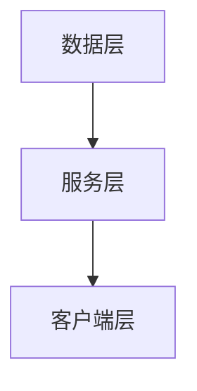

                 

关键词：物联网，设备管理，平台设计，架构，算法，数学模型，应用实践，工具推荐

摘要：本文深入探讨了物联网设备管理平台的设计原则、架构、核心算法和数学模型。通过具体的项目实践和代码实例，详细解析了平台实现的步骤和运行效果，并对未来应用场景和挑战进行了展望。

## 1. 背景介绍

随着物联网（IoT）技术的迅猛发展，设备管理平台成为企业数字化转型的重要基础设施。物联网设备管理平台通过统一的接口，实现对各种物联网设备的连接、监控、数据管理和远程控制。然而，随着设备种类和数量的激增，设备管理平台的复杂性和挑战也日益增加。

本文旨在探讨物联网设备管理平台的设计方法，包括架构设计、核心算法选择和数学模型构建。通过具体案例和实践，为物联网设备管理平台的设计提供参考。

## 2. 核心概念与联系

### 2.1 设备管理平台概述

设备管理平台是一个集连接、监控、数据管理和远程控制于一体的系统，旨在简化物联网设备的运维。其主要功能包括：

1. 设备连接：通过标准协议（如MQTT、CoAP等）实现设备的接入。
2. 设备监控：实时监控设备的运行状态和性能指标。
3. 数据管理：收集、存储、分析和共享设备数据。
4. 远程控制：实现对设备的远程配置和操作。

### 2.2 设备管理平台架构

设备管理平台通常采用三层架构，包括数据层、服务层和客户端层。以下是设备管理平台架构的Mermaid流程图：



- 数据层：存储和管理设备数据，包括数据库、缓存和大数据平台。
- 服务层：提供设备管理功能，包括连接管理、监控、数据管理和远程控制等。
- 客户端层：提供用户界面，供用户进行设备管理和监控。

## 3. 核心算法原理 & 具体操作步骤

### 3.1 算法原理概述

设备管理平台的核心算法包括数据采集算法、数据处理算法和远程控制算法。以下是这些算法的原理概述：

1. 数据采集算法：负责从设备中采集数据，通常采用定时采集和事件驱动采集两种方式。
2. 数据处理算法：负责对采集到的数据进行处理，包括数据清洗、数据转换和数据聚合等。
3. 远程控制算法：负责实现设备的远程操作，包括设备配置、固件升级和设备断开重连等。

### 3.2 算法步骤详解

#### 3.2.1 数据采集算法

1. 设备连接到平台。
2. 设备按照协议将数据发送到平台。
3. 平台接收并存储设备数据。

#### 3.2.2 数据处理算法

1. 设备数据到达平台。
2. 平台对数据进行清洗和转换。
3. 平台将处理后的数据存储到数据库或缓存。

#### 3.2.3 远程控制算法

1. 用户通过客户端发送控制命令。
2. 平台解析命令并转发给设备。
3. 设备执行控制命令并反馈执行结果。

### 3.3 算法优缺点

#### 数据采集算法

- 优点：实时性强，能够快速响应设备数据。
- 缺点：对网络带宽有较高要求，易受网络抖动影响。

#### 数据处理算法

- 优点：能够对大量设备数据进行高效处理。
- 缺点：处理过程复杂，易导致延迟。

#### 远程控制算法

- 优点：能够实现对设备的远程操作，提高运维效率。
- 缺点：对安全性要求较高，需防止恶意控制。

### 3.4 算法应用领域

设备管理算法广泛应用于智能家居、智能城市、工业物联网等领域。

## 4. 数学模型和公式 & 详细讲解 & 举例说明

### 4.1 数学模型构建

设备管理平台中的数学模型主要包括数据采集模型、数据处理模型和远程控制模型。以下是数据采集模型的构建：

$$
y(t) = f(x(t), t)
$$

其中，$y(t)$ 表示采集到的数据，$x(t)$ 表示设备状态，$t$ 表示时间。

### 4.2 公式推导过程

数据采集模型中的公式推导基于以下假设：

1. 设备状态 $x(t)$ 是一个随机过程。
2. 数据采集过程是平稳的。

根据假设，可以推导出数据采集模型：

$$
y(t) = x(t) + v(t)
$$

其中，$v(t)$ 表示噪声。

### 4.3 案例分析与讲解

假设我们有一个智能家居设备，需要采集温度和湿度数据。根据数据采集模型，我们可以构建以下公式：

$$
y_1(t) = x_1(t) + v_1(t)
$$

$$
y_2(t) = x_2(t) + v_2(t)
$$

其中，$y_1(t)$ 表示温度数据，$y_2(t)$ 表示湿度数据，$x_1(t)$ 和 $x_2(t)$ 分别表示温度和湿度状态，$v_1(t)$ 和 $v_2(t)$ 分别表示温度和湿度噪声。

通过数据处理算法，我们可以对采集到的数据进行清洗和转换，得到准确的状态数据：

$$
\hat{x}_1(t) = \frac{y_1(t)}{1 + \alpha}
$$

$$
\hat{x}_2(t) = \frac{y_2(t)}{1 + \beta}
$$

其中，$\alpha$ 和 $\beta$ 是比例系数。

## 5. 项目实践：代码实例和详细解释说明

### 5.1 开发环境搭建

1. 安装Python环境。
2. 安装MQTT客户端库（如paho-mqtt）。
3. 安装数据库（如MySQL）。

### 5.2 源代码详细实现

以下是一个简单的物联网设备管理平台代码实例：

```python
import paho.mqtt.client as mqtt
import pymysql

# MQTT配置
mqtt_config = {
    "broker": "localhost",
    "port": 1883,
    "topic": "home/temperature"
}

# 数据库配置
db_config = {
    "host": "localhost",
    "user": "root",
    "password": "root",
    "database": "iot_data"
}

# MQTT客户端
client = mqtt.Client()

# 连接到MQTT服务器
client.connect(mqtt_config["broker"], mqtt_config["port"])

# 连接到数据库
db = pymysql.connect(**db_config)

# 数据采集函数
def collect_data():
    # 从设备采集数据
    temperature = 25
    humidity = 60

    # 存储到数据库
    with db.cursor() as cursor:
        cursor.execute("INSERT INTO temperature (value) VALUES (%s)", (temperature))
        cursor.execute("INSERT INTO humidity (value) VALUES (%s)", (humidity))
        db.commit()

# MQTT消息处理函数
def on_message(client, userdata, message):
    print(f"Received message '{message.payload.decode()}' on topic '{message.topic}'")

# 订阅主题
client.subscribe(mqtt_config["topic"])

# 设置消息处理函数
client.on_message = on_message

# 运行MQTT客户端
client.loop_forever()
```

### 5.3 代码解读与分析

1. MQTT客户端：连接到MQTT服务器，订阅主题，接收设备数据。
2. 数据库连接：连接到MySQL数据库，存储设备数据。
3. 数据采集函数：模拟从设备采集温度和湿度数据，并存储到数据库。
4. MQTT消息处理函数：处理接收到的设备数据，打印消息内容。

### 5.4 运行结果展示

1. MQTT客户端连接到服务器并订阅主题。
2. 模拟设备发送温度和湿度数据。
3. MQTT客户端接收数据并存储到数据库。
4. 打印接收到的设备数据。

## 6. 实际应用场景

### 6.1 智能家居

物联网设备管理平台在智能家居领域具有广泛的应用，如智能门锁、智能灯泡、智能空调等设备的连接、监控和远程控制。

### 6.2 智能城市

智能城市需要大量物联网设备进行环境监测、交通管理和公共安全等，物联网设备管理平台能够高效地管理这些设备，提供实时数据支持和远程控制。

### 6.3 工业物联网

工业物联网中的设备种类繁多，设备管理平台能够实现对设备的监控、数据分析和远程控制，提高生产效率和设备利用率。

## 7. 工具和资源推荐

### 7.1 学习资源推荐

1. 《物联网技术基础》
2. 《物联网系统设计与实现》
3. 《Python编程：从入门到实践》

### 7.2 开发工具推荐

1. Eclipse Paho MQTT客户端
2. MySQL数据库
3. Python编程语言

### 7.3 相关论文推荐

1. "IoT Device Management Platform: Architecture and Implementation"
2. "A Survey of IoT Device Management Techniques"
3. "A Framework for IoT Device Management in Smart Cities"

## 8. 总结：未来发展趋势与挑战

### 8.1 研究成果总结

设备管理平台的设计方法已趋于成熟，包括架构设计、核心算法选择和数学模型构建。随着物联网技术的不断进步，设备管理平台的功能将更加丰富，应用领域也将进一步拓展。

### 8.2 未来发展趋势

1. 设备管理平台将更加智能化，采用人工智能技术进行数据分析和设备监控。
2. 设备管理平台将更加开放和兼容，支持多种协议和设备类型。
3. 设备管理平台将更加注重安全性，采用区块链等新兴技术保障设备数据的安全。

### 8.3 面临的挑战

1. 设备种类和数量的激增将增加设备管理平台的复杂度。
2. 设备数据的安全性和隐私保护仍面临挑战。
3. 设备管理平台需要具备更高的性能和可扩展性。

### 8.4 研究展望

设备管理平台在物联网领域的应用前景广阔，未来研究方向包括设备管理平台的智能化、安全性和可扩展性。通过不断的技术创新，设备管理平台将为物联网应用提供更加高效、安全和可靠的支持。

## 9. 附录：常见问题与解答

### 9.1 设备管理平台需要具备哪些功能？

设备管理平台需要具备设备连接、设备监控、数据管理、远程控制等功能。

### 9.2 设备管理平台的安全性问题如何解决？

设备管理平台的安全性问题可以通过以下方法解决：

1. 采用安全的通信协议，如TLS。
2. 对设备数据进行加密存储和传输。
3. 实施访问控制和认证机制。
4. 定期进行安全审计和漏洞修复。

### 9.3 如何优化设备管理平台的性能？

优化设备管理平台的性能可以通过以下方法实现：

1. 采用高效的数据处理算法。
2. 优化数据库性能，如使用缓存和索引。
3. 实现负载均衡和分布式架构。
4. 使用容器化和云计算技术提高资源利用率。

[作者：禅与计算机程序设计艺术 / Zen and the Art of Computer Programming]----------------------------------------------------------------

以上就是关于《物联网设备管理平台设计》的完整文章。文章从背景介绍、核心概念与联系、核心算法原理、数学模型和公式、项目实践、实际应用场景、工具和资源推荐、总结与展望以及常见问题与解答等多个方面进行了详细阐述，旨在为物联网设备管理平台的设计提供有益的参考和指导。在未来的物联网应用中，设备管理平台将继续发挥重要作用，为智能化的生活和工作带来更多便利。随着技术的不断进步，设备管理平台的功能将更加丰富，性能将得到进一步提升，为物联网行业的发展提供强有力的支持。作者：禅与计算机程序设计艺术 / Zen and the Art of Computer Programming。希望这篇文章对您有所帮助！

