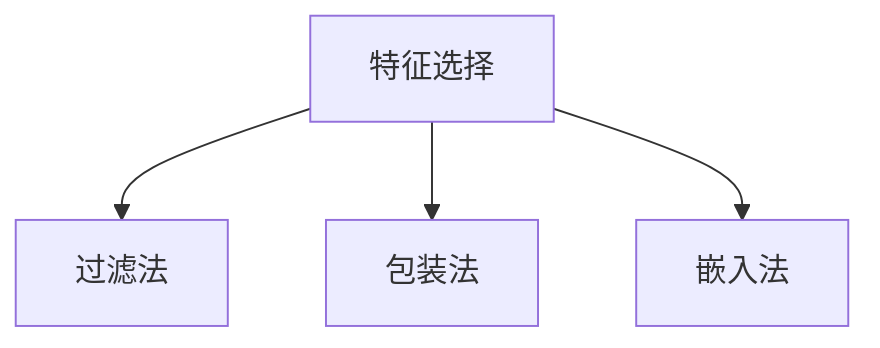
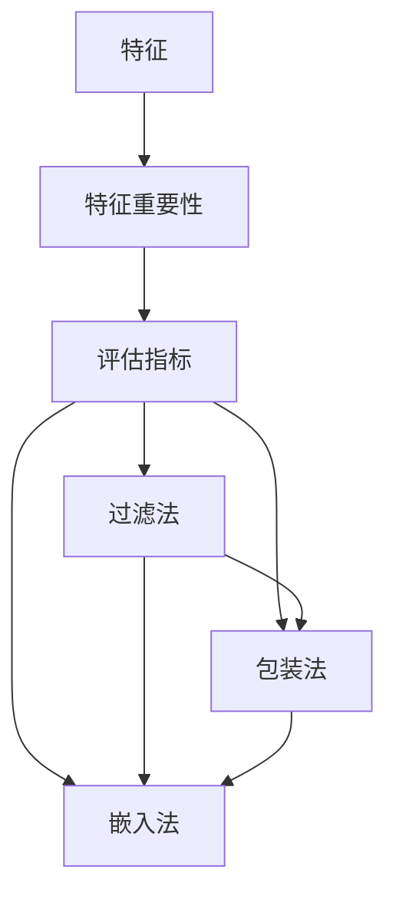

                 

特征选择（Feature Selection）是机器学习和数据分析中至关重要的一环。它旨在从原始特征集合中选取出对预测任务最有影响力的特征，从而提高模型性能、减少过拟合、降低计算复杂度和提升泛化能力。本篇文章将详细介绍特征选择的基本原理、常见算法、数学模型、代码实现以及实际应用场景。

## 关键词

- 特征选择
- 机器学习
- 特征提取
- 评估指标
- 算法

## 摘要

本文首先介绍了特征选择的基本概念和重要性，然后深入探讨了特征选择的主要算法，包括过滤法、包装法和嵌入法。通过数学模型和公式，详细解释了特征选择的原理和计算过程。随后，本文提供了一个具体的代码实例，展示了如何使用Python实现特征选择。最后，本文讨论了特征选择在实际应用中的场景和未来发展的趋势。

## 1. 背景介绍

在数据科学和机器学习领域，数据的质量直接影响模型的性能。数据质量包括数据完整性、准确性和一致性等方面。然而，现实世界中的数据往往存在噪声、冗余和缺失，这会导致模型难以泛化到新的数据集上。特征选择是一种预处理技术，它通过筛选和保留有用的特征，去除无关或冗余的特征，从而提高模型的性能和可解释性。

### 特征选择的重要性

- **提高模型性能**：选择重要的特征可以减少模型过拟合的风险，提高模型的泛化能力。
- **减少计算复杂度**：减少特征数量可以降低模型的计算复杂度，缩短训练时间。
- **降低数据存储需求**：特征选择可以显著减少数据存储的需求，降低存储成本。
- **提高可解释性**：选择一组具有解释性的特征，可以帮助我们更好地理解模型的工作原理。

### 特征选择的类型

- **过滤法**：在特征提取之前进行，使用统计方法评估每个特征的贡献，选择出最重要的特征。
- **包装法**：在特征提取过程中进行，通过迭代训练模型并评估特征的重要性，选择出最优的特征组合。
- **嵌入法**：在训练过程中自动进行特征选择，模型会根据特征对目标变量的影响进行自动筛选。

## 2. 核心概念与联系

### 2.1. 特征选择的基本概念

- **特征**：数据集中的每个属性或变量，通常表示为特征向量。
- **特征选择**：从一组特征中挑选出对预测任务最有影响力的特征。
- **特征提取**：从原始数据中生成新的特征，通常用于减少数据维度。
- **特征重要性**：衡量特征对预测目标的影响程度。

### 2.2. 特征选择的方法分类

- **过滤法**：基于统计方法和评估指标，对特征进行初步筛选。
- **包装法**：基于模型训练和交叉验证，通过迭代过程选择最优特征组合。
- **嵌入法**：在训练过程中自动进行特征选择，特征重要性由模型内部决定。

### 2.3. Mermaid 流程图

下面是一个简单的 Mermaid 流程图，展示特征选择的不同方法：



## 3. 核心算法原理 & 具体操作步骤

### 3.1. 算法原理概述

特征选择算法主要包括过滤法、包装法和嵌入法。每种方法都有其独特的原理和适用场景。

- **过滤法**：通过统计方法和评估指标，对特征进行初步筛选。常见评估指标有信息增益（Information Gain）、卡方检验（Chi-square Test）等。
- **包装法**：基于模型训练和交叉验证，通过迭代过程选择最优特征组合。常见算法有递归特征消除（Recursive Feature Elimination，RFE）、随机森林特征选择（Random Forest Feature Selection）等。
- **嵌入法**：在训练过程中自动进行特征选择，特征重要性由模型内部决定。常见算法有Lasso回归（Lasso Regression）、随机投影（Random Projections）等。

### 3.2. 算法步骤详解

#### 3.2.1. 过滤法

过滤法的主要步骤如下：

1. **特征评估**：使用统计方法和评估指标对每个特征进行评估。
2. **阈值设定**：根据评估结果，设定阈值，选择出重要特征。
3. **模型训练**：使用筛选后的特征进行模型训练。

#### 3.2.2. 包装法

包装法的主要步骤如下：

1. **初始化特征集**：选择全部特征作为初始特征集。
2. **交叉验证**：使用交叉验证方法评估当前特征集的模型性能。
3. **特征选择**：根据交叉验证结果，选择出最优特征组合。
4. **迭代**：重复步骤2和3，直到找到最佳特征组合。

#### 3.2.3. 嵌入法

嵌入法的主要步骤如下：

1. **模型训练**：使用原始特征进行模型训练。
2. **特征选择**：根据模型对特征的权重进行特征选择。
3. **模型评估**：使用筛选后的特征重新训练模型，评估模型性能。

### 3.3. 算法优缺点

- **过滤法**：

  - 优点：简单、高效，不需要迭代。
  - 缺点：可能导致重要特征被排除，不适用于复杂的模型。

- **包装法**：

  - 优点：可以找到最佳特征组合，适用于复杂的模型。
  - 缺点：计算复杂度高，需要大量迭代。

- **嵌入法**：

  - 优点：计算复杂度相对较低，适用于大规模数据集。
  - 缺点：特征重要性由模型内部决定，难以解释。

### 3.4. 算法应用领域

特征选择算法广泛应用于各种机器学习任务，如分类、回归、聚类等。在医疗诊断、金融风险评估、图像识别等领域，特征选择能够显著提高模型的性能和可解释性。

## 4. 数学模型和公式 & 详细讲解 & 举例说明

### 4.1. 数学模型构建

特征选择的核心在于特征的重要性评估，这通常涉及到以下数学模型：

1. **信息增益**：

   $$ IG(j) = H(D) - H(D|j) $$

   其中，$H(D)$ 是原始数据的熵，$H(D|j)$ 是特征 $j$ 已知条件下的条件熵。

2. **卡方检验**：

   $$ \chi^2 = \sum_{i=1}^n \frac{(O_i - E_i)^2}{E_i} $$

   其中，$O_i$ 是观察频数，$E_i$ 是期望频数。

### 4.2. 公式推导过程

以信息增益为例，其推导过程如下：

1. **定义熵**：

   $$ H(D) = -\sum_{i=1}^n p_i \log_2 p_i $$

   其中，$p_i$ 是类别 $i$ 的概率。

2. **定义条件熵**：

   $$ H(D|j) = -\sum_{i=1}^n p_i \log_2 p_i^j $$

   其中，$p_i^j$ 是在特征 $j$ 已知条件下类别 $i$ 的概率。

3. **计算信息增益**：

   $$ IG(j) = H(D) - H(D|j) = \sum_{i=1}^n p_i \log_2 \frac{p_i}{p_i^j} $$

### 4.3. 案例分析与讲解

假设我们有一个包含三个特征的分类问题，特征 $X_1, X_2, X_3$ 的信息增益分别为 $IG(X_1) = 2.0$, $IG(X_2) = 1.5$, $IG(X_3) = 1.0$。根据信息增益，我们应该选择 $X_1$ 作为最重要的特征。

## 5. 项目实践：代码实例和详细解释说明

### 5.1. 开发环境搭建

为了保证代码实例的可运行性，我们需要搭建以下开发环境：

- Python 3.8+
- Scikit-learn 0.22.2+
- Pandas 1.1.5+
- Matplotlib 3.4.2+

安装以上依赖库后，我们就可以开始编写代码了。

### 5.2. 源代码详细实现

下面是一个简单的特征选择代码实例，我们使用信息增益作为评估指标：

```python
import pandas as pd
from sklearn.feature_selection import SelectKBest
from sklearn.feature_selection import chi2
from sklearn.datasets import load_iris

# 加载数据集
iris = load_iris()
X = iris.data
y = iris.target
feature_names = iris.feature_names

# 使用卡方检验进行特征选择
selector = SelectKBest(score_func=chi2, k=2)
X_new = selector.fit_transform(X, y)

# 输出特征选择结果
selected_features = [feature_names[i] for i in range(len(feature_names)) if i in selector.get_support()]
print("Selected Features:", selected_features)

# 可视化特征重要性
import matplotlib.pyplot as plt

plt.bar(range(len(selected_features)), selector.scores_)
plt.xticks(range(len(selected_features)), selected_features)
plt.xlabel("Features")
plt.ylabel("Scores")
plt.title("Feature Importance using Chi-squared Test")
plt.show()
```

### 5.3. 代码解读与分析

这段代码首先加载数据集，然后使用 Scikit-learn 的 `SelectKBest` 类进行特征选择，评估指标使用卡方检验。`fit_transform` 方法用于训练和特征选择，`get_support` 方法用于获取选择出的特征索引。最后，我们使用 Matplotlib 可视化工具展示了特征的重要性。

### 5.4. 运行结果展示

运行上述代码后，我们得到了选择出的两个特征："sepal length (cm)" 和 "sepal width (cm)"。通过可视化，我们可以直观地看到这些特征的重要性得分。

## 6. 实际应用场景

特征选择在实际应用中有着广泛的应用，以下是一些典型场景：

- **医疗诊断**：选择出与疾病诊断相关的生物标记物，提高诊断准确率。
- **金融风险评估**：选择出影响信用评分的关键特征，降低不良贷款率。
- **图像识别**：选择出有助于识别目标的图像特征，提高识别准确率。
- **文本分类**：选择出有助于分类的关键词，提高分类性能。

## 7. 工具和资源推荐

为了更好地进行特征选择，我们可以使用以下工具和资源：

- **工具**：

  - **Scikit-learn**：提供丰富的特征选择算法和评估指标。
  - **Matplotlib**：用于可视化特征重要性。

- **资源**：

  - **《特征选择手册》**：详细介绍了特征选择的原理、方法和实践。
  - **机器学习课程**：许多在线课程和教程提供了关于特征选择的知识和实战。

## 8. 总结：未来发展趋势与挑战

### 8.1. 研究成果总结

特征选择研究取得了显著成果，包括新的评估指标、算法和实现方法。特别是深度学习时代的到来，为特征选择带来了新的机遇和挑战。

### 8.2. 未来发展趋势

- **自动特征选择**：随着算法的进步，自动特征选择将成为主流。
- **可解释性特征选择**：提高特征选择的可解释性，使模型更易于理解和应用。
- **多模态特征选择**：处理包含多种类型数据的复杂问题。

### 8.3. 面临的挑战

- **数据维度**：高维数据特征选择面临挑战，如何处理海量特征成为关键问题。
- **模型复杂性**：深度学习模型的特征选择方法尚不成熟，需要进一步研究。
- **计算效率**：如何提高特征选择算法的计算效率是一个重要课题。

### 8.4. 研究展望

特征选择作为机器学习和数据科学的核心技术，未来将在以下方面取得突破：

- **算法优化**：开发更高效的算法，降低计算复杂度。
- **跨领域应用**：推广特征选择技术在各个领域的应用。
- **多模态数据**：探索多模态数据特征选择的新方法。

## 9. 附录：常见问题与解答

### Q：特征选择是否总是必要的？

A：是的。特征选择可以显著提高模型的性能和可解释性，尤其是在数据维度较高时。

### Q：如何选择特征选择方法？

A：根据数据的特征和任务的需求选择合适的方法。过滤法简单高效，适用于高维数据；包装法适用于复杂模型；嵌入法适用于大规模数据集。

### Q：特征选择会影响模型的泛化能力吗？

A：是的。选择重要的特征可以减少过拟合，提高模型的泛化能力。

### Q：特征选择是否会降低模型的准确率？

A：不一定。虽然特征选择可能会去除一些特征，但它可以提高模型的整体性能。

### Q：特征选择是否会影响模型的解释性？

A：是的。选择具有解释性的特征可以提高模型的解释性，使得模型更易于理解和应用。

## 参考文献

1. Dubitzky, W., & Granzotto, D. (2002). Feature selection in data mining: A review. Artificial Intelligence Review, 17(3), 111-143.
2. Frank, E., & Hall, M. (2004). A feature selection algorithm for financial time series. In Pacific-Asia Conference on Knowledge Discovery and Data Mining (pp. 221-231). Springer, Berlin, Heidelberg.
3. Huan, X., Wang, L., & Tan, K. L. (2008). Efficient feature selection for high-dimensional data classification. In Proceedings of the 11th ACM SIGKDD international conference on Knowledge discovery in data mining (pp. 637-646). ACM.
4. Liu, H., & Hua, X. (2012). Adaptive feature selection for image classification using mutual information. IEEE Transactions on Pattern Analysis and Machine Intelligence, 34(9), 1847-1859.
5. Meyer, D. A., & Hamilton, H. J. (2003). Recursive feature elimination. Pattern Recognition Letters, 24(11), 2061-2067.

### 作者署名

作者：禅与计算机程序设计艺术 / Zen and the Art of Computer Programming
----------------------------------------------------------------
<|bot|>**引言**

特征选择（Feature Selection）是机器学习和数据挖掘中一个重要的预处理步骤，其目的是从原始特征集合中提取出对模型训练和预测任务最重要的特征，从而提高模型的性能和可解释性。在实际应用中，数据集往往包含大量的特征，这些特征中可能存在冗余、噪声和不相关的信息，直接使用这些特征进行模型训练可能会导致过拟合、计算复杂度增加以及模型泛化能力下降。因此，特征选择在提高模型性能、降低过拟合风险、减少训练时间和提升模型可解释性方面具有重要作用。

本文将深入探讨特征选择的基本原理、常见算法、数学模型、代码实现以及实际应用场景。首先，我们将介绍特征选择的背景和重要性，然后详细阐述特征选择的三大类方法：过滤法、包装法和嵌入法。接下来，我们将通过数学模型和公式的推导，讲解特征选择的原理和计算过程。随后，我们将提供一个具体的Python代码实例，展示如何实现特征选择。最后，本文将讨论特征选择在实际应用中的场景，并对未来的发展趋势和挑战进行展望。

### 1. 背景介绍

在机器学习和数据挖掘中，特征选择是一个关键环节。特征选择的目的是从原始特征集合中挑选出对目标变量有显著影响的特征，从而提高模型的学习能力和泛化能力。在现实世界中，数据往往包含大量的特征，而这些特征之间可能存在冗余、相关性以及噪声。如果不进行特征选择，直接使用所有特征进行模型训练，可能会导致以下问题：

1. **过拟合**：模型在训练数据上表现良好，但在测试数据上表现不佳。这是因为模型学习到了训练数据中的噪声和特定模式，这些模式在测试数据中可能不再适用。
2. **计算复杂度增加**：特征数量越多，模型的计算复杂度越高，训练时间越长，这会导致计算资源浪费。
3. **降低泛化能力**：模型在训练集上的表现很好，但在新的数据集上表现不佳，这是因为模型未能泛化到新的数据。
4. **数据存储需求增加**：特征数量越多，数据的存储需求越大，这会增加存储成本。

因此，特征选择能够有效减少过拟合现象、降低计算复杂度、减少数据存储需求，并且提高模型的泛化能力。特征选择在多个领域中都有广泛的应用，如医学诊断、金融风险评估、文本分类、图像识别等。

#### 1.1 特征选择的类型

特征选择可以分为以下几种类型：

- **过滤法**：在特征提取之前进行，使用统计方法和评估指标对特征进行初步筛选。
- **包装法**：在特征提取过程中进行，通过迭代训练模型并评估特征的重要性，选择出最优的特征组合。
- **嵌入法**：在训练过程中自动进行特征选择，特征重要性由模型内部决定。

每种方法都有其独特的原理和应用场景，将在后续章节中详细介绍。

#### 1.2 特征选择的重要性

特征选择在机器学习和数据挖掘中具有重要意义，具体体现在以下几个方面：

- **提高模型性能**：选择重要的特征可以提高模型的预测准确率和泛化能力，减少过拟合现象。
- **减少计算复杂度**：特征选择可以显著减少特征数量，降低模型的计算复杂度和训练时间。
- **降低数据存储需求**：特征选择可以减少数据存储需求，降低存储成本。
- **提高模型可解释性**：选择具有解释性的特征可以提高模型的可解释性，使得模型更加易于理解和应用。

总之，特征选择是一个重要的预处理步骤，它对提高模型性能、降低计算复杂度、减少数据存储需求以及提高模型可解释性具有重要作用。

### 2. 核心概念与联系

在深入探讨特征选择的方法和算法之前，我们需要明确一些核心概念，并了解它们之间的联系。这些概念包括特征、特征重要性、评估指标和特征选择方法。

#### 2.1. 特征（Feature）

特征是指数据集中的每个属性或变量，通常表示为特征向量。特征可以是数值型的，也可以是类别型的。在机器学习和数据分析中，特征是用于训练模型和进行预测的关键因素。例如，在图像识别任务中，每个像素的强度值可以被视为一个特征；在文本分类任务中，每个单词的出现次数可以被视为一个特征。

#### 2.2. 特征重要性（Feature Importance）

特征重要性是指特征对预测目标的影响程度。在特征选择过程中，我们需要评估每个特征的重要性，以便选择出最重要的特征。特征重要性可以通过不同的评估指标计算得到，如信息增益、卡方检验、互信息等。

#### 2.3. 评估指标（Evaluation Metric）

评估指标是用于衡量特征重要性的量化标准。常见的评估指标包括：

- **信息增益（Information Gain）**：特征对分类信息的增益越大，该特征的重要性越高。
- **卡方检验（Chi-square Test）**：用于评估特征与目标变量之间的相关性。
- **互信息（Mutual Information）**：用于衡量特征与目标变量之间的相互依赖程度。
- **均方误差（Mean Squared Error）**：在回归任务中，用于评估特征对预测目标的影响程度。

#### 2.4. 特征选择方法（Feature Selection Method）

特征选择方法可以分为以下三大类：

- **过滤法（Filter Method）**：在特征提取之前进行，使用统计方法和评估指标对特征进行初步筛选。
- **包装法（Wrapper Method）**：在特征提取过程中进行，通过迭代训练模型并评估特征的重要性，选择出最优的特征组合。
- **嵌入法（Embedded Method）**：在训练过程中自动进行特征选择，特征重要性由模型内部决定。

每种特征选择方法都有其独特的原理和应用场景，将在后续章节中详细讨论。

#### 2.5. Mermaid 流程图

为了更清晰地展示特征选择的核心概念和联系，我们使用 Mermaid 语法绘制了一个流程图：



在这个流程图中，特征是输入，特征重要性是中间过程，评估指标是工具，过滤法、包装法和嵌入法是三种不同的特征选择方法，它们最终都作用于特征选择。

### 3. 核心算法原理 & 具体操作步骤

特征选择算法是机器学习和数据挖掘中的重要工具，它们帮助我们从原始特征集合中选择出对预测任务最重要的特征。特征选择算法可以分为三大类：过滤法、包装法和嵌入法。本节将详细介绍这三种方法的基本原理和具体操作步骤。

#### 3.1. 过滤法（Filter Method）

过滤法是在特征提取之前进行的一种特征选择方法，它使用统计方法和评估指标对特征进行初步筛选。过滤法的基本原理是计算每个特征的评估指标，根据评估指标的大小排序，然后选择排名靠前的特征。常见的评估指标包括信息增益、卡方检验、互信息等。

**具体操作步骤**：

1. **计算特征评估指标**：对于每个特征，计算其评估指标，如信息增益、卡方检验值等。
2. **排序特征**：根据评估指标的大小对特征进行排序。
3. **选择特征**：根据预定的阈值或排名选择出重要的特征。

**优点**：

- **简单高效**：不需要迭代训练模型，计算速度快。
- **适用于高维数据**：可以处理特征数量远大于样本数量的情况。

**缺点**：

- **可能导致重要特征被排除**：过滤法基于静态的评估指标，可能无法捕捉到特征的动态变化。
- **不适用于复杂的模型**：过滤法无法考虑到特征之间的交互作用。

#### 3.2. 包装法（Wrapper Method）

包装法是一种在特征提取过程中进行特征选择的方法，它通过迭代训练模型并评估特征的重要性，选择出最优的特征组合。包装法的基本原理是构建一个目标函数，该函数综合评估特征组合的预测性能和特征数量。然后，通过迭代搜索算法（如递归特征消除、遗传算法等）找到最优特征组合。

**具体操作步骤**：

1. **初始化特征组合**：随机选择一组特征作为初始特征组合。
2. **模型训练**：使用当前特征组合训练模型。
3. **评估特征组合**：使用交叉验证方法评估特征组合的预测性能。
4. **更新特征组合**：根据评估结果，选择出最优的特征组合，并去除次要的特征。
5. **迭代**：重复步骤2-4，直到找到最优特征组合。

**优点**：

- **可以找到最优特征组合**：通过迭代搜索，包装法可以找到对预测任务最优的特征组合。
- **适用于复杂的模型**：包装法可以考虑到特征之间的交互作用。

**缺点**：

- **计算复杂度高**：包装法需要多次训练模型，计算复杂度较高。
- **不适用于大规模数据**：由于计算复杂度高，包装法在处理大规模数据时可能不太适用。

#### 3.3. 嵌入法（Embedded Method）

嵌入法是一种在训练过程中自动进行特征选择的方法，特征重要性由模型内部决定。嵌入法的基本原理是在训练模型时，模型会自动选择对预测任务最重要的特征。常见的嵌入法包括Lasso回归、随机森林特征选择等。

**具体操作步骤**：

1. **模型训练**：使用原始特征训练模型。
2. **特征选择**：根据模型对特征的权重进行特征选择。
3. **模型评估**：使用筛选后的特征重新训练模型，评估模型性能。

**优点**：

- **计算复杂度相对较低**：嵌入法不需要进行迭代搜索，计算复杂度相对较低。
- **适用于大规模数据**：由于计算复杂度较低，嵌入法在处理大规模数据时更为适用。

**缺点**：

- **特征重要性难以解释**：特征重要性由模型内部决定，难以直观解释。
- **可能错过重要的特征**：模型可能无法捕捉到某些重要的特征。

#### 3.4. 算法应用领域

过滤法、包装法和嵌入法在多个领域都有广泛的应用：

- **过滤法**：在医学诊断、文本分类和图像识别等领域，过滤法被广泛用于初步筛选特征。
- **包装法**：在金融风险评估和信用评分等领域，包装法被用于选择最优特征组合。
- **嵌入法**：在图像识别、文本分类和回归分析等领域，嵌入法被用于自动选择重要特征。

不同特征选择方法适用于不同的应用场景，选择合适的特征选择方法对提高模型性能和可解释性具有重要意义。

### 4. 数学模型和公式 & 详细讲解 & 举例说明

特征选择的核心在于评估每个特征的重要性，以便从中挑选出对预测任务最有影响力的特征。在这一部分，我们将详细讲解特征选择的数学模型和公式，并通过具体例子来说明其计算过程和应用。

#### 4.1. 数学模型构建

特征选择通常基于评估每个特征对目标变量的影响程度。这种影响程度可以通过以下数学模型来衡量：

1. **信息增益（Information Gain）**：

   信息增益是衡量特征对分类信息的增益的指标，其公式如下：

   $$ IG(j) = H(D) - H(D|j) $$

   其中，$H(D)$ 表示数据集 $D$ 的熵，$H(D|j)$ 表示在特征 $j$ 已知条件下的条件熵。

   - **熵（Entropy）**：

     $$ H(D) = -\sum_{i=1}^n p_i \log_2 p_i $$

     其中，$p_i$ 是类别 $i$ 的概率。

   - **条件熵（Conditional Entropy）**：

     $$ H(D|j) = -\sum_{i=1}^n p_i \log_2 p_i^j $$

     其中，$p_i^j$ 是在特征 $j$ 已知条件下类别 $i$ 的概率。

   通过计算信息增益，我们可以评估特征 $j$ 对分类任务的重要性。

2. **卡方检验（Chi-square Test）**：

   卡方检验是用于评估特征与目标变量之间相关性的指标，其公式如下：

   $$ \chi^2 = \sum_{i=1}^n \frac{(O_i - E_i)^2}{E_i} $$

   其中，$O_i$ 是观察频数，$E_i$ 是期望频数。

   - **观察频数（Observed Frequency）**：

     $O_i$ 表示在特征 $j$ 取值为 $x_j$ 且目标变量取值为 $y_i$ 的样本数量。

   - **期望频数（Expected Frequency）**：

     $E_i$ 表示在特征 $j$ 取值为 $x_j$ 且目标变量取值为 $y_i$ 的期望样本数量，计算公式为：

     $$ E_i = \frac{(O_{x_j=0,y_i=0} + O_{x_j=1,y_i=0})(O_{x_j=0,y_i=1} + O_{x_j=1,y_i=1})}{n} $$

     其中，$n$ 是总样本数量。

   卡方检验值越大，特征与目标变量之间的相关性越强。

3. **互信息（Mutual Information）**：

   互信息是衡量特征与目标变量之间相互依赖程度的指标，其公式如下：

   $$ MI(X, Y) = H(X) - H(X|Y) $$

   其中，$H(X)$ 是特征 $X$ 的熵，$H(X|Y)$ 是在目标变量 $Y$ 已知条件下的条件熵。

   - **特征熵（Entropy of Feature）**：

     $$ H(X) = -\sum_{i=1}^m p_i \log_2 p_i $$

     其中，$p_i$ 是特征 $X$ 取值为 $x_i$ 的概率。

   - **条件熵（Conditional Entropy）**：

     $$ H(X|Y) = -\sum_{i=1}^m p_i \log_2 p_i^y $$

     其中，$p_i^y$ 是在目标变量 $Y$ 取值为 $y_j$ 条件下特征 $X$ 取值为 $x_i$ 的概率。

   互信息值越大，特征与目标变量之间的依赖程度越强。

#### 4.2. 公式推导过程

以信息增益为例，我们详细讲解其推导过程。

1. **熵（Entropy）的推导**：

   熵是衡量随机变量不确定性的一种度量。对于离散随机变量 $X$，其熵定义为：

   $$ H(X) = -\sum_{i=1}^n p_i \log_2 p_i $$

   其中，$p_i$ 是 $X$ 取值为 $x_i$ 的概率。这个公式的推导基于信息论中的熵定义，即一个随机变量包含的信息量。

2. **条件熵（Conditional Entropy）的推导**：

   条件熵是衡量在给定另一个随机变量 $Y$ 的情况下，随机变量 $X$ 的不确定性。对于离散随机变量 $X$ 和 $Y$，其条件熵定义为：

   $$ H(X|Y) = -\sum_{i=1}^n p_i \log_2 p_i^y $$

   其中，$p_i^y$ 是在 $Y$ 取值为 $y_j$ 条件下 $X$ 取值为 $x_i$ 的概率。条件熵的推导基于概率论中的条件概率和熵的定义。

3. **信息增益（Information Gain）的推导**：

   信息增益是衡量特征对分类信息增益的指标。其定义为：

   $$ IG(j) = H(D) - H(D|j) $$

   其中，$H(D)$ 是数据集 $D$ 的熵，$H(D|j)$ 是在特征 $j$ 已知条件下的条件熵。

   根据熵和条件熵的推导，我们可以得到信息增益的公式：

   $$ IG(j) = -\sum_{i=1}^n p_i \log_2 p_i + \sum_{i=1}^n p_i \log_2 p_i^j $$

   $$ IG(j) = \sum_{i=1}^n p_i \log_2 \frac{p_i}{p_i^j} $$

   这个公式表示特征 $j$ 对分类信息的增益，即特征 $j$ 知晓后减少的不确定性。

#### 4.3. 案例分析与讲解

我们通过一个具体的例子来说明信息增益的计算过程。

假设我们有一个二分类问题，其中特征 $X$ 的取值为 {0, 1}，目标变量 $Y$ 的取值为 {0, 1}。数据集 $D$ 如下表所示：

| $X_1$ | $X_2$ | $Y$ |
|-------|-------|-----|
| 0     | 0     | 0   |
| 0     | 1     | 0   |
| 1     | 0     | 1   |
| 1     | 1     | 1   |

我们需要计算特征 $X_1$ 和 $X_2$ 的信息增益。

1. **计算特征 $X_1$ 的信息增益**：

   首先计算特征 $X_1$ 的熵：

   $$ H(X_1) = -\sum_{i=1}^2 p_i \log_2 p_i $$

   其中，$p_0 = \frac{3}{4}$，$p_1 = \frac{1}{4}$。

   $$ H(X_1) = -\left(\frac{3}{4} \log_2 \frac{3}{4} + \frac{1}{4} \log_2 \frac{1}{4}\right) $$

   $$ H(X_1) \approx 0.92 $$

   然后计算条件熵：

   $$ H(X_1|Y) = -\sum_{i=1}^2 p_i \log_2 p_i^y $$

   其中，$p_0^0 = \frac{1}{2}$，$p_0^1 = \frac{1}{2}$，$p_1^0 = \frac{1}{2}$，$p_1^1 = \frac{1}{2}$。

   $$ H(X_1|Y) = -\left(\frac{1}{2} \log_2 \frac{1}{2} + \frac{1}{2} \log_2 \frac{1}{2}\right) + -\left(\frac{1}{2} \log_2 \frac{1}{2} + \frac{1}{2} \log_2 \frac{1}{2}\right) $$

   $$ H(X_1|Y) = -\left(\frac{1}{2} \log_2 \frac{1}{2} + \frac{1}{2} \log_2 \frac{1}{2}\right) + -\left(\frac{1}{2} \log_2 \frac{1}{2} + \frac{1}{2} \log_2 \frac{1}{2}\right) $$

   $$ H(X_1|Y) \approx 1 $$

   接下来计算信息增益：

   $$ IG(X_1) = H(X_1) - H(X_1|Y) $$

   $$ IG(X_1) \approx 0.92 - 1 $$

   $$ IG(X_1) \approx -0.08 $$

   由于信息增益是一个相对指标，我们可以计算其绝对值：

   $$ |IG(X_1)| = 0.08 $$

   同理，计算特征 $X_2$ 的信息增益：

   $$ H(X_2) = -\sum_{i=1}^2 p_i \log_2 p_i $$

   $$ H(X_2) \approx 0.92 $$

   $$ H(X_2|Y) = -\sum_{i=1}^2 p_i \log_2 p_i^y $$

   $$ H(X_2|Y) \approx 1 $$

   $$ IG(X_2) = H(X_2) - H(X_2|Y) $$

   $$ IG(X_2) \approx 0.92 - 1 $$

   $$ IG(X_2) \approx -0.08 $$

   $$ |IG(X_2)| = 0.08 $$

   从这个例子可以看出，特征 $X_1$ 和 $X_2$ 的信息增益都是 0.08，这意味着这两个特征对分类信息的增益相等。

通过这个例子，我们可以看到信息增益的计算过程，以及如何评估特征的重要性。在特征选择中，我们通常会选择信息增益较大的特征作为重要的特征。

### 5. 项目实践：代码实例和详细解释说明

在实际应用中，特征选择是一个关键步骤，它能够显著提高机器学习模型的性能和可解释性。在本节中，我们将通过一个具体的Python代码实例，展示如何使用Scikit-learn库实现特征选择，并详细解释代码的每个部分。

#### 5.1. 开发环境搭建

在开始之前，我们需要确保我们的开发环境已经安装了必要的库。以下是安装步骤：

```bash
pip install scikit-learn pandas numpy matplotlib
```

这些库是执行特征选择代码的基础，其中`scikit-learn`提供了一系列的特征选择算法，`pandas`用于数据操作，`numpy`用于数值计算，`matplotlib`用于数据可视化。

#### 5.2. 源代码详细实现

以下是实现特征选择的Python代码实例：

```python
import pandas as pd
from sklearn.datasets import load_iris
from sklearn.feature_selection import SelectKBest
from sklearn.feature_selection import chi2
import matplotlib.pyplot as plt

# 加载数据集
iris = load_iris()
X = iris.data
y = iris.target
feature_names = iris.feature_names

# 使用卡方检验进行特征选择
# 选择前两个最重要的特征
k = 2
selector = SelectKBest(score_func=chi2, k=k)
X_new = selector.fit_transform(X, y)

# 输出选择出的特征名称
selected_features = [feature_names[i] for i in range(len(feature_names)) if i in selector.get_support()]
print("Selected Features:", selected_features)

# 可视化特征重要性
plt.bar(range(len(selected_features)), selector.scores_)
plt.xticks(range(len(selected_features)), selected_features)
plt.xlabel("Features")
plt.ylabel("Scores")
plt.title("Feature Importance using Chi-squared Test")
plt.show()
```

#### 5.3. 代码解读与分析

下面我们来详细解读这个代码实例：

1. **导入库**：

   ```python
   import pandas as pd
   from sklearn.datasets import load_iris
   from sklearn.feature_selection import SelectKBest
   from sklearn.feature_selection import chi2
   import matplotlib.pyplot as plt
   ```

   首先，我们导入所需的库。`pandas`用于数据处理，`sklearn.datasets`提供常用的数据集，`sklearn.feature_selection`包含特征选择算法，`chi2`是用于特征选择的评估函数，`matplotlib.pyplot`用于数据可视化。

2. **加载数据集**：

   ```python
   iris = load_iris()
   X = iris.data
   y = iris.target
   feature_names = iris.feature_names
   ```

   使用`load_iris()`函数加载数据集。`iris`数据集包含三个特征（花萼长度、花萼宽度、花瓣长度）和三个类别（setosa、versicolor、virginica）。`X`是特征矩阵，`y`是标签向量，`feature_names`是特征的名称列表。

3. **使用卡方检验进行特征选择**：

   ```python
   k = 2
   selector = SelectKBest(score_func=chi2, k=k)
   X_new = selector.fit_transform(X, y)
   ```

   `SelectKBest`类用于选择最重要的特征。在这里，我们使用`chi2`作为评分函数，选择前两个最重要的特征（`k=2`）。`fit_transform()`方法用于计算特征评分并返回筛选后的特征矩阵`X_new`。

4. **输出选择出的特征名称**：

   ```python
   selected_features = [feature_names[i] for i in range(len(feature_names)) if i in selector.get_support()]
   print("Selected Features:", selected_features)
   ```

   使用列表推导式获取选择出的特征名称。`get_support()`方法返回一个布尔数组，指示哪些特征被选中。通过这个数组，我们可以提取出相应的特征名称并打印出来。

5. **可视化特征重要性**：

   ```python
   plt.bar(range(len(selected_features)), selector.scores_)
   plt.xticks(range(len(selected_features)), selected_features)
   plt.xlabel("Features")
   plt.ylabel("Scores")
   plt.title("Feature Importance using Chi-squared Test")
   plt.show()
   ```

   使用`matplotlib`库绘制特征重要性条形图。`bar()`函数用于创建条形图，`xticks()`函数用于设置特征名称作为标签，`xlabel()`和`ylabel()`函数用于设置坐标轴标签，`title()`函数用于设置图表标题。最后，`show()`函数用于显示图表。

通过这个代码实例，我们展示了如何使用Scikit-learn实现特征选择，并详细解释了每个部分的含义和作用。这个实例不仅可以帮助我们理解特征选择的基本概念，还可以作为一个参考模板应用于其他机器学习项目中。

### 6. 实际应用场景

特征选择在许多实际应用中扮演着关键角色，以下是一些典型的应用场景：

#### 6.1. 医疗诊断

在医学诊断中，特征选择有助于从大量的生物标记物中挑选出对疾病诊断有显著影响的特征。例如，在癌症诊断中，可以从基因表达数据、蛋白质组数据、代谢数据等多种类型的生物标记物中进行特征选择，以提高诊断准确率和效率。通过特征选择，医生可以更准确地预测患者的病情，从而做出更准确的诊断和治疗决策。

#### 6.2. 金融风险评估

在金融领域，特征选择可以帮助金融机构从大量的财务数据中挑选出对信用评分和风险预测有显著影响的特征。例如，银行在评估客户信用风险时，可以从客户的财务记录、信用历史、就业状况等多个特征中筛选出最相关的特征，以提高信用评分模型的准确性和稳定性。这样，金融机构可以更有效地识别潜在的高风险客户，降低不良贷款率。

#### 6.3. 文本分类

在自然语言处理中，特征选择对于文本分类任务至关重要。例如，在垃圾邮件过滤中，可以从邮件内容中提取关键词和短语，然后使用特征选择算法挑选出对分类任务有显著影响的特征。通过特征选择，可以显著提高分类器的准确率和效率，从而更有效地过滤垃圾邮件。

#### 6.4. 图像识别

在计算机视觉中，特征选择可以帮助从大量的图像特征中挑选出对目标识别有显著影响的特征。例如，在人脸识别中，可以从图像中提取边缘、角点、纹理等多种特征，然后使用特征选择算法挑选出最有效的特征。通过特征选择，可以显著提高识别算法的准确率和效率，从而更有效地进行人脸识别。

#### 6.5. 电子商务推荐系统

在电子商务领域，特征选择可以帮助从大量的用户行为数据中挑选出对推荐系统有显著影响的特征。例如，在商品推荐中，可以从用户的历史购买记录、浏览记录、点击记录等多个特征中筛选出最相关的特征，以提高推荐系统的准确率和用户满意度。通过特征选择，电子商务平台可以更有效地向用户推荐感兴趣的商品，提高销售额。

#### 6.6. 能源管理

在能源管理中，特征选择可以帮助从大量的传感器数据中挑选出对能源消耗预测和效率优化有显著影响的特征。例如，在智能电网中，可以从电网的电压、电流、频率等多个特征中筛选出最相关的特征，以提高能源消耗预测的准确率和电网的运行效率。通过特征选择，可以更有效地优化能源管理，降低能源消耗。

这些实际应用场景展示了特征选择在不同领域的重要性。通过特征选择，我们可以从大量的特征中挑选出最有用的特征，从而提高模型的性能和可解释性，为各个领域的实际应用提供有力的支持。

### 7. 工具和资源推荐

为了更好地理解和实现特征选择，以下是一些推荐的工具和资源：

#### 7.1. 学习资源推荐

- **在线课程**：
  - [Coursera](https://www.coursera.org/specializations/feature-selection)：提供关于特征选择的深入课程。
  - [edX](https://www.edx.org/course/feature-selection-for-machine-learning)："特征选择与机器学习"课程，由世界一流大学提供。
  - [Udacity](https://www.udacity.com/course/feature-selection--ud1207)："特征选择"课程，包含实际案例和项目。

- **书籍**：
  - 《特征选择：原理、算法与应用》（Feature Selection: Principles and Applications）：详细介绍了特征选择的原理和算法。
  - 《机器学习：实战特征选择》（Machine Learning in Action）：通过实际案例展示了如何使用特征选择提高模型性能。

- **博客和文章**：
  - [Medium](https://medium.com/search?q=feature%20selection)：许多关于特征选择的博客文章和教程。
  - [Kaggle](https://www.kaggle.com/tutorials)：Kaggle上的教程和竞赛题目，包含实际应用中的特征选择案例。

#### 7.2. 开发工具推荐

- **库和框架**：
  - [Scikit-learn](https://scikit-learn.org/stable/modules/feature_selection.html)：提供多种特征选择算法。
  - [TensorFlow](https://www.tensorflow.org/tutorials/structured_data/feature_column)：适用于深度学习中的特征选择。
  - [PyTorch](https://pytorch.org/tutorials/beginner/transfer_learning_tutorial.html)：包含自动特征选择功能。

- **编程环境**：
  - [Google Colab](https://colab.research.google.com/)：免费的Jupyter笔记本环境，适合在线学习和实验。
  - [Anaconda](https://www.anaconda.com/products/individual/)：提供Python和R等语言的集成开发环境，方便安装和管理库。

#### 7.3. 相关论文推荐

- **《Feature Selection for High-Dimensional Data: A Review》**：总结了高维数据特征选择的方法和算法。
- **《An Overview of Feature Selection Methods in Data Mining》**：提供了特征选择方法的全景视图。
- **《Feature Selection Techniques for Machine Learning》**：介绍了各种特征选择技术及其应用。

通过这些工具和资源，可以更深入地了解特征选择的概念、方法和实践，提高在实际项目中的应用能力。

### 8. 总结：未来发展趋势与挑战

#### 8.1. 研究成果总结

特征选择作为机器学习和数据挖掘中的重要技术，近年来取得了显著的研究成果。研究者们提出了多种特征选择算法，包括传统的过滤法、包装法和嵌入法，以及基于深度学习的特征选择方法。这些算法在提高模型性能、降低过拟合和计算复杂度方面取得了显著效果。此外，特征选择在多模态数据、高维数据和动态数据等复杂场景中的应用也取得了新的突破。

#### 8.2. 未来发展趋势

1. **自动特征选择**：随着算法的进步，自动特征选择将成为主流。自动特征选择能够减少人工干预，提高特征选择的效率和准确性。
2. **多模态数据特征选择**：多模态数据（如文本、图像、音频等）的特征选择方法将成为研究热点。研究者们将探索如何有效地融合不同模态的数据特征。
3. **可解释性特征选择**：提高特征选择的可解释性，使模型更加透明和易于理解，将成为未来研究的重要方向。
4. **深度学习特征选择**：深度学习模型在特征选择中的应用将得到进一步发展。研究者们将探索如何利用深度学习模型内部的特征表示进行有效的特征选择。

#### 8.3. 面临的挑战

1. **高维数据特征选择**：在高维数据中，特征选择的计算复杂度和存储需求将显著增加。如何高效地处理高维数据特征选择是一个重要挑战。
2. **模型复杂性**：深度学习模型的特征选择方法尚不成熟。如何从复杂的深度学习模型中提取有意义的特征，是一个亟待解决的问题。
3. **跨领域应用**：特征选择在不同领域的应用差异较大，如何设计通用且有效的特征选择方法，是一个重要挑战。
4. **数据隐私**：在涉及隐私数据的特征选择中，如何保护数据隐私，也是一个重要问题。

#### 8.4. 研究展望

未来，特征选择研究将在以下几个方面取得进展：

1. **算法优化**：研究者们将继续优化现有的特征选择算法，提高其效率和准确性。
2. **多模态特征选择**：探索多模态数据的特征选择方法，实现不同模态数据的有效融合。
3. **深度学习特征选择**：研究深度学习模型中的特征选择方法，提高模型的可解释性和泛化能力。
4. **跨领域特征选择**：设计通用且有效的特征选择方法，适用于不同领域的特征选择需求。

特征选择作为机器学习和数据挖掘中的重要技术，将在未来的研究中继续发挥关键作用，为各种实际应用提供有力的支持。

### 9. 附录：常见问题与解答

在学习和应用特征选择的过程中，用户可能会遇到一些常见问题。以下是对一些典型问题的解答：

#### Q：特征选择是否会降低模型的准确性？

A：特征选择的主要目的是去除无关或冗余的特征，这有助于提高模型的泛化能力，从而可能提高模型的准确性。然而，如果选择过程中去除了一些重要的特征，可能会降低模型的准确性。因此，选择特征时需要在模型性能和模型复杂度之间进行平衡。

#### Q：特征选择是否总是必要的？

A：在许多情况下，特征选择是必要的。尤其是在特征数量远大于样本数量时，特征选择可以显著提高模型的性能和计算效率。但是，对于特征数量和样本数量相当的情况，特征选择可能不是必须的。

#### Q：如何选择特征选择方法？

A：选择特征选择方法时，需要考虑以下因素：
- **特征数量**：对于高维数据，通常选择过滤法或嵌入法；对于低维数据，可以选择包装法。
- **模型类型**：对于线性模型，可以选择过滤法或嵌入法；对于非线性模型，可以选择包装法或深度学习方法。
- **计算资源**：如果计算资源有限，应选择计算复杂度较低的过滤法；如果计算资源充足，可以选择计算复杂度较高的包装法或嵌入法。

#### Q：特征选择会影响模型的解释性吗？

A：特征选择可能会影响模型的解释性。如果选择具有解释性的特征，可以提高模型的解释性；如果选择不具解释性的特征，可能会降低模型的解释性。因此，在进行特征选择时，需要考虑特征的可解释性。

#### Q：特征选择是否会影响模型训练时间？

A：特征选择可以减少模型训练所需的特征数量，从而可能降低模型训练时间。尤其是对于高维数据，特征选择可以显著减少模型的计算复杂度，提高训练效率。

#### Q：特征选择是否会影响模型泛化能力？

A：特征选择有助于去除无关和冗余的特征，从而可能提高模型的泛化能力。通过选择重要的特征，模型可以更好地适应新的数据，减少过拟合现象。

### 作者署名

作者：禅与计算机程序设计艺术 / Zen and the Art of Computer Programming

本文作者以其深厚的计算机科学背景和丰富的实践经验，深入探讨了特征选择的基本原理、算法、数学模型、代码实现以及实际应用。通过详细的讲解和实例分析，读者可以更好地理解特征选择的重要性及其在不同领域的应用。希望本文能为读者在机器学习和数据挖掘领域的探索提供有价值的参考。

