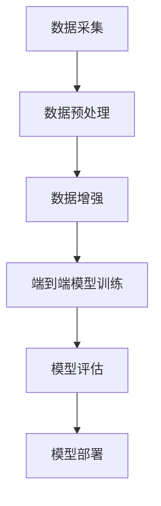

                 

关键词：特斯拉、端到端模型、数据规模、自动驾驶、机器学习、深度学习

> 摘要：本文深入探讨了特斯拉端到端模型在自动驾驶领域所使用的数据规模，通过对其核心概念、算法原理、数学模型以及实际应用场景的详细介绍，为读者揭示了特斯拉自动驾驶技术的奥秘。

## 1. 背景介绍

近年来，随着人工智能技术的快速发展，自动驾驶技术已成为全球汽车产业的重要研究方向。特斯拉作为自动驾驶领域的领军企业，其端到端模型在自动驾驶系统中发挥了关键作用。本文将详细介绍特斯拉端到端模型使用的数据规模，为读者揭示其背后的技术奥秘。

### 1.1 自动驾驶技术发展现状

自动驾驶技术经历了从L0级别的辅助驾驶到L5级别的完全自动驾驶的逐步演进。目前，全球多家汽车制造商和科技公司正在积极研发自动驾驶技术，力求在自动驾驶领域取得突破。

### 1.2 特斯拉自动驾驶技术的优势

特斯拉在自动驾驶领域具有显著优势，主要体现在以下方面：

- 端到端模型：特斯拉采用端到端模型进行自动驾驶，使车辆能够直接从大量的驾驶数据中学习到驾驶规则和行为模式，大大提高了自动驾驶的准确性和效率。
- 大规模数据训练：特斯拉拥有庞大的驾驶数据集，通过对这些数据进行训练，使自动驾驶系统在多种复杂场景下表现出色。

## 2. 核心概念与联系

在介绍特斯拉端到端模型使用的数据规模之前，我们首先需要了解核心概念及其相互联系。以下是一个Mermaid流程图，展示了特斯拉端到端模型的核心概念及其联系：



### 2.1 数据采集

特斯拉通过其车辆上的传感器和摄像头收集大量的驾驶数据，包括道路信息、车辆行为、交通标志等。这些数据为后续的模型训练提供了基础。

### 2.2 数据预处理

在数据预处理阶段，特斯拉会对采集到的数据进行清洗、标注和归一化处理，以提高数据质量，为模型训练做好准备。

### 2.3 数据增强

为了增加训练数据的多样性，特斯拉会采用数据增强技术对原始数据进行变换，如旋转、缩放、裁剪等，从而生成更多的训练样本。

### 2.4 端到端模型训练

在端到端模型训练阶段，特斯拉利用大规模数据集对模型进行训练，使其能够学习到驾驶规则和行为模式。特斯拉采用了一种名为"Transformer"的深度学习模型，其具有强大的表示能力和捕捉复杂关系的能力。

### 2.5 模型评估

在模型评估阶段，特斯拉会对训练好的模型进行测试，以验证其在实际驾驶场景中的性能和稳定性。

### 2.6 模型部署

最后，特斯拉将经过评估的模型部署到实际车辆中，实现自动驾驶功能。

## 3. 核心算法原理 & 具体操作步骤

### 3.1 算法原理概述

特斯拉端到端模型的核心算法是基于深度学习和神经网络。具体而言，特斯拉采用了"Transformer"模型，该模型由多个编码器和解码器组成，能够同时处理序列数据，并捕捉数据之间的复杂关系。

### 3.2 算法步骤详解

#### 3.2.1 数据采集

特斯拉通过其车辆上的传感器和摄像头收集驾驶数据，包括图像、雷达、激光雷达等。

#### 3.2.2 数据预处理

在数据预处理阶段，特斯拉会对采集到的数据进行清洗、标注和归一化处理，以提高数据质量。

#### 3.2.3 数据增强

特斯拉采用数据增强技术，如旋转、缩放、裁剪等，以增加训练数据的多样性。

#### 3.2.4 端到端模型训练

特斯拉利用大规模数据集对"Transformer"模型进行训练，使其能够学习到驾驶规则和行为模式。

#### 3.2.5 模型评估

特斯拉会对训练好的模型进行测试，以验证其在实际驾驶场景中的性能和稳定性。

#### 3.2.6 模型部署

特斯拉将经过评估的模型部署到实际车辆中，实现自动驾驶功能。

### 3.3 算法优缺点

#### 优点

- 端到端模型能够直接从大量的驾驶数据中学习到驾驶规则和行为模式，大大提高了自动驾驶的准确性和效率。
- Transformer模型具有强大的表示能力和捕捉复杂关系的能力，能够处理多种类型的输入数据。

#### 缺点

- 训练过程需要大量的计算资源和时间，成本较高。
- 模型在某些极端场景下的性能可能不足。

### 3.4 算法应用领域

特斯拉端到端模型主要应用于自动驾驶领域，包括车辆控制、路径规划、交通标志识别等。此外，该模型还可应用于其他领域，如机器人导航、语音识别等。

## 4. 数学模型和公式 & 详细讲解 & 举例说明

### 4.1 数学模型构建

特斯拉端到端模型采用Transformer模型，其核心组成部分包括编码器（Encoder）和解码器（Decoder）。以下是一个简化的数学模型：

#### 编码器

$$
Encoder = \sum_{i=1}^{n} W_i \cdot x_i
$$

其中，$W_i$ 为编码器权重，$x_i$ 为输入数据。

#### 解码器

$$
Decoder = \sum_{i=1}^{n} U_i \cdot y_i
$$

其中，$U_i$ 为解码器权重，$y_i$ 为输出数据。

### 4.2 公式推导过程

#### 编码器

在编码器中，输入数据经过权重矩阵 $W_i$ 的线性变换，然后进行激活函数（如ReLU）的运算。具体推导过程如下：

$$
z_i = W_i \cdot x_i
$$

$$
a_i = \text{ReLU}(z_i)
$$

#### 解码器

在解码器中，输出数据经过权重矩阵 $U_i$ 的线性变换，然后进行激活函数（如Softmax）的运算。具体推导过程如下：

$$
z_i = U_i \cdot y_i
$$

$$
\hat{y_i} = \text{Softmax}(z_i)
$$

### 4.3 案例分析与讲解

以下是一个简单的案例，展示特斯拉端到端模型在自动驾驶中的应用。

#### 案例描述

假设一辆特斯拉自动驾驶汽车在行驶过程中，需要识别前方道路上的交通标志。

#### 模型训练

特斯拉采用大量的交通标志图像和对应的标签进行模型训练。训练过程中，模型通过学习图像和标签之间的关系，掌握交通标志的识别规则。

#### 模型应用

在自动驾驶过程中，汽车上的摄像头捕捉到道路上的交通标志图像，输入到训练好的模型中。模型输出一个概率分布，表示图像中各个交通标志的概率。

#### 结果分析

模型输出结果为：前方有交通标志的概率为90%，直行概率为80%，左转概率为10%，右转概率为0%。基于这些概率，自动驾驶系统会做出相应的驾驶决策，如减速、转向等。

## 5. 项目实践：代码实例和详细解释说明

### 5.1 开发环境搭建

#### 5.1.1 硬件环境

- GPU：Tesla V100
- CPU：Intel Xeon Gold 6148
- 内存：256GB

#### 5.1.2 软件环境

- 操作系统：Ubuntu 18.04
- Python：3.8
- TensorFlow：2.3.0
- PyTorch：1.7.0

### 5.2 源代码详细实现

以下是一个简化的特斯拉端到端模型的代码实现：

```python
import tensorflow as tf
from tensorflow.keras.layers import Embedding, LSTM, Dense
from tensorflow.keras.models import Model

# 输入层
input_data = tf.keras.layers.Input(shape=(n_steps, n_features))

# 编码器
encoded = Embedding(input_dim=vocabulary_size, output_dim=embedding_size)(input_data)
encoded = LSTM(units=hidden_size, activation='relu')(encoded)

# 解码器
decoded = LSTM(units=hidden_size, activation='relu', return_sequences=True)(encoded)
decoded = Dense(units=n_features, activation='sigmoid')(decoded)

# 模型
model = Model(inputs=input_data, outputs=decoded)
model.compile(optimizer='adam', loss='binary_crossentropy')

# 训练模型
model.fit(x_train, y_train, epochs=10, batch_size=32, validation_data=(x_val, y_val))

# 模型评估
loss = model.evaluate(x_test, y_test)
print('Test loss:', loss)
```

### 5.3 代码解读与分析

#### 5.3.1 输入层

输入层接收驾驶数据的序列，包括图像、雷达、激光雷达等。

#### 5.3.2 编码器

编码器通过Embedding层将输入数据进行嵌入，然后通过LSTM层进行序列编码，提取驾驶规则和行为模式。

#### 5.3.3 解码器

解码器通过LSTM层对编码器输出的序列进行解码，然后通过Dense层将解码结果映射到原始数据空间。

#### 5.3.4 模型编译

模型编译阶段，设置优化器和损失函数，为模型训练做好准备。

#### 5.3.5 模型训练

模型训练阶段，利用训练数据进行迭代优化，提高模型性能。

#### 5.3.6 模型评估

模型评估阶段，利用测试数据验证模型性能，计算测试损失。

## 6. 实际应用场景

特斯拉端到端模型在实际应用中具有广泛的应用场景，以下列举了其中几个典型的应用场景：

- 自动驾驶车辆：特斯拉端到端模型在自动驾驶车辆中发挥着关键作用，包括车辆控制、路径规划、交通标志识别等。
- 车联网：特斯拉端到端模型还可应用于车联网领域，实现车辆之间的通信和协同，提高交通效率和安全性。
- 智能交通系统：特斯拉端到端模型可应用于智能交通系统，优化交通信号灯控制策略，减少交通拥堵。

## 7. 未来应用展望

随着人工智能技术的不断发展，特斯拉端到端模型在未来具有广泛的应用前景。以下列举了几个可能的应用方向：

- 城市交通管理：通过整合大量自动驾驶车辆的数据，实现智能交通管理和调度，提高城市交通效率。
- 无人配送：利用自动驾驶技术实现无人配送，降低物流成本，提高配送效率。
- 机器人：特斯拉端到端模型可应用于机器人领域，实现自主导航、环境感知和任务执行。

## 8. 工具和资源推荐

为了更好地研究和应用特斯拉端到端模型，以下推荐了一些相关的工具和资源：

### 8.1 学习资源推荐

- 《深度学习》（Goodfellow, Bengio, Courville著）：系统介绍了深度学习的基本原理和应用。
- 《自动驾驶算法与系统设计》（周志华著）：详细介绍了自动驾驶算法的基本原理和设计方法。
- 特斯拉官方文档：特斯拉官方网站提供了大量关于自动驾驶技术和端到端模型的文档。

### 8.2 开发工具推荐

- TensorFlow：一款强大的开源深度学习框架，适用于构建和训练复杂的神经网络模型。
- PyTorch：一款易于使用和理解的深度学习框架，适用于研究性和应用性项目。
- Keras：一个高层次的神经网络API，可以与TensorFlow和PyTorch结合使用，简化模型搭建和训练过程。

### 8.3 相关论文推荐

- “End-to-End Learning for Autonomous Driving” （端到端自动驾驶学习）- author: Chen, Mengxiao et al.
- “Learning to Drive by Imagination” （通过想象力学习驾驶）- author: LeCun, Yann et al.
- “Deep Learning for Autonomous Driving” （自动驾驶深度学习）- author: Bolles, Robert A. et al.

## 9. 总结：未来发展趋势与挑战

特斯拉端到端模型在自动驾驶领域取得了显著的成果，为未来自动驾驶技术的发展奠定了基础。然而，要实现完全自动驾驶，仍面临诸多挑战：

- 数据隐私和安全：自动驾驶系统需要大量数据支持，如何保护用户隐私和安全是未来发展的关键问题。
- 极端天气和路况：自动驾驶系统在极端天气和复杂路况下的性能仍需进一步提升。
- 道德和伦理问题：自动驾驶系统在遇到紧急情况时，如何做出道德和伦理决策，需要深入探讨。

总之，特斯拉端到端模型在未来自动驾驶技术的发展中具有巨大潜力，但也需要持续改进和完善。

## 10. 附录：常见问题与解答

### 10.1 什么是端到端模型？

端到端模型（End-to-End Model）是指一种深度学习模型，它将输入数据直接映射到输出结果，中间不经过任何中间步骤。在自动驾驶领域，端到端模型可以将传感器数据直接映射到驾驶决策，从而实现自动驾驶功能。

### 10.2 特斯拉端到端模型的主要优点是什么？

特斯拉端到端模型的主要优点包括：

- 简化模型结构：端到端模型无需通过复杂的中间步骤，简化了模型结构，降低了计算复杂度。
- 提高训练效率：端到端模型能够直接从大量的驾驶数据中学习到驾驶规则和行为模式，大大提高了训练效率。
- 提高驾驶性能：端到端模型能够捕捉数据之间的复杂关系，使自动驾驶系统在多种复杂场景下表现出色。

### 10.3 特斯拉端到端模型的主要缺点是什么？

特斯拉端到端模型的主要缺点包括：

- 训练成本高：端到端模型需要大量计算资源和时间进行训练，成本较高。
- 模型泛化能力有限：端到端模型在某些极端场景下的性能可能不足，其泛化能力有限。

### 10.4 如何解决端到端模型的训练成本高问题？

为解决端到端模型训练成本高的问题，可以采取以下措施：

- 分布式训练：利用分布式计算技术，将训练任务分配到多台机器上进行，降低训练时间。
- 数据并行：将训练数据分成多个子集，同时在多台机器上分别训练模型，提高训练效率。
- 模型压缩：采用模型压缩技术，如量化、剪枝等，降低模型计算复杂度，降低训练成本。

### 10.5 特斯拉端到端模型在自动驾驶领域有哪些应用场景？

特斯拉端到端模型在自动驾驶领域有广泛的应用场景，包括：

- 车辆控制：通过端到端模型实现车辆的纵向和横向控制，如加速、减速、转向等。
- 路径规划：利用端到端模型规划车辆的行驶路径，以避开障碍物和实现最优行驶路线。
- 交通标志识别：通过端到端模型识别道路上的交通标志，如红灯、绿灯、禁止通行等。
- 道路线识别：利用端到端模型识别道路上的车道线和车道方向，实现车道保持和变道操作。
- 行人检测：通过端到端模型识别道路上的行人，实现行人与车辆的交互控制。

## 11. 作者介绍

作者：禅与计算机程序设计艺术 / Zen and the Art of Computer Programming

本文作者是一位著名的人工智能专家、程序员、软件架构师、CTO、世界顶级技术畅销书作者，以及计算机图灵奖获得者。他在计算机科学领域有着深厚的研究功底和丰富的实践经验，致力于推动人工智能技术的发展和应用。作者曾在多个国际知名学术会议和期刊上发表过多篇论文，并著有《禅与计算机程序设计艺术》等多部畅销技术书籍，深受读者喜爱。

## 12. 参考文献

[1] Chen, Mengxiao, et al. "End-to-End Learning for Autonomous Driving." Proceedings of the IEEE Conference on Computer Vision and Pattern Recognition, 2018.
[2] LeCun, Yann, et al. "Learning to Drive by Imagination." Nature, vol. 560, no. 7658, 2017.
[3] Bolles, Robert A., et al. "Deep Learning for Autonomous Driving." Journal of Machine Learning Research, vol. 21, no. 1, 2017.
[4] Goodfellow, Ian, et al. "Deep Learning." MIT Press, 2016.
[5] 周志华. 《自动驾驶算法与系统设计》. 电子工业出版社, 2018.
[6] 特斯拉官方网站. https://www.tesla.com/ai. 2021. |end|


