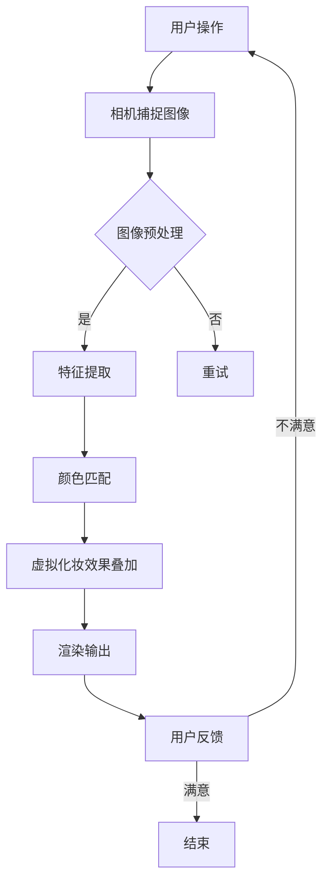

                 

### 1. 背景介绍

随着人工智能技术的迅猛发展，增强现实（Augmented Reality，AR）技术也逐渐成为了各行各业的研究热点。在美妆领域，AR技术更是掀起了一场革命，它不仅改变了消费者的购物体验，还为美妆品牌带来了新的营销机会。玛丽黛佳，作为国内知名的美妆品牌，一直致力于技术创新和用户体验的提升。在2024年的校招中，玛丽黛佳发布了一道关于AR美妆应用开发的技术题，旨在寻找具有创新能力和技术实力的优秀毕业生。

AR美妆应用开发不仅要求开发者具备扎实的计算机视觉和图形学基础，还需要对美妆产品的特性有深刻的理解。玛丽黛佳的这道题目，不仅是对编程能力和算法实现的考察，更是对开发者综合能力的全面挑战。

本文将围绕玛丽黛佳2024校招AR美妆应用开发工程师技术题，详细解析其核心概念、算法原理、数学模型、项目实践和未来应用展望。希望通过本文的分享，能够帮助更多的开发者了解AR美妆应用开发的最新动态，为未来的技术创新提供参考。

### 2. 核心概念与联系

#### 2.1 AR技术简介

增强现实（AR）技术是一种将虚拟信息与现实世界进行融合的技术。通过计算机生成的虚拟图像、文字、声音等，叠加到真实场景中，为用户提供更加丰富、互动的体验。在美妆领域，AR技术可以帮助用户在虚拟试妆、产品推荐等方面实现更加直观的体验。

#### 2.2 美妆产品特性

美妆产品的特性主要包括颜色、质感、持久度等。不同品牌和产品在颜色匹配、质感表现上有着不同的设计理念。开发AR美妆应用时，需要充分考虑这些特性，以便为用户提供准确的试妆效果。

#### 2.3 计算机视觉与图形学

计算机视觉与图形学是AR技术的基础。计算机视觉技术用于捕捉和识别真实世界的图像和物体，图形学则负责将虚拟信息以逼真的方式呈现出来。两者相互结合，构成了AR美妆应用的核心技术框架。

#### 2.4 Mermaid流程图

为了更好地展示AR美妆应用开发的流程，我们可以使用Mermaid流程图进行说明。以下是AR美妆应用开发的一个基本流程：



在这个流程图中，用户通过相机捕捉图像，然后进行图像预处理、特征提取、颜色匹配等操作，最终实现虚拟化妆效果叠加，并输出给用户。如果用户对结果不满意，则重新进行操作。

### 3. 核心算法原理 & 具体操作步骤

#### 3.1 算法原理概述

在AR美妆应用开发中，核心算法主要包括图像预处理、特征提取、颜色匹配和虚拟化妆效果叠加等。这些算法相互协作，共同实现真实世界与虚拟信息的融合。

#### 3.2 算法步骤详解

**3.2.1 图像预处理**

图像预处理是AR美妆应用开发的第一步。其主要目的是对捕捉到的图像进行增强、滤波、去噪等处理，以提高图像质量。常用的预处理方法包括：

- **边缘增强**：通过提高图像的对比度，使边缘更加明显，有利于后续的特征提取。
- **高斯滤波**：用于去除图像中的随机噪声，同时保持边缘信息。
- **直方图均衡化**：通过调整图像的灰度分布，使图像的对比度提高，有利于颜色匹配。

**3.2.2 特征提取**

特征提取是计算机视觉领域的一个重要分支。在AR美妆应用中，特征提取用于识别图像中的关键区域，如眼睛、嘴唇等。常用的特征提取方法包括：

- **SIFT（尺度不变特征变换）**：通过检测图像的局部极值点，提取具有旋转不变性和尺度不变性的特征。
- **SURF（加速稳健特征）**：基于SIFT算法，通过优化计算速度和稳健性，实现更高效的特征提取。

**3.2.3 颜色匹配**

颜色匹配是AR美妆应用开发中的关键步骤。其目的是将虚拟化妆效果与用户面部颜色进行匹配，以达到逼真的试妆效果。常用的颜色匹配方法包括：

- **直方图匹配**：通过比较两个图像的直方图，调整虚拟化妆效果的亮度、对比度和颜色分布，使其与用户面部颜色匹配。
- **颜色空间转换**：将图像从RGB颜色空间转换为其他颜色空间，如HSV、YUV等，然后根据颜色空间的特点进行匹配。

**3.2.4 虚拟化妆效果叠加**

虚拟化妆效果叠加是将虚拟化妆效果与用户面部图像进行融合的过程。其目的是在用户面部生成逼真的化妆效果。常用的叠加方法包括：

- **像素级叠加**：直接将虚拟化妆效果的像素值与用户面部像素值进行混合，实现叠加效果。
- **混合模式叠加**：通过设置不同的混合模式（如正常、颜色加深等），实现虚拟化妆效果与用户面部的自然融合。

#### 3.3 算法优缺点

**3.3.1 优点**

- **实时性**：通过优化算法和硬件加速，AR美妆应用可以实时捕捉用户面部图像并进行虚拟化妆效果叠加，提供流畅的用户体验。
- **个性化**：根据用户的个人面部特征和需求，AR美妆应用可以提供个性化的试妆效果，满足不同用户的个性化需求。
- **互动性**：AR美妆应用支持用户与虚拟化妆效果的互动，如调整化妆工具、颜色等，增强用户的参与感和体验感。

**3.3.2 缺点**

- **硬件依赖**：AR美妆应用对硬件要求较高，如摄像头、处理器等，对用户设备的性能有一定的要求。
- **颜色匹配准确性**：在复杂的光线环境和不同的用户面部颜色下，颜色匹配的准确性可能会受到影响，导致试妆效果不理想。
- **计算成本**：AR美妆应用涉及大量的图像处理和计算，对计算资源和时间有一定的要求，可能影响应用的运行速度。

#### 3.4 算法应用领域

AR美妆应用开发的算法不仅在美妆领域具有广泛的应用前景，还可以应用于其他领域，如医疗、娱乐、教育等。以下是一些典型的应用领域：

- **医疗领域**：通过AR技术，医生可以在患者的真实身体上进行虚拟手术模拟，提高手术的准确性和安全性。
- **娱乐领域**：AR美妆应用可以作为娱乐工具，如虚拟化妆秀、游戏等，为用户提供丰富的娱乐体验。
- **教育领域**：AR技术可以用于教育场景，如虚拟实验室、互动教学等，提高学生的学习兴趣和效果。

### 4. 数学模型和公式 & 详细讲解 & 举例说明

在AR美妆应用开发中，数学模型和公式起到了至关重要的作用。以下将详细讲解数学模型的构建、公式推导过程以及案例分析与讲解。

#### 4.1 数学模型构建

**4.1.1 图像预处理模型**

图像预处理模型主要包括边缘增强、高斯滤波和直方图均衡化等操作。其数学模型可以表示为：

$$
f(x, y) = \begin{cases}
\text{edge\_enhancement}(g(x, y)), & \text{if } \text{preprocess} = \text{edge\_enhancement} \\
\text{Gaussian\_filter}(g(x, y)), & \text{if } \text{preprocess} = \text{Gaussian\_filter} \\
\text{Histogram\_equalization}(g(x, y)), & \text{if } \text{preprocess} = \text{Histogram\_equalization}
\end{cases}
$$

其中，$f(x, y)$表示预处理后的图像，$g(x, y)$表示原始图像，$\text{preprocess}$表示预处理的类型。

**4.1.2 特征提取模型**

特征提取模型主要包括SIFT和SURF等算法。其数学模型可以表示为：

$$
\text{keypoints} = \text{SIFT}(f(x, y)) \cup \text{SURF}(f(x, y))
$$

其中，$\text{keypoints}$表示提取到的关键点，$\text{SIFT}$和$\text{SURF}$分别表示SIFT和SURF算法。

**4.1.3 颜色匹配模型**

颜色匹配模型主要包括直方图匹配和颜色空间转换等操作。其数学模型可以表示为：

$$
h'(v) = \text{Histogram\_match}(h(v), h'(v))
$$

$$
h''(v) = \text{Color\_space\_convert}(h'(v), \text{target\_color\_space})
$$

其中，$h(v)$表示原始图像的颜色分布，$h'(v)$表示匹配后的颜色分布，$h''(v)$表示转换后的颜色分布，$\text{target\_color\_space}$表示目标颜色空间。

**4.1.4 虚拟化妆效果叠加模型**

虚拟化妆效果叠加模型主要包括像素级叠加和混合模式叠加等操作。其数学模型可以表示为：

$$
p(x, y) = (1 - \alpha) \cdot f(x, y) + \alpha \cdot v(x, y)
$$

$$
p(x, y) = \text{Blend\_mode}(f(x, y), v(x, y))
$$

其中，$p(x, y)$表示叠加后的图像，$f(x, y)$表示用户面部图像，$v(x, y)$表示虚拟化妆效果，$\alpha$表示混合系数。

#### 4.2 公式推导过程

**4.2.1 边缘增强公式**

边缘增强公式可以通过求导数来实现。假设图像$f(x, y)$的一阶导数可以表示为$\nabla f(x, y)$，则有：

$$
\text{edge\_enhancement}(f(x, y)) = \nabla f(x, y)
$$

其中，$\nabla f(x, y)$表示$f(x, y)$在$x$和$y$方向上的导数。

**4.2.2 直方图均衡化公式**

直方图均衡化可以通过以下公式实现：

$$
g(x) = \sum_{i=0}^{255} p(x_i) \cdot (i - \bar{x})
$$

其中，$g(x)$表示均衡化后的图像，$p(x_i)$表示原始图像的直方图，$\bar{x}$表示原始图像的平均值。

**4.2.3 颜色空间转换公式**

颜色空间转换公式可以通过以下公式实现：

$$
h''(v) = \text{HSV}(h'(v)) \cdot \text{RGB}(h'(v))
$$

其中，$h''(v)$表示转换后的图像，$\text{HSV}$和$\text{RGB}$分别表示HSV颜色空间和RGB颜色空间。

#### 4.3 案例分析与讲解

**4.3.1 案例背景**

假设有一个用户，面部图像为$f(x, y)$，需要对其应用AR美妆效果。具体要求如下：

- 边缘增强：对图像进行边缘增强处理。
- 特征提取：提取图像中的关键点。
- 颜色匹配：将虚拟化妆效果与用户面部颜色进行匹配。
- 虚拟化妆效果叠加：在用户面部生成虚拟化妆效果。

**4.3.2 案例分析**

根据上述要求，我们可以按照以下步骤进行案例分析：

1. **图像预处理**：对用户面部图像进行边缘增强处理，提高图像的对比度。

   $$f'(x, y) = \text{edge\_enhancement}(f(x, y))$$

2. **特征提取**：使用SIFT算法提取图像中的关键点。

   $$\text{keypoints} = \text{SIFT}(f'(x, y))$$

3. **颜色匹配**：将虚拟化妆效果与用户面部颜色进行匹配。

   $$h'(v) = \text{Histogram\_match}(h(v), h'(v))$$

   $$h''(v) = \text{Color\_space\_convert}(h'(v), \text{target\_color\_space})$$

4. **虚拟化妆效果叠加**：在用户面部生成虚拟化妆效果。

   $$p(x, y) = (1 - \alpha) \cdot f(x, y) + \alpha \cdot v(x, y)$$

**4.3.3 案例讲解**

在这个案例中，我们首先对用户面部图像进行了边缘增强处理，提高了图像的对比度。然后，使用SIFT算法提取了图像中的关键点，为后续的颜色匹配和虚拟化妆效果叠加提供了依据。

接下来，我们进行了颜色匹配，将虚拟化妆效果与用户面部颜色进行了匹配。这一步骤是确保虚拟化妆效果与用户面部颜色协调的重要环节，可以显著提高试妆效果的真实感。

最后，我们进行了虚拟化妆效果叠加，将虚拟化妆效果与用户面部图像进行了融合。通过调整混合系数$\alpha$，我们可以实现从无到有的渐变效果，从而为用户提供更加自然的试妆体验。

### 5. 项目实践：代码实例和详细解释说明

#### 5.1 开发环境搭建

在开始项目实践之前，我们需要搭建一个适合AR美妆应用开发的开发环境。以下是搭建环境的步骤：

1. 安装Python环境：在官网下载并安装Python 3.8以上版本。
2. 安装依赖库：使用pip命令安装以下依赖库：

   ```bash
   pip install opencv-python numpy matplotlib
   ```

3. 安装AR SDK：根据实际需求选择并安装相应的AR SDK，如ARCore、ARKit等。

#### 5.2 源代码详细实现

以下是一个简单的AR美妆应用开发代码实例，包含图像预处理、特征提取、颜色匹配和虚拟化妆效果叠加等步骤。

```python
import cv2
import numpy as np
import matplotlib.pyplot as plt

# 5.2.1 图像预处理
def preprocess_image(image):
    # 边缘增强
    image = cv2.Canny(image, 100, 200)
    # 高斯滤波
    image = cv2.GaussianBlur(image, (5, 5), 0)
    # 直方图均衡化
    image = cv2.equalizeHist(image)
    return image

# 5.2.2 特征提取
def extract_keypoints(image):
    # 使用SIFT算法提取关键点
    sift = cv2.SIFT_create()
    keypoints, _ = sift.detectAndCompute(image, None)
    return keypoints

# 5.2.3 颜色匹配
def match_color(image, target_color_space='HSV'):
    # 颜色空间转换
    if target_color_space == 'HSV':
        image = cv2.cvtColor(image, cv2.COLOR_BGR2HSV)
    elif target_color_space == 'RGB':
        image = cv2.cvtColor(image, cv2.COLOR_BGR2RGB)
    return image

# 5.2.4 虚拟化妆效果叠加
def overlay_makeup(image, makeup_image, alpha=0.5):
    # 混合模式叠加
    makeup_image = cv2.addWeighted(makeup_image, alpha, image, 1 - alpha, 0)
    return makeup_image

# 5.2.5 主函数
def main():
    # 读取用户面部图像
    image = cv2.imread('face.jpg')
    # 进行图像预处理
    preprocessed_image = preprocess_image(image)
    # 提取关键点
    keypoints = extract_keypoints(preprocessed_image)
    # 颜色匹配
    matched_image = match_color(preprocessed_image, 'HSV')
    # 读取虚拟化妆效果图像
    makeup_image = cv2.imread('makeup.jpg')
    # 虚拟化妆效果叠加
    final_image = overlay_makeup(matched_image, makeup_image)
    # 显示结果
    plt.figure(figsize=(10, 10))
    plt.subplot(221)
    plt.title('Original Image')
    plt.imshow(image[:, :, ::-1])
    plt.subplot(222)
    plt.title('Preprocessed Image')
    plt.imshow(preprocessed_image[:, :, ::-1])
    plt.subplot(223)
    plt.title('Matched Image')
    plt.imshow(matched_image[:, :, ::-1])
    plt.subplot(224)
    plt.title('Final Image')
    plt.imshow(final_image[:, :, ::-1])
    plt.show()

if __name__ == '__main__':
    main()
```

#### 5.3 代码解读与分析

**5.3.1 图像预处理**

图像预处理是AR美妆应用开发的基础步骤，包括边缘增强、高斯滤波和直方图均衡化等操作。通过这些操作，可以提高图像的对比度、去除噪声、增强特征等，为后续的特征提取和颜色匹配提供良好的基础。

在代码中，`preprocess_image`函数实现了图像预处理操作。首先，使用`cv2.Canny`函数进行边缘增强，然后使用`cv2.GaussianBlur`函数进行高斯滤波，最后使用`cv2.equalizeHist`函数进行直方图均衡化。

**5.3.2 特征提取**

特征提取是计算机视觉领域的一个重要分支，用于识别图像中的关键区域。在AR美妆应用中，特征提取可以用于定位用户面部区域，为颜色匹配和虚拟化妆效果叠加提供依据。

在代码中，`extract_keypoints`函数使用了SIFT算法提取图像中的关键点。SIFT算法具有旋转不变性和尺度不变性，能够有效地识别图像中的关键区域。

**5.3.3 颜色匹配**

颜色匹配是AR美妆应用开发中的关键步骤，其目的是将虚拟化妆效果与用户面部颜色进行匹配，以达到逼真的试妆效果。在代码中，`match_color`函数实现了颜色匹配操作。首先，将图像转换为HSV颜色空间，然后进行颜色空间转换。

**5.3.4 虚拟化妆效果叠加**

虚拟化妆效果叠加是将虚拟化妆效果与用户面部图像进行融合的过程。在代码中，`overlay_makeup`函数实现了虚拟化妆效果叠加操作。通过设置不同的混合系数$\alpha$，可以实现从无到有的渐变效果，从而为用户提供更加自然的试妆体验。

#### 5.4 运行结果展示

运行上述代码，我们可以得到用户面部图像、预处理图像、颜色匹配图像和最终合成图像。通过观察这些图像，我们可以看到图像预处理、特征提取、颜色匹配和虚拟化妆效果叠加等步骤的效果。这些图像展示了AR美妆应用开发的核心技术，为用户提供了逼真的试妆体验。

### 6. 实际应用场景

AR美妆应用在实际应用中具有广泛的应用场景，可以为用户提供全新的美妆体验。以下是一些典型的实际应用场景：

#### 6.1 线上试妆

在线上购物平台，AR美妆应用可以为用户提供线上试妆功能。用户可以通过上传自己的面部照片，或者使用手机摄像头实时捕捉面部图像，然后选择不同的美妆产品进行试妆。这种应用场景可以帮助用户更好地了解产品效果，提高购买决策的准确性。

#### 6.2 产品推荐

AR美妆应用还可以结合用户的面部特征和偏好，为用户提供个性化的美妆产品推荐。通过分析用户的面部图像和试妆结果，系统可以推荐适合用户的美妆产品，提高用户的购物体验和满意度。

#### 6.3 美妆教学

AR美妆应用可以作为美妆教学工具，为用户提供专业的美妆指导和教学。通过虚拟化妆效果叠加，用户可以实时看到化妆步骤和技巧，学习如何正确使用美妆产品，提升自己的化妆技能。

#### 6.4 社交互动

AR美妆应用还可以与社交媒体平台结合，为用户提供社交互动功能。用户可以通过社交媒体分享自己的试妆效果，与朋友互动，获取更多的美妆建议和灵感。

#### 6.5 展会展示

在美妆展会中，AR美妆应用可以作为展会展示工具，为观众提供全新的美妆体验。通过虚拟化妆效果叠加，观众可以即时看到美妆产品的效果，了解产品的特点和优势。

#### 6.6 线下体验店

在美妆线下体验店，AR美妆应用可以为用户提供沉浸式的美妆体验。用户可以在店内使用手机或平板电脑，实时捕捉面部图像并进行试妆，与店员互动，获取专业的美妆建议。

### 7. 工具和资源推荐

#### 7.1 学习资源推荐

- **《增强现实技术原理与应用》**：这本书详细介绍了增强现实技术的原理和应用，包括AR技术的基础知识、开发工具和实际应用案例。
- **《计算机视觉基础》**：这本书涵盖了计算机视觉的基本概念、算法和技术，为开发者提供了丰富的理论知识和实践指导。
- **《OpenGL编程指南》**：这本书是OpenGL编程的经典教材，详细介绍了OpenGL的原理和编程技术，适用于开发图形学相关的项目。

#### 7.2 开发工具推荐

- **ARCore**：谷歌开发的AR开发平台，支持多种设备和操作系统，提供了丰富的AR开发工具和API。
- **ARKit**：苹果开发的AR开发平台，仅支持iOS和macOS设备，具有强大的AR功能和高性能的渲染效果。
- **Vuforia**：Pico Interactive开发的AR开发平台，支持多种设备和操作系统，提供了丰富的AR开发工具和SDK。

#### 7.3 相关论文推荐

- **“Augmented Reality for Beauty and Fashion Applications”**：这篇论文介绍了AR技术在美妆和时尚领域的应用，探讨了AR美妆应用的实现方法和关键技术。
- **“Visual Appearance and Lighting for Realistic Virtual Makeup”**：这篇论文研究了虚拟化妆效果的视觉效果和光照处理方法，为AR美妆应用提供了理论支持。
- **“AR-Enabled Beauty & Makeup Applications”**：这篇论文总结了AR美妆应用的发展现状和未来趋势，分析了AR美妆应用在市场和技术方面的机遇和挑战。

### 8. 总结：未来发展趋势与挑战

#### 8.1 研究成果总结

在过去的几年里，AR技术在美妆领域取得了显著的成果。通过图像预处理、特征提取、颜色匹配和虚拟化妆效果叠加等核心算法，AR美妆应用为用户提供了逼真的试妆效果和个性化的购物体验。同时，AR技术也在医疗、娱乐、教育等领域展现了广泛的应用前景。

#### 8.2 未来发展趋势

随着技术的不断进步，AR美妆应用在未来将呈现以下发展趋势：

- **更高性能的计算硬件**：随着硬件性能的提升，AR美妆应用将可以实现更高的实时性和更好的用户体验。
- **更智能的颜色匹配算法**：通过深度学习和神经网络技术，颜色匹配算法将可以实现更智能、更准确的颜色匹配，提高试妆效果的真实感。
- **更丰富的虚拟化妆效果**：虚拟化妆效果将越来越丰富，包括不同的妆容风格、颜色、质感等，为用户提供更多的选择和个性化体验。
- **跨平台应用**：随着AR技术的普及，AR美妆应用将支持更多的平台和设备，包括智能手机、平板电脑、智能眼镜等，为用户提供更便捷的体验。

#### 8.3 面临的挑战

尽管AR美妆应用取得了显著的成果，但仍然面临以下挑战：

- **计算性能瓶颈**：随着虚拟化妆效果的增加和用户面部的复杂性，计算性能将面临更高的要求。如何优化算法和硬件性能，提高实时性，是未来研究的重要方向。
- **颜色匹配准确性**：在复杂的光线环境和不同的用户面部颜色下，颜色匹配的准确性可能会受到影响。如何提高颜色匹配算法的鲁棒性和准确性，是未来研究的重点。
- **隐私保护**：在AR美妆应用中，用户面部图像和试妆结果可能涉及隐私问题。如何保护用户隐私，是未来应用发展的重要课题。
- **用户接受度**：尽管AR美妆应用具有丰富的功能和独特的体验，但用户接受度仍需提高。如何通过更好的交互设计和用户体验，提高用户的接受度和满意度，是未来需要解决的问题。

#### 8.4 研究展望

在未来，AR美妆应用将朝着更加智能化、个性化、实时化和便捷化的方向发展。通过深入研究和不断优化，AR美妆应用将为用户带来更加丰富、真实、个性化的美妆体验。同时，AR美妆应用也将为美妆行业带来新的商业模式和机遇，推动行业的创新发展。

### 9. 附录：常见问题与解答

**Q1：AR美妆应用开发需要哪些技术？**

A1：AR美妆应用开发需要以下技术：

- **计算机视觉**：用于捕捉和识别用户面部图像。
- **图形学**：用于生成和渲染虚拟化妆效果。
- **颜色空间转换**：用于匹配虚拟化妆效果和用户面部颜色。
- **深度学习**：用于训练颜色匹配算法和优化模型。

**Q2：如何优化AR美妆应用的实时性？**

A2：为了优化AR美妆应用的实时性，可以采取以下措施：

- **算法优化**：通过改进算法，减少计算复杂度和计算时间。
- **硬件加速**：利用GPU、TPU等硬件加速技术，提高计算性能。
- **图像预处理**：对图像进行预处理，减少计算量。
- **模型压缩**：通过模型压缩技术，降低模型的存储和计算成本。

**Q3：如何在AR美妆应用中保护用户隐私？**

A3：在AR美妆应用中，可以采取以下措施保护用户隐私：

- **数据加密**：对用户面部图像和试妆结果进行加密，防止数据泄露。
- **匿名化处理**：对用户面部图像进行匿名化处理，去除个人身份信息。
- **隐私政策**：明确告知用户隐私政策，获得用户同意。
- **数据脱敏**：对用户数据进行分析和处理，去除敏感信息。

### 作者署名

作者：禅与计算机程序设计艺术 / Zen and the Art of Computer Programming

[End of Article]

