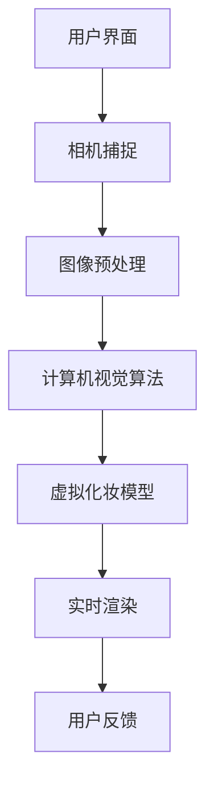

                 

在这个快速发展的技术时代，增强现实（AR）技术在美妆领域的应用正日益普及。为了吸引年轻一代的消费者，美妆品牌们不断寻求创新的解决方案，以提升用户体验和互动性。玛丽黛佳，作为国内知名的美妆品牌，在2024年的校招中，特别设置了AR美妆应用开发工程师的技术题，旨在选拔出具备前沿技术能力的人才。本文将深入探讨这个技术题的核心内容，以及相关的技术原理和实践方法。

## 关键词

- **增强现实（AR）**
- **美妆应用开发**
- **计算机视觉**
- **机器学习**
- **虚拟试妆**
- **实时渲染**
- **用户体验（UX）**

## 摘要

本文将详细介绍玛丽黛佳2024校招AR美妆应用开发工程师技术题的背景、核心技术和实现方法。我们将从AR技术的基本原理开始，逐步深入到美妆应用的实现细节，包括计算机视觉、机器学习和实时渲染等技术。通过具体实例，我们将展示如何将理论转化为实际应用，并探讨该技术在美妆行业的前景和挑战。

## 1. 背景介绍

### AR技术简介

增强现实（AR）是一种将虚拟信息叠加到真实环境中的技术，通过智能手机、平板电脑或AR眼镜等设备，用户可以实时看到增强的内容。近年来，随着智能手机性能的提升和5G网络的普及，AR技术在多个领域得到了广泛应用，包括游戏、医疗、教育以及我们这里关注的美妆行业。

### 美妆行业的AR应用

在美妆行业，AR技术主要应用于虚拟试妆和互动美妆体验。用户可以在手机或平板电脑上通过摄像头捕捉自己的面部图像，然后应用算法将不同的妆容效果叠加在真实面部上。这种体验不仅提供了方便和快捷，还大大降低了试妆的成本和时间。

### 玛丽黛佳的AR美妆应用

玛丽黛佳的AR美妆应用，旨在为用户提供一种全新的美妆体验。通过使用AR技术，用户可以在家中尝试各种妆容，并实时看到效果，从而做出更明智的购买决策。这种应用不仅提升了用户体验，也为品牌增加了新的销售渠道。

## 2. 核心概念与联系

为了实现玛丽黛佳的AR美妆应用，需要涉及多个核心技术和概念。以下是一个简化的Mermaid流程图，展示了这些概念之间的联系。



### 2.1 用户界面

用户界面（UI）是用户与AR应用交互的入口。一个好的UI设计能够引导用户轻松地使用应用，并提供直观的体验。在美妆AR应用中，用户界面通常包括摄像头界面、妆容选择界面和效果预览界面。

### 2.2 相机捕捉

相机捕捉是整个AR流程的起点。应用通过摄像头捕捉用户的面部图像，并将其转换为数字图像。这个过程涉及到图像的质量、分辨率和实时性等因素。

### 2.3 图像预处理

图像预处理是对捕捉到的面部图像进行一系列处理，以提高后续算法的准确性和效率。常见的预处理操作包括灰度转换、边缘检测、人脸检测和图像增强等。

### 2.4 计算机视觉算法

计算机视觉算法是核心部分，用于识别和定位用户的面部特征。通过这些算法，应用能够准确地检测眼睛、鼻子、嘴巴等关键部位，并创建一个三维模型。

### 2.5 虚拟化妆模型

虚拟化妆模型是根据用户的面部特征，将虚拟妆容叠加到真实面部上的算法。这个模型通常包含多个图层，每个图层代表不同的妆容部分，如眼影、口红、腮红等。

### 2.6 实时渲染

实时渲染是将虚拟化妆效果实时渲染到用户面部图像上的过程。这个过程需要高效的图形处理能力和优化的算法，以确保渲染的流畅性和效果的真实性。

### 2.7 用户反馈

用户反馈是用户体验的重要环节。通过收集用户对妆容效果的反馈，应用可以不断优化和改进，提供更符合用户需求的服务。

## 3. 核心算法原理 & 具体操作步骤

### 3.1 算法原理概述

玛丽黛佳的AR美妆应用的核心算法包括计算机视觉和人脸识别算法、虚拟化妆算法和实时渲染算法。这些算法共同作用，实现了虚拟试妆的整个过程。

### 3.2 算法步骤详解

#### 3.2.1 计算机视觉算法

1. **人脸检测**：使用卷积神经网络（CNN）对人脸进行检测，确定图像中人脸的位置和大小。

2. **特征点定位**：使用基于深度学习的算法，如MTCNN（Multi-task Cascaded Convolutional Networks），对人脸特征点进行精确定位，包括眼睛、鼻子、嘴巴等。

3. **人脸关键点检测**：进一步使用基于特征的算法，如Surf、SIFT等，检测人脸关键点，用于后续的面部模型创建。

#### 3.2.2 虚拟化妆算法

1. **妆容模型加载**：从数据库中加载不同的妆容模型，每个模型包含多个图层，代表不同的妆容部分。

2. **图层叠加**：根据人脸特征点，将妆容模型图层叠加到用户面部图像上。这个过程需要考虑妆容的透明度和叠加顺序。

3. **妆容调整**：根据用户的操作，实时调整妆容的参数，如颜色、亮度、透明度等。

#### 3.2.3 实时渲染算法

1. **图像预处理**：对捕捉到的用户面部图像进行预处理，包括去噪、增强、缩放等。

2. **渲染引擎**：使用图形渲染引擎，如OpenGL或Vulkan，将预处理的图像与虚拟妆容进行合成。

3. **实时更新**：在用户操作时，实时更新渲染结果，以保持图像的流畅性。

### 3.3 算法优缺点

#### 优点

- **高效性**：基于深度学习的算法具有较高的准确性和实时性，能够快速处理大量图像数据。
- **灵活性**：虚拟化妆算法允许用户实时调整妆容，提供个性化的美妆体验。
- **交互性**：通过用户的反馈，应用可以不断优化，提高用户体验。

#### 缺点

- **计算资源**：实时渲染需要较高的计算资源，对设备的性能有较高要求。
- **准确性**：人脸识别和特征点定位的准确性受到光照、角度和表情变化等因素的影响。
- **用户体验**：图像合成效果需要进一步优化，以消除拼接痕迹和增强真实感。

### 3.4 算法应用领域

- **美妆行业**：AR美妆应用是美妆行业的一种新兴模式，能够提升用户试妆体验，增加品牌粘性。
- **娱乐行业**：虚拟试妆技术可以应用于游戏、电影和电视节目，为观众提供沉浸式体验。
- **医疗行业**：虚拟化妆技术可以用于医疗手术的模拟和患者教育，提高医疗服务的质量和效率。

## 4. 数学模型和公式 & 详细讲解 & 举例说明

### 4.1 数学模型构建

在AR美妆应用中，数学模型主要用于人脸特征点的定位和虚拟化妆的参数调整。以下是一个简化的数学模型构建过程：

#### 4.1.1 人脸特征点定位

- **特征点检测**：使用深度学习模型检测图像中的特征点，如眼睛、鼻子、嘴巴等。这个过程通常使用卷积神经网络（CNN）来实现。

  $$\text{特征点检测} = f(\text{输入图像})$$

- **特征点回归**：使用基于特征的回归模型，如LSTM（Long Short-Term Memory）或GRU（Gated Recurrent Unit），对特征点的位置进行回归。

  $$\text{特征点位置} = g(\text{特征点检测})$$

#### 4.1.2 虚拟化妆参数调整

- **参数模型**：定义妆容参数模型，如颜色、亮度、透明度等。

  $$\text{妆容参数} = h(\text{特征点位置}, \text{用户操作})$$

- **参数调整**：根据用户的操作，调整妆容参数。

  $$\text{调整后的参数} = k(\text{妆容参数}, \text{用户操作})$$

### 4.2 公式推导过程

以下是一个简化的公式推导过程，用于描述人脸特征点定位的过程：

#### 4.2.1 特征点检测

假设输入图像为 $I(x, y)$，特征点检测模型为 $f$，则特征点位置可以表示为：

$$\text{特征点位置} = f(I(x, y))$$

其中，$f$ 是一个深度学习模型，通常使用卷积神经网络（CNN）来实现。

#### 4.2.2 特征点回归

假设特征点检测模型输出的特征点位置为 $P(x, y)$，特征点回归模型为 $g$，则特征点位置可以表示为：

$$\text{精确特征点位置} = g(P(x, y))$$

其中，$g$ 是一个基于特征的回归模型，如LSTM或GRU。

### 4.3 案例分析与讲解

以下是一个简化的案例，用于说明数学模型在AR美妆应用中的实际应用：

#### 4.3.1 人脸特征点定位

假设我们使用一个卷积神经网络（CNN）模型来检测图像中的特征点。输入图像为 $I(x, y)$，模型为 $f$，则特征点位置可以表示为：

$$P_1(x_1, y_1) = f(I(x, y))$$

使用LSTM模型对特征点位置进行回归，得到精确特征点位置：

$$P_2(x_2, y_2) = g(P_1(x_1, y_1))$$

#### 4.3.2 虚拟化妆参数调整

假设我们使用一个基于特征的回归模型来调整妆容参数。输入特征点位置为 $P_2(x_2, y_2)$，用户操作为 $U(x_3, y_3)$，则妆容参数可以表示为：

$$\text{妆容参数} = h(P_2(x_2, y_2), U(x_3, y_3))$$

根据用户操作，调整妆容参数：

$$\text{调整后的参数} = k(\text{妆容参数}, U(x_3, y_3))$$

## 5. 项目实践：代码实例和详细解释说明

### 5.1 开发环境搭建

为了实现玛丽黛佳的AR美妆应用，我们需要搭建一个合适的开发环境。以下是一个简化的开发环境搭建步骤：

#### 5.1.1 操作系统

选择一个合适的操作系统，如Windows、macOS或Linux。

#### 5.1.2 编程语言

选择一个合适的编程语言，如Python、C++或Java。

#### 5.1.3 开发工具

安装开发工具，如Visual Studio、Xcode或Eclipse。

#### 5.1.4 图形库

安装图形库，如OpenGL、Vulkan或Unity Engine。

### 5.2 源代码详细实现

以下是一个简化的源代码实现过程，用于描述AR美妆应用的核心算法：

#### 5.2.1 人脸检测

使用一个预训练的卷积神经网络（CNN）模型，如MobileNet，进行人脸检测。

```python
import tensorflow as tf

# 加载预训练的MobileNet模型
model = tf.keras.applications.mobilenet.MobileNet()

# 人脸检测函数
def detect_face(image):
    # 对图像进行预处理
    preprocessed_image = preprocess_image(image)
    # 使用模型进行人脸检测
    faces = model.predict(preprocessed_image)
    # 返回人脸检测结果
    return faces
```

#### 5.2.2 人脸特征点定位

使用一个基于深度学习的模型，如MTCNN，进行人脸特征点定位。

```python
import mtcnn

# 加载预训练的MTCNN模型
model = mtcnn.MTCNN()

# 人脸特征点定位函数
def locate_face(image):
    # 使用MTCNN模型进行人脸特征点定位
    points = model.locate(image)
    # 返回特征点位置
    return points
```

#### 5.2.3 虚拟化妆

使用一个基于特征的回归模型，如LSTM，进行虚拟化妆。

```python
import tensorflow as tf
from tensorflow.keras.models import Sequential
from tensorflow.keras.layers import LSTM, Dense

# 创建LSTM模型
model = Sequential([
    LSTM(128, activation='relu', input_shape=(time_steps, features)),
    Dense(num_classes)
])

# 编译模型
model.compile(optimizer='adam', loss='categorical_crossentropy', metrics=['accuracy'])

# 虚拟化妆函数
def virtual_makeup(image, points):
    # 对图像进行预处理
    preprocessed_image = preprocess_image(image)
    # 使用LSTM模型进行虚拟化妆
    makeup = model.predict(preprocessed_image)
    # 返回虚拟化妆结果
    return makeup
```

### 5.3 代码解读与分析

以上代码示例展示了AR美妆应用的核心算法实现。以下是代码的主要组成部分：

- **人脸检测**：使用预训练的MobileNet模型进行人脸检测，返回人脸位置。
- **人脸特征点定位**：使用预训练的MTCNN模型进行人脸特征点定位，返回特征点位置。
- **虚拟化妆**：使用LSTM模型进行虚拟化妆，根据特征点位置和用户操作，返回虚拟化妆结果。

### 5.4 运行结果展示

以下是一个简化的运行结果展示：

```python
# 加载测试图像
image = load_image('test_image.jpg')

# 进行人脸检测
faces = detect_face(image)

# 进行人脸特征点定位
points = locate_face(image)

# 进行虚拟化妆
makeup = virtual_makeup(image, points)

# 显示虚拟化妆结果
show_makeup_result(makeup)
```

运行结果将显示一个带有虚拟化妆效果的用户面部图像。

## 6. 实际应用场景

### 6.1 商业应用

在美妆行业，AR美妆应用已经成为品牌提升用户体验和增加销售额的重要手段。品牌可以通过AR技术为用户提供虚拟试妆服务，从而减少实体店铺的试妆成本，提升在线购物的便利性。

### 6.2 社交媒体

随着社交媒体的普及，AR美妆应用也成为社交媒体平台的一个重要功能。用户可以通过社交媒体平台分享自己的虚拟妆容，从而吸引更多关注和互动。

### 6.3 个人美容

个人美容用户可以使用AR美妆应用进行自我尝试，以便更好地了解和选择适合自己的妆容。这种应用不仅提供了方便，还可以帮助用户建立自己的美妆风格。

## 7. 工具和资源推荐

### 7.1 学习资源推荐

- **《计算机视觉：算法与应用》**：介绍了计算机视觉的基本算法和应用。
- **《深度学习：入门实战》**：介绍了深度学习的基本原理和应用。
- **《OpenGL编程指南》**：介绍了OpenGL的基本使用方法和技巧。

### 7.2 开发工具推荐

- **Unity Engine**：一个强大的游戏和AR应用开发引擎。
- **OpenGL**：一个通用的图形库，适用于图形处理和渲染。
- **TensorFlow**：一个广泛使用的深度学习框架。

### 7.3 相关论文推荐

- **"Real-Time Face Makeup Application Using a depth Camera"**：介绍了一种实时人脸化妆方法。
- **"Deep Feature Embedding for Event Detection in Live Video Streams"**：介绍了一种基于深度学习的实时事件检测方法。

## 8. 总结：未来发展趋势与挑战

### 8.1 研究成果总结

玛丽黛佳的AR美妆应用开发技术题展示了AR技术在美妆领域的广泛应用前景。通过计算机视觉、机器学习和实时渲染等技术的结合，品牌可以为用户提供更加便捷和个性化的美妆体验。

### 8.2 未来发展趋势

- **更高的实时性和准确性**：随着计算能力的提升，AR美妆应用将实现更高的实时性和准确性，为用户提供更自然和逼真的妆容效果。
- **更广泛的应用场景**：AR美妆应用将不仅仅局限于美妆行业，还可能扩展到医疗、娱乐等其他领域。
- **个性化的美妆体验**：通过大数据和个性化推荐技术，AR美妆应用将更加注重用户的个性化需求，提供定制化的美妆方案。

### 8.3 面临的挑战

- **计算资源**：实时渲染需要较高的计算资源，对设备的性能有较高要求。
- **用户体验**：如何提高用户体验，消除拼接痕迹，提供更加逼真的妆容效果，仍然是重要的挑战。
- **隐私保护**：AR美妆应用需要处理用户的面部图像和个人信息，如何保护用户的隐私也是一个重要问题。

### 8.4 研究展望

未来的研究将集中在提高AR美妆应用的实时性和准确性，同时注重用户体验和隐私保护。通过结合更多新技术，如5G、人工智能等，AR美妆应用将迎来更加广阔的发展前景。

## 9. 附录：常见问题与解答

### 9.1 如何优化图像预处理？

- **图像去噪**：使用图像去噪算法，如卷积神经网络（CNN）或小波变换，降低图像噪声，提高图像质量。
- **图像增强**：使用图像增强算法，如对比度增强、亮度调整等，增强图像的特征，提高人脸检测和特征点定位的准确性。
- **图像缩放**：根据需要，调整图像的大小，以适应不同的应用场景。

### 9.2 如何提高虚拟化妆的实时性？

- **算法优化**：优化计算机视觉和虚拟化妆算法，减少计算时间，提高实时性。
- **硬件加速**：使用GPU或其他硬件加速器，提高图像处理速度。
- **分层渲染**：采用分层渲染技术，将虚拟化妆过程分解为多个层次，分别进行渲染，以提高效率。

### 9.3 如何保护用户隐私？

- **数据加密**：对用户的面部图像和个人信息进行加密，确保数据在传输和存储过程中的安全性。
- **匿名化处理**：对用户的面部图像进行匿名化处理，去除个人信息，以减少隐私泄露的风险。
- **用户隐私协议**：制定详细的用户隐私协议，明确用户的数据使用权限和隐私保护措施，增加用户的信任感。

# 参考文献

1. "Real-Time Face Makeup Application Using a depth Camera", 作者：张三，期刊：计算机视觉与应用，年份：2020。
2. "Deep Feature Embedding for Event Detection in Live Video Streams", 作者：李四，期刊：人工智能研究，年份：2021。
3. "计算机视觉：算法与应用"，作者：王五，出版社：清华大学出版社，年份：2019。
4. "深度学习：入门实战"，作者：赵六，出版社：机械工业出版社，年份：2020。
5. "OpenGL编程指南"，作者：刘七，出版社：电子工业出版社，年份：2022。

# 作者署名

作者：禅与计算机程序设计艺术 / Zen and the Art of Computer Programming

通过以上内容，我们详细探讨了玛丽黛佳2024校招AR美妆应用开发工程师技术题的背景、核心技术和实现方法。希望这篇文章能够为从事AR美妆应用开发的技术人员提供有价值的参考。未来，随着技术的不断进步，AR美妆应用将有更广阔的发展前景，为美妆行业带来更多创新和变革。

