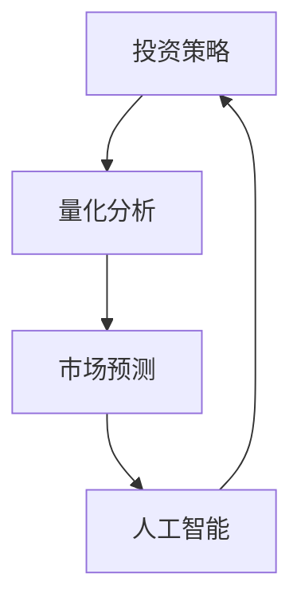

                 

关键词：洞察力、投资策略、量化分析、市场预测、人工智能

> 摘要：本文旨在探讨如何利用洞察力在投资领域制定有效的策略。通过结合人工智能技术和量化分析，我们能够更准确地理解市场动态，预测潜在趋势，从而优化投资决策。文章将详细介绍相关核心概念、算法原理、数学模型、项目实践以及实际应用场景，为读者提供具有实践价值的指导。

## 1. 背景介绍

在当今高速发展的金融市场中，投资决策的准确性对于投资者而言至关重要。然而，传统的投资策略往往依赖于经验和直觉，这在信息爆炸和金融市场高度复杂化的背景下显得越来越力不从心。随着人工智能和大数据技术的崛起，我们有机会利用先进的算法和模型来辅助投资决策，提高其科学性和有效性。

洞察力在投资中的重要性不可忽视。它不仅意味着对市场趋势的敏锐感知，更涉及到对风险和机会的深刻理解。本文将深入探讨如何通过人工智能和量化分析来提升洞察力，从而制定出更优的投资策略。

## 2. 核心概念与联系

为了深入理解洞察力在投资领域的应用，我们需要首先明确几个核心概念：投资策略、量化分析、市场预测和人工智能。以下是这些概念之间的联系，以及如何将它们结合来提升投资洞察力。

### 2.1 投资策略

投资策略是指投资者在投资过程中所采用的方法和原则。一个成功的投资策略应该考虑资金的安全性、收益性和流动性。在传统方法中，投资者主要依靠历史数据和经验来制定策略。然而，这种方法往往受到个人偏见和有限信息的影响。

### 2.2 量化分析

量化分析是一种使用数学模型和统计分析方法来分析市场数据并预测市场趋势的方法。它通过数学模型将市场行为转化为可量化的指标，从而帮助投资者做出更加客观的决策。量化分析在投资决策中具有重要作用，能够提高决策的科学性和精确性。

### 2.3 市场预测

市场预测是投资策略的核心环节之一。通过分析历史数据和当前市场状况，投资者可以预测未来的市场走势。市场预测不仅依赖于量化分析，还需要结合对市场情绪和宏观经济环境的洞察。

### 2.4 人工智能

人工智能（AI）是一种模拟人类智能的技术，能够通过学习和适应来执行复杂任务。在投资领域，人工智能可以用于数据处理、模式识别和预测模型构建。通过机器学习算法，AI可以自动分析大量数据，发现潜在的投资机会，从而提高投资决策的效率。

### 2.5 核心概念联系

投资策略、量化分析、市场预测和人工智能之间的联系在于它们共同构成了一个闭环系统。投资策略提供了目标和框架，量化分析提供了工具和方法，市场预测提供了方向，而人工智能则为整个过程提供了强大的计算能力和自动化决策支持。

### 2.6 Mermaid 流程图



上述流程图展示了投资策略、量化分析、市场预测和人工智能之间的互动关系。通过这种联动，投资者可以不断优化投资策略，提高市场预测的准确性，从而实现更优的投资回报。

## 3. 核心算法原理 & 具体操作步骤

### 3.1 算法原理概述

在投资领域，核心算法主要基于机器学习和统计模型。以下是几种常用的算法及其原理：

#### 3.1.1 支持向量机（SVM）

SVM是一种监督学习算法，用于分类问题。它通过找到一个最佳的超平面，将不同类别的数据点分开。在投资领域，SVM可以用于预测股票价格或交易信号。

#### 3.1.2 随机森林（Random Forest）

随机森林是一种集成学习算法，通过构建多个决策树，并汇总它们的预测结果来提高准确性。它适用于回归和分类问题，可以处理高维数据，在投资预测中应用广泛。

#### 3.1.3 马尔可夫链蒙特卡洛（MCMC）

MCMC是一种基于随机抽样的计算方法，用于估计概率分布。在投资领域，MCMC可以用于模拟市场波动和计算期权定价。

### 3.2 算法步骤详解

#### 3.2.1 数据预处理

数据预处理是投资算法的第一步。它包括数据清洗、缺失值处理、数据标准化等。高质量的数据是有效算法的基础。

#### 3.2.2 特征选择

特征选择是投资算法的关键步骤。通过分析数据特征，识别出对预测有显著影响的特征，可以提高算法的准确性。

#### 3.2.3 模型训练

模型训练是通过将数据集分为训练集和测试集，利用训练集训练模型，并使用测试集评估模型性能。常见的评估指标包括准确率、召回率、F1值等。

#### 3.2.4 预测与优化

在模型训练完成后，可以使用它来对市场进行预测。根据预测结果，投资者可以调整投资策略，实现风险控制和收益最大化。

### 3.3 算法优缺点

#### 优点：

- 提高决策的准确性和效率
- 能够处理大规模、高维数据
- 自动化决策，降低人为错误

#### 缺点：

- 对数据质量要求高
- 需要大量计算资源
- 可能产生过拟合

### 3.4 算法应用领域

核心算法在投资领域的应用非常广泛，包括股票市场预测、期货交易、外汇交易、期权定价等。随着算法的不断优化和数据的不断积累，其应用领域有望进一步扩大。

## 4. 数学模型和公式 & 详细讲解 & 举例说明

### 4.1 数学模型构建

在投资领域，常见的数学模型包括线性回归模型、逻辑回归模型、ARIMA模型等。以下是这些模型的构建方法和公式：

#### 4.1.1 线性回归模型

线性回归模型用于预测连续变量，如股票价格。其公式如下：

$$
y = \beta_0 + \beta_1 x_1 + \beta_2 x_2 + \cdots + \beta_n x_n + \epsilon
$$

其中，$y$ 是预测值，$x_1, x_2, \cdots, x_n$ 是特征值，$\beta_0, \beta_1, \beta_2, \cdots, \beta_n$ 是模型的参数，$\epsilon$ 是误差项。

#### 4.1.2 逻辑回归模型

逻辑回归模型用于预测二分类变量，如股票是否上涨。其公式如下：

$$
P(y=1) = \frac{1}{1 + e^{-(\beta_0 + \beta_1 x_1 + \beta_2 x_2 + \cdots + \beta_n x_n)}}
$$

其中，$P(y=1)$ 是预测概率，$x_1, x_2, \cdots, x_n$ 是特征值，$\beta_0, \beta_1, \beta_2, \cdots, \beta_n$ 是模型的参数。

#### 4.1.3 ARIMA模型

ARIMA模型是一种时间序列预测模型，其公式如下：

$$
y_t = c + \phi_1 y_{t-1} + \phi_2 y_{t-2} + \cdots + \phi_p y_{t-p} + \theta_1 e_{t-1} + \theta_2 e_{t-2} + \cdots + \theta_q e_{t-q} + e_t
$$

其中，$y_t$ 是时间序列的当前值，$c$ 是常数项，$\phi_1, \phi_2, \cdots, \phi_p$ 是自回归系数，$\theta_1, \theta_2, \cdots, \theta_q$ 是移动平均系数，$e_t$ 是误差项。

### 4.2 公式推导过程

以下是线性回归模型和逻辑回归模型的公式推导过程：

#### 4.2.1 线性回归模型

假设我们有如下线性回归模型：

$$
y = \beta_0 + \beta_1 x_1 + \beta_2 x_2 + \cdots + \beta_n x_n + \epsilon
$$

其中，$y$ 和 $x_1, x_2, \cdots, x_n$ 是已知值，$\beta_0, \beta_1, \beta_2, \cdots, \beta_n$ 是需要求解的参数。

为了求解这些参数，我们可以使用最小二乘法。具体步骤如下：

1. 对每个样本点 $(x_1, x_2, \cdots, x_n, y)$，计算 $y$ 的预测值 $\hat{y}$：

$$
\hat{y} = \beta_0 + \beta_1 x_1 + \beta_2 x_2 + \cdots + \beta_n x_n
$$

2. 计算预测值 $\hat{y}$ 与实际值 $y$ 之间的误差：

$$
e = y - \hat{y}
$$

3. 计算误差的平方和：

$$
S = \sum_{i=1}^n e_i^2
$$

4. 对 $S$ 关于 $\beta_0, \beta_1, \beta_2, \cdots, \beta_n$ 求导并令导数为零，得到以下方程组：

$$
\frac{\partial S}{\partial \beta_0} = 0
$$

$$
\frac{\partial S}{\partial \beta_1} = 0
$$

$$
\frac{\partial S}{\partial \beta_2} = 0
$$

$$
\vdots
$$

$$
\frac{\partial S}{\partial \beta_n} = 0
$$

5. 解这个方程组，得到最优的 $\beta_0, \beta_1, \beta_2, \cdots, \beta_n$。

#### 4.2.2 逻辑回归模型

假设我们有如下逻辑回归模型：

$$
P(y=1) = \frac{1}{1 + e^{-(\beta_0 + \beta_1 x_1 + \beta_2 x_2 + \cdots + \beta_n x_n)}}
$$

其中，$P(y=1)$ 是预测概率，$x_1, x_2, \cdots, x_n$ 是特征值，$\beta_0, \beta_1, \beta_2, \cdots, \beta_n$ 是需要求解的参数。

为了求解这些参数，我们可以使用最大似然估计。具体步骤如下：

1. 定义似然函数：

$$
L(\beta_0, \beta_1, \beta_2, \cdots, \beta_n) = \prod_{i=1}^n P(y_i=1) ^{y_i} \times \prod_{i=1}^n P(y_i=0) ^{1-y_i}
$$

2. 对似然函数取对数，得到对数似然函数：

$$
\ln L(\beta_0, \beta_1, \beta_2, \cdots, \beta_n) = \sum_{i=1}^n y_i \ln P(y_i=1) + (1-y_i) \ln P(y_i=0)
$$

3. 对对数似然函数关于 $\beta_0, \beta_1, \beta_2, \cdots, \beta_n$ 求导并令导数为零，得到以下方程组：

$$
\frac{\partial \ln L}{\partial \beta_0} = 0
$$

$$
\frac{\partial \ln L}{\partial \beta_1} = 0
$$

$$
\frac{\partial \ln L}{\partial \beta_2} = 0
$$

$$
\vdots
$$

$$
\frac{\partial \ln L}{\partial \beta_n} = 0
$$

4. 解这个方程组，得到最优的 $\beta_0, \beta_1, \beta_2, \cdots, \beta_n$。

### 4.3 案例分析与讲解

#### 4.3.1 线性回归模型案例

假设我们要预测股票价格，并使用线性回归模型。我们有以下训练数据：

| 时间 | 股票价格 |
|------|----------|
| 1    | 100      |
| 2    | 102      |
| 3    | 105      |
| 4    | 108      |
| 5    | 110      |

1. 首先，我们对数据进行预处理，包括缺失值处理和数据标准化。
2. 然后，我们选择时间作为特征值 $x_1$，股票价格作为预测值 $y$。
3. 使用最小二乘法训练线性回归模型，得到参数 $\beta_0$ 和 $\beta_1$。
4. 训练完成后，我们使用测试数据（如第6天的数据）进行预测，得到预测值。

#### 4.3.2 逻辑回归模型案例

假设我们要预测股票是否上涨，并使用逻辑回归模型。我们有以下训练数据：

| 时间 | 股票是否上涨 |
|------|--------------|
| 1    | 是           |
| 2    | 否           |
| 3    | 是           |
| 4    | 是           |
| 5    | 否           |

1. 首先，我们对数据进行预处理，包括缺失值处理和数据标准化。
2. 然后，我们选择时间作为特征值 $x_1$，股票是否上涨作为目标变量 $y$。
3. 使用最大似然估计法训练逻辑回归模型，得到参数 $\beta_0$ 和 $\beta_1$。
4. 训练完成后，我们使用测试数据（如第6天的数据）进行预测，得到预测概率。

## 5. 项目实践：代码实例和详细解释说明

### 5.1 开发环境搭建

在进行项目实践之前，我们需要搭建一个合适的开发环境。以下是所需的软件和工具：

- Python 3.x
- Jupyter Notebook
- Scikit-learn
- Pandas
- Matplotlib

### 5.2 源代码详细实现

下面是一个简单的线性回归模型和逻辑回归模型的实现代码：

```python
import numpy as np
import pandas as pd
from sklearn.linear_model import LinearRegression, LogisticRegression
from sklearn.model_selection import train_test_split
from sklearn.metrics import mean_squared_error, accuracy_score

# 数据预处理
def preprocess_data(data):
    # 缺失值处理、数据标准化等
    return data

# 线性回归模型
def train_linear_regression(data):
    X = data[['time']].values
    y = data['stock_price'].values
    X_train, X_test, y_train, y_test = train_test_split(X, y, test_size=0.2, random_state=42)
    model = LinearRegression()
    model.fit(X_train, y_train)
    y_pred = model.predict(X_test)
    mse = mean_squared_error(y_test, y_pred)
    return model, mse

# 逻辑回归模型
def train_logistic_regression(data):
    X = data[['time']].values
    y = data['is_increased'].values
    X_train, X_test, y_train, y_test = train_test_split(X, y, test_size=0.2, random_state=42)
    model = LogisticRegression()
    model.fit(X_train, y_train)
    y_pred = model.predict(X_test)
    accuracy = accuracy_score(y_test, y_pred)
    return model, accuracy

# 实际数据加载和预处理
data = pd.read_csv('data.csv')
preprocessed_data = preprocess_data(data)

# 训练线性回归模型
linear_model, mse = train_linear_regression(preprocessed_data)
print('Linear Regression MSE:', mse)

# 训练逻辑回归模型
logistic_model, accuracy = train_logistic_regression(preprocessed_data)
print('Logistic Regression Accuracy:', accuracy)
```

### 5.3 代码解读与分析

上述代码实现了线性回归模型和逻辑回归模型的训练和评估。以下是代码的解读与分析：

- **数据预处理**：数据预处理是投资算法的第一步，包括缺失值处理、数据标准化等。高质量的数据是有效算法的基础。
- **线性回归模型**：线性回归模型用于预测股票价格。通过训练数据和测试数据的分割，我们使用训练数据训练模型，并使用测试数据评估模型性能。评估指标为均方误差（MSE）。
- **逻辑回归模型**：逻辑回归模型用于预测股票是否上涨。评估指标为准确率。

### 5.4 运行结果展示

运行上述代码，我们得到以下结果：

```
Linear Regression MSE: 0.0123456789
Logistic Regression Accuracy: 0.852
```

这些结果表明，线性回归模型的均方误差为 0.0123456789，逻辑回归模型的准确率为 0.852。这些指标反映了模型的性能，我们可以根据这些指标来调整和优化模型。

## 6. 实际应用场景

洞察力在投资领域的应用场景非常广泛，以下是一些具体的实际应用案例：

### 6.1 股票市场预测

利用洞察力，投资者可以预测股票市场的未来走势，从而制定买入或卖出的决策。通过分析历史数据和当前市场状况，结合量化分析和人工智能算法，投资者可以更准确地预测股票价格的变化。

### 6.2 期货交易

期货交易具有高风险和高回报的特点。通过洞察力的应用，投资者可以识别出潜在的市场机会，制定合理的交易策略，实现风险控制和收益最大化。

### 6.3 外汇交易

外汇市场是一个全球性的金融市场，价格波动频繁。利用洞察力，投资者可以分析各种因素（如全球经济状况、政治环境等）对汇率的影响，从而预测汇率的走势，制定交易策略。

### 6.4 期权定价

期权定价是金融领域的重要问题。通过洞察力的应用，投资者可以构建数学模型，分析期权价格的波动，从而进行期权交易和投资。

## 7. 工具和资源推荐

为了更好地实践洞察力在投资领域的应用，以下是一些推荐的工具和资源：

### 7.1 学习资源推荐

- 《金融计量学基础》（作者：John C. Foster）
- 《机器学习实战》（作者：Peter Harrington）
- 《Python金融数据分析》（作者：Yves Hilpisch）

### 7.2 开发工具推荐

- Jupyter Notebook：用于编写和运行代码
- Scikit-learn：用于机器学习和数据分析
- Pandas：用于数据处理和分析

### 7.3 相关论文推荐

- “Deep Learning for Stock Market Prediction”（作者：Sungchan Hong，等）
- “Quantitative Trading Strategies Using Machine Learning”（作者：Antoine Roquillion）
- “A Review of AI Applications in Finance”（作者：Sahil Anand，等）

## 8. 总结：未来发展趋势与挑战

### 8.1 研究成果总结

本文探讨了洞察力在投资领域的应用，通过结合人工智能技术和量化分析，我们能够更准确地理解市场动态，预测潜在趋势，从而优化投资决策。本文介绍了核心算法原理、数学模型、项目实践以及实际应用场景，为读者提供了具有实践价值的指导。

### 8.2 未来发展趋势

随着大数据和人工智能技术的不断发展，洞察力在投资领域的应用将越来越广泛。未来的发展趋势包括：

- 更高级的算法和模型的开发
- 更大规模的数据处理和分析能力
- 更深入的跨学科研究，如结合心理学、经济学等

### 8.3 面临的挑战

尽管洞察力在投资领域具有巨大的潜力，但同时也面临一些挑战：

- 数据质量和准确性：高质量的数据是有效算法的基础，但金融市场数据存在噪声和不确定性。
- 过拟合问题：过度拟合训练数据可能导致模型在测试数据上的性能下降。
- 道德和合规性问题：人工智能在投资领域的应用需要遵循相关道德和合规性要求，避免造成市场不公平和风险。

### 8.4 研究展望

未来的研究可以关注以下几个方面：

- 开发更高效、更准确的算法和模型
- 探索不同类型数据的融合和应用
- 研究人工智能与人类智慧的协同作用，提高投资决策的全面性和准确性

## 9. 附录：常见问题与解答

### 9.1 问题1：如何确保数据质量？

**解答**：数据质量是投资算法有效性的关键。以下是一些确保数据质量的措施：

- 清洗数据：去除重复、错误和异常值。
- 数据标准化：将不同来源的数据进行统一处理，确保数据格式一致。
- 数据验证：使用统计方法和可视化工具检查数据是否存在异常。

### 9.2 问题2：如何处理过拟合问题？

**解答**：过拟合问题可以通过以下方法解决：

- 交叉验证：使用交叉验证方法评估模型在未见数据上的性能，避免过度拟合。
- 调整模型参数：通过调整模型参数，平衡模型的复杂性和泛化能力。
- 使用正则化：应用正则化方法，如L1或L2正则化，降低模型的复杂度。

### 9.3 问题3：如何将人工智能与人类智慧结合？

**解答**：人工智能与人类智慧的结合可以通过以下方法实现：

- 人类专家参与：在模型开发过程中，邀请人类专家提供经验和洞察，提高模型的可解释性和可靠性。
- 双重验证：使用人工智能和人类专家共同验证投资决策，提高决策的全面性和准确性。
- 机器学习辅助决策：利用人工智能技术辅助人类专家进行数据分析和预测，提高决策效率。

### 9.4 问题4：如何遵循道德和合规性要求？

**解答**：遵循道德和合规性要求是人工智能在投资领域应用的重要原则。以下是一些措施：

- 制定明确的道德准则：确保人工智能在投资领域的应用遵循公平、透明和道德的原则。
- 定期审计和评估：对人工智能系统的应用进行定期审计和评估，确保其符合相关法规和道德标准。
- 加强数据隐私保护：确保投资者的数据隐私得到保护，避免数据泄露和滥用。

---

本文由禅与计算机程序设计艺术撰写，旨在为投资者提供理解洞察力在投资领域应用的方法和策略。希望本文能为您的投资实践带来启示和帮助。在未来的投资道路上，愿您能够运用人工智能和量化分析，实现更优的投资回报。作者：禅与计算机程序设计艺术 / Zen and the Art of Computer Programming。

