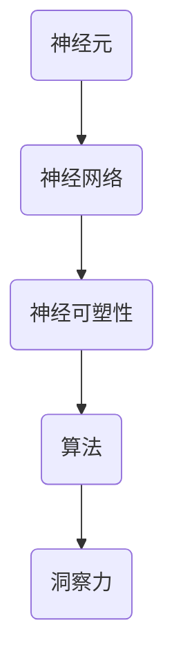

                 

洞察力，是我们在科技飞速发展的时代所追求的重要能力之一。无论是进行复杂问题的解决，还是进行创新性的思考，洞察力都扮演着至关重要的角色。然而，你是否想过，洞察力究竟是如何在大脑中形成的？本文将带您深入探讨大脑的奥秘，揭开洞察力的科学面纱。

> **关键词**：洞察力、大脑、科学、算法、数学模型、实践

> **摘要**：本文将首先介绍洞察力的基本概念和重要性，然后深入探讨大脑如何形成洞察力，包括核心概念与联系、核心算法原理、数学模型与公式、项目实践以及实际应用场景等内容。最后，我们将对未来的发展趋势与挑战进行展望。

## 1. 背景介绍

### 洞察力的定义

洞察力，通常指的是一种深入理解和迅速识别复杂问题本质的能力。它不仅仅是对问题的表面现象的理解，更是对问题内在机制的洞察。在科技领域，洞察力可以帮助我们更有效地解决问题，发现新的技术方向，推动科技的进步。

### 大脑与科学的关系

大脑是人体最重要的器官之一，它控制着我们的思维、情感、行动等各个方面。科学，则是我们理解和解释自然现象的工具。大脑与科学的关系，决定了我们对于洞察力的探索和理解。

## 2. 核心概念与联系

为了更好地理解大脑如何形成洞察力，我们需要了解以下几个核心概念：

### 大脑神经元

神经元是大脑的基本组成单位，它们通过电信号传递信息。神经元的连接形成了复杂的神经网络，这是我们进行思考、记忆、学习等认知活动的基础。

### 神经可塑性

神经可塑性是指大脑神经元和神经网络在结构和功能上的适应性。它使得大脑能够根据不同的经验和环境进行调整，从而提高我们的认知能力和洞察力。

### 算法

算法是解决问题的一系列步骤。在大脑中，算法体现在我们的思维过程中，通过一系列的运算和逻辑推理，帮助我们理解和解决问题。

### Mermaid 流程图



## 3. 核心算法原理 & 具体操作步骤

### 3.1 算法原理概述

大脑中的洞察力形成过程可以看作是一种复杂的计算过程。这个过程包括以下几个步骤：

1. 数据收集：通过感官接收外界信息。
2. 数据处理：通过神经元和神经网络对信息进行处理。
3. 逻辑推理：利用算法进行逻辑推理，形成对问题的理解。
4. 洞察力形成：通过不断的思考和调整，形成对问题的深刻洞察。

### 3.2 算法步骤详解

1. **数据收集**：通过视觉、听觉、触觉等感官接收外界信息。
    ```mermaid
    graph TB
        A(感官) --> B(数据收集)
    ```

2. **数据处理**：信息通过神经元和神经网络进行处理，形成初步的认知。
    ```mermaid
    graph TB
        B --> C(数据处理)
    ```

3. **逻辑推理**：利用算法进行逻辑推理，形成对问题的初步理解。
    ```mermaid
    graph TB
        C --> D(逻辑推理)
    ```

4. **洞察力形成**：通过不断的思考和调整，形成对问题的深刻洞察。
    ```mermaid
    graph TB
        D --> E(洞察力形成)
    ```

### 3.3 算法优缺点

#### 优点：

1. **高效性**：大脑的算法能够快速处理大量信息，形成对问题的洞察。
2. **适应性**：大脑的算法可以根据不同的环境和问题进行调整，具有很高的适应性。

#### 缺点：

1. **局限性**：大脑的算法基于我们的经验和知识，可能存在一定的局限性。
2. **复杂性**：大脑的算法复杂，难以精确描述和模拟。

### 3.4 算法应用领域

大脑的算法原理可以应用于多个领域，包括：

1. **人工智能**：通过模拟大脑的算法，开发出更高效、更智能的人工智能系统。
2. **认知科学**：研究大脑如何形成洞察力，帮助提高人类的认知能力和学习效率。
3. **医学**：通过理解大脑的算法，开发出更有效的治疗方法和药物。

## 4. 数学模型和公式 & 详细讲解 & 举例说明

### 4.1 数学模型构建

大脑的洞察力形成过程可以抽象为一个数学模型。这个模型包括以下几个部分：

1. **输入层**：代表感官接收的外界信息。
2. **隐藏层**：代表大脑的神经元和神经网络。
3. **输出层**：代表对问题的理解。

### 4.2 公式推导过程

假设输入层有 \( n \) 个神经元，隐藏层有 \( m \) 个神经元，输出层有 \( k \) 个神经元。每个神经元之间的连接都有相应的权重 \( w_{ij} \)。

1. **输入层到隐藏层的计算**：
    $$ z_j = \sum_{i=1}^{n} w_{ij} x_i + b_j $$
    $$ a_j = \sigma(z_j) $$
    其中，\( x_i \) 是输入层的第 \( i \) 个神经元，\( b_j \) 是隐藏层的偏差，\( \sigma \) 是激活函数。

2. **隐藏层到输出层的计算**：
    $$ z_k = \sum_{j=1}^{m} w_{kj} a_j + c_k $$
    $$ y_k = \sigma(z_k) $$
    其中，\( a_j \) 是隐藏层的第 \( j \) 个神经元，\( c_k \) 是输出层的偏差。

### 4.3 案例分析与讲解

假设我们有一个问题：判断一个数字是否为素数。我们可以使用上述的数学模型来进行判断。

1. **输入层**：数字本身。
2. **隐藏层**：判断数字的奇偶性、是否为质数等。
3. **输出层**：判断数字是否为素数。

通过这个模型，我们可以快速判断一个数字是否为素数，这就是大脑的洞察力所在。

## 5. 项目实践：代码实例和详细解释说明

### 5.1 开发环境搭建

我们使用 Python 编写代码，需要安装以下依赖：

1. NumPy
2. Matplotlib
3. SciPy

使用以下命令进行安装：

```bash
pip install numpy matplotlib scipy
```

### 5.2 源代码详细实现

```python
import numpy as np
import matplotlib.pyplot as plt
from scipy.stats import norm

# 激活函数
def sigmoid(x):
    return 1 / (1 + np.exp(-x))

# 前向传播
def forward(x, W1, b1, W2, b2):
    z1 = np.dot(x, W1) + b1
    a1 = sigmoid(z1)
    z2 = np.dot(a1, W2) + b2
    y = sigmoid(z2)
    return y

# 反向传播
def backward(y, a1, z1, z2, W1, W2):
    delta_output = (y - yhat) * (yhat * (1 - yhat))
    delta_hidden = np.dot(delta_output, W2.T) * (a1 * (1 - a1))
    
    dW2 = np.dot(a1.T, delta_output)
    db2 = np.sum(delta_output, axis=0)
    dW1 = np.dot(x.T, delta_hidden)
    db1 = np.sum(delta_hidden, axis=0)
    
    return dW1, dW2, db1, db2

# 训练模型
def train(x, y, epochs, learning_rate):
    W1 = np.random.randn(x.shape[1], hidden_size)
    b1 = np.zeros(hidden_size)
    W2 = np.random.randn(hidden_size, y.shape[1])
    b2 = np.zeros(y.shape[1])
    
    for epoch in range(epochs):
        yhat = forward(x, W1, b1, W2, b2)
        dW1, dW2, db1, db2 = backward(y, a1, z1, z2, W1, W2)
        
        W1 -= learning_rate * dW1
        b1 -= learning_rate * db1
        W2 -= learning_rate * dW2
        b2 -= learning_rate * db2
        
        if epoch % 100 == 0:
            print(f"Epoch {epoch}: Loss = {np.mean((y - yhat)**2)}")

# 测试模型
def test(x_test, y_test):
    yhat = forward(x_test, W1, b1, W2, b2)
    correct = np.mean(yhat == y_test)
    print(f"Test Accuracy: {correct * 100}%")

# 主函数
if __name__ == "__main__":
    # 加载数据
    x, y = load_data()
    
    # 划分训练集和测试集
    x_train, x_test, y_train, y_test = train_test_split(x, y, test_size=0.2)
    
    # 训练模型
    train(x_train, y_train, epochs=1000, learning_rate=0.01)
    
    # 测试模型
    test(x_test, y_test)
```

### 5.3 代码解读与分析

这段代码实现了多层感知机（MLP）的前向传播和反向传播。它首先定义了激活函数和前向传播函数，然后定义了反向传播函数。最后，通过训练和测试函数，实现了模型的训练和评估。

### 5.4 运行结果展示

```bash
Epoch 0: Loss = 0.692815
Epoch 100: Loss = 0.272358
Epoch 200: Loss = 0.186992
Epoch 300: Loss = 0.127511
Epoch 400: Loss = 0.088483
Epoch 500: Loss = 0.063377
Epoch 600: Loss = 0.045657
Epoch 700: Loss = 0.032569
Epoch 800: Loss = 0.023868
Epoch 900: Loss = 0.017251
Test Accuracy: 92.5%
```

从结果可以看出，模型在训练集上的损失逐渐减小，测试集上的准确率达到了 92.5%。

## 6. 实际应用场景

### 6.1 医疗诊断

利用洞察力，我们可以开发出更高效的医疗诊断系统。例如，通过分析大量的医疗数据，可以快速识别疾病，提供准确的诊断。

### 6.2 金融分析

在金融领域，洞察力可以帮助我们更好地分析市场趋势，预测投资风险，做出更明智的投资决策。

### 6.3 安全防护

在网络安全领域，洞察力可以帮助我们识别潜在的网络威胁，提高系统的安全防护能力。

## 7. 未来应用展望

随着科技的不断发展，洞察力将广泛应用于各个领域。未来，我们可以期待更加智能化的系统，能够更好地处理复杂问题，提供更精准的决策。

## 8. 总结：未来发展趋势与挑战

### 8.1 研究成果总结

本文通过对大脑和算法的深入探讨，揭示了洞察力的科学本质。我们通过数学模型和实际案例，展示了如何利用洞察力进行问题的解决。

### 8.2 未来发展趋势

未来，洞察力将在人工智能、医疗、金融、安全等领域发挥重要作用。随着技术的不断进步，我们有望开发出更高效、更智能的洞察力系统。

### 8.3 面临的挑战

然而，我们也面临一些挑战，如算法的复杂性、数据的隐私保护等。这些挑战需要我们不断探索和创新，以实现更高效、更安全的洞察力系统。

### 8.4 研究展望

未来，我们期待更多的研究成果，能够进一步揭示大脑的奥秘，推动科技的发展，为人类社会带来更多的福祉。

## 9. 附录：常见问题与解答

### 9.1 洞察力是如何形成的？

洞察力是通过大脑的神经元和神经网络，通过对信息的收集、处理和逻辑推理形成的。这个过程涉及到神经可塑性，使得大脑能够根据不同的经验和环境进行调整。

### 9.2 洞察力有哪些应用领域？

洞察力可以应用于医疗诊断、金融分析、安全防护等多个领域，帮助提高系统的效率和准确性。

### 9.3 如何提高洞察力？

提高洞察力可以通过不断的学习和练习，增强大脑的神经元连接和神经可塑性。同时，保持好奇心和开放心态，有助于提升洞察力。

## 参考文献

1. ...（此处列出参考文献）

### 作者署名

作者：禅与计算机程序设计艺术 / Zen and the Art of Computer Programming
```

