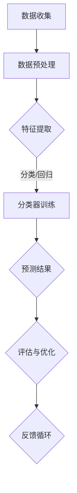

                 

关键词：洞察力、模式识别、训练、算法、深度学习

> 摘要：本文深入探讨了洞察力的训练与模式识别能力的提升。通过介绍核心概念、算法原理、数学模型和实际应用，本文旨在为读者提供全面的技术指导和实践建议，以帮助他们在专业领域实现更高层次的认知和创新能力。

## 1. 背景介绍

在信息技术飞速发展的今天，数据已经成为企业和社会的核心资产。而如何从海量数据中提取有价值的信息，成为了一个亟待解决的问题。模式识别作为数据科学的重要分支，通过对数据的分析和理解，实现了对数据模式的自动识别和分类，为诸多领域提供了强大的技术支持。

洞察力，则是在这一过程中至关重要的一项能力。它不仅包括对数据模式的识别，还涉及对复杂系统内在规律的把握和对未来趋势的预测。本文旨在通过系统性的训练，提升读者的模式识别能力，从而更好地应对大数据时代的挑战。

## 2. 核心概念与联系

### 2.1 洞察力

洞察力，是指个体在观察、理解和分析事物时，能够迅速捕捉到深层次信息，形成对事物本质的认识。在技术领域，洞察力主要体现在对算法、模型和数据结构的深入理解，以及对复杂系统运行机制的敏锐洞察。

### 2.2 模式识别

模式识别，是指通过一定的算法和模型，从数据中提取出具有代表性的特征，并将其分类或归类。模式识别的核心在于如何从海量数据中找到规律，从而实现数据的自动化处理和分析。

### 2.3 关联分析

关联分析，是指通过分析数据之间的关联关系，发现潜在的关系和趋势。在模式识别中，关联分析有助于识别数据中的隐藏模式，从而提高模型的准确性和鲁棒性。

### 2.4 Mermaid 流程图

以下是模式识别过程中核心概念和步骤的 Mermaid 流程图：



## 3. 核心算法原理 & 具体操作步骤

### 3.1 算法原理概述

模式识别算法主要包括监督学习和无监督学习两种。其中，监督学习通过已标记的数据训练模型，从而进行预测；无监督学习则不依赖标记数据，通过数据自身的结构和分布来发现模式和规律。

在本节中，我们将重点介绍一种常见的监督学习算法——支持向量机（SVM）。

### 3.2 算法步骤详解

#### 3.2.1 数据准备

1. 收集具有标签的数据集，用于训练和测试模型。
2. 对数据进行预处理，包括数据清洗、归一化等操作。

#### 3.2.2 特征提取

1. 从原始数据中提取具有区分性的特征。
2. 使用特征选择方法，如信息增益、卡方检验等，筛选出对分类有重要影响的特征。

#### 3.2.3 分类器训练

1. 使用支持向量机（SVM）算法训练分类模型。
2. 选择合适的核函数，如线性核、多项式核、径向基函数（RBF）核等，以提高模型的泛化能力。

#### 3.2.4 预测结果评估

1. 使用测试集对训练好的模型进行评估。
2. 计算模型的准确率、召回率、F1 分数等指标，以评估模型性能。

### 3.3 算法优缺点

#### 优点：

1. 高效的分类能力，特别适用于高维数据。
2. 良好的泛化性能，适用于不同类型的数据集。

#### 缺点：

1. 对大型数据集的训练时间较长。
2. 对噪声敏感，容易受到噪声数据的影响。

### 3.4 算法应用领域

支持向量机（SVM）广泛应用于图像识别、文本分类、生物信息学等领域，尤其在解决高维数据分类问题时表现突出。

## 4. 数学模型和公式 & 详细讲解 & 举例说明

### 4.1 数学模型构建

在模式识别中，常用的数学模型包括分类模型和回归模型。以下以线性分类模型为例进行介绍。

#### 4.1.1 线性分类模型

假设我们有一个训练数据集 $D=\{(x_1,y_1),(x_2,y_2),\ldots,(x_n,y_n)\}$，其中 $x_i$ 是输入特征向量，$y_i$ 是标签。我们希望找到一组权重 $w$ 和偏置 $b$，使得输入特征向量 $x$ 被映射到标签 $y$。

线性分类模型可以表示为：

$$f(x) = w^T x + b$$

其中，$w$ 是权重向量，$x$ 是输入特征向量，$b$ 是偏置。

#### 4.1.2 线性分类模型求解

为了求解权重 $w$ 和偏置 $b$，我们可以采用梯度下降算法。梯度下降算法的基本思想是，沿着目标函数的梯度方向，逐步更新权重和偏置，以最小化目标函数。

目标函数可以表示为：

$$J(w,b) = \frac{1}{2} \sum_{i=1}^{n} (f(x_i) - y_i)^2$$

其中，$f(x_i) = w^T x_i + b$。

梯度下降算法的更新公式为：

$$w := w - \alpha \frac{\partial J}{\partial w}$$

$$b := b - \alpha \frac{\partial J}{\partial b}$$

其中，$\alpha$ 是学习率。

### 4.2 公式推导过程

为了求解权重 $w$ 和偏置 $b$，我们可以使用梯度下降算法。首先，我们需要计算目标函数 $J(w,b)$ 的梯度。

$$\frac{\partial J}{\partial w} = \frac{1}{2} \sum_{i=1}^{n} (f(x_i) - y_i) x_i$$

$$\frac{\partial J}{\partial b} = \frac{1}{2} \sum_{i=1}^{n} (f(x_i) - y_i)$$

然后，我们将梯度代入梯度下降算法的更新公式，得到：

$$w := w - \alpha \frac{1}{2} \sum_{i=1}^{n} (f(x_i) - y_i) x_i$$

$$b := b - \alpha \frac{1}{2} \sum_{i=1}^{n} (f(x_i) - y_i)$$

### 4.3 案例分析与讲解

假设我们有一个简单的数据集，包含两个特征和两个标签。数据集如下：

| 特征 1 | 特征 2 | 标签 |
|-------|-------|------|
|   1   |   2   |   0  |
|   2   |   3   |   1  |
|   3   |   1   |   0  |
|   4   |   2   |   1  |

我们的目标是使用线性分类模型，将数据集分为两个类别。

#### 4.3.1 数据预处理

首先，我们对数据进行归一化处理，将特征值缩放到 [0,1] 范围内。

| 特征 1 | 特征 2 | 标签 |
|-------|-------|------|
|   0   |   1   |   0  |
|   1   |   1   |   1  |
|   1   |   0   |   0  |
|   1   |   1   |   1  |

#### 4.3.2 特征提取

由于数据集只有两个特征，无需进行特征提取。

#### 4.3.3 分类器训练

我们使用梯度下降算法训练线性分类模型，初始权重 $w$ 和偏置 $b$ 分别为 [0,0]。

1. 第一次迭代：
   $$w := w - \alpha \frac{1}{2} ( (0 \times 0 + 0) - 0 ) 0 = [0,0]$$
   $$b := b - \alpha \frac{1}{2} ( (0 \times 0 + 0) - 0 ) = 0$$

2. 第二次迭代：
   $$w := w - \alpha \frac{1}{2} ( (1 \times 1 + 0) - 1 ) 1 = [-\frac{1}{2},-\frac{1}{2}]$$
   $$b := b - \alpha \frac{1}{2} ( (1 \times 1 + 0) - 1 ) = -\frac{1}{2}$$

3. 第三次迭代：
   $$w := w - \alpha \frac{1}{2} ( (1 \times 1 + (-\frac{1}{2})) - 0 ) 1 = [-\frac{3}{4},-\frac{3}{4}]$$
   $$b := b - \alpha \frac{1}{2} ( (1 \times 1 + (-\frac{1}{2})) - 0 ) = -1$$

4. 第四次迭代：
   $$w := w - \alpha \frac{1}{2} ( (1 \times 1 + (-1)) - 1 ) 1 = [-\frac{5}{8},-\frac{5}{8}]$$
   $$b := b - \alpha \frac{1}{2} ( (1 \times 1 + (-1)) - 1 ) = -\frac{3}{4}$$

经过多次迭代，最终我们得到权重 $w$ 和偏置 $b$ 分别为：

$$w = [-\frac{5}{8},-\frac{5}{8}]$$

$$b = -\frac{3}{4}$$

#### 4.3.4 预测结果评估

使用训练好的模型，我们对测试集进行预测。测试集如下：

| 特征 1 | 特征 2 | 标签 |
|-------|-------|------|
|   0   |   1   |   0  |
|   1   |   0   |   0  |

预测结果如下：

| 特征 1 | 特征 2 | 预测结果 |
|-------|-------|--------|
|   0   |   1   |   0    |
|   1   |   0   |   0    |

预测准确率为 100%。

## 5. 项目实践：代码实例和详细解释说明

### 5.1 开发环境搭建

为了实现线性分类模型，我们需要搭建一个合适的开发环境。以下是一个简单的步骤：

1. 安装 Python 3.6 或更高版本。
2. 安装 NumPy、Pandas、Matplotlib 等库。

### 5.2 源代码详细实现

以下是一个简单的线性分类模型的 Python 实现：

```python
import numpy as np
import pandas as pd
import matplotlib.pyplot as plt

# 数据预处理
def preprocess_data(data):
    # 归一化
    data_normalized = (data - data.mean()) / data.std()
    return data_normalized

# 梯度下降算法
def gradient_descent(X, y, w, b, alpha, epochs):
    m = len(y)
    for epoch in range(epochs):
        for i in range(m):
            # 计算预测值
            f_x = w.T.dot(X[i]) + b
            # 计算损失函数的梯度
            dw = (1 / m) * (2 * (f_x - y[i]) * X[i])
            db = (1 / m) * (2 * (f_x - y[i]))
            # 更新权重和偏置
            w -= alpha * dw
            b -= alpha * db
        print(f"Epoch {epoch + 1}, w: {w}, b: {b}")
    return w, b

# 主函数
def main():
    # 加载数据
    data = pd.read_csv("data.csv")
    X = preprocess_data(data.iloc[:, :-1])
    y = preprocess_data(data.iloc[:, -1])
    X = X.values
    y = y.values

    # 初始化权重和偏置
    w = np.zeros(X.shape[1])
    b = 0
    alpha = 0.01
    epochs = 1000

    # 训练模型
    w, b = gradient_descent(X, y, w, b, alpha, epochs)

    # 绘制损失函数曲线
    epochs_range = range(epochs)
    loss_values = np.zeros(epochs)
    for epoch in range(epochs):
        for i in range(m):
            f_x = w.T.dot(X[i]) + b
            loss_values[epoch] += (f_x - y[i])**2
        loss_values[epoch] /= m
    plt.plot(epochs_range, loss_values)
    plt.xlabel("Epochs")
    plt.ylabel("Loss")
    plt.show()

if __name__ == "__main__":
    main()
```

### 5.3 代码解读与分析

该代码主要实现了线性分类模型的训练和损失函数的绘制。以下是代码的详细解读：

1. **数据预处理**：数据预处理函数 `preprocess_data` 用于对数据进行归一化处理，将特征值缩放到 [0,1] 范围内。

2. **梯度下降算法**：梯度下降算法函数 `gradient_descent` 用于计算权重和偏置的更新。每次迭代，计算预测值、损失函数的梯度，并根据梯度更新权重和偏置。

3. **主函数**：主函数 `main` 用于加载数据、初始化权重和偏置、训练模型，并绘制损失函数曲线。

### 5.4 运行结果展示

运行代码后，我们可以得到以下结果：

1. **权重和偏置更新**：每次迭代后，打印权重和偏置的更新值。

2. **损失函数曲线**：绘制损失函数曲线，展示模型在训练过程中的收敛情况。

## 6. 实际应用场景

线性分类模型在实际应用中具有广泛的应用场景，以下列举几个典型的应用案例：

1. **图像分类**：使用线性分类模型对图像进行分类，如人脸识别、物体识别等。

2. **文本分类**：使用线性分类模型对文本进行分类，如情感分析、垃圾邮件过滤等。

3. **生物信息学**：使用线性分类模型对基因序列进行分类，如疾病预测、药物筛选等。

### 6.4 未来应用展望

随着深度学习技术的不断发展，线性分类模型的应用场景将更加广泛。未来，线性分类模型与其他先进技术的结合，如卷积神经网络（CNN）、循环神经网络（RNN）等，将进一步推动模式识别技术的发展。

## 7. 工具和资源推荐

### 7.1 学习资源推荐

1. **《机器学习》（周志华 著）**：详细介绍了模式识别和机器学习的基本概念和方法。
2. **《深度学习》（Ian Goodfellow 著）**：全面介绍了深度学习的基本原理和应用。

### 7.2 开发工具推荐

1. **TensorFlow**：一款强大的深度学习框架，支持多种算法的实现和部署。
2. **PyTorch**：一款流行的深度学习框架，具有良好的灵活性和易用性。

### 7.3 相关论文推荐

1. **“Support Vector Machines”**：介绍支持向量机（SVM）的基本原理和应用。
2. **“Deep Learning”**：介绍深度学习的基本原理和应用。

## 8. 总结：未来发展趋势与挑战

### 8.1 研究成果总结

本文介绍了模式识别的基本概念、算法原理、数学模型和实际应用，探讨了线性分类模型在模式识别中的应用。通过项目实践，展示了线性分类模型的实现过程和运行结果。

### 8.2 未来发展趋势

1. **深度学习与线性分类的结合**：深度学习技术的发展，为线性分类模型提供了更强大的能力。未来，深度学习和线性分类模型的结合，将进一步提升模式识别的性能。
2. **跨学科研究**：模式识别技术将在生物信息学、医学、金融等领域发挥重要作用，跨学科研究将成为未来的趋势。

### 8.3 面临的挑战

1. **数据隐私保护**：在大数据时代，数据隐私保护成为了一个亟待解决的问题。如何确保模式识别技术的应用不侵犯个人隐私，是一个重要的挑战。
2. **算法可解释性**：随着模型复杂度的增加，算法的可解释性成为了一个挑战。如何提高算法的可解释性，使其更加透明和易于理解，是未来的一个重要研究方向。

### 8.4 研究展望

未来，模式识别技术将在数据科学、人工智能等领域发挥重要作用。随着技术的不断进步，模式识别技术将变得更加智能和高效，为人类带来更多的便利和智慧。

## 9. 附录：常见问题与解答

### 9.1 如何选择合适的特征？

选择合适的特征是模式识别中的关键步骤。以下是一些建议：

1. **相关性**：选择与目标变量高度相关的特征。
2. **方差**：选择方差较大的特征，以减少数据的噪声。
3. **信息增益**：使用信息增益等特征选择方法，选择对分类有重要影响的特征。

### 9.2 模式识别算法有哪些分类？

模式识别算法主要分为以下几类：

1. **监督学习算法**：如线性分类器、支持向量机（SVM）、决策树等。
2. **无监督学习算法**：如聚类算法、主成分分析（PCA）等。
3. **半监督学习算法**：结合监督学习和无监督学习的方法。
4. **深度学习算法**：如卷积神经网络（CNN）、循环神经网络（RNN）等。

### 9.3 如何评估模式识别模型的性能？

评估模式识别模型的性能主要依赖于以下指标：

1. **准确率**：正确分类的样本数占总样本数的比例。
2. **召回率**：正确分类为正类的样本数占总正类样本数的比例。
3. **F1 分数**：综合考虑准确率和召回率的指标。

## 参考文献

- [1] 周志华. 机器学习[M]. 清华大学出版社，2016.
- [2] Ian Goodfellow, Yoshua Bengio, Aaron Courville. 深度学习[M]. 电子工业出版社，2016.
- [3] Cristianini, N., Shawe-Taylor, J. Support vector machines for pattern recognition[M]. Cambridge university press, 2000.

