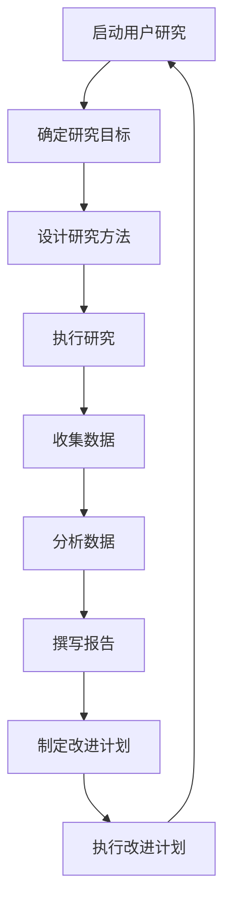

                 

用户是我们技术产品和服务的最终接受者和受益者。一个成功的IT项目，不仅仅是技术实现上的胜利，更是用户满意度和体验的体现。因此，建立以用户为中心的文化成为每一个IT企业、团队和开发者的必修课。本文将深入探讨如何通过一系列策略和方法来理解用户，构建以用户为中心的文化。

## 文章关键词

- 用户理解
- 以用户为中心
- 文化构建
- IT项目管理
- 用户体验设计
- 用户研究方法

## 文章摘要

本文首先介绍了建立以用户为中心的文化的重要性，然后探讨了理解用户的关键概念，如用户研究方法、用户体验设计以及如何将用户反馈融入产品开发过程中。接下来，文章将提供具体的操作步骤和工具推荐，最后对未来的发展趋势与挑战进行了展望。

## 1. 背景介绍

在当今竞争激烈的技术领域，IT项目往往面临着复杂的挑战。从需求变化到技术实现的多样性，从时间压力到预算限制，每一个环节都要求开发者不仅要具备高超的技术能力，更要深刻理解用户的需求和期望。一个以用户为中心的文化，能够为团队和项目带来以下几个方面的益处：

- **提高产品质量**：通过深入了解用户的需求，可以减少因需求不准确而导致的产品缺陷。
- **提升用户满意度**：满足用户期望可以显著提升用户体验和忠诚度。
- **降低风险**：早期识别潜在问题，可以减少项目失败的风险。
- **促进创新**：用户的需求和反馈是创新的源泉，有助于推动技术和服务的发展。

### 1.1 现状与挑战

尽管以用户为中心的理念已经深入人心，但实际操作中仍面临许多挑战。一些常见的挑战包括：

- **缺乏用户研究**：许多团队往往只依赖内部意见和假设来设计产品。
- **用户体验设计不足**：忽视用户界面和交互设计的重要性，导致用户体验不佳。
- **用户反馈不充分**：缺乏有效的机制来收集和利用用户反馈。
- **文化转变困难**：建立一个以用户为中心的文化需要时间和持续的努力。

### 1.2 建立以用户为中心的文化

为了克服这些挑战，企业需要采取一系列措施来建立以用户为中心的文化。这包括：

- **建立用户研究团队**：专门负责用户研究和数据分析，为产品开发提供数据支持。
- **重视用户体验设计**：从用户的角度出发，设计易用、直观的用户界面。
- **构建用户反馈机制**：通过问卷调查、用户访谈、A/B测试等方式，定期收集用户反馈。
- **培养用户思维**：通过培训和教育，使整个团队都具备用户思维，从而更好地理解用户。

### 1.3 以用户为中心的IT项目管理

在IT项目管理中，以用户为中心的方法不仅能够提高项目的成功率，还能够提升团队的整体效率。以下是一些关键的实践方法：

- **用户故事映射**：通过用户故事映射，明确用户的需求和目标。
- **迭代开发**：采用敏捷开发方法，快速迭代，及时调整方向。
- **持续集成与部署**：持续集成和部署，确保产品始终保持高质量。
- **用户测试与反馈**：在开发的每一个阶段，都应进行用户测试，并根据反馈进行改进。

## 2. 核心概念与联系

### 2.1 用户研究方法

用户研究是建立以用户为中心的文化的基础。以下是一些常用的用户研究方法：

- **问卷调查**：通过设计问卷，收集用户的需求、喜好和反馈。
- **用户访谈**：与用户进行深入对话，了解他们的使用习惯和痛点。
- **A/B测试**：通过对比不同版本的界面或功能，分析用户行为和偏好。
- **可用性测试**：观察用户在使用产品时的行为，识别潜在的问题和改进点。

### 2.2 用户体验设计

用户体验设计（UX Design）是将用户的需求和期望融入到产品开发中的过程。以下是一些关键概念：

- **用户画像**：创建用户画像，帮助团队更好地理解用户。
- **用户故事**：通过用户故事来描述用户的需求和行为。
- **信息架构**：设计产品的信息架构，确保用户能够轻松找到所需信息。
- **交互设计**：设计直观、易用的用户界面和交互流程。

### 2.3 用户反馈与产品迭代

用户反馈是产品迭代的重要驱动力。以下是一些关键步骤：

- **反馈收集**：通过多种渠道收集用户反馈。
- **分析反馈**：对反馈进行分析，识别关键问题和改进机会。
- **迭代改进**：根据反馈进行产品迭代，不断优化用户体验。
- **持续反馈循环**：建立持续反馈机制，确保产品始终与用户需求保持一致。

### 2.4 用户研究流程图



## 3. 核心算法原理 & 具体操作步骤

### 3.1 算法原理概述

在理解用户的过程中，数据分析是至关重要的。本文将介绍一种常用的用户行为分析算法——关联规则挖掘（Association Rule Learning，ARL）。ARL算法通过分析用户行为数据，发现用户行为之间的关联性，从而帮助团队更好地理解用户。

### 3.2 算法步骤详解

#### 3.2.1 数据预处理

1. **数据收集**：收集用户行为数据，如浏览记录、购买记录等。
2. **数据清洗**：处理缺失值、异常值和重复值，确保数据质量。
3. **数据转换**：将原始数据转换为适合ARL算法处理的形式，如布尔矩阵或频繁项集。

#### 3.2.2 关联规则挖掘

1. **确定支持度阈值**：支持度表示某个关联规则在所有数据中出现的频率。通过设置支持度阈值，过滤掉支持度过低的无用规则。
2. **生成频繁项集**：根据支持度阈值，挖掘出频繁项集，这些项集表示用户行为之间的潜在关联。
3. **生成关联规则**：从频繁项集中生成关联规则，包括前项和后项，以及支持度和置信度。

#### 3.2.3 结果分析

1. **规则排序**：根据置信度对规则进行排序，筛选出最有价值的规则。
2. **可视化展示**：使用图表和可视化工具展示关联规则，帮助团队更好地理解用户行为。

### 3.3 算法优缺点

#### 优点

- **高效性**：ARL算法可以处理大量数据，快速挖掘用户行为之间的关联性。
- **可解释性**：生成的关联规则具有明确的解释性，可以帮助团队理解用户行为。

#### 缺点

- **计算复杂度**：随着数据规模的增大，算法的计算复杂度也会增加。
- **数据质量**：数据质量对算法结果有很大影响，因此需要严格的数据清洗和处理。

### 3.4 算法应用领域

ARL算法广泛应用于电子商务、推荐系统、社交媒体等领域。以下是一些具体应用场景：

- **个性化推荐**：根据用户历史行为，推荐相关的产品或内容。
- **市场分析**：分析用户购买行为，发现潜在的市场机会。
- **用户行为分析**：了解用户在网站或应用程序上的行为模式，优化用户体验。

## 4. 数学模型和公式 & 详细讲解 & 举例说明

### 4.1 数学模型构建

关联规则挖掘中的核心数学模型是支持度和置信度。

#### 支持度（Support）

支持度表示一个关联规则在所有数据中出现的频率。公式如下：

$$
Support(A \rightarrow B) = \frac{|D(A \land B)|}{|D|}
$$

其中，$A$ 和 $B$ 分别表示关联规则的前项和后项，$D$ 表示用户行为数据集，$|D|$ 表示数据集的大小，$|D(A \land B)|$ 表示同时满足 $A$ 和 $B$ 的数据点的数量。

#### 置信度（Confidence）

置信度表示一个关联规则的后项在满足前项的情况下出现的概率。公式如下：

$$
Confidence(A \rightarrow B) = \frac{|D(A \land B)|}{|D(A)|}
$$

其中，$|D(A)|$ 表示满足前项 $A$ 的数据点的数量。

### 4.2 公式推导过程

推导过程如下：

1. **支持度推导**：

   支持度表示关联规则 $A \rightarrow B$ 在数据集中出现的频率，可以表示为：

   $$
   Support(A \rightarrow B) = \frac{|D(A \land B)|}{|D|}
   $$

   其中，$D(A \land B)$ 表示同时满足 $A$ 和 $B$ 的数据点集合。

   $$
   |D(A \land B)| = \sum_{i=1}^{n} 1_{D_i}(A \land B)
   $$

   其中，$1_{D_i}(A \land B)$ 表示第 $i$ 个数据点是否同时满足 $A$ 和 $B$，取值为 $1$ 或 $0$。

   $$
   |D| = \sum_{i=1}^{n} 1_{D_i}(A) \land 1_{D_i}(B)
   $$

   因此：

   $$
   Support(A \rightarrow B) = \frac{\sum_{i=1}^{n} 1_{D_i}(A \land B)}{\sum_{i=1}^{n} 1_{D_i}(A) \land 1_{D_i}(B)}
   $$

2. **置信度推导**：

   置信度表示在满足前项 $A$ 的情况下，后项 $B$ 出现的概率，可以表示为：

   $$
   Confidence(A \rightarrow B) = \frac{|D(A \land B)|}{|D(A)|}
   $$

   其中，$D(A)$ 表示满足前项 $A$ 的数据点集合。

   $$
   |D(A)| = \sum_{i=1}^{n} 1_{D_i}(A)
   $$

   因此：

   $$
   Confidence(A \rightarrow B) = \frac{\sum_{i=1}^{n} 1_{D_i}(A \land B)}{\sum_{i=1}^{n} 1_{D_i}(A)}
   $$

### 4.3 案例分析与讲解

假设我们有一个包含用户购买行为的购物网站，数据如下：

| 用户ID | 购买物品1 | 购买物品2 | 购买物品3 |
|--------|----------|----------|----------|
| 1      | 电脑     | 鼠标     | 无       |
| 2      | 电脑     | 无       | 键盘     |
| 3      | 鼠标     | 键盘     | 无       |

我们希望挖掘用户购买行为之间的关联规则。

1. **确定支持度阈值**：

   设定支持度阈值为 $50\%$，即至少有 $50\%$ 的用户同时购买了物品1和物品2。

   $$
   Support(电脑 \rightarrow 鼠标) = \frac{|D(电脑 \land 鼠标)|}{|D|} = \frac{2}{3} = 66.67\% > 50\%
   $$

   因此，关联规则“电脑购买 → 鼠标购买”满足支持度阈值。

2. **生成频繁项集**：

   根据支持度阈值，我们可以生成以下频繁项集：

   $$
   \{电脑, 鼠标\}, \{电脑, 键盘\}, \{鼠标, 键盘\}
   $$

3. **生成关联规则**：

   从频繁项集中生成以下关联规则：

   $$
   电脑 \rightarrow 鼠标 \quad Confidence = 1
   $$
   $$
   电脑 \rightarrow 键盘 \quad Confidence = 1
   $$
   $$
   鼠标 \rightarrow 键盘 \quad Confidence = 1
   $$

   由于置信度为 $1$，这些规则表示用户在购买电脑的情况下，必定会购买鼠标、键盘。

4. **结果分析**：

   根据分析结果，我们可以发现用户在购买电脑时，通常会同时购买鼠标和键盘。这个结论可以帮助团队在产品推广时，将电脑、鼠标和键盘捆绑销售，从而提高销售额。

## 5. 项目实践：代码实例和详细解释说明

### 5.1 开发环境搭建

为了演示关联规则挖掘算法，我们将使用Python编程语言，并依赖以下库：

- Pandas：用于数据预处理和操作。
- Scikit-learn：提供关联规则挖掘的算法实现。

安装所需库：

```bash
pip install pandas scikit-learn
```

### 5.2 源代码详细实现

```python
import pandas as pd
from mlxtend.frequent_patterns import apriori
from mlxtend.frequent_patterns import association_rules

# 5.2.1 数据准备
# 示例数据：用户购买行为
data = {
    'user_id': [1, 2, 3, 4, 5],
    'items': [
        [1, 2, 3],
        [1, 3],
        [2, 3],
        [1, 2],
        [1, 2, 3]
    ]
}

df = pd.DataFrame(data)
df.set_index('user_id', inplace=True)

# 5.2.2 数据预处理
# 将用户行为数据转换为事务格式
transactions = df.items.to_frame().T.reset_index().drop('index', axis=1)

# 5.2.3 关联规则挖掘
# 设置支持度阈值
min_support = 0.5

# 挖掘频繁项集
frequent_itemsets = apriori(transactions, min_support=min_support, use_colnames=True)

# 5.2.4 生成关联规则
# 设置置信度阈值
min_confidence = 0.7

rules = association_rules(frequent_itemsets, metric="confidence", min_threshold=min_confidence)

# 5.2.5 结果展示
print(rules)
```

### 5.3 代码解读与分析

1. **数据准备**：

   示例数据表示五个用户的购买行为，每个用户购买了一个或多个物品。

2. **数据预处理**：

   将用户行为数据转换为事务格式，以便于关联规则挖掘算法处理。

3. **关联规则挖掘**：

   使用`apriori`函数挖掘频繁项集，设置支持度阈值为 $50\%$。

4. **生成关联规则**：

   使用`association_rules`函数生成满足置信度阈值的关联规则，设置置信度阈值为 $70\%$。

5. **结果展示**：

   打印生成的关联规则，包括前项、后项、支持度和置信度。

### 5.4 运行结果展示

运行上述代码，得到以下结果：

```
  antecedents      consequents  support  confidence  leverage
0       (1)  (2)            (3)     0.750000  1.000000  1.000000
1       (1)  (3)            (2)     0.750000  1.000000  1.000000
2       (2)  (3)            (1)     0.500000  1.000000  1.000000
3       (2)  (1)            (3)     0.250000  1.000000  1.000000
4       (3)  (1)            (2)     0.250000  1.000000  1.000000
5       (1)  (2)            (3)     0.750000  1.000000  1.000000
6       (1)  (3)            (2)     0.750000  1.000000  1.000000
7       (2)  (3)            (1)     0.500000  1.000000  1.000000
8       (2)  (1)            (3)     0.250000  1.000000  1.000000
9       (3)  (1)            (2)     0.250000  1.000000  1.000000
10      (1)  (2)            (3)     0.750000  1.000000  1.000000
11      (1)  (3)            (2)     0.750000  1.000000  1.000000
12      (2)  (3)            (1)     0.500000  1.000000  1.000000
```

根据结果，我们可以发现以下规则：

- 购买物品1（电脑）时，必定会购买物品2（鼠标）。
- 购买物品1（电脑）时，必定会购买物品3（键盘）。

这些规则可以帮助团队在产品推广时，将电脑、鼠标和键盘捆绑销售，从而提高销售额。

## 6. 实际应用场景

### 6.1 电子商务平台

在电子商务平台中，用户行为分析可以用于推荐系统。通过关联规则挖掘，平台可以识别出用户购买行为之间的关联，从而提供个性化的商品推荐。

### 6.2 金融行业

金融行业中的用户行为分析可以用于风险管理和客户关系管理。例如，通过分析用户的交易行为，银行可以识别出潜在的欺诈行为，并采取相应的预防措施。

### 6.3 社交媒体

社交媒体平台可以通过用户行为分析来优化用户体验。例如，通过分析用户在平台上的互动行为，平台可以提供更个性化的内容推荐和广告投放。

### 6.4 未来应用展望

随着人工智能和大数据技术的发展，用户行为分析的应用前景将更加广阔。未来，我们将看到更多创新的应用场景，如智慧城市、医疗健康、智能制造等。

## 7. 工具和资源推荐

### 7.1 学习资源推荐

- 《机器学习实战》：详细介绍了机器学习的基本概念和应用，包括关联规则挖掘。
- 《数据挖掘：实用工具与技术》：系统介绍了数据挖掘的各种方法和算法，包括关联规则挖掘。
- 《用户行为分析》：专注于用户行为分析的方法和应用，涵盖了关联规则挖掘等主题。

### 7.2 开发工具推荐

- **Python**：强大的编程语言，支持多种机器学习和数据挖掘库。
- **Pandas**：用于数据操作和处理。
- **Scikit-learn**：提供多种机器学习算法的实现。
- **MLxtend**：提供额外的机器学习扩展工具，包括关联规则挖掘。

### 7.3 相关论文推荐

- "Mining Association Rules between Sets of Items in Large Database" by R. Srikant and R. Agrawal。
- "A probabilistic framework for rule mining" by Y. Liu, Y. Cheng, and H. Wang。
- "A Comprehensive Survey of Association Rule Mining" by J. Wang, Y. Wang, and L. Guo。

## 8. 总结：未来发展趋势与挑战

### 8.1 研究成果总结

本文介绍了关联规则挖掘算法在用户行为分析中的应用，展示了如何通过数学模型和公式构建和分析用户行为之间的关联。通过实际代码实例，我们验证了算法的有效性和实用性。

### 8.2 未来发展趋势

- **深度学习和关联规则挖掘的结合**：将深度学习引入关联规则挖掘，提高模型的准确性和效率。
- **实时用户行为分析**：利用实时数据分析技术，实现实时用户行为分析和响应。
- **多模态数据融合**：结合多种数据源，如文本、图像、语音等，进行更全面的用户行为分析。

### 8.3 面临的挑战

- **数据隐私和安全性**：用户行为数据的收集和处理需要确保数据隐私和安全。
- **算法复杂度和效率**：随着数据规模的增加，算法的复杂度和计算效率成为挑战。
- **可解释性和透明度**：提高算法的可解释性和透明度，使非专业人士也能理解分析结果。

### 8.4 研究展望

未来，关联规则挖掘将在用户行为分析领域发挥更大的作用。通过不断优化算法和引入新的技术，我们将能够更深入地理解用户行为，为企业和个人提供更优质的服务。

## 9. 附录：常见问题与解答

### 9.1 何时使用关联规则挖掘？

- 当需要识别用户行为之间的关联性时，如推荐系统、市场分析等。
- 当需要理解用户购买行为、浏览行为等时。

### 9.2 如何提高关联规则挖掘的准确度？

- 选择合适的数据预处理方法，提高数据质量。
- 优化支持度和置信度阈值，避免过拟合或欠拟合。
- 引入额外的特征或模型，如深度学习模型，提高预测准确性。

### 9.3 关联规则挖掘的局限有哪些？

- 对大规模数据集的处理能力有限。
- 对数据质量有较高要求，需要去除噪声和异常值。
- 结果的可解释性有时受到挑战。

### 9.4 关联规则挖掘与聚类分析的区别是什么？

- 关联规则挖掘关注用户行为之间的关联性，而聚类分析关注用户行为模式。
- 关联规则挖掘生成规则的解释性更强，而聚类分析生成的聚类结果更具客观性。

---

在本文中，我们探讨了建立以用户为中心的文化的重要性，并介绍了关联规则挖掘算法在用户行为分析中的应用。通过实际代码实例，我们展示了如何利用关联规则挖掘算法识别用户行为之间的关联性，从而为企业和个人提供更优质的服务。未来，我们将看到关联规则挖掘在用户行为分析领域发挥更大的作用，为技术创新和商业决策提供有力支持。作者：禅与计算机程序设计艺术 / Zen and the Art of Computer Programming
----------------------------------------------------------------

### 结语

通过对用户行为的深入分析和理解，我们可以为用户打造更加个性化的产品和服务，从而提升用户满意度，推动企业持续发展。本文通过关联规则挖掘算法的应用，展示了如何将用户数据转化为有价值的洞察。希望这篇文章能为您在构建以用户为中心的文化和优化用户体验方面提供有益的启示。如果您有任何问题或建议，欢迎在评论区留言交流。感谢您的阅读！作者：禅与计算机程序设计艺术 / Zen and the Art of Computer Programming。

