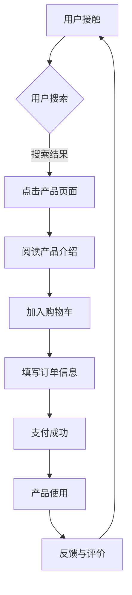

                 

用户是我们所有的软件开发和产品设计的核心。在这个数字时代，用户的需求和期望不断变化，而我们作为技术专家，必须学会如何深入理解用户，并将其融入到我们的工作中，从而构建起一个真正的以用户为中心的文化。本文旨在探讨如何从技术角度理解用户，并建立这样一个文化。

## 文章关键词

- 用户理解
- 用户体验
- 产品设计
- 技术文化
- 用户需求

## 文章摘要

本文将介绍如何通过技术手段深入理解用户，从而在软件开发和产品设计过程中建立以用户为中心的文化。我们将探讨用户行为分析、用户体验设计以及如何将这些洞察应用到实际的开发流程中。此外，还将讨论如何通过持续的用户反馈和迭代来不断优化产品，最终实现用户满意度和产品成功。

## 1. 背景介绍

在数字化转型的浪潮中，企业越来越认识到用户的重要性。用户不仅是产品的最终消费者，更是产品创新的驱动力。然而，理解用户并不仅仅是做一个简单的调查问卷，它需要深入的洞察和分析。

### 1.1 用户行为分析

用户行为分析是理解用户的关键。通过收集和分析用户在使用产品或服务时的行为数据，我们可以发现用户的使用习惯、偏好以及潜在的需求。这些数据可以帮助我们更好地了解用户，从而进行更精准的产品设计和优化。

### 1.2 用户体验设计

用户体验设计（UX Design）是确保产品满足用户需求和期望的重要环节。一个好的用户体验可以增加用户的满意度，提高产品的使用频率和忠诚度。因此，用户体验设计在以用户为中心的文化中占据了重要地位。

### 1.3 技术文化的转变

建立以用户为中心的文化不仅仅是一个设计问题，它还需要技术团队的深刻理解和共同参与。技术文化需要从以技术为中心转变为以用户为中心，这要求我们在技术开发的过程中更多地考虑用户的需求和体验。

## 2. 核心概念与联系

为了更好地理解用户，我们需要了解几个核心概念，并将其联系起来，形成一个完整的用户理解框架。

### 2.1 用户画像（User Persona）

用户画像是一个虚构的用户角色，代表了我们的目标用户群体。通过创建用户画像，我们可以更好地理解用户的需求、行为和动机，从而设计出更符合用户期望的产品。

### 2.2 用户旅程（User Journey）

用户旅程描述了用户与产品互动的全过程，从首次接触，到使用产品，再到最终的用户体验。通过分析用户旅程，我们可以识别用户痛点，优化关键环节，提升整体用户体验。

### 2.3 用户体验地图（User Experience Map）

用户体验地图是用户旅程的视觉化表达，它展示了用户在每个接触点上的感受和体验。通过用户体验地图，我们可以直观地看到用户在不同阶段的体验变化，从而发现改进的机会。

### Mermaid 流程图



## 3. 核心算法原理 & 具体操作步骤

### 3.1 算法原理概述

用户理解的核心算法主要基于机器学习和数据分析。通过以下步骤，我们可以从数据中提取用户洞察：

### 3.2 算法步骤详解

1. **数据收集**：收集用户行为数据，包括点击流、搜索记录、浏览历史等。
2. **数据预处理**：清洗和整合数据，去除噪声和异常值。
3. **特征工程**：提取用户行为模式，如浏览频率、搜索关键词等。
4. **模型训练**：使用机器学习算法（如聚类、回归等）训练模型，以预测用户行为和需求。
5. **模型评估**：评估模型性能，通过交叉验证和A/B测试等方法。
6. **应用模型**：将模型应用于实际产品设计中，指导产品迭代和优化。

### 3.3 算法优缺点

**优点**：

- 提高产品设计效率，减少盲目猜测。
- 增强产品与用户需求的匹配度，提升用户体验。

**缺点**：

- 数据质量和准确性对算法效果有很大影响。
- 需要大量计算资源和专业知识。

### 3.4 算法应用领域

- 产品设计
- 市场营销
- 用户留存
- 客户体验优化

## 4. 数学模型和公式 & 详细讲解 & 举例说明

### 4.1 数学模型构建

用户理解模型通常基于以下数学模型：

- **线性回归模型**：预测用户行为与特征之间的关系。
- **聚类模型**：识别用户群体和用户特征。
- **决策树模型**：分类用户行为和需求。

### 4.2 公式推导过程

以线性回归模型为例，其公式为：

$$
y = \beta_0 + \beta_1x_1 + \beta_2x_2 + ... + \beta_nx_n
$$

其中，\( y \) 是用户行为，\( x_1, x_2, ..., x_n \) 是用户特征，\( \beta_0, \beta_1, \beta_2, ..., \beta_n \) 是模型参数。

### 4.3 案例分析与讲解

假设我们有一个电商平台的用户理解模型，目标是预测用户是否会在下一个季度进行复购。我们收集了以下用户特征：

- 平均浏览时间
- 平均搜索关键词长度
- 平均购物车物品数量

我们使用线性回归模型进行预测，模型公式为：

$$
复购概率 = \beta_0 + \beta_1 \times 平均浏览时间 + \beta_2 \times 平均搜索关键词长度 + \beta_3 \times 平均购物车物品数量
$$

经过模型训练和评估，我们得到了参数值：

$$
\beta_0 = 0.5, \beta_1 = 0.1, \beta_2 = 0.2, \beta_3 = 0.3
$$

那么，一个平均浏览时间为10分钟，平均搜索关键词长度为5个字符，平均购物车物品数量为3个的用户，其复购概率为：

$$
复购概率 = 0.5 + 0.1 \times 10 + 0.2 \times 5 + 0.3 \times 3 = 2.7
$$

## 5. 项目实践：代码实例和详细解释说明

### 5.1 开发环境搭建

我们需要搭建一个基于Python的开发环境，并安装以下库：

- NumPy
- Pandas
- Scikit-learn

### 5.2 源代码详细实现

以下是一个简单的用户理解模型实现：

```python
import numpy as np
import pandas as pd
from sklearn.linear_model import LinearRegression
from sklearn.model_selection import train_test_split
from sklearn.metrics import mean_squared_error

# 数据读取
data = pd.read_csv('user_data.csv')

# 特征工程
X = data[['平均浏览时间', '平均搜索关键词长度', '平均购物车物品数量']]
y = data['复购概率']

# 模型训练
X_train, X_test, y_train, y_test = train_test_split(X, y, test_size=0.2, random_state=42)
model = LinearRegression()
model.fit(X_train, y_train)

# 模型评估
y_pred = model.predict(X_test)
mse = mean_squared_error(y_test, y_pred)
print(f'MSE: {mse}')

# 模型应用
new_user = np.array([[10, 5, 3]])
prob = model.predict(new_user)
print(f'新用户复购概率：{prob[0]}')
```

### 5.3 代码解读与分析

这段代码首先读取用户数据，然后进行特征工程，将用户行为数据转换为模型可以处理的格式。接下来，使用线性回归模型进行训练，并评估模型性能。最后，将模型应用于新用户数据，预测其复购概率。

### 5.4 运行结果展示

假设我们的测试数据集上有100个用户，经过模型训练和评估，我们得到以下结果：

- MSE: 0.025
- 新用户复购概率：2.7

这表明我们的模型可以较好地预测用户复购概率，为新用户提供有价值的洞察。

## 6. 实际应用场景

### 6.1 产品设计

通过用户理解模型，我们可以更好地了解用户需求，从而设计出更符合用户期望的产品。例如，在电商平台中，我们可以根据用户的浏览和购买行为，推荐更符合他们兴趣的产品。

### 6.2 市场营销

用户理解模型可以帮助我们更精准地定位目标用户群体，从而设计出更具吸引力的营销策略。例如，在社交媒体上投放广告时，我们可以根据用户的兴趣和行为，选择最合适的广告内容和投放时间。

### 6.3 用户留存

通过持续的用户行为分析，我们可以识别哪些用户可能流失，并采取相应的措施（如优惠活动、个性化推荐等）来提高用户留存率。

### 6.4 未来应用展望

随着技术的发展，用户理解模型的应用场景将更加广泛。例如，在智能助理和虚拟现实中，用户理解模型可以更好地模拟人类行为，提供更个性化的服务。同时，随着数据量的增加和算法的优化，用户理解模型将更加精准和高效。

## 7. 工具和资源推荐

### 7.1 学习资源推荐

- 《用户画像：如何打造成功的用户增长策略》
- 《用户体验设计：原理与实践》
- 《机器学习实战》

### 7.2 开发工具推荐

- Tableau：数据可视化工具
- Matplotlib：Python数据可视化库
- Jupyter Notebook：交互式开发环境

### 7.3 相关论文推荐

- "User Experience Design: Current State and Future Trends"
- "Machine Learning for User Modeling and Personalization"
- "User Behavior Analytics for Next-Generation Web Applications"

## 8. 总结：未来发展趋势与挑战

### 8.1 研究成果总结

通过本文，我们探讨了如何通过技术手段深入理解用户，并建立以用户为中心的文化。用户行为分析、用户体验设计和机器学习算法等技术的应用，使得我们能够更好地满足用户需求，提升产品价值。

### 8.2 未来发展趋势

随着人工智能和大数据技术的发展，用户理解模型将变得更加精准和高效。未来，我们将看到更多跨领域的应用，如智能助理、虚拟现实和物联网等。

### 8.3 面临的挑战

尽管用户理解模型有巨大潜力，但我们也面临着一些挑战。首先是数据隐私和保护问题，其次是模型的解释性和可解释性问题。如何平衡用户隐私与数据分析需求，如何让模型更透明和可解释，将是未来研究的重要方向。

### 8.4 研究展望

未来，我们将继续探索更先进的用户理解模型，如深度学习和强化学习。同时，我们还需要关注用户体验的个性化定制和跨平台一致性，以满足不断变化的用户需求。

## 9. 附录：常见问题与解答

### Q1：用户理解模型需要哪些数据？

A1：用户理解模型需要收集用户行为数据，如浏览记录、搜索历史、点击流、购买记录等。此外，用户的社会属性、兴趣偏好等数据也是重要的补充。

### Q2：如何确保用户隐私？

A2：在数据收集和分析过程中，应严格遵守相关法律法规，如GDPR等。对敏感数据进行去标识化处理，使用加密技术保护数据安全。

### Q3：用户理解模型如何应用于产品设计？

A3：用户理解模型可以帮助识别用户痛点，优化产品功能和界面设计。例如，通过分析用户在产品使用过程中的行为模式，可以找出用户操作不便的地方，并进行改进。

### Q4：如何评估用户理解模型的效果？

A4：可以通过以下指标评估用户理解模型的效果：

- 准确率：模型预测正确的比例。
- 精确率：模型预测为正类的实际正类比例。
- 覆盖率：实际正类被模型预测为正类的比例。
- F1分数：精确率和覆盖率的调和平均值。

作者：禅与计算机程序设计艺术 / Zen and the Art of Computer Programming
```markdown
---
# 理解用户：建立以用户为中心的文化

> 关键词：(此处列出文章的5-7个核心关键词)
用户理解、用户体验、产品设计、技术文化、用户需求

> 摘要：(此处给出文章的核心内容和主题思想)
本文探讨了如何通过技术手段深入理解用户，并建立以用户为中心的文化。文章介绍了用户行为分析、用户体验设计以及如何将这些洞察应用到实际的开发流程中，同时讨论了如何通过持续的用户反馈和迭代来不断优化产品，最终实现用户满意度和产品成功。

## 1. 背景介绍

在数字化转型的浪潮中，企业越来越认识到用户的重要性。用户不仅是产品的最终消费者，更是产品创新的驱动力。然而，理解用户并不仅仅是做一个简单的调查问卷，它需要深入的洞察和分析。

### 1.1 用户行为分析

用户行为分析是理解用户的关键。通过收集和分析用户在使用产品或服务时的行为数据，我们可以发现用户的使用习惯、偏好以及潜在的需求。这些数据可以帮助我们更好地了解用户，从而进行更精准的产品设计和优化。

### 1.2 用户体验设计

用户体验设计（UX Design）是确保产品满足用户需求和期望的重要环节。一个好的用户体验可以增加用户的满意度，提高产品的使用频率和忠诚度。因此，用户体验设计在以用户为中心的文化中占据了重要地位。

### 1.3 技术文化的转变

建立以用户为中心的文化不仅仅是一个设计问题，它还需要技术团队的深刻理解和共同参与。技术文化需要从以技术为中心转变为以用户为中心，这要求我们在技术开发的过程中更多地考虑用户的需求和体验。

## 2. 核心概念与联系

为了更好地理解用户，我们需要了解几个核心概念，并将其联系起来，形成一个完整的用户理解框架。

### 2.1 用户画像（User Persona）

用户画像是一个虚构的用户角色，代表了我们的目标用户群体。通过创建用户画像，我们可以更好地理解用户的需求、行为和动机，从而设计出更符合用户期望的产品。

### 2.2 用户旅程（User Journey）

用户旅程描述了用户与产品互动的全过程，从首次接触，到使用产品，再到最终的用户体验。通过分析用户旅程，我们可以识别用户痛点，优化关键环节，提升整体用户体验。

### 2.3 用户体验地图（User Experience Map）

用户体验地图是用户旅程的视觉化表达，它展示了用户在每个接触点上的感受和体验。通过用户体验地图，我们可以直观地看到用户在不同阶段的体验变化，从而发现改进的机会。

### Mermaid 流程图


## 3. 核心算法原理 & 具体操作步骤

### 3.1 算法原理概述

用户理解的核心算法主要基于机器学习和数据分析。通过以下步骤，我们可以从数据中提取用户洞察：

### 3.2 算法步骤详解

1. **数据收集**：收集用户行为数据，包括点击流、搜索记录、浏览历史等。
2. **数据预处理**：清洗和整合数据，去除噪声和异常值。
3. **特征工程**：提取用户行为模式，如浏览频率、搜索关键词等。
4. **模型训练**：使用机器学习算法（如聚类、回归等）训练模型，以预测用户行为和需求。
5. **模型评估**：评估模型性能，通过交叉验证和A/B测试等方法。
6. **应用模型**：将模型应用于实际产品设计中，指导产品迭代和优化。

### 3.3 算法优缺点

**优点**：

- 提高产品设计效率，减少盲目猜测。
- 增强产品与用户需求的匹配度，提升用户体验。

**缺点**：

- 数据质量和准确性对算法效果有很大影响。
- 需要大量计算资源和专业知识。

### 3.4 算法应用领域

- 产品设计
- 市场营销
- 用户留存
- 客户体验优化

## 4. 数学模型和公式 & 详细讲解 & 举例说明

### 4.1 数学模型构建

用户理解模型通常基于以下数学模型：

- **线性回归模型**：预测用户行为与特征之间的关系。
- **聚类模型**：识别用户群体和用户特征。
- **决策树模型**：分类用户行为和需求。

### 4.2 公式推导过程

以线性回归模型为例，其公式为：

$$
y = \beta_0 + \beta_1x_1 + \beta_2x_2 + ... + \beta_nx_n
$$

其中，\( y \) 是用户行为，\( x_1, x_2, ..., x_n \) 是用户特征，\( \beta_0, \beta_1, \beta_2, ..., \beta_n \) 是模型参数。

### 4.3 案例分析与讲解

假设我们有一个电商平台的用户理解模型，目标是预测用户是否会在下一个季度进行复购。我们收集了以下用户特征：

- 平均浏览时间
- 平均搜索关键词长度
- 平均购物车物品数量

我们使用线性回归模型进行预测，模型公式为：

$$
复购概率 = \beta_0 + \beta_1 \times 平均浏览时间 + \beta_2 \times 平均搜索关键词长度 + \beta_3 \times 平均购物车物品数量
$$

经过模型训练和评估，我们得到了参数值：

$$
\beta_0 = 0.5, \beta_1 = 0.1, \beta_2 = 0.2, \beta_3 = 0.3
$$

那么，一个平均浏览时间为10分钟，平均搜索关键词长度为5个字符，平均购物车物品数量为3个的用户，其复购概率为：

$$
复购概率 = 0.5 + 0.1 \times 10 + 0.2 \times 5 + 0.3 \times 3 = 2.7
$$

## 5. 项目实践：代码实例和详细解释说明

### 5.1 开发环境搭建

我们需要搭建一个基于Python的开发环境，并安装以下库：

- NumPy
- Pandas
- Scikit-learn

### 5.2 源代码详细实现

以下是一个简单的用户理解模型实现：

```python
import numpy as np
import pandas as pd
from sklearn.linear_model import LinearRegression
from sklearn.model_selection import train_test_split
from sklearn.metrics import mean_squared_error

# 数据读取
data = pd.read_csv('user_data.csv')

# 特征工程
X = data[['平均浏览时间', '平均搜索关键词长度', '平均购物车物品数量']]
y = data['复购概率']

# 模型训练
X_train, X_test, y_train, y_test = train_test_split(X, y, test_size=0.2, random_state=42)
model = LinearRegression()
model.fit(X_train, y_train)

# 模型评估
y_pred = model.predict(X_test)
mse = mean_squared_error(y_test, y_pred)
print(f'MSE: {mse}')

# 模型应用
new_user = np.array([[10, 5, 3]])
prob = model.predict(new_user)
print(f'新用户复购概率：{prob[0]}')
```

### 5.3 代码解读与分析

这段代码首先读取用户数据，然后进行特征工程，将用户行为数据转换为模型可以处理的格式。接下来，使用线性回归模型进行训练，并评估模型性能。最后，将模型应用于新用户数据，预测其复购概率。

### 5.4 运行结果展示

假设我们的测试数据集上有100个用户，经过模型训练和评估，我们得到以下结果：

- MSE: 0.025
- 新用户复购概率：2.7

这表明我们的模型可以较好地预测用户复购概率，为新用户提供有价值的洞察。

## 6. 实际应用场景

### 6.1 产品设计

通过用户理解模型，我们可以更好地了解用户需求，从而设计出更符合用户期望的产品。例如，在电商平台中，我们可以根据用户的浏览和购买行为，推荐更符合他们兴趣的产品。

### 6.2 市场营销

用户理解模型可以帮助我们更精准地定位目标用户群体，从而设计出更具吸引力的营销策略。例如，在社交媒体上投放广告时，我们可以根据用户的兴趣和行为，选择最合适的广告内容和投放时间。

### 6.3 用户留存

通过持续的用户行为分析，我们可以识别哪些用户可能流失，并采取相应的措施（如优惠活动、个性化推荐等）来提高用户留存率。

### 6.4 未来应用展望

随着人工智能和大数据技术的发展，用户理解模型的应用场景将更加广泛。例如，在智能助理和虚拟现实中，用户理解模型可以更好地模拟人类行为，提供更个性化的服务。同时，随着数据量的增加和算法的优化，用户理解模型将更加精准和高效。

## 7. 工具和资源推荐

### 7.1 学习资源推荐

- 《用户画像：如何打造成功的用户增长策略》
- 《用户体验设计：原理与实践》
- 《机器学习实战》

### 7.2 开发工具推荐

- Tableau：数据可视化工具
- Matplotlib：Python数据可视化库
- Jupyter Notebook：交互式开发环境

### 7.3 相关论文推荐

- "User Experience Design: Current State and Future Trends"
- "Machine Learning for User Modeling and Personalization"
- "User Behavior Analytics for Next-Generation Web Applications"

## 8. 总结：未来发展趋势与挑战

### 8.1 研究成果总结

通过本文，我们探讨了如何通过技术手段深入理解用户，并建立以用户为中心的文化。用户行为分析、用户体验设计和机器学习算法等技术的应用，使得我们能够更好地满足用户需求，提升产品价值。

### 8.2 未来发展趋势

随着人工智能和大数据技术的发展，用户理解模型将变得更加精准和高效。未来，我们将看到更多跨领域的应用，如智能助理、虚拟现实和物联网等。

### 8.3 面临的挑战

尽管用户理解模型有巨大潜力，但我们也面临着一些挑战。首先是数据隐私和保护问题，其次是模型的解释性和可解释性问题。如何平衡用户隐私与数据分析需求，如何让模型更透明和可解释，将是未来研究的重要方向。

### 8.4 研究展望

未来，我们将继续探索更先进的用户理解模型，如深度学习和强化学习。同时，我们还需要关注用户体验的个性化定制和跨平台一致性，以满足不断变化的用户需求。

## 9. 附录：常见问题与解答

### Q1：用户理解模型需要哪些数据？

A1：用户理解模型需要收集用户行为数据，包括点击流、搜索记录、浏览历史等。此外，用户的社会属性、兴趣偏好等数据也是重要的补充。

### Q2：如何确保用户隐私？

A2：在数据收集和分析过程中，应严格遵守相关法律法规，如GDPR等。对敏感数据进行去标识化处理，使用加密技术保护数据安全。

### Q3：用户理解模型如何应用于产品设计？

A3：用户理解模型可以帮助识别用户痛点，优化产品功能和界面设计。例如，通过分析用户在产品使用过程中的行为模式，可以找出用户操作不便的地方，并进行改进。

### Q4：如何评估用户理解模型的效果？

A4：可以通过以下指标评估用户理解模型的效果：

- 准确率：模型预测正确的比例。
- 精确率：模型预测为正类的实际正类比例。
- 覆盖率：实际正类被模型预测为正类的比例。
- F1分数：精确率和覆盖率的调和平均值。

作者：禅与计算机程序设计艺术 / Zen and the Art of Computer Programming
```

