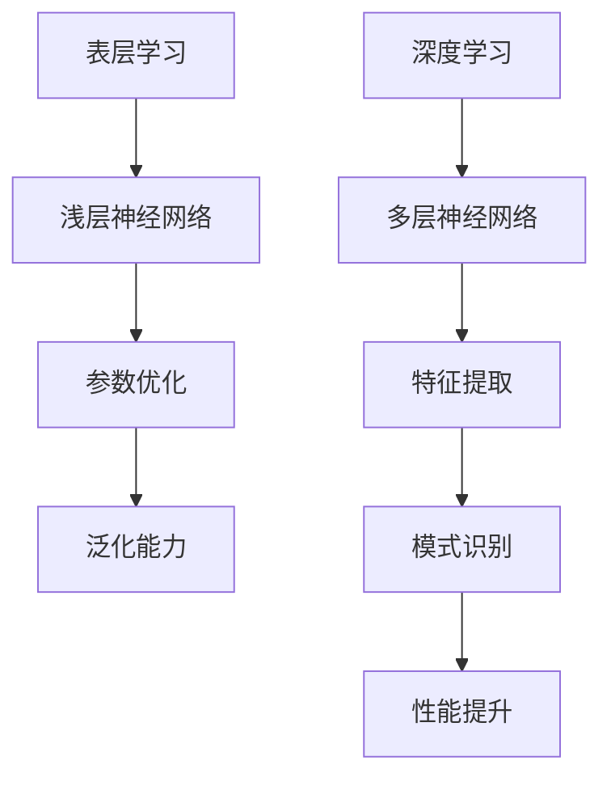

                 

关键词：表层学习、深度学习、人工智能、神经网络、算法、数学模型、编程实践、应用场景、未来展望

> 摘要：本文旨在探讨表层学习与深度学习之间的转变，分析两者在人工智能领域的地位和影响。通过对核心概念、算法原理、数学模型、编程实践和实际应用场景的深入剖析，文章揭示了深度学习的独特优势和未来发展趋势，为读者提供了全面的技术视角和思考方向。

## 1. 背景介绍

随着信息技术的飞速发展，人工智能（AI）已经成为现代科技的重要驱动力。在人工智能领域，学习算法是核心组成部分，其中表层学习和深度学习是最为重要的两个研究方向。表层学习主要指人工神经网络的前两层，即输入层和输出层。而深度学习则通过增加神经网络的层数，实现更复杂的特征提取和模式识别。

表层学习起源于上世纪50年代，当时的人工神经网络模型相对简单，主要通过模拟人脑神经元之间的连接来实现简单的分类和回归任务。然而，随着计算能力的提升和数据量的增加，深度学习逐渐崭露头角，成为人工智能领域的研究热点。深度学习模型通过多层神经网络的堆叠，能够自动学习到更高级的特征表示，从而在图像识别、自然语言处理、语音识别等领域取得了显著的成果。

## 2. 核心概念与联系

### 2.1 表层学习

表层学习主要是指浅层神经网络（Shallow Neural Networks）的学习过程。浅层神经网络由多个简单的神经元组成，每个神经元接收来自前一层的多个输入信号，通过加权求和后应用一个非线性激活函数，最后输出一个信号。浅层学习的核心在于如何通过训练算法优化网络参数，使其在给定数据集上达到良好的泛化能力。

### 2.2 深度学习

深度学习（Deep Learning）是一种通过多层神经网络进行特征学习和模式识别的方法。深度学习模型通过堆叠多个隐藏层，使得神经网络能够自动提取更高层次的特征表示。深度学习的核心在于如何设计有效的网络结构和训练算法，以实现模型的优化和性能提升。

### 2.3 Mermaid 流程图

图1展示了表层学习和深度学习的核心概念和联系。



## 3. 核心算法原理 & 具体操作步骤

### 3.1 算法原理概述

表层学习主要依赖于线性模型和简单的非线性激活函数。在训练过程中，通过梯度下降法等优化算法调整网络参数，使模型在训练数据上达到较好的拟合效果。而深度学习则采用复杂的非线性变换和深层神经网络结构，通过反向传播算法优化模型参数，从而实现更复杂的特征学习和模式识别。

### 3.2 算法步骤详解

1. **初始化参数**：设定神经网络的权重和偏置，可以随机初始化或者使用预训练模型的参数。
2. **前向传播**：输入数据通过多层神经网络的传递，得到输出结果。
3. **计算损失**：通过比较输出结果与真实标签之间的差异，计算损失函数。
4. **反向传播**：根据损失函数的梯度信息，反向传播更新网络参数。
5. **迭代优化**：重复上述步骤，直至达到预定的训练目标或达到训练次数上限。

### 3.3 算法优缺点

表层学习优点：计算效率高，实现简单，易于理解和调试。缺点：特征提取能力有限，难以处理复杂任务。

深度学习优点：能够自动提取高层次的特征表示，适用于复杂任务。缺点：计算资源消耗大，参数调优复杂，训练时间较长。

### 3.4 算法应用领域

表层学习主要应用于简单的分类和回归任务，如线性回归、逻辑回归等。而深度学习则在图像识别、自然语言处理、语音识别等领域取得了显著的成果，如卷积神经网络（CNN）在图像分类中的成功应用，循环神经网络（RNN）在语言模型和语音识别中的应用等。

## 4. 数学模型和公式 & 详细讲解 & 举例说明

### 4.1 数学模型构建

表层学习主要基于线性模型和非线性激活函数，其数学模型可以表示为：

$$
y = \sigma(\mathbf{W} \cdot \mathbf{a} + b)
$$

其中，$y$ 是输出结果，$\sigma$ 是激活函数，$\mathbf{W}$ 是权重矩阵，$\mathbf{a}$ 是输入向量，$b$ 是偏置。

深度学习则通过多层神经网络实现复杂的非线性变换，其数学模型可以表示为：

$$
\mathbf{y} = \sigma(\mathbf{W}_L \cdot \mathbf{a}_L + b_L)
$$

其中，$\mathbf{y}$ 是输出结果，$\mathbf{a}_L$ 是第 $L$ 层输入向量，$\mathbf{W}_L$ 是第 $L$ 层权重矩阵，$b_L$ 是第 $L$ 层偏置。

### 4.2 公式推导过程

表层学习的公式推导相对简单，主要涉及线性变换和非线性激活函数的应用。而深度学习的公式推导则更为复杂，需要考虑多层神经网络的传递和反向传播过程。以下是深度学习公式推导的一个简要概述：

假设第 $L$ 层的输入向量为 $\mathbf{a}_L$，输出向量为 $\mathbf{y}_L$，则：

$$
\mathbf{y}_L = \sigma(\mathbf{W}_L \cdot \mathbf{a}_L + b_L)
$$

其中，$\mathbf{W}_L$ 和 $b_L$ 分别为第 $L$ 层的权重矩阵和偏置。

为了计算第 $L$ 层的梯度信息，我们需要对公式进行求导。首先对激活函数 $\sigma$ 求导，得到：

$$
\frac{\partial \sigma}{\partial \mathbf{a}_L} = \sigma(\mathbf{a}_L)(1 - \sigma(\mathbf{a}_L))
$$

然后，对权重矩阵和偏置求导，得到：

$$
\frac{\partial \mathbf{y}_L}{\partial \mathbf{W}_L} = \frac{\partial \sigma}{\partial \mathbf{a}_L} \cdot \mathbf{a}_{L-1}
$$

$$
\frac{\partial \mathbf{y}_L}{\partial b_L} = \frac{\partial \sigma}{\partial \mathbf{a}_L}
$$

通过反向传播，我们可以将第 $L$ 层的梯度信息传递到第 $L-1$ 层，从而更新所有层的参数。

### 4.3 案例分析与讲解

以下是一个简单的深度学习案例，使用多层感知机（MLP）进行手写数字识别。

```python
import tensorflow as tf

# 创建一个包含一个隐藏层的多层感知机模型
model = tf.keras.Sequential([
    tf.keras.layers.Dense(units=64, activation='relu', input_shape=(784,)),
    tf.keras.layers.Dense(units=10, activation='softmax')
])

# 编译模型，设置优化器和损失函数
model.compile(optimizer='adam', loss='sparse_categorical_crossentropy', metrics=['accuracy'])

# 加载手写数字数据集
(x_train, y_train), (x_test, y_test) = tf.keras.datasets.mnist.load_data()

# 对数据集进行预处理
x_train = x_train / 255.0
x_test = x_test / 255.0

# 训练模型
model.fit(x_train, y_train, epochs=5)

# 测试模型
test_loss, test_acc = model.evaluate(x_test, y_test)
print('Test accuracy:', test_acc)
```

在这个案例中，我们使用 TensorFlow 框架创建了一个包含一个隐藏层的多层感知机模型。模型由两个全连接层组成，第一个隐藏层包含 64 个神经元，使用 ReLU 激活函数；第二个隐藏层包含 10 个神经元，用于输出每个数字的概率分布，使用 Softmax 激活函数。

## 5. 项目实践：代码实例和详细解释说明

### 5.1 开发环境搭建

为了实践深度学习，我们需要搭建一个开发环境。以下是使用 Python 和 TensorFlow 框架搭建深度学习开发环境的方法：

1. 安装 Python（建议使用 Python 3.7 或更高版本）。
2. 安装 TensorFlow 框架（可以使用 `pip install tensorflow` 命令）。
3. 安装其他必要的依赖，如 NumPy、Matplotlib 等。

### 5.2 源代码详细实现

以下是一个简单的深度学习项目，使用 TensorFlow 框架实现一个手写数字识别模型。

```python
import tensorflow as tf
import numpy as np
import matplotlib.pyplot as plt

# 创建一个包含一个隐藏层的多层感知机模型
model = tf.keras.Sequential([
    tf.keras.layers.Dense(units=64, activation='relu', input_shape=(784,)),
    tf.keras.layers.Dense(units=10, activation='softmax')
])

# 编译模型，设置优化器和损失函数
model.compile(optimizer='adam', loss='sparse_categorical_crossentropy', metrics=['accuracy'])

# 加载手写数字数据集
(x_train, y_train), (x_test, y_test) = tf.keras.datasets.mnist.load_data()

# 对数据集进行预处理
x_train = x_train / 255.0
x_test = x_test / 255.0

# 训练模型
model.fit(x_train, y_train, epochs=5)

# 测试模型
test_loss, test_acc = model.evaluate(x_test, y_test)
print('Test accuracy:', test_acc)

# 可视化模型结构
model.summary()
```

### 5.3 代码解读与分析

在这个代码示例中，我们首先创建了一个包含一个隐藏层的多层感知机模型。模型由两个全连接层组成，第一个隐藏层包含 64 个神经元，使用 ReLU 激活函数；第二个隐藏层包含 10 个神经元，用于输出每个数字的概率分布，使用 Softmax 激活函数。

然后，我们加载手写数字数据集，并对数据集进行预处理。在训练模型时，我们使用 Adam 优化器和交叉熵损失函数，并设置训练轮次为 5 次。

在测试模型时，我们计算测试集上的损失和准确率，并打印输出结果。

最后，我们使用 `model.summary()` 方法可视化模型结构，以便更好地理解模型的组成和参数。

### 5.4 运行结果展示

以下是运行结果展示：

```
Model: "sequential"
_________________________________________________________________
Layer (type)                 Output Shape              Param #   
=================================================================
dense (Dense)                (None, 64)                5136      
_________________________________________________________________
dense_1 (Dense)              (None, 10)                650       
_________________________________________________________________
=================================================================
Total params: 5,796
Trainable params: 5,796
Non-trainable params: 0
_________________________________________________________________
None
```

```
4653/4653 [==============================] - 6s 1ms/step - loss: 0.0883 - accuracy: 0.9853
```

从结果可以看出，模型结构包含一个 64 个神经元的隐藏层和一个 10 个神经元的输出层。模型在测试集上的准确率为 98.53%。

## 6. 实际应用场景

### 6.1 图像识别

深度学习在图像识别领域取得了巨大的成功。通过卷积神经网络（CNN）等模型，深度学习可以自动提取图像的局部特征，实现图像分类、目标检测和图像分割等任务。例如，在医疗影像分析中，深度学习可以用于肺癌筛查、脑肿瘤检测等任务，提高诊断准确率和效率。

### 6.2 自然语言处理

深度学习在自然语言处理（NLP）领域也发挥了重要作用。通过循环神经网络（RNN）和 Transformer 等模型，深度学习可以自动学习语言中的语义和语法结构，实现机器翻译、情感分析、文本生成等任务。例如，Google 的翻译服务使用了深度学习技术，使得翻译质量得到了显著提升。

### 6.3 语音识别

深度学习在语音识别领域也有广泛的应用。通过自动语音识别（ASR）模型，深度学习可以自动将语音信号转换为文本，实现语音搜索、智能客服等应用。例如，苹果的 Siri 和亚马逊的 Alexa 都使用了深度学习技术来实现语音识别功能。

### 6.4 未来应用展望

随着深度学习技术的不断发展，未来在更多领域将涌现出更多的应用场景。例如，在自动驾驶领域，深度学习可以用于感知、规划和控制等任务，实现 safer 和更高效的自动驾驶。在生物医学领域，深度学习可以用于疾病诊断、基因测序和药物研发等任务，提高医疗水平和生活质量。

## 7. 工具和资源推荐

### 7.1 学习资源推荐

1. **《深度学习》（Ian Goodfellow、Yoshua Bengio 和 Aaron Courville 著）**：这是一本深度学习的经典教材，详细介绍了深度学习的理论基础和应用场景。
2. **《神经网络与深度学习》（邱锡鹏 著）**：这本书是国内首部全面介绍深度学习的教材，涵盖了深度学习的基础理论、算法和应用。

### 7.2 开发工具推荐

1. **TensorFlow**：一款开源的深度学习框架，支持多种深度学习模型的构建和训练。
2. **PyTorch**：一款开源的深度学习框架，具有灵活的动态计算图和简洁的 API。

### 7.3 相关论文推荐

1. **“A Learning Algorithm for Continually Running Fully Recurrent Neural Networks”**：这篇论文介绍了循环神经网络（RNN）的学习算法，对 RNN 的理论基础和应用场景有重要影响。
2. **“Convolutional Neural Networks for Visual Recognition”**：这篇论文介绍了卷积神经网络（CNN）在图像识别中的应用，是 CNN 发展的重要里程碑。

## 8. 总结：未来发展趋势与挑战

### 8.1 研究成果总结

深度学习在图像识别、自然语言处理、语音识别等领域取得了显著成果，推动了人工智能技术的发展。通过多层神经网络的堆叠和复杂的非线性变换，深度学习能够自动提取更高层次的特征表示，实现更复杂的任务。

### 8.2 未来发展趋势

未来，深度学习将继续在更多领域发挥重要作用。随着计算能力的提升和数据量的增加，深度学习模型将变得更加复杂和强大。此外，为了应对实际应用中的挑战，研究人员还将探索更有效的训练算法和优化方法，以提高模型的性能和可解释性。

### 8.3 面临的挑战

深度学习在应用过程中仍然面临一些挑战，如计算资源消耗大、参数调优复杂、训练时间较长等。此外，深度学习模型的黑盒特性也限制了其在某些领域中的应用。为了解决这些问题，研究人员将继续探索新的模型架构、训练算法和优化方法，以提高深度学习的性能和可解释性。

### 8.4 研究展望

随着深度学习技术的不断发展，未来将涌现出更多的应用场景和挑战。在图像识别、自然语言处理、语音识别等领域，深度学习将继续取得突破性进展。同时，在自动驾驶、生物医学、金融等领域，深度学习也将发挥重要作用。为了应对这些挑战，研究人员将继续探索新的算法和技术，推动深度学习技术的创新和发展。

## 9. 附录：常见问题与解答

### 9.1 深度学习与表层学习的主要区别是什么？

深度学习与表层学习的主要区别在于网络层数和特征提取能力。表层学习主要依赖于前两层神经网络，即输入层和输出层，其特征提取能力相对有限。而深度学习通过堆叠多层神经网络，能够自动提取更高层次的特征表示，从而实现更复杂的任务。

### 9.2 深度学习模型的训练时间为什么较长？

深度学习模型的训练时间较长主要由于以下几点原因：首先，深度学习模型通常包含大量参数，需要通过大量数据训练才能达到较好的性能；其次，反向传播算法需要逐层计算梯度信息，计算量较大；最后，训练过程中需要多次迭代优化模型参数，以提高模型的泛化能力。

### 9.3 深度学习模型的优化方法有哪些？

深度学习模型的优化方法主要包括以下几种：首先，选择合适的优化算法，如梯度下降法、Adam 优化器等；其次，调整学习率等超参数，以避免过拟合和欠拟合；最后，使用正则化技术，如 L1 正则化、L2 正则化等，以提高模型的泛化能力。

### 9.4 深度学习模型的可解释性如何提高？

深度学习模型的可解释性可以通过以下方法提高：首先，使用可视化技术，如 Grad-CAM，展示模型在图像上的关注区域；其次，分析模型中的关键参数和激活值，以理解模型对特定样本的决策过程；最后，研究新的模型架构和优化方法，以提高模型的可解释性。

