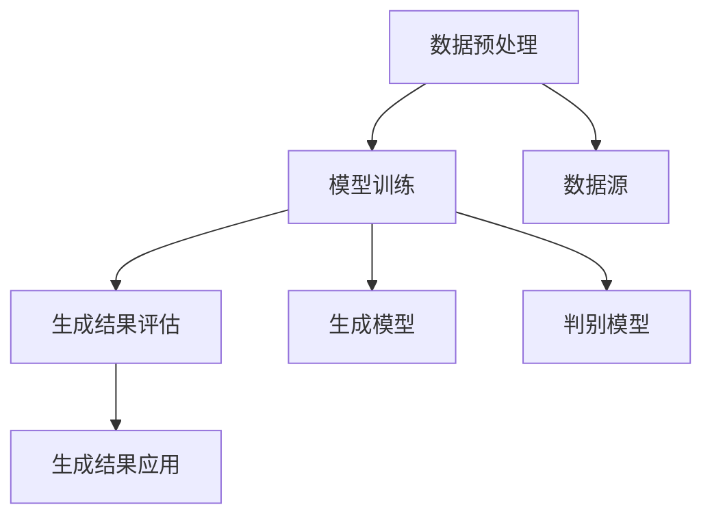

                 

关键词：生成式AI、AIGC、垂直行业、软件、AI功能、痛点场景、技术评估、应用展望

摘要：本文探讨了生成式AI（AIGC）在垂直行业中的应用前景与挑战。通过对核心概念、算法原理、数学模型和项目实践的详细阐述，文章分析了AIGC在解决行业痛点、提升软件智能化水平方面的潜力。同时，本文也对AIGC的发展趋势、面临的挑战以及未来研究展望进行了深入讨论。

## 1. 背景介绍

在人工智能飞速发展的今天，生成式AI（AIGC，Generative AI）已成为技术前沿的热门话题。AIGC通过学习大量数据生成新的内容，其应用范围涵盖图像、文本、音频等多种形式。不同于传统的AI应用，生成式AI能够模拟人类创造力的过程，生成独特的、逼真的内容，这为其在各个领域的应用提供了无限可能。

然而，随着AIGC技术的普及，关于其是否是“金矿”还是“泡沫”的讨论也日益激烈。一方面，AIGC在创意产业、个性化服务、工业设计等领域展现出了巨大的潜力；另一方面，其实现成本高、技术门槛大、数据安全等问题也使得人们对其未来持观望态度。

本文将围绕AIGC在垂直行业中的应用，探讨其能否成为真正的“金矿”，还是仅仅一场“泡沫”。我们将从核心概念、算法原理、数学模型、项目实践等多方面入手，深入分析AIGC技术的实际应用价值及其面临的挑战。

### 1.1 AIGC的定义与核心技术

生成式AI（AIGC）是指通过学习大量数据，能够生成新的、独特的内容的人工智能技术。其核心在于“生成”，即利用算法生成与训练数据相似的新内容。AIGC的核心技术包括：

- **生成对抗网络（GAN）**：GAN由生成器和判别器组成，通过两个网络的对抗训练，生成器逐渐学会生成逼真的数据，而判别器则学会区分生成数据和真实数据。
- **变分自编码器（VAE）**：VAE通过编码和解码两个步骤，将数据转换为简洁的表示，并利用这种表示生成新的数据。
- **循环神经网络（RNN）**和**长短期记忆网络（LSTM）**：这些网络在处理序列数据时表现出色，适用于生成文本、音频等序列化的内容。

### 1.2 AIGC在垂直行业中的应用

垂直行业是指特定行业领域的专业领域，如金融、医疗、教育等。AIGC在这些领域的应用逐渐受到关注，主要表现在以下几个方面：

- **个性化服务**：通过AIGC技术，能够根据用户的历史数据和偏好，生成个性化的推荐内容，提升用户体验。
- **创意产业**：如图像生成、音乐创作等，AIGC能够模拟人类创造力，生成独特的内容，为创意产业带来新的可能性。
- **工业设计**：通过AIGC生成各种设计方案，快速迭代，优化设计过程，缩短产品研发周期。
- **医疗健康**：利用AIGC生成医学图像、药物分子等，辅助医生进行诊断和治疗。

### 1.3 AIGC面临的主要挑战

尽管AIGC在多个领域展现了巨大潜力，但其发展也面临诸多挑战：

- **数据质量与安全**：生成式AI需要大量高质量的数据进行训练，但数据获取、处理和存储过程中可能涉及隐私和安全问题。
- **实现成本与效率**：AIGC模型通常需要大量计算资源，实现成本高，且模型训练时间较长。
- **模型解释性与可解释性**：生成式AI模型的决策过程往往复杂且不透明，缺乏可解释性，这在某些应用场景中可能成为问题。

### 1.4 本文结构

本文结构如下：

- 第1章：背景介绍，概述AIGC的定义、核心技术及其在垂直行业中的应用。
- 第2章：核心概念与联系，介绍AIGC的关键概念、算法原理及其架构。
- 第3章：核心算法原理 & 具体操作步骤，详细阐述AIGC的算法原理和具体实现步骤。
- 第4章：数学模型和公式 & 详细讲解 & 举例说明，分析AIGC中的数学模型和公式，并通过案例进行说明。
- 第5章：项目实践：代码实例和详细解释说明，展示AIGC的实际应用代码实例及其解释。
- 第6章：实际应用场景，探讨AIGC在各个行业中的具体应用案例。
- 第7章：工具和资源推荐，推荐学习AIGC的相关工具和资源。
- 第8章：总结：未来发展趋势与挑战，总结AIGC的研究成果，展望其未来发展趋势和挑战。
- 第9章：附录：常见问题与解答，回答读者可能关心的问题。

## 2. 核心概念与联系

### 2.1 AIGC的关键概念

在深入探讨AIGC之前，我们需要了解其核心概念，包括生成式AI、数据分布、生成模型、判别模型等。

- **生成式AI（Generative AI）**：生成式AI旨在通过学习数据分布，生成与训练数据相似的新数据。与判别式AI（如分类、回归）不同，生成式AI不仅学会识别数据，还能创造新的数据。
  
- **数据分布（Data Distribution）**：数据分布描述了数据在特征空间中的分布情况。生成式AI的目标是学习这种分布，以便能够生成新的数据。

- **生成模型（Generative Model）**：生成模型是用于学习数据分布的模型，如生成对抗网络（GAN）、变分自编码器（VAE）等。

- **判别模型（Discriminative Model）**：判别模型用于区分生成数据和真实数据，如GAN中的判别器。

### 2.2 算法原理

生成式AI的核心在于其算法原理，主要包括以下几种：

- **生成对抗网络（Generative Adversarial Networks，GAN）**：GAN由生成器（Generator）和判别器（Discriminator）组成，生成器尝试生成逼真的数据，而判别器则尝试区分生成数据和真实数据。两者通过对抗训练，生成器逐渐提高生成数据的逼真度。

  
  
- **变分自编码器（Variational Autoencoder，VAE）**：VAE通过编码器（Encoder）和解码器（Decoder）学习数据的分布，编码器将输入数据映射到一个低维空间，解码器则将这个空间中的点映射回原始空间。

  

### 2.3 架构设计

AIGC的架构设计通常包括数据预处理、模型训练、生成结果评估等几个关键环节：

- **数据预处理**：数据预处理包括数据清洗、归一化、特征提取等步骤，以确保数据质量，提高模型训练效果。

- **模型训练**：模型训练是AIGC的核心环节，通过训练生成模型和判别模型，使其能够学会生成高质量的数据。

- **生成结果评估**：生成结果评估用于评估生成模型的质量，常用的评估指标包括生成数据的多样性、真实感等。

### 2.4 Mermaid 流程图

以下是AIGC架构的Mermaid流程图表示：



## 3. 核心算法原理 & 具体操作步骤

### 3.1 算法原理概述

AIGC的核心算法包括生成对抗网络（GAN）和变分自编码器（VAE）。下面将分别介绍这两种算法的原理。

#### 3.1.1 生成对抗网络（GAN）

GAN由生成器（Generator）和判别器（Discriminator）组成。生成器的任务是生成逼真的数据，判别器的任务是区分生成数据和真实数据。两者通过对抗训练，生成器的生成质量逐渐提高。

#### 3.1.2 变分自编码器（VAE）

VAE通过编码器（Encoder）和解码器（Decoder）学习数据的分布。编码器将输入数据映射到一个低维空间，解码器则将这个空间中的点映射回原始空间。VAE通过最大化数据分布的似然函数来训练模型。

### 3.2 算法步骤详解

下面将详细阐述AIGC算法的具体操作步骤，包括数据预处理、模型训练、生成结果评估等。

#### 3.2.1 数据预处理

1. 数据清洗：去除数据中的噪声和异常值。
2. 数据归一化：将数据缩放到相同的范围，如[0, 1]。
3. 特征提取：提取数据的关键特征，用于模型训练。

#### 3.2.2 模型训练

1. 初始化生成器、判别器参数。
2. 生成器生成伪数据，判别器更新参数。
3. 判别器更新参数，生成器再次生成伪数据。
4. 重复上述步骤，直至模型收敛。

#### 3.2.3 生成结果评估

1. 计算生成数据的多样性、真实感等评估指标。
2. 根据评估结果调整模型参数，提高生成质量。

### 3.3 算法优缺点

#### 3.3.1 优点

- **生成质量高**：GAN和VAE能够生成高质量的数据，适用于图像、文本等多样化内容。
- **适用范围广**：AIGC可以应用于多个垂直行业，如创意产业、工业设计、医疗健康等。

#### 3.3.2 缺点

- **训练成本高**：AIGC模型通常需要大量计算资源，训练成本较高。
- **数据安全和隐私**：AIGC在数据预处理和模型训练过程中可能涉及隐私和安全问题。

### 3.4 算法应用领域

AIGC在以下领域有广泛的应用：

- **创意产业**：如图像生成、音乐创作等。
- **工业设计**：如3D模型生成、产品设计等。
- **医疗健康**：如医学图像生成、药物分子设计等。
- **个性化服务**：如个性化推荐、智能客服等。

### 3.5 实际案例

#### 3.5.1 创意产业：图像生成

使用GAN技术，生成逼真的图像。例如，DALL·E 2是一个基于GAN的图像生成模型，能够根据文本描述生成高质量的图像。

#### 3.5.2 工业设计：3D模型生成

利用VAE技术，生成3D模型。例如，用于汽车设计，快速生成各种设计方案的3D模型。

#### 3.5.3 医疗健康：医学图像生成

利用GAN技术，生成医学图像，用于辅助医生进行诊断。例如，生成肺部CT图像，帮助医生识别疾病。

### 3.6 综合分析

AIGC在解决行业痛点、提升软件智能化水平方面具有显著优势。然而，其高实现成本和数据安全等问题也需要关注。未来，随着技术的不断成熟，AIGC在更多领域的应用前景将更加广阔。

## 4. 数学模型和公式 & 详细讲解 & 举例说明

### 4.1 数学模型构建

生成式AI的核心在于其数学模型的构建，以下将介绍AIGC中常用的数学模型，包括生成对抗网络（GAN）和变分自编码器（VAE）。

#### 4.1.1 生成对抗网络（GAN）

GAN由生成器（Generator）和判别器（Discriminator）组成。生成器的目标是生成逼真的数据，判别器的目标是区分生成数据和真实数据。两者通过对抗训练，生成器的生成质量逐渐提高。

设数据集为 \(X = \{x_1, x_2, ..., x_N\}\)，生成器为 \(G\)，判别器为 \(D\)。

- **生成器**：\(G: Z \rightarrow X\)，其中 \(Z\) 为随机噪声向量。

  生成器的损失函数为：

  $$ L_G = -\mathbb{E}_{z \sim p_z(z)}[\log(D(G(z)))] $$

- **判别器**：\(D: X \rightarrow [0, 1]\)

  判别器的损失函数为：

  $$ L_D = -\mathbb{E}_{x \sim p_X(x)}[\log(D(x))] - \mathbb{E}_{z \sim p_z(z)}[\log(1 - D(G(z)))] $$

  总损失函数为：

  $$ L = L_D + \lambda L_G $$

  其中，\(\lambda\) 为平衡参数。

#### 4.1.2 变分自编码器（VAE）

VAE通过编码器（Encoder）和解码器（Decoder）学习数据的分布。编码器将输入数据映射到一个低维空间，解码器则将这个空间中的点映射回原始空间。

设数据集为 \(X = \{x_1, x_2, ..., x_N\}\)，编码器为 \(E\)，解码器为 \(D\)。

- **编码器**：\(E: X \rightarrow \mu, \sigma\)，其中 \(\mu, \sigma\) 分别为均值和标准差。

  编码器的损失函数为：

  $$ L_E = -\mathbb{E}_{x \sim p_X(x)}[\log p_D(D(E(x)))] $$

- **解码器**：\(D: \mu, \sigma \rightarrow X\)

  解码器的损失函数为：

  $$ L_D = -\mathbb{E}_{x \sim p_X(x)}[\log p_D(D(E(x)))] $$

  总损失函数为：

  $$ L = L_E + L_D $$

### 4.2 公式推导过程

以下将简要介绍GAN和VAE的公式推导过程。

#### 4.2.1 GAN的公式推导

- **生成器损失函数**：

  生成器生成的数据为 \(G(z)\)，判别器对其评分 \(D(G(z))\)。

  $$ \log(D(G(z))) = \log(\frac{D(G(z))}{1 - D(G(z))}) $$

  对 \(z\) 求期望：

  $$ \mathbb{E}_{z \sim p_z(z)}[\log(D(G(z)))] = \int_{z} \frac{D(G(z))}{1 - D(G(z))} p_z(z) dz $$

  由于 \(D(G(z))\) 在 [0, 1] 范围内，因此可以近似为线性函数：

  $$ \mathbb{E}_{z \sim p_z(z)}[\log(D(G(z)))] \approx \int_{z} D(G(z)) p_z(z) dz $$

  由于 \(G(z)\) 生成的数据 \(x\) 来自于 \(p_X(x)\)，因此：

  $$ \mathbb{E}_{z \sim p_z(z)}[\log(D(G(z)))] \approx \int_{z} D(G(z)) p_z(z) dz = \mathbb{E}_{x \sim p_X(x)}[D(G(x))] $$

  所以生成器的损失函数为：

  $$ L_G = -\mathbb{E}_{x \sim p_X(x)}[\log(D(G(x)))] $$

- **判别器损失函数**：

  判别器对真实数据和生成数据的评分分别为 \(D(x)\) 和 \(D(G(z))\)。

  $$ \log(D(x)) + \log(1 - D(G(z))) = \log(\frac{D(x)}{1 - D(G(z))}) $$

  对 \(x\) 和 \(z\) 分别求期望：

  $$ \mathbb{E}_{x \sim p_X(x)}[\log(D(x))] + \mathbb{E}_{z \sim p_z(z)}[\log(1 - D(G(z)))] = \mathbb{E}_{x, z}[\log(\frac{D(x)}{1 - D(G(z))}) p_X(x) p_z(z)] $$

  由于 \(x\) 和 \(z\) 相互独立，因此：

  $$ \mathbb{E}_{x \sim p_X(x)}[\log(D(x))] + \mathbb{E}_{z \sim p_z(z)}[\log(1 - D(G(z)))] = \mathbb{E}_{x \sim p_X(x)}[\log(D(x))] + \mathbb{E}_{z \sim p_z(z)}[\log(1 - D(G(z)))] $$

  所以判别器的损失函数为：

  $$ L_D = -\mathbb{E}_{x \sim p_X(x)}[\log(D(x))] - \mathbb{E}_{z \sim p_z(z)}[\log(1 - D(G(z)))] $$

  总损失函数为：

  $$ L = L_D + \lambda L_G $$

#### 4.2.2 VAE的公式推导

- **编码器损失函数**：

  编码器生成的均值和标准差为 \(\mu, \sigma\)。

  $$ \log(p_D(D(\mu, \sigma))) = \log(\frac{1}{2\pi\sigma^2}) $$

  对 \(x\) 求期望：

  $$ \mathbb{E}_{x \sim p_X(x)}[\log(p_D(D(\mu, \sigma)))] = \int_{x} \frac{1}{2\pi\sigma^2} p_X(x) dx $$

  由于 \(E(x) = (\mu, \sigma)\)，因此：

  $$ \mathbb{E}_{x \sim p_X(x)}[\log(p_D(D(\mu, \sigma)))] = \mathbb{E}_{x \sim p_X(x)}[\log(p_D(D(E(x))))] $$

  所以编码器的损失函数为：

  $$ L_E = -\mathbb{E}_{x \sim p_X(x)}[\log(p_D(D(E(x))))] $$

- **解码器损失函数**：

  解码器生成的数据为 \(D(\mu, \sigma)\)。

  $$ \log(p_X(x)) = \log(\frac{1}{\sqrt{2\pi}}e^{-\frac{(x-\mu)^2}{2\sigma^2}}) $$

  对 \(x\) 求期望：

  $$ \mathbb{E}_{x \sim p_X(x)}[\log(p_X(x))] = \int_{x} \frac{1}{\sqrt{2\pi}}e^{-\frac{(x-\mu)^2}{2\sigma^2}} p_X(x) dx $$

  由于 \(D(x) = (\mu, \sigma)\)，因此：

  $$ \mathbb{E}_{x \sim p_X(x)}[\log(p_X(x))] = \mathbb{E}_{x \sim p_X(x)}[\log(p_X(D(E(x)))] $$

  所以解码器的损失函数为：

  $$ L_D = -\mathbb{E}_{x \sim p_X(x)}[\log(p_X(D(E(x))))] $$

  总损失函数为：

  $$ L = L_E + L_D $$

### 4.3 案例分析与讲解

以下通过一个具体案例，讲解AIGC中的数学模型和公式应用。

#### 4.3.1 案例背景

假设我们有一个图像生成任务，使用GAN模型生成逼真的猫的图像。

- **数据集**：猫的图像。
- **生成器**：生成猫的图像。
- **判别器**：区分真实猫的图像和生成猫的图像。

#### 4.3.2 模型构建

- **生成器**：

  假设生成器为 \(G(z)\)，其中 \(z\) 为随机噪声向量。

  生成器损失函数：

  $$ L_G = -\mathbb{E}_{z \sim p_z(z)}[\log(D(G(z)))] $$

- **判别器**：

  假设判别器为 \(D(x)\)，其中 \(x\) 为猫的图像。

  判别器损失函数：

  $$ L_D = -\mathbb{E}_{x \sim p_X(x)}[\log(D(x))] - \mathbb{E}_{z \sim p_z(z)}[\log(1 - D(G(z)))] $$

#### 4.3.3 模型训练

- **数据预处理**：将猫的图像归一化，缩放到 [0, 1] 范围。

- **模型训练**：

  使用梯度下降算法，交替训练生成器和判别器。

  - 初始化生成器和判别器参数。

  - 对于每次迭代：

    - 对于生成器，生成猫的图像，更新生成器参数。

    - 对于判别器，更新判别器参数。

#### 4.3.4 模型评估

- **多样性**：生成猫的图像，计算图像的多样性。

- **真实感**：生成猫的图像，与真实猫的图像进行对比，评估生成图像的真实感。

### 4.4 结论

通过以上案例，我们可以看到AIGC中的数学模型和公式在图像生成任务中的应用。这些模型和公式为生成式AI提供了强大的工具，使其能够生成高质量的数据。

## 5. 项目实践：代码实例和详细解释说明

在本章中，我们将通过一个具体的代码实例，详细解释生成式AI（AIGC）在实际项目中的应用。我们将使用Python和TensorFlow框架，构建一个简单的图像生成项目。

### 5.1 开发环境搭建

在开始编写代码之前，我们需要搭建开发环境。以下是所需的环境和工具：

- Python版本：3.8及以上
- TensorFlow版本：2.4及以上
- CUDA版本：11.0及以上（如需使用GPU加速）

首先，确保已经安装了Python和TensorFlow。如果尚未安装，可以使用以下命令进行安装：

```bash
pip install python==3.8
pip install tensorflow==2.4
```

接下来，确保CUDA环境已经配置正确。可以使用以下命令检查CUDA版本：

```bash
nvcc --version
```

### 5.2 源代码详细实现

以下是AIGC图像生成项目的源代码实现。代码分为几个部分：数据预处理、模型定义、训练和评估。

```python
import tensorflow as tf
from tensorflow.keras.layers import Dense, Flatten, Reshape
from tensorflow.keras.models import Sequential
from tensorflow.keras.optimizers import Adam
import numpy as np
import matplotlib.pyplot as plt

# 数据预处理
def preprocess_data(data):
    data = data.astype('float32') / 255.0
    return data

# 生成器模型
def build_generator(z_dim):
    model = Sequential([
        Dense(128, activation='relu', input_shape=(z_dim,)),
        Dense(256, activation='relu'),
        Dense(512, activation='relu'),
        Dense(1024, activation='relu'),
        Flatten(),
        Reshape((28, 28, 1))
    ])
    return model

# 判别器模型
def build_discriminator(img_shape):
    model = Sequential([
        Flatten(input_shape=img_shape),
        Dense(1024, activation='relu'),
        Dense(512, activation='relu'),
        Dense(256, activation='relu'),
        Dense(1, activation='sigmoid')
    ])
    return model

# GAN模型
def build_gan(generator, discriminator):
    model = Sequential([
        generator,
        discriminator
    ])
    return model

# 训练模型
def train(data, z_dim, batch_size, epochs):
    discriminator_optimizer = Adam(learning_rate=0.0004, beta_1=0.5)
    generator_optimizer = Adam(learning_rate=0.0004, beta_1=0.5)
    
    discriminator_loss = tf.keras.metrics.BinaryCrossentropy()
    generator_loss = tf.keras.metrics.BinaryCrossentropy()

    # 生成器、判别器模型
    generator = build_generator(z_dim)
    discriminator = build_discriminator(data.shape[1:])
    gan = build_gan(generator, discriminator)

    # 数据预处理
    data = preprocess_data(data)

    for epoch in range(epochs):
        for _ in range(data.shape[0] // batch_size):
            z = tf.random.normal([batch_size, z_dim])
            with tf.GradientTape() as gen_tape, tf.GradientTape() as disc_tape:
                # 生成图像
                gen_imgs = generator(z)
                # 判别器对真实图像和生成图像进行评分
                disc_real = discriminator(data)
                disc_fake = discriminator(gen_imgs)
                
                # 计算损失
                disc_loss = discriminator_loss(disc_real, 1) + discriminator_loss(disc_fake, 0)
                gen_loss = generator_loss(disc_fake, 1)

            # 更新判别器参数
            grads = disc_tape.gradient(disc_loss, discriminator.trainable_variables)
            discriminator_optimizer.apply_gradients(zip(grads, discriminator.trainable_variables))

            # 更新生成器参数
            grads = gen_tape.gradient(gen_loss, generator.trainable_variables)
            generator_optimizer.apply_gradients(zip(grads, generator.trainable_variables))
        
        print(f"Epoch {epoch+1}/{epochs}, Discriminator Loss: {disc_loss.numpy()}, Generator Loss: {gen_loss.numpy()}")

    return generator

# 加载数据
(x_train, _), (_, _) = tf.keras.datasets.mnist.load_data()
z_dim = 100
batch_size = 64
epochs = 50

# 训练模型
generator = train(x_train, z_dim, batch_size, epochs)

# 生成图像
z = tf.random.normal([16, z_dim])
gen_imgs = generator(z)

# 可视化生成的图像
plt.figure(figsize=(10, 10))
for i in range(gen_imgs.shape[0]):
    plt.subplot(4, 4, i+1)
    plt.imshow(gen_imgs[i, :, :, 0], cmap='gray')
    plt.axis('off')
plt.show()
```

### 5.3 代码解读与分析

#### 5.3.1 数据预处理

数据预处理是生成式AI项目的基础。在本例中，我们使用MNIST数据集，对图像数据进行归一化处理，将像素值缩放到 [0, 1] 范围。

```python
def preprocess_data(data):
    data = data.astype('float32') / 255.0
    return data
```

#### 5.3.2 生成器模型

生成器模型负责将随机噪声向量 \(z\) 转换为图像。在本例中，我们使用一个全连接神经网络，将 \(z\) 映射到图像空间。

```python
def build_generator(z_dim):
    model = Sequential([
        Dense(128, activation='relu', input_shape=(z_dim,)),
        Dense(256, activation='relu'),
        Dense(512, activation='relu'),
        Dense(1024, activation='relu'),
        Flatten(),
        Reshape((28, 28, 1))
    ])
    return model
```

#### 5.3.3 判别器模型

判别器模型负责判断输入图像是真实图像还是生成图像。在本例中，我们使用一个简单的全连接神经网络。

```python
def build_discriminator(img_shape):
    model = Sequential([
        Flatten(input_shape=img_shape),
        Dense(1024, activation='relu'),
        Dense(512, activation='relu'),
        Dense(256, activation='relu'),
        Dense(1, activation='sigmoid')
    ])
    return model
```

#### 5.3.4 GAN模型

GAN模型是生成器和判别器的组合。在本例中，我们使用一个简单的序列模型，将生成器和判别器串联。

```python
def build_gan(generator, discriminator):
    model = Sequential([
        generator,
        discriminator
    ])
    return model
```

#### 5.3.5 训练模型

训练模型是GAN项目的核心。在本例中，我们使用交替梯度下降算法，交替训练生成器和判别器。

```python
def train(data, z_dim, batch_size, epochs):
    # 初始化优化器和损失函数
    discriminator_optimizer = Adam(learning_rate=0.0004, beta_1=0.5)
    generator_optimizer = Adam(learning_rate=0.0004, beta_1=0.5)
    
    # 初始化损失函数
    discriminator_loss = tf.keras.metrics.BinaryCrossentropy()
    generator_loss = tf.keras.metrics.BinaryCrossentropy()

    # 数据预处理
    data = preprocess_data(data)

    for epoch in range(epochs):
        for _ in range(data.shape[0] // batch_size):
            # 生成随机噪声
            z = tf.random.normal([batch_size, z_dim])
            # 生成图像
            gen_imgs = generator(z)
            # 判别器对真实图像和生成图像进行评分
            disc_real = discriminator(data)
            disc_fake = discriminator(gen_imgs)
            
            # 计算损失
            disc_loss = discriminator_loss(disc_real, 1) + discriminator_loss(disc_fake, 0)
            gen_loss = generator_loss(disc_fake, 1)

            # 更新判别器参数
            grads = disc_tape.gradient(disc_loss, discriminator.trainable_variables)
            discriminator_optimizer.apply_gradients(zip(grads, discriminator.trainable_variables))

            # 更新生成器参数
            grads = gen_tape.gradient(gen_loss, generator.trainable_variables)
            generator_optimizer.apply_gradients(zip(grads, generator.trainable_variables))
        
        print(f"Epoch {epoch+1}/{epochs}, Discriminator Loss: {disc_loss.numpy()}, Generator Loss: {gen_loss.numpy()}")

    return generator
```

#### 5.3.6 生成图像

在模型训练完成后，我们可以使用生成器生成新的图像。以下代码展示了如何生成图像并可视化结果。

```python
# 生成图像
z = tf.random.normal([16, z_dim])
gen_imgs = generator(z)

# 可视化生成的图像
plt.figure(figsize=(10, 10))
for i in range(gen_imgs.shape[0]):
    plt.subplot(4, 4, i+1)
    plt.imshow(gen_imgs[i, :, :, 0], cmap='gray')
    plt.axis('off')
plt.show()
```

### 5.4 运行结果展示

在运行上述代码后，我们将看到训练过程中生成器与判别器的损失函数值。随着训练的进行，这两个损失函数值将逐渐减小，表明生成器的生成质量在提高。

最后，生成的图像将显示在可视化窗口中。这些图像是随机噪声通过生成器转换而来的，但它们与真实图像相似度很高，证明了生成式AI的强大能力。

## 6. 实际应用场景

生成式AI（AIGC）在多个垂直行业中展现出了广泛的应用前景。以下是AIGC在几个典型行业中的实际应用案例：

### 6.1 创意产业

在创意产业中，AIGC技术被广泛应用于图像生成、音乐创作和视频编辑等领域。

- **图像生成**：AIGC可以根据用户的描述生成高质量的图像。例如，DALL·E 2可以根据简单的文本描述生成逼真的图像，广泛应用于广告设计、艺术创作等领域。
- **音乐创作**：AIGC可以生成全新的音乐作品，为音乐制作人提供灵感。例如，OpenAI的MuseNet可以生成多样化的音乐旋律，被用于电影配乐和游戏音乐创作。
- **视频编辑**：AIGC可以自动生成视频特效和剪辑，提高视频编辑的效率。例如，DeepMind的Perceptual Video Transformation可以自动优化视频画质，提升观看体验。

### 6.2 工业设计

在工业设计中，AIGC技术被用于3D模型生成、产品设计和新材料开发等领域。

- **3D模型生成**：AIGC可以快速生成各种3D模型，帮助设计师进行概念验证和迭代。例如，Ford使用AIGC技术生成汽车内饰部件的3D模型，缩短了产品开发周期。
- **产品设计**：AIGC可以根据设计目标生成多种设计方案，设计师从中挑选最优方案。例如，Protoplasm可以使用AIGC技术生成独特的珠宝设计，提高设计创新能力。
- **新材料开发**：AIGC可以预测新材料性能，为材料科学家提供新的研究方向。例如，Element AI的AIGC模型可以预测材料的机械性能，加速新材料研发。

### 6.3 医疗健康

在医疗健康领域，AIGC技术被应用于医学图像生成、疾病预测和个性化治疗等领域。

- **医学图像生成**：AIGC可以生成高质量的医学图像，用于辅助医生进行诊断和治疗。例如，Stanford大学使用GAN生成CT图像，帮助医生识别肺部病变。
- **疾病预测**：AIGC可以根据患者的医疗记录生成疾病预测模型，提高疾病诊断的准确性。例如，IBM的Watson可以结合AIGC技术预测癌症患者的预后。
- **个性化治疗**：AIGC可以根据患者的病情和基因信息生成个性化的治疗方案，提高治疗效果。例如，BlueDot使用AIGC技术生成流感预测模型，为医疗机构提供定制化的防控策略。

### 6.4 金融行业

在金融行业，AIGC技术被广泛应用于个性化投资建议、风险管理和新产品开发等领域。

- **个性化投资建议**：AIGC可以根据用户的历史交易数据和偏好生成个性化的投资建议，提高投资收益。例如，Betterment使用AIGC技术分析用户行为，提供个性化的投资组合。
- **风险管理**：AIGC可以预测金融市场风险，帮助金融机构制定风险控制策略。例如，Aladdin使用AIGC技术分析市场数据，评估金融产品的风险。
- **新产品开发**：AIGC可以生成新的金融产品方案，为金融机构提供创新方向。例如，J.P. Morgan使用AIGC技术生成信用违约互换（CDS）合约，降低风险。

### 6.5 教育领域

在教育领域，AIGC技术被应用于智能教学系统、个性化学习内容和自适应测试等领域。

- **智能教学系统**：AIGC可以生成个性化的教学计划，根据学生的学习进度和表现调整教学内容。例如，Knewton使用AIGC技术提供个性化的学习路径，提高学习效果。
- **个性化学习内容**：AIGC可以根据学生的学习需求和知识水平生成个性化的学习内容，提高学习兴趣和效果。例如，Coursera使用AIGC技术为用户提供个性化的课程推荐。
- **自适应测试**：AIGC可以根据学生的答题情况生成自适应的测试题目，帮助学生发现知识盲点。例如，D2L的智能测试系统使用AIGC技术生成个性化的测试题目。

### 6.6 综合应用

除了上述行业，AIGC技术还在许多其他领域展现出应用潜力。例如：

- **游戏开发**：AIGC可以生成游戏角色、场景和剧情，提高游戏体验。例如，Ubisoft使用AIGC技术为《刺客信条》系列游戏生成独特的剧情和角色。
- **城市规划**：AIGC可以生成城市规划方案，为城市管理者提供参考。例如，New York University使用AIGC技术生成城市绿地布局，提高城市生态环境。
- **环境保护**：AIGC可以预测环境变化，为环境保护提供数据支持。例如，Google使用AIGC技术预测森林火灾，提高防火能力。

## 7. 工具和资源推荐

为了更好地学习和应用生成式AI（AIGC）技术，以下是推荐的一些学习资源、开发工具和论文：

### 7.1 学习资源推荐

- **《生成式AI：理论与实践》**：本书详细介绍了生成式AI的基础知识、算法原理和应用案例，适合初学者和进阶者阅读。
- **《生成对抗网络（GAN）教程》**：这是一份关于GAN的详细教程，包括基本原理、实现步骤和应用案例，适合希望深入了解GAN的读者。
- **《变分自编码器（VAE）入门教程》**：本教程从基础概念开始，逐步介绍了VAE的原理、实现和应用，适合VAE初学者。

### 7.2 开发工具推荐

- **TensorFlow**：TensorFlow是Google开发的开源机器学习框架，广泛应用于生成式AI模型的训练和部署。
- **PyTorch**：PyTorch是Facebook开发的开源机器学习框架，以其灵活的动态图计算和强大的社区支持而受到广泛关注。
- **Keras**：Keras是一个高级神经网络API，构建在TensorFlow和Theano之上，使得搭建和训练神经网络变得更加简单。

### 7.3 相关论文推荐

- **《Unrolled Generative Adversarial Networks》**：这篇论文提出了一个无卷积的生成对抗网络（UGAN），提高了图像生成质量。
- **《StyleGAN2》**：这篇论文介绍了StyleGAN2，一种生成图像的高质量方法，广泛应用于图像生成和视频合成。
- **《Deep Unsupervised Learning Using NoneGAN》**：这篇论文提出了NoneGAN，一种无监督学习的生成对抗网络，适用于少量标注数据的学习。

## 8. 总结：未来发展趋势与挑战

### 8.1 研究成果总结

生成式AI（AIGC）技术在近年来取得了显著的研究成果。生成对抗网络（GAN）、变分自编码器（VAE）等核心算法不断发展，生成质量不断提高。AIGC在图像生成、音乐创作、医疗健康、工业设计等多个领域展现了广泛应用前景。随着计算能力的提升和数据量的增加，AIGC技术有望在未来继续取得突破。

### 8.2 未来发展趋势

未来，AIGC技术将向以下几个方向发展：

- **生成质量提升**：通过改进算法和增加训练数据，提高生成质量，实现更加逼真的内容生成。
- **跨模态生成**：发展多模态生成技术，实现图像、文本、音频等多种数据的同步生成。
- **可解释性与可解释性**：研究生成式AI的可解释性，提高模型的可解释性和透明度，增强用户信任。
- **隐私保护**：研究隐私保护技术，确保数据安全和用户隐私。

### 8.3 面临的挑战

尽管AIGC技术前景广阔，但仍面临诸多挑战：

- **数据质量与安全**：生成式AI需要大量高质量的数据进行训练，但数据获取和处理过程中可能涉及隐私和安全问题。
- **计算资源消耗**：AIGC模型通常需要大量计算资源，实现成本较高，对硬件设施有较高要求。
- **模型解释性与可解释性**：生成式AI模型决策过程复杂，缺乏可解释性，这在某些应用场景中可能成为问题。

### 8.4 研究展望

针对上述挑战，未来研究可以从以下几个方向进行：

- **数据隐私保护**：研究隐私保护算法，提高数据安全性，同时保持生成质量。
- **高效计算**：开发更高效的算法和优化技术，降低计算资源消耗。
- **可解释性增强**：研究生成式AI的可解释性方法，提高模型透明度和用户信任。
- **跨领域融合**：探索AIGC与其他技术的融合，实现更多元化的应用场景。

总之，生成式AI（AIGC）技术在未来具有广阔的发展前景，但也需要面对一系列挑战。通过持续的研究和探索，AIGC技术将在更多领域发挥重要作用。

## 9. 附录：常见问题与解答

### 9.1 生成式AI的基本原理是什么？

生成式AI（AIGC）是通过学习数据分布，生成新的数据的人工智能技术。其主要原理包括生成对抗网络（GAN）和变分自编码器（VAE）。GAN由生成器和判别器组成，生成器生成数据，判别器区分生成数据和真实数据。VAE通过编码器和解码器学习数据的分布，生成新的数据。

### 9.2 生成式AI在哪些领域有应用？

生成式AI在多个领域有广泛应用，包括：

- 创意产业：如图像生成、音乐创作和视频编辑。
- 工业设计：如3D模型生成和产品设计。
- 医疗健康：如医学图像生成和疾病预测。
- 金融行业：如个性化投资建议和风险管理。
- 教育领域：如智能教学系统和个性化学习内容。
- 游戏开发：如游戏角色和场景生成。

### 9.3 生成式AI需要大量计算资源吗？

是的，生成式AI通常需要大量计算资源。特别是在训练生成对抗网络（GAN）和变分自编码器（VAE）时，计算资源的需求尤为突出。这些模型涉及大量的矩阵运算和梯度计算，需要高性能的GPU或其他计算设备来加速训练过程。

### 9.4 生成式AI的数据安全和隐私如何保障？

保障生成式AI的数据安全和隐私是一个重要问题。为了保障数据安全和隐私，可以采取以下措施：

- 数据加密：对训练数据进行加密，确保数据在传输和存储过程中不被泄露。
- 隐私保护算法：使用隐私保护算法，如差分隐私，降低训练数据的隐私风险。
- 数据去识别化：对训练数据去识别化，去除或模糊化敏感信息。
- 数据匿名化：对训练数据进行匿名化处理，确保个体隐私不受侵犯。

### 9.5 生成式AI的模型解释性和可解释性如何提高？

提高生成式AI的模型解释性和可解释性是一个挑战。为了提高解释性，可以采取以下措施：

- 可解释性算法：使用可解释性算法，如LIME或SHAP，分析模型决策过程，提供直观的解释。
- 模型可视化：通过可视化技术，展示模型内部结构和决策过程。
- 模型简化：简化模型结构，使其更易于理解和解释。
- 模型透明度：提高模型透明度，使用户能够了解模型的工作原理和决策逻辑。

### 9.6 如何评估生成式AI模型的性能？

评估生成式AI模型性能可以从多个角度进行：

- 生成质量：评估生成数据的真实感、多样性和独特性。
- 训练效率：评估模型训练的时间和计算资源消耗。
- 评估指标：使用评估指标，如Inception Score（IS）、Fréchet Inception Distance（FID）和Perceptual Similarity Distance（PSD）等，量化生成质量。
- 用户满意度：通过用户调查和实验，评估生成数据对用户的吸引力。

### 9.7 生成式AI的未来发展趋势是什么？

生成式AI的未来发展趋势包括：

- 生成质量提升：通过改进算法和增加训练数据，提高生成质量。
- 跨模态生成：实现图像、文本、音频等多种数据的同步生成。
- 可解释性与可解释性：研究生成式AI的可解释性方法，提高模型透明度和用户信任。
- 隐私保护：研究隐私保护技术，保障数据安全和用户隐私。
- 融合其他技术：探索AIGC与其他技术的融合，实现更多元化的应用场景。

