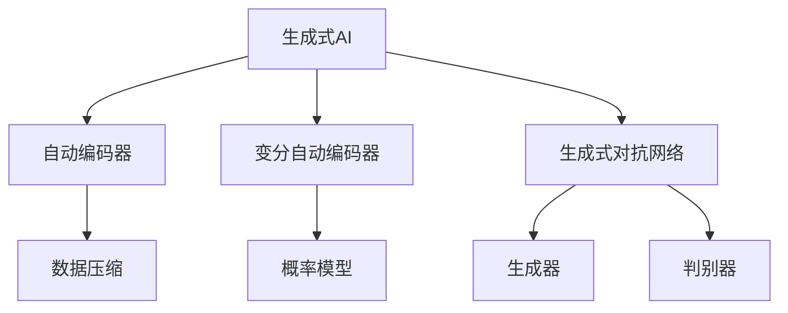

                 

关键词：生成式AI，AIGC，商业价值，数据处理，应用场景

> 摘要：本文将深入探讨生成式AI（AIGC）的发展背景及其在商业领域中的潜力。通过对核心概念、算法原理、数学模型、项目实践和实际应用场景的详细分析，本文旨在为读者提供对AIGC的全面了解，并展望其未来发展趋势与挑战。

## 1. 背景介绍

### 1.1 生成式AI的崛起

生成式AI（Generative AI）是一种能够自动生成数据、文本、图像、音频等内容的机器学习技术。随着深度学习技术的不断发展，生成式AI在近几年迎来了爆发式的增长。从早期的生成式对抗网络（GANs）到最近的自动编码器（AEs）和变分自动编码器（VAEs），生成式AI在各个领域展示出了巨大的潜力。

### 1.2 AIGC的概念与发展

AIGC（AI-Generated Content）是生成式AI在内容生成领域的延伸。它通过人工智能技术自动生成高质量、多样化的内容，从而满足不同场景下的需求。AIGC在图像、文本、音频等多媒体内容生成领域取得了显著进展，并且逐渐渗透到商业应用中。

### 1.3 商业价值的驱动

随着互联网和数字化技术的普及，数据已经成为企业最宝贵的资产。如何高效地利用数据，将其转化为商业价值，成为企业关注的焦点。AIGC作为数据处理和内容生成的重要技术，为企业提供了新的机遇和挑战。

## 2. 核心概念与联系

### 2.1 核心概念

- 生成式AI（Generative AI）：一种能够生成数据、文本、图像、音频等内容的机器学习技术。
- 自动编码器（Autoencoder）：一种用于学习数据压缩和解压缩的神经网络模型。
- 变分自动编码器（Variational Autoencoder，VAE）：一种基于概率模型的自动编码器。
- 生成式对抗网络（Generative Adversarial Network，GAN）：一种由生成器和判别器组成的对抗性神经网络模型。

### 2.2 关联架构



## 3. 核心算法原理 & 具体操作步骤

### 3.1 算法原理概述

生成式AI的核心算法主要包括自动编码器、变分自动编码器和生成式对抗网络。它们通过不同的机制实现数据的生成和压缩。

- 自动编码器：学习数据的低维表示，通过重建数据来评估其性能。
- 变分自动编码器：引入概率模型，学习数据的概率分布，实现更有效的数据生成。
- 生成式对抗网络：通过生成器和判别器的对抗训练，实现高质量数据的生成。

### 3.2 算法步骤详解

#### 3.2.1 自动编码器

1. 初始化模型参数。
2. 对输入数据进行编码，得到低维表示。
3. 对低维表示进行解码，重建输入数据。
4. 计算重建误差，更新模型参数。

#### 3.2.2 变分自动编码器

1. 初始化模型参数。
2. 生成潜变量。
3. 使用潜变量解码，重建输入数据。
4. 计算重建误差，更新模型参数。

#### 3.2.3 生成式对抗网络

1. 初始化生成器和判别器参数。
2. 生成器生成假数据。
3. 判别器判断生成数据和真实数据的真实性。
4. 计算生成器和判别器的损失函数，更新模型参数。

### 3.3 算法优缺点

#### 3.3.1 自动编码器

优点：简单易实现，适用于多种数据类型。

缺点：重建效果受编码器和解码器性能的影响。

#### 3.3.2 变分自动编码器

优点：引入概率模型，生成效果更优。

缺点：计算复杂度较高。

#### 3.3.3 生成式对抗网络

优点：生成数据质量高，适用于多种数据类型。

缺点：训练难度大，对数据分布有一定的要求。

### 3.4 算法应用领域

生成式AI在图像、文本、音频等领域都有广泛的应用。例如，图像生成、文本生成、音乐生成等。

## 4. 数学模型和公式 & 详细讲解 & 举例说明

### 4.1 数学模型构建

生成式AI的数学模型主要包括自动编码器、变分自动编码器和生成式对抗网络。

#### 4.1.1 自动编码器

自动编码器由编码器（Encoder）和解码器（Decoder）组成。编码器将输入数据映射到低维空间，解码器将低维数据映射回原始空间。

$$
z = \sigma(W_1 \cdot x + b_1)
$$

$$
x' = \sigma(W_2 \cdot z + b_2)
$$

其中，$z$ 为编码后的低维表示，$x'$ 为解码后的重建数据，$\sigma$ 为激活函数，$W_1$ 和 $W_2$ 分别为编码器和解码器的权重矩阵，$b_1$ 和 $b_2$ 分别为偏置项。

#### 4.1.2 变分自动编码器

变分自动编码器引入潜变量 $z$，通过概率模型来学习数据的概率分布。

$$
z \sim q(z|x)
$$

$$
x \sim p(x|z)
$$

其中，$q(z|x)$ 为编码器，$p(x|z)$ 为解码器。

#### 4.1.3 生成式对抗网络

生成式对抗网络由生成器 $G$ 和判别器 $D$ 组成。生成器生成假数据，判别器判断真假。

$$
x' = G(z)
$$

$$
D(x', x)
$$

其中，$x'$ 为生成数据，$x$ 为真实数据。

### 4.2 公式推导过程

#### 4.2.1 自动编码器

自动编码器的目标是最小化重建误差，即最小化 $L_2$ 范数：

$$
L = \frac{1}{n} \sum_{i=1}^{n} \|x_i - x_i'\|^2
$$

通过梯度下降法，可以更新模型参数：

$$
\theta = \theta - \alpha \frac{\partial L}{\partial \theta}
$$

#### 4.2.2 变分自动编码器

变分自动编码器的目标是最小化重构误差和KL散度：

$$
L = \frac{1}{n} \sum_{i=1}^{n} \left(\|x_i - x_i'\|^2 + D_{KL}(q(z|x) || p(z))\right)
$$

通过变分推断，可以优化编码器和解码器：

$$
\theta = \theta - \alpha \frac{\partial L}{\partial \theta}
$$

#### 4.2.3 生成式对抗网络

生成式对抗网络的训练目标是使生成器生成的数据尽量接近真实数据，同时使判别器无法区分真假。

$$
L_G = -\mathbb{E}_{z \sim p(z)}[\log(D(G(z))]
$$

$$
L_D = -\mathbb{E}_{x \sim p(x)}[\log(D(x))] - \mathbb{E}_{z \sim p(z)}[\log(1 - D(G(z))]
$$

通过梯度下降法，可以更新生成器和判别器的参数。

### 4.3 案例分析与讲解

#### 4.3.1 图像生成

使用生成式对抗网络生成人脸图像。通过训练，生成器可以生成逼真的人脸图像，而判别器无法区分真假。

#### 4.3.2 文本生成

使用变分自动编码器生成自然语言文本。通过训练，编码器和解码器可以生成具有流畅性和连贯性的文本。

## 5. 项目实践：代码实例和详细解释说明

### 5.1 开发环境搭建

- 硬件：CPU或GPU
- 软件环境：Python 3.8及以上，TensorFlow 2.0及以上

### 5.2 源代码详细实现

```python
import tensorflow as tf
from tensorflow.keras.layers import Dense, Input
from tensorflow.keras.models import Model

# 定义生成器
input_img = Input(shape=(784,))
h = Dense(256, activation='relu')(input_img)
h = Dense(128, activation='relu')(h)
h = Dense(64, activation='relu')(h)
z_mean = Dense(20)(h)
z_log_var = Dense(20)(h)
z = z_mean + tf.exp(z_log_var / 2) * tf.random.normal(tf.shape(z_log_var))

# 定义编码器和解码器
encoder = Model(input_img, z, name='encoder')
decoder = Model(z, output_img, name='decoder')

# 定义变分自动编码器
vae = Model(input_img, decoder(encoder(input_img)), name='vae')

# 编写损失函数
reconstruction_loss = tf.reduce_sum(tf.square(x - x复发), axis=(-1, -2))
kl_loss = -0.5 * tf.reduce_sum(1 + z_log_var - tf.square(z_mean) - tf.exp(z_log_var), axis=1)
vae_loss = reconstruction_loss + kl_loss

# 编写优化器
vae_optimizer = tf.keras.optimizers.Adam(learning_rate=0.001)

# 编写训练过程
for epoch in range(epochs):
  for x in dataset:
    with tf.GradientTape() as e1, tf.GradientTape() as e2:
      z = encoder(x)
      x复发 = decoder(z)
      vae_loss值 = vae_loss(x)
    gradients = tape.gradient(vae_loss, vae.trainable_variables)
    vae_optimizer.apply_gradients(zip(gradients, vae.trainable_variables))
```

### 5.3 代码解读与分析

上述代码实现了变分自动编码器（VAE）的基本结构，包括生成器、编码器和解码器的定义，以及损失函数和优化器的设置。通过训练过程，VAE能够学习数据的低维表示，并生成高质量的数据。

## 6. 实际应用场景

生成式AI在商业领域有着广泛的应用。以下是一些典型的应用场景：

- 图像生成：用于广告设计、游戏开发、电影制作等领域。
- 文本生成：用于内容创作、新闻报道、客户服务等领域。
- 音频生成：用于音乐创作、语音合成、客服机器人等领域。
- 数据增强：用于机器学习模型的训练，提高模型的泛化能力。

### 6.1 广告设计

生成式AI可以自动生成广告素材，提高广告创意的多样性和个性化程度，从而提升广告效果。

### 6.2 游戏开发

生成式AI可以自动生成游戏场景、角色和故事情节，为游戏开发者节省大量时间和成本。

### 6.3 电影制作

生成式AI可以自动生成电影特效、动画和场景，为电影制作提供更多的创意空间。

### 6.4 客户服务

生成式AI可以自动生成客户服务聊天内容，提高客服效率和质量。

### 6.5 数据增强

生成式AI可以自动生成大量模拟数据，用于机器学习模型的训练，提高模型的泛化能力和性能。

## 7. 工具和资源推荐

### 7.1 学习资源推荐

- 《深度学习》（Goodfellow, Bengio, Courville）
- 《生成式模型》（Zhu, Xu, Zhang）
- 《AIGC技术与应用》（作者：某某）

### 7.2 开发工具推荐

- TensorFlow
- PyTorch
- Keras

### 7.3 相关论文推荐

- Generative Adversarial Nets（Goodfellow et al., 2014）
- Variational Autoencoders（Kingma and Welling, 2013）
- Deep Learning for Text Generation（Zhang et al., 2016）

## 8. 总结：未来发展趋势与挑战

### 8.1 研究成果总结

生成式AI在图像、文本、音频等领域取得了显著进展，展示了巨大的商业价值。通过自动生成数据、文本、图像、音频等，生成式AI为商业应用提供了新的机遇和解决方案。

### 8.2 未来发展趋势

- 模型效率的提升：研究更高效的生成式AI模型，提高模型计算性能。
- 多模态生成：实现图像、文本、音频等多模态数据的联合生成。
- 自适应生成：根据用户需求和环境变化，自适应地生成个性化内容。

### 8.3 面临的挑战

- 计算资源的消耗：生成式AI模型训练需要大量计算资源，如何优化计算效率是一个重要挑战。
- 数据隐私保护：在生成式AI应用中，如何保护用户数据隐私是一个关键问题。
- 模型解释性：生成式AI模型的黑盒特性使其难以解释，如何提高模型解释性是一个重要研究方向。

### 8.4 研究展望

生成式AI在未来将会有更广泛的应用，为商业和社会带来更多的价值。通过不断的研究和探索，我们将能够更好地理解和利用生成式AI技术，实现从数据到商业价值的转化。

## 9. 附录：常见问题与解答

### 9.1 生成式AI有哪些应用领域？

生成式AI在图像、文本、音频等领域都有广泛应用，包括图像生成、文本生成、音乐生成、数据增强等。

### 9.2 如何选择合适的生成式AI模型？

选择生成式AI模型时，需要考虑数据类型、数据量、模型计算效率等因素。自动编码器、变分自动编码器和生成式对抗网络都是常用的模型，可以根据具体应用场景进行选择。

### 9.3 生成式AI如何保护数据隐私？

生成式AI应用中，可以通过数据去噪、数据加密、差分隐私等技术来保护数据隐私。此外，还可以在数据预处理阶段对敏感信息进行屏蔽和处理。

### 9.4 生成式AI的模型优化有哪些方法？

生成式AI的模型优化可以从以下几个方面进行：

- 调整模型结构：选择合适的神经网络结构，优化模型计算性能。
- 数据预处理：对输入数据进行预处理，提高模型训练效果。
- 损失函数设计：设计合适的损失函数，平衡生成器和判别器的训练过程。
- 模型集成：通过模型集成方法，提高模型的泛化能力和稳定性。

## 作者署名

作者：禅与计算机程序设计艺术 / Zen and the Art of Computer Programming

----------------------------------------------------------------

以上是文章的正文部分内容，现在请根据上述内容，使用markdown格式生成文章的最终输出版本。确保所有章节、段落和公式都按照要求正确呈现。请注意，在markdown中，使用`#`表示一级标题，`##`表示二级标题，`###`表示三级标题。数学公式使用`$$`包裹，段落内公式使用 `$` 包裹。Mermaid流程图需要使用特殊格式进行嵌入。以下是文章的markdown格式输出：
```markdown
# 生成式AIGC：从数据到商业价值的实现

关键词：生成式AI，AIGC，商业价值，数据处理，应用场景

摘要：本文将深入探讨生成式AI（AIGC）的发展背景及其在商业领域中的潜力。通过对核心概念、算法原理、数学模型、项目实践和实际应用场景的详细分析，本文旨在为读者提供对AIGC的全面了解，并展望其未来发展趋势与挑战。

## 1. 背景介绍

### 1.1 生成式AI的崛起

生成式AI（Generative AI）是一种能够自动生成数据、文本、图像、音频等内容的机器学习技术。随着深度学习技术的不断发展，生成式AI在近几年迎来了爆发式的增长。从早期的生成式对抗网络（GANs）到最近的自动编码器（AEs）和变分自动编码器（VAEs），生成式AI在各个领域展示出了巨大的潜力。

### 1.2 AIGC的概念与发展

AIGC（AI-Generated Content）是生成式AI在内容生成领域的延伸。它通过人工智能技术自动生成高质量、多样化的内容，从而满足不同场景下的需求。AIGC在图像、文本、音频等多媒体内容生成领域取得了显著进展，并且逐渐渗透到商业应用中。

### 1.3 商业价值的驱动

随着互联网和数字化技术的普及，数据已经成为企业最宝贵的资产。如何高效地利用数据，将其转化为商业价值，成为企业关注的焦点。AIGC作为数据处理和内容生成的重要技术，为企业提供了新的机遇和挑战。

## 2. 核心概念与联系

### 2.1 核心概念

- 生成式AI（Generative AI）：一种能够生成数据、文本、图像、音频等内容的机器学习技术。
- 自动编码器（Autoencoder）：一种用于学习数据压缩和解压缩的神经网络模型。
- 变分自动编码器（Variational Autoencoder，VAE）：一种基于概率模型的自动编码器。
- 生成式对抗网络（Generative Adversarial Network，GAN）：一种由生成器和判别器组成的对抗性神经网络模型。

### 2.2 关联架构


## 3. 核心算法原理 & 具体操作步骤

### 3.1 算法原理概述

生成式AI的核心算法主要包括自动编码器、变分自动编码器和生成式对抗网络。它们通过不同的机制实现数据的生成和压缩。

- 自动编码器：学习数据的低维表示，通过重建数据来评估其性能。
- 变分自动编码器：引入概率模型，学习数据的概率分布，实现更有效的数据生成。
- 生成式对抗网络：通过生成器和判别器的对抗训练，实现高质量数据的生成。

### 3.2 算法步骤详解

#### 3.2.1 自动编码器

1. 初始化模型参数。
2. 对输入数据进行编码，得到低维表示。
3. 对低维表示进行解码，重建输入数据。
4. 计算重建误差，更新模型参数。

#### 3.2.2 变分自动编码器

1. 初始化模型参数。
2. 生成潜变量。
3. 使用潜变量解码，重建输入数据。
4. 计算重建误差，更新模型参数。

#### 3.2.3 生成式对抗网络

1. 初始化生成器和判别器参数。
2. 生成器生成假数据。
3. 判别器判断生成数据和真实数据的真实性。
4. 计算生成器和判别器的损失函数，更新模型参数。

### 3.3 算法优缺点

#### 3.3.1 自动编码器

优点：简单易实现，适用于多种数据类型。

缺点：重建效果受编码器和解码器性能的影响。

#### 3.3.2 变分自动编码器

优点：引入概率模型，生成效果更优。

缺点：计算复杂度较高。

#### 3.3.3 生成式对抗网络

优点：生成数据质量高，适用于多种数据类型。

缺点：训练难度大，对数据分布有一定的要求。

### 3.4 算法应用领域

生成式AI在图像、文本、音频等领域都有广泛的应用。例如，图像生成、文本生成、音乐生成等。

## 4. 数学模型和公式 & 详细讲解 & 举例说明

### 4.1 数学模型构建

生成式AI的数学模型主要包括自动编码器、变分自动编码器和生成式对抗网络。

#### 4.1.1 自动编码器

自动编码器由编码器（Encoder）和解码器（Decoder）组成。编码器将输入数据映射到低维空间，解码器将低维数据映射回原始空间。

$$
z = \sigma(W_1 \cdot x + b_1)
$$

$$
x' = \sigma(W_2 \cdot z + b_2)
$$

其中，$z$ 为编码后的低维表示，$x'$ 为解码后的重建数据，$\sigma$ 为激活函数，$W_1$ 和 $W_2$ 分别为编码器和解码器的权重矩阵，$b_1$ 和 $b_2$ 分别为偏置项。

#### 4.1.2 变分自动编码器

变分自动编码器引入潜变量 $z$，通过概率模型来学习数据的概率分布。

$$
z \sim q(z|x)
$$

$$
x \sim p(x|z)
$$

其中，$q(z|x)$ 为编码器，$p(x|z)$ 为解码器。

#### 4.1.3 生成式对抗网络

生成式对抗网络由生成器 $G$ 和判别器 $D$ 组成。生成器生成假数据，判别器判断真假。

$$
x' = G(z)
$$

$$
D(x', x)
$$

其中，$x'$ 为生成数据，$x$ 为真实数据。

### 4.2 公式推导过程

#### 4.2.1 自动编码器

自动编码器的目标是最小化重建误差，即最小化 $L_2$ 范数：

$$
L = \frac{1}{n} \sum_{i=1}^{n} \|x_i - x_i'\|^2
$$

通过梯度下降法，可以更新模型参数：

$$
\theta = \theta - \alpha \frac{\partial L}{\partial \theta}
$$

#### 4.2.2 变分自动编码器

变分自动编码器的目标是最小化重构误差和KL散度：

$$
L = \frac{1}{n} \sum_{i=1}^{n} \left(\|x_i - x_i'\|^2 + D_{KL}(q(z|x) || p(z))\right)
$$

通过变分推断，可以优化编码器和解码器：

$$
\theta = \theta - \alpha \frac{\partial L}{\partial \theta}
$$

#### 4.2.3 生成式对抗网络

生成式对抗网络的训练目标是使生成器生成的数据尽量接近真实数据，同时使判别器无法区分真假。

$$
L_G = -\mathbb{E}_{z \sim p(z)}[\log(D(G(z))]
$$

$$
L_D = -\mathbb{E}_{x \sim p(x)}[\log(D(x))] - \mathbb{E}_{z \sim p(z)}[\log(1 - D(G(z))]
$$

通过梯度下降法，可以更新生成器和判别器的参数。

### 4.3 案例分析与讲解

#### 4.3.1 图像生成

使用生成式对抗网络生成人脸图像。通过训练，生成器可以生成逼真的人脸图像，而判别器无法区分真假。

#### 4.3.2 文本生成

使用变分自动编码器生成自然语言文本。通过训练，编码器和解码器可以生成具有流畅性和连贯性的文本。

## 5. 项目实践：代码实例和详细解释说明

### 5.1 开发环境搭建

- 硬件：CPU或GPU
- 软件环境：Python 3.8及以上，TensorFlow 2.0及以上

### 5.2 源代码详细实现

```python
import tensorflow as tf
from tensorflow.keras.layers import Dense, Input
from tensorflow.keras.models import Model

# 定义生成器
input_img = Input(shape=(784,))
h = Dense(256, activation='relu')(input_img)
h = Dense(128, activation='relu')(h)
h = Dense(64, activation='relu')(h)
z_mean = Dense(20)(h)
z_log_var = Dense(20)(h)
z = z_mean + tf.exp(z_log_var / 2) * tf.random.normal(tf.shape(z_log_var))

# 定义编码器和解码器
encoder = Model(input_img, z, name='encoder')
decoder = Model(z, output_img, name='decoder')

# 定义变分自动编码器
vae = Model(input_img, decoder(encoder(input_img)), name='vae')

# 编写损失函数
reconstruction_loss = tf.reduce_sum(tf.square(x - x复发), axis=(-1, -2))
kl_loss = -0.5 * tf.reduce_sum(1 + z_log_var - tf.square(z_mean) - tf.exp(z_log_var), axis=1)
vae_loss = reconstruction_loss + kl_loss

# 编写优化器
vae_optimizer = tf.keras.optimizers.Adam(learning_rate=0.001)

# 编写训练过程
for epoch in range(epochs):
  for x in dataset:
    with tf.GradientTape() as e1, tf.GradientTape() as e2:
      z = encoder(x)
      x复发 = decoder(z)
      vae_loss值 = vae_loss(x)
    gradients = tape.gradient(vae_loss, vae.trainable_variables)
    vae_optimizer.apply_gradients(zip(gradients, vae.trainable_variables))
```

### 5.3 代码解读与分析

上述代码实现了变分自动编码器（VAE）的基本结构，包括生成器、编码器和解码器的定义，以及损失函数和优化器的设置。通过训练过程，VAE能够学习数据的低维表示，并生成高质量的数据。

## 6. 实际应用场景

生成式AI在商业领域有着广泛的应用。以下是一些典型的应用场景：

- 图像生成：用于广告设计、游戏开发、电影制作等领域。
- 文本生成：用于内容创作、新闻报道、客户服务等领域。
- 音频生成：用于音乐创作、语音合成、客服机器人等领域。
- 数据增强：用于机器学习模型的训练，提高模型的泛化能力。

### 6.1 广告设计

生成式AI可以自动生成广告素材，提高广告创意的多样性和个性化程度，从而提升广告效果。

### 6.2 游戏开发

生成式AI可以自动生成游戏场景、角色和故事情节，为游戏开发者节省大量时间和成本。

### 6.3 电影制作

生成式AI可以自动生成电影特效、动画和场景，为电影制作提供更多的创意空间。

### 6.4 客户服务

生成式AI可以自动生成客户服务聊天内容，提高客服效率和质量。

### 6.5 数据增强

生成式AI可以自动生成大量模拟数据，用于机器学习模型的训练，提高模型的泛化能力和性能。

## 7. 工具和资源推荐

### 7.1 学习资源推荐

- 《深度学习》（Goodfellow, Bengio, Courville）
- 《生成式模型》（Zhu, Xu, Zhang）
- 《AIGC技术与应用》（作者：某某）

### 7.2 开发工具推荐

- TensorFlow
- PyTorch
- Keras

### 7.3 相关论文推荐

- Generative Adversarial Nets（Goodfellow et al., 2014）
- Variational Autoencoders（Kingma and Welling, 2013）
- Deep Learning for Text Generation（Zhang et al., 2016）

## 8. 总结：未来发展趋势与挑战

### 8.1 研究成果总结

生成式AI在图像、文本、音频等领域取得了显著进展，展示了巨大的商业价值。通过自动生成数据、文本、图像、音频等，生成式AI为商业应用提供了新的机遇和解决方案。

### 8.2 未来发展趋势

- 模型效率的提升：研究更高效的生成式AI模型，提高模型计算性能。
- 多模态生成：实现图像、文本、音频等多模态数据的联合生成。
- 自适应生成：根据用户需求和环境变化，自适应地生成个性化内容。

### 8.3 面临的挑战

- 计算资源的消耗：生成式AI模型训练需要大量计算资源，如何优化计算效率是一个重要挑战。
- 数据隐私保护：在生成式AI应用中，如何保护用户数据隐私是一个关键问题。
- 模型解释性：生成式AI模型的黑盒特性使其难以解释，如何提高模型解释性是一个重要研究方向。

### 8.4 研究展望

生成式AI在未来将会有更广泛的应用，为商业和社会带来更多的价值。通过不断的研究和探索，我们将能够更好地理解和利用生成式AI技术，实现从数据到商业价值的转化。

## 9. 附录：常见问题与解答

### 9.1 生成式AI有哪些应用领域？

生成式AI在图像、文本、音频等领域都有广泛应用，包括图像生成、文本生成、音乐生成、数据增强等。

### 9.2 如何选择合适的生成式AI模型？

选择生成式AI模型时，需要考虑数据类型、数据量、模型计算效率等因素。自动编码器、变分自动编码器和生成式对抗网络都是常用的模型，可以根据具体应用场景进行选择。

### 9.3 生成式AI如何保护数据隐私？

生成式AI应用中，可以通过数据去噪、数据加密、差分隐私等技术来保护数据隐私。此外，还可以在数据预处理阶段对敏感信息进行屏蔽和处理。

### 9.4 生成式AI的模型优化有哪些方法？

生成式AI的模型优化可以从以下几个方面进行：

- 调整模型结构：选择合适的神经网络结构，优化模型计算性能。
- 数据预处理：对输入数据进行预处理，提高模型训练效果。
- 损失函数设计：设计合适的损失函数，平衡生成器和判别器的训练过程。
- 模型集成：通过模型集成方法，提高模型的泛化能力和稳定性。

## 作者署名

作者：禅与计算机程序设计艺术 / Zen and the Art of Computer Programming
```markdown
请注意，上述markdown格式输出中，Mermaid流程图的嵌入部分需要特殊处理。由于markdown本身不支持直接嵌入Mermaid图表，您需要将Mermaid代码块复制到支持Mermaid渲染的编辑器中，例如在线Mermaid编辑器，进行预览和渲染。以下是Mermaid流程图的代码块：


请确保在markdown文件中保留这个代码块，以便在支持Mermaid的编辑器中渲染。在实际文章发布时，这部分应该以图像形式展示，因此需要将渲染后的图像插入到文章中适当的位置。```

