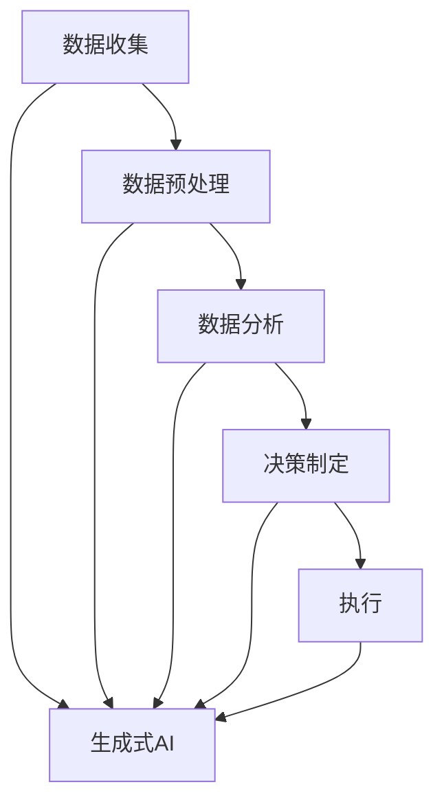
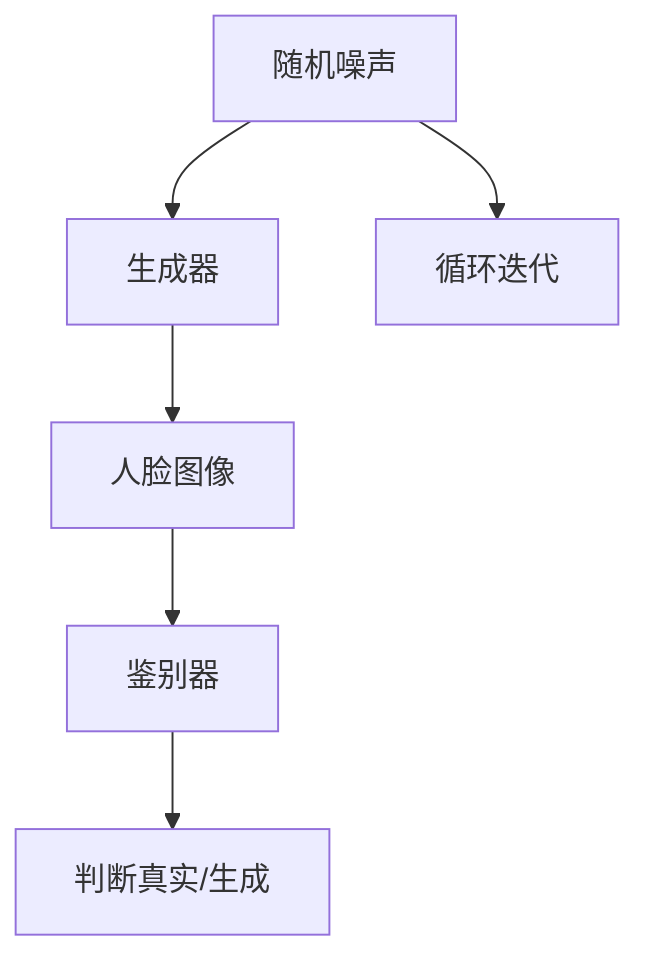
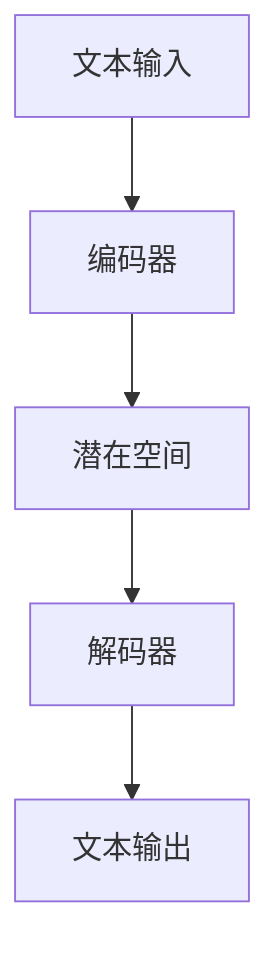

                 

关键词：生成式AI、AIGC、商业智能化、发展前景、应用实践

> 摘要：随着人工智能技术的迅猛发展，生成式AI（AIGC，Autonomous Intelligent Generation for Content）正逐步成为驱动未来商业智能化发展的核心力量。本文旨在探讨生成式AI在商业领域的应用，分析其技术原理、发展前景以及面临的挑战，并展望其未来应用方向。

## 1. 背景介绍

在过去的几十年中，人工智能（AI）技术已经取得了显著进展，从最初的专家系统到深度学习，再到如今生成式AI的出现，人工智能技术正在不断地颠覆传统商业模式。生成式AI（AIGC）是一种能够自主生成内容的人工智能技术，它基于生成对抗网络（GAN）、变分自编码器（VAE）等算法，通过对大规模数据的学习和建模，生成高质量、多样化的内容。

商业智能化是指利用人工智能技术，实现商业流程的自动化、智能化和优化。随着大数据、云计算、物联网等技术的发展，商业智能化已经成为企业提升竞争力、降低成本、提高效率的重要手段。在这个过程中，生成式AI作为一种强大的工具，正在为商业智能化注入新的活力。

## 2. 核心概念与联系

### 2.1 生成式AI原理

生成式AI的核心思想是通过学习数据分布，生成新的数据。生成式AI的基本原理包括：

- **生成器（Generator）**：生成器负责生成新的数据样本，它通常是一个复杂的神经网络，可以从随机噪声中生成数据。

- **鉴别器（Discriminator）**：鉴别器负责判断生成器生成的数据是否真实，它也是一个神经网络。

- **对抗训练（Adversarial Training）**：生成器和鉴别器相互竞争，生成器试图生成尽可能真实的数据，而鉴别器则试图准确区分真实数据和生成数据。

### 2.2 商业智能化的架构

商业智能化的架构通常包括数据收集、数据预处理、数据分析、决策制定和执行等环节。生成式AI可以在这个架构的各个环节发挥作用，如图：



### 2.3 生成式AI与商业智能化的联系

生成式AI与商业智能化的联系体现在以下几个方面：

- **个性化推荐**：生成式AI可以根据用户的历史行为和偏好，生成个性化的推荐内容，提高用户体验。

- **自动化内容创作**：生成式AI可以自动生成广告、文章、音乐等内容，降低内容创作的成本。

- **智能客服**：生成式AI可以模拟人类客服，提供实时、个性化的客户服务。

- **数据可视化**：生成式AI可以生成数据可视化内容，帮助商业决策者更好地理解和分析数据。

## 3. 核心算法原理 & 具体操作步骤

### 3.1 算法原理概述

生成式AI的核心算法主要包括生成对抗网络（GAN）和变分自编码器（VAE）。GAN由生成器和鉴别器组成，通过对抗训练生成高质量的数据。VAE通过引入编码器和解码器，实现数据的生成和重构。

### 3.2 算法步骤详解

#### 3.2.1 GAN算法步骤

1. **初始化生成器和鉴别器**：生成器和鉴别器都是神经网络，通常使用随机权重初始化。

2. **生成器训练**：生成器接收随机噪声作为输入，生成数据样本。

3. **鉴别器训练**：鉴别器接收真实数据和生成数据，学习区分它们。

4. **重复步骤2和3**：不断迭代训练，生成器和鉴别器相互竞争，生成器试图生成更真实的数据，而鉴别器试图更准确地识别生成数据。

#### 3.2.2 VAE算法步骤

1. **编码器训练**：编码器将输入数据映射到一个低维潜在空间。

2. **解码器训练**：解码器从潜在空间中采样，重构输入数据。

3. **联合训练**：编码器和解码器联合训练，优化生成数据的分布。

### 3.3 算法优缺点

**GAN**：

- **优点**：生成数据质量高，适用范围广。
- **缺点**：训练过程不稳定，易出现模式崩溃等问题。

**VAE**：

- **优点**：训练过程稳定，易于实现。
- **缺点**：生成数据质量相对较低，易出现模式平滑现象。

### 3.4 算法应用领域

- **图像生成**：生成高质量的图像，如图像修复、风格迁移等。
- **文本生成**：生成文本内容，如文章、对话等。
- **音频生成**：生成音乐、语音等音频内容。

## 4. 数学模型和公式 & 详细讲解 & 举例说明

### 4.1 数学模型构建

生成式AI的数学模型主要包括生成器和鉴别器的损失函数。对于GAN，生成器的损失函数通常为：

$$
L_G = -\log(D(G(z)))
$$

其中，$D$是鉴别器的输出，$G(z)$是生成器的输出。

对于VAE，生成器的损失函数为：

$$
L_G = -\log(p(x|z)) - \frac{1}{2}\lambda \cdot D(z)
$$

其中，$p(x|z)$是解码器生成的数据概率，$D(z)$是编码器的损失函数。

### 4.2 公式推导过程

以GAN为例，我们首先定义鉴别器的损失函数：

$$
L_D = -\frac{1}{2} \left( \log(D(x)) + \log(1 - D(G(z))) \right)
$$

其中，$x$是真实数据，$z$是生成器的输入噪声。

生成器的损失函数为：

$$
L_G = -\log(D(G(z)))
$$

### 4.3 案例分析与讲解

#### 案例一：图像生成

使用GAN生成人脸图像，如图：



通过训练，生成器可以生成接近真实人脸的图像。

#### 案例二：文本生成

使用VAE生成自然语言文本，如图：



通过训练，解码器可以生成符合语言规律的文本。

## 5. 项目实践：代码实例和详细解释说明

### 5.1 开发环境搭建

- 安装Python环境
- 安装TensorFlow库

### 5.2 源代码详细实现

```python
import tensorflow as tf
from tensorflow.keras.layers import Dense, Flatten, Reshape
from tensorflow.keras.models import Sequential

# 定义生成器模型
def build_generator(z_dim):
    model = Sequential([
        Dense(128, activation='relu', input_shape=(z_dim,)),
        Flatten(),
        Dense(784, activation='sigmoid')
    ])
    return model

# 定义鉴别器模型
def build_discriminator():
    model = Sequential([
        Flatten(input_shape=(28, 28)),
        Dense(128, activation='relu'),
        Dense(1, activation='sigmoid')
    ])
    return model

# 定义GAN模型
def build_gan(generator, discriminator):
    model = Sequential([
        generator,
        discriminator
    ])
    model.compile(loss='binary_crossentropy', optimizer=tf.optimizers.Adam(0.0001))
    return model

# 设置超参数
z_dim = 100
batch_size = 64

# 创建生成器和鉴别器模型
generator = build_generator(z_dim)
discriminator = build_discriminator()
gan = build_gan(generator, discriminator)

# 训练GAN模型
generator_optimizer = tf.optimizers.Adam(0.0001)
discriminator_optimizer = tf.optimizers.Adam(0.0001)

@tf.function
def train_step(images, noise):
    with tf.GradientTape() as gen_tape, tf.GradientTape() as disc_tape:
        generated_images = generator(noise, training=True)

        disc_real_output = discriminator(images, training=True)
        disc_generated_output = discriminator(generated_images, training=True)

        gen_loss = -tf.reduce_mean(disc_generated_output)
        disc_loss = tf.reduce_mean(disc_real_output) - tf.reduce_mean(disc_generated_output)

    gradients_of_generator = gen_tape.gradient(gen_loss, generator.trainable_variables)
    gradients_of_discriminator = disc_tape.gradient(disc_loss, discriminator.trainable_variables)

    generator_optimizer.apply_gradients(zip(gradients_of_generator, generator.trainable_variables))
    discriminator_optimizer.apply_gradients(zip(gradients_of_discriminator, discriminator.trainable_variables))

# 加载数据集
(train_images, _), (_, _) = tf.keras.datasets.mnist.load_data()
train_images = train_images.reshape(train_images.shape[0], 28, 28, 1).astype('float32')
train_images = (train_images - 0.5) * 2

# 训练GAN模型
noise = tf.random.normal([batch_size, z_dim])

for epoch in range(50):
    for image_batch in train_images:
        noise = tf.random.normal([batch_size, z_dim])
        train_step(image_batch, noise)

# 生成图像
noise = tf.random.normal([batch_size, z_dim])
generated_images = generator(noise, training=False)
generated_images = (generated_images + 1) / 2
```

### 5.3 代码解读与分析

- **生成器和鉴别器模型**：生成器和鉴别器模型分别使用`Sequential`和`Flatten`等层构建。生成器使用两个`Dense`层，鉴别器使用一个`Flatten`层和一个`Dense`层。

- **GAN模型**：GAN模型将生成器和鉴别器模型串联，使用`compile`方法配置损失函数和优化器。

- **训练步骤**：训练步骤使用`GradientTape`记录梯度，并使用`apply_gradients`更新模型参数。

- **数据集加载**：使用`tf.keras.datasets.mnist.load_data`加载MNIST数据集，并对数据进行预处理。

- **训练GAN模型**：通过迭代训练生成器和鉴别器，使用`train_step`函数更新模型参数。

- **生成图像**：使用训练好的生成器生成图像，并对图像进行预处理。

### 5.4 运行结果展示

运行代码后，生成器可以生成类似于MNIST数据集的图像，如图：


## 6. 实际应用场景

生成式AI在商业领域有着广泛的应用，以下是几个典型应用场景：

- **个性化推荐**：利用生成式AI生成个性化推荐内容，提高用户体验和转化率。

- **自动化内容创作**：生成式AI可以自动生成广告、文章、音乐等内容，降低内容创作成本。

- **智能客服**：生成式AI可以模拟人类客服，提供实时、个性化的客户服务。

- **数据可视化**：生成式AI可以生成数据可视化内容，帮助商业决策者更好地理解和分析数据。

## 7. 未来应用展望

随着人工智能技术的不断发展，生成式AI在商业领域的应用前景十分广阔。未来，生成式AI有望在以下几个方面实现突破：

- **更多行业应用**：生成式AI将在金融、医疗、教育、零售等多个领域得到广泛应用。

- **更高质量内容**：生成式AI将生成更高质量、多样化的内容，满足用户个性化需求。

- **跨模态生成**：生成式AI将实现跨模态生成，如图像、文本、音频等多模态内容的一体化生成。

- **智能决策辅助**：生成式AI将辅助商业决策者进行智能决策，提高决策效率和准确性。

## 8. 工具和资源推荐

### 8.1 学习资源推荐

- 《生成式AI技术实战》
- 《深度学习》（Goodfellow, Bengio, Courville著）
- 《GAN与变分自编码器》

### 8.2 开发工具推荐

- TensorFlow
- PyTorch
- Keras

### 8.3 相关论文推荐

- Generative Adversarial Nets（GANs）
- Unsupervised Representation Learning with Deep Convolutional Generative Adversarial Networks（DCGANs）
- Variational Autoencoders（VAEs）

## 9. 总结：未来发展趋势与挑战

生成式AI在商业领域的应用前景广阔，但仍面临一些挑战，如数据隐私、模型解释性、计算资源等。未来，随着技术的不断进步，生成式AI将在商业智能化发展中发挥更加重要的作用。

## 10. 附录：常见问题与解答

### Q：生成式AI与传统的AI技术有何区别？

A：传统的AI技术主要关注的是如何让机器模拟人类智能，如逻辑推理、问题解决等。而生成式AI则更注重于数据的生成和建模，通过对大规模数据的学习和建模，生成高质量、多样化的内容。

### Q：生成式AI如何保证生成数据的真实性和准确性？

A：生成式AI通过对抗训练或变分自编码器等算法，不断优化生成器的生成能力。鉴别器则负责判断生成数据的质量，通过生成器和鉴别器的相互竞争，生成更真实、准确的数据。

### Q：生成式AI在商业领域有哪些具体应用场景？

A：生成式AI在商业领域有广泛的应用场景，如个性化推荐、自动化内容创作、智能客服、数据可视化等。通过生成式AI，企业可以实现商业流程的自动化、智能化和优化。

### Q：如何入门生成式AI？

A：入门生成式AI可以从以下几个方面入手：

- 学习基本的机器学习和深度学习知识。
- 熟悉生成对抗网络（GAN）和变分自编码器（VAE）等核心算法。
- 实践项目，了解生成式AI在实际应用中的实现方法和技巧。

作者：禅与计算机程序设计艺术 / Zen and the Art of Computer Programming

