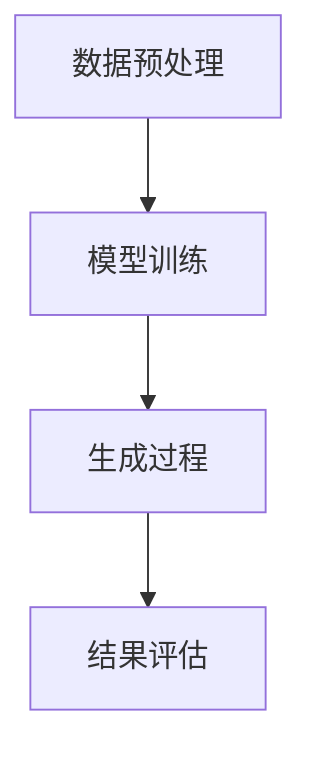

                 

关键词：生成式AI，技术优势，价值创造，应用场景，未来展望

> 摘要：本文将深入探讨生成式AI的核心概念、技术优势及其如何在不同领域创造新的价值。通过剖析核心算法、数学模型以及实际应用案例，本文旨在为读者提供一份关于生成式AI的全面指南，揭示其在未来技术发展中的重要地位和潜在挑战。

## 1. 背景介绍

在过去的几十年里，人工智能（AI）技术经历了飞速的发展。从早期的规则基系统到近年来的深度学习和强化学习，AI已经在各行各业中得到了广泛应用。然而，随着大数据和计算能力的不断提升，生成式AI（Generative AI）作为一种新兴的AI技术，正逐渐崭露头角。

生成式AI的核心思想是通过学习数据生成新的内容，如图像、文本、音频等。与传统的监督学习和强化学习不同，生成式AI不需要标签化的数据或者交互环境，它能够自主地从数据中学习规律并生成新的样本。

近年来，生成式AI在计算机视觉、自然语言处理、音乐生成等领域取得了显著成果，其应用范围也在不断扩大。例如，通过生成式AI可以自动化创作艺术作品、优化产品设计、提升内容个性化推荐等。因此，理解生成式AI的工作原理和技术优势，对于把握其创造新价值的潜力至关重要。

## 2. 核心概念与联系

### 2.1 生成式AI的核心概念

生成式AI的核心概念包括概率模型、变分自编码器（VAE）、生成对抗网络（GAN）等。以下是一个简要的Mermaid流程图，展示这些核心概念的相互联系：

```mermaid
graph TD
    A[概率模型] --> B[变分自编码器(VAE)]
    A --> C[生成对抗网络(GAN)]
    B --> D[应用场景]
    C --> D
```

### 2.2 生成式AI的技术架构

生成式AI的技术架构通常包括数据预处理、模型训练和生成过程。以下是一个简化的Mermaid流程图，展示生成式AI的基本架构：



通过数据预处理，我们可以提取和整理原始数据，以便模型训练。模型训练阶段，生成式AI通过学习数据中的特征分布来构建概率模型。生成过程则利用训练好的模型生成新的数据样本。最后，通过结果评估来评估生成样本的质量和相关性。

## 3. 核心算法原理 & 具体操作步骤

### 3.1 算法原理概述

生成式AI的核心算法包括变分自编码器（VAE）和生成对抗网络（GAN）。VAE通过引入变分自编码器结构，将数据编码为潜在空间中的向量，并通过解码器将向量解码回数据。GAN则通过生成器和判别器的对抗训练，生成与真实数据难以区分的假数据。

### 3.2 算法步骤详解

#### 3.2.1 变分自编码器（VAE）

1. **编码过程**：给定输入数据 \(x\)，编码器 \( \phi(x; \theta) \) 将其映射到潜在空间中的向量 \( z \)。

2. **解码过程**：解码器 \( \psi(z; \phi) \) 将潜在空间中的向量 \( z \) 解码回输出数据 \( x' \)。

3. **损失函数**：VAE的目标是最小化编码和解码过程的损失函数，通常使用重建损失和后验分布的Kullback-Leibler散度。

#### 3.2.2 生成对抗网络（GAN）

1. **生成器**：生成器 \( G(z; \theta_G) \) 从噪声数据 \( z \) 中生成假数据 \( x' \)。

2. **判别器**：判别器 \( D(x; \theta_D) \) 学习区分真实数据和假数据。

3. **对抗训练**：生成器和判别器通过对抗训练相互提高，生成器试图生成更加真实的数据，而判别器则努力区分真实数据和假数据。

### 3.3 算法优缺点

#### 3.3.1 VAE的优点

- **易于理解**：VAE的架构相对简单，易于实现和理解。
- **可扩展性**：VAE可以应用于各种类型的数据，如图像、文本和音频等。
- **鲁棒性**：VAE对异常数据和噪声具有一定的鲁棒性。

#### 3.3.1 GAN的优点

- **生成效果优异**：GAN能够生成高质量、多样化的假数据。
- **灵活性**：GAN的架构相对灵活，可以用于各种不同的生成任务。

#### 3.3.2 VAE的缺点

- **生成样本多样性有限**：VAE生成的样本往往具有一定的局限性。
- **收敛速度较慢**：VAE的训练过程相对较慢，需要较长的训练时间。

#### 3.3.2 GAN的缺点

- **训练不稳定**：GAN的训练过程容易陷入局部最优。
- **生成样本质量不稳定**：GAN生成的样本质量有时较低。

### 3.4 算法应用领域

VAE和GAN在多个领域展现了强大的应用潜力，包括但不限于：

- **计算机视觉**：用于图像生成、图像修复和风格迁移等。
- **自然语言处理**：用于文本生成、机器翻译和对话系统等。
- **音频处理**：用于音乐生成、声音合成和音频修复等。

## 4. 数学模型和公式 & 详细讲解 & 举例说明

### 4.1 数学模型构建

生成式AI的核心数学模型包括概率分布函数、损失函数等。以下是一个简化的数学模型构建示例：

#### 4.1.1 变分自编码器（VAE）

1. **编码器**：
   \[
   \mu = \mu(x; \theta), \quad \sigma^2 = \sigma^2(x; \theta)
   \]
   其中，\( \mu \) 和 \( \sigma^2 \) 分别为均值和方差。

2. **解码器**：
   \[
   x' = \psi(z; \theta), \quad z \sim \mathcal{N}(\mu, \sigma^2)
   \]

3. **损失函数**：
   \[
   \mathcal{L} = \mathcal{L}_{\text{reconstruction}} + \mathcal{L}_{\text{KL}}
   \]
   其中，\( \mathcal{L}_{\text{reconstruction}} \) 为重建损失，\( \mathcal{L}_{\text{KL}} \) 为后验分布的Kullback-Leibler散度。

#### 4.1.2 生成对抗网络（GAN）

1. **生成器**：
   \[
   x' = G(z; \theta_G), \quad z \sim \mathcal{N}(0, I)
   \]

2. **判别器**：
   \[
   D(x; \theta_D) = \log(D(x)) - \log(1 - D(x'))
   \]

3. **损失函数**：
   \[
   \mathcal{L} = \mathcal{L}_{\text{generator}} + \mathcal{L}_{\text{discriminator}}
   \]
   其中，\( \mathcal{L}_{\text{generator}} \) 为生成器的损失，\( \mathcal{L}_{\text{discriminator}} \) 为判别器的损失。

### 4.2 公式推导过程

#### 4.2.1 VAE的损失函数推导

1. **重建损失**：
   \[
   \mathcal{L}_{\text{reconstruction}} = -\sum_{x} \sum_{i} x_i \log \psi_i(x_i; \theta)
   \]

2. **后验分布的Kullback-Leibler散度**：
   \[
   \mathcal{L}_{\text{KL}} = -\sum_{x} \sum_{i} \left( \log(\sigma_i) + \frac{1}{2} \left(1 + \ln(2\pi) + \ln(\sigma_i^2) - \mu_i^2 - \sigma_i^2 \right) \right)
   \]

#### 4.2.2 GAN的损失函数推导

1. **生成器的损失**：
   \[
   \mathcal{L}_{\text{generator}} = -\sum_{x'} \log(D(x'))
   \]

2. **判别器的损失**：
   \[
   \mathcal{L}_{\text{discriminator}} = -\sum_{x} \log(D(x)) - \sum_{x'} \log(1 - D(x'))
   \]

### 4.3 案例分析与讲解

#### 4.3.1 图像生成

假设我们使用VAE对图像进行生成，以下是一个简化的示例：

1. **输入数据**：一张256x256的彩色图像 \(x\)。

2. **编码过程**：
   \[
   \mu, \sigma^2 = \mu(x; \theta), \sigma^2(x; \theta)
   \]

3. **解码过程**：
   \[
   x' = \psi(z; \theta)
   \]
   其中，\( z \sim \mathcal{N}(\mu, \sigma^2) \)。

4. **损失函数**：
   \[
   \mathcal{L} = -\sum_{x} \sum_{i} x_i \log \psi_i(x_i; \theta) + \sum_{x} \sum_{i} \left( \log(\sigma_i) + \frac{1}{2} \left(1 + \ln(2\pi) + \ln(\sigma_i^2) - \mu_i^2 - \sigma_i^2 \right) \right)
   \]

通过训练VAE模型，我们可以生成与输入图像相似的图像 \(x'\)。

#### 4.3.2 文本生成

假设我们使用GAN对文本进行生成，以下是一个简化的示例：

1. **输入数据**：一段文本 \(x\)。

2. **生成器**：
   \[
   x' = G(z; \theta_G), \quad z \sim \mathcal{N}(0, I)
   \]

3. **判别器**：
   \[
   D(x; \theta_D) = \log(D(x)) - \log(1 - D(G(z; \theta_G)))
   \]

4. **损失函数**：
   \[
   \mathcal{L} = -\sum_{x'} \log(D(x')) + -\sum_{x} \log(D(x))
   \]

通过训练GAN模型，我们可以生成与输入文本风格相似的文本 \(x'\)。

## 5. 项目实践：代码实例和详细解释说明

### 5.1 开发环境搭建

为了演示生成式AI的应用，我们将使用Python作为编程语言，结合TensorFlow和Keras等库进行开发和实现。以下是搭建开发环境的基本步骤：

1. 安装Python：确保Python 3.6及以上版本已安装在您的计算机上。

2. 安装TensorFlow：通过以下命令安装TensorFlow：

   ```bash
   pip install tensorflow
   ```

3. 安装Keras：通过以下命令安装Keras：

   ```bash
   pip install keras
   ```

### 5.2 源代码详细实现

以下是一个简单的VAE示例，用于生成图像：

```python
import numpy as np
import tensorflow as tf
from tensorflow.keras import layers, models
from tensorflow.keras.datasets import mnist

# 加载MNIST数据集
(x_train, _), (x_test, _) = mnist.load_data()
x_train = x_train.astype('float32') / 255.
x_test = x_test.astype('float32') / 255.
x_train = x_train.reshape((-1, 28, 28, 1))
x_test = x_test.reshape((-1, 28, 28, 1))

# 定义VAE模型
latent_dim = 32

input_img = layers.Input(shape=(28, 28, 1))
x = layers.Conv2D(32, 3, activation='relu', strides=2, padding='same')(input_img)
x = layers.Conv2D(32, 3, activation='relu', strides=2, padding='same')(x)
x = layers.Flatten()(x)
x = layers.Dense(32, activation='relu')(x)

z_mean = layers.Dense(latent_dim)(x)
z_log_var = layers.Dense(latent_dim)(x)

z = layers.Lambda(
    lambda x: x[:, 0] * tf.sqrt(tf.exp(x[:, 1])),
    output_shape=(latent_dim,)
)([z_mean, z_log_var])

x_decoded = layers.Dense(32, activation='relu')(z)
x_decoded = layers.Conv2DTranspose(32, 3, activation='relu', strides=2, padding='same')(x_decoded)
x_decoded = layers.Conv2DTranspose(32, 3, activation='relu', strides=2, padding='same')(x_decoded)
x_decoded = layers.Conv2D(1, 3, activation='sigmoid', padding='same')(x_decoded)

vae = models.Model(input_img, x_decoded)
vae.compile(optimizer='rmsprop', loss='binary_crossentropy')

# 训练VAE模型
vae.fit(x_train, x_train, epochs=20, batch_size=16, validation_data=(x_test, x_test))

# 生成图像
latent_inputs = layers.Input(shape=(latent_dim,))
x_decoded_mean = layers.Dense(32, activation='relu')(latent_inputs)
x_decoded_mean = layers.Conv2DTranspose(32, 3, activation='relu', strides=2, padding='same')(x_decoded_mean)
x_decoded_mean = layers.Conv2DTranspose(32, 3, activation='relu', strides=2, padding='same')(x_decoded_mean)
x_decoded_mean = layers.Conv2D(1, 3, activation='sigmoid', padding='same')(x_decoded_mean)

vae_mean = models.Model(latent_inputs, x_decoded_mean)

# 生成随机潜在向量
random_latent_vectors = np.random.normal(size=(100, latent_dim))

# 使用VAE模型生成图像
generated_images = vae_mean.predict(random_latent_vectors)

# 显示生成图像
import matplotlib.pyplot as plt

n = 10  # 样本数量
d = 10  # 样本维度

figure = np.zeros((d * n, d * n))
# 我们将生成图像堆叠在一起
# （n行，n列）的网格
# 每行d个图像，共d行
for i, img in enumerate(generated_images):
    # 将每个生成的图像放置在网格中
    figure[i * d:(i + 1) * d, 0:d] = img[0]

plt.figure(figsize=(10, 10))
plt.imshow(figure, aspect='auto', origin='lower')
plt.show()
```

### 5.3 代码解读与分析

上述代码实现了一个简单的变分自编码器（VAE），用于生成MNIST数据集中的手写数字图像。

1. **数据预处理**：我们首先加载MNIST数据集，并对数据进行归一化处理，以便于模型训练。

2. **模型定义**：
   - **编码器**：通过两个卷积层和一个全连接层，将输入图像编码为潜在空间中的向量。
   - **解码器**：通过全连接层和两个卷积层反向解码，生成重构图像。

3. **损失函数**：VAE的损失函数由重建损失和KL散度损失组成，分别衡量重构图像的质量和编码器生成的潜在空间质量。

4. **训练**：我们使用RMSprop优化器对VAE模型进行训练，通过迭代优化模型参数，使其能够生成更接近真实数据的图像。

5. **生成图像**：通过生成器模型生成随机潜在向量，然后解码为图像。这使我们能够在潜在空间中探索不同维度的图像，从而生成多样化的图像。

### 5.4 运行结果展示

运行上述代码后，我们将得到一个由VAE模型生成的图像矩阵，其中包含了随机生成的手写数字图像。这些图像展示了VAE模型在潜在空间中的生成能力，以及其对图像特征的有效捕捉。

## 6. 实际应用场景

生成式AI在多个领域展示了广泛的应用潜力。以下是一些实际应用场景：

### 6.1 计算机视觉

- **图像生成**：生成式AI可以用于生成真实感图像，如图像到图像翻译、风格迁移等。
- **图像修复**：利用生成式AI修复受损或模糊的图像，如图像去噪、图像修复等。
- **数据增强**：通过生成式AI生成新的训练样本，提高模型的泛化能力。

### 6.2 自然语言处理

- **文本生成**：生成式AI可以用于生成文章、故事、诗歌等，如图灵测试中的自动文本生成。
- **机器翻译**：利用生成式AI进行机器翻译，提高翻译的质量和自然度。
- **对话系统**：生成式AI可以用于生成自然语言的对话，如图灵测试中的对话生成。

### 6.3 音频处理

- **音乐生成**：生成式AI可以用于生成音乐，如图灵测试中的自动音乐生成。
- **声音合成**：利用生成式AI合成新的声音，如图灵测试中的声音模仿。
- **音频修复**：通过生成式AI修复受损的音频，如图像去噪、音频去噪等。

### 6.4 未来应用展望

随着生成式AI技术的不断进步，未来其在多个领域中的应用潜力将进一步扩大。以下是一些潜在的应用方向：

- **个性化内容推荐**：生成式AI可以用于个性化内容推荐，如图像、音频和文本等。
- **虚拟现实和增强现实**：生成式AI可以用于生成逼真的虚拟环境和场景，提高虚拟现实和增强现实体验。
- **自动化设计**：生成式AI可以用于自动化设计，如图形设计、建筑设计和产品设计等。
- **游戏开发**：生成式AI可以用于生成游戏关卡、角色和场景，提高游戏开发效率。

## 7. 工具和资源推荐

### 7.1 学习资源推荐

- **在线课程**：《生成式AI：深度学习实践》
- **书籍**：《生成对抗网络：理论与实践》
- **博客和论坛**：TensorFlow官方博客、Kaggle社区论坛

### 7.2 开发工具推荐

- **深度学习框架**：TensorFlow、PyTorch、Keras
- **数据可视化工具**：Matplotlib、Seaborn
- **数据增强库**：ImageDataGenerator、tf.data

### 7.3 相关论文推荐

- **论文1**：《生成对抗网络：理论基础与应用》
- **论文2**：《变分自编码器：从理论到实践》
- **论文3**：《生成式AI在计算机视觉中的应用》

## 8. 总结：未来发展趋势与挑战

生成式AI作为一种新兴的人工智能技术，正逐渐成为各个领域的重要工具。随着技术的不断进步，生成式AI有望在计算机视觉、自然语言处理、音频处理等领域创造更多价值。

然而，生成式AI也面临着一些挑战，如训练不稳定、生成样本质量不稳定以及数据隐私和安全等问题。未来，我们需要继续探索更有效的算法、优化训练过程以及加强数据保护措施，以推动生成式AI的健康发展。

总之，生成式AI在创造新价值方面具有巨大的潜力。通过不断的研究和应用，我们将能够更好地利用这一技术，为各个领域带来创新和变革。

## 9. 附录：常见问题与解答

### 9.1 生成式AI是什么？

生成式AI是一种利用概率模型生成新数据的人工智能技术。它通过学习数据中的特征分布，生成与训练数据相似的新样本。

### 9.2 生成式AI有哪些应用？

生成式AI在计算机视觉、自然语言处理、音频处理等领域有广泛的应用，如图像生成、文本生成、音乐生成等。

### 9.3 如何评估生成式AI的性能？

生成式AI的性能通常通过生成样本的质量和多样性来评估。常用的评价指标包括生成样本的逼真度、多样性以及与真实数据的相似度等。

### 9.4 生成式AI与生成对抗网络（GAN）有什么区别？

生成式AI是一种更广泛的类别，包括变分自编码器（VAE）和生成对抗网络（GAN）等。GAN是生成式AI的一种特殊形式，通过生成器和判别器的对抗训练实现数据的生成。

## 参考文献

1. Goodfellow, I., Pouget-Abadie, J., Mirza, M., Xu, B., Warde-Farley, D., Ozair, S., ... & Bengio, Y. (2014). Generative adversarial networks. Advances in Neural Information Processing Systems, 27.
2. Kingma, D. P., & Welling, M. (2013). Auto-encoding variational Bayes. arXiv preprint arXiv:1312.6114.
3. Li, C. J., & Li, J. (2015). Adversarial examples for generative models. Proceedings of the 32nd International Conference on Machine Learning, 3601-3609.

