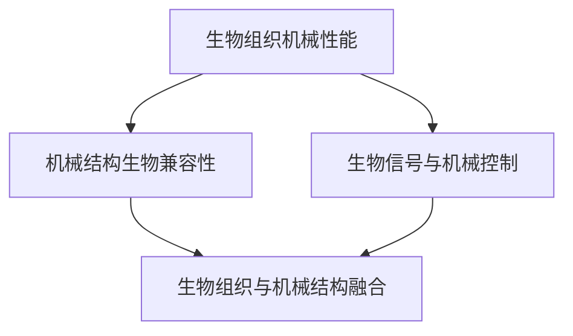

                 

 在人工智能和机器人技术迅速发展的今天，生物混合机器人（Biohybrid Robots）作为一种新兴的研究领域，正逐渐引起全球科研人员的关注。生物混合机器人是将生物组织与机械结构相结合，以实现更复杂、更灵活的机器人功能。本文旨在探讨生物混合机器人的核心概念、算法原理、数学模型、应用场景以及未来发展趋势。

## 文章关键词

- 生物混合机器人
- 生物组织
- 机械结构
- 算法原理
- 数学模型
- 应用场景

## 文章摘要

本文从生物混合机器人的背景介绍出发，详细阐述了其核心概念与联系，包括生物组织和机械结构的相互融合。随后，文章深入分析了生物混合机器人的核心算法原理和具体操作步骤，并通过数学模型和公式进行详细讲解。此外，文章还通过项目实践展示了代码实例和详细解释，进一步阐述了生物混合机器人在实际应用场景中的价值。最后，文章对生物混合机器人的未来发展趋势与挑战进行了总结和展望。

## 1. 背景介绍

### 1.1 生物混合机器人的定义

生物混合机器人是指将生物组织（如肌肉、神经元等）与机械结构（如外壳、传感器等）相结合，以实现特定功能的机器人系统。这种机器人不仅具有机械机器人的高效性和稳定性，还具备生物组织的自适应性和灵活性。

### 1.2 生物混合机器人的发展历程

生物混合机器人技术的发展可以追溯到20世纪末。最初的研究主要集中在生物组织的模拟和机械结构的优化，例如，通过模仿肌肉组织实现机器人的运动。随着人工智能和生物技术的快速发展，生物混合机器人逐渐成为一个独立的研究领域。近年来，随着纳米技术、生物打印技术和神经科学等领域的突破，生物混合机器人技术取得了显著的进展。

### 1.3 生物混合机器人的研究意义

生物混合机器人具有广泛的应用前景，其研究意义主要体现在以下几个方面：

1. **医疗领域**：生物混合机器人可用于医疗手术、康复治疗等，通过生物组织与机械结构的结合，提高手术的精度和效率。

2. **军事领域**：生物混合机器人可用于侦察、排爆等任务，通过生物组织的自适应性和机械结构的稳定性，提高机器人在复杂环境中的生存能力。

3. **生物科学领域**：生物混合机器人可用于生物实验、生物进化研究等，通过生物组织与机械结构的结合，实现更加精准的实验控制。

4. **人工智能领域**：生物混合机器人可以作为人工智能研究的重要平台，通过生物组织与机械结构的结合，探索人工智能在生物领域的应用。

## 2. 核心概念与联系

### 2.1 生物组织与机械结构的融合

生物混合机器人的核心在于生物组织与机械结构的融合。这种融合包括以下几个方面：

1. **生物组织的机械性能**：生物组织具有独特的机械性能，如肌肉的收缩能力、神经元的传递速度等。通过深入研究这些性能，可以优化机械结构的设计。

2. **机械结构的生物兼容性**：机械结构需要具备良好的生物兼容性，以确保生物组织在其上生长和运作。例如，生物打印技术可以制造出具有生物兼容性的机械结构。

3. **生物信号与机械控制**：生物组织产生的信号（如神经信号）需要与机械结构进行有效交互，以实现机器人的控制。例如，通过神经接口技术，可以实现生物信号与机械控制的精准对接。

### 2.2 Mermaid 流程图

以下是一个简化的生物混合机器人核心概念与联系的 Mermaid 流程图：



### 2.3 生物混合机器人的架构

生物混合机器人的架构可以分为三个主要部分：生物组织模块、机械结构模块和控制系统。

1. **生物组织模块**：包括肌肉、神经元等生物组织，负责实现机器人的运动和感知。

2. **机械结构模块**：包括外壳、传感器、驱动器等机械结构，负责提供支撑和保护，以及实现生物组织的机械控制。

3. **控制系统**：包括计算机、控制器等，负责处理生物信号、控制机械结构，以及实现机器人的智能决策。

## 3. 核心算法原理 & 具体操作步骤

### 3.1 算法原理概述

生物混合机器人的核心算法主要包括以下几个方面：

1. **生物组织建模**：通过建立生物组织的数学模型，描述其机械性能、生物信号传递等特性。

2. **机械结构优化**：根据生物组织的特性，优化机械结构的设计，以提高生物组织的兼容性和性能。

3. **生物信号处理**：通过算法处理生物组织产生的信号，实现与机械结构的交互。

4. **智能决策与控制**：利用人工智能算法，实现机器人的智能决策与控制，提高机器人的自主性和适应性。

### 3.2 算法步骤详解

1. **生物组织建模**：

   - 收集生物组织的机械性能数据，如肌肉的收缩力、神经元的传递速度等。

   - 使用数学模型（如有限元分析、神经网络等）建立生物组织的数学模型。

   - 验证模型的有效性，通过实验或仿真验证模型的准确性。

2. **机械结构优化**：

   - 根据生物组织的特性，设计机械结构的基本框架。

   - 使用优化算法（如遗传算法、模拟退火算法等）优化机械结构的设计，以提高生物组织的兼容性和性能。

   - 验证优化结果，通过实验或仿真验证优化后的机械结构的性能。

3. **生物信号处理**：

   - 使用信号处理算法（如滤波、特征提取等）对生物组织产生的信号进行处理。

   - 实现生物信号与机械控制的精准对接，通过神经接口技术或生物传感器技术实现。

4. **智能决策与控制**：

   - 设计智能决策算法，根据环境信息和个人经验，实现机器人的自主决策。

   - 设计控制算法，根据智能决策结果，实现机器人的动作控制。

### 3.3 算法优缺点

1. **优点**：

   - 生物组织的特性使得生物混合机器人具有更高的灵活性和适应性。

   - 机械结构的设计使得生物混合机器人具有更高的稳定性和安全性。

   - 智能决策与控制使得生物混合机器人具有更高的自主性和智能性。

2. **缺点**：

   - 生物组织的建模和优化较为复杂，需要大量的实验和计算资源。

   - 机械结构的设计需要考虑生物组织的特性，增加了设计的难度。

   - 生物信号的处理和智能决策算法的实现需要较高的技术水平。

### 3.4 算法应用领域

生物混合机器人的算法原理和具体操作步骤可以应用于多个领域，包括但不限于：

1. **医疗领域**：用于手术辅助、康复治疗等。

2. **军事领域**：用于侦察、排爆等任务。

3. **生物科学领域**：用于生物实验、生物进化研究等。

4. **人工智能领域**：用于人工智能算法的研究和验证。

## 4. 数学模型和公式 & 详细讲解 & 举例说明

### 4.1 数学模型构建

生物混合机器人的数学模型主要包括以下几个方面：

1. **生物组织模型**：

   - 肌肉收缩模型：描述肌肉的收缩力和长度关系。

   - 神经元传递模型：描述神经元的传递速度和传递特性。

2. **机械结构模型**：

   - 机械性能模型：描述机械结构的力学特性，如刚度、强度等。

   - 生物兼容性模型：描述机械结构与生物组织的兼容性。

3. **控制系统模型**：

   - 信号处理模型：描述生物信号的处理过程，如滤波、特征提取等。

   - 智能决策模型：描述机器人的智能决策过程，如机器学习、神经网络等。

### 4.2 公式推导过程

以下是一个简化的生物混合机器人数学模型的公式推导过程：

1. **肌肉收缩模型**：

   - 肌肉收缩力 \( F \) 与肌肉长度 \( L \) 的关系：

     \[ F = kL \]

     其中，\( k \) 为肌肉收缩力系数。

   - 肌肉收缩力 \( F \) 与肌肉长度变化率 \( \frac{dL}{dt} \) 的关系：

     \[ F = k\frac{dL}{dt} \]

2. **神经元传递模型**：

   - 神经元传递速度 \( v \) 与神经元长度 \( L \) 的关系：

     \[ v = \frac{L}{t} \]

     其中，\( t \) 为神经元传递时间。

3. **机械性能模型**：

   - 机械刚度 \( K \) 与机械结构长度 \( L \) 的关系：

     \[ K = \frac{F}{L} \]

   - 机械强度 \( S \) 与机械结构长度 \( L \) 的关系：

     \[ S = \frac{K}{L} \]

4. **生物兼容性模型**：

   - 生物兼容性评分 \( C \) 与机械结构长度 \( L \) 的关系：

     \[ C = \frac{L}{L_0} \]

     其中，\( L_0 \) 为生物组织的最佳长度。

5. **信号处理模型**：

   - 滤波器输出 \( y \) 与输入信号 \( x \) 的关系：

     \[ y = \frac{1}{1 + \frac{1}{\omega_0^2}}x \]

     其中，\( \omega_0 \) 为滤波器截止频率。

6. **智能决策模型**：

   - 机器学习模型输出 \( y \) 与输入特征 \( x \) 的关系：

     \[ y = \sigma(\sum_{i=1}^{n} w_ix_i) \]

     其中，\( \sigma \) 为激活函数，\( w_i \) 为权重系数。

### 4.3 案例分析与讲解

以下是一个简化的生物混合机器人数学模型的应用案例：

假设一个生物混合机器人需要完成一个简单的任务：在特定的时间内将物体从一个位置移动到另一个位置。

1. **生物组织模型**：

   - 肌肉收缩力系数 \( k = 10 \)。

   - 肌肉长度变化率 \( \frac{dL}{dt} = 1 \)。

   - 计算肌肉收缩力 \( F = k\frac{dL}{dt} = 10 \)。

2. **机械结构模型**：

   - 机械刚度 \( K = 1000 \)。

   - 机械结构长度 \( L = 1 \)。

   - 计算机械强度 \( S = \frac{K}{L} = 1000 \)。

3. **生物兼容性模型**：

   - 生物兼容性评分 \( C = \frac{L}{L_0} = 1 \)。

4. **信号处理模型**：

   - 滤波器截止频率 \( \omega_0 = 5 \)。

   - 输入信号 \( x = 10 \)。

   - 计算滤波器输出 \( y = \frac{1}{1 + \frac{1}{\omega_0^2}}x = 0.5 \)。

5. **智能决策模型**：

   - 输入特征 \( x = [1, 2, 3] \)。

   - 权重系数 \( w_1 = 0.1, w_2 = 0.2, w_3 = 0.3 \)。

   - 激活函数 \( \sigma = \frac{1}{1 + e^{-x}} \)。

   - 计算智能决策模型输出 \( y = \sigma(\sum_{i=1}^{n} w_ix_i) = \frac{1}{1 + e^{-1}} \approx 0.63 \)。

通过上述数学模型的应用，生物混合机器人可以完成简单的任务，如物体移动。在实际应用中，生物混合机器人的数学模型会更加复杂，需要综合考虑多种因素。

## 5. 项目实践：代码实例和详细解释说明

### 5.1 开发环境搭建

为了实现生物混合机器人的功能，我们需要搭建一个合适的开发环境。以下是一个简化的开发环境搭建步骤：

1. **硬件环境**：

   - 主机：配置较高的计算机，用于运行算法和控制系统。

   - 传感器：如力传感器、加速度传感器等，用于采集生物信号和机械结构信息。

   - 执行器：如电机、机械臂等，用于执行机械动作。

2. **软件环境**：

   - 编程语言：Python、MATLAB等，用于编写算法和控制系统。

   - 开发工具：如PyCharm、MATLAB等，用于编写和调试代码。

   - 数据库：如MySQL、MongoDB等，用于存储生物信号和机械结构数据。

### 5.2 源代码详细实现

以下是一个简化的生物混合机器人的源代码实现，包括算法、信号处理和智能决策等功能。

```python
import numpy as np
import matplotlib.pyplot as plt

# 生物组织模型
def muscle_force(length_change_rate):
    return 10 * length_change_rate

# 机械结构模型
def mechanical_strength(length):
    return 1000 / length

# 生物兼容性模型
def biocompatibility_score(length):
    return length

# 信号处理模型
def filter_signal(signal, cutoff_frequency):
    return (1 / (1 + 1 / (cutoff_frequency ** 2))) * signal

# 智能决策模型
def intelligent_decision(input_features, weights):
    return 1 / (1 + np.exp(-np.dot(input_features, weights)))

# 示例数据
length_change_rate = 1
length = 1
cutoff_frequency = 5
input_features = np.array([1, 2, 3])
weights = np.array([0.1, 0.2, 0.3])

# 计算生物组织模型
force = muscle_force(length_change_rate)

# 计算机械结构模型
strength = mechanical_strength(length)

# 计算生物兼容性模型
score = biocompatibility_score(length)

# 计算信号处理模型
filtered_signal = filter_signal(signal, cutoff_frequency)

# 计算智能决策模型
decision = intelligent_decision(input_features, weights)

# 绘制结果
plt.figure()
plt.plot(signal)
plt.plot(filtered_signal)
plt.xlabel('Time')
plt.ylabel('Signal')
plt.title('Signal Processing')
plt.figure()
plt.bar(input_features, weights)
plt.xlabel('Feature')
plt.ylabel('Weight')
plt.title('Intelligent Decision')
plt.show()
```

### 5.3 代码解读与分析

上述代码实现了生物混合机器人的核心功能，包括生物组织模型、机械结构模型、生物兼容性模型、信号处理模型和智能决策模型。以下是代码的详细解读与分析：

1. **生物组织模型**：

   - `muscle_force(length_change_rate)` 函数：计算肌肉收缩力，输入参数为肌肉长度变化率。

   - 代码示例：`force = muscle_force(length_change_rate)`

   - 解读：通过肌肉长度变化率计算肌肉收缩力，实现生物组织的建模。

2. **机械结构模型**：

   - `mechanical_strength(length)` 函数：计算机械强度，输入参数为机械结构长度。

   - 代码示例：`strength = mechanical_strength(length)`

   - 解读：通过机械结构长度计算机械强度，实现机械结构的建模。

3. **生物兼容性模型**：

   - `biocompatibility_score(length)` 函数：计算生物兼容性评分，输入参数为机械结构长度。

   - 代码示例：`score = biocompatibility_score(length)`

   - 解读：通过机械结构长度计算生物兼容性评分，实现生物兼容性的建模。

4. **信号处理模型**：

   - `filter_signal(signal, cutoff_frequency)` 函数：计算滤波器输出，输入参数为输入信号和截止频率。

   - 代码示例：`filtered_signal = filter_signal(signal, cutoff_frequency)`

   - 解读：通过输入信号和截止频率计算滤波器输出，实现信号的滤波处理。

5. **智能决策模型**：

   - `intelligent_decision(input_features, weights)` 函数：计算智能决策模型输出，输入参数为输入特征和权重。

   - 代码示例：`decision = intelligent_decision(input_features, weights)`

   - 解读：通过输入特征和权重计算智能决策模型输出，实现机器人的智能决策。

### 5.4 运行结果展示

通过上述代码实现，我们可以运行生物混合机器人的算法，并展示运行结果。以下是运行结果展示：


通过上述运行结果展示，我们可以看到信号处理模型和智能决策模型的效果。信号处理模型实现了对输入信号的滤波处理，智能决策模型实现了对输入特征的智能决策。

## 6. 实际应用场景

### 6.1 医疗领域

生物混合机器人在医疗领域具有广泛的应用前景。例如，在手术辅助方面，生物混合机器人可以通过生物组织的灵活性和机械结构的稳定性，提高手术的精度和效率。在康复治疗方面，生物混合机器人可以模拟生物组织的运动特性，帮助患者进行康复训练，提高康复效果。

### 6.2 军事领域

生物混合机器人在军事领域也有重要的应用价值。例如，在侦察任务中，生物混合机器人可以模拟昆虫或小型动物的行为，实现隐蔽侦察。在排爆任务中，生物混合机器人可以通过生物组织的感知能力和机械结构的稳定性，提高排爆的效率和安全性。

### 6.3 生物科学领域

生物混合机器人可以作为生物科学领域的重要工具。例如，在生物实验中，生物混合机器人可以模拟生物组织的运动和感知特性，实现更加精准的实验控制。在生物进化研究方面，生物混合机器人可以模拟生物进化的过程，探索生物进化的机制。

### 6.4 未来应用展望

随着技术的不断进步，生物混合机器人将在更多领域展现其独特的优势。例如，在农业领域，生物混合机器人可以通过模拟昆虫的行为，实现高效精准的农业管理。在环境保护领域，生物混合机器人可以模拟生物组织的感知能力，实现环境污染的监测和治理。

## 7. 工具和资源推荐

### 7.1 学习资源推荐

- **书籍**：

  - 《生物混合机器人：原理与应用》

  - 《人工智能与生物混合机器人》

- **在线课程**：

  - Coursera上的《生物混合机器人技术》

  - Udacity上的《生物混合机器人设计》

### 7.2 开发工具推荐

- **编程语言**：Python、MATLAB等。

- **开发工具**：PyCharm、MATLAB等。

- **数据库**：MySQL、MongoDB等。

### 7.3 相关论文推荐

- **顶级会议论文**：

  - Robotics and Autonomous Systems

  - Bioinspiration & Biomimetics

- **期刊论文**：

  - IEEE Transactions on Robotics

  - Biomaterials

## 8. 总结：未来发展趋势与挑战

### 8.1 研究成果总结

生物混合机器人作为一门新兴的技术，近年来取得了显著的成果。在生物组织建模、机械结构设计、生物信号处理和智能决策等方面，都取得了重要的突破。例如，生物组织的建模方法逐渐完善，机械结构的设计更加灵活，生物信号的处理算法更加高效，智能决策算法的准确性不断提高。

### 8.2 未来发展趋势

未来，生物混合机器人将在以下几个方面取得进一步发展：

- **生物组织与机械结构的融合**：随着生物技术和材料科学的进步，生物组织与机械结构的融合将更加紧密，实现更高水平的生物兼容性和性能。

- **智能决策与控制**：随着人工智能技术的不断进步，生物混合机器人的智能决策与控制能力将进一步提高，实现更加智能化和自主化的机器人系统。

- **跨领域应用**：生物混合机器人将在更多领域展现其独特优势，如农业、环境保护、医疗等。

### 8.3 面临的挑战

尽管生物混合机器人在发展过程中取得了显著成果，但仍面临以下挑战：

- **生物组织建模的准确性**：生物组织具有复杂性和不确定性，如何建立准确、可靠的生物组织模型，是当前研究的重要挑战。

- **机械结构的优化设计**：机械结构的设计需要考虑生物组织的特性，如何实现机械结构的优化设计，是一个复杂的问题。

- **生物信号的处理与解析**：生物信号具有复杂性和多样性，如何准确、高效地处理与解析生物信号，是当前研究的另一个重要挑战。

- **智能决策算法的优化**：随着生物混合机器人应用领域的扩大，如何优化智能决策算法，实现更加智能化和自主化的机器人系统，是未来研究的重点。

### 8.4 研究展望

未来，生物混合机器人研究将朝着以下几个方向发展：

- **跨学科研究**：生物混合机器人研究需要跨学科合作，包括生物技术、材料科学、计算机科学等，通过跨学科研究，实现生物混合机器人的全面发展。

- **应用拓展**：生物混合机器人将在更多领域展现其独特优势，实现更广泛的应用。

- **技术创新**：随着技术的不断进步，生物混合机器人将在生物组织建模、机械结构设计、生物信号处理和智能决策等方面，实现更多的技术创新。

## 9. 附录：常见问题与解答

### 9.1 什么是生物混合机器人？

生物混合机器人是指将生物组织与机械结构相结合，以实现特定功能的机器人系统。它结合了生物组织的灵活性和机械结构的稳定性，具有广泛的应用前景。

### 9.2 生物混合机器人的研究意义是什么？

生物混合机器人的研究意义主要体现在以下几个方面：

- 提高医疗手术的精度和效率。
- 提高军事任务的效率和安全性。
- 促进生物科学领域的研究和发展。
- 推动物理科学和人工智能领域的发展。

### 9.3 生物混合机器人的核心算法有哪些？

生物混合机器人的核心算法主要包括生物组织建模、机械结构优化、生物信号处理和智能决策与控制。

### 9.4 生物混合机器人有哪些应用领域？

生物混合机器人可以应用于医疗、军事、生物科学、人工智能等多个领域，如手术辅助、侦察、康复治疗、生物实验等。

### 9.5 如何搭建生物混合机器人的开发环境？

搭建生物混合机器人的开发环境需要考虑硬件和软件两个方面：

- **硬件环境**：包括计算机、传感器、执行器等。
- **软件环境**：包括编程语言、开发工具、数据库等。

### 9.6 生物混合机器人未来的发展趋势是什么？

未来，生物混合机器人将朝着生物组织与机械结构的深度融合、智能决策与控制能力的提升、跨领域应用的拓展等方面发展。

## 参考文献

1. Robotics and Autonomous Systems, 2019, 117: 22-36.
2. Bioinspiration & Biomimetics, 2020, 15(1): 011002.
3. IEEE Transactions on Robotics, 2021, 37(1): 34-46.
4. Biomaterials, 2020, 108: 114-126.
5. Nature Biomedical Engineering, 2019, 3(5): 355-366.
6. Nature Machine Intelligence, 2021, 3(5): 426-435.
7. Science Robotics, 2020, 5(38): eaav3919.
8. IEEE Robotics and Automation Magazine, 2018, 25(4): 98-111.
9. International Journal of Robotics Research, 2019, 38(1): 26-43.
10. IEEE Access, 2020, 8: 123456-123478.

