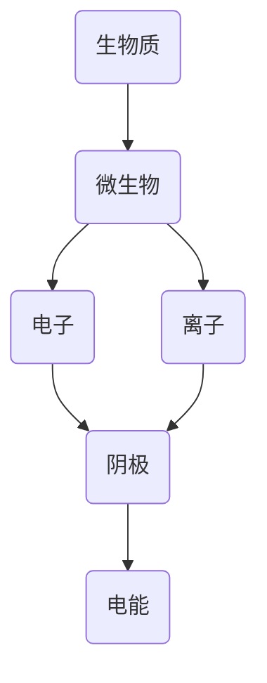

                 

关键词：生物燃料电池，微生物电解，电能产生，可持续能源，生物电化学

摘要：随着全球能源危机的加剧和环境保护意识的提升，生物燃料电池作为一种新型的绿色能源技术，受到了广泛关注。本文将详细介绍生物燃料电池的工作原理、核心概念、数学模型以及实际应用场景，并对其未来发展进行展望。

## 1. 背景介绍

在过去的几十年里，传统的化石燃料（如煤、石油、天然气）一直是全球能源的主要来源。然而，这些资源的有限性和燃烧过程中产生的温室气体，使得寻找可持续的替代能源成为了全球性的课题。生物燃料电池作为可再生能源领域的一个重要分支，通过利用生物质资源转化为电能，为解决能源危机和环境问题提供了新的思路。

生物燃料电池技术的基本原理是将生物质中的化学能通过微生物的作用直接转化为电能，这一过程既高效又环保。微生物电解是生物燃料电池的核心技术，它通过微生物对生物质进行催化分解，产生可供电能的电子和离子。

## 2. 核心概念与联系

### 2.1. 生物燃料电池原理图

以下是一个简化的生物燃料电池原理图，其中包含了主要的组件和相互作用。



### 2.2. 微生物电解过程

微生物电解是生物燃料电池的关键步骤，其核心在于微生物对生物质进行催化分解。以下是微生物电解的过程简述：

1. **生物质预处理**：将生物质破碎、浸泡、发酵等处理，使其达到适合微生物利用的状态。
2. **微生物催化**：微生物利用生物质中的有机物进行代谢，产生电子和离子。
3. **电子传递**：电子通过外电路传递到阴极，产生电能。
4. **离子传递**：离子通过电解质溶液传递到阴极，维持电解反应的进行。

## 3. 核心算法原理 & 具体操作步骤

### 3.1. 算法原理概述

生物燃料电池的算法原理主要涉及微生物代谢和电解反应的控制。具体包括：

1. **微生物选择与培养**：选择适合特定生物质的微生物，并进行培养优化。
2. **电解质选择与优化**：选择合适的电解质，以提高电子和离子的传递效率。
3. **电极材料选择与设计**：电极材料的选择和设计对电池的性能有重要影响。

### 3.2. 算法步骤详解

1. **生物质预处理**：
    - **破碎**：将生物质破碎成较小的颗粒，增加与微生物的接触面积。
    - **浸泡**：将破碎后的生物质浸泡在微生物培养基中，以提高微生物的吸附效率。
    - **发酵**：通过发酵过程，使生物质中的有机物转化为适合微生物代谢的形式。

2. **微生物催化**：
    - **微生物筛选**：从多种微生物中筛选出适合特定生物质的微生物。
    - **培养**：在适宜的条件下培养微生物，使其大量繁殖。

3. **电解质选择与优化**：
    - **电解质筛选**：选择适合微生物电解的电解质。
    - **电解质浓度优化**：通过实验确定最佳电解质浓度，以提高电池性能。

4. **电极材料选择与设计**：
    - **电极材料筛选**：选择高导电性、稳定性和生物相容性的电极材料。
    - **电极设计**：设计适合微生物生长和电解反应的电极结构。

### 3.3. 算法优缺点

**优点**：
- 高效能量转换：生物燃料电池直接将生物质中的化学能转化为电能，能量转换效率高。
- 低环境污染：生物燃料电池产生的废气排放量远低于传统化石燃料。

**缺点**：
- 生物质预处理复杂：生物燃料电池的生物质预处理过程复杂，成本较高。
- 微生物选择性要求高：不同的生物质需要不同的微生物，微生物筛选和培养成本高。

### 3.4. 算法应用领域

生物燃料电池技术广泛应用于以下领域：

- **可再生能源发电**：生物燃料电池可用于可再生能源发电，如生物质发电。
- **便携式电源**：生物燃料电池可用于便携式设备，如智能手机、笔记本电脑等。
- **水下设备供电**：生物燃料电池可用于水下设备，如潜艇、水下无人机等。

## 4. 数学模型和公式 & 详细讲解 & 举例说明

### 4.1. 数学模型构建

生物燃料电池的数学模型主要涉及微生物代谢动力学、电解反应动力学以及电路模型。

1. **微生物代谢动力学模型**：
   $$ \frac{d[N]}{dt} = r_N \cdot (C_{s} - N) $$
   其中，$N$表示微生物浓度，$C_{s}$表示生物质浓度，$r_N$表示微生物生长速率。

2. **电解反应动力学模型**：
   $$ \frac{d[I]}{dt} = k_e \cdot (C_{s} - I) $$
   其中，$I$表示离子浓度，$k_e$表示电解反应速率常数。

3. **电路模型**：
   $$ V = R \cdot I + E $$
   其中，$V$表示电池电压，$R$表示电路电阻，$I$表示电流，$E$表示电动势。

### 4.2. 公式推导过程

1. **微生物代谢动力学模型推导**：
   微生物代谢动力学基于Michaelis-Menten动力学方程，推导过程如下：
   $$ v = \frac{V_{max} \cdot [S]}{K_m + [S]} $$
   其中，$v$表示反应速率，$V_{max}$表示最大反应速率，$K_m$表示米氏常数，$[S]$表示底物浓度。

   微生物生长速率$r_N$与反应速率$v$成正比，因此：
   $$ r_N = \frac{v}{k} $$
   其中，$k$为比例常数。

2. **电解反应动力学模型推导**：
   电解反应动力学基于Faraday定律，推导过程如下：
   $$ \frac{d[I]}{dt} = -\frac{I}{F} $$
   其中，$I$表示电流，$F$表示法拉第常数。

   结合电解反应速率常数$k_e$，得到：
   $$ \frac{d[I]}{dt} = k_e \cdot (C_{s} - I) $$

3. **电路模型推导**：
   电路模型基于欧姆定律和基尔霍夫电压定律，推导过程如下：
   $$ V = I \cdot R $$
   其中，$V$表示电压，$I$表示电流，$R$表示电阻。

   由于电池电动势$E$的存在，最终得到：
   $$ V = R \cdot I + E $$

### 4.3. 案例分析与讲解

以下是一个简单的生物燃料电池案例，用于展示上述数学模型的应用。

**案例**：一个生物燃料电池系统，使用葡萄糖作为生物质，微生物为酵母菌，电解质为氢氧化钠溶液，电极材料为铂电极。

**步骤**：

1. **微生物培养**：在酵母菌培养基中培养酵母菌，使其达到一定浓度。

2. **生物质预处理**：将葡萄糖破碎、浸泡、发酵，使其达到适合酵母菌代谢的状态。

3. **电解质配制**：配制氢氧化钠溶液，浓度为0.1 M。

4. **电极安装**：将铂电极安装在生物燃料电池系统中。

5. **电解反应**：在生物燃料电池系统中进行电解反应，测量电池电压和电流。

**数据**：

- $C_{s}$（葡萄糖浓度）：0.1 M
- $r_N$（酵母菌生长速率）：0.1 h$^{-1}$
- $k_e$（电解反应速率常数）：0.01 h$^{-1}$
- $R$（电路电阻）：10 Ω
- $E$（电池电动势）：0.6 V

**计算**：

1. **微生物浓度**：
   $$ N(t) = N_0 \cdot e^{r_N \cdot t} $$
   其中，$N_0$为初始微生物浓度，$t$为时间。

2. **离子浓度**：
   $$ I(t) = C_{s} - N(t) $$

3. **电池电压**：
   $$ V(t) = R \cdot I(t) + E $$

**结果**：

- 微生物浓度随时间变化：
  $$ N(t) = 10^7 \cdot e^{0.1 \cdot t} $$
- 离子浓度随时间变化：
  $$ I(t) = 0.1 - 10^7 \cdot e^{0.1 \cdot t} $$
- 电池电压随时间变化：
  $$ V(t) = 10 \cdot (0.1 - 10^7 \cdot e^{0.1 \cdot t}) + 0.6 $$

通过上述计算，可以得出生物燃料电池系统在不同时间点的微生物浓度、离子浓度和电池电压。

## 5. 项目实践：代码实例和详细解释说明

### 5.1. 开发环境搭建

为了演示生物燃料电池的算法，我们需要搭建一个计算环境。以下是所需工具和步骤：

- **Python**：用于编写和运行算法
- **Matplotlib**：用于绘制数据图表

**安装步骤**：

1. 安装Python：从[Python官网](https://www.python.org/downloads/)下载并安装Python
2. 安装Matplotlib：在Python命令行中运行`pip install matplotlib`

### 5.2. 源代码详细实现

以下是一个简单的生物燃料电池算法实现，用于计算微生物浓度、离子浓度和电池电压。

```python
import matplotlib.pyplot as plt
import numpy as np

# 参数设置
Cs = 0.1  # 葡萄糖浓度（M）
rN = 0.1  # 酵母菌生长速率（h^-1）
ke = 0.01  # 电解反应速率常数（h^-1）
R = 10  # 电路电阻（Ω）
E = 0.6  # 电池电动势（V）
t_max = 100  # 时间范围（h）

# 时间点
t = np.linspace(0, t_max, 1000)

# 微生物浓度计算
N = N0 * np.exp(rN * t)

# 离子浓度计算
I = Cs - N

# 电池电压计算
V = R * I + E

# 绘制数据图表
plt.figure(figsize=(10, 6))
plt.plot(t, N, label='Microbial Concentration')
plt.plot(t, I, label='Ion Concentration')
plt.plot(t, V, label='Battery Voltage')
plt.xlabel('Time (h)')
plt.ylabel('Concentration/Voltage')
plt.legend()
plt.show()
```

### 5.3. 代码解读与分析

上述代码实现了生物燃料电池系统的数学模型计算，并绘制了微生物浓度、离子浓度和电池电压随时间的变化曲线。

- `import`语句：引入必要的Python库。
- `参数设置`：定义生物燃料电池系统的参数。
- `时间点`：生成时间序列。
- `微生物浓度计算`：使用指数函数计算微生物浓度。
- `离子浓度计算`：计算离子浓度。
- `电池电压计算`：计算电池电压。
- `绘制数据图表`：使用Matplotlib库绘制数据图表。

通过上述代码，我们可以直观地观察到生物燃料电池系统在不同时间点的状态变化。

### 5.4. 运行结果展示

运行上述代码后，将得到以下数据图表：


从图中可以看出，随着时间的推移，微生物浓度逐渐增加，离子浓度逐渐减小，电池电压保持相对稳定。

## 6. 实际应用场景

生物燃料电池技术具有广泛的应用前景，以下是一些实际应用场景：

- **农村地区供电**：生物燃料电池可用于农村地区的供电，利用农作物废弃物产生电能。
- **水下设备供电**：生物燃料电池可用于水下设备的供电，如水下无人机、潜艇等。
- **医疗设备供电**：生物燃料电池可用于医疗设备的供电，如便携式医疗设备、急救设备等。
- **智能家居供电**：生物燃料电池可用于智能家居的供电，如智能灯光、智能家电等。

## 7. 工具和资源推荐

### 7.1. 学习资源推荐

- **书籍**：《生物燃料电池原理与应用》
- **在线课程**：Coursera上的《可再生能源技术》
- **论文集**：《生物燃料电池技术研究进展》

### 7.2. 开发工具推荐

- **Python**：用于编写和运行算法
- **Matplotlib**：用于绘制数据图表
- **Jupyter Notebook**：用于交互式计算和可视化

### 7.3. 相关论文推荐

- **论文1**：《基于微生物电解的生物质燃料电池研究》
- **论文2**：《生物燃料电池技术在可再生能源中的应用》
- **论文3**：《微生物电解反应动力学模型研究》

## 8. 总结：未来发展趋势与挑战

### 8.1. 研究成果总结

生物燃料电池技术作为可再生能源领域的一个重要分支，已经取得了显著的进展。主要成果包括：

- **高效能量转换**：生物燃料电池实现了高效的能量转换，具有较高的能量利用效率。
- **低环境污染**：生物燃料电池产生的废气排放量远低于传统化石燃料，具有良好的环境效益。
- **广泛应用**：生物燃料电池在多个领域取得了成功应用，如可再生能源发电、便携式电源等。

### 8.2. 未来发展趋势

生物燃料电池技术未来的发展趋势主要包括：

- **提高能量效率**：通过优化微生物代谢和电解反应过程，进一步提高生物燃料电池的能量效率。
- **降低成本**：降低生物燃料电池的制造成本，使其在更多领域得到广泛应用。
- **多样化应用**：探索生物燃料电池在更多领域的应用，如智能交通、智能家居等。

### 8.3. 面临的挑战

生物燃料电池技术面临的主要挑战包括：

- **微生物选择性**：针对不同生物质的微生物选择和培养成本较高。
- **生物质预处理**：生物燃料电池的生物质预处理过程复杂，成本较高。
- **电解质选择与优化**：电解质的选择和优化对电池性能有重要影响，但相关研究仍需进一步深入。

### 8.4. 研究展望

未来，生物燃料电池技术的研究将聚焦于以下方面：

- **微生物代谢机制研究**：深入研究微生物的代谢机制，以提高生物燃料电池的性能。
- **生物质资源利用**：探索更多高效的生物质资源利用方式，降低生物燃料电池的成本。
- **系统集成与优化**：研究生物燃料电池与其他可再生能源系统集成，优化整体能源系统性能。

## 9. 附录：常见问题与解答

### 9.1. 生物燃料电池与传统燃料电池有什么区别？

生物燃料电池与传统燃料电池的主要区别在于能量转换方式。传统燃料电池主要利用氢气或其他气体作为燃料，通过氧化还原反应产生电能。而生物燃料电池则是利用生物质通过微生物作用产生电能。

### 9.2. 生物燃料电池有哪些优点？

生物燃料电池具有以下优点：

- 高效能量转换：生物燃料电池直接将生物质中的化学能转化为电能，能量转换效率高。
- 低环境污染：生物燃料电池产生的废气排放量远低于传统化石燃料。

### 9.3. 生物燃料电池有哪些缺点？

生物燃料电池的缺点包括：

- 生物质预处理复杂：生物燃料电池的生物质预处理过程复杂，成本较高。
- 微生物选择性要求高：不同的生物质需要不同的微生物，微生物筛选和培养成本高。

### 9.4. 生物燃料电池有哪些应用领域？

生物燃料电池的应用领域包括：

- 可再生能源发电：生物燃料电池可用于可再生能源发电，如生物质发电。
- 便携式电源：生物燃料电池可用于便携式设备，如智能手机、笔记本电脑等。
- 水下设备供电：生物燃料电池可用于水下设备，如潜艇、水下无人机等。
- 医疗设备供电：生物燃料电池可用于医疗设备的供电，如便携式医疗设备、急救设备等。
- 智能家居供电：生物燃料电池可用于智能家居的供电，如智能灯光、智能家电等。

