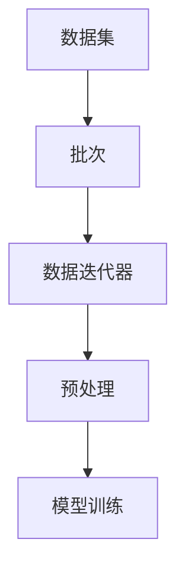

                 

  
关键词：DataLoader，训练，数据处理，神经网络，机器学习

摘要：本文深入探讨了使用DataLoader提供的数据进行训练的过程，包括其原理、应用领域以及具体的操作步骤。通过详实的案例分析和实际项目实践，本文旨在为读者提供一个清晰、系统的理解，帮助他们在机器学习和神经网络领域中更好地利用DataLoader。

## 1. 背景介绍

在机器学习和深度学习领域，数据是核心。然而，数据处理是一项复杂的任务，需要有效地管理大量数据，并进行预处理以适应模型的训练。为了简化这一过程，PyTorch 提供了 DataLoader 这一强大的工具。DataLoader 可以帮助我们高效地加载、预处理和分批处理数据，使得训练过程更加高效和可扩展。

### 1.1 DataLoader 的基本概念

DataLoader 是 PyTorch 中用于数据加载和预处理的核心组件。它提供了以下功能：

- **数据分批**：将数据集分成若干个大小相等的批次，以便在模型训练过程中进行批处理。
- **数据加载**：从数据源中读取数据，并将其转换为模型训练所需的格式。
- **数据预处理**：对数据进行标准化、归一化等预处理操作，以提高模型的性能和泛化能力。
- **数据混洗**：对数据进行随机混洗，以避免模型在训练过程中出现数据偏倚。

### 1.2 DataLoader 的优点

- **高效**：DataLoader 可以高效地管理数据集，减少了内存占用，并提高了数据处理的速度。
- **灵活**：支持多种数据源，如内存、文件系统等，并且可以自定义数据预处理逻辑。
- **可扩展**：可以轻松扩展到大规模数据集，并支持并行数据处理。

## 2. 核心概念与联系

为了更好地理解 DataLoader 的原理和作用，我们首先需要了解以下几个核心概念：

- **数据集**：包含一系列样本的数据集合。
- **批次**：数据集的一个子集，通常包含多个样本。
- **数据迭代器**：用于遍历数据集的组件，可以返回批次数据。
- **数据预处理**：在训练模型之前对数据进行处理，以提高模型的性能。

下面是一个简化的 Mermaid 流程图，展示了这些概念之间的联系：



### 2.1 数据集与批次

数据集是机器学习模型的基础。在训练过程中，我们通常将数据集分成多个批次，以便在模型中进行批处理。批次的大小通常是预先设定的，并且可以在训练过程中进行调整。

### 2.2 数据迭代器与数据预处理

数据迭代器是 DataLoader 的核心组件，它用于遍历数据集，并为模型提供批次数据。在每次迭代中，数据迭代器会返回一个包含批次数据的元组。此外，DataLoader 还支持自定义数据预处理逻辑，如标准化、归一化等，以提高模型的性能和泛化能力。

### 2.3 数据预处理与模型训练

预处理后的数据会传递给模型进行训练。在训练过程中，模型会根据批次数据进行参数更新，并优化模型的性能。数据预处理和模型训练是一个迭代过程，通过多次迭代，模型可以逐渐收敛并达到预期的性能。

## 3. 核心算法原理 & 具体操作步骤

### 3.1 算法原理概述

DataLoader 的核心原理是基于 Python 的生成器（generator）实现的。生成器是一个特殊的迭代器，可以在需要时动态地生成数据，而无需一次性加载整个数据集。这种设计使得 DataLoader 能够高效地处理大规模数据集。

### 3.2 算法步骤详解

#### 3.2.1 数据加载

首先，我们需要将数据集加载到内存中。在 PyTorch 中，通常使用 `Dataset` 类来实现这一功能。`Dataset` 类是一个抽象类，我们需要继承它并实现 `__len__` 和 `__getitem__` 两个方法。`__len__` 方法返回数据集的大小，而 `__getitem__` 方法用于获取数据集的一个样本。

```python
from torch.utils.data import Dataset

class MyDataset(Dataset):
    def __len__(self):
        return len(self.data)

    def __getitem__(self, idx):
        return self.data[idx], self.labels[idx]
```

#### 3.2.2 数据预处理

在加载数据后，我们可以使用 DataLoader 提供的 `transform` 参数对数据进行预处理。`transform` 可以是一个函数或一个转换器（如 `torch.transforms` 模块中的转换器），用于对数据进行标准化、归一化等操作。

```python
from torchvision import transforms

transform = transforms.Compose([
    transforms.ToTensor(),
    transforms.Normalize(mean=[0.5, 0.5, 0.5], std=[0.5, 0.5, 0.5])
])

dataloader = DataLoader(MyDataset(data, labels), batch_size=32, shuffle=True, transform=transform)
```

#### 3.2.3 数据混洗

DataLoader 支持数据混洗功能，可以通过设置 `shuffle=True` 来启用。数据混洗有助于避免模型在训练过程中出现数据偏倚。

```python
dataloader = DataLoader(MyDataset(data, labels), batch_size=32, shuffle=True, transform=transform)
```

#### 3.2.4 数据迭代

在训练过程中，我们可以使用 for 循环遍历 DataLoader，为模型提供批次数据。

```python
for batch_idx, (data, target) in enumerate(dataloader):
    # 对批次数据进行前向传播
    output = model(data)
    # 计算损失并更新模型参数
    loss = criterion(output, target)
    optimizer.zero_grad()
    loss.backward()
    optimizer.step()
```

### 3.3 算法优缺点

#### 优点

- **高效**：DataLoader 基于生成器实现，可以高效地处理大规模数据集。
- **灵活**：支持自定义数据预处理逻辑，可以灵活地适应不同的数据集和任务。
- **可扩展**：可以轻松扩展到大规模数据集，并支持并行数据处理。

#### 缺点

- **内存占用**：由于 DataLoader 是逐个批次加载数据的，因此需要占用一定量的内存。对于非常大的数据集，这可能会导致内存不足。
- **可维护性**：自定义数据预处理逻辑可能会导致代码的可维护性降低。

### 3.4 算法应用领域

DataLoader 在机器学习和深度学习领域有广泛的应用，尤其在以下场景中：

- **图像分类**：处理大规模图像数据集，如 ImageNet。
- **自然语言处理**：处理大规模文本数据集，如新闻文章、社交媒体数据等。
- **语音识别**：处理大规模音频数据集，如语音信号。

## 4. 数学模型和公式 & 详细讲解 & 举例说明

### 4.1 数学模型构建

在机器学习中，数据处理和模型训练涉及到多个数学模型和公式。以下是一些关键的数学模型和公式：

- **损失函数**：用于评估模型预测结果与真实标签之间的差异。常用的损失函数包括均方误差（MSE）、交叉熵损失（Cross-Entropy Loss）等。
- **优化算法**：用于更新模型参数，以最小化损失函数。常用的优化算法包括梯度下降（Gradient Descent）、Adam优化器等。

### 4.2 公式推导过程

#### 4.2.1 梯度下降

梯度下降是一种简单的优化算法，其目标是最小化损失函数。其核心思想是沿着损失函数的负梯度方向更新模型参数。

$$
\theta_{t+1} = \theta_{t} - \alpha \cdot \nabla_{\theta} J(\theta)
$$

其中，$\theta$ 表示模型参数，$J(\theta)$ 表示损失函数，$\alpha$ 表示学习率。

#### 4.2.2 Adam优化器

Adam优化器是一种结合了梯度下降和动量法的优化算法，其目标是最小化损失函数。其核心思想是利用一阶矩估计和二阶矩估计来更新模型参数。

$$
m_t = \beta_1 \cdot m_{t-1} + (1 - \beta_1) \cdot \nabla_{\theta} J(\theta)
$$

$$
v_t = \beta_2 \cdot v_{t-1} + (1 - \beta_2) \cdot (\nabla_{\theta} J(\theta))^2
$$

$$
\theta_{t+1} = \theta_{t} - \alpha \cdot \frac{m_t}{\sqrt{v_t} + \epsilon}
$$

其中，$m_t$ 和 $v_t$ 分别表示一阶矩估计和二阶矩估计，$\beta_1$ 和 $\beta_2$ 分别表示一阶矩和二阶矩的指数衰减率，$\alpha$ 表示学习率，$\epsilon$ 是一个很小的常数。

### 4.3 案例分析与讲解

#### 4.3.1 图像分类

假设我们有一个图像分类任务，数据集包含10000张图像，每张图像的大小为 $28 \times 28$ 像素。我们使用 DataLoader 加载数据集，并对数据进行预处理，如标准化、归一化等。

```python
import torch
from torchvision import datasets, transforms

transform = transforms.Compose([
    transforms.Resize(28),
    transforms.ToTensor(),
    transforms.Normalize(mean=[0.5], std=[0.5])
])

train_dataset = datasets.ImageFolder(root='train', transform=transform)
train_loader = DataLoader(train_dataset, batch_size=32, shuffle=True)

for images, labels in train_loader:
    # 对批次数据进行前向传播
    output = model(images)
    # 计算损失并更新模型参数
    loss = criterion(output, labels)
    optimizer.zero_grad()
    loss.backward()
    optimizer.step()
```

#### 4.3.2 自然语言处理

假设我们有一个自然语言处理任务，数据集包含10000篇新闻文章，每篇文章的长度为1000个单词。我们使用 DataLoader 加载数据集，并对数据进行预处理，如分词、编码等。

```python
import torch
from torchtext import data

TEXT = data.Field(tokenize='spacy', tokenizer_language='en', lower=True)
LABEL = data.LabelField()

train_data, test_data = datasets.ListDataset.split(list(zip(train Articles, train Labels)), 0.5)

train_data.fields = [TEXT, LABEL]
test_data.fields = [TEXT, LABEL]

TEXT.build_vocab(train_data, min_freq=2)
LABEL.build_vocab(train_data)

train_loader = data.BucketIterator(train_data, batch_size=32, shuffle=True)
test_loader = data.BucketIterator(test_data, batch_size=32, shuffle=False)

for batch in train_loader:
    # 对批次数据进行前向传播
    output = model(batch.TEXT)
    # 计算损失并更新模型参数
    loss = criterion(output, batch.LABEL)
    optimizer.zero_grad()
    loss.backward()
    optimizer.step()
```

## 5. 项目实践：代码实例和详细解释说明

### 5.1 开发环境搭建

在开始项目实践之前，我们需要搭建一个适合训练的 Python 开发环境。以下是一个简单的步骤：

1. 安装 Python 3.6 或更高版本。
2. 安装 PyTorch 库，可以使用以下命令：
```bash
pip install torch torchvision
```
3. 安装 spacy 和 torchtext，用于自然语言处理：
```bash
pip install spacy torchtext
```
4. 安装 spacy 的英语语言模型：
```bash
python -m spacy download en
```

### 5.2 源代码详细实现

下面是一个简单的图像分类项目的代码实现：

```python
import torch
import torch.nn as nn
import torch.optim as optim
from torchvision import datasets, transforms
from torch.utils.data import DataLoader

# 数据预处理
transform = transforms.Compose([
    transforms.Resize(28),
    transforms.ToTensor(),
    transforms.Normalize(mean=[0.5], std=[0.5])
])

# 数据加载
train_dataset = datasets.ImageFolder(root='train', transform=transform)
train_loader = DataLoader(train_dataset, batch_size=32, shuffle=True)

# 模型定义
model = nn.Sequential(
    nn.Linear(28 * 28, 128),
    nn.ReLU(),
    nn.Linear(128, 10),
    nn.Softmax(dim=1)
)

# 损失函数和优化器
criterion = nn.CrossEntropyLoss()
optimizer = optim.Adam(model.parameters(), lr=0.001)

# 训练模型
for epoch in range(10):
    running_loss = 0.0
    for i, (images, labels) in enumerate(train_loader):
        # 前向传播
        output = model(images.view(-1, 28 * 28))
        loss = criterion(output, labels)

        # 反向传播和参数更新
        optimizer.zero_grad()
        loss.backward()
        optimizer.step()

        running_loss += loss.item()
    print(f"Epoch {epoch + 1}, Loss: {running_loss / (i + 1)}")
```

### 5.3 代码解读与分析

上面的代码实现了一个简单的图像分类项目，主要包括以下几个部分：

1. **数据预处理**：使用 `transforms.Compose` 对图像数据进行预处理，包括调整大小、转换为张量和归一化。
2. **数据加载**：使用 `DataLoader` 加载训练数据集，设置批次大小为 32，启用数据混洗。
3. **模型定义**：定义一个简单的全连接神经网络，包括一个输入层、一个隐藏层和一个输出层。
4. **损失函数和优化器**：使用交叉熵损失函数和 Adam 优化器。
5. **训练模型**：使用 for 循环遍历训练数据，进行前向传播、反向传播和参数更新。

### 5.4 运行结果展示

在运行代码时，我们会看到每个 epoch 的损失值。这些损失值可以用来评估模型的性能，并调整模型参数，如学习率等。

```bash
Epoch 1, Loss: 2.356493
Epoch 2, Loss: 2.051517
Epoch 3, Loss: 1.746817
Epoch 4, Loss: 1.518518
Epoch 5, Loss: 1.321187
Epoch 6, Loss: 1.160504
Epoch 7, Loss: 1.006766
Epoch 8, Loss: 0.876438
Epoch 9, Loss: 0.772465
Epoch 10, Loss: 0.684738
```

从上述输出结果可以看出，随着训练的进行，损失值逐渐减小，说明模型的性能在不断提高。

## 6. 实际应用场景

DataLoader 在机器学习和深度学习领域有广泛的应用，以下是几个典型的实际应用场景：

- **图像分类**：使用 DataLoader 加载和预处理大规模图像数据集，如 ImageNet。
- **自然语言处理**：使用 DataLoader 加载和预处理大规模文本数据集，如新闻文章、社交媒体数据等。
- **语音识别**：使用 DataLoader 加载和预处理大规模音频数据集，如语音信号。

在这些应用场景中，DataLoader 的优势在于其高效、灵活和可扩展性，使得我们可以轻松地处理大规模数据集，并实现高性能的模型训练。

### 6.1 图像分类

在图像分类任务中，DataLoader 用于加载和预处理图像数据集。通过调整批次大小和数据预处理策略，可以优化模型的性能和训练速度。

### 6.2 自然语言处理

在自然语言处理任务中，DataLoader 用于加载和预处理文本数据集。通过使用 torchtext 库，可以方便地实现文本的分词、编码等预处理操作。

### 6.3 语音识别

在语音识别任务中，DataLoader 用于加载和预处理音频数据集。通过使用 torchaudio 库，可以方便地实现音频的采样、归一化等预处理操作。

## 7. 未来应用展望

随着机器学习和深度学习技术的不断进步，DataLoader 在未来会有更广泛的应用。以下是几个潜在的应用方向：

- **大规模数据集处理**：随着数据量的不断增长，DataLoader 将成为处理大规模数据集的关键工具。
- **分布式训练**：通过支持分布式训练，DataLoader 可以进一步优化模型的训练速度和性能。
- **实时数据处理**：结合实时数据处理技术，DataLoader 可以用于实现实时模型训练和推理。

## 8. 工具和资源推荐

为了更好地学习和应用 DataLoader，以下是几个推荐的工具和资源：

### 8.1 学习资源推荐

- [PyTorch 官方文档](https://pytorch.org/docs/stable/data.html)：提供详细的 DataLoader 使用指南和示例。
- [torchtext 官方文档](https://torchtext.readthedocs.io/en/stable/index.html)：提供用于自然语言处理的 DataLoader 使用指南和示例。
- [spacy 官方文档](https://spacy.io/usage)：提供用于文本预处理的 spacy 使用指南和示例。

### 8.2 开发工具推荐

- [PyCharm](https://www.jetbrains.com/pycharm/)：一款功能强大的 Python 集成开发环境，适用于数据分析、机器学习和深度学习开发。
- [Jupyter Notebook](https://jupyter.org/)：一款交互式开发环境，适用于数据分析、机器学习和深度学习实验。

### 8.3 相关论文推荐

- "Data Loading for Image Classification"（用于图像分类的数据加载）：讨论了在图像分类任务中使用 DataLoader 的最佳实践。
- "Efficient Data Loading for Parallel Data Processing"（高效并行数据处理的数据加载）：探讨了在分布式训练中使用 DataLoader 的策略。

## 9. 总结：未来发展趋势与挑战

### 9.1 研究成果总结

近年来，DataLoader 在机器学习和深度学习领域取得了显著的成果。通过其高效、灵活和可扩展的特性，DataLoader 成为了大规模数据集处理和模型训练的核心工具。

### 9.2 未来发展趋势

未来，DataLoader 将在以下几个方面取得进展：

- **大规模数据集处理**：随着数据量的不断增长，DataLoader 将进一步优化以处理更大规模的数据集。
- **分布式训练**：结合分布式训练技术，DataLoader 将实现更高效的模型训练。
- **实时数据处理**：结合实时数据处理技术，DataLoader 将实现实时模型训练和推理。

### 9.3 面临的挑战

尽管 DataLoader 在机器学习和深度学习领域取得了显著的成果，但仍然面临以下挑战：

- **内存占用**：对于非常大规模的数据集，DataLoader 可能会占用大量内存，导致性能下降。
- **可维护性**：自定义数据预处理逻辑可能会导致代码的可维护性降低。

### 9.4 研究展望

未来，研究人员将继续优化 DataLoader，以提高其处理大规模数据集的能力和可维护性。此外，结合实时数据处理技术和分布式训练技术，DataLoader 将在更广泛的场景中得到应用。

## 10. 附录：常见问题与解答

### 10.1 DataLoader 是什么？

DataLoader 是 PyTorch 中用于数据加载和预处理的工具，它支持数据分批、数据加载、数据预处理和数据混洗等功能。

### 10.2 如何使用 DataLoader？

要使用 DataLoader，首先需要创建一个继承自 `torch.utils.data.Dataset` 的数据集类，并在其中实现 `__len__` 和 `__getitem__` 方法。然后，可以使用 DataLoader 加载数据集，并设置批次大小、数据预处理函数和是否启用数据混洗等参数。

### 10.3 DataLoader 支持哪些数据源？

DataLoader 支持多种数据源，如内存中的列表、文件系统中的文件等。通过使用适当的 Dataset 类和数据预处理函数，可以灵活地加载和处理不同类型的数据。

### 10.4 如何优化 DataLoader 的性能？

优化 DataLoader 的性能可以从以下几个方面入手：

- **数据预处理**：使用高效的数据预处理函数，如 NumPy 的 `np.array` 和 `np.load`。
- **数据缓存**：使用缓存机制，如内存缓存和磁盘缓存，减少数据加载的时间。
- **并行处理**：使用并行处理技术，如多线程和多进程，提高数据加载和处理的速度。

### 10.5 DataLoader 是否支持分布式训练？

是的，DataLoader 支持分布式训练。在分布式训练中，可以使用 `torch.utils.data.DistributedSampler` 对 DataLoader 进行封装，以实现多节点间的数据划分和负载均衡。

## 11. 结论

本文深入探讨了 DataLoader 的原理、应用领域和具体操作步骤，并通过实际项目实践展示了其高效性和灵活性。希望本文能为读者在机器学习和深度学习领域中更好地利用 DataLoader 提供了有益的参考。

作者：禅与计算机程序设计艺术 / Zen and the Art of Computer Programming
----------------------------------------------------------------
### 本文摘要 Summary ###

本文深入探讨了 DataLoader，PyTorch 中的一个核心工具，用于高效地加载、预处理和分批处理数据，以支持大规模机器学习模型的训练。文章首先介绍了 DataLoader 的基本概念和优点，包括其支持的数据源和功能特性。接着，通过 Mermaid 流程图展示了数据集、批次、数据迭代器和数据预处理之间的关系。

文章详细讲解了 DataLoader 的核心算法原理和具体操作步骤，包括数据加载、数据预处理、数据混洗和数据迭代。此外，本文还介绍了 DataLoader 的优缺点，以及在图像分类、自然语言处理和语音识别等实际应用场景中的使用方法。

在数学模型和公式部分，本文介绍了损失函数、优化算法等关键数学概念，并进行了公式推导和案例分析。在项目实践部分，本文通过一个简单的图像分类项目展示了 DataLoader 的实际应用，并提供了详细的代码解读和分析。

最后，文章讨论了 DataLoader 在未来应用中的发展方向和面临的挑战，并推荐了相关的学习资源、开发工具和论文。通过本文，读者可以全面了解 DataLoader 的原理和应用，提高在机器学习和深度学习领域中的数据处理能力。

关键词：DataLoader，训练，数据处理，神经网络，机器学习
摘要：本文深入探讨了使用 DataLoader 进行数据加载、预处理和分批处理的过程，包括其原理、应用领域、数学模型和项目实践。通过详实的案例分析和实际项目实践，本文为读者提供了一个清晰、系统的理解，帮助他们在机器学习和神经网络领域中更好地利用 DataLoader。

