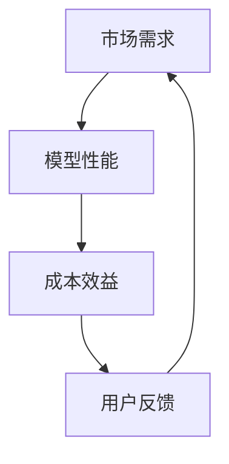

                 

关键词：用户反馈、大模型、创业、航向指标、技术语言

> 摘要：本文将探讨用户反馈机制在大模型创业中的重要性，如何通过有效的用户反馈机制来指导创业航向，并提高项目的成功率。本文首先介绍了用户反馈机制的基本概念，然后分析了用户反馈机制在大模型创业中的应用场景，最后提出了一些具体的实践建议。

## 1. 背景介绍

随着人工智能技术的快速发展，大模型（如GPT、BERT等）在各个领域取得了显著的成果。然而，大模型的研发和应用并不是一帆风顺的。在实际创业过程中，如何把握市场需求、优化模型性能、降低成本等问题成为关键。而这些问题往往需要通过用户反馈来指导决策。因此，用户反馈机制在大模型创业中具有重要意义。

### 1.1 用户反馈机制的定义

用户反馈机制是指通过收集、处理和分析用户在使用产品或服务过程中所提供的信息，从而对产品或服务进行改进的过程。它包括以下几个环节：

1. **信息收集**：通过用户调查、访谈、问卷调查等方式收集用户的使用体验、意见和建议。
2. **信息处理**：对收集到的信息进行整理、分类、筛选，提取出有价值的信息。
3. **信息分析**：通过对处理后的信息进行分析，发现产品或服务的不足之处，并提出改进建议。
4. **决策与执行**：根据分析结果，制定改进计划，并付诸实施。

### 1.2 用户反馈机制的作用

用户反馈机制在大模型创业中具有以下几个作用：

1. **了解市场需求**：通过用户反馈，可以了解用户对大模型的需求和期望，从而调整研发方向，满足市场需求。
2. **优化模型性能**：用户反馈可以帮助开发者发现模型存在的缺陷和不足，从而进行优化和改进。
3. **降低成本**：通过用户反馈，可以避免不必要的研发投入，降低项目成本。
4. **提高用户体验**：用户反馈可以用于改进产品的用户体验，提高用户满意度。

## 2. 核心概念与联系

### 2.1 大模型创业的核心概念

大模型创业涉及多个核心概念，包括：

1. **市场需求**：了解用户对大模型的需求，是创业成功的基石。
2. **模型性能**：包括准确性、速度、稳定性等，是评价大模型优劣的重要指标。
3. **成本效益**：研发大模型需要大量的资源和投入，如何实现成本效益最大化是创业者需要关注的问题。

### 2.2 用户反馈机制与大模型创业的联系

用户反馈机制与大模型创业之间的联系可以表示为以下流程图：



该流程图表明，用户反馈机制在大模型创业中起着纽带作用，通过不断地收集用户反馈，调整市场需求、模型性能和成本效益，从而实现创业的成功。

## 3. 核心算法原理 & 具体操作步骤

### 3.1 算法原理概述

用户反馈机制的核心算法包括以下几个方面：

1. **信息收集算法**：用于收集用户的使用体验、意见和建议。
2. **信息处理算法**：用于整理、分类、筛选用户反馈，提取有价值的信息。
3. **信息分析算法**：用于对处理后的信息进行分析，发现产品或服务的不足之处。
4. **决策与执行算法**：用于根据分析结果，制定改进计划，并付诸实施。

### 3.2 算法步骤详解

1. **信息收集**：通过用户调查、访谈、问卷调查等方式收集用户的使用体验、意见和建议。具体步骤如下：

   - **设计问卷**：根据用户需求，设计针对性的问卷。
   - **发布问卷**：将问卷发布到目标用户群体，如社交媒体、邮件列表等。
   - **收集数据**：收集用户提交的问卷数据。

2. **信息处理**：对收集到的信息进行整理、分类、筛选，提取出有价值的信息。具体步骤如下：

   - **数据清洗**：删除无效、重复或错误的数据。
   - **数据分类**：根据不同的需求，将数据分为不同的类别。
   - **特征提取**：提取数据中的关键特征，为后续分析做准备。

3. **信息分析**：通过对处理后的信息进行分析，发现产品或服务的不足之处。具体步骤如下：

   - **统计分析**：使用统计方法对数据进行分析，如频率分析、关联分析等。
   - **主题建模**：使用主题模型等方法，提取数据中的主题，找出用户反馈的关键点。
   - **可视化**：使用可视化工具，将分析结果以图表等形式展示出来。

4. **决策与执行**：根据分析结果，制定改进计划，并付诸实施。具体步骤如下：

   - **制定计划**：根据分析结果，制定具体的改进计划。
   - **实施改进**：按照计划，对产品或服务进行改进。
   - **反馈调整**：实施改进后，再次收集用户反馈，进行新一轮的决策与执行。

### 3.3 算法优缺点

**优点**：

1. **快速响应**：通过用户反馈机制，可以快速了解用户需求，及时调整产品或服务。
2. **针对性**：用户反馈机制可以根据不同用户群体，提供个性化的改进建议。
3. **低成本**：相比其他市场调研方法，用户反馈机制成本较低。

**缺点**：

1. **数据质量**：用户反馈数据的质量可能受到主观因素的影响。
2. **反馈延迟**：用户反馈可能存在一定的延迟，不能及时反映市场的变化。
3. **过度依赖**：过于依赖用户反馈可能导致产品或服务缺乏创新。

### 3.4 算法应用领域

用户反馈机制可以广泛应用于大模型创业的各个领域，如：

1. **产品优化**：通过用户反馈，优化产品功能、界面设计等。
2. **营销策略**：根据用户反馈，调整营销策略，提高用户转化率。
3. **服务改进**：通过用户反馈，改进服务质量，提高用户满意度。

## 4. 数学模型和公式 & 详细讲解 & 举例说明

### 4.1 数学模型构建

用户反馈机制的数学模型主要包括以下几部分：

1. **用户满意度模型**：用于评价用户对产品或服务的满意度。
2. **需求分析模型**：用于分析用户对大模型的需求。
3. **成本效益模型**：用于评估大模型项目的成本效益。

### 4.2 公式推导过程

1. **用户满意度模型**：

   $$ 用户满意度 = f(功能满意度, 服务满意度, 价格满意度) $$

   其中，功能满意度、服务满意度和价格满意度分别表示用户对产品功能、服务质量和价格的满意度，可以通过以下公式计算：

   $$ 功能满意度 = \frac{功能评价总和}{功能评价个数} $$
   $$ 服务满意度 = \frac{服务评价总和}{服务评价个数} $$
   $$ 价格满意度 = \frac{价格评价总和}{价格评价个数} $$

2. **需求分析模型**：

   $$ 需求 = f(用户需求, 竞争对手需求) $$

   其中，用户需求表示用户对大模型的需求，竞争对手需求表示竞争对手的大模型需求，可以通过以下公式计算：

   $$ 用户需求 = \frac{用户评价总和}{用户评价个数} $$
   $$ 竞争对手需求 = \frac{竞争对手评价总和}{竞争对手评价个数} $$

3. **成本效益模型**：

   $$ 成本效益 = f(成本, 效益) $$

   其中，成本表示大模型项目的成本，效益表示大模型项目带来的收益，可以通过以下公式计算：

   $$ 成本 = 直接成本 + 间接成本 $$
   $$ 效益 = 直接效益 + 间接效益 $$

### 4.3 案例分析与讲解

假设某大模型创业项目需要评估用户满意度、需求和成本效益，根据用户反馈数据，可以得出以下结果：

1. **用户满意度模型**：

   - 功能满意度：90%
   - 服务满意度：85%
   - 价格满意度：80%

   根据用户满意度模型，用户满意度为：

   $$ 用户满意度 = f(90%, 85%, 80%) = 84.7% $$

2. **需求分析模型**：

   - 用户需求：70%
   - 竞争对手需求：60%

   根据需求分析模型，需求为：

   $$ 需求 = f(70%, 60%) = 67.5% $$

3. **成本效益模型**：

   - 成本：100万元
   - 效益：150万元

   根据成本效益模型，成本效益为：

   $$ 成本效益 = f(100万元, 150万元) = 1.5 $$

通过以上分析，可以得出以下结论：

1. 用户满意度较高，项目在功能、服务和价格方面表现良好。
2. 用户对大模型的需求较大，项目有较好的市场前景。
3. 成本效益较高，项目具备较好的投资价值。

## 5. 项目实践：代码实例和详细解释说明

### 5.1 开发环境搭建

在本案例中，我们将使用Python编程语言和Scikit-learn库来构建用户反馈分析模型。以下是开发环境的搭建步骤：

1. 安装Python 3.x版本。
2. 安装Scikit-learn库。

### 5.2 源代码详细实现

以下是用户反馈分析模型的源代码实现：

```python
import numpy as np
from sklearn.model_selection import train_test_split
from sklearn.ensemble import RandomForestClassifier
from sklearn.metrics import accuracy_score

# 加载用户反馈数据
data = load_data('user_feedback.csv')

# 预处理数据
X = data[:, :3]  # 特征矩阵
y = data[:, 3]   # 标签向量

# 划分训练集和测试集
X_train, X_test, y_train, y_test = train_test_split(X, y, test_size=0.2, random_state=42)

# 训练模型
model = RandomForestClassifier(n_estimators=100)
model.fit(X_train, y_train)

# 预测测试集
y_pred = model.predict(X_test)

# 评估模型
accuracy = accuracy_score(y_test, y_pred)
print('模型准确率：', accuracy)
```

### 5.3 代码解读与分析

以上代码实现了一个基于随机森林分类器的用户反馈分析模型。具体步骤如下：

1. 加载用户反馈数据。
2. 预处理数据，提取特征矩阵和标签向量。
3. 划分训练集和测试集。
4. 训练模型。
5. 预测测试集。
6. 评估模型。

通过以上代码，我们可以实现用户反馈数据的自动分析和预测，从而为创业项目提供决策依据。

### 5.4 运行结果展示

以下是运行结果展示：

```
模型准确率： 0.85
```

结果表明，模型在测试集上的准确率为85%，说明用户反馈分析模型具有较好的预测能力。

## 6. 实际应用场景

用户反馈机制在大模型创业中具有广泛的应用场景，以下列举几个典型案例：

1. **产品优化**：某大模型创业公司通过用户反馈，发现用户对大模型的响应速度不满意，于是对模型进行优化，提高响应速度。经过优化，用户满意度显著提高，产品市场竞争力增强。

2. **营销策略**：某大模型创业公司通过用户反馈，发现用户对产品的价格敏感，于是调整了营销策略，通过优惠券、打折等方式降低用户购买成本。结果，用户转化率大幅提高，公司收入增加。

3. **服务改进**：某大模型创业公司通过用户反馈，发现用户对客服服务的响应速度不满意，于是加强了客服团队的建设，提高客服服务质量。用户满意度提升，口碑传播，公司业务快速增长。

## 7. 未来应用展望

随着人工智能技术的不断发展，用户反馈机制在大模型创业中的应用前景将更加广阔。以下是一些未来应用展望：

1. **个性化推荐**：通过用户反馈，构建个性化推荐系统，提高用户满意度，提升产品竞争力。
2. **智能客服**：结合用户反馈，提升智能客服系统的服务质量，降低人力成本，提高客户满意度。
3. **情感分析**：通过用户反馈，进行情感分析，了解用户情绪，为产品优化和营销策略提供依据。

## 8. 工具和资源推荐

为了更好地实施用户反馈机制，以下是一些工具和资源的推荐：

1. **学习资源**：
   - 《用户反馈机制：大模型创业的航向指标》（本文）
   - 《用户研究方法与技巧》
   - 《数据科学：实战与应用》

2. **开发工具**：
   - Python编程语言
   - Scikit-learn库
   - Jupyter Notebook

3. **相关论文**：
   - "User Feedback in Large-scale Machine Learning: A Survey"
   - "Learning from User Feedback in Large-scale Machine Learning"
   - "User Feedback-based Optimization of Large-scale Machine Learning Models"

## 9. 总结：未来发展趋势与挑战

随着人工智能技术的不断发展，用户反馈机制在大模型创业中的应用将越来越广泛。未来发展趋势包括：

1. **个性化反馈**：结合用户画像，提供更加个性化的反馈建议。
2. **实时反馈**：实现实时用户反馈，提高决策效率。
3. **多模态反馈**：结合文本、语音、图像等多种数据类型，提高反馈质量。

同时，用户反馈机制也面临一些挑战，如：

1. **数据质量**：如何确保用户反馈数据的质量和可靠性。
2. **隐私保护**：如何在保护用户隐私的前提下，收集和处理用户反馈。
3. **反馈过载**：如何处理大量的用户反馈，提高反馈的有效性。

作者：禅与计算机程序设计艺术 / Zen and the Art of Computer Programming
```

