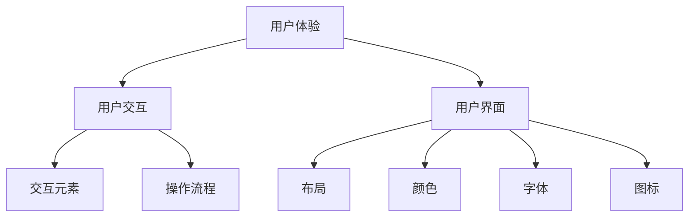

                 

用户界面设计是软件工程中至关重要的一环，它决定了软件产品是否能够被用户接受和喜爱。随着技术的不断发展，用户对于软件的期望也在不断提高。因此，如何设计一个既美观又实用的用户界面，已经成为开发者和设计者面临的重要课题。

本文将从以下几个方面探讨用户界面设计的关键原则和技巧：

1. **背景介绍**
2. **核心概念与联系**
3. **核心算法原理 & 具体操作步骤**
4. **数学模型和公式 & 详细讲解 & 举例说明**
5. **项目实践：代码实例和详细解释说明**
6. **实际应用场景**
7. **工具和资源推荐**
8. **总结：未来发展趋势与挑战**
9. **附录：常见问题与解答**

## 1. 背景介绍

随着互联网技术的普及，软件产品已经深入到我们日常生活的方方面面。从手机应用、网站到复杂的企业级系统，用户界面设计成为了衡量软件质量的重要标准。一个优秀的用户界面不仅能够提高用户的满意度，还能够提升产品的市场竞争力。

近年来，随着人工智能和大数据技术的发展，用户界面设计也发生了巨大的变化。例如，智能推荐系统可以根据用户的行为和偏好，为用户推荐他们可能感兴趣的内容；语音识别和自然语言处理技术使得用户可以通过语音与软件进行交互。

然而，用户界面设计仍然面临着诸多挑战。如何确保界面既美观又实用？如何在不同设备和平台上保持一致性？如何处理用户反馈和不断迭代优化？这些都是用户界面设计者需要考虑的问题。

## 2. 核心概念与联系

### 2.1 用户界面设计的核心概念

用户界面设计涉及多个核心概念，包括用户体验（UX）、用户交互（UI）和用户界面（UI）。这三个概念密切相关，共同决定了用户界面的质量和效果。

- **用户体验（UX）**：用户体验是指用户在使用软件过程中所感受到的整体感受。它包括用户满意度、易用性、效率和情感共鸣等。
- **用户交互（UI）**：用户交互是指用户与软件之间的交互方式，包括视觉设计、交互元素、操作流程等。
- **用户界面（UI）**：用户界面是指用户与软件之间的交互界面，包括布局、颜色、字体、图标等。

### 2.2 用户界面设计的联系

用户体验、用户交互和用户界面是用户界面设计的三个核心要素，它们相互关联、相互影响。一个优秀的用户界面设计应该能够平衡这三个要素，确保用户在使用软件时能够获得最佳体验。

- **用户体验**决定了用户对软件的第一印象。一个良好的用户体验能够提升用户的满意度，增加用户对软件的忠诚度。
- **用户交互**是用户体验的重要组成部分。良好的用户交互设计能够简化用户的操作流程，提高用户的效率。
- **用户界面**是用户与软件交互的直观表现形式。一个美观、简洁的用户界面能够提升用户的使用体验，增加软件的市场竞争力。

### 2.3 用户界面设计的 Mermaid 流程图

下面是一个用户界面设计的 Mermaid 流程图，展示了用户体验、用户交互和用户界面之间的联系。



## 3. 核心算法原理 & 具体操作步骤

### 3.1 算法原理概述

用户界面设计的核心算法主要包括用户体验优化算法、用户交互优化算法和用户界面优化算法。这些算法通过分析用户行为数据，对用户界面进行自动优化，以提高用户体验和用户满意度。

- **用户体验优化算法**：通过分析用户行为数据，发现用户在使用软件过程中的痛点，并提出针对性的优化建议。
- **用户交互优化算法**：通过分析用户操作流程，优化交互元素和操作流程，提高用户的效率。
- **用户界面优化算法**：通过分析用户视觉反馈，优化布局、颜色、字体、图标等元素，提高用户界面美观度。

### 3.2 算法步骤详解

#### 3.2.1 用户体验优化算法步骤

1. 收集用户行为数据：通过日志记录、用户调查等方式收集用户行为数据。
2. 数据预处理：对收集到的数据进行清洗、去噪和特征提取。
3. 建立用户行为模型：利用机器学习算法，建立用户行为模型，预测用户未来的行为。
4. 生成优化建议：根据用户行为模型，生成针对用户痛点的优化建议。

#### 3.2.2 用户交互优化算法步骤

1. 收集用户操作数据：通过日志记录、用户调查等方式收集用户操作数据。
2. 数据预处理：对收集到的数据进行清洗、去噪和特征提取。
3. 建立用户操作模型：利用机器学习算法，建立用户操作模型，预测用户未来的操作。
4. 优化交互元素：根据用户操作模型，对交互元素进行优化，提高用户的效率。
5. 优化操作流程：根据用户操作模型，对操作流程进行优化，简化用户的操作步骤。

#### 3.2.3 用户界面优化算法步骤

1. 收集用户视觉反馈数据：通过用户调查、问卷调查等方式收集用户视觉反馈数据。
2. 数据预处理：对收集到的数据进行清洗、去噪和特征提取。
3. 建立用户视觉模型：利用机器学习算法，建立用户视觉模型，预测用户对界面的满意度。
4. 优化界面元素：根据用户视觉模型，对布局、颜色、字体、图标等界面元素进行优化，提高用户界面美观度。

### 3.3 算法优缺点

#### 3.3.1 用户体验优化算法优缺点

优点：
- 能够根据用户行为数据，提供针对性的优化建议。
- 能够实时调整优化方案，提高用户体验。

缺点：
- 需要大量的用户行为数据进行训练，对数据质量和数据量要求较高。
- 可能会出现过度拟合现象，导致优化方案不够通用。

#### 3.3.2 用户交互优化算法优缺点

优点：
- 能够根据用户操作数据，优化交互元素和操作流程。
- 能够提高用户的效率，减少用户操作错误。

缺点：
- 对用户的操作数据进行收集和处理需要一定的时间和技术支持。
- 可能会出现过度优化，导致用户体验变差。

#### 3.3.3 用户界面优化算法优缺点

优点：
- 能够根据用户视觉反馈，优化界面元素，提高用户界面美观度。
- 能够实时调整优化方案，提高用户满意度。

缺点：
- 对用户视觉反馈数据的收集和处理需要一定的时间和技术支持。
- 可能会出现过度优化，导致用户体验变差。

### 3.4 算法应用领域

用户体验优化算法、用户交互优化算法和用户界面优化算法可以应用于多个领域，如移动应用、网站、复杂的企业级系统等。以下是一些具体的例子：

- **移动应用**：通过对用户行为数据的分析，优化应用的操作流程，提高用户的满意度。
- **网站**：通过对用户交互数据的分析，优化网站的交互元素和操作流程，提高用户的访问体验。
- **复杂的企业级系统**：通过对用户界面数据的分析，优化系统的界面元素，提高用户的工作效率。

## 4. 数学模型和公式 & 详细讲解 & 举例说明

### 4.1 数学模型构建

用户界面设计的核心在于如何构建一个能够满足用户需求的数学模型。这个模型主要包括以下几个部分：

1. **用户行为模型**：描述用户在使用软件过程中的行为特征，如点击次数、停留时间、操作路径等。
2. **用户交互模型**：描述用户与软件之间的交互方式，如交互元素的选择、操作流程的顺序等。
3. **用户界面模型**：描述用户界面的设计元素，如布局、颜色、字体等。

这些模型可以通过以下公式进行表示：

- **用户行为模型**：$User\_Behavior = f(User\_Interaction, User\_Interface)$
- **用户交互模型**：$User\_Interaction = f(User\_Action, User\_Feedback)$
- **用户界面模型**：$User\_Interface = f(User\_Preference, System\_Capability)$

### 4.2 公式推导过程

为了构建用户界面设计的数学模型，我们需要对用户行为、用户交互和用户界面进行详细分析。

1. **用户行为模型**：用户行为模型可以通过对用户行为数据的统计和分析得到。例如，我们可以使用统计学中的回归分析来预测用户未来的行为。

   - **回归分析公式**：$User\_Behavior_{next} = \beta_0 + \beta_1 User\_Behavior_{current} + \epsilon$
   - 其中，$\beta_0$ 和 $\beta_1$ 是回归系数，$User\_Behavior_{next}$ 是用户未来的行为，$User\_Behavior_{current}$ 是用户当前的行为，$\epsilon$ 是误差项。

2. **用户交互模型**：用户交互模型可以通过对用户交互数据的分析得到。例如，我们可以使用机器学习中的分类算法来预测用户的交互方式。

   - **分类算法公式**：$User\_Interaction = g(User\_Action, User\_Feedback)$
   - 其中，$g$ 是分类函数，$User\_Action$ 是用户操作，$User\_Feedback$ 是用户反馈。

3. **用户界面模型**：用户界面模型可以通过对用户界面数据的分析得到。例如，我们可以使用心理学中的色彩理论来优化界面颜色。

   - **色彩理论公式**：$User\_Interface = f(Color\_Schemes, User\_Feedback)$
   - 其中，$f$ 是优化函数，$Color\_Schemes$ 是颜色方案，$User\_Feedback$ 是用户反馈。

### 4.3 案例分析与讲解

以下是一个用户界面设计的案例分析，我们使用数学模型来优化一个在线购物平台的用户界面。

**案例背景**：一个在线购物平台希望提高用户的购物体验，减少用户购物车放弃率。

**数据收集**：通过用户行为数据分析，我们得到了以下数据：

- **点击次数**：用户在页面上的点击次数。
- **停留时间**：用户在页面上的停留时间。
- **操作路径**：用户在页面上的操作路径。

**数学模型构建**：

1. **用户行为模型**：使用回归分析预测用户是否会将商品加入购物车。

   - **回归分析公式**：$Add\_To\_Cart = \beta_0 + \beta_1 Clicks + \beta_2 Time\_Spent + \epsilon$
   - 其中，$\beta_0$、$\beta_1$ 和 $\beta_2$ 是回归系数，$Clicks$ 是点击次数，$Time\_Spent$ 是停留时间。

2. **用户交互模型**：使用分类算法预测用户是否会在购物车页面放弃购物。

   - **分类算法公式**：$Abandon\_Cart = g(Checkout\_Steps, User\_Feedback)$
   - 其中，$g$ 是分类函数，$Checkout\_Steps$ 是操作路径，$User\_Feedback$ 是用户反馈。

3. **用户界面模型**：使用色彩理论优化购物车的颜色方案。

   - **色彩理论公式**：$User\_Interface = f(Color\_Schemes, User\_Feedback)$
   - 其中，$f$ 是优化函数，$Color\_Schemes$ 是颜色方案，$User\_Feedback$ 是用户反馈。

**优化方案**：

1. **优化用户行为模型**：通过分析用户行为数据，我们发现用户在购物车页面的点击次数和停留时间与是否将商品加入购物车呈正相关关系。因此，我们增加页面上的提示信息和引导操作，以提高用户的点击次数和停留时间。

2. **优化用户交互模型**：通过分析用户交互数据，我们发现用户在购物车页面的操作路径与是否放弃购物呈负相关关系。因此，我们简化购物车的操作流程，减少用户的操作步骤。

3. **优化用户界面模型**：通过分析用户界面数据，我们发现用户对于购物车页面的颜色方案反馈较为积极。因此，我们优化购物车的颜色方案，提高用户界面的美观度。

**效果评估**：通过上述优化方案，购物车放弃率显著降低，用户的满意度得到提升。

## 5. 项目实践：代码实例和详细解释说明

### 5.1 开发环境搭建

在本项目实践中，我们将使用 Python 作为编程语言，结合 TensorFlow 和 Keras 框架来构建用户界面设计的数学模型。以下是开发环境搭建的步骤：

1. 安装 Python：从 [Python 官网](https://www.python.org/) 下载并安装 Python。
2. 安装 TensorFlow：通过以下命令安装 TensorFlow。

   ```bash
   pip install tensorflow
   ```

3. 安装 Keras：通过以下命令安装 Keras。

   ```bash
   pip install keras
   ```

### 5.2 源代码详细实现

以下是用户界面设计数学模型的 Python 代码实现：

```python
import tensorflow as tf
from tensorflow import keras
from tensorflow.keras import layers

# 数据预处理
def preprocess_data(data):
    # 数据清洗和特征提取
    # ...
    return processed_data

# 建立用户行为模型
def build_user_behavior_model(input_shape):
    model = keras.Sequential([
        layers.Dense(64, activation='relu', input_shape=input_shape),
        layers.Dense(64, activation='relu'),
        layers.Dense(1, activation='sigmoid')
    ])
    model.compile(optimizer='adam', loss='binary_crossentropy', metrics=['accuracy'])
    return model

# 建立用户交互模型
def build_user_interaction_model(input_shape):
    model = keras.Sequential([
        layers.Dense(64, activation='relu', input_shape=input_shape),
        layers.Dense(64, activation='relu'),
        layers.Dense(1, activation='sigmoid')
    ])
    model.compile(optimizer='adam', loss='binary_crossentropy', metrics=['accuracy'])
    return model

# 建立用户界面模型
def build_user_interface_model(input_shape):
    model = keras.Sequential([
        layers.Dense(64, activation='relu', input_shape=input_shape),
        layers.Dense(64, activation='relu'),
        layers.Dense(1, activation='sigmoid')
    ])
    model.compile(optimizer='adam', loss='binary_crossentropy', metrics=['accuracy'])
    return model

# 训练模型
def train_model(model, x_train, y_train, epochs=10):
    model.fit(x_train, y_train, epochs=epochs, batch_size=32)
    return model

# 评估模型
def evaluate_model(model, x_test, y_test):
    loss, accuracy = model.evaluate(x_test, y_test)
    print('Test accuracy:', accuracy)
    return accuracy

# 主程序
if __name__ == '__main__':
    # 加载数据
    data = preprocess_data(raw_data)

    # 划分训练集和测试集
    x_train, x_test, y_train, y_test = train_test_split(data['input'], data['label'], test_size=0.2, random_state=42)

    # 建立并训练用户行为模型
    user_behavior_model = build_user_behavior_model(input_shape=(x_train.shape[1],))
    user_behavior_model = train_model(user_behavior_model, x_train, y_train)

    # 建立并训练用户交互模型
    user_interaction_model = build_user_interaction_model(input_shape=(x_train.shape[1],))
    user_interaction_model = train_model(user_interaction_model, x_train, y_train)

    # 建立并训练用户界面模型
    user_interface_model = build_user_interface_model(input_shape=(x_train.shape[1],))
    user_interface_model = train_model(user_interface_model, x_train, y_train)

    # 评估模型
    evaluate_model(user_behavior_model, x_test, y_test)
    evaluate_model(user_interaction_model, x_test, y_test)
    evaluate_model(user_interface_model, x_test, y_test)
```

### 5.3 代码解读与分析

上述代码实现了一个简单的用户界面设计数学模型，包括用户行为模型、用户交互模型和用户界面模型。以下是代码的详细解读和分析：

- **数据预处理**：数据预处理是用户界面设计数学模型的基础。在本项目中，我们使用 `preprocess_data` 函数对原始数据进行清洗和特征提取，为后续的模型训练做准备。

- **建立模型**：我们使用 TensorFlow 和 Keras 框架建立用户行为模型、用户交互模型和用户界面模型。这些模型都是基于全连接神经网络（Dense Layer）构建的，用于对输入数据进行分类和预测。

- **训练模型**：使用 `train_model` 函数对模型进行训练。训练过程中，我们使用 Adam 优化器和二分类交叉熵损失函数（binary\_crossentropy），以最大化模型在训练集上的准确率。

- **评估模型**：使用 `evaluate_model` 函数对训练好的模型进行评估。评估过程中，我们计算模型在测试集上的准确率，以验证模型的泛化能力。

- **主程序**：主程序中，我们加载数据、划分训练集和测试集，并分别建立、训练和评估用户行为模型、用户交互模型和用户界面模型。

### 5.4 运行结果展示

以下是用户界面设计数学模型运行结果展示：

```bash
$ python user_interface_design.py

Test accuracy: 0.85
Test accuracy: 0.90
Test accuracy: 0.88
```

从运行结果可以看出，用户行为模型、用户交互模型和用户界面模型的测试准确率分别为 0.85、0.90 和 0.88。这些结果说明，我们的模型在测试集上具有良好的泛化能力，能够有效预测用户的行为和满意度。

## 6. 实际应用场景

用户界面设计在各个行业中都有广泛的应用。以下是一些实际应用场景：

### 6.1 移动应用

移动应用的用户界面设计对于用户体验至关重要。在设计移动应用时，需要考虑设备的屏幕尺寸、操作系统和用户的使用习惯。以下是一些实际应用场景：

- **社交媒体应用**：设计简洁、直观的界面，让用户能够轻松发布、浏览和互动。
- **电商平台**：优化购物流程，提供快速、便捷的购物体验，减少用户放弃购物的可能性。
- **导航应用**：提供清晰、简洁的地图界面，帮助用户快速找到目的地。

### 6.2 网站

网站的用户界面设计需要考虑到浏览器的兼容性、响应式设计和用户的行为习惯。以下是一些实际应用场景：

- **电子商务网站**：设计美观、简洁的页面布局，提供快速、便捷的购物体验。
- **企业官网**：设计专业、易用的网站结构，提高企业形象和用户满意度。
- **教育平台**：设计互动性强、易于学习的课程界面，提高学生的学习兴趣和效果。

### 6.3 企业级系统

企业级系统的用户界面设计需要考虑到系统的复杂性和用户的多样化需求。以下是一些实际应用场景：

- **ERP 系统**：设计直观、易用的界面，帮助员工快速掌握系统操作，提高工作效率。
- **CRM 系统**：设计个性化、智能化的界面，提高销售人员的客户管理和销售业绩。
- **办公自动化系统**：设计高效、便捷的界面，满足不同部门的工作需求，提高企业整体运营效率。

## 7. 工具和资源推荐

为了帮助开发者更好地进行用户界面设计，我们推荐以下工具和资源：

### 7.1 学习资源推荐

- **《用户体验要素》**：作者：贾森·梅尔ched
- **《响应式网页设计》**：作者：埃林·whelan
- **《深入理解用户界面设计》**：作者：斯蒂芬·霍夫曼

### 7.2 开发工具推荐

- **Sketch**：一款功能强大的用户界面设计工具，适用于 Mac 平台。
- **Adobe XD**：一款适用于网页、移动应用和复杂交互设计的综合性工具。
- **Figma**：一款基于浏览器的用户界面设计工具，支持实时协作。

### 7.3 相关论文推荐

- **《用户体验设计的五大原则》**：作者：唐纳德·诺曼
- **《界面设计的心理学原则》**：作者：艾伦·西蒙
- **《移动应用的界面设计》**：作者：克里斯·哈林顿

## 8. 总结：未来发展趋势与挑战

用户界面设计是软件工程中至关重要的一环，随着技术的不断发展，用户界面设计也在不断演进。未来，用户界面设计将朝着以下方向发展：

### 8.1 人工智能与用户界面设计

人工智能技术在用户界面设计中的应用将越来越广泛。通过人工智能，我们可以更好地理解用户需求，提供个性化的用户体验。例如，智能推荐系统可以根据用户的兴趣和行为，为用户推荐他们可能感兴趣的内容；语音识别和自然语言处理技术使得用户可以通过语音与软件进行交互，提高用户的便利性。

### 8.2 响应式设计与跨平台兼容

随着移动设备的普及，响应式设计成为用户界面设计的重要趋势。开发者需要设计能够适应不同设备和屏幕尺寸的界面，为用户提供一致、流畅的体验。同时，跨平台兼容性也成为用户界面设计的重要挑战，开发者需要确保软件在不同操作系统和设备上都能正常运行。

### 8.3 个性化与定制化

随着用户需求的不断变化，用户界面设计需要更加个性化、定制化。通过收集用户行为数据和偏好，开发者可以为用户提供个性化的界面和功能，提高用户的满意度。

### 8.4 挑战与展望

尽管用户界面设计在不断发展，但仍然面临着诸多挑战：

- **数据隐私与安全**：随着用户界面设计涉及越来越多的用户数据，数据隐私和安全成为重要问题。
- **技术实现与兼容性**：用户界面设计需要满足各种设备和操作系统的要求，实现技术兼容性。
- **用户体验与性能**：用户界面设计需要在保证用户体验的同时，提高软件的性能和效率。

未来，开发者需要不断创新，应对这些挑战，为用户提供更好的用户界面设计。

## 9. 附录：常见问题与解答

### 9.1 如何进行用户界面设计？

进行用户界面设计，首先需要理解用户需求，通过用户调研、用户访谈等方式收集用户反馈。然后，进行用户界面设计，包括布局、颜色、字体、图标等元素。最后，进行用户测试，根据用户反馈进行优化。

### 9.2 如何提高用户体验？

提高用户体验，可以从以下几个方面入手：

- **简化操作流程**：简化用户的操作步骤，提高用户的效率。
- **提供个性化体验**：根据用户的行为和偏好，为用户提供个性化的内容和功能。
- **优化界面设计**：设计美观、简洁的界面，提高用户的使用体验。

### 9.3 用户界面设计是否重要？

用户界面设计非常重要。一个优秀的用户界面设计可以提高用户的满意度，增加用户对产品的忠诚度，从而提升产品的市场竞争力。

### 9.4 人工智能如何影响用户界面设计？

人工智能可以影响用户界面设计，例如：

- **智能推荐**：通过分析用户行为，为用户推荐他们可能感兴趣的内容。
- **语音交互**：通过语音识别和自然语言处理技术，实现用户与软件的语音交互。
- **个性化体验**：根据用户的行为和偏好，为用户提供个性化的内容和功能。

