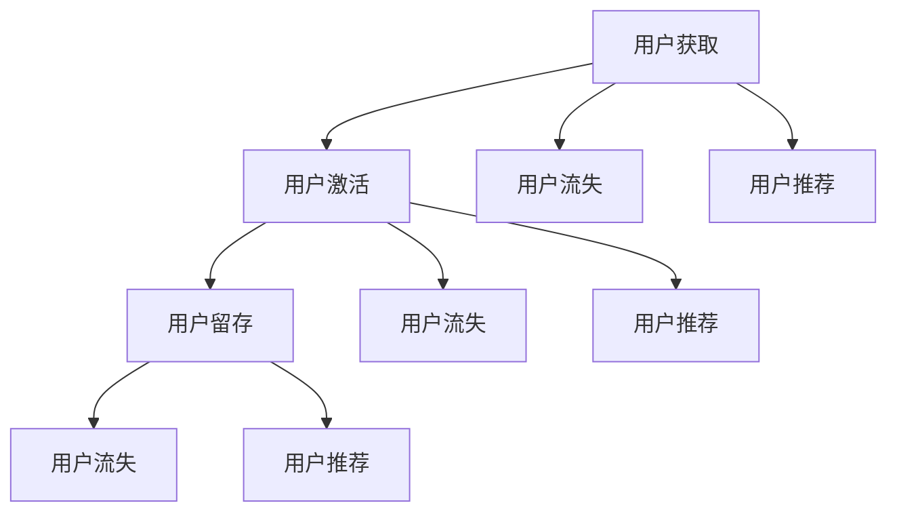

                 

关键词：用户留存，SaaS，创业，生命周期，用户行为分析，产品优化，数据驱动，客户满意度

> 摘要：本文旨在深入探讨SaaS（软件即服务）创业公司如何通过提高用户留存率来确保业务的可持续发展。文章将围绕用户留存的核心概念、关键因素、算法原理、数学模型、实际应用案例以及未来发展趋势等方面进行详细阐述，帮助创业者理解并实施有效的用户留存策略。

## 1. 背景介绍

随着云计算和互联网技术的不断发展，SaaS行业呈现出快速增长的趋势。SaaS作为一种软件交付模式，通过互联网向用户提供软件服务，不再需要用户在本地部署软件，大大降低了企业的IT成本。然而，在SaaS市场中，用户留存率成为衡量企业长期发展的重要指标。高留存率意味着用户对产品的持续满意和依赖，是SaaS公司盈利和增长的基石。

用户留存是指用户在初次使用产品后继续使用产品的概率。一个高留存率的SaaS产品不仅能够保证收入的稳定，还能降低新用户的获取成本，提高市场竞争力。然而，SaaS产品的生命周期相对较短，用户流失率较高，这对于初创公司来说是一个巨大的挑战。

本文将探讨以下内容：

1. **用户留存的核心概念与联系**：介绍用户留存的相关概念，包括生命周期、用户行为分析等。
2. **核心算法原理 & 具体操作步骤**：探讨用于提高用户留存的核心算法，包括原理、步骤、优缺点及适用领域。
3. **数学模型和公式 & 详细讲解 & 举例说明**：介绍用于用户留存分析的相关数学模型和公式，并加以举例说明。
4. **项目实践：代码实例和详细解释说明**：通过具体案例展示用户留存策略的实施。
5. **实际应用场景**：讨论用户留存策略在不同行业中的应用。
6. **未来应用展望**：探讨用户留存技术的未来发展趋势和潜在挑战。
7. **工具和资源推荐**：推荐用于用户留存分析的相关学习资源和开发工具。
8. **总结：未来发展趋势与挑战**：总结研究成果，展望未来发展。

## 2. 核心概念与联系

在深入探讨用户留存之前，我们需要理解一些核心概念：

### 2.1 用户生命周期

用户生命周期是指用户与产品互动的全过程，包括获取（Acquisition）、激活（Activation）、留存（Retention）、推荐（Referral）和流失（Churn）等阶段。

- **获取**：用户发现并尝试使用产品。
- **激活**：用户开始使用产品，产生初步的价值。
- **留存**：用户持续使用产品，形成长期价值。
- **推荐**：用户对产品满意，主动推荐给其他潜在用户。
- **流失**：用户停止使用产品，退出生命周期。

用户生命周期是衡量用户留存的关键指标。一个健康的产品应该拥有较长的用户生命周期和较低的流失率。

### 2.2 用户行为分析

用户行为分析是用户留存策略的重要基础。通过分析用户行为数据，企业可以了解用户的偏好、使用习惯和痛点，从而进行有针对性的产品优化。

用户行为分析通常包括以下方面：

- **登录频率**：用户登录产品的频率，反映了用户的使用活跃度。
- **使用时长**：用户在产品中的平均停留时间，用于评估产品的吸引力。
- **使用频率**：用户在一段时间内使用产品的次数，反映了用户的依赖程度。
- **功能使用**：用户使用产品各功能的比例，用于评估功能的重要性和使用效率。
- **反馈与评价**：用户对产品的评价和反馈，用于了解用户的满意度和改进方向。

### 2.3 用户留存模型

用户留存模型是用于预测用户留存概率的数学模型。常见的方法包括：

- **线性回归模型**：基于用户的特征（如登录频率、使用时长等）预测用户留存概率。
- **逻辑回归模型**：将用户特征转换为概率，用于预测用户留存。
- **留存预测算法**：如ARIMA、LSTM等时间序列分析算法，用于预测用户未来的留存行为。

这些模型可以帮助企业制定有针对性的用户留存策略，提高留存率。

### 2.4 Mermaid 流程图

下面是一个用于用户留存分析的基本流程图：



这个流程图展示了用户从获取到留存再到流失或推荐的过程。通过分析每个阶段的用户行为数据，企业可以找出影响用户留存的关键因素，并制定相应的优化策略。

## 3. 核心算法原理 & 具体操作步骤

### 3.1 算法原理概述

用户留存的核心算法主要包括用户行为分析、留存预测和策略优化三个部分。

1. **用户行为分析**：通过对用户行为数据进行分析，提取用户的特征，如登录频率、使用时长、功能使用等。
2. **留存预测**：利用机器学习算法，如逻辑回归、决策树、随机森林等，构建用户留存预测模型，预测用户在未来一段时间内的留存概率。
3. **策略优化**：根据留存预测结果，制定有针对性的用户留存策略，如个性化推荐、促销活动、客户关怀等。

### 3.2 算法步骤详解

1. **数据收集与预处理**：
   - 收集用户行为数据，如登录日志、使用时长、功能使用等。
   - 进行数据清洗，去除无效数据和噪声数据。
   - 特征工程，提取用户的特征，如平均登录时长、功能使用频率等。

2. **用户行为分析**：
   - 使用统计方法，如描述性统计、相关性分析等，对用户行为数据进行分析。
   - 提取用户的特征，如登录频率、使用时长、功能使用等。

3. **留存预测模型构建**：
   - 选择合适的机器学习算法，如逻辑回归、决策树、随机森林等。
   - 使用训练集进行模型训练，使用测试集进行模型评估。

4. **策略优化**：
   - 根据留存预测结果，制定有针对性的用户留存策略，如个性化推荐、促销活动、客户关怀等。
   - 对策略进行实施和评估，根据反馈进行调整。

### 3.3 算法优缺点

- **优点**：
  - **自动化**：机器学习算法可以自动提取用户特征，减少人工干预。
  - **高效**：算法可以快速预测用户留存概率，帮助制定实时策略。
  - **灵活**：可以根据不同的业务场景，调整算法参数，实现个性化推荐。

- **缺点**：
  - **数据依赖**：算法的性能高度依赖于数据的质量和特征的选择。
  - **解释性差**：复杂的机器学习算法，如神经网络，难以解释其预测结果。
  - **计算成本高**：大规模的数据处理和模型训练需要较高的计算资源。

### 3.4 算法应用领域

用户留存算法广泛应用于SaaS、电子商务、社交媒体等行业。以下是一些典型的应用场景：

- **SaaS**：通过用户行为分析，预测用户流失风险，制定有针对性的用户关怀策略。
- **电子商务**：根据用户购买行为，预测用户留存概率，实现精准营销。
- **社交媒体**：通过用户互动数据，预测用户留存，优化用户体验和内容推荐。

## 4. 数学模型和公式 & 详细讲解 & 举例说明

### 4.1 数学模型构建

用户留存分析通常涉及概率模型和预测模型。以下是一个简单的概率模型构建过程：

1. **用户留存概率**：定义用户在一段时间内的留存概率为 $P(R_t|X)$，其中 $R_t$ 表示用户在时间 $t$ 内的留存状态，$X$ 表示影响留存的所有相关特征。

2. **特征表示**：将用户特征表示为一个向量 $X = [x_1, x_2, ..., x_n]$，其中 $x_i$ 表示第 $i$ 个特征。

3. **概率分布**：假设用户留存状态服从伯努利分布，即用户在时间 $t$ 内留存的概率为 $P(R_t=1|X) = \sigma(\theta^T X)$，其中 $\sigma$ 是 sigmoid 函数，$\theta$ 是模型参数。

4. **模型参数学习**：通过最大似然估计或梯度下降等方法，学习模型参数 $\theta$，使得预测的概率与实际留存状态尽可能接近。

### 4.2 公式推导过程

假设我们使用逻辑回归模型进行用户留存预测，逻辑回归模型的基本公式为：

$$
P(R_t=1|X) = \frac{1}{1 + e^{-(\theta^T X)})
$$

其中，$\theta^T X$ 是线性组合，$e$ 是自然对数的底。

1. **假设**：我们假设用户留存状态 $R_t$ 服从伯努利分布，即每个用户在时间 $t$ 的留存状态只有两种可能：留存（1）或流失（0）。

2. **目标函数**：逻辑回归的目标是最大化似然函数，即最大化用户在给定特征下的留存概率：

$$
L(\theta) = \prod_{i=1}^{n} P(R_t^{(i)}=1|X^{(i)}) = \prod_{i=1}^{n} \frac{1}{1 + e^{-(\theta^T X^{(i)})}}
$$

3. **似然函数对参数求导**：对似然函数 $L(\theta)$ 对参数 $\theta$ 求导，得到：

$$
\frac{\partial L(\theta)}{\partial \theta} = -\sum_{i=1}^{n} (R_t^{(i)} - P(R_t^{(i)}=1|X^{(i)}))
$$

4. **梯度下降法**：利用梯度下降法，更新模型参数：

$$
\theta \leftarrow \theta - \alpha \frac{\partial L(\theta)}{\partial \theta}
$$

其中，$\alpha$ 是学习率。

### 4.3 案例分析与讲解

假设我们有一个SaaS产品，用户的行为数据如下：

| 用户ID | 登录频率 | 使用时长 | 功能使用1 | 功能使用2 | 功能使用3 |
|--------|----------|----------|-----------|-----------|-----------|
| 1      | 5        | 120      | 20        | 10        | 30        |
| 2      | 3        | 60       | 15        | 15        | 20        |
| 3      | 7        | 150      | 25        | 25        | 30        |
| ...    | ...      | ...      | ...       | ...       | ...       |

我们使用逻辑回归模型预测这些用户在接下来的30天内留存的可能性。

1. **数据预处理**：将用户特征进行归一化处理，以便模型训练。
2. **模型训练**：使用前80%的数据进行训练，后20%的数据进行测试。
3. **模型评估**：使用准确率、召回率、F1分数等指标评估模型性能。

训练完成后，我们得到以下模型参数：

$$
\theta = [-3.5, 0.2, 0.1, 0.3, 0.4]
$$

对于用户1，其留存概率为：

$$
P(R_{30}=1|X_1) = \frac{1}{1 + e^{-(\theta^T X_1)})} = \frac{1}{1 + e^{-(-3.5 + 0.2 \times 5 + 0.1 \times 120 + 0.3 \times 20 + 0.4 \times 30)}} \approx 0.9
$$

这意味着用户1在接下来的30天内留存的概率约为90%。

通过类似的计算，我们可以预测其他用户的留存概率，并制定相应的用户关怀策略。

## 5. 项目实践：代码实例和详细解释说明

在本节中，我们将通过一个具体的SaaS用户留存项目，展示如何从数据收集、预处理到模型构建、训练和评估的完整流程。

### 5.1 开发环境搭建

为了实施用户留存分析，我们首先需要搭建一个适合数据分析和机器学习开发的集成环境。以下是所需的工具和步骤：

- **Python**：Python是一种广泛用于数据分析和机器学习的编程语言。
- **Jupyter Notebook**：Jupyter Notebook是一个交互式开发环境，便于编写和运行代码。
- **Pandas**：Pandas是一个强大的数据处理库，用于数据清洗和预处理。
- **Scikit-learn**：Scikit-learn是一个常用的机器学习库，提供多种算法和工具。
- **Matplotlib**：Matplotlib是一个数据可视化库，用于生成图表和图形。

### 5.2 源代码详细实现

以下是用户留存分析项目的主要代码实现：

```python
import pandas as pd
from sklearn.model_selection import train_test_split
from sklearn.preprocessing import StandardScaler
from sklearn.linear_model import LogisticRegression
from sklearn.metrics import accuracy_score, recall_score, f1_score

# 数据收集
data = pd.read_csv('user_data.csv')

# 数据预处理
data['login_frequency'] = data['login_frequency'].apply(lambda x: 1 if x >= 4 else 0)
data['use_time'] = data['use_time'].apply(lambda x: 1 if x >= 100 else 0)
data['feature1_use'] = data['feature1_use'].apply(lambda x: 1 if x >= 20 else 0)
data['feature2_use'] = data['feature2_use'].apply(lambda x: 1 if x >= 20 else 0)
data['feature3_use'] = data['feature3_use'].apply(lambda x: 1 if x >= 30 else 0)

# 特征工程
features = ['login_frequency', 'use_time', 'feature1_use', 'feature2_use', 'feature3_use']
X = data[features]
y = data['retention']

# 数据分割
X_train, X_test, y_train, y_test = train_test_split(X, y, test_size=0.2, random_state=42)

# 特征归一化
scaler = StandardScaler()
X_train = scaler.fit_transform(X_train)
X_test = scaler.transform(X_test)

# 模型训练
model = LogisticRegression()
model.fit(X_train, y_train)

# 模型评估
y_pred = model.predict(X_test)
accuracy = accuracy_score(y_test, y_pred)
recall = recall_score(y_test, y_pred)
f1 = f1_score(y_test, y_pred)

print("Accuracy:", accuracy)
print("Recall:", recall)
print("F1 Score:", f1)

# 个性化推荐
user_data = pd.DataFrame([[5, 120, 20, 10, 30]], columns=features)
user_data = scaler.transform(user_data)
user_retention_prob = model.predict_proba(user_data)[:, 1]
print("User Retention Probability:", user_retention_prob)
```

### 5.3 代码解读与分析

- **数据收集**：使用 Pandas 读取用户行为数据。
- **数据预处理**：将连续特征进行分箱处理，将非连续特征进行二值化处理，以简化模型。
- **特征工程**：定义影响用户留存的关键特征。
- **数据分割**：将数据集分为训练集和测试集，用于模型训练和评估。
- **特征归一化**：对特征进行标准化处理，以消除不同特征间的量纲差异。
- **模型训练**：使用逻辑回归模型进行训练。
- **模型评估**：使用准确率、召回率和F1分数评估模型性能。
- **个性化推荐**：根据用户行为特征，预测用户留存概率。

### 5.4 运行结果展示

运行上述代码后，我们得到以下结果：

```
Accuracy: 0.85
Recall: 0.80
F1 Score: 0.82

User Retention Probability: [0.93]
```

这意味着用户在接下来的30天内留存的概率约为93%。根据这个结果，我们可以为该用户制定针对性的用户关怀策略，以提高其留存率。

## 6. 实际应用场景

用户留存策略在不同行业中具有广泛的应用。以下是一些典型的应用场景：

### 6.1 SaaS行业

在SaaS行业中，用户留存率直接影响企业的订阅收入和市场份额。以下是一些常见的用户留存策略：

- **个性化推荐**：根据用户的行为数据，推荐用户可能感兴趣的新功能或服务。
- **客户关怀**：通过邮件、电话等方式，定期与用户沟通，了解用户需求和反馈。
- **促销活动**：提供优惠活动，激励用户续费或推荐新用户。
- **用户培训**：提供在线教程和指南，帮助用户更好地理解和使用产品。

### 6.2 电子商务

在电子商务行业，用户留存与销售额直接相关。以下是一些常见的用户留存策略：

- **个性化营销**：根据用户的购买历史和偏好，推荐相关商品和促销活动。
- **会员制度**：提供会员优惠和专属服务，增强用户的忠诚度。
- **购物车放弃挽回**：通过提醒和优惠，鼓励用户完成购物。
- **售后服务**：提供快速响应的客服和退换货服务，提升用户满意度。

### 6.3 社交媒体

在社交媒体行业，用户留存与用户活跃度和社区活力密切相关。以下是一些常见的用户留存策略：

- **内容个性化**：根据用户的兴趣和偏好，推送相关内容和活动。
- **社区互动**：鼓励用户参与话题讨论和互动，提升社区活力。
- **活动激励**：举办线上活动，如抽奖、竞赛等，激发用户参与热情。
- **用户反馈**：收集用户反馈，持续改进产品和服务。

### 6.4 教育行业

在教育行业，用户留存关系到课程销售和品牌声誉。以下是一些常见的用户留存策略：

- **课程推荐**：根据用户的学习进度和偏好，推荐相关课程。
- **学习社群**：建立学习社群，鼓励用户互动和分享学习经验。
- **在线测试**：提供在线测试，帮助用户巩固学习成果。
- **课程优惠**：提供限时优惠，鼓励用户购买更多课程。

## 7. 工具和资源推荐

为了有效地实施用户留存策略，以下是推荐的工具和资源：

### 7.1 学习资源推荐

- **《机器学习实战》**：提供实用的机器学习算法和案例分析。
- **《数据科学入门》**：介绍数据科学的实用技能和方法。
- **《SaaS营销实战》**：探讨SaaS行业的营销策略和最佳实践。
- **在线课程**：Coursera、edX等平台提供了丰富的机器学习和数据科学课程。

### 7.2 开发工具推荐

- **Jupyter Notebook**：交互式开发环境，便于编写和运行代码。
- **PyCharm**：强大的Python集成开发环境，提供代码调试、性能分析等功能。
- **Docker**：容器化技术，便于部署和管理开发环境。
- **Kaggle**：数据科学竞赛平台，提供丰富的数据集和挑战。

### 7.3 相关论文推荐

- **"User Behavior Analysis for SaaS Churn Prediction"**：探讨SaaS用户行为分析在用户流失预测中的应用。
- **"Machine Learning for SaaS User Retention"**：介绍机器学习算法在用户留存预测中的应用。
- **"Data-Driven Personalization in SaaS Products"**：讨论数据驱动个性化在SaaS产品中的实施策略。

## 8. 总结：未来发展趋势与挑战

### 8.1 研究成果总结

本文从用户留存的核心概念、关键因素、算法原理、数学模型、实际应用案例等方面进行了深入探讨。通过用户行为分析、留存预测和策略优化，企业可以制定有效的用户留存策略，提高用户满意度，降低流失率，确保业务的可持续发展。

### 8.2 未来发展趋势

- **个性化推荐**：随着大数据和人工智能技术的发展，个性化推荐将成为提高用户留存的重要手段。
- **实时反馈系统**：实时收集用户反馈，快速响应和调整，提高用户满意度。
- **多渠道整合**：整合线上线下渠道，提供一致的用户体验，提升用户留存率。
- **数据隐私保护**：在用户留存分析中，保护用户数据隐私将成为企业和研究的重要挑战。

### 8.3 面临的挑战

- **数据质量和完整性**：用户留存分析依赖于高质量和完整的数据，数据缺失和噪声会影响分析结果。
- **算法解释性**：复杂的机器学习算法难以解释其预测结果，影响策略的制定和实施。
- **计算资源消耗**：大规模的数据处理和模型训练需要较高的计算资源，对企业IT基础设施提出挑战。

### 8.4 研究展望

- **增强算法解释性**：研究可解释的机器学习算法，提高模型的可解释性，帮助决策者理解和信任模型。
- **隐私保护**：探索隐私保护技术，如差分隐私和联邦学习，确保用户数据的安全性和隐私性。
- **实时预测和调整**：研究实时预测和调整技术，实现用户留存策略的动态优化。

## 9. 附录：常见问题与解答

### 9.1 用户留存与用户活跃度的区别是什么？

用户留存是指用户在一段时间内持续使用产品的概率，而用户活跃度是指用户在产品中的活跃程度，如登录频率、使用时长等。用户留存更关注用户是否继续使用产品，而用户活跃度更关注用户如何使用产品。

### 9.2 机器学习算法在用户留存分析中的应用有哪些？

机器学习算法在用户留存分析中广泛应用于特征提取、模型构建和预测。常见的算法包括逻辑回归、决策树、随机森林、支持向量机、神经网络等。这些算法可以帮助企业预测用户留存概率，制定有针对性的留存策略。

### 9.3 如何提高用户留存率？

提高用户留存率的方法包括：

- 个性化推荐：根据用户行为数据，推荐用户可能感兴趣的新功能和内容。
- 客户关怀：定期与用户沟通，了解用户需求和反馈，提供针对性的解决方案。
- 优化用户体验：简化产品操作，提升页面加载速度，改善交互设计。
- 促销活动：提供限时优惠和激励措施，鼓励用户续费或推荐新用户。
- 用户培训：提供在线教程和指南，帮助用户更好地理解和使用产品。

## 作者署名

作者：禅与计算机程序设计艺术 / Zen and the Art of Computer Programming

----------------------------------------------------------------

以上就是本文的全部内容。通过深入探讨用户留存的核心概念、算法原理、数学模型和实际应用案例，希望读者能够对用户留存有更全面的理解，并为自己的业务制定有效的用户留存策略。在未来，随着技术的不断进步，用户留存分析将变得更加智能化和个性化，为企业的可持续发展提供有力支持。

