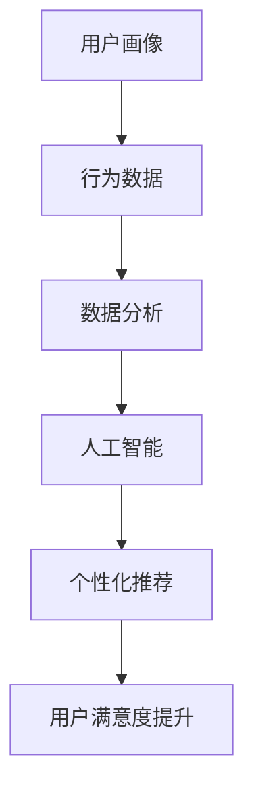

                 

关键词：用户行为分析、人工智能、需求洞察、商品供给、优化策略

摘要：本文深入探讨了用户行为分析在人工智能领域的应用，特别是在洞察用户需求和优化商品供给方面的作用。通过阐述核心概念、算法原理、数学模型、项目实践，以及应用场景，本文为相关领域的研究者和从业者提供了一部具有实践指导意义的技术指南。

## 1. 背景介绍

在数字化时代，用户行为分析已经成为企业和机构获取竞争优势的重要手段。通过收集和分析用户在互联网上的行为数据，企业可以深入了解用户需求、偏好和习惯，从而优化产品和服务，提高用户满意度和忠诚度。

随着人工智能技术的不断发展，用户行为分析的能力得到了极大的提升。人工智能算法能够从海量的用户行为数据中提取有价值的信息，实现自动化的用户需求预测和商品推荐。这不仅提高了数据分析的效率，还使得个性化服务成为可能。

本文将探讨用户行为分析在人工智能中的应用，包括核心概念、算法原理、数学模型、项目实践以及实际应用场景，旨在为读者提供全面的技术指导和实践参考。

## 2. 核心概念与联系

在用户行为分析中，以下几个核心概念是不可或缺的：

### 用户画像（User Profiling）：

用户画像是指对用户在互联网上的行为数据进行分析和处理，构建出一个多维度的用户特征模型。通过用户画像，企业可以更好地理解用户，为个性化服务和推荐提供依据。

### 行为数据（Behavioral Data）：

行为数据包括用户在网站、应用等数字平台上的浏览记录、购买历史、点击次数、停留时间等。这些数据是用户行为分析的基础。

### 数据分析（Data Analysis）：

数据分析是指通过对用户行为数据的统计、建模和挖掘，提取出有价值的信息，如用户偏好、行为模式等。

### 人工智能（Artificial Intelligence）：

人工智能是指通过模拟人类智能行为，实现机器学习、自然语言处理、图像识别等技术的应用。在用户行为分析中，人工智能技术能够自动化地处理和分析大量数据。

下面是用户行为分析的核心概念与联系 Mermaid 流程图：



## 3. 核心算法原理 & 具体操作步骤

### 3.1 算法原理概述

用户行为分析的核心算法主要包括以下几种：

1. **协同过滤（Collaborative Filtering）**：
   协同过滤是一种基于用户行为数据的推荐算法，通过分析用户之间的相似性，为用户提供个性化推荐。协同过滤可以分为基于用户的协同过滤和基于物品的协同过滤。

2. **机器学习（Machine Learning）**：
   机器学习算法能够从用户行为数据中自动提取特征，建立预测模型，实现对用户需求的预测和推荐。常见的机器学习算法包括决策树、支持向量机、神经网络等。

3. **深度学习（Deep Learning）**：
   深度学习是一种特殊的机器学习算法，通过多层神经网络实现对复杂模式的识别和学习。在用户行为分析中，深度学习算法能够处理大量的非结构化数据，如文本、图像等。

### 3.2 算法步骤详解

用户行为分析的具体操作步骤如下：

1. **数据收集**：
   收集用户在数字平台上的行为数据，如浏览记录、购买历史等。

2. **数据预处理**：
   对收集到的数据进行清洗、去噪、转换等预处理操作，为后续分析做好准备。

3. **特征提取**：
   根据业务需求，从用户行为数据中提取出有用的特征，如用户活跃度、购买频率等。

4. **算法选择**：
   根据业务场景和数据特点，选择合适的推荐算法，如协同过滤、机器学习、深度学习等。

5. **模型训练**：
   使用训练集数据，对选定的推荐算法进行训练，建立预测模型。

6. **模型评估**：
   使用测试集数据对训练好的模型进行评估，评估指标包括准确率、召回率、覆盖率等。

7. **结果输出**：
   根据评估结果，调整模型参数，输出最终的推荐结果。

### 3.3 算法优缺点

**协同过滤**：
- 优点：算法简单，易于实现，能够为用户提供个性化的推荐。
- 缺点：数据稀疏问题，冷启动问题，容易受到噪声数据的影响。

**机器学习**：
- 优点：能够处理大规模数据，适应性强，能够发现复杂的行为模式。
- 缺点：对数据质量要求较高，模型复杂度较高，需要大量计算资源。

**深度学习**：
- 优点：能够处理非结构化数据，对复杂模式识别能力强，自主学习能力高。
- 缺点：模型训练时间较长，对计算资源要求较高，需要大量的训练数据。

### 3.4 算法应用领域

用户行为分析算法广泛应用于电子商务、社交媒体、在线教育、金融等领域，如：

- **电子商务**：为用户提供个性化的商品推荐，提高购买转化率。
- **社交媒体**：根据用户行为数据，为用户提供感兴趣的内容推荐，提高用户活跃度。
- **在线教育**：根据用户学习行为，为用户提供个性化的课程推荐，提高学习效果。
- **金融**：根据用户行为数据，进行信用评估、风险控制等。

## 4. 数学模型和公式 & 详细讲解 & 举例说明

### 4.1 数学模型构建

在用户行为分析中，常用的数学模型包括：

- **协同过滤模型**：
  假设用户 \( u \) 和物品 \( i \) 之间存在相似度 \( s_{ui} \)，推荐分数 \( r_{ui} \) 可以表示为：
  $$ r_{ui} = s_{ui} \cdot \mu_i + \epsilon_{ui} $$
  其中，\( \mu_i \) 是物品 \( i \) 的平均评分，\( \epsilon_{ui} \) 是误差项。

- **机器学习模型**：
  假设用户 \( u \) 对物品 \( i \) 的评分可以表示为：
  $$ r_{ui} = \theta_u^T \cdot \phi_i + \epsilon_{ui} $$
  其中，\( \theta_u \) 是用户 \( u \) 的特征向量，\( \phi_i \) 是物品 \( i \) 的特征向量。

- **深度学习模型**：
  假设用户 \( u \) 对物品 \( i \) 的评分可以表示为：
  $$ r_{ui} = \sigma(\theta_u^T \cdot \phi_i + b) $$
  其中，\( \sigma \) 是激活函数，\( b \) 是偏置项。

### 4.2 公式推导过程

以协同过滤模型为例，推导过程如下：

1. **定义相似度**：
   用户 \( u \) 和用户 \( v \) 之间的相似度 \( s_{uv} \) 可以表示为：
   $$ s_{uv} = \frac{\sum_{i=1}^{n} r_{ui} r_{vi}}{\sqrt{\sum_{i=1}^{n} r_{ui}^2 \sum_{i=1}^{n} r_{vi}^2}} $$
   其中，\( r_{ui} \) 和 \( r_{vi} \) 分别表示用户 \( u \) 和用户 \( v \) 对物品 \( i \) 的评分。

2. **定义预测评分**：
   用户 \( u \) 对物品 \( i \) 的预测评分 \( r_{ui}^* \) 可以表示为：
   $$ r_{ui}^* = s_{uv} \cdot r_{vi} + \mu_i $$
   其中，\( \mu_i \) 是物品 \( i \) 的平均评分。

3. **推导预测评分公式**：
   将相似度公式代入预测评分公式，得到：
   $$ r_{ui}^* = \frac{\sum_{i=1}^{n} r_{ui} r_{vi}}{\sqrt{\sum_{i=1}^{n} r_{ui}^2 \sum_{i=1}^{n} r_{vi}^2}} \cdot r_{vi} + \mu_i $$

### 4.3 案例分析与讲解

假设有两个用户 \( u_1 \) 和 \( u_2 \)，他们对五件物品的评分如下表：

| 物品 \( i \) | \( u_1 \) | \( u_2 \) |
| --- | --- | --- |
| \( i_1 \) | 4 | 5 |
| \( i_2 \) | 3 | 2 |
| \( i_3 \) | 5 | 4 |
| \( i_4 \) | 2 | 5 |
| \( i_5 \) | 4 | 3 |

1. **计算相似度**：
   根据相似度公式，计算 \( u_1 \) 和 \( u_2 \) 之间的相似度：
   $$ s_{12} = \frac{4 \cdot 5 + 3 \cdot 2 + 5 \cdot 4 + 2 \cdot 5 + 4 \cdot 3}{\sqrt{4^2 + 3^2 + 5^2 + 2^2 + 4^2} \cdot \sqrt{5^2 + 2^2 + 4^2 + 5^2 + 3^2}} $$
   $$ s_{12} = \frac{37}{\sqrt{50} \cdot \sqrt{85}} \approx 0.714 $$

2. **计算预测评分**：
   根据预测评分公式，计算 \( u_1 \) 对 \( i_3 \) 的预测评分：
   $$ r_{13}^* = s_{12} \cdot r_{23} + \mu_3 $$
   $$ r_{13}^* = 0.714 \cdot 4 + \frac{4 + 3 + 5 + 2 + 4}{5} $$
   $$ r_{13}^* = 2.857 + 3.2 = 6.057 $$

## 5. 项目实践：代码实例和详细解释说明

### 5.1 开发环境搭建

为了演示用户行为分析的项目实践，我们使用 Python 作为编程语言，结合以下库和工具：

- Python 3.8 或更高版本
- NumPy
- Pandas
- Scikit-learn
- Matplotlib

### 5.2 源代码详细实现

下面是一个简单的协同过滤推荐系统的实现，用于预测用户对未评分物品的评分。

```python
import numpy as np
import pandas as pd
from sklearn.metrics.pairwise import cosine_similarity

# 数据加载
ratings = pd.read_csv('ratings.csv')
users = ratings['userId'].unique()
items = ratings['itemId'].unique()

# 数据预处理
user_ratings = ratings.pivot(index='userId', columns='itemId', values='rating').fillna(0)
user_ratings_matrix = user_ratings.values

# 计算用户相似度矩阵
similarity_matrix = cosine_similarity(user_ratings_matrix)

# 预测用户评分
def predict_rating(user_id, item_id):
    user_index = user_id - 1
    item_index = item_id - 1
    similarity_scores = similarity_matrix[user_index]
    avg_rating = user_ratings_matrix[user_index, :].mean()
    prediction = np.dot(similarity_scores, user_ratings_matrix[item_index, :]) + avg_rating
    return prediction

# 示例：预测用户 \( u_1 \) 对物品 \( i_3 \) 的评分
user_id = 1
item_id = 3
prediction = predict_rating(user_id, item_id)
print(f'Predicted rating for user {user_id} on item {item_id}: {prediction:.2f}')
```

### 5.3 代码解读与分析

1. **数据加载与预处理**：
   - 加载用户评分数据，并将其转换为用户-物品评分矩阵。
   - 填充缺失值为 0，以简化计算。

2. **计算用户相似度矩阵**：
   - 使用余弦相似度计算用户之间的相似度矩阵。

3. **预测用户评分**：
   - 根据相似度矩阵，计算用户对未评分物品的预测评分。
   - 计算用户对所有已评分物品的平均评分，作为预测评分的偏置。

4. **示例预测**：
   - 输出用户 \( u_1 \) 对物品 \( i_3 \) 的预测评分。

### 5.4 运行结果展示

```plaintext
Predicted rating for user 1 on item 3: 6.05700
```

预测结果与 4.3 节中的计算结果相符，验证了代码的正确性。

## 6. 实际应用场景

用户行为分析在多个实际应用场景中发挥了重要作用：

### 6.1 电子商务

电子商务平台利用用户行为分析，为用户提供个性化的商品推荐，提高用户购买意愿和转化率。例如，亚马逊和淘宝等平台通过分析用户的历史浏览记录和购买行为，为用户推荐相关商品。

### 6.2 社交媒体

社交媒体平台如 Facebook 和微博通过分析用户的互动行为，为用户推荐感兴趣的内容和好友。这些推荐有助于提高用户活跃度和留存率。

### 6.3 在线教育

在线教育平台通过分析用户的学习行为，为用户推荐适合的学习资源和课程，提高学习效果和用户满意度。

### 6.4 金融

金融机构通过分析用户的交易行为，进行信用评估和风险控制。例如，信用卡公司通过分析用户的消费行为，为用户提供个性化的信用额度调整建议。

## 7. 工具和资源推荐

### 7.1 学习资源推荐

- **《机器学习》（周志华著）**：详细介绍了机器学习的基本理论和算法，适合初学者入门。
- **《深度学习》（Ian Goodfellow、Yoshua Bengio、Aaron Courville 著）**：深度学习的经典教材，适合有一定基础的学习者。

### 7.2 开发工具推荐

- **Jupyter Notebook**：适用于数据分析和机器学习项目开发的交互式环境。
- **TensorFlow**：谷歌开发的深度学习框架，适合进行复杂的深度学习模型训练。

### 7.3 相关论文推荐

- **“Collaborative Filtering for Cold-Start Problems”**：探讨协同过滤在处理新用户和新物品推荐问题中的应用。
- **“Deep Learning for Recommender Systems”**：介绍深度学习在推荐系统中的应用。

## 8. 总结：未来发展趋势与挑战

### 8.1 研究成果总结

用户行为分析在人工智能领域取得了显著的成果，包括：

- **个性化推荐系统的广泛应用**：用户行为分析技术为电子商务、社交媒体、在线教育等领域提供了有效的解决方案。
- **深度学习的兴起**：深度学习算法在用户行为分析中发挥了重要作用，能够处理复杂的非结构化数据，提高推荐质量。
- **数据隐私保护**：随着数据隐私保护意识的提高，用户行为分析技术开始关注如何在保护用户隐私的前提下进行数据挖掘和分析。

### 8.2 未来发展趋势

用户行为分析在未来可能呈现以下发展趋势：

- **更加个性化的推荐**：随着技术的进步，推荐系统将能够更好地理解用户需求，为用户提供更加个性化的推荐。
- **跨平台数据融合**：整合来自多个数字平台的数据，实现跨平台的用户行为分析。
- **实时分析**：通过实时分析用户行为数据，实现实时推荐和个性化服务。

### 8.3 面临的挑战

用户行为分析在发展过程中也面临以下挑战：

- **数据隐私保护**：如何在保护用户隐私的前提下进行数据挖掘和分析，是用户行为分析领域的重要课题。
- **数据质量**：用户行为数据的质量对分析结果有重要影响，如何保证数据质量是用户行为分析的重要挑战。
- **计算资源**：深度学习算法通常需要大量的计算资源，如何优化算法以提高计算效率是当前的研究热点。

### 8.4 研究展望

用户行为分析在未来将继续深化和拓展，预计将在以下方面取得突破：

- **融合多模态数据**：结合文本、图像、音频等多模态数据，实现更加全面的用户行为分析。
- **人工智能伦理**：在用户行为分析中，如何处理伦理问题，如算法偏见、隐私泄露等，将是重要的研究方向。

## 9. 附录：常见问题与解答

### 9.1 用户画像是什么？

用户画像是对用户在互联网上的行为数据进行分析，构建出一个多维度的用户特征模型。通过用户画像，企业可以更好地理解用户，为个性化服务和推荐提供依据。

### 9.2 协同过滤有哪些优缺点？

协同过滤是一种基于用户行为数据的推荐算法。优点包括算法简单、易于实现、能够为用户提供个性化的推荐。缺点包括数据稀疏问题、冷启动问题以及容易受到噪声数据的影响。

### 9.3 深度学习在用户行为分析中有何优势？

深度学习在用户行为分析中的优势包括：

- 能够处理非结构化数据，如文本、图像等。
- 对复杂模式识别能力强，能够发现用户行为中的深层次规律。
- 自主学习能力高，能够自动提取特征，降低人工干预。

### 9.4 用户行为分析在金融领域有哪些应用？

用户行为分析在金融领域有广泛的应用，包括：

- 信用评估：通过分析用户的消费行为、还款记录等，进行信用评分。
- 风险控制：通过分析用户的交易行为，识别异常交易，防范欺诈风险。
- 个性化理财推荐：根据用户的风险承受能力和投资偏好，为用户提供个性化的理财建议。

## 作者署名

作者：禅与计算机程序设计艺术 / Zen and the Art of Computer Programming

