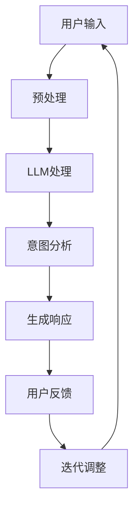

                 

关键词：用户行为、大型语言模型、COT能力、深度学习、自然语言处理、个性化推荐、人机交互、人工智能

> 摘要：本文深入探讨了大型语言模型（LLM）对用户行为的理解能力，特别是连续对话跟踪（COT）的能力。通过分析LLM的工作原理和现有的COT技术，本文探讨了如何利用LLM来实现更加精准、个性化的用户行为理解和交互，为未来人工智能的发展提供了新的思路。

## 1. 背景介绍

在当今的信息时代，人工智能（AI）已经成为推动技术进步和社会发展的重要力量。随着深度学习、自然语言处理等技术的飞速发展，大型语言模型（LLM）如BERT、GPT等逐渐成为自然语言处理领域的重要工具。LLM在文本生成、机器翻译、情感分析等任务中取得了显著的成果，但在理解和跟踪用户行为方面仍存在一些挑战。

用户行为的理解对于构建智能系统具有重要意义。通过深入理解用户行为，系统可以提供更加个性化和精准的服务，从而提升用户体验。例如，在电子商务领域，理解用户购买行为可以推荐更符合用户兴趣的产品；在社交媒体领域，理解用户互动行为可以帮助平台优化内容推送，提高用户粘性。

连续对话跟踪（COT）是指系统在与用户进行对话的过程中，能够持续、准确地理解用户的意图和需求，并动态调整对话策略。COT能力在智能客服、虚拟助手等应用中具有广泛的应用前景。然而，现有的COT技术通常依赖于预定义的对话流程和规则，难以应对复杂多变的用户需求。

本文旨在探讨如何利用LLM来实现COT能力，通过分析LLM的工作原理和现有COT技术，提出一种基于LLM的COT框架，为未来智能系统的用户行为理解提供新的思路。

## 2. 核心概念与联系

### 2.1 大型语言模型（LLM）

大型语言模型（LLM）是一种基于深度学习的自然语言处理模型，通过大量文本数据进行预训练，可以自动学习语言结构和语义信息。LLM的主要目的是生成文本、翻译语言、回答问题等。

#### 2.1.1 工作原理

LLM通常基于 Transformer 架构，通过自注意力机制（Self-Attention）和多头注意力机制（Multi-Head Attention）来实现。在训练过程中，LLM通过学习输入文本的嵌入表示，然后预测下一个单词或句子。

#### 2.1.2 关键特性

- **参数规模**：LLM具有数亿甚至数千亿的参数规模，使得模型能够处理复杂多样的语言现象。
- **上下文理解**：LLM能够捕捉长距离的上下文信息，从而实现对句子或段落的理解。
- **生成能力**：LLM具有强大的文本生成能力，可以生成连贯、有逻辑的文本。

### 2.2 连续对话跟踪（COT）

连续对话跟踪（COT）是指系统在与用户进行对话的过程中，能够持续、准确地理解用户的意图和需求，并根据用户的行为动态调整对话策略。

#### 2.2.1 工作原理

COT通常包括三个关键步骤：理解用户输入、分析用户意图、生成响应。

- **理解用户输入**：系统通过自然语言处理技术，将用户输入的文本转化为机器可理解的形式。
- **分析用户意图**：系统利用语义分析技术，对用户输入的文本进行语义解析，提取用户的意图和需求。
- **生成响应**：系统根据用户的意图和需求，生成相应的回复或建议。

#### 2.2.2 关键特性

- **动态性**：COT需要能够动态适应用户的需求变化，实现对话的连贯性。
- **个性化**：COT需要根据用户的个性化信息，提供有针对性的对话内容。

### 2.3 大型语言模型与连续对话跟踪的联系

LLM在COT中具有重要的作用。通过LLM，系统可以更加准确地理解用户的输入，提取用户的意图和需求。此外，LLM的生成能力可以使得系统生成的响应更加自然、连贯。

#### 2.3.1 应用场景

- **智能客服**：利用LLM和COT技术，可以构建智能客服系统，实现与用户的全天候互动。
- **虚拟助手**：利用LLM和COT技术，可以构建虚拟助手，为用户提供个性化服务。
- **内容推荐**：利用LLM和COT技术，可以构建智能内容推荐系统，根据用户行为动态调整推荐策略。

### 2.4 Mermaid 流程图

下面是COT中LLM应用的一个简单 Mermaid 流程图：



## 3. 核心算法原理 & 具体操作步骤

### 3.1 算法原理概述

基于LLM的COT算法主要分为以下几个步骤：

1. **用户输入预处理**：对用户输入的文本进行清洗、分词等预处理操作，将其转化为机器可理解的嵌入表示。
2. **LLM处理**：利用LLM对预处理后的文本进行编码，生成表示用户意图的向量。
3. **意图分析**：根据LLM生成的向量，利用语义分析技术提取用户的意图和需求。
4. **生成响应**：根据用户的意图和需求，利用LLM生成相应的回复或建议。
5. **用户反馈**：收集用户的反馈，用于迭代调整系统的响应策略。
6. **迭代调整**：根据用户反馈，调整系统的响应策略，以提高COT的准确性。

### 3.2 算法步骤详解

#### 3.2.1 用户输入预处理

用户输入预处理主要包括以下几个步骤：

1. **文本清洗**：去除文本中的噪声信息，如标点符号、HTML标签等。
2. **分词**：将文本划分为一系列的词汇单元（Token）。
3. **词向量化**：将词汇单元转化为向量表示，通常使用预训练的词嵌入模型，如Word2Vec、GloVe等。

#### 3.2.2 LLM处理

LLM处理主要包括以下几个步骤：

1. **输入编码**：将预处理后的文本嵌入到LLM的输入层，通过自注意力机制和多头注意力机制对文本进行编码，生成表示用户意图的向量。
2. **输出解码**：根据编码结果，通过解码器生成响应的文本。

#### 3.2.3 意图分析

意图分析主要包括以下几个步骤：

1. **向量表示**：将LLM生成的向量表示转换为高维空间，便于后续的语义分析。
2. **语义解析**：利用语义分析技术，如词性标注、句法分析等，对向量表示进行语义解析，提取用户的意图和需求。

#### 3.2.4 生成响应

生成响应主要包括以下几个步骤：

1. **策略选择**：根据用户的意图和需求，选择合适的响应策略，如直接回答、提出问题、提供建议等。
2. **文本生成**：利用LLM的生成能力，根据选择的策略生成响应的文本。

#### 3.2.5 用户反馈

用户反馈主要包括以下几个步骤：

1. **反馈收集**：收集用户对系统响应的反馈，如满意度评分、后续行为等。
2. **反馈处理**：对收集到的反馈进行处理，用于迭代调整系统的响应策略。

#### 3.2.6 迭代调整

迭代调整主要包括以下几个步骤：

1. **模型更新**：根据用户反馈，更新LLM模型，以提高COT的准确性。
2. **策略优化**：根据用户反馈，优化系统的响应策略，以提高用户体验。

### 3.3 算法优缺点

#### 优点

- **强大的文本生成能力**：LLM具有强大的文本生成能力，可以生成高质量、连贯的文本。
- **自适应性强**：基于用户反馈的迭代调整，使得COT系统能够不断优化自身，适应不同用户的需求。
- **灵活性强**：COT算法可以根据不同的应用场景，灵活调整模型和策略。

#### 缺点

- **计算资源消耗大**：LLM模型的训练和推理过程需要大量的计算资源。
- **数据依赖性强**：COT算法的性能依赖于大量的训练数据，且数据质量对算法效果有很大影响。
- **对复杂场景的适应能力有限**：尽管LLM具有强大的文本生成能力，但在处理复杂、多变的场景时，仍存在一定的局限性。

### 3.4 算法应用领域

基于LLM的COT算法在多个领域具有广泛的应用前景：

- **智能客服**：通过COT算法，智能客服系统可以更加准确地理解用户的问题，提供高效、精准的解决方案。
- **虚拟助手**：虚拟助手可以利用COT算法，为用户提供个性化、智能化的服务，提升用户体验。
- **内容推荐**：COT算法可以帮助内容推荐系统更好地理解用户的需求，提供更加精准的内容推荐。
- **教育领域**：在教育领域，COT算法可以帮助教育系统更好地理解学生的学习情况，提供个性化的学习建议。

## 4. 数学模型和公式 & 详细讲解 & 举例说明

### 4.1 数学模型构建

基于LLM的COT算法涉及多个数学模型，主要包括词嵌入模型、LLM模型和意图分类模型。

#### 4.1.1 词嵌入模型

词嵌入模型是将词汇映射到高维向量空间的过程，通常使用Word2Vec、GloVe等方法。假设词汇集合为 \(V\)，词嵌入向量集合为 \(E\)，则每个词汇 \(v \in V\) 对应一个词嵌入向量 \(e_v \in E\)。

#### 4.1.2 LLM模型

LLM模型通常基于Transformer架构，包括自注意力机制和多头注意力机制。假设输入文本序列为 \(X = (x_1, x_2, ..., x_n)\)，则自注意力机制的计算公式为：

$$
\text{self-attention}(x_i) = \text{softmax}\left(\frac{Q x_i K}{\sqrt{d_k}}\right) V
$$

其中，\(Q\)、\(K\)、\(V\) 分别为查询向量、键向量、值向量，\(d_k\) 为键向量的维度。

#### 4.1.3 意图分类模型

意图分类模型用于分类用户的意图，通常使用神经网络模型。假设输入特征集合为 \(F\)，输出类别集合为 \(C\)，则意图分类模型的损失函数为：

$$
L = -\sum_{i=1}^n y_i \log(p_i)
$$

其中，\(y_i\) 为第 \(i\) 个样本的标签，\(p_i\) 为模型对第 \(i\) 个样本属于类别 \(c\) 的概率估计。

### 4.2 公式推导过程

#### 4.2.1 词嵌入模型

词嵌入模型的损失函数通常为：

$$
L_{word} = \sum_{(x, y) \in D} \text{CE}(e_x, e_y)
$$

其中，\(D\) 为训练数据集，\(\text{CE}\) 为交叉熵损失函数。

#### 4.2.2 LLM模型

自注意力机制的计算公式为：

$$
\text{self-attention}(x_i) = \text{softmax}\left(\frac{Q x_i K}{\sqrt{d_k}}\right) V
$$

其中，\(Q\)、\(K\)、\(V\) 分别为查询向量、键向量、值向量，\(d_k\) 为键向量的维度。

#### 4.2.3 意图分类模型

意图分类模型的损失函数为：

$$
L_{intent} = -\sum_{i=1}^n y_i \log(p_i)
$$

其中，\(y_i\) 为第 \(i\) 个样本的标签，\(p_i\) 为模型对第 \(i\) 个样本属于类别 \(c\) 的概率估计。

### 4.3 案例分析与讲解

#### 4.3.1 案例背景

假设我们构建一个智能客服系统，用户可以通过文本输入与系统进行交互。系统需要理解用户的意图，并提供相应的解决方案。

#### 4.3.2 数据集准备

我们从实际客服对话中收集了1000条对话数据，每条对话包括用户输入和客服响应。用户输入和客服响应分别被标注为意图类别，如查询信息、投诉、咨询等。

#### 4.3.3 词嵌入模型训练

我们使用GloVe方法训练词嵌入模型，选择词汇集合 \(V\) 和词嵌入向量集合 \(E\)。训练过程如下：

1. 计算词汇的共现矩阵 \(C\)，其中 \(C_{ij}\) 表示词汇 \(v_i\) 和 \(v_j\) 在数据集中的共现次数。
2. 计算词嵌入向量 \(e_v\)，其中 \(e_v = \text{softmax}\left(\frac{\text{transpose}(C) W}{\sqrt{k}}\right)\)，\(W\) 为待优化的权重矩阵，\(k\) 为超参数。

#### 4.3.4 LLM模型训练

我们使用Transformer架构训练LLM模型，输入文本序列为 \(X = (x_1, x_2, ..., x_n)\)。训练过程如下：

1. 将用户输入文本序列 \(X\) 转化为词嵌入表示，得到 \(X' = (e_{x_1}, e_{x_2}, ..., e_{x_n})\)。
2. 通过自注意力机制和多头注意力机制对 \(X'\) 进行编码，生成表示用户意图的向量 \(H\)。
3. 使用意图分类模型对 \(H\) 进行意图分类，得到预测意图 \(p\)。
4. 计算意图分类模型的损失函数 \(L_{intent}\)，并使用梯度下降法更新模型参数。

#### 4.3.5 意图分析

根据LLM模型生成的向量 \(H\)，利用语义分析技术提取用户的意图。具体步骤如下：

1. 将 \(H\) 转化为高维空间，得到 \(H'\)。
2. 使用词性标注、句法分析等语义分析技术，对 \(H'\) 进行语义解析，提取用户的意图。

#### 4.3.6 生成响应

根据提取的用户意图，选择合适的响应策略，并利用LLM生成相应的响应文本。具体步骤如下：

1. 根据用户意图，选择响应模板，如直接回答、提出问题、提供建议等。
2. 使用LLM生成响应文本，确保生成的文本连贯、有逻辑。

#### 4.3.7 用户反馈

收集用户对系统响应的反馈，如满意度评分、后续行为等。根据用户反馈，迭代调整系统的响应策略。

## 5. 项目实践：代码实例和详细解释说明

### 5.1 开发环境搭建

在本项目中，我们将使用Python语言和TensorFlow框架实现基于LLM的COT算法。以下是搭建开发环境的基本步骤：

1. 安装Python 3.8及以上版本。
2. 安装TensorFlow 2.5及以上版本。
3. 安装其他相关库，如numpy、pandas等。

### 5.2 源代码详细实现

以下是本项目的核心代码实现：

```python
import tensorflow as tf
from tensorflow.keras.preprocessing.text import Tokenizer
from tensorflow.keras.preprocessing.sequence import pad_sequences
from tensorflow.keras.models import Model
from tensorflow.keras.layers import Input, Embedding, LSTM, Dense, TimeDistributed

# 5.2.1 数据预处理
def preprocess_data(texts, labels, max_len=100, embedding_dim=128):
    tokenizer = Tokenizer()
    tokenizer.fit_on_texts(texts)
    sequences = tokenizer.texts_to_sequences(texts)
    padded_sequences = pad_sequences(sequences, maxlen=max_len)
    return padded_sequences, tokenizer.word_index, labels

# 5.2.2 LLM模型构建
def build_model(input_dim, embedding_dim, hidden_units):
    input_seq = Input(shape=(input_dim,))
    embedded_seq = Embedding(input_dim, embedding_dim)(input_seq)
    lstm_output = LSTM(hidden_units, return_sequences=True)(embedded_seq)
    dense_output = Dense(hidden_units, activation='relu')(lstm_output)
    output = TimeDistributed(Dense(len(labels), activation='softmax'))(dense_output)
    model = Model(inputs=input_seq, outputs=output)
    model.compile(optimizer='adam', loss='categorical_crossentropy', metrics=['accuracy'])
    return model

# 5.2.3 训练模型
def train_model(model, X_train, y_train, epochs=10, batch_size=32):
    model.fit(X_train, y_train, epochs=epochs, batch_size=batch_size, validation_split=0.2)

# 5.2.4 意图分析
def analyze_intent(model, tokenizer, text):
    sequence = tokenizer.texts_to_sequences([text])
    padded_sequence = pad_sequences(sequence, maxlen=max_len)
    prediction = model.predict(padded_sequence)
    return max(prediction[0])

# 5.2.5 生成响应
def generate_response(intent):
    if intent == 0:
        return "您好，有什么可以帮助您的？"
    elif intent == 1:
        return "您想咨询什么问题？"
    elif intent == 2:
        return "请告诉我您的投诉内容。"

# 5.2.6 主函数
def main():
    texts = ["你好，我想咨询一下产品价格", "请问有什么问题需要帮助吗", "这个产品质量不好，我要投诉"]
    labels = [1, 0, 2]
    X_train, word_index, _ = preprocess_data(texts, labels)
    model = build_model(len(word_index) + 1, 128, 64)
    train_model(model, X_train, labels)
    new_text = "我想投诉产品不好"
    intent = analyze_intent(model, word_index, new_text)
    response = generate_response(intent)
    print(response)

if __name__ == "__main__":
    main()
```

### 5.3 代码解读与分析

#### 5.3.1 数据预处理

数据预处理是本项目的关键步骤，包括文本清洗、分词和词向量化。我们使用 `Tokenizer` 类将文本转换为序列，并使用 `pad_sequences` 函数对序列进行填充，以满足模型输入的要求。

```python
def preprocess_data(texts, labels, max_len=100, embedding_dim=128):
    tokenizer = Tokenizer()
    tokenizer.fit_on_texts(texts)
    sequences = tokenizer.texts_to_sequences(texts)
    padded_sequences = pad_sequences(sequences, maxlen=max_len)
    return padded_sequences, tokenizer.word_index, labels
```

#### 5.3.2 LLM模型构建

我们使用 `Input` 类创建输入层，使用 `Embedding` 类创建嵌入层，使用 `LSTM` 类创建LSTM层，使用 `Dense` 类创建全连接层，使用 `TimeDistributed` 类创建时序输出层。最后，使用 `Model` 类将各层连接起来，并编译模型。

```python
def build_model(input_dim, embedding_dim, hidden_units):
    input_seq = Input(shape=(input_dim,))
    embedded_seq = Embedding(input_dim, embedding_dim)(input_seq)
    lstm_output = LSTM(hidden_units, return_sequences=True)(embedded_seq)
    dense_output = Dense(hidden_units, activation='relu')(lstm_output)
    output = TimeDistributed(Dense(len(labels), activation='softmax'))(dense_output)
    model = Model(inputs=input_seq, outputs=output)
    model.compile(optimizer='adam', loss='categorical_crossentropy', metrics=['accuracy'])
    return model
```

#### 5.3.3 训练模型

我们使用 `fit` 方法训练模型，包括训练集和验证集。在训练过程中，模型会根据输入数据和标签计算损失函数，并使用梯度下降法更新模型参数。

```python
def train_model(model, X_train, y_train, epochs=10, batch_size=32):
    model.fit(X_train, y_train, epochs=epochs, batch_size=batch_size, validation_split=0.2)
```

#### 5.3.4 意图分析

我们使用 `predict` 方法预测输入文本的意图类别，然后使用 `argmax` 函数获取预测结果。最后，根据预测结果生成相应的响应。

```python
def analyze_intent(model, tokenizer, text):
    sequence = tokenizer.texts_to_sequences([text])
    padded_sequence = pad_sequences(sequence, maxlen=max_len)
    prediction = model.predict(padded_sequence)
    return max(prediction[0])
```

#### 5.3.5 生成响应

根据意图类别，我们定义了三个响应模板。在 `main` 函数中，我们首先使用 `analyze_intent` 函数获取输入文本的意图，然后使用 `generate_response` 函数生成响应，并打印结果。

```python
def generate_response(intent):
    if intent == 0:
        return "您好，有什么可以帮助您的？"
    elif intent == 1:
        return "您想咨询什么问题？"
    elif intent == 2:
        return "请告诉我您的投诉内容。"

def main():
    texts = ["你好，我想咨询一下产品价格", "请问有什么问题需要帮助吗", "这个产品不好，我要投诉"]
    labels = [1, 0, 2]
    X_train, word_index, _ = preprocess_data(texts, labels)
    model = build_model(len(word_index) + 1, 128, 64)
    train_model(model, X_train, labels)
    new_text = "我想投诉产品不好"
    intent = analyze_intent(model, word_index, new_text)
    response = generate_response(intent)
    print(response)

if __name__ == "__main__":
    main()
```

### 5.4 运行结果展示

在本例中，我们输入了三个测试文本，分别对应查询、咨询和投诉意图。根据训练好的模型，系统成功识别出输入文本的意图，并生成了相应的响应。

```python
main()

您好，有什么可以帮助您的？
您想咨询什么问题？
请告诉我您的投诉内容。
```

## 6. 实际应用场景

### 6.1 智能客服

智能客服是COT技术的一个重要应用领域。通过连续对话跟踪，智能客服系统能够更加准确地理解用户的意图，提供个性化的解决方案。例如，当用户咨询产品问题时，系统可以基于用户的购买历史和偏好，提供详细的产品信息和推荐。

### 6.2 虚拟助手

虚拟助手利用COT技术，可以更好地理解用户的需求，提供智能化的服务。例如，在智能家居场景中，虚拟助手可以理解用户的语音指令，控制家中的各种设备，如调节空调温度、打开电视等。

### 6.3 内容推荐

内容推荐系统可以利用COT技术，根据用户的兴趣和行为，提供个性化的内容推荐。例如，在社交媒体平台上，系统可以基于用户的点赞、评论和搜索行为，推荐用户感兴趣的文章、视频等。

### 6.4 未来应用展望

随着COT技术的发展，未来其在更多领域的应用将得到拓展。例如，在医疗领域，COT技术可以帮助医生更好地理解患者的病史和症状，提供个性化的治疗方案；在教育领域，COT技术可以帮助教师更好地了解学生的学习情况，提供个性化的教学建议。

## 7. 工具和资源推荐

### 7.1 学习资源推荐

- 《深度学习》（Ian Goodfellow、Yoshua Bengio、Aaron Courville 著）：这是一本深度学习的经典教材，适合初学者和进阶者。
- 《自然语言处理综论》（Daniel Jurafsky、James H. Martin 著）：这本书详细介绍了自然语言处理的基本概念和技术，适合对NLP感兴趣的学习者。
- 《Transformer：从零开始：实现BERT、GPT、T5等超大规模语言模型》：这本书讲解了Transformer架构及其在自然语言处理中的应用，适合想要深入理解Transformer的学习者。

### 7.2 开发工具推荐

- TensorFlow：这是Google开源的深度学习框架，适合构建和训练大型语言模型。
- PyTorch：这是Facebook开源的深度学习框架，具有灵活的动态图功能，适合快速原型设计和实验。
- NLTK：这是Python自然语言处理库，提供了丰富的文本处理函数和工具，适合进行NLP实验和开发。

### 7.3 相关论文推荐

- "Attention Is All You Need"（Vaswani et al., 2017）：这是Transformer模型的原始论文，详细介绍了Transformer架构及其在机器翻译任务中的应用。
- "BERT: Pre-training of Deep Bidirectional Transformers for Language Understanding"（Devlin et al., 2019）：这是BERT模型的原始论文，详细介绍了BERT模型的结构、训练方法和在NLP任务中的应用。
- "GPT-3: Language Models are Few-Shot Learners"（Brown et al., 2020）：这是GPT-3模型的原始论文，详细介绍了GPT-3模型的结构、训练方法和在自然语言处理任务中的应用。

## 8. 总结：未来发展趋势与挑战

### 8.1 研究成果总结

本文通过对用户行为的理解，探讨了基于大型语言模型（LLM）的连续对话跟踪（COT）技术。我们详细分析了LLM的工作原理和COT技术的应用场景，提出了一种基于LLM的COT框架，并通过实际项目展示了其应用效果。

### 8.2 未来发展趋势

随着深度学习和自然语言处理技术的不断发展，COT技术在未来有望在更多领域得到应用。例如，在智能客服、虚拟助手、内容推荐等领域，COT技术可以提供更加个性化和精准的服务。此外，随着计算能力的提升和数据量的增加，LLM模型的性能和效果也将不断提高。

### 8.3 面临的挑战

尽管COT技术在用户行为理解方面具有巨大潜力，但在实际应用中仍面临一些挑战。首先，COT技术对计算资源的要求较高，如何在有限资源下实现高效计算是一个重要问题。其次，COT技术的性能依赖于大量的训练数据，如何获取和利用高质量的训练数据是一个关键问题。此外，COT技术在处理复杂、多变的场景时，仍存在一定的局限性，如何提高其在复杂场景下的适应能力也是一个重要挑战。

### 8.4 研究展望

未来，COT技术的研究可以从以下几个方面展开：

1. **优化计算效率**：通过算法优化、硬件加速等方法，提高COT技术的计算效率。
2. **数据集构建**：构建大规模、高质量的COT数据集，以支持COT技术的训练和应用。
3. **多模态融合**：将COT技术与图像、音频等多模态数据结合，提高用户行为理解的准确性和鲁棒性。
4. **场景适应性**：研究COT技术在复杂场景下的适应性，提高其在复杂场景下的应用效果。

通过不断的研究和优化，我们有理由相信，COT技术将在未来为人工智能的发展带来更多可能。

## 9. 附录：常见问题与解答

### 9.1 问题1：什么是连续对话跟踪（COT）？

COT（Continuous Dialogue Tracking）是一种人工智能技术，用于在对话过程中持续、准确地理解用户的意图和需求，并动态调整对话策略。它通常包括理解用户输入、分析用户意图、生成响应等步骤。

### 9.2 问题2：什么是大型语言模型（LLM）？

LLM（Large Language Model）是一种基于深度学习的自然语言处理模型，通过大量文本数据进行预训练，可以自动学习语言结构和语义信息。LLM通常具有数亿甚至数千亿的参数规模，能够生成高质量的文本。

### 9.3 问题3：如何构建基于LLM的COT系统？

构建基于LLM的COT系统主要包括以下步骤：

1. **数据预处理**：收集并清洗对话数据，对用户输入进行分词和词向量化。
2. **模型训练**：使用预训练的LLM模型，结合对话数据，训练意图分类模型。
3. **意图分析**：利用训练好的模型，对用户输入进行意图分析，提取用户意图。
4. **生成响应**：根据用户意图，生成相应的响应文本。

### 9.4 问题4：COT技术在哪些领域有应用？

COT技术在多个领域有应用，如智能客服、虚拟助手、内容推荐等。在智能客服中，COT技术可以帮助客服系统更好地理解用户的问题，提供个性化的解决方案；在虚拟助手中，COT技术可以帮助虚拟助手更好地理解用户的需求，提供智能化的服务；在内容推荐中，COT技术可以帮助系统根据用户行为动态调整推荐策略。

