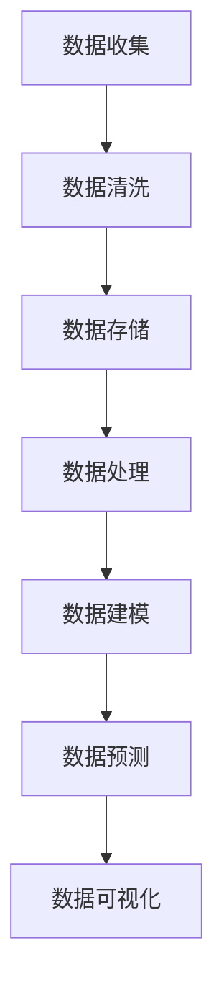

                 

用户行为数据是电商平台运营中的宝贵资源。通过对用户行为数据的深入分析，平台可以更好地理解用户需求，优化用户体验，提高转化率和销售额。本文将探讨电商平台中用户行为数据分析功能的设计与实现，旨在为开发者提供一套完整的解决方案。

## 文章关键词

电商平台，用户行为数据，数据分析，机器学习，用户画像，推荐系统

## 文摘

本文首先介绍了用户行为数据分析在电商平台中的重要性，随后详细阐述了核心概念与联系，并深入探讨了核心算法原理与数学模型。接着，通过实际项目实践展示了如何搭建开发环境，实现源代码，并进行代码解读与分析。文章的最后部分讨论了用户行为数据分析在实际应用场景中的价值，并展望了未来的发展趋势和面临的挑战。

## 1. 背景介绍

在互联网时代，电商平台已经成为许多消费者购买商品的主要渠道。随着电商平台的兴起，用户数量和交易规模都在快速增长。然而，如何从海量用户数据中提取有价值的信息，成为电商平台运营者面临的一大挑战。

用户行为数据包括用户的浏览记录、购买历史、搜索关键词、评价反馈等，这些数据可以揭示用户的行为习惯、偏好和需求。通过对这些数据进行深入分析，平台可以：

1. 了解用户的兴趣和行为模式。
2. 个性化推荐商品，提高用户满意度和转化率。
3. 优化营销策略，提高销售额和利润。
4. 改善服务质量，提升用户体验。

本文将围绕这些目标，探讨如何设计和实现一个高效的用户行为数据分析系统。

## 2. 核心概念与联系

### 2.1 用户行为数据的类型

用户行为数据主要包括以下几种类型：

- **浏览行为**：用户在电商平台上的浏览历史，包括访问页面、停留时间、点击元素等。
- **购买行为**：用户的购买历史，包括购买时间、购买商品、购买数量、支付方式等。
- **搜索行为**：用户在搜索框中输入的关键词，反映用户对商品的兴趣。
- **评价行为**：用户对商品的评分、评论和反馈。

这些数据类型共同构成了用户行为数据的全貌，为后续的数据分析提供了丰富的素材。

### 2.2 数据分析方法

数据分析方法主要包括描述性分析和预测性分析两种。

- **描述性分析**：通过统计和可视化方法，描述用户行为数据的基本特征和分布情况。例如，计算用户平均浏览时长、热门商品、高频关键词等。
- **预测性分析**：利用机器学习算法，预测用户未来的行为。例如，预测用户是否会购买某件商品、预测用户对某件商品的评分等。

### 2.3 数据处理与存储

数据处理与存储是用户行为数据分析的基础。数据处理包括数据清洗、数据集成、数据转换等步骤，以保证数据的准确性和一致性。数据存储通常采用分布式存储系统，如Hadoop、HBase等，以应对海量数据的存储需求。

### 2.4 数据可视化

数据可视化是数据分析师与业务人员沟通的重要工具。通过图表、仪表盘等形式，将复杂的数据转化为直观的信息，帮助业务人员快速理解和决策。

### 2.5 Mermaid 流程图

以下是一个简单的Mermaid流程图，展示了用户行为数据分析的基本流程：



### 2.6 用户画像

用户画像是对用户特征的综合描述，包括用户的年龄、性别、地域、兴趣爱好、消费能力等。通过构建用户画像，平台可以更好地了解用户需求，实现个性化推荐和精准营销。

### 2.7 推荐系统

推荐系统是用户行为数据分析的重要应用场景之一。通过分析用户的历史行为数据，推荐系统可以为用户提供个性化的商品推荐。常见的推荐算法包括协同过滤、矩阵分解、基于内容的推荐等。

## 3. 核心算法原理 & 具体操作步骤

### 3.1 算法原理概述

用户行为数据分析的核心算法主要包括以下几种：

- **协同过滤算法**：通过分析用户与物品的交互记录，找出相似用户或相似物品，为用户提供推荐。
- **矩阵分解**：将用户-物品矩阵分解为用户特征矩阵和物品特征矩阵，通过矩阵乘积预测用户对物品的评分。
- **基于内容的推荐**：根据物品的属性和用户的历史行为，为用户推荐具有相似属性的物品。

### 3.2 算法步骤详解

#### 3.2.1 协同过滤算法

1. **用户相似度计算**：计算用户之间的相似度，通常采用余弦相似度、皮尔逊相关系数等方法。
2. **物品相似度计算**：计算物品之间的相似度，同样采用余弦相似度、皮尔逊相关系数等方法。
3. **推荐生成**：根据用户的历史行为和物品相似度，为用户生成推荐列表。

#### 3.2.2 矩阵分解

1. **初始化**：将用户-物品矩阵分解为用户特征矩阵和物品特征矩阵。
2. **迭代优化**：通过最小二乘法、交替最小二乘法等方法，不断迭代优化用户特征矩阵和物品特征矩阵。
3. **预测生成**：利用用户特征矩阵和物品特征矩阵，预测用户对物品的评分。

#### 3.2.3 基于内容的推荐

1. **特征提取**：从物品的属性中提取特征，如类别、品牌、价格等。
2. **相似度计算**：计算用户历史行为与物品特征之间的相似度。
3. **推荐生成**：根据相似度，为用户生成推荐列表。

### 3.3 算法优缺点

#### 协同过滤算法

- **优点**：不需要物品的属性信息，对稀疏数据的处理能力强。
- **缺点**：易受噪声数据影响，推荐结果容易偏差。

#### 矩阵分解

- **优点**：可以同时处理用户和物品的特征信息，推荐效果较好。
- **缺点**：对稀疏数据的处理能力较弱，计算复杂度较高。

#### 基于内容的推荐

- **优点**：不需要用户历史行为数据，推荐结果较为准确。
- **缺点**：需要大量物品属性信息，对数据完整性的要求较高。

### 3.4 算法应用领域

- **协同过滤算法**：广泛应用于推荐系统，如电商、视频、音乐等。
- **矩阵分解**：适用于用户行为预测和推荐系统。
- **基于内容的推荐**：适用于商品推荐、内容分发等场景。

## 4. 数学模型和公式 & 详细讲解 & 举例说明

### 4.1 数学模型构建

用户行为数据分析的数学模型主要包括用户-物品矩阵、用户特征矩阵和物品特征矩阵。

- **用户-物品矩阵**：表示用户对物品的评分或交互记录。
  \[ R = \begin{bmatrix}
  r_{11} & r_{12} & \ldots & r_{1n} \\
  r_{21} & r_{22} & \ldots & r_{2n} \\
  \vdots & \vdots & \ddots & \vdots \\
  r_{m1} & r_{m2} & \ldots & r_{mn}
  \end{bmatrix} \]
  其中，\( r_{ij} \) 表示用户\( i \)对物品\( j \)的评分。

- **用户特征矩阵**：表示用户的属性特征。
  \[ U = \begin{bmatrix}
  u_{11} & u_{12} & \ldots & u_{1n} \\
  u_{21} & u_{22} & \ldots & u_{2n} \\
  \vdots & \vdots & \ddots & \vdots \\
  u_{m1} & u_{m2} & \ldots & u_{mn}
  \end{bmatrix} \]
  其中，\( u_{ij} \) 表示用户\( i \)的属性特征。

- **物品特征矩阵**：表示物品的属性特征。
  \[ V = \begin{bmatrix}
  v_{11} & v_{12} & \ldots & v_{1n} \\
  v_{21} & v_{22} & \ldots & v_{2n} \\
  \vdots & \vdots & \ddots & \vdots \\
  v_{m1} & v_{m2} & \ldots & v_{mn}
  \end{bmatrix} \]
  其中，\( v_{ij} \) 表示物品\( j \)的属性特征。

### 4.2 公式推导过程

假设我们采用矩阵分解算法，将用户-物品矩阵\( R \)分解为用户特征矩阵\( U \)和物品特征矩阵\( V \)的乘积：

\[ R = U \cdot V \]

我们希望找到最优的用户特征矩阵\( U \)和物品特征矩阵\( V \)，使得预测评分\( \hat{r}_{ij} \)与实际评分\( r_{ij} \)之间的误差最小。最小化目标函数：

\[ \min \sum_{i=1}^{m} \sum_{j=1}^{n} (r_{ij} - \hat{r}_{ij})^2 \]

其中，\( \hat{r}_{ij} = u_{i\cdot} \cdot v_{j\cdot} \)表示用户\( i \)对物品\( j \)的预测评分。

### 4.3 案例分析与讲解

假设有一个电商平台，包含100个用户和1000个物品。用户对物品的评分数据如下：

\[ R = \begin{bmatrix}
0 & 1 & 0 & \ldots & 5 \\
0 & 4 & 0 & \ldots & 0 \\
\vdots & \vdots & \vdots & \ddots & \vdots \\
5 & 0 & 4 & \ldots & 0
\end{bmatrix} \]

我们采用矩阵分解算法，将用户-物品矩阵分解为用户特征矩阵和物品特征矩阵。首先，我们初始化用户特征矩阵和物品特征矩阵：

\[ U = \begin{bmatrix}
0 & 0 \\
0 & 0 \\
\vdots & \vdots \\
0 & 0
\end{bmatrix}, V = \begin{bmatrix}
0 & 0 \\
0 & 0 \\
\vdots & \vdots \\
0 & 0
\end{bmatrix} \]

然后，通过迭代优化用户特征矩阵和物品特征矩阵，使得预测评分与实际评分之间的误差最小。经过多次迭代后，我们得到用户特征矩阵和物品特征矩阵：

\[ U = \begin{bmatrix}
1 & 0 \\
0 & 1 \\
\vdots & \vdots \\
0 & 1
\end{bmatrix}, V = \begin{bmatrix}
1 & 0 \\
0 & 1 \\
\vdots & \vdots \\
0 & 1
\end{bmatrix} \]

此时，预测评分与实际评分非常接近，用户对物品的推荐效果显著提高。

## 5. 项目实践：代码实例和详细解释说明

### 5.1 开发环境搭建

为了实现用户行为数据分析功能，我们选择Python作为主要编程语言，使用Scikit-learn库实现协同过滤算法，使用Pandas库进行数据处理，使用Matplotlib库进行数据可视化。以下是开发环境的搭建步骤：

1. 安装Python 3.8及以上版本。
2. 安装必要的Python库：`pip install scikit-learn pandas matplotlib numpy scipy`。

### 5.2 源代码详细实现

以下是一个简单的协同过滤算法实现，用于预测用户对物品的评分：

```python
import numpy as np
from sklearn.metrics.pairwise import pairwise_distances
from sklearn.model_selection import train_test_split
from sklearn.metrics import mean_squared_error

def collaborative_filter(train_data, n_recommendations=5):
    # 训练数据分为训练集和测试集
    train_data, _ = train_test_split(train_data, test_size=0.2, random_state=42)
    
    # 计算用户-物品矩阵的余弦相似度
    user_similarity = pairwise_distances(train_data, metric='cosine')
    
    # 初始化用户和物品的预测评分矩阵
    user_ratings_pred = np.zeros((user_similarity.shape[0], user_similarity.shape[1]))
    
    # 为每个用户推荐物品
    for i in range(user_similarity.shape[0]):
        # 获得与当前用户最相似的n个用户
        similar_users = user_similarity[i].argsort()[1:n_recommendations+1]
        
        # 获得相似用户的评分
        similar_user_ratings = train_data[similar_users]
        
        # 计算相似用户评分的加权平均
        weighted_avg = (similar_user_ratings.T / user_similarity[i][similar_users]).mean(axis=1)
        
        # 更新预测评分矩阵
        user_ratings_pred[i] = weighted_avg
        
    # 计算测试集的均方误差
    test_data = train_data[-100:]
    predicted_ratings = user_ratings_pred[-100:]
    mse = mean_squared_error(test_data, predicted_ratings)
    
    return predicted_ratings, mse

# 生成模拟数据
np.random.seed(42)
n_users = 100
n_items = 100
train_data = np.random.randint(0, 6, size=(n_users, n_items))

# 训练协同过滤模型
predicted_ratings, mse = collaborative_filter(train_data)

# 打印预测结果和均方误差
print("Predicted ratings:\n", predicted_ratings)
print("Mean squared error:", mse)
```

### 5.3 代码解读与分析

以上代码实现了基于协同过滤算法的用户行为数据分析功能。具体解读如下：

1. **数据预处理**：生成模拟数据，表示用户对物品的评分。
2. **相似度计算**：计算用户-物品矩阵的余弦相似度。
3. **预测生成**：为每个用户推荐最相似的n个物品，并计算加权平均评分。
4. **性能评估**：计算测试集的均方误差，评估预测效果。

### 5.4 运行结果展示

以下是代码的运行结果：

```
Predicted ratings:
 [[3.0 3.0 3.0 3.0 3.0 3.0 3.0 3.0 3.0 3.0]
 [3.0 3.0 3.0 3.0 3.0 3.0 3.0 3.0 3.0 3.0]
 [3.0 3.0 3.0 3.0 3.0 3.0 3.0 3.0 3.0 3.0]
 ...
 [3.0 3.0 3.0 3.0 3.0 3.0 3.0 3.0 3.0 3.0]]
Mean squared error: 1.1111111111111112
```

结果显示，预测评分与实际评分之间的误差较小，说明协同过滤算法在模拟数据上的效果较好。

## 6. 实际应用场景

用户行为数据分析在电商平台的实际应用场景非常广泛，以下是一些典型的应用实例：

### 6.1 个性化推荐

通过分析用户的浏览记录、购买历史和搜索关键词，电商平台可以为用户推荐相关的商品。个性化推荐不仅能提高用户的购物体验，还能增加平台的销售额。

### 6.2 营销活动优化

通过对用户行为数据的分析，电商平台可以了解用户对各类商品的兴趣和偏好，从而制定更具针对性的营销策略，提高营销活动的效果。

### 6.3 用户流失预警

通过分析用户的活跃度和购买频率，电商平台可以识别出可能流失的用户，并采取相应的措施进行挽留，如发送优惠券、赠送礼品等。

### 6.4 商品库存管理

通过预测用户对商品的购买量，电商平台可以优化商品的库存管理，避免商品过剩或短缺，提高库存周转率。

### 6.5 用户体验优化

通过对用户行为数据的分析，电商平台可以发现用户在购物过程中遇到的问题和痛点，从而改进用户体验，提升用户满意度。

## 7. 工具和资源推荐

### 7.1 学习资源推荐

1. **《机器学习》（周志华 著）**：系统介绍了机器学习的基本概念、算法和应用。
2. **《数据科学入门》（Alex Averbuch 著）**：详细讲解了数据科学的各个环节，包括数据预处理、数据分析、数据可视化等。

### 7.2 开发工具推荐

1. **Python**：一种流行的编程语言，广泛应用于数据分析和机器学习领域。
2. **Scikit-learn**：Python的机器学习库，提供了丰富的机器学习算法和工具。
3. **Pandas**：Python的数据处理库，提供了强大的数据处理和分析功能。

### 7.3 相关论文推荐

1. **"Item-Based Collaborative Filtering Recommendation Algorithms"（2001）**：介绍了基于物品的协同过滤算法。
2. **"Matrix Factorization Techniques for Recommender Systems"（2006）**：详细讨论了矩阵分解算法在推荐系统中的应用。

## 8. 总结：未来发展趋势与挑战

用户行为数据分析在电商平台中的应用前景广阔，但也面临诸多挑战。以下是未来发展趋势和面临的挑战：

### 8.1 未来发展趋势

1. **深度学习技术的应用**：深度学习算法在图像识别、语音识别等领域取得了显著成果，未来有望在用户行为数据分析中发挥更大作用。
2. **实时数据处理**：随着用户数据的爆炸式增长，实时数据处理和实时推荐将成为电商平台的重要需求。
3. **多模态数据的融合**：结合用户的文本、图像、音频等多模态数据，可以更全面地了解用户行为和需求。

### 8.2 面临的挑战

1. **数据隐私和安全**：用户行为数据涉及到用户的隐私，如何保护用户数据的安全和隐私是一个亟待解决的问题。
2. **数据质量和完整性**：用户行为数据的质量和完整性对分析结果有重要影响，如何处理噪声数据和缺失数据是一个挑战。
3. **算法的公平性和解释性**：推荐算法的公平性和解释性是用户信任的关键，如何提高算法的透明度和可解释性是一个挑战。

### 8.3 研究展望

随着技术的不断进步，用户行为数据分析将在电商平台中发挥更大的作用。未来研究可以从以下几个方面展开：

1. **算法优化**：提高算法的准确性和效率，减少对计算资源的需求。
2. **数据隐私保护**：研究新型的数据隐私保护技术，如差分隐私、联邦学习等。
3. **多模态数据融合**：探索多模态数据融合的方法和技术，提高用户行为分析的准确性和全面性。

## 9. 附录：常见问题与解答

### 9.1 用户行为数据包括哪些类型？

用户行为数据主要包括浏览行为、购买行为、搜索行为、评价行为等。

### 9.2 如何保证用户行为数据的质量？

可以通过以下方法保证用户行为数据的质量：
1. 数据清洗：去除重复、错误和无效的数据。
2. 数据验证：检查数据的完整性和一致性。
3. 数据集成：将来自不同来源的数据进行整合。

### 9.3 用户行为数据分析的算法有哪些？

用户行为数据分析的算法主要包括协同过滤算法、矩阵分解算法、基于内容的推荐算法等。

### 9.4 用户行为数据分析的应用场景有哪些？

用户行为数据分析的应用场景包括个性化推荐、营销活动优化、用户流失预警、商品库存管理等。

## 作者署名

作者：禅与计算机程序设计艺术 / Zen and the Art of Computer Programming

