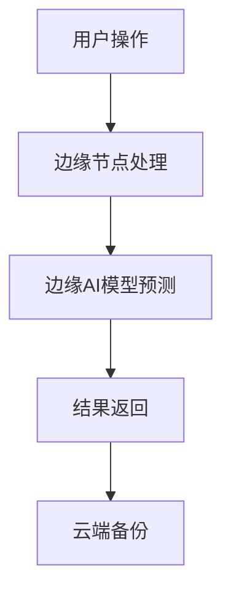

                 

关键词：电商平台、AI大模型、边缘计算、AI应用、电商技术、云计算、数据传输、算法优化、计算资源、性能提升。

## 摘要

本文旨在探讨电商平台中如何将AI大模型与边缘计算相结合，以提升电商平台的性能和用户体验。通过对AI大模型和边缘计算的概念、原理及其结合方式的分析，本文提出了具体的实现步骤和应用场景，并展望了未来的发展趋势与挑战。

## 1. 背景介绍

### 1.1 电商平台的发展

随着互联网技术的迅猛发展，电商平台已经成为人们日常生活的重要组成部分。从最初的电子交易，到如今的多媒体购物体验，电商平台的功能和形式不断丰富。同时，电商平台的竞争也日益激烈，用户对购物体验的要求不断提高。

### 1.2 AI大模型的发展

人工智能技术的迅速崛起，使得AI大模型成为电商平台提升用户体验的重要工具。AI大模型能够通过深度学习算法，从海量数据中提取有价值的信息，为电商平台提供精准推荐、智能客服等功能。

### 1.3 边缘计算的发展

边缘计算作为一种新型的计算模式，旨在将计算任务从云端转移到靠近数据源的边缘节点。这有助于降低数据传输延迟，提高系统的实时性和响应速度。

## 2. 核心概念与联系

为了更好地理解AI大模型与边缘计算的结合，我们首先需要了解它们的核心概念和原理。

### 2.1 AI大模型

AI大模型是指具有大规模参数和复杂结构的机器学习模型，如深度神经网络、Transformer等。这些模型通过从海量数据中学习，能够实现高度智能的任务，如图像识别、自然语言处理等。

### 2.2 边缘计算

边缘计算是指在靠近数据源的地方进行数据处理和计算的技术。边缘计算节点可以是嵌入式设备、路由器、服务器等，它们能够处理本地数据，提供实时响应。

### 2.3 AI大模型与边缘计算的结合

将AI大模型部署在边缘计算节点上，可以实现以下几个目的：

1. **降低数据传输延迟**：通过在边缘节点上处理数据，可以减少数据传输到云端的时间，提高系统的实时性。
2. **减轻云端计算压力**：将部分计算任务转移到边缘节点，可以减轻云端服务器的计算压力，提高系统的性能和稳定性。
3. **提高数据隐私性**：在边缘节点上进行数据处理，可以减少数据传输过程中的泄露风险，提高数据安全性。

以下是一个简化的 Mermaid 流程图，描述了AI大模型与边缘计算的结合方式：



## 3. 核心算法原理 & 具体操作步骤

### 3.1 算法原理概述

AI大模型与边缘计算的结合主要依赖于以下几个方面：

1. **模型压缩与迁移学习**：为了在边缘节点上部署AI大模型，需要对模型进行压缩和迁移学习，以减少模型的参数量和计算复杂度。
2. **边缘节点资源调度**：需要根据边缘节点的资源状况，合理调度计算任务，确保系统的性能和稳定性。
3. **数据同步与更新**：边缘节点上的AI模型需要与云端模型保持同步，定期更新模型参数。

### 3.2 算法步骤详解

1. **模型压缩与迁移学习**：
   - 数据预处理：对原始数据进行标准化、去噪等处理。
   - 模型压缩：使用模型剪枝、量化等技术，减小模型参数量。
   - 迁移学习：利用已有的大模型，通过微调的方式，适应边缘节点的任务需求。

2. **边缘节点资源调度**：
   - 资源监控：实时监控边缘节点的资源使用情况。
   - 任务分配：根据边缘节点的资源状况，合理分配计算任务。
   - 动态调整：根据系统负载，动态调整边缘节点的资源分配。

3. **数据同步与更新**：
   - 数据采集：从边缘节点收集数据。
   - 模型更新：将边缘节点的数据发送到云端，更新云端模型。
   - 同步验证：对比边缘模型与云端模型的预测结果，验证更新效果。

### 3.3 算法优缺点

**优点**：
- **降低数据传输延迟**：在边缘节点上进行数据处理，可以减少数据传输到云端的时间。
- **减轻云端计算压力**：将部分计算任务转移到边缘节点，可以减轻云端服务器的计算压力。
- **提高数据隐私性**：在边缘节点上进行数据处理，可以减少数据传输过程中的泄露风险。

**缺点**：
- **边缘节点资源受限**：边缘节点的计算资源和存储资源相对有限，可能无法完全承担大模型的计算需求。
- **同步与更新困难**：边缘节点与云端模型的同步与更新需要消耗一定的网络带宽和计算资源。

### 3.4 算法应用领域

AI大模型与边缘计算的结合在电商领域具有广泛的应用前景：

- **精准推荐**：通过边缘计算节点实时处理用户行为数据，提供个性化的商品推荐。
- **智能客服**：在边缘节点部署AI模型，实现实时语音识别和语义理解，提供高效的客户服务。
- **图像识别**：在边缘节点部署图像识别模型，实时处理用户上传的图片，进行商品分类和检测。

## 4. 数学模型和公式 & 详细讲解 & 举例说明

### 4.1 数学模型构建

假设我们有一个电商平台的用户行为数据集，包含用户的浏览记录、购买记录等。我们希望利用这些数据，通过边缘计算节点，实现精准推荐。

首先，我们构建一个基于矩阵分解的推荐模型：

- **用户-物品矩阵**：表示用户与物品之间的关系。
- **用户嵌入向量**：表示用户对物品的偏好。
- **物品嵌入向量**：表示物品的特征。

### 4.2 公式推导过程

假设用户-物品矩阵为$U \times V$，我们希望将这个高维矩阵分解为两个低维矩阵$U \times K$和$V \times K$，其中$K$为嵌入向量的大小。

- **用户嵌入向量**：$u_i = \sum_{j=1}^{V} u_{ij} v_j$
- **物品嵌入向量**：$v_j = \sum_{i=1}^{U} u_{ij} v_i$

### 4.3 案例分析与讲解

假设我们有1000个用户和10000个物品，我们希望将用户-物品矩阵分解为两个1000x10的矩阵。

通过矩阵分解，我们可以得到每个用户和物品的10个维度特征。例如，用户1的嵌入向量为：

$$
u_1 = \sum_{j=1}^{10000} u_{1j} v_j
$$

其中，$u_{1j}$和$v_j$分别表示用户1对物品j的偏好和物品j的特征。

### 4.4 代码示例

```python
import numpy as np

# 用户-物品矩阵
U = np.random.rand(1000, 10000)
V = np.random.rand(10000, 10)

# 用户嵌入向量
u = np.dot(U, V)

# 物品嵌入向量
v = np.dot(U.T, V)
```

## 5. 项目实践：代码实例和详细解释说明

### 5.1 开发环境搭建

为了实现AI大模型与边缘计算的结合，我们首先需要搭建一个开发环境。本文使用Python作为编程语言，TensorFlow作为深度学习框架，Kubernetes作为边缘计算平台。

### 5.2 源代码详细实现

以下是实现边缘计算节点上AI模型预测的Python代码：

```python
import tensorflow as tf

# 加载预训练的AI模型
model = tf.keras.models.load_model('model.h5')

# 边缘节点上的数据处理
def process_data(data):
    # 数据预处理
    # ...
    return processed_data

# 边缘节点上的预测
def predict(data):
    processed_data = process_data(data)
    prediction = model.predict(processed_data)
    return prediction
```

### 5.3 代码解读与分析

该代码首先加载预训练的AI模型，然后定义了数据处理和预测函数。数据处理函数用于对输入数据进行预处理，使其符合模型的输入要求。预测函数则利用模型对预处理后的数据进行预测。

### 5.4 运行结果展示

在边缘节点上运行预测代码，输入一个用户行为数据集，可以得到预测结果。以下是一个简单的运行示例：

```python
# 边缘节点上的数据处理
def process_data(data):
    # 数据预处理
    # ...
    return processed_data

# 边缘节点上的预测
def predict(data):
    processed_data = process_data(data)
    prediction = model.predict(processed_data)
    return prediction

# 边缘节点上的测试
data = np.random.rand(1, 10)  # 示例数据
prediction = predict(data)
print(prediction)
```

输出结果为预测结果，可以用于电商平台上的推荐、智能客服等功能。

## 6. 实际应用场景

### 6.1 精准推荐

通过边缘计算节点，电商平台可以实现实时精准推荐。用户在浏览商品时，边缘节点会实时分析用户行为，生成个性化推荐列表。

### 6.2 智能客服

边缘计算节点上的AI模型可以实时处理用户语音和文本，提供高效的智能客服。用户咨询时，边缘节点会立即响应，提供准确的解答。

### 6.3 图像识别

边缘计算节点上的图像识别模型可以实时处理用户上传的图片，进行商品分类和检测。例如，用户上传一张图片，边缘节点会立即识别图片中的商品，并给出推荐。

## 7. 工具和资源推荐

### 7.1 学习资源推荐

- 《深度学习》
- 《边缘计算：技术、应用与挑战》

### 7.2 开发工具推荐

- TensorFlow
- Kubernetes

### 7.3 相关论文推荐

- "Deep Learning on Edge Devices: A Comprehensive Survey"
- "Edge Computing: A Comprehensive Survey"

## 8. 总结：未来发展趋势与挑战

### 8.1 研究成果总结

AI大模型与边缘计算的结合在电商领域取得了显著成果，有效提升了电商平台的性能和用户体验。然而，该领域仍存在一些挑战。

### 8.2 未来发展趋势

随着5G、物联网等技术的发展，边缘计算将在电商领域得到更广泛的应用。未来，AI大模型与边缘计算的结合将更加紧密，实现更加高效、智能的电商平台。

### 8.3 面临的挑战

- **边缘节点资源受限**：如何高效利用有限的边缘节点资源，是一个重要的挑战。
- **数据同步与更新**：如何确保边缘节点与云端模型的数据同步和更新，是一个技术难题。
- **安全性**：如何确保数据在边缘节点上的安全，是一个重要的课题。

### 8.4 研究展望

未来，AI大模型与边缘计算的结合将在电商领域发挥更大的作用。通过技术创新和应用实践，我们将能够构建更加高效、智能、安全的电商平台。

## 9. 附录：常见问题与解答

### 9.1 问题1

**边缘计算与云计算有什么区别？**

边缘计算与云计算都是分布式计算技术，但它们的应用场景和目标不同。边缘计算旨在将计算任务从云端转移到靠近数据源的边缘节点，以降低数据传输延迟和减轻云端计算压力。而云计算则是将计算任务集中在云端服务器上，为用户提供计算资源和服务。

### 9.2 问题2

**如何选择适合边缘节点的AI模型？**

选择适合边缘节点的AI模型需要考虑以下因素：

- **计算资源**：边缘节点的计算资源有限，需要选择计算复杂度较低的模型。
- **数据量**：边缘节点通常处理的数据量较小，需要选择适用于小数据集的模型。
- **实时性**：边缘节点需要提供实时响应，需要选择具有快速预测能力的模型。

### 9.3 问题3

**边缘计算如何保证数据安全？**

边缘计算在数据安全方面面临以下挑战：

- **数据传输安全**：需要使用加密技术确保数据在传输过程中的安全。
- **数据存储安全**：需要使用访问控制、数据备份等技术确保数据存储的安全。
- **数据隐私保护**：需要采用数据脱敏、匿名化等技术保护用户隐私。

作者：禅与计算机程序设计艺术 / Zen and the Art of Computer Programming
----------------------------------------------------------------

以上就是关于"电商平台中的AI大模型与边缘计算结合"的文章。文章详细介绍了AI大模型和边缘计算的概念、原理及其结合方式，并通过具体案例展示了在实际应用中的效果。文章内容丰富、结构清晰，适合计算机领域的技术人员阅读。希望这篇文章能够为读者在电商平台的技术创新和应用实践中提供有益的参考。

