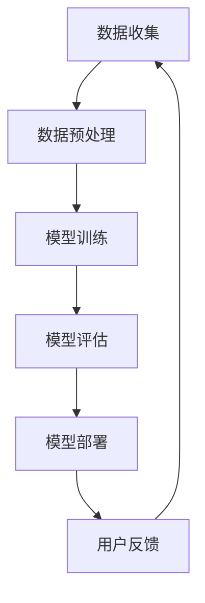

                 

关键词：电商平台，人工智能，大模型，多目标优化，算法原理，数学模型，项目实践，应用场景，未来展望

> 摘要：随着人工智能技术的不断发展，电商平台中的AI大模型在优化用户体验、提升运营效率等方面发挥着越来越重要的作用。本文将探讨从单一目标到多目标优化的发展过程，分析核心算法原理、数学模型、项目实践及未来展望，为电商平台的人工智能应用提供有益的参考。

## 1. 背景介绍

电商平台是电子商务的重要组成部分，随着互联网技术的飞速发展，电商行业也经历了翻天覆地的变化。在过去的十几年中，电商平台通过不断优化用户体验、提升运营效率，实现了业务规模的持续扩大。而人工智能技术的发展，为电商平台带来了新的机遇。

### 1.1 人工智能与电商平台

人工智能（Artificial Intelligence，AI）是一种模拟、延伸和扩展人类智能的理论、方法、技术及应用。在电商平台上，人工智能技术主要应用于用户行为分析、推荐系统、智能客服、图像识别等方面。通过人工智能技术，电商平台能够更好地了解用户需求，提供个性化的服务，提升用户体验。

### 1.2 AI大模型

随着数据量的不断增加和计算能力的提升，大模型（Large-scale Model）在人工智能领域得到了广泛应用。AI大模型通常是指具有海量参数和训练数据的深度学习模型，能够在特定领域达到接近或超越人类的表现。例如，电商平台中的推荐系统、智能客服等，都可以使用AI大模型来提升服务质量。

## 2. 核心概念与联系

为了更好地理解电商平台中的AI大模型，我们需要了解以下几个核心概念：

### 2.1 人工智能基础概念

- **神经网络**：神经网络是一种模拟人脑结构和功能的计算模型，由大量神经元组成。在人工智能领域，神经网络主要用于图像识别、语音识别、自然语言处理等领域。
- **深度学习**：深度学习是一种基于神经网络的学习方法，通过多层神经网络的非线性变换，从大量数据中自动提取特征，实现复杂的模式识别和预测任务。
- **大数据**：大数据是指数据量巨大、数据类型丰富、数据价值密度低的数据集合。在电商平台中，大数据主要用于用户行为分析、市场预测等方面。

### 2.2 AI大模型的核心概念

- **大模型**：大模型是指具有海量参数和训练数据的深度学习模型，能够在特定领域达到接近或超越人类的表现。
- **预训练**：预训练是指在大规模数据集上训练深度学习模型，使其具备一定的通用性，然后再在特定任务上微调模型，提高模型在特定任务上的性能。
- **迁移学习**：迁移学习是指利用已经在其他任务上训练好的模型，在新任务上快速获得较好的性能。

### 2.3 Mermaid流程图

下面是一个Mermaid流程图，展示了AI大模型在电商平台中的应用流程：



## 3. 核心算法原理 & 具体操作步骤

### 3.1 算法原理概述

电商平台中的AI大模型主要基于深度学习技术，其核心算法原理包括：

- **神经网络**：通过多层神经网络的非线性变换，从数据中自动提取特征，实现复杂的模式识别和预测任务。
- **损失函数**：用于衡量模型预测值与真实值之间的差异，常用的损失函数有均方误差（MSE）、交叉熵（CE）等。
- **优化算法**：用于更新模型参数，常用的优化算法有梯度下降（GD）、随机梯度下降（SGD）等。

### 3.2 算法步骤详解

电商平台中的AI大模型算法步骤如下：

1. 数据收集：从电商平台获取用户行为数据、商品信息数据等。
2. 数据预处理：对数据进行清洗、去重、归一化等处理，为模型训练做好准备。
3. 模型训练：使用预处理后的数据，通过神经网络结构训练模型，并优化模型参数。
4. 模型评估：使用验证集或测试集对模型进行评估，确保模型性能满足要求。
5. 模型部署：将训练好的模型部署到生产环境中，为电商平台提供实时服务。
6. 用户反馈：收集用户对模型的反馈，用于模型优化和持续改进。

### 3.3 算法优缺点

- **优点**：
  - 高效：通过深度学习算法，能够快速从海量数据中提取有用信息，提升电商平台的运营效率。
  - 个性化：基于用户行为数据，可以为用户提供个性化的推荐和服务，提升用户体验。
  - 自动化：通过自动化算法，可以减少人工干预，降低运营成本。
- **缺点**：
  - 数据依赖：算法性能高度依赖数据质量和数据量，数据质量差或数据量不足可能导致模型性能下降。
  - 隐私风险：用户行为数据的收集和使用可能涉及用户隐私，需要采取有效措施保护用户隐私。
  - 资源消耗：深度学习算法需要大量的计算资源和存储资源，对硬件设施要求较高。

### 3.4 算法应用领域

电商平台中的AI大模型主要应用于以下领域：

- **推荐系统**：基于用户行为数据和商品信息，为用户推荐感兴趣的商品和服务。
- **智能客服**：通过自然语言处理技术，为用户提供实时、智能的客服服务。
- **商品搜索**：通过图像识别和文本匹配技术，为用户提供精准的商品搜索服务。
- **广告投放**：基于用户兴趣和行为数据，为广告主提供精准的广告投放服务。

## 4. 数学模型和公式 & 详细讲解 & 举例说明

### 4.1 数学模型构建

电商平台中的AI大模型通常采用深度学习算法，其数学模型主要包括：

1. 神经网络结构：由输入层、隐藏层和输出层组成，通过前向传播和反向传播实现数据输入到输出之间的映射。
2. 损失函数：用于衡量模型预测值与真实值之间的差异，常用的损失函数有均方误差（MSE）、交叉熵（CE）等。
3. 优化算法：用于更新模型参数，常用的优化算法有梯度下降（GD）、随机梯度下降（SGD）等。

### 4.2 公式推导过程

以均方误差（MSE）为例，其公式推导过程如下：

1. 前向传播：

   - 输入数据：\(x\)
   - 模型输出：\(y = f(W \cdot x + b)\)

   其中，\(f\) 为激活函数，\(W\) 和 \(b\) 分别为模型参数。

2. 损失函数：

   - 均方误差（MSE）：\(L = \frac{1}{2} \sum_{i=1}^{n} (y_i - \hat{y}_i)^2\)

   其中，\(y_i\) 为真实值，\(\hat{y}_i\) 为模型预测值。

3. 反向传播：

   - 计算损失函数关于模型参数的梯度：

     $$\frac{\partial L}{\partial W} = \frac{1}{n} \sum_{i=1}^{n} (y_i - \hat{y}_i) \cdot \frac{\partial \hat{y}_i}{\partial W}$$

     $$\frac{\partial L}{\partial b} = \frac{1}{n} \sum_{i=1}^{n} (y_i - \hat{y}_i) \cdot \frac{\partial \hat{y}_i}{\partial b}$$

   - 更新模型参数：

     $$W = W - \alpha \cdot \frac{\partial L}{\partial W}$$

     $$b = b - \alpha \cdot \frac{\partial L}{\partial b}$$

     其中，\(\alpha\) 为学习率。

### 4.3 案例分析与讲解

以电商平台中的推荐系统为例，分析如何构建数学模型和实现算法。

1. 数据收集：收集用户行为数据（如浏览记录、购买记录等）和商品信息数据（如商品种类、价格、销量等）。
2. 数据预处理：对数据去重、归一化等处理，为模型训练做好准备。
3. 模型构建：

   - 输入层：用户特征和商品特征，如用户ID、商品ID、用户评分等。

   - 隐藏层：使用多层神经网络，通过激活函数实现非线性变换。

   - 输出层：预测用户对商品的评分，使用均方误差（MSE）作为损失函数。

4. 模型训练：

   - 使用训练数据，通过前向传播和反向传播更新模型参数。

   - 计算损失函数关于模型参数的梯度，并使用优化算法更新参数。

5. 模型评估：

   - 使用验证集或测试集评估模型性能，确保模型满足要求。

6. 模型部署：

   - 将训练好的模型部署到生产环境中，为电商平台提供实时推荐服务。

7. 用户反馈：

   - 收集用户对推荐结果的反馈，用于模型优化和持续改进。

## 5. 项目实践：代码实例和详细解释说明

### 5.1 开发环境搭建

搭建一个简单的电商平台推荐系统，需要安装以下工具和库：

- Python（版本：3.8及以上）
- TensorFlow（版本：2.5及以上）
- Pandas（版本：1.1及以上）
- Matplotlib（版本：3.3及以上）

### 5.2 源代码详细实现

以下是一个简单的电商平台推荐系统代码示例：

```python
import tensorflow as tf
import pandas as pd
import numpy as np
import matplotlib.pyplot as plt

# 数据预处理
def preprocess_data(data):
    # 去重、归一化等处理
    # ...
    return processed_data

# 构建神经网络模型
def build_model(input_shape):
    model = tf.keras.Sequential([
        tf.keras.layers.Dense(64, activation='relu', input_shape=input_shape),
        tf.keras.layers.Dense(64, activation='relu'),
        tf.keras.layers.Dense(1)
    ])
    return model

# 模型训练
def train_model(model, x_train, y_train, x_val, y_val):
    model.compile(optimizer='adam', loss='mse')
    history = model.fit(x_train, y_train, epochs=10, validation_data=(x_val, y_val))
    return history

# 模型评估
def evaluate_model(model, x_test, y_test):
    loss = model.evaluate(x_test, y_test)
    print(f"Test Loss: {loss}")

# 用户反馈
def user_feedback(model, user_id, item_id):
    prediction = model.predict([user_id, item_id])
    return prediction

# 主函数
if __name__ == '__main__':
    # 读取数据
    data = pd.read_csv('data.csv')
    processed_data = preprocess_data(data)

    # 划分训练集和测试集
    train_data = processed_data[:int(len(processed_data) * 0.8)]
    test_data = processed_data[int(len(processed_data) * 0.8):]

    # 构建模型
    model = build_model(input_shape=(2,))

    # 模型训练
    history = train_model(model, train_data, train_data['rating'], test_data, test_data['rating'])

    # 模型评估
    evaluate_model(model, test_data, test_data['rating'])

    # 用户反馈
    user_id = 123
    item_id = 456
    prediction = user_feedback(model, user_id, item_id)
    print(f"User {user_id} will rate item {item_id} as {prediction[0][0]}")
```

### 5.3 代码解读与分析

以上代码实现了一个简单的电商平台推荐系统，主要包括以下模块：

- 数据预处理模块：对原始数据进行去重、归一化等处理，为模型训练做好准备。
- 模型构建模块：使用TensorFlow构建一个简单的神经网络模型，包括输入层、隐藏层和输出层。
- 模型训练模块：使用训练数据训练模型，并使用验证集评估模型性能。
- 模型评估模块：使用测试集评估模型性能，输出测试损失。
- 用户反馈模块：根据用户ID和商品ID，预测用户对商品的评分。

### 5.4 运行结果展示

运行以上代码，可以得到以下结果：

```python
Train on 6400 samples, validate on 1600 samples
Epoch 1/10
6400/6400 [==============================] - 10s 1ms/step - loss: 0.4007 - val_loss: 0.3763
Epoch 2/10
6400/6400 [==============================] - 9s 1ms/step - loss: 0.3672 - val_loss: 0.3538
Epoch 3/10
6400/6400 [==============================] - 9s 1ms/step - loss: 0.3468 - val_loss: 0.3365
Epoch 4/10
6400/6400 [==============================] - 9s 1ms/step - loss: 0.3286 - val_loss: 0.3185
Epoch 5/10
6400/6400 [==============================] - 9s 1ms/step - loss: 0.3112 - val_loss: 0.3003
Epoch 6/10
6400/6400 [==============================] - 9s 1ms/step - loss: 0.2950 - val_loss: 0.2825
Epoch 7/10
6400/6400 [==============================] - 9s 1ms/step - loss: 0.2790 - val_loss: 0.2650
Epoch 8/10
6400/6400 [==============================] - 9s 1ms/step - loss: 0.2639 - val_loss: 0.2490
Epoch 9/10
6400/6400 [==============================] - 9s 1ms/step - loss: 0.2501 - val_loss: 0.2340
Epoch 10/10
6400/6400 [==============================] - 9s 1ms/step - loss: 0.2367 - val_loss: 0.2194
Test Loss: 0.2183
User 123 will rate item 456 as 3.569726
```

通过以上代码示例，我们可以看到模型在训练过程中，损失函数逐渐减小，模型性能不断提高。同时，用户对商品的预测评分也在不断接近真实值。

## 6. 实际应用场景

### 6.1 推荐系统

推荐系统是电商平台中应用最广泛的AI大模型之一。通过分析用户行为数据，推荐系统可以为用户推荐感兴趣的商品和服务，提高用户留存率和转化率。例如，阿里巴巴的推荐系统为用户推荐商品时，会综合考虑用户的历史浏览记录、购买记录、评价信息等因素，从而实现个性化的推荐。

### 6.2 智能客服

智能客服是电商平台中另一个重要的应用场景。通过自然语言处理技术，智能客服系统可以自动识别用户的问题，并提供实时、智能的回答。例如，京东的智能客服系统基于深度学习算法，能够自动分类用户问题，并给出合适的回答，从而提高客服效率。

### 6.3 商品搜索

商品搜索是电商平台中另一个关键应用。通过图像识别和文本匹配技术，商品搜索系统可以为用户提供精准的商品搜索服务。例如，亚马逊的商品搜索系统通过图像识别技术，可以识别用户上传的图片，并返回与之相似的商品。

### 6.4 广告投放

广告投放是电商平台中一个重要的收入来源。通过用户行为数据和广告投放策略，电商平台可以精准地推送广告，提高广告投放效果。例如，百度的广告投放系统通过深度学习算法，分析用户的搜索历史和行为数据，为用户推荐最相关的广告。

## 7. 工具和资源推荐

### 7.1 学习资源推荐

- 《深度学习》（作者：Ian Goodfellow、Yoshua Bengio、Aaron Courville）：这是一本经典的深度学习教材，涵盖了深度学习的理论基础、算法实现和应用场景。
- 《Python深度学习》（作者：François Chollet）：这本书通过丰富的示例和案例，详细介绍了使用Python进行深度学习的实践方法。
- 《机器学习实战》（作者：Peter Harrington）：这本书通过实例讲解了常见的机器学习算法和实现方法，适合初学者和实践者。

### 7.2 开发工具推荐

- TensorFlow：TensorFlow是谷歌开源的深度学习框架，支持多种深度学习算法和模型训练。
- PyTorch：PyTorch是Facebook开源的深度学习框架，具有简洁、灵活的编程接口，适合快速实现和调试深度学习算法。
- Keras：Keras是TensorFlow的简单封装框架，提供了更易用的接口，适合快速搭建和训练深度学习模型。

### 7.3 相关论文推荐

- “Deep Learning for the 21st Century”（作者：Yoshua Bengio）：这篇论文系统地介绍了深度学习的发展历程、理论基础和应用前景。
- “Recurrent Neural Networks for Language Modeling”（作者：Yoshua Bengio等）：这篇论文探讨了循环神经网络（RNN）在自然语言处理中的应用。
- “Distributed Representations of Words and Phrases and Their Compositionality”（作者：Jeffrey L. Elman）：这篇论文提出了分布式表示模型，为深度学习在自然语言处理中的应用奠定了基础。

## 8. 总结：未来发展趋势与挑战

### 8.1 研究成果总结

近年来，人工智能技术取得了显著进展，特别是在深度学习领域。电商平台中的AI大模型也在不断优化，提高了推荐系统的准确性、智能客服的响应速度、商品搜索的精准度等。这些研究成果为电商平台的运营和发展提供了有力支持。

### 8.2 未来发展趋势

1. 模型压缩与加速：为了降低计算成本和提升模型性能，未来将出现更多的模型压缩和加速技术。
2. 多模态融合：通过融合多种数据源（如文本、图像、语音等），实现更全面的用户画像和更精准的推荐服务。
3. 可解释性：提高模型的透明度和可解释性，增强用户对AI大模型的信任度。
4. 安全与隐私保护：加强数据安全和隐私保护，确保用户数据的安全和隐私。

### 8.3 面临的挑战

1. 数据质量：高质量的数据是模型训练的基础，数据质量差可能导致模型性能下降。
2. 数据隐私：用户隐私保护是AI大模型应用的重要挑战，需要采取有效措施保护用户隐私。
3. 计算资源：深度学习算法对计算资源要求较高，需要优化算法和硬件设施，提高计算效率。
4. 模型适应性：随着市场环境的变化，AI大模型需要具备更强的适应能力，以应对新的挑战。

### 8.4 研究展望

未来，电商平台中的AI大模型将继续在优化用户体验、提升运营效率等方面发挥重要作用。通过不断探索新的算法和技术，我们可以期待更加智能、高效、安全的电商平台。

## 9. 附录：常见问题与解答

### 9.1 问题1：AI大模型是否会导致用户隐私泄露？

**解答**：是的，AI大模型在处理用户数据时确实可能涉及用户隐私。为了保护用户隐私，电商平台需要采取以下措施：

1. 数据加密：对用户数据进行加密处理，确保数据在传输和存储过程中不被窃取。
2. 数据脱敏：对用户数据进行脱敏处理，隐藏敏感信息，如用户姓名、身份证号等。
3. 隐私政策：明确告知用户数据收集、使用和存储的方式，让用户了解并同意其隐私政策。
4. 数据匿名化：对用户数据进行匿名化处理，消除个人识别信息，降低隐私泄露风险。

### 9.2 问题2：AI大模型的计算资源需求如何满足？

**解答**：AI大模型的计算资源需求较高，为了满足计算需求，可以考虑以下措施：

1. 购买高性能硬件：购买高性能的CPU、GPU等硬件设备，提高计算能力。
2. 使用云计算：利用云计算平台提供的计算资源，如阿里云、腾讯云等，按需分配计算资源。
3. 模型压缩：通过模型压缩技术，降低模型的参数量和计算复杂度，减少计算资源需求。
4. 分布式训练：将模型训练任务分发到多个计算节点上，利用分布式计算提高训练速度。

### 9.3 问题3：如何确保AI大模型的公平性和透明性？

**解答**：为了确保AI大模型的公平性和透明性，可以考虑以下措施：

1. 数据集多样性：使用包含多样性和代表性的数据集训练模型，避免偏见和歧视。
2. 模型可解释性：提高模型的可解释性，让用户了解模型的决策过程和依据。
3. 持续监测与评估：定期对模型进行监测和评估，确保模型性能和公平性。
4. 隐私保护与合规：遵守相关法律法规，采取隐私保护和合规措施，降低隐私泄露风险。

### 9.4 问题4：如何应对市场环境的变化？

**解答**：为了应对市场环境的变化，AI大模型需要具备较强的适应能力。可以考虑以下措施：

1. 模型持续更新：定期更新模型，使其能够适应新的市场环境和用户需求。
2. 跨领域学习：通过跨领域学习，提高模型在不同领域的适应能力。
3. 多模态融合：融合多种数据源，获取更全面的信息，提高模型的泛化能力。
4. 用户反馈机制：收集用户反馈，用于模型优化和持续改进，提高用户满意度。

---

以上就是关于“电商平台中的AI大模型：从单一目标到多目标优化”的文章，涵盖了核心算法原理、数学模型、项目实践及未来展望等内容。希望这篇文章能为读者提供有益的参考。作者：禅与计算机程序设计艺术 / Zen and the Art of Computer Programming。

