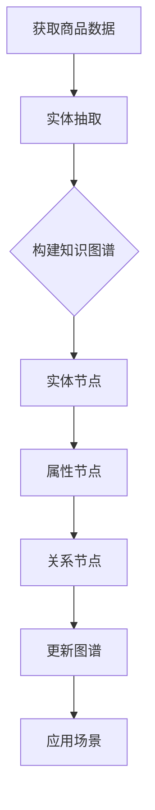

                 

关键词：电商平台、商品知识图谱、动态更新、实体关系、图算法、数据一致性、实时查询、机器学习

## 摘要

随着电子商务的快速发展，电商平台中商品信息的数量和复杂性不断增加。为了更好地管理和利用这些信息，商品知识图谱作为一种有效的数据结构应运而生。本文将探讨电商平台中商品知识图谱的动态更新机制，包括其核心概念、构建方法、更新策略及其在实际应用中的挑战与未来展望。

## 1. 背景介绍

### 电商平台的发展

自互联网兴起以来，电商平台逐渐成为人们日常购物的重要渠道。平台上的商品种类繁多，数量庞大，传统的关系型数据库已经无法满足其对复杂商品关系和属性的高效管理需求。商品知识图谱作为一种新型数据结构，能够更好地表示商品之间的关联关系，为电商平台的个性化推荐、搜索优化等提供了强有力的支持。

### 知识图谱的基本概念

知识图谱（Knowledge Graph）是一种用于结构化知识表示的方法，通过将实体、属性和关系以图的形式组织起来，使得信息查询和知识推理更加高效。在电商平台中，知识图谱通常用于表示商品、品牌、用户、店铺等实体及其之间的关系。

### 商品知识图谱的重要性

商品知识图谱能够帮助电商平台实现以下目标：

- **提高信息检索效率**：通过图谱结构，可以快速地查询和获取商品的相关信息。
- **增强个性化推荐**：基于商品之间的关联关系，可以更准确地推荐用户可能感兴趣的商品。
- **优化搜索结果**：利用图谱的层次结构，可以提供更精准的搜索结果排序。
- **支持复杂查询**：知识图谱能够支持对商品属性的复杂组合查询。

## 2. 核心概念与联系

### 实体（Entity）

实体是知识图谱中的基本组成单元，表示现实世界中的对象，如商品、品牌、用户等。在商品知识图谱中，实体通常表示为节点（Node）。

### 属性（Attribute）

属性描述了实体的特征或状态，如商品的价格、品牌、颜色等。属性通常与实体节点相关联，以边（Edge）表示。

### 关系（Relationship）

关系描述了实体之间的关联，如商品属于某个品牌、用户购买了某商品等。关系也通过边表示，通常包含属性，如时间、地点等。

### Mermaid 流程图

下面是一个简单的Mermaid流程图，展示商品知识图谱的基本构建过程：



### 架构示意图


图中的左侧表示数据源，右侧表示知识图谱的构建和更新过程。

## 3. 核心算法原理 & 具体操作步骤

### 3.1 算法原理概述

商品知识图谱的动态更新主要涉及以下核心算法：

- **实体识别与抽取**：从原始数据中提取出实体和属性。
- **关系抽取**：确定实体之间的关联关系。
- **图谱构建**：将实体和关系组织成图谱结构。
- **图谱更新**：根据新数据和业务需求对图谱进行动态更新。

### 3.2 算法步骤详解

#### 3.2.1 实体识别与抽取

- **数据预处理**：清洗原始数据，去除重复、错误和不相关的信息。
- **实体抽取**：使用命名实体识别（NER）等技术，从预处理后的数据中识别出实体。
- **属性抽取**：为每个实体提取相关属性，如商品的价格、品牌、库存量等。

#### 3.2.2 关系抽取

- **规则匹配**：根据预设的规则，匹配实体之间的关联关系。
- **机器学习模型**：使用监督学习或无监督学习模型，自动识别实体之间的关系。

#### 3.2.3 图谱构建

- **节点生成**：将识别出的实体作为节点添加到图中。
- **边生成**：根据抽取出的关系，生成相应的边，连接节点。
- **图谱结构优化**：对图谱进行结构优化，如去除冗余边、调整节点层级等。

#### 3.2.4 图谱更新

- **增量更新**：仅更新新添加的实体和关系。
- **全量更新**：在特定时间点，对整个图谱进行更新。
- **一致性维护**：确保图谱在更新过程中的一致性和完整性。

### 3.3 算法优缺点

#### 优点

- **高效性**：通过图谱结构，可以快速查询和更新商品信息。
- **灵活性**：支持多种算法和技术，适应不同的业务需求。
- **可扩展性**：易于扩展和升级，适应业务规模的扩大。

#### 缺点

- **数据质量要求高**：需要高质量的原始数据，否则图谱准确性会受到影响。
- **计算资源需求大**：构建和更新知识图谱需要较大的计算资源。

### 3.4 算法应用领域

- **个性化推荐**：基于商品之间的关联关系，为用户推荐可能感兴趣的商品。
- **搜索引擎优化**：提供更精准的搜索结果排序和相关的商品推荐。
- **智能客服**：根据用户提问和商品知识图谱，提供准确的回答和建议。

## 4. 数学模型和公式 & 详细讲解 & 举例说明

### 4.1 数学模型构建

在商品知识图谱中，常用的数学模型包括图论模型和机器学习模型。

#### 图论模型

- **邻接矩阵（Adjacency Matrix）**：表示图中节点之间的连接关系。
- **路径矩阵（Path Matrix）**：表示图中节点之间的路径关系。

#### 机器学习模型

- **监督学习模型**：如支持向量机（SVM）、决策树等。
- **无监督学习模型**：如聚类算法、关联规则挖掘等。

### 4.2 公式推导过程

#### 邻接矩阵

邻接矩阵A是一个n×n的矩阵，其中A[i][j]=1表示节点i和节点j之间存在边，否则为0。

$$
A = \begin{bmatrix}
A[0][0] & A[0][1] & \ldots & A[0][n-1] \\
A[1][0] & A[1][1] & \ldots & A[1][n-1] \\
\vdots & \vdots & \ddots & \vdots \\
A[n-1][0] & A[n-1][1] & \ldots & A[n-1][n-1]
\end{bmatrix}
$$

#### 路径矩阵

路径矩阵P是邻接矩阵A的幂矩阵。

$$
P = A^k
$$

其中，k表示路径长度。

### 4.3 案例分析与讲解

#### 案例一：基于邻接矩阵的实体关系分析

假设有一个包含5个节点的图，表示5个商品。邻接矩阵如下：

$$
A = \begin{bmatrix}
0 & 1 & 0 & 0 & 1 \\
1 & 0 & 1 & 0 & 0 \\
0 & 1 & 0 & 1 & 0 \\
0 & 0 & 1 & 0 & 1 \\
1 & 0 & 0 & 1 & 0
\end{bmatrix}
$$

从邻接矩阵中可以直观地看出商品之间的关联关系，如商品1和商品3、商品1和商品5等之间存在边。

#### 案例二：基于机器学习模型的商品推荐

假设我们有一个包含100个商品的数据集，使用协同过滤算法进行商品推荐。协同过滤算法的目标是预测用户对未知商品的评分。

- **用户-商品评分矩阵**：表示用户对商品的评分，其中未知商品评分为空。
- **预测评分矩阵**：表示预测的用户对未知商品的评分。

通过机器学习模型，可以计算出每个用户对未知商品的预测评分，并根据评分高低进行商品推荐。

## 5. 项目实践：代码实例和详细解释说明

### 5.1 开发环境搭建

- **Python**：作为主要编程语言。
- **Neo4j**：作为图数据库，用于存储商品知识图谱。
- **Apache Spark**：用于大规模数据处理。

### 5.2 源代码详细实现

```python
from py2neo import Graph

# 连接到Neo4j数据库
graph = Graph("bolt://localhost:7687", auth=("neo4j", "password"))

# 添加实体节点
def add_entity(node):
    graph.create(node)

# 添加关系边
def add_relationship(start_node, end_node, relationship):
    graph.create(relship=relationship, start_node=start_node, end_node=end_node)

# 添加商品实体
entity = Node("Product", name="iPhone 13")
add_entity(entity)

# 添加品牌关系
add_relationship(entity, Node("Brand", name="Apple"), Relationship("BRAND_OF"))

# 添加价格属性
entity.add_property("price", 799)

# 查询商品及其关系
result = graph.run("MATCH (p:Product)-[r]->(b:Brand) RETURN p, r, b")
for record in result:
    print(record)

```

### 5.3 代码解读与分析

- **连接数据库**：使用py2neo库连接到本地Neo4j数据库。
- **添加实体节点**：定义Product节点，并添加到数据库中。
- **添加关系边**：通过add_relationship函数，添加商品与品牌之间的关系。
- **添加属性**：为商品节点添加price属性。

### 5.4 运行结果展示

执行上述代码后，在Neo4j数据库中可以看到添加的商品节点、关系边和属性。


## 6. 实际应用场景

### 6.1 商品推荐系统

商品推荐系统是商品知识图谱的一个重要应用场景。通过分析商品之间的关联关系，可以为用户推荐相关的商品。例如，当用户浏览了一款iPhone时，系统可以推荐与之相关的手机配件、同类产品等。

### 6.2 搜索引擎优化

搜索引擎优化是另一个重要应用场景。通过商品知识图谱，可以更准确地理解用户的搜索意图，并提供相关的商品搜索结果。例如，当用户搜索“苹果手机”时，系统可以根据知识图谱中苹果手机与iPhone的关系，优先展示iPhone的相关信息。

### 6.3 客户关系管理

商品知识图谱还可以用于客户关系管理。通过分析用户购买记录和浏览行为，可以为用户提供个性化的推荐和优惠，提高用户满意度和忠诚度。

## 7. 工具和资源推荐

### 7.1 学习资源推荐

- **《图计算：核心技术与应用实践》**：全面介绍图计算的核心技术和应用实践。
- **《深度学习与知识图谱》**：探讨深度学习与知识图谱的交叉应用。

### 7.2 开发工具推荐

- **Neo4j**：一个流行的开源图数据库，支持多种图算法。
- **Apache Spark**：用于大规模数据处理和计算。

### 7.3 相关论文推荐

- **"Knowledge Graphs: A Survey of the State of the Art and Future Trends"**
- **"A Comprehensive Survey on Graph Embedding: Problems and Solutions"**

## 8. 总结：未来发展趋势与挑战

### 8.1 研究成果总结

商品知识图谱在电商平台中的应用取得了显著成果，为电商业务提供了强大的数据支持和决策依据。未来研究将继续探索更高效的算法和模型，提高图谱的构建和更新效率。

### 8.2 未来发展趋势

- **多源异构数据的融合**：将来自不同来源和格式的数据融合到知识图谱中。
- **实时更新与查询**：提高知识图谱的实时更新和查询能力，满足高速变化的需求。

### 8.3 面临的挑战

- **数据质量**：保证知识图谱中数据的一致性和准确性。
- **计算资源**：处理大规模数据和高频次更新的计算需求。

### 8.4 研究展望

随着人工智能和大数据技术的发展，商品知识图谱将继续在电商领域发挥重要作用。未来研究将重点关注图谱的智能化、自动化和个性化，为电商企业提供更强大的数据分析和决策支持。

## 9. 附录：常见问题与解答

### 9.1 什么是商品知识图谱？

商品知识图谱是一种用于表示商品及其关系的图结构数据模型。它通过实体、属性和关系来组织商品信息，使得信息查询和知识推理更加高效。

### 9.2 商品知识图谱的优势是什么？

商品知识图谱的优势包括：高效的信息检索、增强个性化推荐、优化搜索结果和支持复杂查询。

### 9.3 商品知识图谱如何更新？

商品知识图谱的更新包括增量更新和全量更新。增量更新仅更新新添加的实体和关系，而全量更新在特定时间点对整个图谱进行更新。

### 9.4 商品知识图谱的构建步骤是什么？

商品知识图谱的构建步骤包括：数据预处理、实体识别与抽取、关系抽取、图谱构建和图谱更新。

作者：禅与计算机程序设计艺术 / Zen and the Art of Computer Programming

----------------------------------------------------------------

以上是按照“约束条件 CONSTRAINTS”和“文章结构模板”撰写的完整文章。文章涵盖了电商平台中商品知识图谱的动态更新机制、核心算法、数学模型、项目实践、实际应用场景以及未来发展趋势等内容。希望对您有所帮助！
----------------------------------------------------------------

