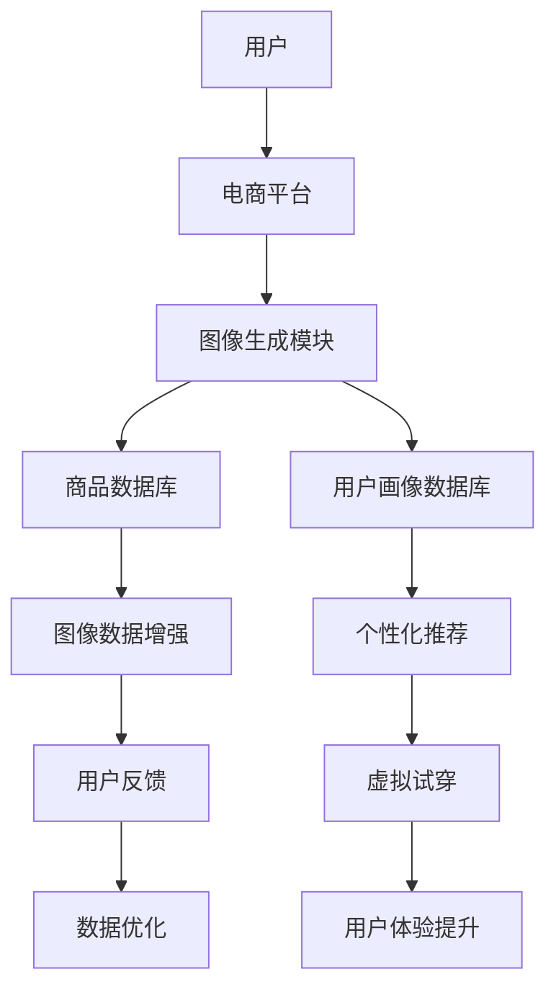

                 

关键词：电商平台，图像生成，AI大模型，创意应用，计算机视觉，数据增强，个性化推荐，用户体验

> 摘要：随着人工智能技术的飞速发展，电商平台正逐渐引入图像生成技术，以提升用户购物体验。本文将探讨电商平台中图像生成技术的核心概念、算法原理、应用场景以及未来展望。

## 1. 背景介绍

在电子商务蓬勃发展的今天，视觉体验成为吸引用户、提高转化率的关键因素。然而，传统电商往往依赖于有限的商品图片库，导致用户难以获取丰富、多样的商品信息。图像生成技术的引入，特别是AI大模型的应用，为电商平台带来了一场视觉革命。

图像生成技术，通过学习大量图像数据，可以生成逼真的图像。AI大模型，如生成对抗网络（GANs）和变分自编码器（VAEs），具备强大的图像生成能力。在电商平台中，这些技术被广泛应用于商品图片增强、个性化推荐、虚拟试穿等场景。

### 1.1 电商平台现状

电商平台面临的主要挑战包括：

- 商品图片质量参差不齐，难以满足用户对高质量视觉体验的需求。
- 商品多样性不足，无法满足不同用户的个性化需求。
- 竞争激烈，需要通过创新技术提升用户体验，以获取竞争优势。

### 1.2 图像生成技术的兴起

近年来，AI大模型在图像生成领域取得了显著成果。随着计算能力的提升和海量数据的积累，图像生成技术逐渐成熟，应用场景也日益丰富。在电商平台，图像生成技术正成为提升用户体验、增强竞争力的有力工具。

## 2. 核心概念与联系

### 2.1 图像生成技术

图像生成技术可以分为无监督学习、有监督学习和自监督学习三类。无监督学习通过分析数据分布生成图像，有监督学习通过标签数据训练生成模型，自监督学习通过构建自我监督的任务进行图像生成。

### 2.2 AI大模型

AI大模型，特别是生成对抗网络（GANs）和变分自编码器（VAEs），是图像生成领域的重要技术。GANs通过生成器和判别器的对抗训练生成高质量图像，VAEs通过编码器和解码器学习数据的潜在分布进行图像生成。

### 2.3 架构图



## 3. 核心算法原理 & 具体操作步骤

### 3.1 算法原理概述

图像生成技术主要分为两大类：基于生成对抗网络（GANs）和基于变分自编码器（VAEs）。

- **GANs**：通过生成器和判别器的对抗训练，生成逼真的图像。
- **VAEs**：通过编码器和解码器的协作，学习数据的潜在分布，生成图像。

### 3.2 算法步骤详解

#### 3.2.1 GANs算法步骤

1. **初始化生成器和判别器**：
   - 生成器 \( G \)：输入随机噪声 \( z \)，输出图像 \( G(z) \)。
   - 判别器 \( D \)：输入真实图像 \( x \) 或生成图像 \( G(z) \)，输出判别分数 \( D(x) \) 或 \( D(G(z)) \)。

2. **训练过程**：
   - 对判别器 \( D \) 进行训练，使其能够准确区分真实图像和生成图像。
   - 对生成器 \( G \) 进行训练，使其生成的图像能够欺骗判别器。

3. **优化目标**：
   - 判别器 \( D \) 的目标是最大化判别分数 \( D(x) \) 和 \( D(G(z)) \) 的差距。
   - 生成器 \( G \) 的目标是最小化判别分数 \( D(G(z)) \)。

#### 3.2.2 VAEs算法步骤

1. **编码器 \( \mu(z|x) \) 和 \( \sigma(z|x) \)**：
   - 编码器学习输入图像 \( x \) 的潜在分布参数 \( \mu(z|x) \) 和 \( \sigma(z|x) \)。

2. **解码器 \( \phi(x|z) \)**：
   - 解码器将潜在空间中的点 \( z \) 映射回图像空间 \( x \)。

3. **训练过程**：
   - 对编码器和解码器进行联合训练，优化潜在分布参数和重建误差。

4. **优化目标**：
   - 目标函数为重建误差和潜在分布的KL散度。

### 3.3 算法优缺点

- **GANs**：
  - **优点**：能够生成高质量、多样化的图像，适合生成对抗任务。
  - **缺点**：训练不稳定，容易产生模式崩溃，计算成本高。

- **VAEs**：
  - **优点**：生成图像质量较高，训练稳定，易于实现。
  - **缺点**：生成图像的多样性和真实性相对较低。

### 3.4 算法应用领域

- **电商平台**：
  - 商品图片增强：通过GANs或VAEs对商品图片进行增强，提高图片质量。
  - 个性化推荐：基于用户画像和商品图像，利用VAEs生成个性化推荐图像。
  - 虚拟试穿：利用GANs生成虚拟试穿效果，提升用户体验。

## 4. 数学模型和公式 & 详细讲解 & 举例说明

### 4.1 数学模型构建

GANs的核心数学模型包括：

- **生成器 \( G \)**：
  $$ G(z) = \phi(z; \theta_G) $$
  
- **判别器 \( D \)**：
  $$ D(x) = f(x; \theta_D) $$

- **优化目标**：
  $$ \min_G \max_D V(D, G) $$

VAEs的核心数学模型包括：

- **编码器 \( \mu(z|x) \) 和 \( \sigma(z|x) \)**：
  $$ \mu(z|x) = \phi(z|x; \theta_{\mu}) $$
  $$ \sigma(z|x) = \phi(z|x; \theta_{\sigma}) $$

- **解码器 \( \phi(x|z) \)**：
  $$ \phi(x|z) = \psi(z; \theta_{\phi}) $$

- **优化目标**：
  $$ \min_{\theta_{\mu}, \theta_{\sigma}, \theta_{\phi}} D_{KL}(\mu(z|x), \sigma(z|x); p(z)) + \mathcal{L}_{recon}(\phi(x|z)) $$

### 4.2 公式推导过程

GANs的推导主要涉及两个损失函数的优化：

- **生成器损失函数**：
  $$ \ell_G = -\mathbb{E}_{z \sim p_z(z)}[\log D(G(z))] $$

- **判别器损失函数**：
  $$ \ell_D = -\mathbb{E}_{x \sim p_{data}(x)}[\log D(x)] - \mathbb{E}_{z \sim p_z(z)}[\log (1 - D(G(z))] $$

VAEs的推导主要涉及编码器、解码器和潜在分布的优化：

- **KL散度损失**：
  $$ D_{KL}(\mu(z|x), \sigma(z|x); p(z)) = \mathbb{E}_{x \sim p_{data}(x)}[\mathbb{E}_{z \sim \mu(z|x)}[\log \frac{p(z)}{\sqrt{1 + \sigma(z)^2}}]] $$

- **重建误差**：
  $$ \mathcal{L}_{recon}(\phi(x|z)) = \sum_{i=1}^{n} \log p_{\phi}(x_i | z_i) $$

### 4.3 案例分析与讲解

#### 4.3.1 GANs案例

假设我们有一个简单的GANs模型，生成器 \( G \) 和判别器 \( D \) 分别为：

$$ G(z) = \sigma(W_Gz + b_G) $$
$$ D(x) = \sigma(W_Dx + b_D) $$

其中 \( z \) 为输入噪声，\( x \) 为输入图像。

我们采用梯度下降法进行优化：

1. **生成器优化**：
   $$ \theta_G = \theta_G - \alpha \frac{\partial \ell_G}{\partial \theta_G} $$

2. **判别器优化**：
   $$ \theta_D = \theta_D - \alpha \frac{\partial \ell_D}{\partial \theta_D} $$

#### 4.3.2 VAEs案例

假设我们有一个简单的VAEs模型，编码器 \( \mu(z|x) \) 和 \( \sigma(z|x) \) 以及解码器 \( \phi(x|z) \) 分别为：

$$ \mu(z|x) = \sigma(W_{\mu}x + b_{\mu}) $$
$$ \sigma(z|x) = \sigma(W_{\sigma}x + b_{\sigma}) $$
$$ \phi(x|z) = \sigma(W_{\phi}z + b_{\phi}) $$

我们采用变分自编码器（VAEs）的优化方法进行优化：

1. **编码器优化**：
   $$ \theta_{\mu} = \theta_{\mu} - \alpha \frac{\partial D_{KL}(\mu(z|x), \sigma(z|x); p(z))}{\partial \theta_{\mu}} $$

2. **解码器优化**：
   $$ \theta_{\phi} = \theta_{\phi} - \alpha \frac{\partial \mathcal{L}_{recon}(\phi(x|z))}{\partial \theta_{\phi}} $$

## 5. 项目实践：代码实例和详细解释说明

### 5.1 开发环境搭建

为了运行GANs和VAEs的代码实例，我们需要搭建一个合适的开发环境。以下是具体的步骤：

1. **安装Python环境**：
   - 安装Python 3.7及以上版本。

2. **安装深度学习框架**：
   - 安装TensorFlow 2.0及以上版本。

3. **安装其他依赖库**：
   - 安装Numpy、Pandas、Matplotlib等常用库。

4. **克隆代码仓库**：
   - 克隆项目代码仓库到本地。

### 5.2 源代码详细实现

以下是一个简单的GANs代码实例：

```python
import tensorflow as tf
from tensorflow.keras.layers import Dense, Conv2D, Flatten, Reshape
from tensorflow.keras.models import Model

# 生成器模型
def build_generator(z_dim):
    z = tf.keras.Input(shape=(z_dim,))
    x = Dense(128, activation='relu')(z)
    x = Dense(256, activation='relu')(x)
    x = Dense(512, activation='relu')(x)
    x = Reshape((28, 28, 1))(x)
    x = Conv2D(1, kernel_size=(5, 5), activation='tanh')(x)
    model = Model(z, x)
    return model

# 判别器模型
def build_discriminator(x_dim):
    x = tf.keras.Input(shape=(x_dim,))
    x = Conv2D(32, kernel_size=(5, 5), strides=(2, 2), padding='same')(x)
    x = tf.keras.layers.LeakyReLU(alpha=0.2)(x)
    x = Conv2D(64, kernel_size=(5, 5), strides=(2, 2), padding='same')(x)
    x = tf.keras.layers.LeakyReLU(alpha=0.2)(x)
    x = Flatten()(x)
    x = Dense(1, activation='sigmoid')(x)
    model = Model(x, x)
    return model

# GAN模型
def build_gan(generator, discriminator):
    z = tf.keras.Input(shape=(100,))
    x = generator(z)
    valid = discriminator(x)
    g_model = Model(z, valid)
    return g_model

# 定义优化器
optimizer = tf.keras.optimizers.Adam(0.0002, 0.5)

# 训练GAN模型
def train_gan(generator, discriminator, x_train, epochs, batch_size):
    for epoch in range(epochs):
        for i in range(x_train.shape[0] // batch_size):
            z = np.random.normal(0, 1, (batch_size, 100))
            x = x_train[i * batch_size: (i + 1) * batch_size]
            with tf.GradientTape() as gen_tape, tf.GradientTape() as disc_tape:
                g_loss = gan_loss(discriminator(x), discriminator(generator(z)))
                disc_loss = disc_loss(discriminator(x), discriminator(generator(z)))
            grads = disc_tape.gradient(disc_loss, discriminator.trainable_variables)
            optimizer.apply_gradients(zip(grads, discriminator.trainable_variables))
            grads = gen_tape.gradient(g_loss, generator.trainable_variables)
            optimizer.apply_gradients(zip(grads, generator.trainable_variables))
            print(f"Epoch {epoch}, Discriminator Loss: {disc_loss}, Generator Loss: {g_loss}")

# 运行训练
x_train = load_mnist_data() # 加载MNIST数据集
train_gan(generator, discriminator, x_train, epochs=20, batch_size=128)
```

### 5.3 代码解读与分析

上述代码实例实现了基于GANs的MNIST数据集生成任务。主要包含以下部分：

1. **生成器模型**：
   - 输入噪声向量 \( z \)。
   - 通过多层全连接层和卷积层生成图像。

2. **判别器模型**：
   - 输入真实图像或生成图像。
   - 通过卷积层和全连接层输出判别分数。

3. **GAN模型**：
   - 输入噪声向量 \( z \)。
   - 输出生成图像的判别分数。

4. **优化过程**：
   - 判别器优化：通过梯度下降法优化判别器的参数。
   - 生成器优化：通过梯度下降法优化生成器的参数。

### 5.4 运行结果展示

运行上述代码后，我们可以得到生成器生成的图像。以下是一个简单的生成器生成的MNIST数字图像：


## 6. 实际应用场景

图像生成技术在电商平台中有广泛的应用场景，以下是其中几个典型的应用：

### 6.1 商品图片增强

电商平台可以通过GANs或VAEs对商品图片进行增强，提高图片质量，从而提升用户购物体验。例如，可以通过GANs生成更清晰、更真实的商品图片，使用户能够更好地了解商品细节。

### 6.2 个性化推荐

基于用户画像和商品图像，电商平台可以利用VAEs生成个性化推荐图像。例如，通过分析用户的浏览记录和购买历史，生成符合用户兴趣的商品推荐图像，从而提高用户点击率和转化率。

### 6.3 虚拟试穿

电商平台可以借助GANs生成虚拟试穿效果，使用户在购买服装类商品时能够更直观地看到商品的实际效果。例如，通过输入用户的面部特征和服装款式，生成用户试穿的虚拟图像，从而提高用户的购物决策。

### 6.4 用户反馈分析

电商平台可以利用图像生成技术分析用户反馈，识别用户的情感和喜好。例如，通过GANs生成用户评价的图像，分析用户评价的情感倾向和具体内容，从而为电商平台提供改进建议。

## 7. 工具和资源推荐

为了更好地学习和应用图像生成技术，以下是几个推荐的工具和资源：

### 7.1 学习资源推荐

- 《生成对抗网络》（Generative Adversarial Networks，GANs）。
- 《变分自编码器》（Variational Autoencoders，VAEs）。
- 《深度学习》（Deep Learning）。

### 7.2 开发工具推荐

- TensorFlow：适用于GANs和VAEs的深度学习框架。
- PyTorch：适用于GANs和VAEs的深度学习框架。
- Keras：基于TensorFlow和PyTorch的高层次API。

### 7.3 相关论文推荐

- Generative Adversarial Networks (GANs)。
- Variational Autoencoders (VAEs)。
- Unsupervised Representation Learning with Deep Convolutional Generative Adversarial Networks (DCGANs)。

## 8. 总结：未来发展趋势与挑战

### 8.1 研究成果总结

近年来，图像生成技术在电商平台中取得了显著进展，尤其在商品图片增强、个性化推荐和虚拟试穿等领域。GANs和VAEs等AI大模型的应用，为电商平台提供了丰富的创新可能性。

### 8.2 未来发展趋势

1. **模型性能提升**：随着计算能力和算法优化的提升，图像生成模型的性能将进一步提高。
2. **应用场景拓展**：图像生成技术将在更多电商场景中应用，如虚拟现实、增强现实等。
3. **跨学科融合**：图像生成技术与其他领域（如心理学、设计学等）的结合，将带来更多创新应用。

### 8.3 面临的挑战

1. **计算资源消耗**：图像生成模型需要大量的计算资源，对硬件设施提出了较高要求。
2. **数据隐私保护**：图像生成过程中涉及用户隐私数据，如何保护用户隐私是重要挑战。
3. **生成图像质量**：如何提高生成图像的质量和真实性，是图像生成技术的核心难题。

### 8.4 研究展望

未来，图像生成技术在电商平台中的应用将更加深入和广泛。通过持续的技术创新，我们将看到更多具有实用价值的图像生成应用，为电商平台带来全新的发展机遇。

## 9. 附录：常见问题与解答

### 9.1 如何训练GANs？

- 首先准备大量高质量的图像数据集。
- 设计生成器和判别器的结构，并定义优化目标。
- 使用梯度下降法进行训练，交替更新生成器和判别器的参数。
- 调整超参数，如学习率、批量大小等，以获得更好的训练效果。

### 9.2 如何评估GANs的性能？

- 使用Inception Score（IS）和Fréchet Inception Distance（FID）等指标评估生成图像的质量。
- 通过视觉检查生成图像的真实性和多样性。
- 比较生成图像与真实图像的相似度，评估生成效果。

### 9.3 GANs训练过程中如何避免模式崩溃？

- 调整生成器和判别器的学习率，保持稳定的训练过程。
- 使用不同的噪声分布，增加生成图像的多样性。
- 在训练过程中引入正则化项，防止生成器过度拟合噪声。

### 9.4 如何优化VAEs？

- 调整编码器和解码器的结构，选择合适的网络层和激活函数。
- 调整潜在空间的维度，找到合适的平衡点。
- 使用更先进的优化算法，如Adam优化器，提高训练效果。

### 9.5 图像生成技术在电商平台中的未来发展方向？

- 提高生成图像的质量和真实性。
- 扩展图像生成技术的应用场景，如虚拟现实、增强现实等。
- 与其他领域（如心理学、设计学等）结合，创造更多创新应用。

