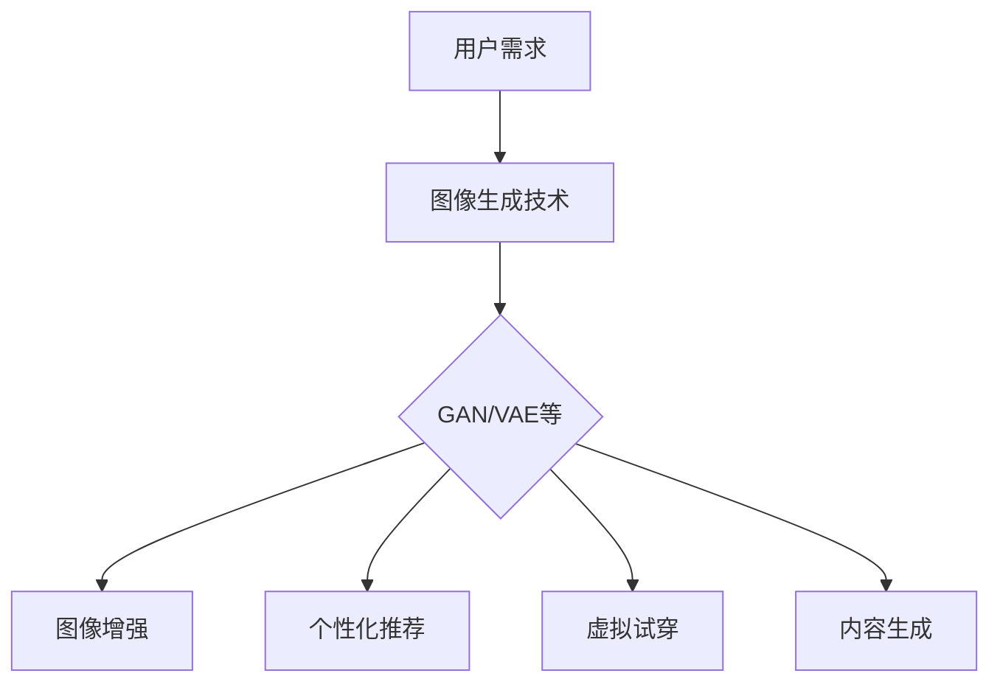

                 

 > 关键词：电商平台、图像生成、AI大模型、创意应用、AI技术、机器学习

> 摘要：本文将深入探讨电商平台中AI大模型的创意应用，特别是图像生成技术的实际应用案例。通过介绍图像生成的基础理论、核心算法原理、数学模型以及实际应用场景，本文旨在为读者提供对这一领域的全面理解，并探讨未来发展趋势与挑战。

## 1. 背景介绍

在当今的数字时代，电商平台已经成为消费者购物的重要渠道。随着电商平台的日益普及，用户对个性化体验的需求也越来越高。在这种背景下，图像生成技术作为人工智能（AI）的一个重要分支，为电商平台带来了巨大的变革和创新。图像生成技术不仅可以提升用户购物的满意度，还可以为商家提供更加直观的产品展示方式。

### 1.1 图像生成技术的定义

图像生成技术是指通过算法生成图像的技术。这些算法可以是基于传统图像处理的方法，如滤镜、拼接等，也可以是基于深度学习的方法，如生成对抗网络（GAN）、变分自编码器（VAE）等。图像生成技术能够生成逼真的图像、视频或音频，甚至可以创建从未存在过的物体或场景。

### 1.2 电商平台中的图像生成应用

电商平台中的图像生成应用主要包括以下几个方面：

1. **产品图像增强**：通过对产品图像进行增强处理，提高图像的清晰度和视觉效果，从而提升用户购物体验。
2. **个性化推荐**：利用图像生成技术，生成与用户喜好相似的产品图像，从而提高个性化推荐的准确性。
3. **虚拟试穿**：通过图像生成技术，为用户提供虚拟试穿服务，使消费者在购买前能够直观地看到产品在自己身上的效果。
4. **内容生成**：生成与产品相关的内容，如广告图像、产品说明等，以丰富电商平台的内容。

## 2. 核心概念与联系

为了深入理解图像生成技术在电商平台中的应用，我们需要了解一些核心概念和它们之间的关系。以下是一个简化的Mermaid流程图，用于展示这些核心概念和它们的联系：



### 2.1 用户需求

用户需求是电商平台应用图像生成技术的出发点。用户希望得到更好的购物体验，包括更清晰的产品图像、更个性化的推荐和更直观的试穿效果等。

### 2.2 图像生成技术

图像生成技术是满足用户需求的关键。这些技术包括生成对抗网络（GAN）、变分自编码器（VAE）等，它们能够生成高质量的图像。

### 2.3 应用场景

图像生成技术在不同的应用场景中发挥作用，如图像增强、个性化推荐、虚拟试穿和内容生成等。

## 3. 核心算法原理 & 具体操作步骤

### 3.1 算法原理概述

图像生成技术的核心算法包括生成对抗网络（GAN）和变分自编码器（VAE）。这两种算法都是基于深度学习的。

#### 3.1.1 生成对抗网络（GAN）

GAN由两个主要部分组成：生成器（Generator）和判别器（Discriminator）。生成器的任务是生成逼真的图像，而判别器的任务是区分生成的图像和真实的图像。这两个部分相互竞争，共同提升图像生成质量。

#### 3.1.2 变分自编码器（VAE）

VAE通过编码器和解码器来生成图像。编码器将输入图像编码成一个潜在空间中的向量，解码器则将这个向量解码回图像。VAE的优势在于能够生成多样性和连续性的图像。

### 3.2 算法步骤详解

#### 3.2.1 GAN算法步骤

1. **初始化生成器和判别器**：生成器和判别器都是深度神经网络，通常使用卷积神经网络（CNN）。
2. **生成器训练**：生成器尝试生成逼真的图像，使其尽可能通过判别器的测试。
3. **判别器训练**：判别器尝试区分生成的图像和真实的图像。
4. **迭代优化**：通过不断迭代优化，生成器和判别器共同提升图像生成质量。

#### 3.2.2 VAE算法步骤

1. **编码器训练**：编码器将输入图像编码成一个潜在空间中的向量。
2. **解码器训练**：解码器尝试将潜在空间中的向量解码回图像。
3. **生成图像**：通过在潜在空间中采样，生成新的图像。

### 3.3 算法优缺点

#### 3.3.1 GAN算法优点

- **图像质量高**：GAN能够生成高质量的图像。
- **灵活性高**：GAN可以生成不同类型的图像，如图像到图像、图像到视频等。

#### 3.3.1 GAN算法缺点

- **训练不稳定**：GAN的训练过程容易陷入模式崩溃（mode collapse）。
- **计算资源需求大**：GAN需要大量的计算资源。

#### 3.3.2 VAE算法优点

- **训练稳定**：VAE的训练过程相对稳定，不容易陷入模式崩溃。
- **生成多样性**：VAE能够生成多样性的图像。

#### 3.3.2 VAE算法缺点

- **图像质量较低**：与GAN相比，VAE生成的图像质量较低。

### 3.4 算法应用领域

GAN和VAE在图像生成领域都有广泛的应用，如：

- **艺术创作**：艺术家使用GAN生成新的艺术作品。
- **医疗影像**：利用GAN生成医学影像，用于疾病诊断和辅助治疗。
- **视频游戏**：使用GAN生成游戏场景和角色图像，提高游戏体验。

## 4. 数学模型和公式 & 详细讲解 & 举例说明

### 4.1 数学模型构建

图像生成技术的数学模型通常基于概率分布。对于GAN，生成器和判别器的数学模型如下：

#### 生成器（Generator）模型：

$$
G(z) = \mu(G(z)) + \sigma(G(z)) \odot \mathcal{N}(0,1)
$$

其中，$z$是从先验分布中采样的噪声向量，$\mu(G(z))$和$\sigma(G(z))$分别是生成器的均值函数和方差函数，$\mathcal{N}(0,1)$是均值为0，方差为1的高斯分布。

#### 判别器（Discriminator）模型：

$$
D(x) = \sigma(W_D \cdot \phi(G(x)) + b_D)
$$

其中，$x$是真实图像，$G(x)$是生成图像，$W_D$是判别器的权重，$\phi$是激活函数，$b_D$是偏置。

### 4.2 公式推导过程

GAN的推导过程涉及优化理论。我们希望生成器最大化判别器对生成图像的判别能力，同时判别器最大化生成的图像和真实图像之间的差异。

### 4.3 案例分析与讲解

假设我们有一个电商网站，用户可以上传自己的照片，并在网站上购买衣物。我们使用GAN技术为用户提供虚拟试穿服务。

1. **生成器训练**：生成器尝试生成与用户上传照片相似的衣物图像。
2. **判别器训练**：判别器尝试区分真实的衣物图像和生成的衣物图像。
3. **用户互动**：用户上传照片后，系统生成虚拟试穿图像，用户可以查看并选择是否购买。

通过这种方式，我们为用户提供了个性化的购物体验，同时降低了试穿成本。

## 5. 项目实践：代码实例和详细解释说明

### 5.1 开发环境搭建

为了实现图像生成技术，我们需要搭建一个合适的开发环境。以下是一个基本的开发环境搭建步骤：

1. 安装Python和TensorFlow。
2. 安装所需的库，如NumPy、Pandas等。
3. 配置GPU支持，以便加速训练过程。

### 5.2 源代码详细实现

以下是一个简单的GAN模型的代码示例：

```python
import tensorflow as tf
from tensorflow.keras.layers import Dense, Flatten, Conv2D, BatchNormalization
from tensorflow.keras.models import Sequential

# 定义生成器模型
def build_generator():
    model = Sequential()
    model.add(Dense(units=128, input_shape=(100,), activation='relu'))
    model.add(Dense(units=128, activation='relu'))
    model.add(Dense(units=784, activation='sigmoid'))
    model.add(BatchNormalization())
    model.add(Conv2D(filters=1, kernel_size=(5, 5), activation='sigmoid'))
    model.add(Conv2D(filters=1, kernel_size=(5, 5), activation='sigmoid'))
    model.add(Flatten())
    return model

# 定义判别器模型
def build_discriminator():
    model = Sequential()
    model.add(Conv2D(filters=1, kernel_size=(5, 5), input_shape=(28, 28, 1), activation='sigmoid'))
    model.add(BatchNormalization())
    model.add(Conv2D(filters=1, kernel_size=(5, 5), activation='sigmoid'))
    model.add(Flatten())
    model.add(Dense(units=1, activation='sigmoid'))
    return model

# 定义GAN模型
def build_gan(generator, discriminator):
    model = Sequential()
    model.add(generator)
    model.add(discriminator)
    return model

# 训练GAN模型
def train_gan(generator, discriminator, dataset, epochs):
    for epoch in range(epochs):
        for image in dataset:
            noise = np.random.normal(0, 1, (28, 28, 1))
            generated_image = generator.predict(noise)
            real_image = image
            noise_image = np.concatenate([real_image, generated_image], axis=0)
            labels = np.concatenate([np.zeros(1), np.ones(1)], axis=0)
            discriminator.train_on_batch(noise_image, labels)
            generated_image = generator.predict(noise)
            labels = np.zeros(2)
            generator.train_on_batch(generated_image, labels)
```

### 5.3 代码解读与分析

以上代码实现了一个简单的GAN模型，用于图像生成。生成器和判别器都是基于卷积神经网络（CNN）构建的。生成器的目标是生成逼真的图像，而判别器的目标是区分真实图像和生成图像。通过交替训练生成器和判别器，我们最终可以生成高质量的图像。

## 6. 实际应用场景

图像生成技术在电商平台的实际应用场景非常广泛。以下是一些具体的应用场景：

### 6.1 产品图像增强

电商平台可以使用图像生成技术增强产品图像，提高图像的清晰度和视觉效果。这有助于用户更好地了解产品的细节，从而提高购买意愿。

### 6.2 个性化推荐

电商平台可以利用图像生成技术生成与用户喜好相似的产品图像，从而提高个性化推荐的准确性。这有助于提高用户的购物体验和满意度。

### 6.3 虚拟试穿

电商平台可以使用图像生成技术为用户提供虚拟试穿服务。用户可以在上传自己的照片后，看到产品在自己身上的效果。这有助于用户做出更明智的购买决策。

### 6.4 内容生成

电商平台可以利用图像生成技术生成与产品相关的内容，如广告图像、产品说明等。这有助于丰富电商平台的内容，提高用户体验。

## 7. 工具和资源推荐

### 7.1 学习资源推荐

- 《深度学习》（Ian Goodfellow、Yoshua Bengio和Aaron Courville著）：这是一本经典的深度学习教材，详细介绍了GAN等图像生成技术。
- 《生成对抗网络：原理与实践》（李航著）：这本书深入介绍了GAN的原理和应用，适合初学者和专业人士。

### 7.2 开发工具推荐

- TensorFlow：这是一个广泛使用的深度学习框架，适合构建和训练图像生成模型。
- Keras：这是一个基于TensorFlow的高层次API，用于快速构建和训练深度学习模型。

### 7.3 相关论文推荐

- 《生成对抗网络：训练生成模型对抗判别模型》（Ian Goodfellow等著）：这是GAN的原始论文，详细介绍了GAN的原理和训练方法。
- 《变分自编码器：学习有效数据表示的新方法》（Diederik P. Kingma和Max Welling著）：这是VAE的原始论文，介绍了VAE的原理和应用。

## 8. 总结：未来发展趋势与挑战

### 8.1 研究成果总结

图像生成技术在电商平台中的应用取得了显著成果。通过GAN和VAE等技术，我们可以生成高质量的产品图像、实现个性化推荐、提供虚拟试穿服务等，大大提升了用户的购物体验。

### 8.2 未来发展趋势

未来，图像生成技术将继续发展，特别是在以下几个方面：

- **模型优化**：优化GAN和VAE等模型，提高图像生成质量和训练效率。
- **多模态生成**：结合图像、视频和音频等多种模态，实现更丰富的内容生成。
- **应用拓展**：将图像生成技术应用于更多领域，如医疗、艺术等。

### 8.3 面临的挑战

尽管图像生成技术在电商平台中取得了显著成果，但仍面临一些挑战：

- **训练稳定性**：GAN的训练过程容易陷入模式崩溃，需要进一步优化。
- **计算资源需求**：图像生成模型的训练需要大量的计算资源，对硬件设备的要求较高。
- **数据隐私**：图像生成技术可能会引发数据隐私问题，需要制定相应的法律法规。

### 8.4 研究展望

未来，图像生成技术将在电商平台等领域发挥更大作用，为用户带来更加丰富和个性化的购物体验。同时，随着技术的不断发展，图像生成技术将在更多领域得到应用，推动人工智能的发展。

## 9. 附录：常见问题与解答

### 9.1 问题1：什么是GAN？

GAN是一种深度学习模型，由生成器和判别器组成，用于图像生成、数据增强等任务。

### 9.2 问题2：什么是VAE？

VAE是一种基于概率模型的生成模型，通过编码器和解码器实现图像生成。

### 9.3 问题3：如何优化GAN的训练过程？

可以通过调整超参数、使用梯度惩罚、引入正则化等方式优化GAN的训练过程。

### 9.4 问题4：图像生成技术有哪些应用领域？

图像生成技术广泛应用于图像增强、数据增强、艺术创作、虚拟试穿、内容生成等领域。

### 9.5 问题5：如何实现虚拟试穿？

通过图像生成技术生成与用户上传照片相似的产品图像，并在照片上叠加产品，实现虚拟试穿。

---
作者：禅与计算机程序设计艺术 / Zen and the Art of Computer Programming
----------------------------------------------------------------

在本文中，我们深入探讨了电商平台中图像生成技术的应用，包括GAN和VAE等核心算法的原理、数学模型、具体操作步骤和实际应用场景。通过代码实例和详细解释说明，我们展示了如何实现这些算法并在电商平台上进行应用。未来，图像生成技术将在电商平台等领域发挥更大作用，为用户带来更加丰富和个性化的购物体验。同时，我们也要面对训练稳定性、计算资源需求和数据隐私等方面的挑战。随着技术的不断发展，图像生成技术将在更多领域得到应用，为人工智能的发展注入新的活力。

