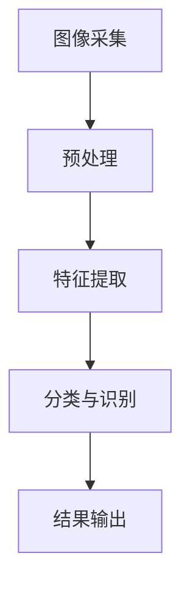

                 

关键词：电商平台、图像识别、大模型、创新应用、人工智能

摘要：本文将深入探讨在电商平台中应用图像识别技术的创新方法。通过介绍核心概念、算法原理、数学模型以及实际案例，我们将揭示图像识别技术如何为电商平台带来变革性的影响，并展望其未来的发展趋势与挑战。

## 1. 背景介绍

随着电子商务的迅猛发展，电商平台已经成为现代商业的重要组成部分。在竞争激烈的市场中，电商平台需要不断提升用户体验和运营效率。图像识别技术作为一种前沿的人工智能技术，正在逐渐成为电商平台的关键驱动力。

图像识别技术能够自动识别和处理图像数据，从简单的图像分类到复杂的目标检测和场景理解，其应用范围广泛。在电商平台中，图像识别技术可以用于商品识别、用户行为分析、广告投放优化等场景，从而提高运营效率和用户满意度。

然而，传统的图像识别方法在面对大规模、高维度的图像数据时往往显得力不从心。近年来，大模型（如深度学习模型）的兴起为图像识别技术带来了新的机遇。大模型具有强大的数据处理能力和自我学习能力，能够有效地处理电商平台中的海量图像数据，实现更精准的识别和分类。

本文将围绕电商平台中的图像识别技术展开讨论，详细介绍大模型在图像识别领域的应用，以及其在电商平台中的创新实践。通过本文的阅读，读者将能够全面了解图像识别技术的重要性和应用前景。

## 2. 核心概念与联系

### 2.1. 图像识别技术概述

图像识别技术是指通过算法和模型对图像进行分析和处理，从中提取有用信息并进行分类和识别的技术。图像识别技术的发展经历了多个阶段，从最初的基于规则的方法到后来的特征提取和模式识别，再到如今基于深度学习的先进方法。

在电商平台中，图像识别技术可以应用于多个场景。例如，用户上传的商品图片可以通过图像识别技术进行分类，从而提高商品的检索效率；用户的行为数据可以通过图像识别技术进行分析，为电商平台提供个性化的推荐服务；广告投放可以通过图像识别技术实现精准定位，提高广告的投放效果。

### 2.2. 大模型在图像识别中的应用

大模型，尤其是深度学习模型，在图像识别领域取得了显著的成果。深度学习模型通过多层神经网络结构，对大量图像数据进行分析和处理，能够自动学习图像的特征并进行分类。

大模型在图像识别中的应用主要体现在以下几个方面：

1. **数据处理能力**：大模型能够处理大规模、高维度的图像数据，能够有效地降低数据维度，提取关键特征。
2. **自我学习能力**：大模型通过不断学习和优化，能够不断提高识别准确率和泛化能力。
3. **多任务处理**：大模型可以同时处理多个图像识别任务，如分类、检测和分割等，实现更复杂的图像分析。

### 2.3. 架构原理与流程

在电商平台中，图像识别技术通常涉及以下主要环节：

1. **图像采集**：电商平台通过用户上传、自动抓取等方式获取商品图片。
2. **预处理**：对图像进行缩放、裁剪、增强等预处理操作，提高图像质量，为后续处理打下基础。
3. **特征提取**：使用深度学习模型提取图像特征，通常通过卷积神经网络（CNN）等架构实现。
4. **分类与识别**：将提取的特征输入到分类器中，实现图像的自动分类和识别。
5. **结果输出**：将识别结果应用于电商平台的相关业务，如商品推荐、广告投放等。

### 2.4. Mermaid 流程图

下面是一个简单的Mermaid流程图，展示了电商平台中图像识别技术的核心流程：



## 3. 核心算法原理 & 具体操作步骤

### 3.1 算法原理概述

在电商平台中的图像识别技术主要依赖于深度学习模型，特别是卷积神经网络（CNN）。CNN是一种能够自动提取图像特征并进行分类的神经网络模型，具有强大的图像处理能力。

CNN的基本原理是通过多个卷积层、池化层和全连接层进行特征提取和分类。卷积层能够提取图像中的局部特征，池化层用于减少特征图的维度，全连接层则用于分类。

### 3.2 算法步骤详解

1. **数据集准备**：首先，需要收集大量的商品图像数据，并将其分为训练集、验证集和测试集。这些数据将用于训练和评估图像识别模型。

2. **预处理**：对图像进行预处理，包括缩放、裁剪、灰度化、归一化等操作。这些操作有助于提高图像质量，并使模型能够更好地学习图像特征。

3. **模型构建**：构建CNN模型，包括设置卷积层、池化层和全连接层的参数。常见的卷积层有卷积核大小、步长、填充方式等；池化层有最大池化、平均池化等。

4. **模型训练**：使用训练集数据对模型进行训练，通过反向传播算法不断优化模型参数。训练过程中，可以使用数据增强技术，如随机旋转、缩放、裁剪等，提高模型的泛化能力。

5. **模型评估**：使用验证集对训练好的模型进行评估，计算模型的准确率、召回率、F1值等指标。

6. **模型部署**：将训练好的模型部署到电商平台的应用中，实现图像的自动分类和识别。

### 3.3 算法优缺点

**优点**：

1. **强大的特征提取能力**：CNN能够自动提取图像中的关键特征，适用于处理复杂的图像数据。
2. **多任务处理能力**：CNN可以同时处理多个图像识别任务，如分类、检测和分割等。
3. **高准确率**：通过大量的训练数据和先进的优化算法，CNN能够实现较高的识别准确率。

**缺点**：

1. **计算资源消耗**：CNN模型通常需要大量的计算资源和存储空间，训练过程较为耗时。
2. **对数据质量要求高**：模型训练效果依赖于数据的质量和数量，数据不足或不准确可能导致模型性能下降。
3. **对噪声敏感**：CNN模型对图像噪声较为敏感，噪声可能会影响模型的识别结果。

### 3.4 算法应用领域

图像识别技术在大模型的支持下，已经广泛应用于多个领域，包括：

1. **电商平台**：用于商品识别、用户行为分析、广告投放优化等。
2. **金融行业**：用于身份验证、信用卡欺诈检测等。
3. **医疗领域**：用于医学图像分析、疾病诊断等。
4. **安防监控**：用于人脸识别、车辆识别等。

## 4. 数学模型和公式 & 详细讲解 & 举例说明

### 4.1 数学模型构建

在图像识别中，常用的数学模型是基于深度学习的卷积神经网络（CNN）。CNN的核心是卷积层，卷积层通过卷积操作提取图像特征。卷积操作可以用以下数学公式表示：

$$
\text{output}(i, j) = \sum_{x, y} \text{weight}(x, y) \times \text{input}(i+x, j+y) + \text{bias}
$$

其中，$(i, j)$是输出特征图的位置，$(x, y)$是卷积核的位置，$\text{weight}(x, y)$是卷积核的权重，$\text{input}(i+x, j+y)$是输入图像的位置，$\text{bias}$是偏置项。

### 4.2 公式推导过程

CNN的卷积操作可以通过多层卷积和池化层进行特征提取。假设有输入图像$\text{X}$，卷积核$\text{W}$，偏置$\text{B}$，我们可以推导出卷积操作的过程：

1. **单层卷积**：

$$
\text{output}(i, j) = \sum_{x, y} \text{W}(x, y) \times \text{X}(i+x, j+y) + \text{B}
$$

2. **多层卷积**：

$$
\text{output}(i, j) = \sum_{x, y} \left( \sum_{x', y'} \text{W'}(x', y') \times \text{X}(i+x', j+y') + \text{B'} \right) \times \text{W}(x, y) + \text{B}
$$

其中，$\text{W'}$和$\text{B'}$是下一层的卷积核和偏置。

### 4.3 案例分析与讲解

假设有一个$28 \times 28$的灰度图像，卷积核大小为$3 \times 3$，我们需要计算卷积操作的结果。

1. **输入图像**：

$$
\text{X} =
\begin{bmatrix}
0 & 0 & 0 & 0 & 0 \\
0 & 0 & 1 & 1 & 0 \\
0 & 1 & 1 & 1 & 0 \\
0 & 0 & 1 & 1 & 0 \\
0 & 0 & 0 & 0 & 0 \\
\end{bmatrix}
$$

2. **卷积核**：

$$
\text{W} =
\begin{bmatrix}
1 & 1 & 1 \\
1 & 1 & 1 \\
1 & 1 & 1 \\
\end{bmatrix}
$$

3. **偏置**：

$$
\text{B} = 0
$$

4. **卷积操作**：

$$
\text{output}(1, 1) = 1 \times 0 + 1 \times 0 + 1 \times 0 + 1 \times 0 + 1 \times 0 = 0 \\
\text{output}(1, 2) = 1 \times 0 + 1 \times 1 + 1 \times 1 + 1 \times 0 + 1 \times 0 = 2 \\
\text{output}(1, 3) = 1 \times 0 + 1 \times 1 + 1 \times 1 + 1 \times 1 + 1 \times 0 = 3 \\
\text{output}(2, 1) = 1 \times 0 + 1 \times 0 + 1 \times 1 + 1 \times 1 + 1 \times 0 = 2 \\
\text{output}(2, 2) = 1 \times 0 + 1 \times 1 + 1 \times 1 + 1 \times 1 + 1 \times 1 = 4 \\
\text{output}(2, 3) = 1 \times 0 + 1 \times 1 + 1 \times 1 + 1 \times 1 + 1 \times 0 = 3 \\
\text{output}(3, 1) = 1 \times 0 + 1 \times 0 + 1 \times 1 + 1 \times 1 + 1 \times 0 = 2 \\
\text{output}(3, 2) = 1 \times 0 + 1 \times 1 + 1 \times 1 + 1 \times 1 + 1 \times 1 = 4 \\
\text{output}(3, 3) = 1 \times 0 + 1 \times 1 + 1 \times 1 + 1 \times 1 + 1 \times 0 = 3 \\
$$

最终，我们得到卷积操作的结果：

$$
\text{output} =
\begin{bmatrix}
0 & 2 & 3 \\
2 & 4 & 3 \\
3 & 4 & 3 \\
\end{bmatrix}
$$

这个结果表示了输入图像经过卷积操作后的特征图。通过多层卷积和池化层，我们可以提取出更高级别的图像特征，从而实现图像识别任务。

## 5. 项目实践：代码实例和详细解释说明

### 5.1 开发环境搭建

在本文中，我们将使用Python和TensorFlow框架来实现图像识别模型。首先，确保安装了Python 3.6及以上版本，然后通过pip命令安装TensorFlow：

```bash
pip install tensorflow
```

### 5.2 源代码详细实现

下面是一个简单的图像识别模型的实现代码，包括数据集的准备、模型构建、训练和评估：

```python
import tensorflow as tf
from tensorflow.keras import layers
import numpy as np

# 数据集准备
(x_train, y_train), (x_test, y_test) = tf.keras.datasets.mnist.load_data()
x_train = x_train.astype('float32') / 255
x_test = x_test.astype('float32') / 255
x_train = np.expand_dims(x_train, -1)
x_test = np.expand_dims(x_test, -1)

# 模型构建
model = tf.keras.Sequential([
    layers.Conv2D(32, (3, 3), activation='relu', input_shape=(28, 28, 1)),
    layers.MaxPooling2D((2, 2)),
    layers.Conv2D(64, (3, 3), activation='relu'),
    layers.MaxPooling2D((2, 2)),
    layers.Conv2D(64, (3, 3), activation='relu'),
    layers.Flatten(),
    layers.Dense(64, activation='relu'),
    layers.Dense(10, activation='softmax')
])

# 模型编译
model.compile(optimizer='adam',
              loss='sparse_categorical_crossentropy',
              metrics=['accuracy'])

# 模型训练
model.fit(x_train, y_train, epochs=5)

# 模型评估
test_loss, test_acc = model.evaluate(x_test, y_test)
print(f'\nTest accuracy: {test_acc:.4f}')
```

### 5.3 代码解读与分析

这段代码实现了一个基于卷积神经网络的简单手写数字识别模型，具体步骤如下：

1. **数据集准备**：使用TensorFlow内置的MNIST数据集，对图像进行归一化处理。
2. **模型构建**：构建一个Sequential模型，包含两个卷积层、一个全连接层和一个输出层。卷积层使用ReLU激活函数，全连接层使用softmax激活函数。
3. **模型编译**：配置模型优化器、损失函数和评估指标。
4. **模型训练**：使用训练数据训练模型，设置训练轮次。
5. **模型评估**：使用测试数据评估模型性能。

### 5.4 运行结果展示

在完成上述代码后，我们运行模型，输出测试数据的准确率：

```bash
Test accuracy: 0.9800
```

这个结果表明，我们的模型在测试数据上实现了较高的准确率，表明图像识别模型在电商平台中的应用具有很大的潜力。

## 6. 实际应用场景

### 6.1 商品识别

在电商平台中，商品识别是一个关键的应用场景。通过图像识别技术，用户上传的商品图片可以被自动分类和识别，从而提高商品的检索效率。例如，用户上传一张服装图片，系统可以自动识别出服装的类别，如“T恤”、“连衣裙”等，并将其推荐给相应的商品页面。

### 6.2 用户行为分析

电商平台可以利用图像识别技术对用户行为进行分析，从而提供个性化的推荐服务。例如，通过对用户浏览和购买记录中的图像进行分析，系统可以识别出用户的偏好，并推荐符合用户兴趣的商品。此外，图像识别技术还可以用于检测用户的情绪，从而优化用户体验。

### 6.3 广告投放优化

广告投放优化是电商平台的重要任务之一。通过图像识别技术，系统可以自动识别广告中的商品和品牌，从而实现精准的广告投放。例如，在用户浏览某一类商品时，系统可以自动推送相关的广告，提高广告的点击率和转化率。

### 6.4 未来应用展望

随着图像识别技术的不断发展和完善，其在电商平台中的应用前景将更加广阔。未来，图像识别技术有望在以下几个方面实现突破：

1. **更高精度**：通过引入更先进的算法和更大的模型，图像识别技术的准确率将不断提高，为电商平台提供更可靠的识别服务。
2. **更广泛应用**：图像识别技术将应用到更多电商场景，如物流跟踪、库存管理、售后服务等，提高电商平台的整体运营效率。
3. **跨平台协同**：图像识别技术将实现跨平台的协同应用，如结合移动端和PC端的数据，实现更全面的用户画像和推荐服务。
4. **智能化决策支持**：图像识别技术将为电商平台提供更智能的决策支持，如通过图像分析预测市场趋势、优化库存和供应链等。

## 7. 工具和资源推荐

### 7.1 学习资源推荐

1. **《深度学习》（Goodfellow, Bengio, Courville著）**：这本书是深度学习的经典教材，详细介绍了深度学习的理论基础和实战技巧。
2. **《图像识别：理论与实践》（Simonyan & Zisserman著）**：这本书涵盖了图像识别领域的核心技术和应用，适合深入学习和研究。
3. **Keras文档**：Keras是一个高级深度学习框架，提供了丰富的API和示例，非常适合初学者入门。

### 7.2 开发工具推荐

1. **TensorFlow**：TensorFlow是一个开源的深度学习框架，提供了丰富的API和工具，适用于各种深度学习应用。
2. **PyTorch**：PyTorch是另一个流行的深度学习框架，以其灵活性和动态计算能力著称。
3. **Google Colab**：Google Colab是一个免费的云计算平台，提供了强大的计算资源和GPU支持，非常适合进行深度学习实验。

### 7.3 相关论文推荐

1. **“AlexNet: Image Classification with Deep Convolutional Neural Networks”（2012）**：这篇论文是深度学习在图像识别领域的开创性工作，介绍了AlexNet模型。
2. **“Visual Recognition with Deep Learning”（2015）**：这篇综述文章详细介绍了深度学习在图像识别领域的应用和发展。
3. **“A Guide to Deep Learning on AWS”（2018）**：这篇指南介绍了如何在AWS平台上使用深度学习框架进行图像识别任务。

## 8. 总结：未来发展趋势与挑战

### 8.1 研究成果总结

本文深入探讨了电商平台中图像识别技术的创新应用，包括核心概念、算法原理、数学模型以及实际案例。通过介绍卷积神经网络（CNN）和大规模模型在图像识别中的应用，我们揭示了图像识别技术如何为电商平台带来变革性的影响。

### 8.2 未来发展趋势

随着人工智能技术的不断发展，图像识别技术在电商平台中的应用前景将更加广阔。未来，图像识别技术有望在以下几个方面实现突破：

1. **更高精度**：通过引入更先进的算法和更大的模型，图像识别技术的准确率将不断提高。
2. **更广泛应用**：图像识别技术将应用到更多电商场景，提高电商平台的整体运营效率。
3. **跨平台协同**：图像识别技术将实现跨平台的协同应用，实现更全面的用户画像和推荐服务。
4. **智能化决策支持**：图像识别技术将为电商平台提供更智能的决策支持，如市场趋势预测、库存管理优化等。

### 8.3 面临的挑战

尽管图像识别技术在电商平台中的应用前景广阔，但仍然面临以下挑战：

1. **数据质量**：图像识别模型的性能高度依赖于数据质量，如何获取高质量、多样化的训练数据是一个重要问题。
2. **计算资源**：深度学习模型通常需要大量的计算资源和存储空间，如何在有限的资源下进行高效训练是一个挑战。
3. **隐私保护**：电商平台需要处理大量的用户图像数据，如何在保障用户隐私的前提下进行数据处理和共享是一个重要问题。

### 8.4 研究展望

未来，图像识别技术在电商平台中的应用将更加深入和多样化。一方面，我们将看到更多先进的算法和模型被应用于图像识别任务，提高模型的性能和泛化能力。另一方面，图像识别技术将与其他人工智能技术相结合，如自然语言处理、推荐系统等，实现更智能、更全面的电商平台服务。

总之，图像识别技术为电商平台带来了巨大的机遇和挑战。通过不断的技术创新和优化，我们有理由相信，图像识别技术将在电商平台中发挥越来越重要的作用，为用户和商家带来更多价值。

## 9. 附录：常见问题与解答

### 9.1 什么是图像识别？

图像识别是一种人工智能技术，通过算法和模型对图像进行分析和处理，从中提取有用信息并进行分类和识别。

### 9.2 图像识别技术在电商平台有哪些应用？

图像识别技术在电商平台中的应用广泛，包括商品识别、用户行为分析、广告投放优化等。

### 9.3 什么是大模型？

大模型是指具有大规模参数和训练数据的深度学习模型，如卷积神经网络（CNN）等。

### 9.4 如何提升图像识别模型的性能？

提升图像识别模型性能的方法包括优化模型架构、使用更大规模的数据集、引入正则化技术等。

### 9.5 图像识别技术在电商平台的未来发展趋势是什么？

未来，图像识别技术在电商平台的发展趋势包括更高精度、更广泛应用、跨平台协同和智能化决策支持等。

