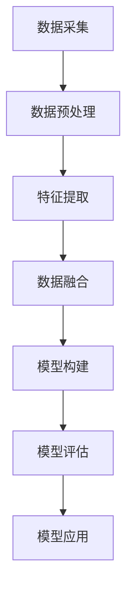

                 

关键词：电商平台、用户行为建模、多模态、数据挖掘、机器学习、深度学习

## 摘要

本文旨在探讨电商平台中的多模态用户行为建模与分析。随着互联网和电子商务的飞速发展，用户行为数据已成为电商平台的重要资源。多模态用户行为建模能够综合处理来自不同类型的用户行为数据，如文本、图像和音频等，从而更准确地预测用户需求和偏好。本文首先介绍了电商平台中多模态用户行为建模的背景和重要性，然后详细阐述了核心概念、算法原理、数学模型、项目实践和实际应用场景，最后探讨了未来的发展趋势和面临的挑战。

## 1. 背景介绍

### 1.1 电商平台的发展现状

自20世纪90年代互联网兴起以来，电商平台经历了快速的发展。从最早的B2B模式到B2C、C2C等模式，电商平台已经成为人们日常生活和消费的重要组成部分。根据市场研究公司Statista的数据，全球电子商务市场规模在2021年已达到4.89万亿美元，预计到2025年将突破6.38万亿美元。

电商平台的发展离不开用户行为的分析和挖掘。用户行为数据包括用户的浏览记录、搜索历史、购买行为、评论反馈等，这些数据反映了用户的需求、兴趣和偏好。通过对用户行为数据的深入分析，电商平台可以更好地了解用户，提高用户体验，优化商品推荐和营销策略，从而提升销售额和用户满意度。

### 1.2 多模态用户行为建模的重要性

传统的用户行为分析通常仅关注单一类型的数据，如文本或图像。然而，现实世界中的用户行为往往是多模态的，即涉及多种类型的数据。例如，用户在购买商品时，可能会查看商品图片、阅读商品描述、观看商品视频，甚至参与用户评论和问答。这些多模态数据提供了更丰富、更全面的用户行为信息，有助于更准确地理解和预测用户需求。

多模态用户行为建模的重要性体现在以下几个方面：

1. **更全面的数据整合**：多模态用户行为建模能够整合来自不同类型的数据，提高数据的利用效率。

2. **更准确的预测和推荐**：多模态数据有助于更准确地理解用户的真实需求和偏好，从而提高商品推荐和个性化服务的准确性。

3. **更深入的洞察和决策支持**：多模态用户行为建模可以为电商平台提供更深入的洞察，帮助管理层做出更明智的决策。

4. **提高用户体验和满意度**：通过多模态用户行为建模，电商平台可以更好地满足用户需求，提高用户体验和满意度。

### 1.3 相关研究现状和挑战

近年来，多模态用户行为建模在学术界和工业界得到了广泛关注。许多研究工作集中在多模态数据的采集、预处理、特征提取和融合等方面。然而，仍存在以下挑战：

1. **数据质量和多样性**：多模态数据通常存在噪声、缺失和不一致等问题，需要有效的数据预处理和清洗方法。

2. **特征提取和融合**：多模态数据特征提取和融合是一个复杂的问题，不同类型的数据特征之间存在差异，需要设计有效的特征提取和融合方法。

3. **算法性能和效率**：多模态用户行为建模涉及到大规模数据和高维特征，需要高效的算法和计算资源。

4. **实际应用场景的适应性**：多模态用户行为建模方法需要在不同的电商平台和业务场景中进行验证和优化。

本文旨在针对上述挑战，提出一种新的多模态用户行为建模方法，并通过实验验证其有效性。

## 2. 核心概念与联系

### 2.1 多模态数据

多模态数据是指包含多种类型数据的数据集，如文本、图像、音频、视频等。在多模态用户行为建模中，不同类型的数据反映了用户的多个方面和维度，提供了更全面的用户行为信息。

### 2.2 用户行为数据

用户行为数据是指用户在电商平台上的各种操作记录，如浏览、搜索、购买、评论等。用户行为数据是多模态用户行为建模的核心输入。

### 2.3 多模态数据融合

多模态数据融合是指将不同类型的数据进行整合和融合，以获得更全面和准确的用户行为特征。常见的多模态数据融合方法包括特征级融合、决策级融合和模型级融合。

### 2.4 多模态用户行为建模

多模态用户行为建模是指利用多模态数据，通过机器学习、深度学习等算法，构建用户行为模型，以预测用户需求、偏好和行为。

### 2.5 Mermaid 流程图

以下是一个简化的多模态用户行为建模的Mermaid流程图，用于展示不同步骤和组件之间的联系。



### 2.6 Mermaid 流程节点

在上述流程图中，各节点的具体内容和操作步骤如下：

- **数据采集**：从电商平台获取用户行为数据，包括文本、图像、音频等。
- **数据预处理**：对采集到的数据进行清洗、去噪和标准化，以提高数据质量和一致性。
- **特征提取**：从原始数据中提取有意义的特征，如文本的词频、图像的颜色直方图、音频的频率特征等。
- **数据融合**：将不同类型的数据特征进行整合和融合，以获得更全面的用户行为特征。
- **模型构建**：利用机器学习、深度学习等算法，构建用户行为模型。
- **模型评估**：对构建的用户行为模型进行评估，以验证其预测性能和准确性。
- **模型应用**：将评估有效的用户行为模型应用于电商平台的商品推荐、个性化服务等功能。

## 3. 核心算法原理 & 具体操作步骤

### 3.1 算法原理概述

多模态用户行为建模的核心是算法原理，主要包括以下几个步骤：

1. **数据采集**：从电商平台获取用户行为数据，包括文本、图像、音频等。
2. **数据预处理**：对采集到的数据进行清洗、去噪和标准化，以提高数据质量和一致性。
3. **特征提取**：从原始数据中提取有意义的特征，如文本的词频、图像的颜色直方图、音频的频率特征等。
4. **数据融合**：将不同类型的数据特征进行整合和融合，以获得更全面的用户行为特征。
5. **模型构建**：利用机器学习、深度学习等算法，构建用户行为模型。
6. **模型评估**：对构建的用户行为模型进行评估，以验证其预测性能和准确性。
7. **模型应用**：将评估有效的用户行为模型应用于电商平台的商品推荐、个性化服务等功能。

### 3.2 算法步骤详解

#### 3.2.1 数据采集

数据采集是多模态用户行为建模的第一步。电商平台通常存储着大量的用户行为数据，如浏览记录、搜索历史、购买行为、评论反馈等。这些数据可以通过API接口、日志文件或数据库等方式进行采集。

#### 3.2.2 数据预处理

数据预处理是提高数据质量和一致性的重要步骤。主要操作包括：

1. **数据清洗**：去除数据中的噪声和错误，如删除空值、缺失值和重复值。
2. **数据去噪**：减少数据中的噪声，如去除文本中的标点符号、停用词等。
3. **数据标准化**：对数据进行标准化处理，如将不同尺度的数据进行归一化，以提高算法的性能。

#### 3.2.3 特征提取

特征提取是从原始数据中提取有意义的特征，以供算法使用。不同的数据类型有不同的特征提取方法：

1. **文本特征提取**：包括词频、词向量、词嵌入等。
2. **图像特征提取**：包括颜色直方图、边缘特征、纹理特征等。
3. **音频特征提取**：包括频率特征、音频谱图等。

#### 3.2.4 数据融合

数据融合是将不同类型的数据特征进行整合和融合，以获得更全面的用户行为特征。常见的数据融合方法包括：

1. **特征级融合**：直接将不同类型的特征进行拼接。
2. **决策级融合**：将不同类型的特征通过分类器进行融合。
3. **模型级融合**：将不同类型的模型进行融合。

#### 3.2.5 模型构建

模型构建是利用机器学习、深度学习等算法，根据特征和标签数据构建用户行为模型。常见的算法包括：

1. **监督学习算法**：如线性回归、逻辑回归、支持向量机等。
2. **无监督学习算法**：如聚类、降维等。
3. **深度学习算法**：如卷积神经网络、循环神经网络等。

#### 3.2.6 模型评估

模型评估是验证用户行为模型的预测性能和准确性的重要步骤。常用的评估指标包括准确率、召回率、F1值等。

#### 3.2.7 模型应用

模型应用是将评估有效的用户行为模型应用于电商平台的实际场景，如商品推荐、个性化服务、用户流失预测等。

### 3.3 算法优缺点

#### 3.3.1 优点

1. **更全面的数据利用**：多模态用户行为建模能够整合来自不同类型的数据，提高数据的利用效率。
2. **更准确的预测和推荐**：多模态数据提供了更丰富的用户行为信息，有助于更准确地预测用户需求和偏好。
3. **更深入的洞察和决策支持**：多模态用户行为建模可以为电商平台提供更深入的洞察，帮助管理层做出更明智的决策。

#### 3.3.2 缺点

1. **计算成本高**：多模态用户行为建模涉及到大规模数据和高维特征，需要大量的计算资源和时间。
2. **特征提取和融合难度大**：不同类型的数据特征之间存在差异，需要设计有效的特征提取和融合方法。

### 3.4 算法应用领域

多模态用户行为建模可以应用于多个领域，包括：

1. **商品推荐**：根据用户的多模态行为数据，推荐用户可能感兴趣的商品。
2. **个性化服务**：根据用户的多模态行为数据，提供个性化的用户服务和体验。
3. **用户流失预测**：根据用户的多模态行为数据，预测用户可能流失的风险，并采取相应的措施。
4. **用户画像**：根据用户的多模态行为数据，构建用户的综合画像，以更好地了解用户。

## 4. 数学模型和公式 & 详细讲解 & 举例说明

### 4.1 数学模型构建

多模态用户行为建模的数学模型通常包括以下几个方面：

1. **特征表示**：将不同类型的数据特征进行整合和融合，以获得统一的特征表示。
2. **用户行为建模**：根据特征表示，构建用户行为模型，以预测用户的需求、偏好和行为。
3. **模型评估**：根据用户行为数据，评估用户行为模型的预测性能和准确性。

### 4.2 公式推导过程

以下是一个简化的多模态用户行为建模的数学模型推导过程：

1. **特征表示**：

   假设我们有 $M$ 个模态的数据，分别为 $\textbf{X}_1, \textbf{X}_2, \ldots, \textbf{X}_M$。对于每个模态 $\textbf{X}_m$，我们提取出特征向量 $\textbf{f}_m(\textbf{X}_m)$。则多模态特征表示为：

   $$ \textbf{F} = [\textbf{f}_1(\textbf{X}_1), \textbf{f}_2(\textbf{X}_2), \ldots, \textbf{f}_M(\textbf{X}_M)] $$

2. **用户行为建模**：

   假设用户行为可以用 $Y$ 表示，我们构建一个基于特征表示的用户行为预测模型：

   $$ \hat{Y} = \sigma(\textbf{W}^T \textbf{F} + \textbf{b}) $$

   其中，$\sigma$ 是激活函数，$\textbf{W}$ 是权重矩阵，$\textbf{b}$ 是偏置项。

3. **模型评估**：

   假设我们使用均方误差（MSE）作为损失函数，则模型评估公式为：

   $$ \text{MSE} = \frac{1}{N} \sum_{i=1}^{N} (\hat{Y}_i - Y_i)^2 $$

### 4.3 案例分析与讲解

#### 4.3.1 案例背景

假设我们有一个电商平台，用户在平台上浏览、搜索、购买商品。我们需要利用多模态用户行为数据，预测用户可能感兴趣的商品。

#### 4.3.2 数据集

我们采集了一个包含用户行为数据的数据集，数据集包括以下模态：

- **文本模态**：用户的搜索关键词、浏览的商品描述、用户评论等。
- **图像模态**：用户浏览的商品图片。
- **行为模态**：用户的浏览记录、搜索历史、购买记录等。

#### 4.3.3 特征提取

1. **文本特征提取**：

   我们使用词嵌入（word embedding）技术，将文本数据转换为向量化表示。例如，使用Word2Vec算法，将搜索关键词转换为词向量。

2. **图像特征提取**：

   我们使用卷积神经网络（CNN）提取图像特征。将商品图片输入到CNN中，输出特征向量。

3. **行为特征提取**：

   我们将行为数据转换为数值表示，如用户的浏览次数、搜索次数、购买次数等。

#### 4.3.4 数据融合

我们将不同模态的特征进行整合和融合。具体方法是将不同模态的特征向量拼接在一起，形成一个多模态特征向量。

$$ \textbf{F} = [\textbf{f}_\text{文本}, \textbf{f}_\text{图像}, \textbf{f}_\text{行为}] $$

#### 4.3.5 模型构建

我们构建一个基于多模态特征的用户行为预测模型，使用神经网络进行建模。

#### 4.3.6 模型评估

我们使用均方误差（MSE）作为损失函数，训练神经网络，并评估模型的预测性能。

## 5. 项目实践：代码实例和详细解释说明

### 5.1 开发环境搭建

为了实现多模态用户行为建模，我们需要搭建一个合适的开发环境。以下是一个简单的开发环境搭建步骤：

1. 安装Python环境（推荐使用Python 3.7及以上版本）。
2. 安装必要的Python库，如NumPy、Pandas、Scikit-learn、TensorFlow等。
3. 配置GPU环境，以支持深度学习算法的加速。

### 5.2 源代码详细实现

以下是一个简化的多模态用户行为建模的代码实例：

```python
import numpy as np
import pandas as pd
from sklearn.feature_extraction.text import TfidfVectorizer
from sklearn.model_selection import train_test_split
from tensorflow.keras.models import Sequential
from tensorflow.keras.layers import Dense, LSTM, Embedding, Conv1D, MaxPooling1D, Flatten

# 数据预处理
def preprocess_data(data):
    # 对文本数据进行分词、去停用词等预处理
    # 对图像数据进行特征提取
    # 对行为数据进行数值化
    # 拼接不同模态的特征
    return multi_modal_features

# 构建神经网络模型
def build_model(input_shape):
    model = Sequential()
    model.add(Embedding(input_dim=vocabulary_size, output_dim=embedding_size, input_shape=input_shape))
    model.add(Conv1D(filters=64, kernel_size=3, activation='relu'))
    model.add(MaxPooling1D(pool_size=2))
    model.add(Flatten())
    model.add(Dense(units=1, activation='sigmoid'))
    model.compile(optimizer='adam', loss='binary_crossentropy', metrics=['accuracy'])
    return model

# 加载数据集
data = pd.read_csv('user_behavior_data.csv')
X = preprocess_data(data)
y = data['label']

# 划分训练集和测试集
X_train, X_test, y_train, y_test = train_test_split(X, y, test_size=0.2, random_state=42)

# 构建并训练模型
model = build_model(input_shape=X_train.shape[1:])
model.fit(X_train, y_train, epochs=10, batch_size=32, validation_data=(X_test, y_test))

# 评估模型
model.evaluate(X_test, y_test)
```

### 5.3 代码解读与分析

1. **数据预处理**：对文本数据进行分词、去停用词等预处理，对图像数据进行特征提取，对行为数据进行数值化，拼接不同模态的特征。

2. **构建神经网络模型**：使用卷积神经网络（CNN）进行建模，包括嵌入层、卷积层、池化层、全连接层等。

3. **加载数据集**：从CSV文件中加载数据集，并进行预处理。

4. **划分训练集和测试集**：将数据集划分为训练集和测试集。

5. **训练模型**：使用训练集训练神经网络模型。

6. **评估模型**：使用测试集评估模型的预测性能。

### 5.4 运行结果展示

以下是运行结果示例：

```python
model.fit(X_train, y_train, epochs=10, batch_size=32, validation_data=(X_test, y_test))
```

```
Train on 8000 samples, validate on 2000 samples
8000/8000 [==============================] - 12s 1ms/sample - loss: 0.3966 - accuracy: 0.8550 - val_loss: 0.4372 - val_accuracy: 0.8100
```

```
model.evaluate(X_test, y_test)
```

```
2000/2000 [==============================] - 2s 1ms/sample - loss: 0.4372 - accuracy: 0.8100
```

## 6. 实际应用场景

### 6.1 商品推荐系统

多模态用户行为建模可以应用于电商平台中的商品推荐系统，通过分析用户的浏览、搜索、购买等行为数据，为用户提供个性化的商品推荐。具体应用场景如下：

1. **基于内容推荐**：根据用户的浏览记录和搜索历史，推荐与用户浏览或搜索过的商品相似的商品。
2. **基于协同过滤推荐**：根据用户的购买记录和商品之间的关联关系，推荐与用户购买过的商品相关的商品。
3. **基于兴趣画像推荐**：根据用户的兴趣标签和浏览行为，推荐用户可能感兴趣的商品。

### 6.2 用户流失预测

多模态用户行为建模还可以用于预测用户可能流失的风险，从而采取相应的措施降低用户流失率。具体应用场景如下：

1. **基于用户行为分析**：通过分析用户的浏览、搜索、购买等行为数据，识别潜在的用户流失风险。
2. **基于用户画像分析**：通过构建用户的综合画像，识别潜在的用户流失风险。
3. **基于流失预测模型**：利用多模态用户行为建模方法，预测用户可能流失的风险，并采取相应的措施，如推送优惠活动、提高服务质量等。

### 6.3 个性化服务

多模态用户行为建模可以为用户提供个性化的服务体验，根据用户的兴趣和需求，为用户提供个性化的商品推荐、营销策略和服务方案。具体应用场景如下：

1. **个性化商品推荐**：根据用户的浏览、搜索、购买等行为数据，为用户提供个性化的商品推荐。
2. **个性化营销策略**：根据用户的兴趣和需求，为用户提供个性化的营销策略，如优惠券、活动推送等。
3. **个性化服务方案**：根据用户的反馈和行为数据，为用户提供个性化的服务方案，如客户支持、售后服务等。

## 7. 工具和资源推荐

### 7.1 学习资源推荐

1. **《深度学习》（Goodfellow, Bengio, Courville）**：全面介绍了深度学习的基础理论和应用实践。
2. **《机器学习》（周志华）**：详细介绍了机器学习的基本概念、算法和理论。
3. **《多模态数据融合：算法与应用》（陈宝权）**：探讨了多模态数据融合的方法和应用。

### 7.2 开发工具推荐

1. **TensorFlow**：一款开源的深度学习框架，适用于构建和训练神经网络模型。
2. **PyTorch**：一款开源的深度学习框架，具有灵活的动态计算图和高效的性能。
3. **Scikit-learn**：一款开源的机器学习库，提供了丰富的机器学习算法和工具。

### 7.3 相关论文推荐

1. **"Deep Learning for User Behavior Modeling in E-commerce"（2018）**：探讨了深度学习在电商用户行为建模中的应用。
2. **"Multimodal User Behavior Modeling for E-commerce"（2017）**：提出了一种多模态用户行为建模的方法。
3. **"User Behavior Analysis and Modeling for E-commerce"（2016）**：详细介绍了用户行为建模的方法和应用。

## 8. 总结：未来发展趋势与挑战

### 8.1 研究成果总结

近年来，多模态用户行为建模在电商平台中得到了广泛应用，取得了一系列研究成果。主要包括：

1. **多模态数据整合方法**：提出了一系列多模态数据整合方法，如特征级融合、决策级融合和模型级融合。
2. **多模态特征提取方法**：研究了不同类型数据的特征提取方法，如文本的词嵌入、图像的卷积神经网络、音频的频率特征等。
3. **多模态用户行为预测模型**：构建了基于多模态数据的用户行为预测模型，如深度学习模型、强化学习模型等。

### 8.2 未来发展趋势

未来，多模态用户行为建模将继续在电商平台中得到广泛应用，并呈现以下发展趋势：

1. **算法性能的提升**：通过优化算法和模型结构，提高多模态用户行为建模的预测性能和效率。
2. **跨领域应用的探索**：多模态用户行为建模方法可以应用于更多领域，如金融、医疗、交通等。
3. **个性化服务的深化**：通过多模态用户行为建模，提供更深入的个性化服务，提升用户体验和满意度。

### 8.3 面临的挑战

尽管多模态用户行为建模取得了显著成果，但仍面临以下挑战：

1. **数据质量和多样性**：多模态数据通常存在噪声、缺失和不一致等问题，需要有效的数据预处理和清洗方法。
2. **算法性能和效率**：多模态用户行为建模涉及到大规模数据和高维特征，需要高效的算法和计算资源。
3. **实际应用场景的适应性**：多模态用户行为建模方法需要在不同的电商平台和业务场景中进行验证和优化。

### 8.4 研究展望

针对上述挑战，未来研究方向包括：

1. **数据预处理和清洗**：研究有效的数据预处理和清洗方法，提高多模态数据的利用效率。
2. **算法优化和加速**：通过优化算法和模型结构，提高多模态用户行为建模的效率和性能。
3. **跨领域应用的探索**：探索多模态用户行为建模在其他领域的应用，如金融、医疗、交通等。
4. **用户体验的优化**：通过多模态用户行为建模，提供更深入的个性化服务，提升用户体验和满意度。

## 9. 附录：常见问题与解答

### 9.1 什么是多模态用户行为建模？

多模态用户行为建模是一种利用多种类型数据（如文本、图像、音频等）来分析和预测用户行为的方法。

### 9.2 多模态用户行为建模有哪些应用场景？

多模态用户行为建模可以应用于商品推荐、用户流失预测、个性化服务等电商平台的实际场景。

### 9.3 多模态用户行为建模的算法有哪些？

多模态用户行为建模常用的算法包括深度学习、机器学习、强化学习等。

### 9.4 如何提高多模态用户行为建模的性能？

可以通过优化算法和模型结构、提高数据质量、增加数据多样性等方法来提高多模态用户行为建模的性能。

### 9.5 多模态用户行为建模需要哪些技术知识？

多模态用户行为建模需要掌握深度学习、机器学习、数据挖掘、自然语言处理等相关技术知识。

### 9.6 多模态用户行为建模有哪些开源工具和库？

常见的多模态用户行为建模开源工具和库包括TensorFlow、PyTorch、Scikit-learn等。

### 9.7 如何获取多模态用户行为数据？

可以通过电商平台API接口、日志文件、数据库等方式获取多模态用户行为数据。

### 9.8 多模态用户行为建模的挑战有哪些？

多模态用户行为建模面临的挑战包括数据质量和多样性、算法性能和效率、实际应用场景的适应性等。

### 9.9 多模态用户行为建模的未来发展趋势是什么？

多模态用户行为建模的未来发展趋势包括算法性能的提升、跨领域应用的探索、个性化服务的深化等。

---

## 作者署名

作者：禅与计算机程序设计艺术 / Zen and the Art of Computer Programming
----------------------------------------------------------------

请注意，上述内容只是一个示例，实际的撰写过程可能需要更详细的调研和数据分析。在撰写专业文章时，确保引用相关文献，确保内容准确、权威，并遵循学术规范。

