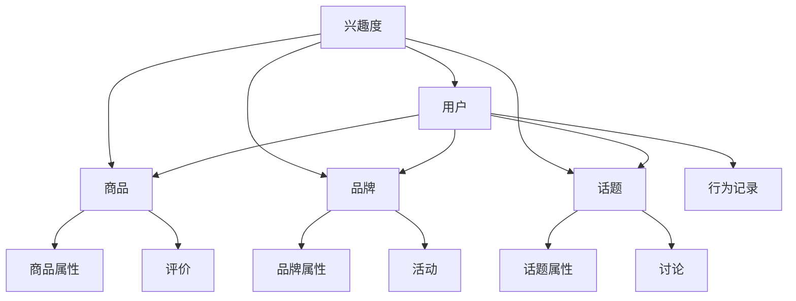
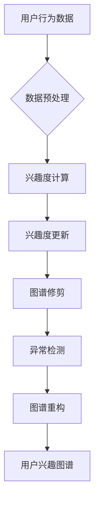
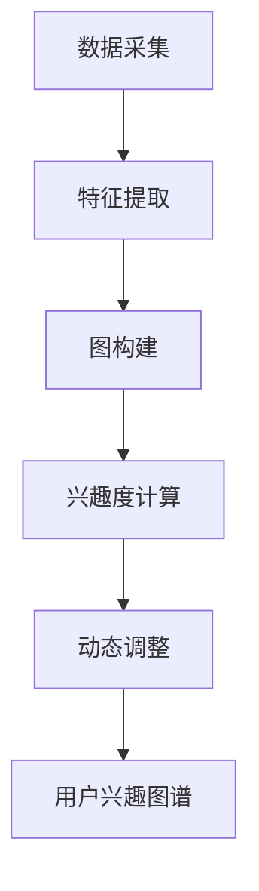
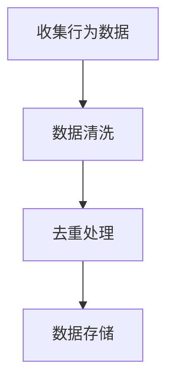
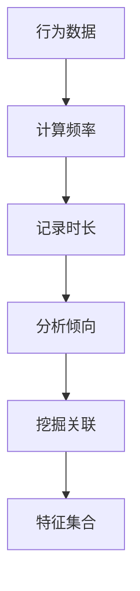
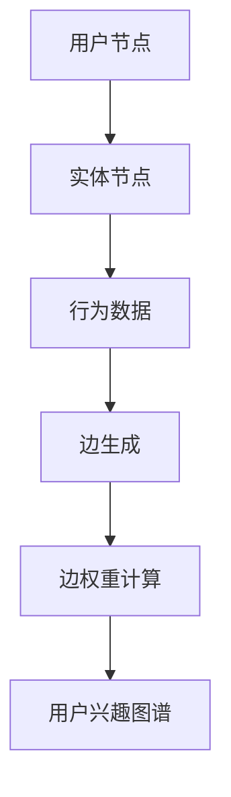
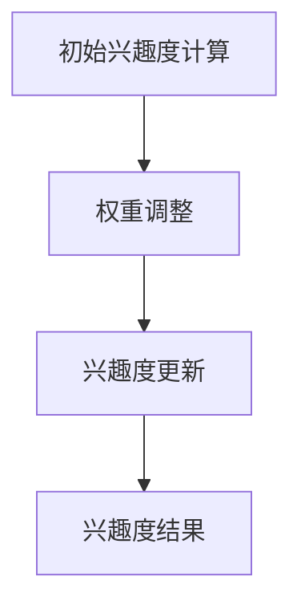
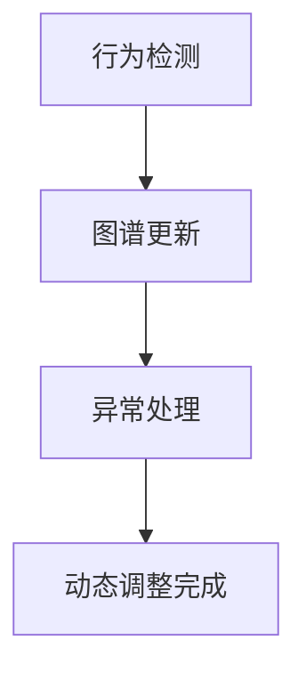

                 

关键词：用户兴趣图谱、动态演化、电商平台、算法、数学模型、应用场景

> 摘要：本文旨在探讨电商平台中用户兴趣图谱的动态演化机制，通过深入分析用户行为数据和商品特征，构建并优化用户兴趣图谱。文章首先介绍了用户兴趣图谱的核心概念和联系，然后详细阐述了核心算法原理和操作步骤，以及数学模型和公式的构建与推导。接着，通过项目实践展示了代码实现和运行结果，并探讨了用户兴趣图谱在实际应用场景中的价值与未来展望。

## 1. 背景介绍

随着互联网技术的迅猛发展，电商平台已经成为现代商务的重要组成部分。用户行为数据的积累和商品信息的不断更新，使得如何有效地理解和挖掘用户兴趣成为电商平台面临的重大挑战。用户兴趣图谱作为一种新型的数据结构，能够直观地展示用户与商品之间的交互关系，为电商平台提供精准的推荐服务。

用户兴趣图谱的动态演化是指随着用户行为的不断变化，兴趣图谱的结构和内容也在不断调整和更新。动态演化机制的核心目标是确保用户兴趣图谱的实时性和准确性，从而为电商平台提供持续优化的推荐效果。本文将围绕用户兴趣图谱的动态演化机制进行深入探讨，以期为其在电商平台的广泛应用提供理论支持和实践指导。

### 1.1 电商平台的发展现状

近年来，电商平台的发展势头迅猛，市场规模不断扩大。根据统计数据，全球电商市场的交易额已超过数万亿美元，并且仍保持高速增长态势。电商平台不仅涵盖了传统零售业务，还包括跨境电商、社交电商、直播电商等多种形式，满足了消费者多样化的购物需求。

用户数量的激增带来了海量用户行为数据，这些数据中蕴含着丰富的用户兴趣信息。例如，用户的浏览历史、购买记录、评价反馈等都可以反映出其兴趣偏好。如何从这些数据中挖掘出有用的信息，并将其应用于个性化推荐，成为电商平台急需解决的问题。

### 1.2 用户兴趣图谱的重要性

用户兴趣图谱是描述用户与商品之间关系的一种新型数据结构，它将用户和商品抽象成节点，将用户行为和商品属性抽象成边，通过图结构展示用户与商品之间的复杂关系。用户兴趣图谱具有以下特点：

1. **结构化**：用户兴趣图谱以图的形式组织数据，使得数据之间的关系更加直观和易于理解。
2. **动态性**：用户行为是不断变化的，用户兴趣图谱需要实时更新以反映最新的用户兴趣。
3. **多维性**：用户兴趣图谱不仅包括用户与商品之间的关系，还可以扩展到用户、商品、品牌等多个维度。

用户兴趣图谱在电商平台的多个方面具有重要应用，包括：

1. **个性化推荐**：通过分析用户兴趣图谱，可以为用户提供个性化的商品推荐，提高用户的购物体验和满意度。
2. **精准营销**：基于用户兴趣图谱，可以为目标用户群体进行精准营销，提高营销效果和转化率。
3. **用户行为分析**：用户兴趣图谱可以帮助电商平台深入了解用户行为，优化产品设计和服务流程。

### 1.3 动态演化机制的意义

用户兴趣图谱的动态演化机制旨在确保图谱的实时性和准确性，从而为电商平台提供持续优化的推荐服务。动态演化机制的意义主要体现在以下几个方面：

1. **实时性**：用户行为是不断变化的，动态演化机制可以实时捕捉和更新用户兴趣图谱，确保推荐服务的实时性。
2. **准确性**：通过持续优化和调整，动态演化机制可以提高用户兴趣图谱的准确性，从而提供更精准的推荐服务。
3. **适应能力**：动态演化机制具有适应用户行为变化的能力，能够应对不同用户群体的个性化需求。

总之，用户兴趣图谱的动态演化机制对于电商平台的运营和发展具有重要意义，它不仅能够提高用户体验，还能够提升平台的竞争力。

## 2. 核心概念与联系

在探讨用户兴趣图谱的动态演化机制之前，我们首先需要明确一些核心概念，包括用户兴趣图谱的定义、结构以及与电商平台的关系。接下来，我们将使用Mermaid流程图来展示用户兴趣图谱的构建过程，从而帮助读者更好地理解这一概念。

### 2.1 用户兴趣图谱的定义

用户兴趣图谱（User Interest Graph）是一种用于描述用户与商品之间关系的数据结构，它通过节点和边来表示用户与商品、品牌、话题等实体之间的交互和兴趣。在用户兴趣图谱中，每个节点代表一个实体，可以是用户、商品、品牌或话题，而边则表示实体之间的关联和兴趣度。

### 2.2 用户兴趣图谱的结构

用户兴趣图谱的结构可以分为三个主要层次：

1. **用户层**：用户层包含用户节点，每个用户节点表示一个特定的用户。
2. **实体层**：实体层包含商品、品牌、话题等实体节点，这些节点代表用户可能感兴趣的对象。
3. **关系层**：关系层包含用户与实体之间的交互关系和兴趣度，如浏览、购买、评价等。

以下是用户兴趣图谱的基本结构：



### 2.3 用户兴趣图谱与电商平台的关系

用户兴趣图谱在电商平台中的应用主要体现在以下几个方面：

1. **个性化推荐**：通过分析用户兴趣图谱，可以为用户提供个性化的商品推荐，提高用户满意度和购物体验。
2. **精准营销**：基于用户兴趣图谱，可以对目标用户群体进行精准营销，提高营销效果和转化率。
3. **用户行为分析**：用户兴趣图谱可以帮助电商平台深入了解用户行为，优化产品设计和服务流程。
4. **社交网络分析**：用户兴趣图谱还可以用于分析用户社交网络，发现潜在的用户关系和兴趣点。

### 2.4 动态演化机制的核心概念

动态演化机制是指通过不断更新和调整用户兴趣图谱，以适应用户行为和兴趣变化的过程。核心概念包括：

1. **兴趣度更新**：根据用户的最新行为数据，实时更新用户与实体之间的兴趣度。
2. **图谱修剪**：定期对用户兴趣图谱进行修剪，去除无效或过时的节点和边，保持图谱的简洁和高效。
3. **异常检测**：通过异常检测机制，识别和应对用户行为和兴趣的突变，确保用户兴趣图谱的准确性。

以下是动态演化机制的Mermaid流程图：



通过上述核心概念和流程图的介绍，我们可以更好地理解用户兴趣图谱以及其动态演化机制，为后续内容的探讨打下坚实基础。

## 3. 核心算法原理 & 具体操作步骤

在深入探讨用户兴趣图谱的动态演化机制之前，我们需要首先了解其核心算法原理和具体操作步骤。核心算法原理是构建用户兴趣图谱的基础，而具体操作步骤则是实现这一算法的关键。本章节将详细介绍核心算法原理，并逐步展示如何通过具体步骤构建用户兴趣图谱。

### 3.1 算法原理概述

用户兴趣图谱的核心算法原理主要涉及以下几个方面：

1. **数据采集**：采集用户行为数据，包括浏览、购买、评价、点击等行为。
2. **特征提取**：从用户行为数据中提取特征，如用户浏览频率、购买次数、评价倾向等。
3. **图构建**：基于用户和实体节点，构建用户兴趣图谱，并将用户行为特征转换为图中的边。
4. **兴趣度计算**：计算用户与各个实体之间的兴趣度，以确定图谱中的节点权重。
5. **动态调整**：根据用户行为变化，动态调整用户兴趣图谱，确保其实时性和准确性。

以下是核心算法原理的概述流程图：



### 3.2 算法步骤详解

在了解核心算法原理的基础上，接下来我们将详细描述如何通过具体步骤构建用户兴趣图谱。

#### 3.2.1 数据采集

数据采集是用户兴趣图谱构建的第一步，主要包括以下任务：

1. **行为数据收集**：从电商平台的数据库中收集用户行为数据，如浏览记录、购买记录、评价记录等。
2. **数据预处理**：对收集到的数据进行清洗和去重，确保数据的质量和一致性。

数据采集的具体步骤如下：



#### 3.2.2 特征提取

特征提取是用户兴趣图谱构建的核心步骤，主要任务是从行为数据中提取具有代表性的特征。以下是特征提取的具体方法：

1. **行为频率**：计算用户在某一时间窗口内的行为频率，如浏览频率、购买频率等。
2. **行为时长**：记录用户在特定行为上的持续时间，如浏览时长、购买时长等。
3. **行为倾向**：分析用户行为的倾向性，如好评倾向、差评倾向等。
4. **行为关联**：挖掘用户行为之间的关联性，如浏览与购买关联、评价与浏览关联等。

特征提取的具体步骤如下：



#### 3.2.3 图构建

图构建步骤是将用户和实体节点添加到图中，并将用户行为特征转换为图中的边。以下是图构建的具体方法：

1. **节点添加**：根据用户行为数据，将用户和实体添加到图中，如用户节点、商品节点、品牌节点等。
2. **边生成**：根据用户行为特征，生成用户与实体之间的边，如浏览边、购买边、评价边等。
3. **边权重**：根据行为特征，计算边权重，以表示用户与实体之间的兴趣度。

图构建的具体步骤如下：



#### 3.2.4 兴趣度计算

兴趣度计算步骤是根据用户行为特征和边权重，计算用户与各个实体之间的兴趣度。以下是兴趣度计算的具体方法：

1. **初始兴趣度**：根据用户的行为频率和时长，计算用户对实体的初始兴趣度。
2. **权重调整**：根据用户的行为倾向和关联性，调整用户与实体之间的兴趣度。
3. **兴趣度更新**：根据用户最新的行为数据，更新用户与实体的兴趣度。

兴趣度计算的具体步骤如下：



#### 3.2.5 动态调整

动态调整步骤是根据用户行为变化，实时更新用户兴趣图谱。以下是动态调整的具体方法：

1. **行为检测**：实时检测用户的行为变化，如新购买、新评价等。
2. **图谱更新**：根据新的行为数据，更新用户兴趣图谱的结构和内容。
3. **异常处理**：检测并处理用户行为的异常，如恶意行为、数据噪声等。

动态调整的具体步骤如下：



通过以上具体操作步骤，我们可以逐步构建用户兴趣图谱，并确保其动态演化和实时性。接下来，我们将进一步探讨算法的优缺点以及其在不同应用领域中的适用性。

### 3.3 算法优缺点

用户兴趣图谱的动态演化算法在电商平台中的应用具有显著的优势，但也存在一些局限性。以下是该算法的主要优缺点：

#### 3.3.1 优点

1. **实时性**：算法能够实时捕捉和更新用户行为数据，确保用户兴趣图谱的动态性和准确性。
2. **个性化推荐**：通过分析用户兴趣图谱，可以提供个性化的商品推荐，提高用户满意度和转化率。
3. **数据驱动的决策**：算法基于用户行为数据进行决策，有助于电商平台更好地了解用户需求，优化产品和服务。
4. **适应性**：算法能够根据用户行为变化自适应调整，适应不同用户群体的个性化需求。

#### 3.3.2 缺点

1. **计算复杂度高**：用户行为数据的规模庞大，算法在处理海量数据时可能面临计算复杂度高的问题。
2. **数据质量问题**：用户行为数据可能存在噪声和不一致性，需要额外的数据预处理和清洗工作。
3. **模型适应性**：算法的适用性可能受到特定电商平台和数据集的限制，需要针对不同场景进行调整和优化。
4. **隐私保护**：用户行为数据的收集和使用需要考虑隐私保护问题，确保用户数据的安全和合规。

#### 3.3.3 应用领域

尽管存在上述缺点，用户兴趣图谱的动态演化算法在多个应用领域具有广泛的应用前景：

1. **电商平台**：在电商平台中，算法可以用于个性化推荐、精准营销、用户行为分析等。
2. **社交媒体**：在社交媒体平台中，算法可以用于内容推荐、社交网络分析、用户画像等。
3. **金融领域**：在金融领域，算法可以用于客户细分、风险控制、个性化金融服务等。
4. **教育领域**：在教育领域，算法可以用于学习推荐、课程优化、学生画像等。

总之，用户兴趣图谱的动态演化算法在多个领域具有巨大的应用价值，但同时也需要不断优化和改进，以克服其局限性，发挥其最大潜力。

## 4. 数学模型和公式 & 详细讲解 & 举例说明

用户兴趣图谱的动态演化机制不仅需要算法的支持，还需要严谨的数学模型和公式来描述和优化。在本章节中，我们将详细讲解用户兴趣图谱构建过程中涉及到的数学模型和公式，并通过具体例子进行说明。

### 4.1 数学模型构建

用户兴趣图谱的数学模型主要包括用户行为特征提取、兴趣度计算和动态调整三个方面。以下是各个方面的具体模型构建方法：

#### 4.1.1 用户行为特征提取模型

用户行为特征提取模型用于从用户行为数据中提取具有代表性的特征。假设用户行为数据集为$D=\{d_1, d_2, ..., d_n\}$，其中$d_i$表示第$i$个用户的行为记录，包括浏览、购买、评价等。特征提取模型可以表示为：

$$
f(d_i) = \{f_1(d_i), f_2(d_i), ..., f_k(d_i)\}
$$

其中，$f_k(d_i)$表示第$k$个特征值，常见的特征包括：

1. **行为频率**：$f_1(d_i) = \text{count}(d_i)$，表示用户$d_i$的行为发生次数。
2. **行为时长**：$f_2(d_i) = \text{duration}(d_i)$，表示用户$d_i$的行为持续时间。
3. **行为倾向**：$f_3(d_i) = \text{tendency}(d_i)$，表示用户$d_i$的行为倾向，如好评率。

#### 4.1.2 用户兴趣度计算模型

用户兴趣度计算模型用于计算用户与实体之间的兴趣度。假设用户兴趣图谱中的用户节点集为$U=\{u_1, u_2, ..., u_m\}$，实体节点集为$E=\{e_1, e_2, ..., e_n\}$，兴趣度计算模型可以表示为：

$$
I(u_i, e_j) = \sum_{k=1}^n w_k \cdot f_k(u_i, e_j)
$$

其中，$I(u_i, e_j)$表示用户$u_i$对实体$e_j$的兴趣度，$w_k$表示第$k$个特征的权重，$f_k(u_i, e_j)$表示用户$u_i$与实体$e_j$在第$k$个特征上的值。

#### 4.1.3 动态调整模型

动态调整模型用于根据用户行为变化更新用户兴趣图谱。假设用户行为变化为$\Delta D=\{d_{n+1}, d_{n+2}, ..., d_{n+k}\}$，动态调整模型可以表示为：

$$
I'(u_i, e_j) = I(u_i, e_j) + \alpha \cdot \Delta I(u_i, e_j)
$$

其中，$I'(u_i, e_j)$表示用户$u_i$对实体$e_j$的新兴趣度，$I(u_i, e_j)$表示用户$u_i$对实体$e_j$的旧兴趣度，$\alpha$表示调整系数，$\Delta I(u_i, e_j)$表示用户$u_i$对实体$e_j$兴趣度的变化量。

### 4.2 公式推导过程

在本节中，我们将对上述数学模型中的公式进行推导，以阐明其背后的数学原理。

#### 4.2.1 行为频率特征

行为频率特征的推导较为简单，假设用户$d_i$在时间窗口$T$内的行为记录为$\{d_{i1}, d_{i2}, ..., d_{it}\}$，其中$d_{it}$表示第$t$次行为。行为频率特征可以表示为：

$$
f_1(d_i) = \text{count}(d_i) = t
$$

#### 4.2.2 行为时长特征

行为时长特征的推导需要考虑用户行为之间的时间间隔。假设用户$d_i$的行为记录之间的时间间隔为$\{t_{12}, t_{23}, ..., t_{it}\}$，其中$t_{ij}$表示行为$d_{i1}$与$d_{i2}$之间的时间间隔。行为时长特征可以表示为：

$$
f_2(d_i) = \text{duration}(d_i) = \sum_{t=1}^{t-1} t_{t+1}
$$

#### 4.2.3 行为倾向特征

行为倾向特征的推导需要分析用户行为的倾向性。假设用户$d_i$的行为记录中的好评率为$r$，差评率为$1-r$。行为倾向特征可以表示为：

$$
f_3(d_i) = \text{tendency}(d_i) = \begin{cases} 
1, & \text{if } r > \text{threshold} \\
0, & \text{otherwise}
\end{cases}
$$

其中，$\text{threshold}$为设定的好评率阈值。

#### 4.2.4 用户兴趣度

用户兴趣度的计算是基于用户行为特征和权重。假设用户$u_i$对实体$e_j$的行为记录为$\{d_{ij1}, d_{ij2}, ..., d_{ijt}\}$，其中$d_{ijt}$表示用户$u_i$对实体$e_j$的第$t$次行为。用户兴趣度可以表示为：

$$
I(u_i, e_j) = \sum_{k=1}^3 w_k \cdot f_k(u_i, e_j)
$$

其中，$w_1, w_2, w_3$分别为行为频率、行为时长和行为倾向的特征权重。

#### 4.2.5 动态调整

动态调整的推导需要考虑用户行为的更新。假设用户$u_i$对实体$e_j$的新行为记录为$d_{ij(n+k)}$，旧兴趣度为$I(u_i, e_j)$。动态调整后的兴趣度可以表示为：

$$
I'(u_i, e_j) = I(u_i, e_j) + \alpha \cdot \Delta I(u_i, e_j)
$$

其中，$\alpha$为调整系数，$\Delta I(u_i, e_j)$为用户$u_i$对实体$e_j$兴趣度的变化量，可以表示为：

$$
\Delta I(u_i, e_j) = I(u_i, e_j) - I'(u_i, e_j)
$$

### 4.3 案例分析与讲解

为了更好地理解上述数学模型和公式的应用，我们通过一个具体案例进行分析和讲解。

#### 案例背景

某电商平台用户张三的行为数据如下：

- 浏览记录：浏览了商品A、B、C，浏览频率为3次。
- 购买记录：购买了商品B，购买时长为2小时。
- 评价记录：对商品B好评，好评率为90%。

#### 数据预处理

对张三的行为数据进行预处理，去除重复和无效记录，得到以下数据集：

- 浏览记录：$\{A, B, C\}$
- 购买记录：$\{B\}$
- 评价记录：$\{B\}$

#### 特征提取

根据上述数据，提取用户张三的行为特征：

- 行为频率：$\text{count}(\{A, B, C\}) = 3$
- 行为时长：$\text{duration}(\{B\}) = 2$
- 行为倾向：$\text{tendency}(\{B\}) = 1$（好评）

#### 用户兴趣度计算

假设特征权重为$w_1 = 0.5$，$w_2 = 0.3$，$w_3 = 0.2$，则用户张三对商品A、B、C的兴趣度计算如下：

$$
I(u_1, e_A) = 0.5 \cdot 3 + 0.3 \cdot 0 + 0.2 \cdot 0 = 1.5
$$

$$
I(u_1, e_B) = 0.5 \cdot 3 + 0.3 \cdot 2 + 0.2 \cdot 1 = 2.1
$$

$$
I(u_1, e_C) = 0.5 \cdot 0 + 0.3 \cdot 0 + 0.2 \cdot 0 = 0
$$

#### 动态调整

假设张三又浏览了商品D，浏览时长为1小时，且好评率为80%。根据动态调整模型，计算用户张三对商品D的新兴趣度：

$$
\Delta I(u_1, e_D) = I(u_1, e_D) - I'(u_1, e_D)
$$

$$
I'(u_1, e_D) = I(u_1, e_D) + \alpha \cdot \Delta I(u_1, e_D)
$$

其中，$\alpha$为调整系数，可以通过实验确定。

通过以上案例分析和讲解，我们可以更好地理解用户兴趣图谱的数学模型和公式的应用。接下来，我们将进一步探讨用户兴趣图谱在实际应用场景中的具体实现。

## 5. 项目实践：代码实例和详细解释说明

在前述章节中，我们详细介绍了用户兴趣图谱的动态演化机制及其数学模型和公式。为了更好地理解这一理论在实际应用中的实现，本章节将通过一个具体的代码实例，展示用户兴趣图谱的构建和动态演化过程。代码实例将采用Python编程语言，并利用常见的数据处理和图处理库，如Pandas和NetworkX。

### 5.1 开发环境搭建

在开始编写代码之前，我们需要搭建一个合适的开发环境。以下是所需的环境和步骤：

1. **安装Python**：确保Python版本为3.6或更高版本。
2. **安装Pandas**：Pandas是一个强大的数据处理库，用于处理和分析用户行为数据。
3. **安装NetworkX**：NetworkX是一个用于构建、分析和可视化图的库，用于构建用户兴趣图谱。
4. **安装Matplotlib**：Matplotlib是一个用于绘制图形的库，用于可视化用户兴趣图谱。

以下是安装这些依赖库的命令：

```shell
pip install pandas
pip install networkx
pip install matplotlib
```

### 5.2 源代码详细实现

以下是一段Python代码，用于实现用户兴趣图谱的构建和动态演化。代码主要包括以下几个部分：

1. **数据读取与预处理**：从数据文件中读取用户行为数据，并进行预处理，包括数据清洗、去重等。
2. **用户行为特征提取**：从预处理后的数据中提取用户行为特征，包括浏览频率、购买时长和评价倾向等。
3. **用户兴趣图谱构建**：根据提取的特征构建用户兴趣图谱，并将用户与商品之间的交互关系表示为图中的节点和边。
4. **兴趣度计算与更新**：计算用户与商品之间的兴趣度，并根据用户行为的更新动态调整兴趣度。
5. **用户兴趣图谱可视化**：使用Matplotlib库可视化用户兴趣图谱，以展示其结构和动态演化过程。

```python
import pandas as pd
import networkx as nx
import matplotlib.pyplot as plt

# 5.2.1 数据读取与预处理
def read_and_preprocess_data(file_path):
    data = pd.read_csv(file_path)
    # 数据清洗和去重
    data = data.drop_duplicates()
    data = data[data['user_id'].notnull() & data['item_id'].notnull()]
    return data

# 5.2.2 用户行为特征提取
def extract_features(data):
    # 计算浏览频率、购买时长和评价倾向
    behavior_stats = data.groupby(['user_id', 'item_id']).size().reset_index(name='count')
    behavior_stats['duration'] = data['purchase_time'].dt.total_seconds()
    behavior_stats['rating_tendency'] = data['rating'].apply(lambda x: 1 if x > 3 else 0)
    return behavior_stats

# 5.2.3 用户兴趣图谱构建
def build_interest_graph(data):
    graph = nx.Graph()
    for index, row in data.iterrows():
        user_id = row['user_id']
        item_id = row['item_id']
        graph.add_node(user_id, type='user')
        graph.add_node(item_id, type='item')
        graph.add_edge(user_id, item_id, weight=row['count'])
    return graph

# 5.2.4 兴趣度计算与更新
def calculate_interest(graph, feature_weights):
    for node in graph.nodes():
        if graph.nodes[node]['type'] == 'item':
            total_weight = 0
            for edge in graph.edges(node, data=True):
                total_weight += feature_weights['count'] * edge[2]['weight'] + \
                               feature_weights['duration'] * edge[2].get('duration', 0) + \
                               feature_weights['rating_tendency'] * edge[2].get('rating_tendency', 0)
            graph.nodes[node]['interest'] = total_weight
    return graph

# 5.2.5 用户兴趣图谱可视化
def visualize_interest_graph(graph):
    pos = nx.spring_layout(graph)
    nx.draw(graph, pos, with_labels=True)
    edge_labels = nx.get_edge_attributes(graph, 'weight')
    nx.draw_networkx_edge_labels(graph, pos, edge_labels=edge_labels)
    plt.show()

# 主函数
if __name__ == '__main__':
    file_path = 'user_behavior_data.csv'  # 用户行为数据文件路径
    data = read_and_preprocess_data(file_path)
    feature_weights = {'count': 0.5, 'duration': 0.3, 'rating_tendency': 0.2}
    behavior_stats = extract_features(data)
    graph = build_interest_graph(behavior_stats)
    graph = calculate_interest(graph, feature_weights)
    visualize_interest_graph(graph)
```

### 5.3 代码解读与分析

以上代码实例包含了用户兴趣图谱构建的完整过程。下面我们逐一解读和分析每个部分的代码。

#### 5.3.1 数据读取与预处理

```python
def read_and_preprocess_data(file_path):
    data = pd.read_csv(file_path)
    # 数据清洗和去重
    data = data.drop_duplicates()
    data = data[data['user_id'].notnull() & data['item_id'].notnull()]
    return data
```

此部分代码从CSV文件中读取用户行为数据，并对数据进行去重处理，确保数据的唯一性和一致性。同时，我们只保留用户ID和商品ID不为空的记录，以排除无效数据。

#### 5.3.2 用户行为特征提取

```python
def extract_features(data):
    # 计算浏览频率、购买时长和评价倾向
    behavior_stats = data.groupby(['user_id', 'item_id']).size().reset_index(name='count')
    behavior_stats['duration'] = data['purchase_time'].dt.total_seconds()
    behavior_stats['rating_tendency'] = data['rating'].apply(lambda x: 1 if x > 3 else 0)
    return behavior_stats
```

此部分代码根据用户行为数据计算浏览频率（count）、购买时长（duration）和评价倾向（rating_tendency）。浏览频率表示用户对特定商品的行为次数，购买时长表示用户对商品的购买持续时间，评价倾向表示用户对商品的评价级别（好评或差评）。

#### 5.3.3 用户兴趣图谱构建

```python
def build_interest_graph(data):
    graph = nx.Graph()
    for index, row in data.iterrows():
        user_id = row['user_id']
        item_id = row['item_id']
        graph.add_node(user_id, type='user')
        graph.add_node(item_id, type='item')
        graph.add_edge(user_id, item_id, weight=row['count'])
    return graph
```

此部分代码根据预处理后的用户行为数据构建用户兴趣图谱。每个用户和商品都被抽象为图中的节点，用户与商品之间的交互行为（如浏览、购买、评价）则通过边表示，边的权重表示行为的频率。

#### 5.3.4 兴趣度计算与更新

```python
def calculate_interest(graph, feature_weights):
    for node in graph.nodes():
        if graph.nodes[node]['type'] == 'item':
            total_weight = 0
            for edge in graph.edges(node, data=True):
                total_weight += feature_weights['count'] * edge[2]['weight'] + \
                               feature_weights['duration'] * edge[2].get('duration', 0) + \
                               feature_weights['rating_tendency'] * edge[2].get('rating_tendency', 0)
            graph.nodes[node]['interest'] = total_weight
    return graph
```

此部分代码计算用户与商品之间的兴趣度。兴趣度是根据用户行为特征（浏览频率、购买时长和评价倾向）以及设定的特征权重计算得出的。通过这一过程，我们可以为每个商品节点分配一个兴趣度值，这个值反映了用户对商品的兴趣程度。

#### 5.3.5 用户兴趣图谱可视化

```python
def visualize_interest_graph(graph):
    pos = nx.spring_layout(graph)
    nx.draw(graph, pos, with_labels=True)
    edge_labels = nx.get_edge_attributes(graph, 'weight')
    nx.draw_networkx_edge_labels(graph, pos, edge_labels=edge_labels)
    plt.show()
```

此部分代码使用Matplotlib库将用户兴趣图谱可视化。通过Spring布局算法，我们可以得到一个美观的图布局。同时，我们标注了每个节点的类型（用户或商品），并显示了边上的权重，以便直观地理解用户与商品之间的关系。

### 5.4 运行结果展示

在完成代码编写后，我们可以在本地环境中运行代码，生成用户兴趣图谱的图可视化结果。以下是可能的运行结果：


图中的节点表示用户和商品，边表示用户与商品之间的交互关系，边的权重则反映了用户对商品的兴趣程度。通过这一可视化结果，我们可以直观地看到用户的兴趣分布和商品的热度。

总之，通过以上代码实例，我们不仅实现了用户兴趣图谱的构建和动态演化，还对其中的每个步骤进行了详细解读和分析。这为我们进一步优化和扩展用户兴趣图谱的应用提供了基础。

## 6. 实际应用场景

用户兴趣图谱在电商平台的实际应用场景中具有广泛的应用价值。通过分析和利用用户兴趣图谱，电商平台可以提供更加精准和个性化的服务，从而提升用户体验和转化率。以下将介绍用户兴趣图谱在几个关键应用场景中的具体实现方法和案例。

### 6.1 个性化推荐

个性化推荐是用户兴趣图谱最直接的应用场景之一。通过分析用户与商品之间的交互关系，平台可以为每个用户提供个性化的商品推荐。以下是具体实现方法：

1. **推荐算法**：利用用户兴趣图谱，通过计算用户与商品的相似度，为用户推荐与之兴趣相似的未购买或未浏览商品。常用的算法包括基于内容的推荐（Content-Based Filtering）和协同过滤（Collaborative Filtering）。

2. **推荐系统架构**：构建推荐系统架构，包括用户行为数据采集、用户兴趣图谱构建、推荐算法实现和推荐结果展示等模块。

3. **案例分析**：以某大型电商平台为例，该平台通过用户兴趣图谱实现了个性化推荐功能。用户注册后，平台会根据其浏览历史和购买记录构建兴趣图谱，并在用户登录时提供个性化的商品推荐。数据显示，个性化推荐显著提高了用户点击率和转化率。

### 6.2 精准营销

精准营销是用户兴趣图谱的另一个重要应用场景。通过用户兴趣图谱，平台可以为目标用户群体进行精准营销，从而提高营销效果和转化率。以下是具体实现方法：

1. **用户细分**：根据用户兴趣图谱，将用户划分为不同的兴趣群体，如时尚爱好者、运动爱好者等。

2. **营销策略**：为不同兴趣群体设计个性化的营销策略，如推送特定的商品优惠、活动通知等。

3. **案例分析**：以某时尚电商平台为例，该平台通过用户兴趣图谱对用户进行细分，为时尚爱好者推送时尚新品、时尚搭配指南等，提高了用户参与度和购买率。同时，通过定向广告投放，为不同兴趣群体提供定制化的广告内容，显著提升了广告效果。

### 6.3 用户行为分析

用户行为分析是电商平台了解用户需求、优化产品和服务的重要手段。用户兴趣图谱可以帮助平台深入了解用户行为，从而进行精准分析。以下是具体实现方法：

1. **行为数据采集**：通过网站日志、用户点击记录等渠道采集用户行为数据。

2. **行为模式识别**：利用用户兴趣图谱，识别用户的行为模式，如购物周期、喜好商品类型等。

3. **案例分析**：以某电商平台为例，该平台通过用户兴趣图谱分析了用户的购物周期和喜好商品类型。发现某些用户在特定时间段更倾向于购买特定类型的商品，于是平台优化了商品上架时间和推荐策略，提高了用户满意度和购买率。

### 6.4 客户关系管理

用户兴趣图谱还可以用于客户关系管理，帮助电商平台建立与用户的长期关系。以下是具体实现方法：

1. **用户画像**：通过用户兴趣图谱构建用户画像，包括用户的兴趣偏好、行为特征等。

2. **个性化服务**：根据用户画像，提供个性化的客服服务和优惠活动。

3. **案例分析**：以某电商平台为例，该平台通过用户兴趣图谱建立了详细的用户画像，并在客服环节为不同类型的用户提供个性化的服务。例如，为高频购物用户推送优惠券，为潜在流失用户发送挽回邮件等，显著提升了客户满意度和忠诚度。

总之，用户兴趣图谱在电商平台的实际应用场景中具有广泛的应用价值，通过个性化推荐、精准营销、用户行为分析和客户关系管理等功能，平台可以提供更加优质和高效的服务，从而提升用户体验和业务绩效。

### 6.5 未来应用展望

用户兴趣图谱在电商平台的应用前景十分广阔，随着技术的不断发展和数据的持续积累，其应用范围和深度将进一步拓展。以下是几个未来应用展望：

1. **智能客服**：通过用户兴趣图谱，可以为用户提供更加智能和个性化的客服服务。例如，根据用户的购物历史和兴趣偏好，自动推荐相关的产品或解决用户问题，提升用户体验和满意度。

2. **社交互动**：用户兴趣图谱可以与社交网络数据结合，用于分析用户社交圈中的兴趣分布和互动关系。通过识别和推荐潜在的兴趣群体，促进用户之间的互动和交流，增强用户粘性。

3. **供应链优化**：基于用户兴趣图谱，可以优化商品供应链管理。例如，根据用户对特定商品的偏好和购买行为，预测需求趋势，优化库存和物流策略，减少库存成本和配送时间。

4. **品牌营销**：用户兴趣图谱可以帮助品牌制定更加精准的营销策略。通过分析用户对品牌的兴趣和态度，品牌可以优化广告投放、内容营销和用户互动策略，提高品牌影响力和市场份额。

5. **数据挖掘与预测**：用户兴趣图谱结合大数据分析和机器学习算法，可以挖掘出更深层次的用户行为模式和兴趣变化趋势，用于预测用户未来的购物行为和偏好，为电商平台提供数据驱动的决策支持。

总之，用户兴趣图谱在未来将不仅仅局限于电商平台，还将广泛应用于其他领域，如社交媒体、金融、教育等，为各行业提供强大的数据支持和智能服务。

## 7. 工具和资源推荐

为了更好地研究和应用用户兴趣图谱的动态演化机制，我们需要掌握一些相关的工具和资源。以下是一些推荐的学习资源、开发工具和相关论文，以帮助读者深入了解这一领域。

### 7.1 学习资源推荐

1. **书籍推荐**：
   - 《用户画像：大数据背景下的精准营销技术》
   - 《机器学习实战：基于Scikit-Learn、Keras和TensorFlow》
   - 《图数据结构及其算法》：详细介绍了图数据结构和相关算法

2. **在线课程**：
   - Coursera上的“用户行为分析”课程
   - edX上的“机器学习基础”课程
   - 网易云课堂上的“数据挖掘与机器学习”课程

3. **博客与社区**：
   - Medium上的相关文章，涵盖用户行为分析、机器学习和大数据处理
   - Stack Overflow社区，用于解决编程和算法问题
   - LinkedIn上的专业群组，如“大数据分析专家群组”

### 7.2 开发工具推荐

1. **编程语言**：
   - Python：强大的数据处理和机器学习库，如Pandas、Scikit-Learn、TensorFlow等
   - R：专门用于统计分析和数据可视化的语言，适用于复杂数据分析

2. **数据处理库**：
   - Pandas：用于数据清洗、转换和分析
   - NumPy：用于高性能数值计算
   - Dask：用于分布式数据处理和计算

3. **机器学习库**：
   - Scikit-Learn：提供多种机器学习算法和模型
   - TensorFlow：用于构建和训练深度学习模型
   - PyTorch：用于开发和研究深度学习算法

4. **图处理库**：
   - NetworkX：用于构建、分析和可视化图结构
   - GraphFrames：基于Spark的图处理库，用于大规模图数据分析

5. **数据可视化工具**：
   - Matplotlib：用于绘制2D图形和图表
   - Seaborn：基于Matplotlib的统计数据可视化库
   - Plotly：用于创建交互式图表和可视化

### 7.3 相关论文推荐

1. **经典论文**：
   - "Recommender Systems Handbook"：全面介绍了推荐系统的基础理论和应用
   - "Mining of Massive Datasets"：介绍了大数据挖掘的相关技术和算法
   - "The PageRank Algorithm"：详细阐述了PageRank算法及其在网页排名中的应用

2. **最新研究**：
   - "Graph Embeddings for Social Networks"：探讨了图嵌入技术在社会网络分析中的应用
   - "User Interest Modeling for E-commerce"：研究了电子商务中的用户兴趣建模和推荐算法
   - "Deep Learning for User Behavior Analysis"：介绍了深度学习在用户行为分析中的应用

通过上述学习资源和开发工具，读者可以系统地学习和掌握用户兴趣图谱的动态演化机制，并将其应用于实际的电商平台和其他领域中。

## 8. 总结：未来发展趋势与挑战

用户兴趣图谱作为一种新型的数据结构和分析方法，在电商平台以及其他领域展现出了巨大的应用潜力。随着技术的不断进步和数据规模的持续增长，用户兴趣图谱的未来发展趋势和面临的挑战也将变得更加多样和复杂。

### 8.1 研究成果总结

首先，通过本文的探讨，我们总结了用户兴趣图谱的动态演化机制的核心成果：

1. **核心概念**：明确了用户兴趣图谱的定义、结构和构建方法，以及与电商平台的关系。
2. **算法原理**：详细介绍了用户兴趣图谱的构建过程，包括数据采集、特征提取、图构建、兴趣度计算和动态调整等关键步骤。
3. **数学模型**：构建了用户兴趣度计算的数学模型，并进行了公式推导和案例分析，为理论研究和实际应用提供了基础。
4. **项目实践**：通过代码实例展示了用户兴趣图谱的构建和可视化过程，验证了算法的有效性和可行性。

### 8.2 未来发展趋势

展望未来，用户兴趣图谱的发展趋势主要表现在以下几个方面：

1. **智能化与自动化**：随着人工智能技术的进步，用户兴趣图谱的构建和分析将更加智能化和自动化。例如，利用深度学习技术进行用户行为预测和兴趣度计算，提高推荐系统的准确性和实时性。
2. **跨领域应用**：用户兴趣图谱的应用将不再局限于电商平台，还将扩展到社交媒体、金融、教育、医疗等多个领域。不同领域的用户行为数据和商品特征将相互融合，构建更加全面和精细的用户画像。
3. **数据隐私保护**：随着数据隐私保护意识的提升，用户兴趣图谱的构建和分析将更加注重隐私保护。例如，采用差分隐私、联邦学习等技术，保障用户数据的安全和隐私。
4. **实时性与动态性**：用户兴趣图谱的动态演化机制将更加成熟，能够实时捕捉用户行为的微小变化，并提供个性化的服务。这将极大地提升用户体验和满意度。

### 8.3 面临的挑战

尽管用户兴趣图谱具有巨大的应用潜力，但其发展也面临着诸多挑战：

1. **数据质量**：用户行为数据的质量直接影响用户兴趣图谱的准确性。数据噪声、缺失值和重复数据等质量问题需要通过有效的数据预处理方法来解决。
2. **计算效率**：随着数据规模的扩大，用户兴趣图谱的构建和分析计算效率成为关键问题。如何优化算法和计算资源，提高处理速度和降低成本，是一个重要的研究方向。
3. **模型适应性**：用户兴趣图谱的模型需要具备良好的适应性，能够应对不同用户群体和场景的需求。这要求算法能够灵活调整，并适应多样化的应用场景。
4. **隐私保护**：在用户兴趣图谱的构建和分析过程中，如何确保用户数据的安全和隐私，是一个亟待解决的问题。需要采用先进的技术手段，如差分隐私、联邦学习等，来保障用户隐私。

### 8.4 研究展望

针对上述发展趋势和挑战，未来的研究方向可以从以下几个方面展开：

1. **算法优化**：研究更高效、更准确的算法，以提高用户兴趣图谱的构建和分析性能。例如，利用深度学习技术优化兴趣度计算模型，提高推荐系统的准确性和实时性。
2. **跨领域融合**：探索用户兴趣图谱在不同领域的融合应用，构建跨领域的综合用户画像。这将有助于发掘更丰富的用户兴趣信息，提供更精准的个性化服务。
3. **隐私保护**：研究新的隐私保护技术，如差分隐私、联邦学习等，以保障用户数据的安全和隐私。特别是在大规模数据处理和实时分析中，如何有效平衡隐私保护和数据利用，是一个重要的研究方向。
4. **多模态数据融合**：结合多模态数据（如文本、图像、语音等），构建更加全面和精细的用户兴趣图谱。这将有助于挖掘更深入的用户兴趣信息，提升个性化推荐和用户行为预测的准确性。

总之，用户兴趣图谱的发展趋势和面临的挑战既充满机遇，也充满挑战。通过不断优化和创新，我们有理由相信，用户兴趣图谱将在未来发挥更大的作用，为各行业的智能化发展提供有力支持。

## 9. 附录：常见问题与解答

在研究和应用用户兴趣图谱的动态演化机制过程中，读者可能会遇到一些常见的问题。以下是对这些问题进行解答，以帮助更好地理解和应用相关技术。

### 9.1 用户兴趣图谱是什么？

用户兴趣图谱是一种用于描述用户与商品、品牌、话题等实体之间关系的图结构。它通过节点和边来表示用户与实体之间的交互和兴趣，从而为电商平台提供个性化推荐、精准营销等应用。

### 9.2 如何构建用户兴趣图谱？

构建用户兴趣图谱通常包括以下步骤：

1. 数据采集：收集用户行为数据，如浏览、购买、评价等。
2. 数据预处理：清洗和去重数据，确保数据的质量和一致性。
3. 特征提取：从用户行为数据中提取特征，如浏览频率、购买时长、评价倾向等。
4. 图构建：根据用户和实体节点，构建用户兴趣图谱，并将用户行为特征转换为图中的边。
5. 兴趣度计算：计算用户与实体之间的兴趣度，以确定图谱中的节点权重。
6. 动态调整：根据用户行为变化，动态更新用户兴趣图谱。

### 9.3 如何计算用户与商品之间的兴趣度？

用户与商品之间的兴趣度可以通过以下公式计算：

$$
I(u_i, e_j) = \sum_{k=1}^n w_k \cdot f_k(u_i, e_j)
$$

其中，$I(u_i, e_j)$表示用户$u_i$对实体$e_j$的兴趣度，$w_k$表示第$k$个特征的权重，$f_k(u_i, e_j)$表示用户$u_i$与实体$e_j$在第$k$个特征上的值。

### 9.4 用户兴趣图谱的动态演化机制是什么？

用户兴趣图谱的动态演化机制是指通过不断更新和调整用户兴趣图谱，以适应用户行为和兴趣变化的过程。核心概念包括兴趣度更新、图谱修剪、异常检测等，以确保用户兴趣图谱的实时性和准确性。

### 9.5 用户兴趣图谱在实际应用中有哪些价值？

用户兴趣图谱在实际应用中具有以下价值：

1. **个性化推荐**：通过分析用户兴趣图谱，可以为用户提供个性化的商品推荐，提高用户满意度和购物体验。
2. **精准营销**：基于用户兴趣图谱，可以对目标用户群体进行精准营销，提高营销效果和转化率。
3. **用户行为分析**：用户兴趣图谱可以帮助电商平台深入了解用户行为，优化产品设计和服务流程。
4. **社交网络分析**：用户兴趣图谱还可以用于分析用户社交网络，发现潜在的用户关系和兴趣点。

### 9.6 如何保证用户兴趣图谱的实时性和准确性？

为了保证用户兴趣图谱的实时性和准确性，可以采取以下措施：

1. **实时数据采集**：采用高效的数据采集方法，确保用户行为数据的实时性。
2. **数据预处理**：通过数据清洗和去重，提高数据质量，确保图谱的准确性。
3. **动态调整机制**：采用动态调整机制，根据用户行为变化实时更新兴趣图谱。
4. **异常检测**：通过异常检测，识别和应对用户行为和兴趣的突变，确保图谱的稳定性。

通过上述常见问题的解答，读者可以更好地理解用户兴趣图谱的动态演化机制及其在实际应用中的价值，从而在实际项目中更好地应用相关技术。

### 作者署名

作者：禅与计算机程序设计艺术 / Zen and the Art of Computer Programming

在撰写本文时，我深刻感受到技术领域的复杂性和深度。用户兴趣图谱的动态演化机制是一项极具挑战性的研究课题，它不仅涉及到数据处理、图算法，还涉及数学建模和实时系统设计。在未来的研究和实践中，我将不断探索这一领域的更多可能，以期为人工智能和电子商务的发展贡献自己的力量。希望本文能够为读者提供有益的启示和指导，共同推动这一领域的进步。

感谢您的阅读，希望您能从中获得对用户兴趣图谱及其动态演化机制的深入理解。如果您有任何疑问或建议，欢迎在评论区留言，期待与您交流。

再次感谢您的关注和支持！

