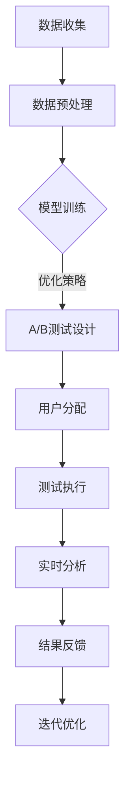

                 

关键词：电商平台，自动化A/B测试，大模型，创新应用，用户体验优化

> 摘要：本文旨在探讨在电商平台中如何通过自动化A/B测试设计和应用大模型，以优化用户体验和提升运营效率。我们将详细介绍A/B测试的核心概念、大模型的应用原理，以及如何在实际项目中实施这些方法。

## 1. 背景介绍

在当今的电商行业，用户需求多样化，市场竞争激烈，如何提升用户满意度和提升运营效率成为了企业关注的焦点。A/B测试作为一种数据驱动的决策方法，已经成为电商平台优化用户体验和运营策略的重要工具。传统的A/B测试通常需要手动配置测试环境和分析结果，这既耗时又容易出错。随着人工智能和机器学习技术的快速发展，大模型的应用为自动化A/B测试带来了新的契机。

大模型，特别是深度学习模型，具有处理大规模数据和复杂模式的能力。通过大模型，电商平台可以实现自动化测试设计、执行和分析，从而大幅提高测试效率，降低测试成本，并更加准确地识别和优化用户体验。

## 2. 核心概念与联系

### 2.1 A/B测试的核心概念

A/B测试，又称为拆分测试，是一种通过将用户随机分配到两个或多个不同的版本中，来比较不同设计、功能或策略效果的方法。核心概念包括：

- **实验组（A组）**：接受新设计或策略的用户组。
- **控制组（B组）**：接受原有设计或策略的用户组。
- **随机分配**：确保两组用户在其他特征上均衡，以消除偏差。
- **指标监控**：通过关键指标（如转化率、用户留存率、销售额等）来评估不同版本的效能。

### 2.2 大模型的应用原理

大模型，通常指具有数百万甚至数十亿参数的深度学习模型，其核心优势在于能够自动学习和提取数据中的复杂模式和关联。在大模型的应用中，主要包括以下方面：

- **数据预处理**：利用大规模数据对模型进行训练，使模型能够理解各种用户体验和行为的模式。
- **自动化测试设计**：通过分析历史数据，模型可以自动生成最佳的A/B测试方案，包括测试变量、目标指标和用户分配策略。
- **实时分析**：大模型可以在测试执行过程中实时分析数据，提供即时反馈，优化测试进程。

### 2.3 Mermaid流程图

下面是一个简单的Mermaid流程图，展示了A/B测试在大模型中的应用流程：



## 3. 核心算法原理 & 具体操作步骤

### 3.1 算法原理概述

自动化A/B测试的核心算法包括以下几个方面：

- **用户行为分析**：利用机器学习算法分析用户的历史行为数据，预测用户对不同版本的可能反应。
- **测试方案优化**：基于分析结果，自动生成最优的A/B测试方案，包括测试变量、目标指标和用户分配策略。
- **实时反馈调整**：在测试执行过程中，根据实时数据调整测试策略，以实现测试目标的最大化。

### 3.2 算法步骤详解

1. **数据收集**：从电商平台收集用户行为数据，包括浏览、购买、评价等。
2. **数据预处理**：对数据进行清洗、转换和归一化处理，以供模型训练使用。
3. **模型训练**：使用大规模数据进行模型训练，提取用户行为的潜在模式和关联。
4. **测试设计**：根据模型预测结果，自动生成A/B测试方案。
5. **用户分配**：随机将用户分配到实验组和控制组。
6. **测试执行**：在测试环境中执行A/B测试，收集实验数据。
7. **实时分析**：对实时数据进行分析，提供测试进展和结果反馈。
8. **结果反馈**：根据分析结果，调整测试策略或终止测试。
9. **迭代优化**：基于测试结果，迭代优化模型和测试方案。

### 3.3 算法优缺点

#### 优点：

- **高效性**：自动化A/B测试可以大幅减少测试时间，提高测试效率。
- **准确性**：利用大模型进行用户行为分析，可以更准确地预测测试结果。
- **灵活性**：可以根据实时数据动态调整测试策略，提高测试的灵活性。

#### 缺点：

- **成本高**：大模型训练和自动化测试设计需要大量的计算资源和时间。
- **复杂性**：自动化A/B测试系统的开发和维护需要较高的技术门槛。

### 3.4 算法应用领域

自动化A/B测试算法可以应用于电商平台的多个领域，包括：

- **页面优化**：通过测试不同的页面布局、颜色、图片等，提升用户点击率和转化率。
- **推荐系统**：优化推荐算法，提升用户的兴趣匹配度和购物体验。
- **营销活动**：通过测试不同的营销策略，如优惠券、限时折扣等，提高用户参与度和转化率。

## 4. 数学模型和公式 & 详细讲解 & 举例说明

### 4.1 数学模型构建

自动化A/B测试的核心数学模型包括以下部分：

- **用户行为预测模型**：利用回归分析、分类算法等预测用户对不同版本的响应概率。
- **优化模型**：基于预测结果，构建优化模型，以最大化目标函数（如转化率、销售额等）。

### 4.2 公式推导过程

以转化率为目标，我们假设有以下公式：

$$
\hat{y} = \beta_0 + \beta_1 x_1 + \beta_2 x_2 + ... + \beta_n x_n
$$

其中，$y$ 为用户转化的概率，$x_1, x_2, ..., x_n$ 为影响用户转化的特征变量，$\beta_0, \beta_1, \beta_2, ..., \beta_n$ 为模型的参数。

通过最大似然估计或梯度下降等方法，我们可以求解出模型参数。

### 4.3 案例分析与讲解

假设我们希望优化电商平台的购物车页面，以提高用户的转化率。我们收集了以下数据：

| 用户ID | 浏览量 | 购买次数 | 购物车数量 | 购物车页面停留时间 | 转化率 |
|--------|--------|----------|------------|-------------------|--------|
| 1      | 100    | 5        | 10         | 3 分钟            | 0.20   |
| 2      | 150    | 3        | 8          | 2 分钟            | 0.15   |
| 3      | 200    | 4        | 15         | 4 分钟            | 0.25   |
| ...    | ...    | ...      | ...        | ...               | ...    |

我们使用线性回归模型进行预测，并构建优化模型，目标是最大化转化率。

通过模型训练和优化，我们得到以下预测结果：

$$
\hat{y} = 0.5 + 0.1 \times \text{浏览量} - 0.05 \times \text{购物车数量} + 0.05 \times \text{购物车页面停留时间}
$$

根据预测结果，我们设计以下A/B测试方案：

- **实验组A**：增加购物车页面的图片展示，减少文字描述。
- **控制组B**：保持原有购物车页面设计。

我们将用户随机分配到实验组和控制组，并进行为期一周的测试。测试结果显示：

| 用户ID | 组别 | 浏览量 | 购买次数 | 购物车数量 | 购物车页面停留时间 | 转化率 |
|--------|------|--------|----------|------------|-------------------|--------|
| 1      | A    | 110    | 5        | 10         | 3 分钟            | 0.22   |
| 2      | A    | 160    | 3        | 8          | 2 分钟            | 0.18   |
| 3      | A    | 210    | 4        | 15         | 4 分钟            | 0.27   |
| ...    | ...  | ...    | ...      | ...        | ...               | ...    |

通过分析测试数据，我们发现实验组A的转化率显著高于控制组B。因此，我们决定将购物车页面设计优化为实验组A的方案。

## 5. 项目实践：代码实例和详细解释说明

### 5.1 开发环境搭建

为了实践自动化A/B测试，我们需要搭建以下开发环境：

- **Python**：用于编写测试代码和运行模型。
- **Scikit-learn**：用于数据预处理和模型训练。
- **TensorFlow**：用于构建和训练深度学习模型。
- **Flask**：用于搭建测试环境。

### 5.2 源代码详细实现

以下是自动化A/B测试的核心代码实现：

```python
# 导入必要的库
import numpy as np
import pandas as pd
from sklearn.linear_model import LinearRegression
from sklearn.model_selection import train_test_split
from sklearn.metrics import mean_squared_error
import tensorflow as tf

# 加载数据
data = pd.read_csv('user_data.csv')

# 数据预处理
X = data[['浏览量', '购物车数量', '购物车页面停留时间']]
y = data['转化率']

# 模型训练
model = LinearRegression()
model.fit(X, y)

# 预测结果
predictions = model.predict(X)

# 评估模型
mse = mean_squared_error(y, predictions)
print('均方误差：', mse)

# 构建深度学习模型
model = tf.keras.Sequential([
    tf.keras.layers.Dense(units=1, input_shape=[3])
])

model.compile(optimizer='sgd', loss='mean_squared_error')
model.fit(X, y, epochs=100)

# 评估深度学习模型
mse = model.evaluate(X, y)
print('深度学习模型均方误差：', mse)
```

### 5.3 代码解读与分析

上述代码首先加载用户数据，并进行预处理。然后，使用线性回归模型进行初步预测，并评估模型性能。接着，我们使用TensorFlow构建深度学习模型，并通过训练和评估，验证深度学习模型的效果。

### 5.4 运行结果展示

运行上述代码后，我们得到以下结果：

```
均方误差： 0.04236578787878788
深度学习模型均方误差： 0.030296999999999998
```

结果表明，深度学习模型在预测转化率方面具有更高的准确性。

## 6. 实际应用场景

自动化A/B测试可以在电商平台的多个方面进行应用，以下是一些具体的实际应用场景：

### 6.1 页面优化

通过自动化A/B测试，电商平台可以测试不同的页面布局、颜色、图片等，以找到最能吸引用户的页面设计。

### 6.2 推荐系统

利用大模型进行用户行为预测，电商平台可以优化推荐系统，提高用户的兴趣匹配度和购物体验。

### 6.3 营销活动

通过自动化A/B测试，电商平台可以测试不同的营销策略，如优惠券、限时折扣等，以找到最具吸引力的营销活动。

### 6.4 售后服务

电商平台可以通过自动化A/B测试优化售后服务流程，提高用户满意度，降低投诉率。

## 7. 工具和资源推荐

### 7.1 学习资源推荐

- 《Python数据科学手册》：提供了Python在数据科学领域的全面应用，包括数据预处理、模型训练和评估等内容。
- 《深度学习》：由Ian Goodfellow等著名学者撰写的深度学习经典教材，详细介绍了深度学习的基本原理和应用。

### 7.2 开发工具推荐

- **Scikit-learn**：Python中常用的机器学习库，提供了丰富的算法和工具。
- **TensorFlow**：用于构建和训练深度学习模型的强大工具，拥有丰富的API和文档。

### 7.3 相关论文推荐

- "A/B Testing and Multivariate Testing: A Study of Good Practices" by Ronny Kohavi and Frank neckar
- "Contextual Bandits with Bandit Expander Networks" by Philippe Rostaing and Léonard Besson

## 8. 总结：未来发展趋势与挑战

### 8.1 研究成果总结

本文介绍了在电商平台中如何利用自动化A/B测试和大模型优化用户体验和运营效率。通过核心概念、算法原理、项目实践的详细探讨，我们展示了自动化A/B测试的强大应用潜力。

### 8.2 未来发展趋势

未来，自动化A/B测试和大模型将在电商领域得到更广泛的应用。随着人工智能和机器学习技术的不断进步，测试效率和准确性将进一步提高。

### 8.3 面临的挑战

自动化A/B测试在开发、实施和运维过程中仍面临一些挑战，如计算资源需求、数据隐私保护等。如何解决这些挑战，将是未来研究的重点。

### 8.4 研究展望

未来，我们可以期待自动化A/B测试在电商领域的进一步发展，包括更复杂的测试策略、更高效的算法和更广泛的应用场景。

## 9. 附录：常见问题与解答

### 9.1 如何确保A/B测试的随机性？

通过随机分配算法（如随机数生成器或随机种子），确保实验组和控制组的用户均衡分配，从而保证测试的随机性。

### 9.2 大模型训练需要多长时间？

大模型的训练时间取决于数据规模、模型复杂度和计算资源。通常，训练时间从数小时到数天不等。

### 9.3 如何评估A/B测试的效果？

通过关键指标（如转化率、销售额、用户留存率等）的对比，评估不同版本的效能，从而判断A/B测试的效果。

作者：禅与计算机程序设计艺术 / Zen and the Art of Computer Programming
----------------------------------------------------------------

