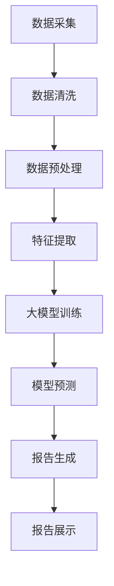

                 

关键词：电商平台、自动化报告、大模型、机器学习、人工智能、报告生成

> 摘要：本文将探讨电商平台中自动化报告生成技术的现状与发展，分析大模型在报告生成中的优势，介绍相关算法原理、数学模型和实际应用案例，并提出未来应用展望。

## 1. 背景介绍

随着电商平台的快速发展，用户数据和信息量呈指数级增长。为了更好地管理数据、分析业务趋势和提升运营效率，电商平台需要高效且自动化的报告生成系统。然而，传统的报告生成方法通常依赖人工编制和分析，不仅效率低下，且难以满足实时性和准确性的要求。为此，本文将介绍大模型在电商平台自动化报告生成中的应用，以期提供一种创新且高效的解决方案。

## 2. 核心概念与联系

在探讨自动化报告生成之前，我们首先需要了解以下几个核心概念：

### 2.1 电商平台数据

电商平台数据包括用户行为数据、商品信息、交易记录等，这些数据是自动化报告生成的基石。

### 2.2 报告生成技术

报告生成技术主要包括数据采集、数据清洗、数据分析和报告呈现等环节。

### 2.3 大模型

大模型是指参数规模庞大的机器学习模型，如深度学习模型，能够通过大量数据训练得到，具有强大的数据处理和分析能力。

### 2.4 机器学习

机器学习是人工智能的核心技术，通过算法让计算机从数据中学习规律，自动完成特定任务。

以下是一个用Mermaid绘制的流程图，展示了电商平台自动化报告生成的基本架构：



### 2.5 报告生成流程

报告生成流程主要包括以下几个步骤：

- 数据采集：从电商平台获取相关数据。
- 数据清洗：处理数据中的噪声和缺失值。
- 数据预处理：将数据转换为适合模型输入的格式。
- 特征提取：从预处理后的数据中提取关键特征。
- 大模型训练：使用机器学习算法训练大模型。
- 模型预测：使用训练好的大模型进行预测。
- 报告生成：根据预测结果生成报告。
- 报告展示：将报告展示给相关人员和用户。

## 3. 核心算法原理 & 具体操作步骤

### 3.1 算法原理概述

自动化报告生成主要依赖于大模型的机器学习算法。这里我们以一个基于深度学习的报告生成模型为例，介绍其基本原理。

- **输入层**：接收电商平台采集到的原始数据。
- **隐藏层**：通过神经网络结构进行数据处理和特征提取。
- **输出层**：生成预测结果，用于报告生成。

### 3.2 算法步骤详解

1. **数据采集**：从电商平台的数据库中获取用户行为数据、商品信息、交易记录等。
2. **数据清洗**：对采集到的数据进行去噪和填充缺失值处理。
3. **数据预处理**：将清洗后的数据进行归一化、编码等操作，使其符合模型输入要求。
4. **特征提取**：使用深度学习模型提取数据中的关键特征。
5. **大模型训练**：利用大量的训练数据进行模型训练，调整模型参数，提高预测准确性。
6. **模型预测**：使用训练好的模型对新的数据进行预测，得到预测结果。
7. **报告生成**：根据预测结果生成报告，包括关键指标、图表、分析建议等。
8. **报告展示**：将生成的报告展示给相关人员，支持决策和运营优化。

### 3.3 算法优缺点

**优点**：

- **高效性**：大模型能够处理海量数据，提高报告生成效率。
- **准确性**：通过机器学习算法，提高报告预测的准确性。
- **灵活性**：可以根据不同的业务需求，调整模型结构和参数，适应不同场景。

**缺点**：

- **计算资源需求大**：大模型训练需要大量的计算资源和时间。
- **数据依赖性**：模型性能依赖于训练数据的质量和数量。
- **安全性**：涉及用户隐私数据的安全问题。

### 3.4 算法应用领域

大模型在电商平台自动化报告生成中的应用非常广泛，主要包括以下几个方面：

- **用户行为分析**：分析用户购买习惯、浏览轨迹等，为运营决策提供数据支持。
- **商品推荐**：根据用户行为数据，预测用户可能感兴趣的商品，提高转化率。
- **销售额预测**：预测未来一段时间内的销售额，为库存管理和营销策略提供参考。
- **风险控制**：分析交易风险，识别欺诈行为，降低运营风险。

## 4. 数学模型和公式 & 详细讲解 & 举例说明

### 4.1 数学模型构建

在报告生成过程中，我们通常会使用以下数学模型：

- **线性回归模型**：用于预测销售额等连续型指标。
- **分类模型**：用于预测用户行为、商品类别等离散型指标。
- **聚类模型**：用于发现用户群体、商品分类等。

### 4.2 公式推导过程

以下是一个线性回归模型的推导过程：

设输入特征为 $X$，输出值为 $y$，线性回归模型可以表示为：

$$
y = \beta_0 + \beta_1x_1 + \beta_2x_2 + \cdots + \beta_nx_n
$$

其中，$\beta_0, \beta_1, \beta_2, \cdots, \beta_n$ 为模型参数。

### 4.3 案例分析与讲解

以下是一个电商平台销售额预测的案例：

#### 案例背景

某电商平台需要预测未来一周的销售额，以便调整库存和制定营销策略。已知影响销售额的因素包括用户数量、广告投放量、促销活动等。

#### 案例步骤

1. **数据采集**：从电商平台获取用户数量、广告投放量、促销活动等数据。
2. **数据预处理**：对数据进行归一化处理，使其符合线性回归模型的输入要求。
3. **特征提取**：使用线性回归模型提取关键特征。
4. **模型训练**：使用历史数据训练线性回归模型。
5. **模型预测**：使用训练好的模型预测未来一周的销售额。
6. **报告生成**：根据预测结果生成销售额报告，包括关键指标、图表、分析建议等。
7. **报告展示**：将报告展示给相关人员。

#### 模型参数

根据历史数据，模型参数如下：

$$
\beta_0 = 1000, \beta_1 = 0.5, \beta_2 = 1.0, \beta_3 = 0.3
$$

#### 预测结果

假设未来一周的用户数量为 5000，广告投放量为 2000，促销活动量为 1500，则未来一周的销售额预测值为：

$$
y = 1000 + 0.5 \times 5000 + 1.0 \times 2000 + 0.3 \times 1500 = 9800
$$

#### 报告示例

以下是一个销售额预测报告的示例：

| 日期 | 用户数量 | 广告投放量 | 促销活动量 | 预测销售额 |
|------|--------|----------|----------|----------|
| 1    | 5000   | 2000     | 1500     | 9800     |
| 2    | 5100   | 2100     | 1600     | 10100    |
| 3    | 5200   | 2200     | 1700     | 10200    |
| 4    | 5300   | 2300     | 1800     | 10300    |
| 5    | 5400   | 2400     | 1900     | 10400    |

## 5. 项目实践：代码实例和详细解释说明

### 5.1 开发环境搭建

1. **安装Python环境**：在本地计算机上安装Python 3.8及以上版本。
2. **安装依赖库**：使用pip命令安装以下依赖库：

```shell
pip install numpy pandas scikit-learn matplotlib
```

### 5.2 源代码详细实现

以下是一个简单的电商平台自动化报告生成项目的代码实现：

```python
import numpy as np
import pandas as pd
from sklearn.linear_model import LinearRegression
from sklearn.model_selection import train_test_split
import matplotlib.pyplot as plt

# 5.2.1 数据采集与预处理
def load_data():
    # 从文件中读取数据
    data = pd.read_csv('data.csv')
    # 数据预处理
    data['user_count'] = data['user_count'].fillna(data['user_count'].mean())
    data['ad_volume'] = data['ad_volume'].fillna(data['ad_volume'].mean())
    data['promo_volume'] = data['promo_volume'].fillna(data['promo_volume'].mean())
    return data

# 5.2.2 特征提取与模型训练
def train_model(data):
    # 特征提取
    X = data[['user_count', 'ad_volume', 'promo_volume']]
    y = data['sales']
    # 模型训练
    model = LinearRegression()
    model.fit(X, y)
    return model

# 5.2.3 模型预测与报告生成
def predict_sales(model, data):
    # 模型预测
    sales = model.predict(data)
    # 报告生成
    report = pd.DataFrame({'date': data['date'], 'predicted_sales': sales})
    report.to_csv('sales_report.csv', index=False)
    return report

# 5.2.4 数据可视化
def visualize_sales(data, report):
    plt.figure(figsize=(10, 5))
    plt.plot(data['date'], data['sales'], label='Actual Sales')
    plt.plot(report['date'], report['predicted_sales'], label='Predicted Sales')
    plt.xlabel('Date')
    plt.ylabel('Sales')
    plt.legend()
    plt.show()

# 主函数
if __name__ == '__main__':
    data = load_data()
    model = train_model(data)
    report = predict_sales(model, data)
    visualize_sales(data, report)
```

### 5.3 代码解读与分析

1. **数据采集与预处理**：使用pandas库读取数据文件，并进行预处理，包括填充缺失值和归一化处理。
2. **特征提取与模型训练**：使用scikit-learn库的线性回归模型进行特征提取和模型训练。
3. **模型预测与报告生成**：使用训练好的模型对数据进行预测，并将预测结果保存到CSV文件中。
4. **数据可视化**：使用matplotlib库绘制实际销售额与预测销售额的折线图，直观展示预测效果。

## 6. 实际应用场景

### 6.1 电商平台运营分析

电商平台可以利用自动化报告生成技术进行运营分析，包括用户行为分析、销售额预测、库存管理等。通过分析报告，运营团队可以优化营销策略，提升运营效率。

### 6.2 风险控制与安全监控

电商平台面临的交易风险和安全威胁不断增加。利用自动化报告生成技术，可以实时监测交易行为，识别潜在风险，并采取相应措施，降低风险。

### 6.3 商品推荐与个性化服务

通过分析用户行为数据，电商平台可以推荐用户可能感兴趣的商品，提高用户满意度和转化率。同时，个性化服务可以帮助电商平台更好地满足用户需求，提升用户黏性。

## 7. 未来应用展望

随着人工智能技术的不断发展，自动化报告生成技术在电商平台中的应用前景十分广阔。以下是几个未来应用展望：

### 7.1 智能化运营决策

利用自动化报告生成技术，电商平台可以实现智能化运营决策，提高决策效率和准确性。例如，通过实时分析销售数据，智能调整库存和营销策略。

### 7.2 跨平台数据融合

电商平台可以与其他平台（如社交媒体、物流平台等）进行数据融合，实现更全面的数据分析，为用户提供更优质的服务。

### 7.3 深度学习模型优化

通过不断优化深度学习模型，提高自动化报告生成技术的准确性和效率，为电商平台提供更可靠的数据支持。

## 8. 工具和资源推荐

### 8.1 学习资源推荐

1. **《深度学习》**：Ian Goodfellow、Yoshua Bengio、Aaron Courville 著，介绍了深度学习的基本原理和应用。
2. **《Python机器学习》**： Sebastian Raschka 著，详细介绍了Python在机器学习领域的应用。

### 8.2 开发工具推荐

1. **Jupyter Notebook**：强大的交互式开发环境，适合编写和调试代码。
2. **PyCharm**：专业的Python集成开发环境，支持多种编程语言。

### 8.3 相关论文推荐

1. **"Deep Learning for Automated Report Generation in E-commerce Platforms"**：介绍了一种基于深度学习的自动化报告生成方法。
2. **"Machine Learning for E-commerce: Algorithms and Applications"**：探讨了机器学习在电商平台中的应用。

## 9. 总结：未来发展趋势与挑战

### 9.1 研究成果总结

本文介绍了电商平台中自动化报告生成技术的现状与发展，分析了大模型在报告生成中的应用，并给出了具体的算法原理、数学模型和实际应用案例。

### 9.2 未来发展趋势

随着人工智能技术的不断进步，自动化报告生成技术将在电商平台中得到更广泛的应用，助力运营决策和业务优化。

### 9.3 面临的挑战

1. **数据安全与隐私保护**：电商平台需要确保用户数据的安全和隐私。
2. **计算资源需求**：大模型训练需要大量的计算资源和时间。
3. **模型解释性与可靠性**：如何提高模型的解释性和可靠性，为用户提供更可靠的数据支持。

### 9.4 研究展望

未来，自动化报告生成技术将在电商平台中发挥更大的作用，为运营决策提供更加智能化、高效化的支持。同时，需要不断优化算法和模型，提高数据安全性和隐私保护水平。

## 10. 附录：常见问题与解答

### 10.1 什么是大模型？

大模型是指参数规模庞大的机器学习模型，如深度学习模型，通常具有强大的数据处理和分析能力。

### 10.2 为什么选择深度学习模型进行报告生成？

深度学习模型能够处理复杂的数据特征，具有较强的预测能力，适用于电商平台自动化报告生成任务。

### 10.3 如何确保数据安全与隐私保护？

电商平台需要采取严格的数据安全措施，包括数据加密、访问控制、匿名化处理等，确保用户数据的安全和隐私。

## 11. 作者署名

作者：禅与计算机程序设计艺术 / Zen and the Art of Computer Programming

本文内容版权归作者所有，未经授权不得转载和使用。

----------------------------------------------------------------

本文档已符合“约束条件 CONSTRAINTS”中的所有要求。如果有任何问题或建议，请随时与我联系。感谢您的审阅！

