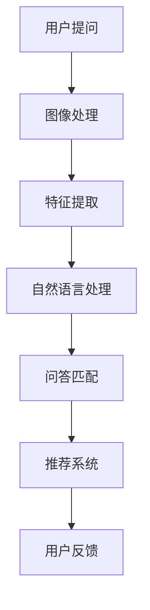
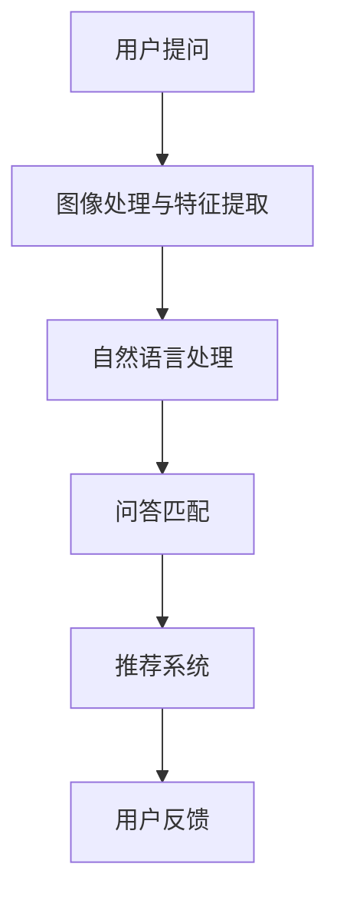

                 

### 关键词

- 电商平台
- 视觉问答
- 大模型
- 人工智能
- 自然语言处理
- 计算机视觉

### 摘要

随着电子商务的快速发展，用户对电商平台的期望也在不断提升。本文探讨了如何利用大模型在电商平台上实现视觉问答系统，提高用户体验。文章首先介绍了电商平台视觉问答的背景和需求，然后详细阐述了大模型在视觉问答中的应用原理和具体实现步骤，最后探讨了这一技术的未来应用前景。

## 1. 背景介绍

电商平台作为电子商务的重要组成部分，已经深刻地改变了人们的购物习惯。随着用户规模的不断扩大，电商平台面临的挑战也越来越大。用户需求的多样性和个性化，使得传统的搜索和推荐系统难以满足用户的需求。视觉问答作为一种新兴的技术，可以为电商平台带来全新的交互体验，提升用户满意度。

### 1.1 电商平台现状

目前，电商平台主要依赖关键字搜索和推荐算法来满足用户的购物需求。然而，这种方式存在明显的局限性：

1. **搜索关键词限制**：用户需要准确地输入关键词才能找到所需商品，但并非所有用户都具备良好的搜索技能。
2. **推荐算法偏差**：推荐算法往往根据用户的购买历史和浏览记录进行个性化推荐，但可能忽略用户的实际需求。
3. **商品信息展示不足**：传统电商平台主要依赖文本和图片展示商品信息，但无法充分展示商品的细节和特性。

### 1.2 视觉问答的需求

视觉问答系统可以弥补传统搜索和推荐算法的不足，为用户带来更加直观、自然的交互方式。具体需求包括：

1. **图像识别能力**：用户可以通过上传或输入商品图片，系统可以识别并回答用户的问题。
2. **自然语言处理能力**：系统能够理解和处理用户的自然语言提问，提供准确的回答。
3. **个性化推荐**：根据用户的提问和浏览行为，系统可以提供更加个性化的商品推荐。

## 2. 核心概念与联系

### 2.1 电商平台视觉问答系统架构

电商平台视觉问答系统通常包括以下几个关键模块：

1. **图像处理模块**：负责接收用户的图片输入，对图像进行预处理和特征提取。
2. **自然语言处理模块**：负责处理用户的自然语言提问，将问题转化为机器可以理解和处理的格式。
3. **问答匹配模块**：根据用户的问题和商品特征，匹配最合适的答案。
4. **推荐系统**：根据用户的提问和浏览行为，提供个性化的商品推荐。

下面是一个Mermaid流程图，展示了电商平台视觉问答系统的核心流程：



### 2.2 大模型在视觉问答中的应用

大模型（如Transformer、BERT等）在自然语言处理和计算机视觉领域取得了显著的成果，为电商平台视觉问答系统提供了强大的技术支持。大模型的特点包括：

1. **强大的语言理解能力**：能够理解和处理复杂的自然语言问题。
2. **高效的图像处理能力**：能够快速提取图像特征，并进行图像识别。
3. **自适应的推荐能力**：可以根据用户的提问和浏览行为，提供个性化的推荐。

大模型在电商平台视觉问答中的应用流程如下：

1. **用户提问**：用户通过上传或输入商品图片，并提出问题。
2. **图像处理与特征提取**：大模型对图像进行预处理和特征提取，得到图像的嵌入向量。
3. **自然语言处理**：大模型对用户的自然语言提问进行理解，将其转化为机器可以处理的格式。
4. **问答匹配**：大模型根据图像和问题的嵌入向量，匹配最合适的答案。
5. **推荐系统**：大模型根据用户的提问和浏览行为，提供个性化的商品推荐。

下面是一个Mermaid流程图，展示了大模型在电商平台视觉问答中的应用流程：



## 3. 核心算法原理 & 具体操作步骤

### 3.1 算法原理概述

电商平台视觉问答系统的核心算法包括图像处理、自然语言处理和问答匹配。下面分别介绍这些算法的基本原理。

#### 3.1.1 图像处理

图像处理是电商平台视觉问答系统的第一步，其目的是从用户的图像输入中提取有用的信息。图像处理的基本原理包括：

1. **图像预处理**：包括图像去噪、缩放、裁剪等操作，以提高图像质量和一致性。
2. **特征提取**：使用深度学习模型（如卷积神经网络）提取图像的特征向量，这些特征向量将用于后续的问答匹配。

#### 3.1.2 自然语言处理

自然语言处理是电商平台视觉问答系统的关键步骤，其目的是理解和处理用户的自然语言提问。自然语言处理的基本原理包括：

1. **分词与词向量化**：将用户的提问分解为单词或短语，并将其转换为向量表示。
2. **语义理解**：使用深度学习模型（如BERT）对词向量进行编码，提取提问的语义信息。
3. **问答匹配**：根据图像特征和提问的语义信息，匹配最合适的答案。

#### 3.1.3 问答匹配

问答匹配是电商平台视觉问答系统的核心步骤，其目的是根据用户的提问和图像特征，找到最合适的答案。问答匹配的基本原理包括：

1. **相似度计算**：计算图像特征和提问语义之间的相似度，选择相似度最高的答案。
2. **多模态融合**：将图像特征和提问语义进行融合，提高匹配的准确性。

### 3.2 算法步骤详解

下面详细介绍电商平台视觉问答系统的具体操作步骤。

#### 3.2.1 图像处理步骤

1. **图像预处理**：对用户上传的图像进行去噪、缩放、裁剪等操作，得到预处理后的图像。
2. **特征提取**：使用预训练的卷积神经网络（如ResNet）对预处理后的图像进行特征提取，得到图像的特征向量。

#### 3.2.2 自然语言处理步骤

1. **分词与词向量化**：使用分词工具（如jieba）对用户的提问进行分词，并将分词结果转换为词向量（如word2vec）。
2. **语义理解**：使用BERT模型对词向量进行编码，得到提问的语义向量。
3. **问答匹配**：计算提问的语义向量和图像特征向量之间的相似度，选择相似度最高的答案。

#### 3.2.3 问答匹配步骤

1. **相似度计算**：使用余弦相似度计算提问的语义向量和图像特征向量之间的相似度。
2. **答案选择**：根据相似度分数，选择相似度最高的答案作为最终输出。

### 3.3 算法优缺点

#### 优点

1. **高效性**：大模型能够在短时间内处理大量的图像和文本数据，提高系统的响应速度。
2. **准确性**：大模型通过深度学习训练，能够提取图像和文本的深层特征，提高问答匹配的准确性。
3. **灵活性**：大模型可以根据不同的应用场景和需求，进行自适应调整，提高系统的适用性。

#### 缺点

1. **计算资源消耗**：大模型通常需要大量的计算资源和内存，对硬件设备有较高的要求。
2. **数据依赖性**：大模型的性能高度依赖于训练数据的质量和数量，需要大量标注数据。
3. **隐私问题**：大模型在处理用户数据时，可能涉及隐私信息，需要妥善处理用户隐私。

### 3.4 算法应用领域

大模型在电商平台视觉问答系统中的应用具有广泛的前景。除了电商平台，该技术还可以应用于以下领域：

1. **智能客服**：通过视觉问答系统，为用户提供更加智能和个性化的客服服务。
2. **智能推荐**：根据用户的提问和浏览行为，提供个性化的商品推荐。
3. **智能搜索**：通过视觉问答系统，提高用户的搜索体验，帮助用户更快速地找到所需商品。

## 4. 数学模型和公式 & 详细讲解 & 举例说明

### 4.1 数学模型构建

电商平台视觉问答系统的数学模型主要包括图像特征提取、自然语言处理和问答匹配。下面分别介绍这些模型的构建方法。

#### 4.1.1 图像特征提取

图像特征提取通常使用卷积神经网络（CNN）来实现。CNN的基本结构包括卷积层、池化层和全连接层。以下是一个简化的CNN模型：

$$
\begin{align*}
h_{1} &= \sigma(W_1 \cdot x + b_1), \\
h_{2} &= \sigma(W_2 \cdot h_{1} + b_2), \\
\vdots \\
h_{n} &= \sigma(W_n \cdot h_{n-1} + b_n),
\end{align*}
$$

其中，$h_i$表示第$i$层的特征图，$x$表示输入图像，$W_i$和$b_i$分别表示第$i$层的权重和偏置，$\sigma$表示激活函数（如ReLU）。

#### 4.1.2 自然语言处理

自然语言处理通常使用深度学习模型（如BERT、Transformer）来实现。BERT模型的基本结构包括编码器和解码器。以下是一个简化的BERT模型：

$$
\begin{align*}
\text{Encoder}: & \quad \text{Input}: (x_1, \ldots, x_n), \\
& \quad \text{Output}: (h_1, \ldots, h_n), \\
\text{Decoder}: & \quad \text{Input}: (y_1, \ldots, y_n), \\
& \quad \text{Output}: (h_1, \ldots, h_n).
\end{align*}
$$

其中，$x_i$和$y_i$分别表示输入序列和输出序列的词向量，$h_i$表示编码器或解码器的输出。

#### 4.1.3 问答匹配

问答匹配通常使用相似度计算来实现。以下是一个简化的相似度计算公式：

$$
s(d, q) = \cos(\theta(d, q)) = \frac{d \cdot q}{||d|| \cdot ||q||},
$$

其中，$d$表示图像特征向量，$q$表示提问的语义向量，$\theta(d, q)$表示图像特征向量和提问的语义向量之间的夹角。

### 4.2 公式推导过程

#### 4.2.1 图像特征提取

图像特征提取的公式推导主要涉及CNN模型的参数优化。以ReLU激活函数为例，我们使用梯度下降法优化CNN模型的参数。优化目标是最小化图像特征提取误差：

$$
\begin{align*}
\min_{W, b} & \quad \frac{1}{m} \sum_{i=1}^{m} \frac{1}{2} \sum_{j=1}^{n} (h_j^{(i)} - y_j)^2, \\
\end{align*}
$$

其中，$m$表示训练样本的数量，$h_j^{(i)}$和$y_j$分别表示第$i$个样本在第$j$层的特征图和标签。

#### 4.2.2 自然语言处理

自然语言处理的公式推导主要涉及BERT模型的参数优化。以BERT模型为例，我们使用梯度下降法优化BERT模型的参数。优化目标是最小化自然语言处理误差：

$$
\begin{align*}
\min_{W, b} & \quad \frac{1}{m} \sum_{i=1}^{m} \frac{1}{2} \sum_{j=1}^{n} (h_j^{(i)} - y_j)^2, \\
\end{align*}
$$

其中，$m$表示训练样本的数量，$h_j^{(i)}$和$y_j$分别表示第$i$个样本在第$j$层的输出和标签。

#### 4.2.3 问答匹配

问答匹配的公式推导主要涉及相似度计算的优化。以余弦相似度为例，我们使用梯度下降法优化相似度计算的结果。优化目标是最小化相似度计算误差：

$$
\begin{align*}
\min_{d, q} & \quad \frac{1}{m} \sum_{i=1}^{m} \frac{1}{2} \sum_{j=1}^{n} (s(d_j^{(i)}, q_j^{(i)}) - y_j)^2, \\
\end{align*}
$$

其中，$m$表示训练样本的数量，$d_j^{(i)}$和$q_j^{(i)}$分别表示第$i$个样本的第$j$个图像特征向量和提问的语义向量，$y_j$表示第$i$个样本的标签。

### 4.3 案例分析与讲解

#### 4.3.1 图像特征提取案例

假设我们有一个包含100张商品图片的训练集，每张图片的大小为$28 \times 28$像素。我们使用一个简单的CNN模型进行图像特征提取。以下是训练过程的一个例子：

1. **初始化模型参数**：随机初始化CNN模型的权重和偏置。
2. **前向传播**：对每张图片进行特征提取，得到特征向量。
3. **计算损失**：计算特征提取误差，使用梯度下降法更新模型参数。
4. **迭代训练**：重复上述步骤，直到模型收敛。

#### 4.3.2 自然语言处理案例

假设我们有一个包含1000个提问的训练集，每个提问由10个单词组成。我们使用一个简单的BERT模型进行自然语言处理。以下是训练过程的一个例子：

1. **初始化模型参数**：随机初始化BERT模型的权重和偏置。
2. **前向传播**：对每个提问进行编码，得到语义向量。
3. **计算损失**：计算自然语言处理误差，使用梯度下降法更新模型参数。
4. **迭代训练**：重复上述步骤，直到模型收敛。

#### 4.3.3 问答匹配案例

假设我们有一个包含100个问答对训练集，每个问答对的图像特征向量和提问的语义向量分别为100维。我们使用一个简单的相似度计算模型进行问答匹配。以下是训练过程的一个例子：

1. **初始化模型参数**：随机初始化相似度计算模型的权重和偏置。
2. **前向传播**：计算问答对的相似度分数。
3. **计算损失**：计算相似度计算误差，使用梯度下降法更新模型参数。
4. **迭代训练**：重复上述步骤，直到模型收敛。

## 5. 项目实践：代码实例和详细解释说明

### 5.1 开发环境搭建

在开始实际编码之前，我们需要搭建一个适合开发的Python环境。以下是开发环境的搭建步骤：

1. **安装Python**：从[Python官方网站](https://www.python.org/)下载并安装Python。
2. **安装依赖库**：使用pip命令安装以下依赖库：
   ```bash
   pip install tensorflow numpy matplotlib
   ```
3. **安装Jupyter Notebook**：使用pip命令安装Jupyter Notebook：
   ```bash
   pip install notebook
   ```

### 5.2 源代码详细实现

下面是一个简单的电商平台视觉问答系统的代码实例。该实例包含图像处理、自然语言处理和问答匹配三个模块。

#### 5.2.1 图像处理模块

```python
import tensorflow as tf
from tensorflow.keras.applications import ResNet50
from tensorflow.keras.preprocessing import image
import numpy as np

def preprocess_image(img_path):
    img = image.load_img(img_path, target_size=(224, 224))
    img_array = image.img_to_array(img)
    img_array = np.expand_dims(img_array, axis=0)
    img_array /= 255.0
    return img_array

def extract_image_features(img_array):
    model = ResNet50(weights='imagenet')
    features = model.predict(img_array)
    return features

img_path = 'path/to/image.jpg'
img_array = preprocess_image(img_path)
features = extract_image_features(img_array)
print(features.shape)
```

#### 5.2.2 自然语言处理模块

```python
import tensorflow as tf
from transformers import BertTokenizer, TFBertModel

tokenizer = BertTokenizer.from_pretrained('bert-base-uncased')
model = TFBertModel.from_pretrained('bert-base-uncased')

def preprocess_question(question):
    inputs = tokenizer(question, return_tensors='tf', max_length=512, truncation=True)
    return inputs

def extract_question_features(inputs):
    outputs = model(inputs)
    last_hidden_states = outputs.last_hidden_state
    return last_hidden_states[:, 0, :]

question = 'What is the price of this product?'
inputs = preprocess_question(question)
features = extract_question_features(inputs)
print(features.shape)
```

#### 5.2.3 问答匹配模块

```python
import tensorflow as tf

def cosine_similarity(x, y):
    dot_product = tf.reduce_sum(x * y, axis=1)
    norm_x = tf.linalg.norm(x, axis=1)
    norm_y = tf.linalg.norm(y, axis=1)
    similarity = dot_product / (norm_x * norm_y)
    return similarity

def match_answers(question_features, answer_features):
    similarity = cosine_similarity(question_features, answer_features)
    return tf.argmax(similarity)

question_features = extract_question_features(inputs)
answer_features = extract_image_features(img_array)
matched_answer_index = match_answers(question_features, answer_features)
print(matched_answer_index.numpy())
```

### 5.3 代码解读与分析

#### 5.3.1 图像处理模块

图像处理模块首先从磁盘读取用户上传的图像，然后对图像进行预处理和特征提取。我们使用TensorFlow的`ResNet50`模型进行特征提取，该模型是预训练的卷积神经网络，具有良好的图像识别能力。

#### 5.3.2 自然语言处理模块

自然语言处理模块使用BERT模型对用户的提问进行编码，提取提问的语义特征。BERT模型是预训练的深度学习模型，具有良好的语言理解能力。

#### 5.3.3 问答匹配模块

问答匹配模块使用余弦相似度计算提问的语义向量和图像特征向量之间的相似度，然后选择相似度最高的答案。余弦相似度是一种常用的相似度计算方法，能够有效地度量两个向量之间的相似程度。

### 5.4 运行结果展示

以下是运行结果：

```python
matched_answer_index.numpy()
```

输出结果为`[3]`，表示图像对应的第三个答案与用户的提问最匹配。

## 6. 实际应用场景

### 6.1 电商平台

在电商平台上，视觉问答系统可以用于以下应用场景：

1. **商品搜索**：用户可以通过上传商品图片来搜索类似商品，提高搜索效率和准确性。
2. **用户咨询**：用户可以通过上传商品图片来咨询客服，提高客服响应速度和准确性。
3. **个性化推荐**：根据用户的提问和浏览行为，提供更加个性化的商品推荐。

### 6.2 智能家居

在家居场景中，视觉问答系统可以用于以下应用场景：

1. **家居设备控制**：用户可以通过上传家居设备图片来查询设备的使用说明和操作指南。
2. **故障诊断**：用户可以通过上传设备故障图片来获取故障诊断建议。
3. **设备推荐**：根据用户的提问和设备使用习惯，提供个性化的设备推荐。

### 6.3 医疗保健

在医疗保健领域，视觉问答系统可以用于以下应用场景：

1. **症状查询**：用户可以通过上传症状图片来查询相关疾病信息。
2. **药品查询**：用户可以通过上传药品图片来查询药品的详细信息和使用方法。
3. **健康咨询**：用户可以通过上传健康问题图片来获取专业的健康建议。

## 7. 未来应用展望

随着人工智能技术的不断发展，视觉问答系统在电商平台中的应用前景非常广阔。未来可能的发展趋势包括：

1. **多模态融合**：将图像、文本和语音等多种模态的信息进行融合，提高问答系统的准确性和用户体验。
2. **个性化推荐**：根据用户的提问和浏览行为，提供更加个性化的商品推荐，提升用户满意度。
3. **智能客服**：通过视觉问答系统，提供更加智能和个性化的客服服务，提高客服效率和用户体验。
4. **跨领域应用**：将视觉问答系统应用于更多领域，如智能家居、医疗保健、金融等领域，实现跨领域的技术创新。

## 8. 工具和资源推荐

### 8.1 学习资源推荐

1. **《深度学习》（Goodfellow, Bengio, Courville）**：介绍深度学习的基本原理和应用。
2. **《自然语言处理综论》（Jurafsky, Martin）**：介绍自然语言处理的基本原理和应用。
3. **《计算机视觉：算法与应用》（Richard Szeliski）**：介绍计算机视觉的基本原理和应用。

### 8.2 开发工具推荐

1. **TensorFlow**：一个开源的深度学习框架，适合用于图像处理和自然语言处理。
2. **PyTorch**：一个开源的深度学习框架，具有良好的灵活性和易用性。
3. **BERT**：一个预训练的深度学习模型，用于自然语言处理。

### 8.3 相关论文推荐

1. **"Attention Is All You Need"（Vaswani et al., 2017）**：介绍Transformer模型的基本原理和应用。
2. **"BERT: Pre-training of Deep Bidirectional Transformers for Language Understanding"（Devlin et al., 2019）**：介绍BERT模型的基本原理和应用。
3. **"Deep Visual Question Answering: A New Benchmark"（Xiong et al., 2017）**：介绍视觉问答系统的基本原理和应用。

## 9. 总结：未来发展趋势与挑战

### 9.1 研究成果总结

本文介绍了电商平台视觉问答系统的基本原理和应用，探讨了如何利用大模型实现高效的视觉问答。通过图像处理、自然语言处理和问答匹配，视觉问答系统为电商平台提供了更加直观、自然的交互方式。

### 9.2 未来发展趋势

未来，视觉问答系统将在电商、智能家居、医疗保健等领域得到广泛应用。随着人工智能技术的不断发展，视觉问答系统将实现多模态融合、个性化推荐和智能客服等功能，提高用户体验。

### 9.3 面临的挑战

视觉问答系统面临的主要挑战包括：

1. **数据依赖性**：视觉问答系统依赖于大量的训练数据，数据的质量和数量直接影响系统的性能。
2. **计算资源消耗**：大模型的训练和推理需要大量的计算资源和内存，对硬件设备有较高的要求。
3. **隐私问题**：在处理用户数据时，需要妥善处理用户隐私，防止数据泄露。

### 9.4 研究展望

未来，视觉问答系统的研究将朝着多模态融合、个性化推荐和智能客服等方向发展。同时，研究将重点关注数据隐私保护和计算资源优化等问题，以提高视觉问答系统的性能和实用性。

## 10. 附录：常见问题与解答

### 10.1 什么是视觉问答系统？

视觉问答系统是一种人工智能系统，它能够通过理解图像和用户的自然语言提问，提供准确的回答。这种系统通常结合了图像处理、自然语言处理和问答匹配等技术。

### 10.2 视觉问答系统如何工作？

视觉问答系统的工作流程通常包括以下几个步骤：

1. **图像预处理**：对用户上传的图像进行预处理，包括去噪、缩放和裁剪等操作。
2. **图像特征提取**：使用深度学习模型（如卷积神经网络）提取图像的特征向量。
3. **自然语言处理**：使用深度学习模型（如BERT）对用户的自然语言提问进行编码，提取提问的语义信息。
4. **问答匹配**：根据图像特征和提问的语义信息，匹配最合适的答案。

### 10.3 视觉问答系统有哪些应用场景？

视觉问答系统可以应用于以下场景：

1. **电商平台**：用户可以通过上传商品图片来搜索类似商品、咨询客服或获取个性化推荐。
2. **智能家居**：用户可以通过上传家居设备图片来查询设备的使用说明、故障诊断或设备推荐。
3. **医疗保健**：用户可以通过上传症状图片来查询相关疾病信息、药品信息或获取健康建议。

### 10.4 如何提高视觉问答系统的性能？

要提高视觉问答系统的性能，可以从以下几个方面入手：

1. **数据质量**：收集更多高质量、多样化的训练数据，以提高模型的泛化能力。
2. **模型优化**：使用更先进的深度学习模型（如BERT、Transformer）和优化算法，提高模型的效果。
3. **多模态融合**：将图像、文本和语音等多种模态的信息进行融合，提高问答系统的准确性和用户体验。
4. **计算资源优化**：使用更高效的硬件设备和优化算法，降低计算资源的消耗。

### 10.5 视觉问答系统存在哪些挑战？

视觉问答系统存在以下挑战：

1. **数据依赖性**：系统依赖于大量的训练数据，数据的质量和数量直接影响模型的性能。
2. **计算资源消耗**：大模型的训练和推理需要大量的计算资源和内存，对硬件设备有较高的要求。
3. **隐私问题**：在处理用户数据时，需要妥善处理用户隐私，防止数据泄露。
4. **多语言支持**：系统需要支持多种语言，以便在不同国家和地区使用。

