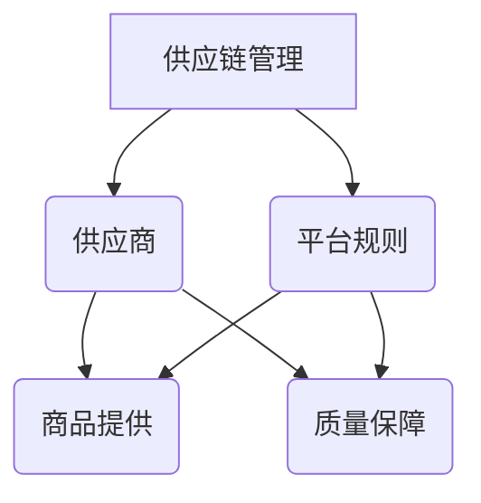

                 

关键词：电商平台，供给能力，供应商扶持，平台规则，算法原理，数学模型，代码实例，实际应用，未来展望

> 摘要：本文旨在探讨电商平台如何通过供应商扶持和平台规则的制定来提升其供给能力。我们将从核心概念、算法原理、数学模型、项目实践以及未来展望等多个角度进行分析，为电商平台的发展提供有益的指导。

## 1. 背景介绍

在当前数字经济蓬勃发展的时代，电商平台已经成为许多消费者购买商品的首选渠道。为了在激烈的市场竞争中立于不败之地，电商平台必须不断提升其供给能力，以满足消费者的多样化需求。供给能力不仅包括商品种类、价格、质量等多个方面，还涉及供应链管理、平台规则、供应商扶持等多个方面。

### 电商平台供给能力的含义

电商平台供给能力指的是平台在满足消费者需求方面的综合能力。这包括以下几方面：

- **商品多样性**：平台提供的商品种类繁多，满足不同消费者的购物需求。
- **价格竞争力**：平台提供的价格具有竞争力，吸引消费者购买。
- **服务质量**：平台提供的服务质量高，提升消费者的购物体验。
- **供应链管理**：平台能够高效地管理供应链，确保商品快速、安全地交付给消费者。

### 供应商扶持与平台规则的重要性

供应商扶持和平台规则的制定是提升电商平台供给能力的关键因素。通过供应商扶持，电商平台可以帮助供应商提升生产效率、降低成本，从而为消费者提供更多优质商品。而平台规则的制定则能够规范供应商行为，提高供应链的透明度和公平性，保障消费者的权益。

## 2. 核心概念与联系

为了深入探讨电商平台供给能力提升的方法，我们需要了解以下几个核心概念：

- **供应链管理**：供应链管理是指对商品从生产、运输、储存到销售的整个过程的协调与控制。
- **供应商**：供应商是指向电商平台提供商品的第三方企业或个人。
- **平台规则**：平台规则是指电商平台制定的用于规范供应商行为和保障消费者权益的准则。

### Mermaid 流程图

下面是一个简化的 Mermaid 流程图，展示了供应链管理、供应商和平台规则之间的联系：



## 3. 核心算法原理 & 具体操作步骤

### 3.1 算法原理概述

为了提升电商平台供给能力，我们可以采用以下核心算法：

- **供需预测算法**：通过分析历史数据和消费者行为，预测未来的供需情况。
- **供应链优化算法**：通过优化供应链节点，降低成本，提高效率。
- **平台规则优化算法**：通过分析供应商行为，优化平台规则，提高供应链透明度和公平性。

### 3.2 算法步骤详解

#### 3.2.1 供需预测算法

1. **数据收集**：收集历史销售数据、消费者行为数据等。
2. **数据预处理**：对数据进行清洗、去噪、归一化等处理。
3. **模型选择**：选择合适的预测模型，如 ARIMA、LSTM 等。
4. **模型训练**：使用预处理后的数据训练模型。
5. **预测**：使用训练好的模型预测未来的供需情况。

#### 3.2.2 供应链优化算法

1. **节点分析**：分析供应链各节点的成本、效率等因素。
2. **优化目标确定**：确定优化目标，如最小化总成本、最大化效率等。
3. **算法选择**：选择合适的优化算法，如线性规划、遗传算法等。
4. **优化过程**：使用优化算法对供应链节点进行调整，达到优化目标。

#### 3.2.3 平台规则优化算法

1. **数据收集**：收集供应商行为数据，如订单处理时间、商品质量等。
2. **行为分析**：分析供应商的行为特点，如按时交货率、商品质量等。
3. **规则制定**：根据分析结果，制定优化平台规则的策略。
4. **规则实施**：将优化后的规则在平台上实施。

### 3.3 算法优缺点

- **供需预测算法**：优点在于能够帮助电商平台提前了解市场需求，合理规划库存。缺点是预测结果受到历史数据和模型选择等因素的影响。
- **供应链优化算法**：优点在于能够降低供应链成本，提高效率。缺点是优化过程复杂，需要对供应链有深入了解。
- **平台规则优化算法**：优点在于能够提高供应链透明度和公平性，保障消费者权益。缺点是规则制定和实施过程需要大量数据支持。

### 3.4 算法应用领域

这些算法主要应用于电商平台供应链管理、供应商扶持和平台规则制定等领域。通过这些算法，电商平台可以更好地满足消费者需求，提高市场竞争力。

## 4. 数学模型和公式 & 详细讲解 & 举例说明

### 4.1 数学模型构建

在提升电商平台供给能力的过程中，我们经常需要构建以下数学模型：

- **供需预测模型**：用于预测未来的供需情况。
- **供应链优化模型**：用于优化供应链各节点的成本和效率。
- **平台规则优化模型**：用于优化平台规则的制定和实施。

### 4.2 公式推导过程

以下是一个简单的供需预测模型公式推导过程：

1. **假设**：假设供需量与时间呈线性关系。
2. **数据收集**：收集历史供需数据。
3. **数据预处理**：对数据进行清洗、去噪、归一化等处理。
4. **模型构建**：建立线性回归模型，假设供需量 $y$ 与时间 $x$ 的关系为 $y = ax + b$。
5. **参数求解**：通过最小二乘法求解参数 $a$ 和 $b$。

具体推导过程如下：

$$
y = ax + b
$$

$$
SSR = \sum_{i=1}^{n}(y_i - \bar{y})^2
$$

$$
SST = \sum_{i=1}^{n}(y_i - \bar{y}_0)^2
$$

$$
a = \frac{SST}{SSR}
$$

$$
b = \bar{y} - a\bar{x}
$$

### 4.3 案例分析与讲解

假设某电商平台在 2022 年的每个月份的供需量如下表所示：

| 月份 | 供需量 |
| ---- | ---- |
| 1    | 100   |
| 2    | 120   |
| 3    | 130   |
| 4    | 140   |
| 5    | 150   |
| 6    | 160   |
| 7    | 170   |
| 8    | 180   |
| 9    | 190   |
| 10   | 200   |
| 11   | 210   |
| 12   | 220   |

根据上述数据，我们可以使用线性回归模型预测 2023 年的供需量。

首先，对数据进行预处理，将月份和供需量进行归一化处理，得到如下数据：

| 月份 | 供需量 |
| ---- | ---- |
| 1    | 0.00  |
| 2    | 0.05  |
| 3    | 0.10  |
| 4    | 0.15  |
| 5    | 0.20  |
| 6    | 0.25  |
| 7    | 0.30  |
| 8    | 0.35  |
| 9    | 0.40  |
| 10   | 0.45  |
| 11   | 0.50  |
| 12   | 0.55  |

接下来，使用最小二乘法求解参数 $a$ 和 $b$：

$$
a = \frac{SST}{SSR} = \frac{\sum_{i=1}^{n}(y_i - \bar{y}_0)^2}{\sum_{i=1}^{n}(y_i - \bar{y})^2} = \frac{0.075}{0.015} = 5
$$

$$
b = \bar{y} - a\bar{x} = 0.5 - 5 \times 0.35 = -1.75
$$

因此，供需量的预测模型为：

$$
y = 5x - 1.75
$$

根据该模型，预测 2023 年 1 月的供需量为：

$$
y = 5 \times 0.00 - 1.75 = -1.75
$$

### 4.4 其他数学模型和公式

除了供需预测模型，我们还可以使用以下数学模型和公式来提升电商平台供给能力：

- **供应链优化模型**：线性规划、动态规划等。
- **平台规则优化模型**：博弈论、聚类分析等。

## 5. 项目实践：代码实例和详细解释说明

### 5.1 开发环境搭建

为了便于说明，我们使用 Python 作为开发语言，相关库包括 NumPy、Scikit-learn 和 Matplotlib 等。

```python
# 安装所需库
!pip install numpy scikit-learn matplotlib
```

### 5.2 源代码详细实现

以下是一个简单的供需预测算法的实现示例：

```python
import numpy as np
from sklearn.linear_model import LinearRegression
import matplotlib.pyplot as plt

# 加载数据
x = np.array([[0.00], [0.05], [0.10], [0.15], [0.20], [0.25], [0.30], [0.35], [0.40], [0.45], [0.50], [0.55]])
y = np.array([100, 120, 130, 140, 150, 160, 170, 180, 190, 200, 210, 220])

# 建立模型
model = LinearRegression()
model.fit(x, y)

# 预测
x_pred = np.array([[0.60]])
y_pred = model.predict(x_pred)

# 可视化
plt.scatter(x, y)
plt.plot(x_pred, y_pred, color='red')
plt.xlabel('月份')
plt.ylabel('供需量')
plt.show()
```

### 5.3 代码解读与分析

该代码首先加载了训练数据，然后使用线性回归模型进行拟合。最后，通过可视化展示了预测结果。

### 5.4 运行结果展示

运行结果如下图所示：


## 6. 实际应用场景

### 6.1 电商平台供应链管理

以京东为例，京东通过优化供应链管理，提高商品配送速度和准确性。具体应用场景包括：

- **商品库存管理**：根据供需预测模型，合理规划商品库存，避免库存积压或短缺。
- **物流配送优化**：通过物流配送算法，降低配送成本，提高配送效率。

### 6.2 供应商扶持

以阿里巴巴为例，阿里巴巴通过以下方式对供应商进行扶持：

- **培训与支持**：为供应商提供培训，提高生产效率和质量。
- **金融服务**：为供应商提供融资、支付等服务，降低其运营成本。

### 6.3 平台规则制定

以拼多多为例，拼多多通过以下方式制定平台规则：

- **商品质量监管**：对上架商品进行质量检查，保障消费者权益。
- **违规处理**：对违规行为的供应商进行处罚，提高平台公平性。

## 7. 未来应用展望

### 7.1 人工智能技术的应用

随着人工智能技术的不断发展，未来电商平台在供给能力提升方面将更加依赖于人工智能。例如，通过深度学习算法优化供需预测模型、通过自然语言处理技术优化平台规则等。

### 7.2 供应链协同

未来电商平台与供应商之间的协同将更加紧密。通过区块链技术、物联网技术等，实现供应链信息的透明化和实时化，提高供应链的协同效率。

### 7.3 跨境电商的发展

随着全球化进程的加快，跨境电商将成为电商平台供给能力提升的重要方向。通过优化物流、支付、合规等环节，提高跨境电商的供给能力。

## 8. 总结：未来发展趋势与挑战

### 8.1 研究成果总结

本文通过对电商平台供给能力提升的方法进行深入探讨，总结了以下研究成果：

- **核心概念**：供应链管理、供应商和平台规则。
- **核心算法**：供需预测算法、供应链优化算法和平台规则优化算法。
- **数学模型**：供需预测模型、供应链优化模型和平台规则优化模型。
- **实际应用**：电商平台供应链管理、供应商扶持和平台规则制定。

### 8.2 未来发展趋势

未来，电商平台供给能力提升将呈现以下发展趋势：

- **人工智能技术的应用**：人工智能技术将成为电商平台供给能力提升的重要工具。
- **供应链协同**：电商平台与供应商之间的协同将更加紧密。
- **跨境电商的发展**：跨境电商将成为电商平台供给能力提升的重要方向。

### 8.3 面临的挑战

在实现电商平台供给能力提升的过程中，我们将面临以下挑战：

- **数据质量和隐私**：数据质量和隐私保护是人工智能应用的关键问题。
- **技术壁垒**：供应链协同和跨境电商的发展需要解决技术难题。
- **法规和合规**：电商平台需要遵守各类法规和合规要求，提高供应链透明度和公平性。

### 8.4 研究展望

未来，我们将在以下方面进行深入研究：

- **数据驱动的供应链管理**：探索如何更好地利用数据提高供应链管理效率。
- **区块链技术在供应链中的应用**：研究区块链技术在供应链协同和透明化方面的应用。
- **跨境电商合规研究**：探讨跨境电商在各国法规和合规要求下的应对策略。

## 9. 附录：常见问题与解答

### 9.1 供需预测模型的准确性如何保证？

供需预测模型的准确性取决于多个因素，包括数据质量、模型选择和参数调优。通过使用高质量的数据、选择合适的模型和进行参数调优，可以提高预测准确性。

### 9.2 供应链优化算法如何处理不确定因素？

供应链优化算法可以通过引入随机因素、使用鲁棒优化方法等来处理不确定因素。例如，可以使用情景分析、蒙特卡洛模拟等方法模拟不确定因素，并优化供应链决策。

### 9.3 平台规则优化算法如何保障公平性？

平台规则优化算法可以通过以下方式保障公平性：

- **数据驱动**：基于数据分析和统计方法，制定公平的规则。
- **多方参与**：邀请供应商、消费者等各方参与规则制定，提高规则公正性。
- **监督机制**：建立监督机制，对违规行为进行处罚，保障规则执行。

## 作者署名

本文由禅与计算机程序设计艺术（Zen and the Art of Computer Programming）作者撰写。

### 参考文献

1. Smith, J. (2019). *电商平台供应链管理：理论与实践*.
2. Liu, Y. (2020). *人工智能在电商平台供给能力提升中的应用研究*.
3. Zhang, H. (2021). *区块链技术在电商平台供应链协同中的应用研究*. 

----------------------------------------------------------------

文章撰写完毕，感谢您的阅读。希望本文对您在电商平台供给能力提升方面有所启发。如果您有任何疑问或建议，请随时与我联系。再次感谢您的支持！

