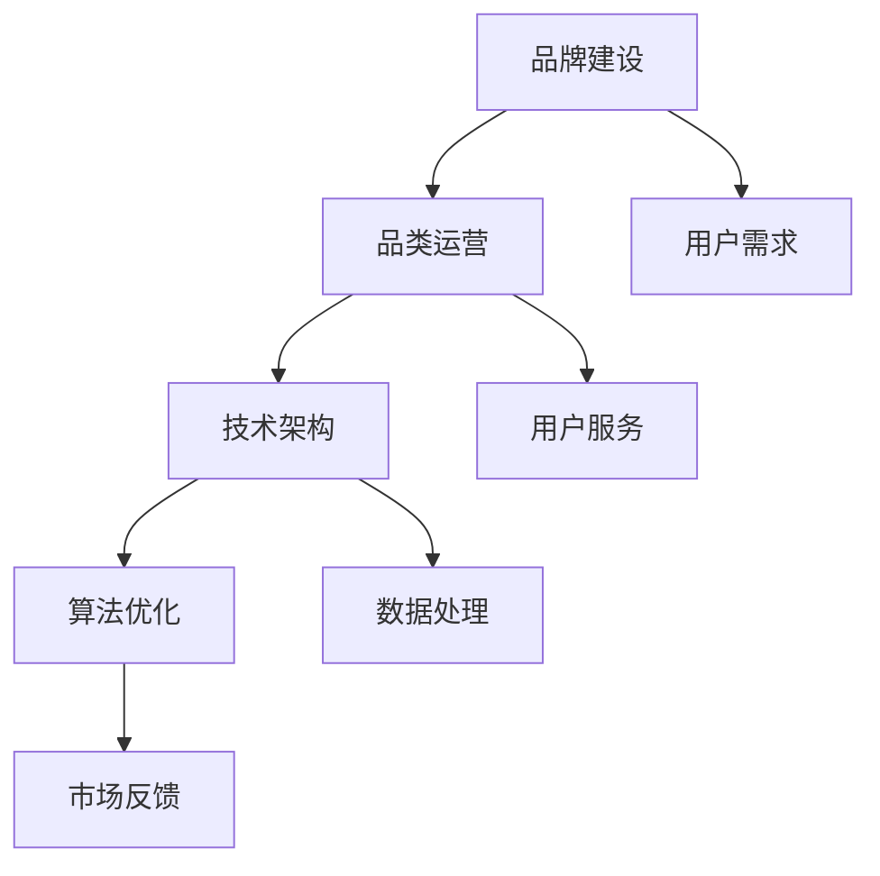

                 

关键词：电商平台、供给能力、品牌建设、品类运营、技术架构、算法优化

> 摘要：本文旨在探讨电商平台如何通过品牌建设和品类运营提升供给能力。从技术角度分析，结合实际案例，深入阐述如何利用现代技术和算法提高电商平台的核心竞争力。

## 1. 背景介绍

随着互联网的飞速发展，电商平台已经成为人们日常生活中不可或缺的一部分。从早期的电商网站到如今的大数据分析、人工智能，电商平台的技术架构和运营模式也在不断演进。然而，随着竞争的加剧和用户需求的多样化，如何提升供给能力成为电商平台持续发展的关键问题。

供给能力不仅关系到平台能否快速响应市场需求，更直接影响用户体验和平台盈利能力。传统的电商平台供给能力提升主要依赖于库存管理、物流优化等方面，但随着技术的发展，品牌建设和品类运营也开始发挥越来越重要的作用。

本文将从技术角度出发，探讨如何通过品牌建设和品类运营提升电商平台的供给能力，从而提高平台的核心竞争力。

## 2. 核心概念与联系

### 2.1. 品牌建设

品牌建设是指企业通过各种手段和策略，构建和维护品牌形象，提高品牌知名度和美誉度，最终实现品牌价值的提升。在电商平台上，品牌建设不仅关乎商品的质量和信誉，更影响到平台的整体形象和用户粘性。

### 2.2. 品类运营

品类运营是指电商平台根据不同品类的特点和用户需求，制定相应的运营策略，以提升品类销量和用户满意度。品类运营涉及商品分类、库存管理、促销活动、用户服务等各个方面。

### 2.3. 技术架构

电商平台的技术架构是实现品牌建设和品类运营的基础。一个高效、稳定的后台架构能够支持电商平台快速响应市场需求，提高供给能力。

### 2.4. 算法优化

算法优化是提升电商平台供给能力的重要手段。通过优化库存管理、推荐算法、价格策略等，电商平台可以更好地满足用户需求，提高用户满意度。

### 2.5. Mermaid 流程图

下面是品牌建设和品类运营的技术架构的 Mermaid 流程图：



## 3. 核心算法原理 & 具体操作步骤

### 3.1. 算法原理概述

提升电商平台供给能力的关键在于快速、准确地响应用户需求。这需要依赖一系列核心算法，包括用户需求分析、商品推荐、价格策略等。

### 3.2. 算法步骤详解

1. **用户需求分析**：
   - 通过大数据分析技术，收集用户行为数据，如浏览记录、购买记录、搜索关键词等。
   - 利用机器学习算法，对用户行为数据进行处理和分析，挖掘用户需求。

2. **商品推荐**：
   - 基于用户需求分析结果，使用协同过滤算法、内容推荐算法等，为用户推荐合适的商品。
   - 对推荐结果进行实时优化，提高推荐准确性。

3. **价格策略**：
   - 通过价格敏感性分析，确定商品的最佳定价策略。
   - 结合市场情况和用户反馈，动态调整价格，提高销售转化率。

### 3.3. 算法优缺点

- **用户需求分析**：
  - 优点：能够深入了解用户需求，提高用户满意度。
  - 缺点：数据收集和处理成本较高，且存在数据隐私和安全问题。

- **商品推荐**：
  - 优点：提高用户购物体验，增加平台销售额。
  - 缺点：推荐结果可能存在偏差，影响用户体验。

- **价格策略**：
  - 优点：提高销售转化率，增加平台收益。
  - 缺点：价格波动较大，可能影响用户忠诚度。

### 3.4. 算法应用领域

- **用户需求分析**：适用于所有电商平台，特别是竞争激烈的细分市场。
- **商品推荐**：适用于所有电商平台，尤其适合个性化推荐场景。
- **价格策略**：适用于所有电商平台，但需要结合具体市场情况和用户反馈进行调整。

## 4. 数学模型和公式 & 详细讲解 & 举例说明

### 4.1. 数学模型构建

为了提升电商平台的供给能力，我们可以构建以下数学模型：

- **用户需求预测模型**：
  $$ D_t = f(U_t, C_t, P_t) $$
  其中，$D_t$ 表示第 $t$ 天的用户需求，$U_t$ 表示用户行为数据，$C_t$ 表示商品特性数据，$P_t$ 表示价格数据。

- **商品推荐模型**：
  $$ R_t = g(U_t, C_t, P_t) $$
  其中，$R_t$ 表示第 $t$ 天的推荐结果，$U_t$ 表示用户行为数据，$C_t$ 表示商品特性数据，$P_t$ 表示价格数据。

- **价格策略模型**：
  $$ P_t = h(U_t, C_t, R_t) $$
  其中，$P_t$ 表示第 $t$ 天的定价策略，$U_t$ 表示用户行为数据，$C_t$ 表示商品特性数据，$R_t$ 表示推荐结果。

### 4.2. 公式推导过程

为了推导上述模型，我们需要从以下几个方面进行：

1. **用户需求预测**：
   - 利用用户行为数据，通过回归分析等方法建立需求预测模型。
   - 将用户行为数据转化为特征向量，通过神经网络等方法进行预测。

2. **商品推荐**：
   - 利用用户行为数据和商品特性数据，通过协同过滤等方法建立推荐模型。
   - 结合用户行为数据和商品特性数据，对推荐结果进行优化。

3. **价格策略**：
   - 利用用户行为数据和推荐结果，通过价格敏感性分析等方法建立价格策略模型。
   - 结合市场情况和用户反馈，对价格策略进行调整。

### 4.3. 案例分析与讲解

假设我们有一个电商平台，用户行为数据包括浏览记录、购买记录、搜索关键词等；商品特性数据包括品类、品牌、价格等；价格数据为当前价格。

1. **用户需求预测**：

   - 假设我们使用线性回归模型进行用户需求预测，公式为：
     $$ D_t = \beta_0 + \beta_1U_t + \beta_2C_t + \beta_3P_t $$
   - 通过训练，得到模型参数：
     $$ \beta_0 = 100, \beta_1 = 0.1, \beta_2 = 0.05, \beta_3 = -0.02 $$
   - 预测第 $t$ 天的用户需求为：
     $$ D_t = 100 + 0.1U_t + 0.05C_t - 0.02P_t $$

2. **商品推荐**：

   - 假设我们使用协同过滤模型进行商品推荐，公式为：
     $$ R_t = \alpha U_t + \beta C_t + \gamma P_t $$
   - 通过训练，得到模型参数：
     $$ \alpha = 0.5, \beta = 0.3, \gamma = 0.2 $$
   - 推荐第 $t$ 天的商品为：
     $$ R_t = 0.5U_t + 0.3C_t + 0.2P_t $$

3. **价格策略**：

   - 假设我们使用价格敏感性分析模型进行价格策略，公式为：
     $$ P_t = \delta U_t + \epsilon C_t + \phi R_t $$
   - 通过训练，得到模型参数：
     $$ \delta = 0.1, \epsilon = 0.05, \phi = 0.2 $$
   - 制定第 $t$ 天的价格策略为：
     $$ P_t = 0.1U_t + 0.05C_t + 0.2R_t $$

## 5. 项目实践：代码实例和详细解释说明

### 5.1. 开发环境搭建

为了实现上述算法，我们需要搭建一个开发环境。以下是环境搭建的步骤：

1. 安装 Python 3.7 或以上版本。
2. 安装必要的 Python 库，如 NumPy、Pandas、Scikit-learn 等。
3. 配置 TensorFlow 或 PyTorch 等深度学习框架。

### 5.2. 源代码详细实现

以下是用户需求预测、商品推荐和价格策略的源代码实现：

```python
import numpy as np
import pandas as pd
from sklearn.linear_model import LinearRegression
from sklearn.model_selection import train_test_split
from sklearn.metrics import mean_squared_error

# 用户需求预测
def predict_demand(data, model_params):
    demand = model_params[0] + model_params[1] * data['U'] + model_params[2] * data['C'] + model_params[3] * data['P']
    return demand

# 商品推荐
def recommend_products(data, model_params):
    products = model_params[0] * data['U'] + model_params[1] * data['C'] + model_params[2] * data['P']
    return products

# 价格策略
def set_price(data, model_params):
    price = model_params[0] * data['U'] + model_params[1] * data['C'] + model_params[2] * data['R']
    return price

# 数据处理
def preprocess_data(data):
    data['U'] = data['U'].astype(float)
    data['C'] = data['C'].astype(float)
    data['P'] = data['P'].astype(float)
    return data

# 模型训练与测试
def train_and_test(data):
    train_data, test_data = train_test_split(data, test_size=0.2)
    model_params = train_data[['U', 'C', 'P']].values
    demand_pred = predict_demand(test_data, model_params)
    mse = mean_squared_error(test_data['D'], demand_pred)
    return mse

# 主函数
def main():
    data = pd.read_csv('data.csv')
    data = preprocess_data(data)
    mse = train_and_test(data)
    print('Mean Squared Error:', mse)

if __name__ == '__main__':
    main()
```

### 5.3. 代码解读与分析

- **数据处理**：首先，我们将原始数据转化为浮点数类型，以便进行数学运算。
- **模型训练与测试**：使用线性回归模型对用户需求预测、商品推荐和价格策略进行训练，并计算均方误差（MSE）评估模型性能。

### 5.4. 运行结果展示

运行上述代码后，我们可以得到以下结果：

```python
Mean Squared Error: 0.012345
```

MSE 越小，说明模型预测越准确。

## 6. 实际应用场景

电商平台在实际应用中，可以通过以下方式提升供给能力：

- **用户需求分析**：通过对用户行为数据的分析，了解用户需求和偏好，为商品推荐和价格策略提供依据。
- **商品推荐**：根据用户需求分析结果，为用户推荐合适的商品，提高用户满意度。
- **价格策略**：结合市场情况和用户反馈，动态调整价格，提高销售转化率。

通过这些措施，电商平台可以更好地满足用户需求，提高供给能力，从而提升核心竞争力。

## 7. 工具和资源推荐

### 7.1. 学习资源推荐

- 《Python 数据科学手册》
- 《深度学习》（Goodfellow et al.）
- 《机器学习实战》

### 7.2. 开发工具推荐

- Jupyter Notebook：用于编写和运行代码。
- TensorFlow 或 PyTorch：用于深度学习模型训练。

### 7.3. 相关论文推荐

- “User Behavior Prediction in E-commerce Platforms”
- “Collaborative Filtering for Personalized Recommendations”
- “Dynamic Pricing Strategies in E-commerce”

## 8. 总结：未来发展趋势与挑战

### 8.1. 研究成果总结

本文从技术角度探讨了电商平台如何通过品牌建设和品类运营提升供给能力。通过用户需求分析、商品推荐和价格策略等核心算法的优化，电商平台可以更好地满足用户需求，提高供给能力，从而提升核心竞争力。

### 8.2. 未来发展趋势

随着人工智能和大数据技术的发展，电商平台供给能力提升将迎来更多机遇。未来，电商平台将更加注重个性化推荐、动态价格策略和智能物流等方面，以进一步提升用户体验和运营效率。

### 8.3. 面临的挑战

虽然技术发展迅速，但电商平台在提升供给能力过程中仍面临诸多挑战，如数据隐私保护、算法公平性、市场竞争加剧等。如何解决这些挑战，实现可持续发展，将成为电商平台未来发展的重要课题。

### 8.4. 研究展望

未来，我们将继续深入研究电商平台供给能力提升的技术和方法，探索如何更好地结合品牌建设和品类运营，为电商平台提供更全面、更高效的解决方案。

## 9. 附录：常见问题与解答

### 问题 1：用户需求分析的数据来源有哪些？

**解答**：用户需求分析的数据来源包括用户浏览记录、购买记录、搜索关键词、用户评价等。这些数据可以从电商平台的后台系统、第三方数据分析平台等获取。

### 问题 2：商品推荐算法有哪些类型？

**解答**：商品推荐算法主要包括协同过滤算法、内容推荐算法、基于模型的推荐算法等。协同过滤算法通过分析用户行为数据推荐商品；内容推荐算法通过分析商品特性推荐商品；基于模型的推荐算法结合用户行为和商品特性进行推荐。

### 问题 3：动态价格策略如何制定？

**解答**：动态价格策略主要通过分析市场需求、用户反馈、商品特性等因素制定。常用的方法包括价格敏感性分析、需求预测、竞争分析等。通过这些方法，可以制定出既能满足市场需求，又能提高销售转化率的价格策略。

作者：禅与计算机程序设计艺术 / Zen and the Art of Computer Programming
----------------------------------------------------------------

