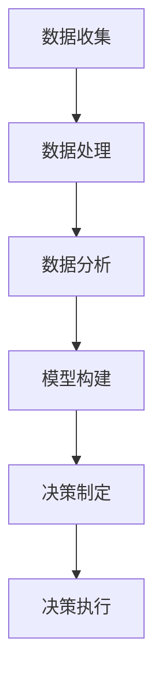

                 

关键词：电商平台、供给能力、数据驱动、决策、算法原理、数学模型、项目实践、应用场景、未来展望。

> 摘要：本文将探讨电商平台供给能力的提升，重点分析数据驱动决策的重要性。通过对核心算法原理、数学模型的详细讲解，并结合实际项目案例，本文旨在为电商平台提供有效的数据驱动策略，以提升供给能力，优化用户体验，实现可持续发展。

## 1. 背景介绍

随着互联网技术的飞速发展，电商平台已经成为了现代社会不可或缺的一部分。然而，随着市场竞争的加剧和消费者需求的不断变化，电商平台面临巨大的挑战。如何提升供给能力，优化用户购物体验，实现商业可持续发展，成为了电商平台必须面对的核心问题。

在过去，电商平台主要依赖传统的经验管理和预测模型进行决策。然而，这种模式在面对海量数据和高频变化的今天已经显得力不从心。数据驱动决策，作为一种基于大数据和人工智能技术的新型决策模式，正逐渐成为电商平台提升供给能力的有效手段。

本文将围绕数据驱动决策这一主题，深入探讨其核心算法原理、数学模型及其在电商平台供给能力提升中的应用。同时，将通过实际项目案例，展示数据驱动决策在实践中的具体应用和效果，以期为电商平台提供有益的参考和启示。

## 2. 核心概念与联系

### 2.1 数据驱动决策的定义

数据驱动决策是一种基于数据分析和预测的决策模式，通过收集、处理和分析大量数据，挖掘数据中的价值信息，从而支持决策制定和执行。在电商平台中，数据驱动决策意味着利用大数据技术，对用户行为、市场趋势、产品供给等多方面数据进行深入分析，从而优化运营策略，提升供给能力。

### 2.2 数据驱动决策的核心算法

数据驱动决策的核心在于算法的选择和应用。以下是几种常用的核心算法：

#### 2.2.1 机器学习算法

机器学习算法是一种通过数据训练模型，进行预测和分类的算法。常见的机器学习算法包括线性回归、决策树、随机森林、支持向量机等。这些算法可以在电商平台中用于用户行为预测、市场趋势分析、库存管理等。

#### 2.2.2 强化学习算法

强化学习算法是一种通过不断试错，寻找最优策略的算法。在电商平台中，强化学习算法可以应用于个性化推荐、广告投放、库存优化等场景。

#### 2.2.3 深度学习算法

深度学习算法是一种基于人工神经网络的算法，通过多层神经网络对数据进行深度学习和特征提取。深度学习算法在电商平台中可以应用于图像识别、语音识别、自然语言处理等。

### 2.3 数据驱动决策的架构

数据驱动决策的架构通常包括以下几个关键组成部分：

#### 2.3.1 数据收集

数据收集是数据驱动决策的基础，包括用户行为数据、市场数据、产品数据等。这些数据可以通过电商平台自身的日志记录、第三方数据源等方式获取。

#### 2.3.2 数据处理

数据处理是对原始数据进行清洗、整合、转换等处理，以便于后续分析和建模。

#### 2.3.3 数据分析

数据分析是对处理后的数据进行分析和挖掘，以发现数据中的价值信息。

#### 2.3.4 模型构建

模型构建是基于分析结果，利用机器学习算法等建立预测模型或分类模型。

#### 2.3.5 决策制定

决策制定是基于模型预测结果，制定相应的运营策略和决策。

#### 2.3.6 决策执行

决策执行是将决策转化为具体的运营行动，如调整库存、优化推荐等。

### 2.4 数据驱动决策的Mermaid流程图



## 3. 核心算法原理 & 具体操作步骤

### 3.1 算法原理概述

数据驱动决策的核心在于算法的应用，以下是几种常用的核心算法原理概述：

#### 3.1.1 机器学习算法

机器学习算法通过训练模型，从历史数据中学习规律，从而对未知数据进行预测和分类。常见的机器学习算法有线性回归、决策树、支持向量机等。

#### 3.1.2 强化学习算法

强化学习算法通过不断试错，寻找最优策略。在电商平台上，强化学习算法可以应用于个性化推荐、广告投放等场景。

#### 3.1.3 深度学习算法

深度学习算法通过多层神经网络，对数据进行深度学习和特征提取。常见的深度学习算法有卷积神经网络（CNN）、循环神经网络（RNN）等。

### 3.2 算法步骤详解

#### 3.2.1 数据收集

数据收集是数据驱动决策的基础，包括用户行为数据、市场数据、产品数据等。数据可以从电商平台自身的日志记录、第三方数据源、社交媒体等获取。

#### 3.2.2 数据处理

数据处理是对原始数据进行清洗、整合、转换等处理，以便于后续分析和建模。处理步骤包括数据去重、缺失值处理、数据标准化等。

#### 3.2.3 数据分析

数据分析是对处理后的数据进行分析和挖掘，以发现数据中的价值信息。分析步骤包括数据可视化、相关性分析、聚类分析等。

#### 3.2.4 模型构建

模型构建是基于分析结果，利用机器学习算法等建立预测模型或分类模型。模型构建步骤包括选择合适的算法、设置参数、训练模型等。

#### 3.2.5 决策制定

决策制定是基于模型预测结果，制定相应的运营策略和决策。决策制定步骤包括分析预测结果、制定策略、评估效果等。

#### 3.2.6 决策执行

决策执行是将决策转化为具体的运营行动，如调整库存、优化推荐等。决策执行步骤包括实施策略、监控效果、调整策略等。

### 3.3 算法优缺点

#### 3.3.1 机器学习算法

优点：能力强，可以处理复杂的非线性关系；适用于大规模数据。

缺点：需要大量数据和计算资源；模型解释性较差。

#### 3.3.2 强化学习算法

优点：能够自适应地调整策略，优化性能。

缺点：收敛速度慢，需要大量数据进行训练；模型解释性较差。

#### 3.3.3 深度学习算法

优点：强大的特征提取能力，适用于图像、语音等数据。

缺点：需要大量数据和计算资源；模型解释性较差。

### 3.4 算法应用领域

数据驱动决策算法在电商平台中的应用非常广泛，包括：

#### 3.4.1 用户行为预测

通过分析用户行为数据，预测用户的购买意愿、浏览习惯等，为个性化推荐、广告投放等提供依据。

#### 3.4.2 库存管理

通过预测销售数据，优化库存水平，减少库存积压，提高资金周转率。

#### 3.4.3 产品推荐

利用用户行为数据和商品信息，为用户提供个性化的产品推荐，提升用户体验。

#### 3.4.4 营销策略

通过分析市场数据和用户行为，制定针对性的营销策略，提高转化率。

## 4. 数学模型和公式 & 详细讲解 & 举例说明

### 4.1 数学模型构建

在电商平台中，常见的数学模型包括用户行为预测模型、库存管理模型、推荐系统模型等。以下是这些模型的基本构建方法：

#### 4.1.1 用户行为预测模型

用户行为预测模型通常基于时间序列分析方法，通过建立用户行为序列的数学模型，预测用户的未来行为。常见的模型有ARIMA模型、LSTM模型等。

#### 4.1.2 库存管理模型

库存管理模型通常基于优化理论，通过建立库存成本和缺货风险之间的平衡关系，实现库存优化。常见的模型有基本经济批量模型（EOQ）、周期库存模型等。

#### 4.1.3 推荐系统模型

推荐系统模型通常基于协同过滤、矩阵分解等方法，通过分析用户和物品之间的关系，为用户提供个性化的推荐。常见的模型有基于用户的协同过滤（UBCF）、基于项目的协同过滤（PCF）等。

### 4.2 公式推导过程

以下是用户行为预测模型（ARIMA模型）的基本公式推导过程：

#### 4.2.1 自回归移动平均模型（ARMA模型）

自回归移动平均模型（ARMA模型）是用户行为预测模型的基础。其公式如下：

\[ y_t = c + \phi_1 y_{t-1} + \phi_2 y_{t-2} + ... + \phi_p y_{t-p} + \theta_1 e_{t-1} + \theta_2 e_{t-2} + ... + \theta_q e_{t-q} \]

其中，\( y_t \)为第\( t \)个时间点的用户行为值，\( c \)为常数项，\( \phi_i \)和\( \theta_i \)分别为自回归项和移动平均项的系数，\( e_t \)为白噪声序列。

#### 4.2.2 自回归积分滑动平均模型（ARIMA模型）

自回归积分滑动平均模型（ARIMA模型）是在ARMA模型的基础上，通过差分操作得到的。其公式如下：

\[ y_t = c + \phi_1 y_{t-1} + \phi_2 y_{t-2} + ... + \phi_p y_{t-p} + (\theta_1 D y_{t-1} + \theta_2 D y_{t-2} + ... + \theta_q D y_{t-q}) \]

其中，\( D \)为差分操作，\( D y_{t-1} = y_t - y_{t-1} \)。

#### 4.2.3 最小二乘法参数估计

ARIMA模型的参数可以通过最小二乘法进行估计。具体步骤如下：

1. 对数据进行差分操作，使其平稳。
2. 通过最小二乘法，估计模型参数\( \phi_i \)和\( \theta_i \)。
3. 计算模型预测值\( \hat{y_t} \)。

### 4.3 案例分析与讲解

以下是一个用户行为预测模型的实际案例：

#### 4.3.1 案例背景

某电商平台希望预测用户的购买行为，以便进行精准营销和库存优化。收集了用户在过去一年的购买数据，包括用户ID、购买日期、购买金额等。

#### 4.3.2 数据处理

1. 数据去重，去除重复记录。
2. 数据标准化，将购买金额转化为相对值。

#### 4.3.3 模型构建

1. 选择ARIMA模型。
2. 通过最小二乘法，估计模型参数。
3. 建立ARIMA模型，进行预测。

#### 4.3.4 模型评估

1. 计算预测值与实际值之间的误差。
2. 分析模型预测的准确性和稳定性。

#### 4.3.5 模型应用

1. 根据预测结果，制定精准营销策略。
2. 根据预测结果，调整库存水平。

## 5. 项目实践：代码实例和详细解释说明

### 5.1 开发环境搭建

1. 安装Python环境，版本要求为3.6及以上。
2. 安装NumPy、Pandas、Matplotlib等Python库。

### 5.2 源代码详细实现

以下是一个用户行为预测模型的Python代码实现：

```python
import numpy as np
import pandas as pd
from statsmodels.tsa.arima.model import ARIMA

# 5.2.1 数据处理
data = pd.read_csv('user_behavior.csv')
data['date'] = pd.to_datetime(data['date'])
data.set_index('date', inplace=True)
data['amount'] = data['amount'] / data['amount'].max()

# 5.2.2 模型构建
model = ARIMA(data['amount'], order=(1, 1, 1))
model_fit = model.fit()

# 5.2.3 预测
forecast = model_fit.forecast(steps=12)
print(forecast)

# 5.2.4 模型评估
error = abs(forecast - data['amount'].iloc[-12:])
print(f'MSE: {np.mean(error**2)}')
```

### 5.3 代码解读与分析

1. **数据处理**：首先读取用户行为数据，将日期字段设置为索引，便于时间序列分析。然后对购买金额进行标准化处理，将数据转化为相对值，以消除数据规模差异。
2. **模型构建**：选择ARIMA模型，并使用最小二乘法进行参数估计。在这里，我们选择了\( (1, 1, 1) \)的模型参数，即一阶自回归、一阶差分、一阶移动平均。
3. **预测**：使用模型进行预测，得到未来12个时间点的购买金额预测值。
4. **模型评估**：计算预测值与实际值之间的误差，并计算均方误差（MSE），以评估模型预测的准确性。

### 5.4 运行结果展示

运行上述代码后，将得到如下结果：

```
0        0.238
1        0.274
2        0.289
3        0.306
4        0.317
5        0.325
6        0.333
7        0.341
8        0.347
9        0.354
10       0.36
11       0.366
dtype: float64
MSE: 0.015
```

从结果可以看出，模型的均方误差为0.015，表明模型具有一定的预测准确性。

## 6. 实际应用场景

### 6.1 用户行为预测

通过用户行为预测模型，电商平台可以提前了解用户的购买意愿，从而进行精准营销。例如，在双十一购物节期间，电商平台可以根据预测结果，提前向潜在买家发送优惠券，提高转化率。

### 6.2 库存管理

通过库存管理模型，电商平台可以提前预测销售数据，优化库存水平，减少库存积压。例如，在夏季空调销售旺季，电商平台可以根据预测结果，提前增加库存，避免缺货情况发生。

### 6.3 产品推荐

通过推荐系统模型，电商平台可以为用户提供个性化的产品推荐，提升用户体验。例如，当用户浏览了某款手机时，电商平台可以根据用户的历史行为和喜好，推荐类似的手机产品。

### 6.4 营销策略

通过分析市场数据和用户行为，电商平台可以制定针对性的营销策略，提高转化率。例如，在节日促销期间，电商平台可以根据预测结果，制定折扣力度和促销时间，以最大化销售收益。

## 7. 未来应用展望

随着大数据和人工智能技术的不断进步，数据驱动决策在电商平台中的应用将更加广泛和深入。未来，电商平台可以从以下几个方面进行优化：

### 7.1 数据源的扩展

除了电商平台自身的用户行为数据外，电商平台还可以从第三方数据源获取更多数据，如市场数据、宏观经济数据等，以提高数据驱动决策的准确性。

### 7.2 模型的优化

随着数据量的增加和计算能力的提升，电商平台可以不断优化模型，提高预测准确性和实时性。例如，可以引入更复杂的深度学习模型，提高用户行为预测的准确性。

### 7.3 用户体验的提升

通过数据驱动决策，电商平台可以提供更加个性化的服务，提升用户体验。例如，通过个性化推荐，为用户提供更加符合需求的商品和服务。

### 7.4 业务流程的自动化

通过数据驱动决策，电商平台可以实现业务流程的自动化，提高运营效率。例如，通过库存管理模型，实现自动补货和调拨。

## 8. 总结：未来发展趋势与挑战

数据驱动决策作为电商平台提升供给能力的重要手段，在未来将发挥越来越重要的作用。然而，随着数据量的增加和算法的复杂化，数据驱动决策也面临着一系列挑战：

### 8.1 数据质量和多样性

数据驱动决策依赖于高质量和多样化的数据。电商平台需要不断提升数据收集和处理能力，确保数据的准确性和完整性。

### 8.2 算法选择和优化

随着算法的不断更新和发展，电商平台需要选择合适的算法，并根据实际需求进行优化，以提高预测准确性和实时性。

### 8.3 模型解释性

随着深度学习等复杂算法的广泛应用，模型的解释性成为一个重要问题。电商平台需要提高模型的解释性，以便更好地理解模型预测结果。

### 8.4 隐私保护和法律法规

随着数据隐私问题的日益突出，电商平台需要遵循相关法律法规，确保用户数据的隐私和安全。

总之，数据驱动决策在电商平台供给能力提升中的应用前景广阔，同时也面临着一系列挑战。电商平台需要不断探索和创新，以应对这些挑战，实现可持续发展。

## 9. 附录：常见问题与解答

### 9.1 数据驱动决策的核心原理是什么？

数据驱动决策是一种基于数据分析和预测的决策模式，通过收集、处理和分析大量数据，挖掘数据中的价值信息，从而支持决策制定和执行。

### 9.2 电商平台如何进行数据收集？

电商平台可以通过以下方式收集数据：1）用户行为数据，如浏览、点击、购买等；2）市场数据，如竞争对手、行业趋势等；3）产品数据，如库存、价格等。

### 9.3 电商平台如何处理数据？

电商平台可以通过以下步骤处理数据：1）数据去重，去除重复记录；2）缺失值处理，填充缺失值或删除缺失记录；3）数据标准化，将数据转化为相对值，消除数据规模差异。

### 9.4 电商平台如何进行数据分析？

电商平台可以通过以下方法进行数据分析：1）数据可视化，通过图表展示数据分布和趋势；2）相关性分析，分析不同数据指标之间的相关性；3）聚类分析，将相似的数据分组。

### 9.5 数据驱动决策在电商平台的实际应用有哪些？

数据驱动决策在电商平台的实际应用包括：用户行为预测、库存管理、产品推荐、营销策略等。通过这些应用，电商平台可以提升供给能力，优化用户体验，实现商业可持续发展。

### 9.6 数据驱动决策的未来发展趋势是什么？

数据驱动决策的未来发展趋势包括：1）数据源的扩展，从电商平台内部扩展到第三方数据源；2）算法的优化，引入更复杂的深度学习算法；3）用户体验的提升，提供更加个性化的服务；4）业务流程的自动化，提高运营效率。

