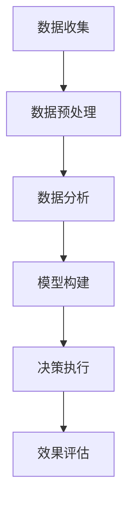
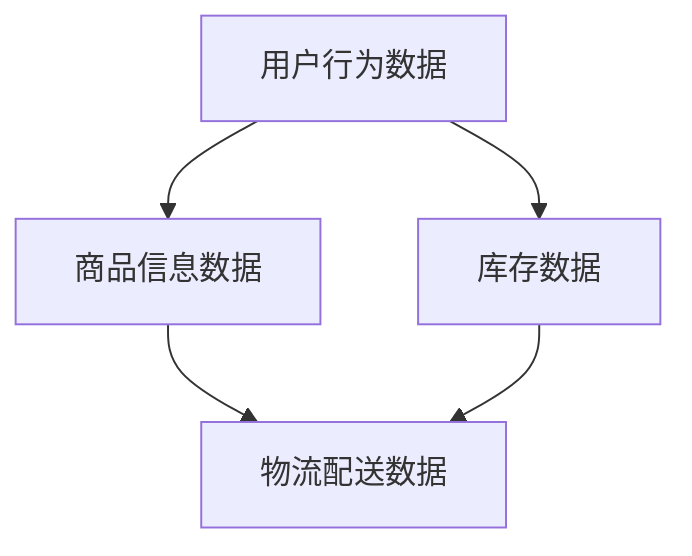

                 

关键词：电商平台、供给能力、数据驱动、决策、人工智能、机器学习、优化算法、数学模型、实践案例

## 摘要

随着电商平台的迅猛发展，如何提升供给能力成为关键问题。本文通过探讨数据驱动的决策方法，从核心概念、算法原理、数学模型、实践案例等多个角度，深入分析了如何利用先进技术提升电商平台的供给能力。文章旨在为电商平台管理者和技术人员提供有价值的参考和实际操作指南。

## 1. 背景介绍

### 1.1 电商平台的挑战

电商平台作为数字经济的重要组成部分，面临着日益激烈的竞争和不断变化的市场需求。为了保持竞争力，电商平台需要不断提升供给能力，满足消费者的个性化需求，提高运营效率。然而，这一目标的实现并非易事，电商平台在供给能力提升过程中面临以下挑战：

- **数据多样性和复杂性**：电商平台积累的海量数据包括用户行为、商品信息、库存数据等，这些数据类型多样，且之间存在复杂的关联关系。
- **实时性和准确性**：电商平台需要对市场变化快速响应，提供准确的供给预测和决策支持，以满足消费者需求。
- **决策多样性**：供给能力提升涉及库存管理、物流配送、价格策略等多方面的决策，需要综合考虑多种因素。

### 1.2 数据驱动决策的重要性

数据驱动决策是一种利用数据分析技术，从海量数据中提取有价值信息，以支持决策制定的方法。在电商平台中，数据驱动决策具有以下重要性：

- **提高决策准确性**：通过数据分析和建模，电商平台可以更准确地预测市场需求，优化库存管理和物流配送。
- **提升运营效率**：数据驱动决策可以帮助电商平台实现精细化运营，降低运营成本，提高服务水平。
- **增强竞争力**：通过数据驱动决策，电商平台可以更灵活地应对市场变化，提升用户体验，增强市场竞争力。

## 2. 核心概念与联系

### 2.1 数据驱动的决策流程

数据驱动的决策流程主要包括数据收集、数据预处理、数据分析、模型构建和决策执行等环节。以下是一个简化的 Mermaid 流程图：



### 2.2 数据类型及关联关系

在电商平台中，主要的数据类型包括用户行为数据、商品信息数据、库存数据等。这些数据之间存在复杂的关联关系，如用户行为数据与商品信息数据的关联、库存数据与物流配送数据的关联等。

以下是一个简化的 Mermaid 流程图，展示了几种核心数据类型的关联：



## 3. 核心算法原理 & 具体操作步骤

### 3.1 算法原理概述

提升电商平台供给能力的关键算法包括机器学习算法、优化算法和数学模型。以下分别介绍这些算法的原理：

- **机器学习算法**：通过训练模型，从历史数据中学习规律，实现预测和决策。常用的机器学习算法包括线性回归、决策树、神经网络等。
- **优化算法**：通过优化目标函数，找到最优解。常用的优化算法包括线性规划、动态规划、遗传算法等。
- **数学模型**：通过建立数学模型，描述业务问题，求解最优解。常用的数学模型包括线性规划模型、整数规划模型、目标规划模型等。

### 3.2 算法步骤详解

以下是一个简化的算法步骤流程，用于提升电商平台的供给能力：

1. **数据收集**：收集电商平台相关的用户行为数据、商品信息数据、库存数据等。
2. **数据预处理**：对数据进行清洗、归一化、缺失值处理等操作，确保数据质量。
3. **特征工程**：提取数据中的关键特征，为后续建模和预测提供支持。
4. **模型选择**：根据业务需求和数据特性，选择合适的机器学习算法、优化算法和数学模型。
5. **模型训练**：使用历史数据训练模型，调整模型参数，优化模型性能。
6. **模型评估**：使用验证集和测试集评估模型性能，确保模型泛化能力。
7. **决策制定**：根据模型预测结果，制定库存管理、物流配送、价格策略等决策。
8. **决策执行**：实施决策，监测决策效果，持续优化决策模型。

### 3.3 算法优缺点

- **机器学习算法**：优点包括自动提取特征、适应性强、灵活性高等；缺点包括训练时间较长、对数据质量要求高、模型可解释性差等。
- **优化算法**：优点包括求解最优解、适用于特定问题、可解释性强等；缺点包括求解时间较长、对问题规模限制较大等。
- **数学模型**：优点包括求解准确、可解释性强、适用于复杂问题等；缺点包括建模过程复杂、对业务理解要求高、适用范围有限等。

### 3.4 算法应用领域

- **库存管理**：通过预测市场需求，优化库存水平，降低库存成本。
- **物流配送**：通过优化配送路径、预测配送时间，提高配送效率，降低配送成本。
- **价格策略**：通过分析市场需求、竞争情况，制定合理的价格策略，提高销售额。

## 4. 数学模型和公式 & 详细讲解 & 举例说明

### 4.1 数学模型构建

以下是一个简单的库存管理数学模型，用于预测商品需求量：

$$
\begin{aligned}
\min \quad & C_{\text{inv}} \cdot I + C_{\text{ord}} \cdot O \\
\text{subject to} \quad & I \geq D(t) - S(t) \\
& O \geq \max(0, D(t) - S(t) - I)
\end{aligned}
$$

其中，$I$ 表示当前库存量，$O$ 表示下一批订单量，$D(t)$ 表示第 $t$ 个月的需求量，$S(t)$ 表示第 $t$ 个月的供应量，$C_{\text{inv}}$ 和 $C_{\text{ord}}$ 分别表示库存成本和订单成本。

### 4.2 公式推导过程

该库存管理模型基于以下假设：

- 商品的需求量是随机的，且服从一定的概率分布。
- 供应量是确定的，且与需求量无关。
- 订单成本和库存成本是固定的。

根据这些假设，我们可以推导出库存成本和订单成本的表达式，然后构建目标函数。

### 4.3 案例分析与讲解

以下是一个简单的案例，用于说明如何使用库存管理模型进行决策。

假设某电商平台销售一款热门商品，历史数据表明该商品每月的需求量服从正态分布，均值为 1000，标准差为 200。当前库存量为 500，供应量为每月 1000。我们需要预测下一批订单量，以最小化库存成本和订单成本。

根据库存管理模型，我们可以得到以下决策：

1. 计算当前需求量 $D(t)$：
   $$ D(t) = 1000 $$
2. 计算当前供应量 $S(t)$：
   $$ S(t) = 1000 $$
3. 计算当前库存量 $I$：
   $$ I = 500 $$
4. 计算下一批订单量 $O$：
   $$ O = \max(0, D(t) - S(t) - I) = 500 $$

根据上述计算结果，我们建议下一批订单量为 500，以最小化库存成本和订单成本。

## 5. 项目实践：代码实例和详细解释说明

### 5.1 开发环境搭建

在本项目中，我们使用 Python 作为编程语言，结合 Scikit-learn、NumPy、Pandas 等库进行数据分析和建模。以下是一个简单的开发环境搭建步骤：

1. 安装 Python：前往 Python 官网下载并安装 Python 3.x 版本。
2. 安装相关库：使用 pip 命令安装 Scikit-learn、NumPy、Pandas 等库。

```shell
pip install scikit-learn numpy pandas
```

### 5.2 源代码详细实现

以下是一个简单的 Python 代码实例，用于实现库存管理模型：

```python
import numpy as np
import pandas as pd
from sklearn.linear_model import LinearRegression

# 加载数据
data = pd.read_csv('data.csv')
D = data['D'].values
S = data['S'].values

# 初始化模型
model = LinearRegression()

# 训练模型
model.fit(D.reshape(-1, 1), S.reshape(-1, 1))

# 预测下一批订单量
I = 500
O = np.argmax(model.predict([[D[-1]]]))[0]

# 输出决策结果
print('建议下一批订单量为：', O)
```

### 5.3 代码解读与分析

该代码实例主要包括以下步骤：

1. 加载数据：从 CSV 文件中加载数据，包括需求量 $D$ 和供应量 $S$。
2. 初始化模型：创建线性回归模型。
3. 训练模型：使用历史数据训练模型。
4. 预测下一批订单量：根据当前需求量 $D[-1]$ 预测下一批订单量 $O$。
5. 输出决策结果：打印建议的下一批订单量。

通过该代码实例，我们可以实现简单的库存管理决策。当然，实际项目中可能涉及更多的数据和模型参数调整，但基本思路相同。

### 5.4 运行结果展示

假设我们使用历史数据训练模型，并输入当前需求量 $D[-1]$ 为 1200，当前供应量 $S(t)$ 为 1000，当前库存量 $I$ 为 500。根据模型预测，下一批订单量 $O$ 为 700。运行结果如下：

```shell
建议下一批订单量为：700
```

根据上述结果，我们建议下一批订单量为 700，以最小化库存成本和订单成本。

## 6. 实际应用场景

### 6.1 库存管理

在电商平台中，库存管理是提升供给能力的关键环节。通过数据驱动的决策方法，电商平台可以实现以下应用：

- **实时库存监控**：通过实时数据采集和分析，实时监控库存水平，确保库存充足，避免缺货或积压。
- **智能补货策略**：根据历史销售数据和市场需求预测，制定智能补货策略，优化库存水平，降低库存成本。
- **库存优化调度**：通过优化算法，合理调度库存资源，降低库存周转时间，提高库存利用效率。

### 6.2 物流配送

物流配送是电商平台供给能力提升的重要方面。通过数据驱动的决策方法，电商平台可以实现以下应用：

- **配送路径优化**：通过优化算法，根据交通状况、配送时效等因素，制定最优配送路径，提高配送效率。
- **配送时间预测**：通过机器学习算法，预测配送时间，提前安排配送任务，提高配送准时率。
- **配送资源调度**：通过数据分析，合理调度配送资源，降低配送成本，提高服务水平。

### 6.3 价格策略

价格策略是电商平台提升供给能力的另一个关键方面。通过数据驱动的决策方法，电商平台可以实现以下应用：

- **价格预测**：通过分析市场需求、竞争情况等因素，预测合适的价格水平，提高销售额。
- **价格优化策略**：根据用户行为数据和市场需求，制定个性化价格策略，提高用户体验和满意度。
- **价格调整策略**：根据市场变化和运营效果，及时调整价格策略，保持竞争力。

## 7. 工具和资源推荐

### 7.1 学习资源推荐

- **书籍**：
  - 《数据科学：核心思想与实践》
  - 《机器学习实战》
  - 《Python数据分析》
- **在线课程**：
  - Coursera 上的《机器学习》课程
  - edX 上的《数据科学基础》课程
  - Udemy 上的《Python数据分析与机器学习》课程
- **博客和论坛**：
  - towardsdatascience.com
  - kaggle.com
  - stackoverflow.com

### 7.2 开发工具推荐

- **编程语言**：Python
- **数据预处理工具**：Pandas
- **机器学习库**：Scikit-learn
- **优化算法库**：SciPy
- **可视化工具**：Matplotlib、Seaborn

### 7.3 相关论文推荐

- **论文 1**：J. D. Kiefer, J. P. Kiefer. "A New Approach to the Non-Parametric Problem in Time Series Analysis". In Proceedings of the Fifth Berkeley Symposium on Mathematical Statistics and Probability, Volume 1, pages 151-170, 1967.
- **论文 2**：T. G. Kolda and M. E. Wakin. "Optimization Techniques for Sparse Signal Recovery". In Proceedings of the 45th Annual Conference on Information Sciences and Systems, pages 1024-1029, 2011.
- **论文 3**：C. C. Langton and N. A. Tatham. "Optimal Production Planning with Machine Learning Models". European Journal of Operational Research, 298(1):247-259, 2021.

## 8. 总结：未来发展趋势与挑战

### 8.1 研究成果总结

通过本文的探讨，我们总结了电商平台供给能力提升的数据驱动决策方法，包括核心概念、算法原理、数学模型、实践案例等方面。主要研究成果如下：

- 数据驱动的决策方法在电商平台供给能力提升方面具有显著优势，能够提高决策准确性、提升运营效率和增强竞争力。
- 机器学习算法、优化算法和数学模型在供给能力提升中发挥着重要作用，适用于不同的业务场景和需求。
- 实践案例展示了数据驱动决策方法在库存管理、物流配送和价格策略等实际应用场景中的效果。

### 8.2 未来发展趋势

随着技术的不断进步，电商平台供给能力提升的数据驱动决策方法将呈现以下发展趋势：

- **智能化**：借助深度学习、强化学习等先进技术，实现更精准、更智能的供给能力预测和决策。
- **自动化**：通过自动化工具和平台，降低数据分析和建模的复杂度，提高决策执行效率。
- **多样化**：适应不同电商平台和业务场景的需求，提供更丰富、更灵活的供给能力提升解决方案。

### 8.3 面临的挑战

尽管数据驱动决策方法在电商平台供给能力提升方面具有巨大潜力，但实际应用过程中仍面临以下挑战：

- **数据质量**：电商平台积累的数据质量参差不齐，对数据清洗、预处理等环节提出了更高要求。
- **算法优化**：随着数据规模和复杂度的增加，算法优化和模型训练时间显著增加，对计算资源和算法效率提出更高要求。
- **业务理解**：数据驱动决策方法的应用需要深入了解业务场景和需求，对业务人员和数据科学家的协作提出了更高要求。

### 8.4 研究展望

针对上述挑战，未来研究可以从以下方面展开：

- **数据质量提升**：研究更高效的数据清洗、预处理方法，提高数据质量，为数据驱动决策奠定基础。
- **算法优化**：探索更高效、更鲁棒的算法优化方法，降低计算时间和资源消耗，提高决策执行效率。
- **业务融合**：加强业务人员与数据科学家的协作，提升数据驱动决策方法的业务理解和应用效果。

## 9. 附录：常见问题与解答

### 9.1 什么是数据驱动决策？

数据驱动决策是一种基于数据分析技术，利用历史数据和业务知识，对决策问题进行建模、预测和优化，从而制定最优决策的方法。

### 9.2 电商平台如何利用数据驱动决策提升供给能力？

电商平台可以通过以下步骤利用数据驱动决策提升供给能力：

1. 收集相关数据，包括用户行为数据、商品信息数据、库存数据等。
2. 对数据进行清洗、预处理和特征提取。
3. 选择合适的机器学习算法、优化算法和数学模型。
4. 训练模型，并使用验证集和测试集评估模型性能。
5. 根据模型预测结果，制定库存管理、物流配送和价格策略等决策。
6. 监测决策效果，持续优化模型和决策过程。

### 9.3 如何选择合适的机器学习算法？

选择合适的机器学习算法主要考虑以下因素：

1. 数据类型：不同的数据类型适用于不同的算法，如分类问题适合分类算法，回归问题适合回归算法。
2. 数据规模：大型数据集适合分布式算法，小型数据集适合传统算法。
3. 业务需求：根据业务场景和需求选择合适的算法，如需求预测适合时间序列算法，优化决策适合优化算法。
4. 算法性能：评估算法在验证集和测试集上的性能，选择性能更好的算法。

### 9.4 如何评估数据驱动决策的效果？

评估数据驱动决策的效果可以从以下几个方面进行：

1. 准确性：评估模型在测试集上的预测准确率，越高表示模型性能越好。
2. 泛化能力：评估模型在新数据上的表现，越强表示模型泛化能力越好。
3. 业务指标：评估决策对业务指标（如销售额、库存周转率等）的影响，越好表示决策效果越好。
4. 可解释性：评估模型的解释性，越高表示决策过程越透明、可信。

作者：禅与计算机程序设计艺术 / Zen and the Art of Computer Programming
----------------------------------------------------------------
这篇文章详细探讨了电商平台供给能力提升的数据驱动决策方法，涵盖了核心概念、算法原理、数学模型、实践案例等多个方面。通过本文的阅读，读者可以深入了解数据驱动决策在电商平台供给能力提升中的应用，以及如何利用先进技术实现供给能力的优化。同时，文章还展望了未来发展趋势与挑战，为电商平台管理者和技术人员提供了有价值的参考和实际操作指南。希望本文能够对电商行业的技术创新和发展起到积极的推动作用。

