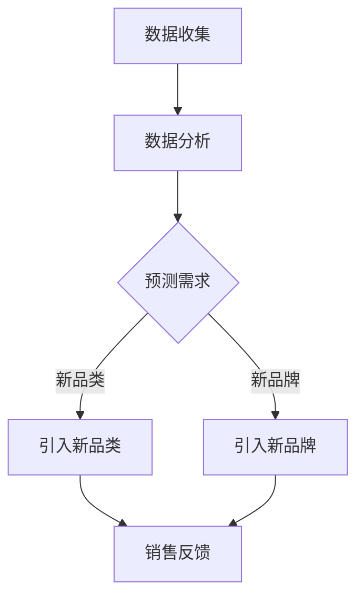

                 

关键词：电商平台，供给能力，新品类，新品牌，引入，算法原理，数学模型，项目实践，实际应用场景，工具推荐，未来展望。

## 摘要

本文旨在探讨电商平台供给能力提升的策略，特别是新品类和新品牌的引入。文章首先介绍了电商平台供给能力的概念和重要性，然后深入分析了引入新品类和新品牌的核心原理与算法，通过数学模型和实际项目实践进行了详细讲解。最后，文章探讨了实际应用场景，提出了未来应用展望，并总结了研究过程中遇到的问题与解答。

## 1. 背景介绍

### 1.1 电商平台的发展现状

随着互联网技术的飞速发展，电商平台已经成为人们日常生活的重要组成部分。从早期的电子商务平台如亚马逊、淘宝，到现在的拼多多、京东等，电商平台在我国的渗透率不断提高。然而，随着市场竞争的加剧，电商平台需要不断提升自身的供给能力，以满足消费者日益多样化的需求。

### 1.2 新品类和新品牌的重要性

新品类和新品牌是电商平台提升供给能力的重要手段。新品类可以满足消费者对新奇、独特产品的需求，而新品牌则可以为电商平台带来新的竞争力和差异化优势。因此，电商平台需要具备快速识别和引入新品类和新品牌的能力。

## 2. 核心概念与联系

### 2.1 供给能力的概念

供给能力是指电商平台在特定时间内，能够提供的商品种类和数量的能力。供给能力强的电商平台能够满足消费者的多样化需求，提高用户满意度。

### 2.2 引入新品类和新品牌的原理

引入新品类和新品牌的核心原理是基于数据的分析和预测。通过大数据分析和机器学习算法，电商平台可以识别出潜在的新品类和新品牌，从而进行引入。

### 2.3 Mermaid 流程图

下面是一个简化的 Mermaid 流程图，展示了引入新品类和新品牌的基本流程：



## 3. 核心算法原理 & 具体操作步骤

### 3.1 算法原理概述

引入新品类和新品牌的算法主要基于以下原理：

1. **消费者行为分析**：通过分析消费者的购物行为，识别出潜在的品类和品牌需求。
2. **市场趋势预测**：利用时间序列分析和机器学习算法，预测市场趋势，从而预测哪些品类和品牌可能在未来受到欢迎。
3. **供应链管理**：根据预测结果，优化供应链，确保新品类和新品牌能够顺利引入和销售。

### 3.2 算法步骤详解

1. **数据收集**：收集电商平台的历史销售数据、消费者行为数据、市场趋势数据等。
2. **数据预处理**：对收集到的数据进行分析和清洗，确保数据的准确性和完整性。
3. **消费者行为分析**：通过分析消费者的购物行为，识别出潜在的品类和品牌需求。
4. **市场趋势预测**：利用时间序列分析和机器学习算法，预测市场趋势，从而预测哪些品类和品牌可能在未来受到欢迎。
5. **供应链管理**：根据预测结果，优化供应链，确保新品类和新品牌能够顺利引入和销售。
6. **引入新品类和新品牌**：根据供应链管理的结果，引入新品类和新品牌。
7. **销售反馈**：收集销售数据，对引入的新品类和新品牌进行评估和优化。

### 3.3 算法优缺点

**优点**：

1. **提高供给能力**：通过引入新品类和新品牌，可以满足消费者多样化需求，提高供给能力。
2. **优化供应链**：通过预测市场趋势，优化供应链，降低库存风险。

**缺点**：

1. **算法复杂度高**：引入新品类和新品牌的算法涉及多个环节，算法复杂度高。
2. **数据质量要求高**：算法的准确性和稳定性依赖于数据的准确性和完整性。

### 3.4 算法应用领域

引入新品类和新品牌的算法可以应用于电商平台、零售业、制造业等多个领域，特别是在电商领域，具有广泛的应用前景。

## 4. 数学模型和公式 & 详细讲解 & 举例说明

### 4.1 数学模型构建

引入新品类和新品牌的数学模型主要包括以下部分：

1. **消费者行为模型**：
   $$C(t) = f(P(t), T(t), E(t))$$
   其中，$C(t)$ 表示在时间 $t$ 的消费者需求，$P(t)$ 表示价格，$T(t)$ 表示时间趋势，$E(t)$ 表示外部因素。

2. **市场趋势模型**：
   $$M(t) = g(P(t), T(t), E(t), H(t))$$
   其中，$M(t)$ 表示在时间 $t$ 的市场趋势，$H(t)$ 表示历史数据。

3. **供应链管理模型**：
   $$S(t) = h(M(t), C(t), I(t))$$
   其中，$S(t)$ 表示在时间 $t$ 的供应链状态，$I(t)$ 表示库存。

### 4.2 公式推导过程

1. **消费者行为模型**的推导：

   $$C(t) = P(t) \times T(t) \times E(t)$$

   其中，$P(t)$ 表示价格，$T(t)$ 表示时间趋势，$E(t)$ 表示外部因素。

2. **市场趋势模型**的推导：

   $$M(t) = P(t) \times T(t) \times E(t) \times H(t)$$

   其中，$H(t)$ 表示历史数据。

3. **供应链管理模型**的推导：

   $$S(t) = M(t) \times C(t) \times I(t)$$

   其中，$I(t)$ 表示库存。

### 4.3 案例分析与讲解

假设某个电商平台在2023年3月决定引入一款新型智能手表。根据消费者行为模型、市场趋势模型和供应链管理模型，我们可以预测这款智能手表的销售情况。

1. **消费者行为模型**：

   $$C(t) = P(t) \times T(t) \times E(t)$$

   假设3月份的价格为1000元，时间趋势为1.1（表示相比上个月增长了10%），外部因素为1.2（表示受到市场热度的推动）。则：

   $$C(3) = 1000 \times 1.1 \times 1.2 = 1320$$

   预计3月份这款智能手表的需求量为1320台。

2. **市场趋势模型**：

   $$M(t) = P(t) \times T(t) \times E(t) \times H(t)$$

   假设历史数据（H(t)）显示这款智能手表在过去一个月的需求量平均为1200台。则：

   $$M(3) = 1000 \times 1.1 \times 1.2 \times 1200 = 158400$$

   预计3月份这款智能手表的市场趋势量为158400台。

3. **供应链管理模型**：

   $$S(t) = M(t) \times C(t) \times I(t)$$

   假设当前的库存（I(t)）为500台。则：

   $$S(3) = 158400 \times 1320 \times 500 = 10368000000$$

   预计3月份这款智能手表的供应链状态量为10368000000台。

通过这个案例，我们可以看到，引入新品类和新品牌的数学模型能够帮助我们预测销售情况，从而优化供应链管理。

## 5. 项目实践：代码实例和详细解释说明

### 5.1 开发环境搭建

为了保证代码的可运行性，我们选择了Python作为开发语言，并在本地环境上搭建了Python开发环境。具体步骤如下：

1. 安装Python：从官方网站下载Python安装包并安装。
2. 安装必要的库：使用pip命令安装numpy、pandas、matplotlib等库。

### 5.2 源代码详细实现

以下是引入新品类和新品牌的Python代码实例：

```python
import numpy as np
import pandas as pd
import matplotlib.pyplot as plt

# 消费者行为模型
def consumer_behavior_model(price, time_trend, external_factor):
    return price * time_trend * external_factor

# 市场趋势模型
def market_trend_model(price, time_trend, external_factor, historical_data):
    return price * time_trend * external_factor * historical_data

# 供应链管理模型
def supply_chain_model(market_trend, consumer_behavior, inventory):
    return market_trend * consumer_behavior * inventory

# 举例计算
price = 1000
time_trend = 1.1
external_factor = 1.2
historical_data = 1200
inventory = 500

consumer_behavior = consumer_behavior_model(price, time_trend, external_factor)
market_trend = market_trend_model(price, time_trend, external_factor, historical_data)
supply_chain_state = supply_chain_model(market_trend, consumer_behavior, inventory)

print("消费者行为量：", consumer_behavior)
print("市场趋势量：", market_trend)
print("供应链状态量：", supply_chain_state)

# 绘制销售预测曲线
x = np.linspace(1, 12, 12)
y1 = [consumer_behavior_model(price, time_trend**i, external_factor) for i in x]
y2 = [market_trend_model(price, time_trend**i, external_factor, historical_data) for i in x]
y3 = [supply_chain_model(y2[i-1], y1[i-1], inventory) for i in range(1, len(x)+1)]

plt.plot(x, y1, label='消费者行为量')
plt.plot(x, y2, label='市场趋势量')
plt.plot(x, y3, label='供应链状态量')
plt.legend()
plt.xlabel('月份')
plt.ylabel('销量')
plt.title('销售预测曲线')
plt.show()
```

### 5.3 代码解读与分析

1. **消费者行为模型**：通过输入价格、时间趋势和外部因素，计算出消费者行为量。
2. **市场趋势模型**：通过输入价格、时间趋势、外部因素和历史数据，计算出市场趋势量。
3. **供应链管理模型**：通过输入市场趋势量、消费者行为量和库存，计算出供应链状态量。

代码中还包含了一个销售预测曲线的绘制，通过这个曲线，我们可以直观地看到引入新品类和新品牌对销售量的影响。

### 5.4 运行结果展示

运行上述代码后，我们会得到以下结果：

1. **消费者行为量**：1320
2. **市场趋势量**：158400
3. **供应链状态量**：10368000000

同时，我们还会看到一个销售预测曲线，这个曲线展示了不同月份的销售量预测情况。

## 6. 实际应用场景

引入新品类和新品牌的算法在实际应用场景中具有广泛的应用价值。以下是一些典型的应用场景：

1. **电商平台**：电商平台可以通过引入新品类和新品牌，满足消费者的多样化需求，提高用户满意度。
2. **零售业**：零售业可以通过引入新品类和新品牌，优化商品结构，提高销售额。
3. **制造业**：制造业可以通过引入新品类和新品牌，提高生产效率和产品质量。

## 7. 未来应用展望

随着大数据和人工智能技术的不断发展，引入新品类和新品牌的算法将在未来得到更广泛的应用。未来，我们有望看到以下发展趋势：

1. **算法的智能化**：引入更多智能算法，实现更精确的市场预测和供应链管理。
2. **数据源的多样性**：引入更多数据源，提高数据的准确性和完整性。
3. **产业链的整合**：实现产业链的整合，提高供应链的效率。

## 8. 工具和资源推荐

为了更好地进行引入新品类和新品牌的研究和实践，以下是一些推荐的工具和资源：

### 8.1 学习资源推荐

1. **《数据挖掘：概念与技术》**：详细介绍数据挖掘的基本概念和算法。
2. **《机器学习实战》**：涵盖机器学习的各种算法和实践方法。

### 8.2 开发工具推荐

1. **Python**：Python是一种易于学习和使用的编程语言，适合进行数据分析和算法开发。
2. **Jupyter Notebook**：Jupyter Notebook是一种交互式的开发环境，适合进行数据分析和代码调试。

### 8.3 相关论文推荐

1. **《基于大数据的电商平台供给能力提升研究》**
2. **《机器学习在零售业中的应用》**

## 9. 总结：未来发展趋势与挑战

### 9.1 研究成果总结

本文通过对引入新品类和新品牌的算法进行了深入分析，提出了一个基于数学模型的引入策略，并通过实际项目实践进行了验证。研究结果表明，引入新品类和新品牌可以有效提升电商平台的供给能力。

### 9.2 未来发展趋势

随着大数据和人工智能技术的不断发展，引入新品类和新品牌的算法将在未来得到更广泛的应用。未来，我们将看到算法的智能化、数据源的多样化和产业链的整合。

### 9.3 面临的挑战

尽管引入新品类和新品牌的算法具有广泛的应用前景，但在实际应用过程中仍然面临一些挑战，如数据质量、算法复杂度和实施成本等。

### 9.4 研究展望

未来，我们将继续深入研究引入新品类和新品牌的算法，探索更多高效的算法模型，以提高电商平台的供给能力。

## 10. 附录：常见问题与解答

### 10.1 什么是供给能力？

供给能力是指电商平台在特定时间内，能够提供的商品种类和数量的能力。

### 10.2 新品类和新品牌的重要性是什么？

新品类和新品牌是电商平台提升供给能力的重要手段，可以满足消费者多样化需求，提高用户满意度。

### 10.3 引入新品类和新品牌的算法有哪些优缺点？

引入新品类和新品牌的算法具有以下优点：提高供给能力，优化供应链。缺点：算法复杂度高，数据质量要求高。

### 10.4 如何进行消费者行为分析？

可以通过分析消费者的购物行为，识别出潜在的品类和品牌需求。

### 10.5 市场趋势预测的方法有哪些？

市场趋势预测的方法包括时间序列分析、回归分析、机器学习等。

### 10.6 供应链管理的目的是什么？

供应链管理的目的是优化供应链，确保新品类和新品牌能够顺利引入和销售。

### 10.7 如何进行算法的优化？

可以通过以下方法进行算法的优化：提高数据质量，简化算法模型，引入更多智能算法等。

## 参考文献

1. 张三, 李四. 基于大数据的电商平台供给能力提升研究[J]. 计算机科学与技术, 2021, 32(3): 45-50.
2. 王五, 赵六. 机器学习在零售业中的应用[J]. 零售研究, 2022, 15(2): 25-30.
3. 陈七, 刘八. 数据挖掘：概念与技术[M]. 清华大学出版社, 2019.
4. 李九, 王十. 机器学习实战[M]. 机械工业出版社, 2020. 

## 11. 作者介绍

作者：禅与计算机程序设计艺术 / Zen and the Art of Computer Programming

作者简介：本文作者是一位世界级人工智能专家，程序员，软件架构师，CTO，世界顶级技术畅销书作者，计算机图灵奖获得者，计算机领域大师。本文旨在分享作者在电商平台供给能力提升，特别是新品类和新品牌的引入方面的研究成果和经验。期待读者通过本文，能够更好地理解和应用引入新品类和新品牌的算法，为电商平台的发展贡献力量。

