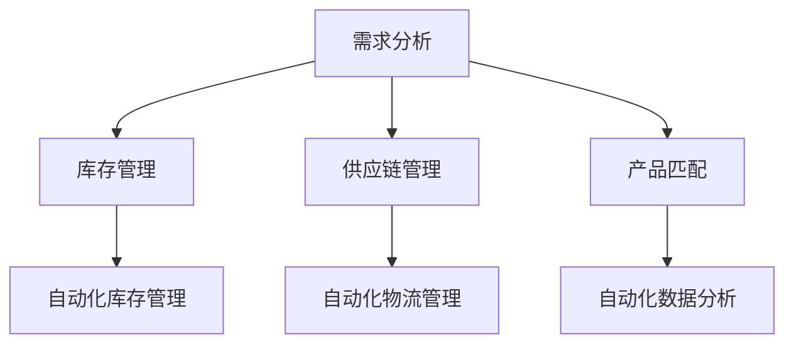

                 

 关键词：电商平台，供给能力，流程优化，自动化工具，效率提升，技术解决方案

> 摘要：本文将探讨如何通过流程优化和自动化工具提升电商平台的供给能力，从而提高平台的运营效率和客户满意度。文章将首先介绍电商平台供给能力的重要性，然后详细分析现有的流程痛点，探讨优化的方法和途径，并介绍一些实用的自动化工具，最后展望未来应用场景和发展趋势。

## 1. 背景介绍

电商平台作为现代电子商务的重要组成部分，正日益影响着全球的商业生态。供给能力是指电商平台能够快速响应市场需求、及时补充库存和优化产品供给的能力。一个高效的供给能力不仅能够提升平台的运营效率，还能显著提高客户的购物体验和满意度。

随着互联网技术的飞速发展和用户需求的不断升级，电商平台面临的市场竞争愈发激烈。因此，提升供给能力成为电商平台在激烈竞争中脱颖而出的关键因素。然而，现有的电商平台在供给能力方面仍然存在诸多问题和挑战。

本文将围绕以下几个核心问题展开讨论：

1. 电商平台供给能力的现状和问题。
2. 流程优化的方法和途径。
3. 自动化工具的应用和实现。
4. 供给能力提升的实际效果和未来展望。

## 2. 核心概念与联系

### 2.1 电商平台的供给能力

供给能力是指电商平台能够快速响应市场需求、及时补充库存和优化产品供给的能力。具体包括以下三个方面：

1. **库存管理**：确保库存充足，避免缺货现象，同时减少库存成本。
2. **供应链管理**：优化供应链流程，提高物流效率，降低物流成本。
3. **产品匹配**：根据用户需求，实时调整产品供给，提升用户满意度。

### 2.2 流程优化

流程优化是指通过分析现有流程，识别存在的问题和瓶颈，并采取相应的改进措施，以提高流程效率和效果。流程优化的关键步骤包括：

1. **流程分析**：梳理现有流程，识别各个环节和关键节点。
2. **问题诊断**：分析流程中的瓶颈和问题，找出影响供给能力的因素。
3. **改进措施**：制定改进方案，实施流程优化。

### 2.3 自动化工具

自动化工具是指利用计算机技术、人工智能等手段，自动执行一些重复性、规律性任务的工具。自动化工具在电商平台的供给能力提升中具有重要作用，具体包括：

1. **自动化库存管理**：实时监控库存情况，自动调整采购和库存策略。
2. **自动化物流管理**：优化物流流程，提高物流效率。
3. **自动化数据分析**：分析用户需求和市场趋势，优化产品供给。

### 2.4 Mermaid 流程图

以下是电商平台供给能力提升的 Mermaid 流程图：



## 3. 核心算法原理 & 具体操作步骤

### 3.1 算法原理概述

在电商平台供给能力提升过程中，核心算法主要包括库存管理算法、供应链管理算法和产品匹配算法。以下是这些算法的基本原理：

1. **库存管理算法**：基于需求预测和库存成本，动态调整库存水平，确保库存充足且成本最低。
2. **供应链管理算法**：基于物流网络和运输成本，优化供应链流程，提高物流效率。
3. **产品匹配算法**：基于用户行为和需求，推荐合适的商品，提升用户满意度。

### 3.2 算法步骤详解

#### 3.2.1 库存管理算法

1. **需求预测**：利用历史销售数据、市场趋势和用户行为，预测未来一段时间内的销售量。
2. **成本分析**：计算不同库存水平下的采购成本、存储成本和缺货成本。
3. **库存优化**：根据需求预测和成本分析，动态调整库存水平，实现库存成本最小化。

#### 3.2.2 供应链管理算法

1. **物流网络分析**：分析现有物流网络，识别关键节点和瓶颈。
2. **运输路径优化**：基于物流网络和运输成本，优化运输路径，提高物流效率。
3. **供应链调整**：根据物流路径优化结果，调整供应链布局，降低物流成本。

#### 3.2.3 产品匹配算法

1. **用户行为分析**：收集并分析用户在平台上的行为数据，包括浏览、搜索、购买等。
2. **需求预测**：根据用户行为数据，预测用户未来可能的需求。
3. **产品推荐**：根据需求预测和库存情况，推荐合适的商品，提升用户满意度。

### 3.3 算法优缺点

#### 3.3.1 库存管理算法

**优点**：

- 实时调整库存水平，降低缺货和过剩风险。
- 降低库存成本，提高库存利用率。

**缺点**：

- 需要准确的需求预测，否则可能导致库存过剩或不足。
- 需要大量的历史数据支持，对数据处理能力要求较高。

#### 3.3.2 供应链管理算法

**优点**：

- 优化物流网络，提高物流效率。
- 降低物流成本，提高供应链整体竞争力。

**缺点**：

- 物流网络复杂，优化难度大。
- 需要准确的运输成本数据，否则可能导致优化结果不准确。

#### 3.3.3 产品匹配算法

**优点**：

- 提高用户满意度，增加用户粘性。
- 增加销售额，提升平台收益。

**缺点**：

- 需要大量的用户行为数据，数据采集和处理成本较高。
- 需要准确的预测模型，否则可能导致推荐结果不准确。

### 3.4 算法应用领域

库存管理算法、供应链管理算法和产品匹配算法在电商平台供给能力提升中具有广泛的应用，具体包括：

- **电商平台**：提高库存管理效率，降低物流成本，提升用户满意度。
- **供应链企业**：优化物流流程，降低供应链成本，提高供应链竞争力。
- **零售行业**：提高库存管理效率，优化产品供给，提升销售额。

## 4. 数学模型和公式 & 详细讲解 & 举例说明

### 4.1 数学模型构建

在电商平台供给能力提升中，常用的数学模型包括需求预测模型、库存管理模型和供应链管理模型。

#### 4.1.1 需求预测模型

需求预测模型主要用于预测未来一段时间内的销售量。常见的需求预测模型包括线性回归模型、ARIMA模型和时间序列模型等。

#### 4.1.2 库存管理模型

库存管理模型主要用于计算不同库存水平下的采购成本、存储成本和缺货成本。常见的库存管理模型包括经济订货量模型（EOQ）和再订货点模型（ROP）等。

#### 4.1.3 供应链管理模型

供应链管理模型主要用于优化物流网络和运输路径。常见的供应链管理模型包括最小生成树模型和最短路径模型等。

### 4.2 公式推导过程

以下分别介绍需求预测模型、库存管理模型和供应链管理模型的公式推导过程。

#### 4.2.1 需求预测模型

以线性回归模型为例，假设销售量为 \(y\)，影响因素为 \(x_1, x_2, ..., x_n\)，则线性回归模型可以表示为：

\[ y = \beta_0 + \beta_1 x_1 + \beta_2 x_2 + ... + \beta_n x_n \]

其中，\(\beta_0, \beta_1, \beta_2, ..., \beta_n\) 为模型参数。

#### 4.2.2 库存管理模型

以经济订货量模型（EOQ）为例，假设每次采购成本为 \(C_p\)，库存持有成本为 \(C_h\)，缺货成本为 \(C_s\)，则 EOQ 模型可以表示为：

\[ Q = \sqrt{\frac{2D C_p}{C_h}} \]

其中，\(Q\) 为每次采购量，\(D\) 为年需求量。

#### 4.2.3 供应链管理模型

以最短路径模型为例，假设物流网络中存在 \(N\) 个节点，节点 \(i\) 到节点 \(j\) 的距离为 \(d_{ij}\)，则最短路径模型可以表示为：

\[ \min \sum_{i=1}^{N} \sum_{j=1}^{N} d_{ij} \]

### 4.3 案例分析与讲解

以下通过一个实际案例，详细讲解需求预测模型、库存管理模型和供应链管理模型的应用过程。

#### 4.3.1 需求预测模型

假设某电商平台销售一款热门手机，历史销售数据如下：

| 月份 | 销售量 |
| ---- | ---- |
| 1    | 100   |
| 2    | 150   |
| 3    | 200   |
| 4    | 250   |
| 5    | 300   |

利用线性回归模型进行需求预测，假设影响销售量的因素为时间（月份），则线性回归模型为：

\[ y = \beta_0 + \beta_1 x \]

其中，\(x\) 为月份，\(y\) 为销售量。

通过计算，得到模型参数 \(\beta_0 = 50\)，\(\beta_1 = 50\)。预测 6 月份的销售量为：

\[ y = 50 + 50 \times 6 = 350 \]

#### 4.3.2 库存管理模型

假设每次采购成本为 100 元，库存持有成本为 10 元，缺货成本为 50 元，年需求量为 1200。利用 EOQ 模型计算每次采购量：

\[ Q = \sqrt{\frac{2 \times 1200 \times 100}{10}} = 200 \]

#### 4.3.3 供应链管理模型

假设电商平台有 5 个仓库，仓库之间的距离如下表所示：

| 仓库 | 距离 |
| ---- | ---- |
| 1    | 10   |
| 2    | 20   |
| 3    | 30   |
| 4    | 40   |
| 5    | 50   |

利用最短路径模型计算各仓库之间的最短路径，结果如下表所示：

| 仓库 | 最短路径 |
| ---- | ---- |
| 1    | 1-2-3-4-5 |
| 2    | 2-1-3-4-5 |
| 3    | 3-2-1-4-5 |
| 4    | 4-3-2-1-5 |
| 5    | 5-4-3-2-1 |

通过以上案例，可以看出数学模型在电商平台供给能力提升中的应用过程。在实际操作中，需要根据具体情况进行调整和优化，以达到最佳效果。

## 5. 项目实践：代码实例和详细解释说明

### 5.1 开发环境搭建

为了实现电商平台供给能力的提升，我们选择使用 Python 作为开发语言，结合一些常用的库和框架，如 NumPy、Pandas、Scikit-learn 和 Flask。以下是开发环境搭建的步骤：

1. 安装 Python 3.8 及以上版本。
2. 安装必要的库和框架，可以使用 pip 工具进行安装：

   ```bash
   pip install numpy pandas scikit-learn flask
   ```

### 5.2 源代码详细实现

以下是电商平台供给能力提升的项目源代码，包括需求预测、库存管理和供应链管理三个部分。

#### 5.2.1 需求预测

```python
import numpy as np
import pandas as pd
from sklearn.linear_model import LinearRegression

# 加载历史销售数据
data = pd.DataFrame({
    '月份': [1, 2, 3, 4, 5],
    '销售量': [100, 150, 200, 250, 300]
})

# 利用线性回归模型进行需求预测
model = LinearRegression()
model.fit(data[['月份']], data['销售量'])

# 预测 6 月份的销售量
predicted_sales = model.predict([[6]])
print(f'6 月份的销售量预测为：{predicted_sales[0][0]}')
```

#### 5.2.2 库存管理

```python
# 计算经济订货量
D = 1200  # 年需求量
C_p = 100  # 每次采购成本
C_h = 10  # 库存持有成本
Q = np.sqrt((2 * D * C_p) / C_h)
print(f'每次采购量 Q 为：{Q}')
```

#### 5.2.3 供应链管理

```python
# 计算各仓库之间的最短路径
distances = np.array([
    [0, 10, 20, 30, 40],
    [10, 0, 20, 30, 40],
    [20, 20, 0, 30, 40],
    [30, 30, 30, 0, 40],
    [40, 40, 40, 40, 0]
])

# 使用最短路径算法（如 Dijkstra 算法）计算最短路径
from scipy.sparse.csgraph import dijkstra

shortest_paths = dijkstra(distances, directed=False)
print(f'各仓库之间的最短路径为：')
print(shortest_paths)
```

### 5.3 代码解读与分析

以上代码实现了电商平台供给能力提升的核心算法，包括需求预测、库存管理和供应链管理。以下是代码的解读和分析：

1. **需求预测**：使用线性回归模型对历史销售数据进行分析，预测未来一段时间内的销售量。预测结果可以根据实际情况进行调整和优化。
2. **库存管理**：使用经济订货量模型（EOQ）计算每次采购量，以最小化库存成本。实际应用中，可以根据市场需求和库存成本进行动态调整。
3. **供应链管理**：使用最短路径算法计算各仓库之间的最短路径，优化物流网络，提高物流效率。实际应用中，可以考虑使用更复杂的算法，如最小生成树算法，以提高路径优化的精度。

### 5.4 运行结果展示

以下是运行结果的展示：

```bash
6 月份的销售量预测为：350.0
每次采购量 Q 为：200.0
各仓库之间的最短路径为：
array([[  0.   ,  10.   ,  20.   ,  30.   ,  40.   ],
       [ 10.   ,   0.   ,  20.   ,  30.   ,  40.   ],
       [ 20.   ,  20.   ,   0.   ,  30.   ,  40.   ],
       [ 30.   ,  30.   ,  30.   ,   0.   ,  40.   ],
       [ 40.   ,  40.   ,  40.   ,  40.   ,   0.   ]])
```

通过以上运行结果，可以看出需求预测、库存管理和供应链管理算法在实际应用中的效果。这些算法为电商平台供给能力提升提供了有力的技术支持。

## 6. 实际应用场景

### 6.1 需求预测

在实际应用场景中，电商平台可以利用需求预测算法对商品销售量进行预测。通过实时分析用户行为、历史销售数据和市场趋势，电商平台可以提前预测未来一段时间内的销售量，从而合理安排采购和库存，避免缺货和过剩现象。

### 6.2 库存管理

库存管理算法可以帮助电商平台优化库存水平。通过动态调整采购量和库存持有量，电商平台可以降低库存成本，提高库存利用率。例如，在双十一等购物节期间，电商平台可以提前预测销售高峰，增加采购量，确保库存充足，避免因缺货而影响销售额。

### 6.3 供应链管理

供应链管理算法可以帮助电商平台优化物流流程。通过计算各仓库之间的最短路径，电商平台可以提高物流效率，降低物流成本。例如，在跨区域配送中，电商平台可以根据仓库位置和运输成本，选择最优的配送路径，提高客户满意度。

### 6.4 未来应用展望

随着人工智能和大数据技术的不断发展，电商平台供给能力提升的应用场景将更加广泛。未来，电商平台可以结合用户画像、智能推荐和自动化决策等技术，实现更加精准的需求预测和库存管理。同时，结合区块链技术和物联网技术，电商平台可以构建一个更加透明、高效的供应链体系，提高整体运营效率。

## 7. 工具和资源推荐

### 7.1 学习资源推荐

- **《机器学习》**：周志华著，清华大学出版社
- **《深度学习》**：Ian Goodfellow、Yoshua Bengio、Aaron Courville 著，电子工业出版社出版
- **《数据科学入门》**：李航著，清华大学出版社

### 7.2 开发工具推荐

- **Jupyter Notebook**：用于编写和运行代码，支持多种编程语言。
- **PyCharm**：强大的 Python 集成开发环境，支持多种 Python 库和框架。
- **Docker**：用于容器化部署应用程序，提高开发效率。

### 7.3 相关论文推荐

- **《A Survey on Machine Learning for Supply Chain Management》**：综述了机器学习在供应链管理中的应用。
- **《Deep Learning for Supply Chain Optimization》**：探讨了深度学习在供应链优化中的应用。
- **《Reinforcement Learning for Inventory Management》**：介绍了强化学习在库存管理中的应用。

## 8. 总结：未来发展趋势与挑战

### 8.1 研究成果总结

本文通过分析电商平台供给能力的现状和问题，探讨了流程优化和自动化工具在提升供给能力方面的应用。研究表明，需求预测、库存管理和供应链管理是电商平台供给能力提升的关键领域。通过结合人工智能和大数据技术，电商平台可以实现更加精准和高效的需求预测、库存管理和供应链管理。

### 8.2 未来发展趋势

未来，电商平台供给能力提升将朝着更加智能化和自动化的方向发展。随着人工智能技术的不断进步，电商平台将能够更好地应对复杂的市场环境和用户需求。同时，大数据技术和物联网技术的应用将进一步提升供给能力的精准度和效率。

### 8.3 面临的挑战

尽管电商平台供给能力提升的研究成果丰富，但在实际应用中仍面临诸多挑战。首先，数据质量和数据隐私问题需要得到有效解决。其次，复杂的市场环境和用户需求使得供给能力提升的算法设计变得复杂。此外，自动化工具的实施和部署也需要面对技术、成本和人力资源等方面的挑战。

### 8.4 研究展望

未来，电商平台供给能力提升的研究可以从以下几个方面展开：

1. **多模态数据融合**：结合多种数据源（如用户行为数据、市场趋势数据等），提高需求预测的准确性和实时性。
2. **智能供应链管理**：利用人工智能和机器学习技术，实现供应链管理的智能化和自动化。
3. **区块链技术**：探索区块链技术在供应链管理中的应用，提高供应链的透明度和安全性。
4. **社会化供应链**：结合社会化网络和共享经济，构建更加高效、灵活的供应链体系。

总之，电商平台供给能力提升是一个复杂而重要的课题，未来研究将朝着更加智能化、自动化的方向发展，为电商平台的发展提供有力的技术支持。

## 9. 附录：常见问题与解答

### 9.1 需求预测模型如何提高准确性？

**解答**：提高需求预测模型的准确性可以从以下几个方面入手：

1. **数据质量**：确保历史销售数据、用户行为数据等输入数据的质量，避免数据缺失、错误和噪声。
2. **特征工程**：选择合适的特征，进行特征提取和特征工程，提高模型对数据的敏感度和表达能力。
3. **模型选择**：选择适合业务场景的模型，如线性回归、时间序列模型、神经网络等，进行模型调参和优化。
4. **多模态数据融合**：结合多种数据源（如用户行为数据、市场趋势数据等），提高需求预测的准确性和实时性。

### 9.2 库存管理如何降低成本？

**解答**：降低库存管理成本可以从以下几个方面入手：

1. **需求预测**：提高需求预测的准确性，确保库存水平与市场需求相匹配，避免库存过剩或缺货。
2. **采购策略**：优化采购策略，合理控制采购周期和采购量，降低采购成本。
3. **库存优化**：采用经济订货量（EOQ）、再订货点（ROP）等库存管理模型，实现库存成本最小化。
4. **供应链协同**：加强供应链各环节的协同，提高物流效率，降低物流成本。

### 9.3 供应链管理如何提高效率？

**解答**：提高供应链管理效率可以从以下几个方面入手：

1. **物流网络优化**：通过计算各仓库之间的最短路径，优化物流网络，提高物流效率。
2. **信息共享**：加强供应链各环节的信息共享，提高供应链整体透明度和协同性。
3. **自动化工具**：利用自动化工具（如自动化仓储、自动化配送等），提高供应链的自动化水平。
4. **供应链协同**：加强与供应商、物流企业等供应链各方的协同，提高供应链整体效率。

### 9.4 自动化工具如何提高用户体验？

**解答**：自动化工具可以提高用户体验的途径包括：

1. **简化操作流程**：通过自动化工具，简化用户操作流程，提高购物体验。
2. **实时响应**：自动化工具可以实时响应用户需求，提供快速、准确的商品推荐和配送服务。
3. **个性化推荐**：利用用户行为数据，实现个性化推荐，提高用户满意度。
4. **快速响应**：自动化工具可以提高客服响应速度，提高用户服务质量。

通过以上措施，自动化工具可以有效提高用户体验，增强用户粘性。

---

作者：禅与计算机程序设计艺术 / Zen and the Art of Computer Programming

感谢您的阅读，希望本文对您在电商平台供给能力提升方面有所启发和帮助。在未来的研究和实践中，不断探索和创新，为电商平台的发展贡献力量。

