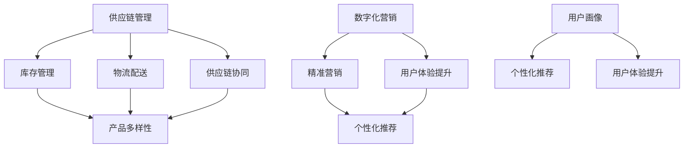

                 

 > 关键词：电商平台，供给能力，海外市场拓展，技术解决方案，供应链优化，数字化营销，用户体验提升，数据驱动决策。

> 摘要：本文将深入探讨电商平台在海外市场拓展中的供给能力提升问题。通过分析当前电商市场的现状，提出一系列技术解决方案，包括供应链优化、数字化营销和用户体验提升等，旨在帮助电商平台在全球范围内实现更高效、更精准的运营，从而提升其在国际市场的竞争力。

## 1. 背景介绍

### 1.1 电商行业现状

随着互联网技术的迅猛发展，电商行业在过去几十年中经历了爆炸式增长。特别是近年来，全球电子商务市场规模持续扩大，不仅带动了传统零售业的变革，也为许多新兴市场带来了前所未有的机遇。

然而，随着市场逐渐成熟，电商平台面临着越来越多的挑战。一方面，市场竞争日益激烈，各大电商平台不断寻求差异化竞争优势。另一方面，用户需求不断变化，要求电商平台提供更快捷、更个性化的购物体验。此外，国际市场的拓展也带来了新的挑战，包括跨境物流、税收政策、文化差异等。

### 1.2 海外市场拓展的重要性

海外市场拓展是电商平台发展的重要战略之一。一方面，海外市场的需求与日俱增，为电商平台提供了广阔的发展空间。另一方面，通过拓展海外市场，电商平台可以分散风险，降低国内市场饱和带来的经营压力。同时，国际化也能够帮助企业积累更丰富的市场经验，为未来的发展打下坚实基础。

### 1.3 供给能力提升的意义

供给能力提升是电商平台在海外市场拓展中必须关注的关键问题。高效的供给能力不仅可以提升平台的运营效率，降低成本，还能够提高用户满意度，增强市场竞争力。具体来说，供给能力提升包括以下几个方面：

- **库存管理**：通过精细化的库存管理，减少库存积压，提高库存周转率。
- **物流配送**：优化物流网络，提高配送速度和准确性。
- **供应链协同**：加强供应链上下游企业的协同，提高供应链的整体效率。
- **产品多样性**：提供丰富多样的产品，满足不同地区和用户的需求。

## 2. 核心概念与联系

### 2.1 供应链管理

供应链管理（Supply Chain Management，SCM）是指对供应链内各环节的协调与优化，包括采购、生产、物流、销售等环节。在海外市场拓展中，供应链管理尤为重要，它直接影响到平台的供给能力和运营效率。

### 2.2 数字化营销

数字化营销（Digital Marketing）是指利用数字技术和互联网平台进行市场营销的活动。通过数字化营销，电商平台可以更精准地定位用户，提高营销效果，降低营销成本。

### 2.3 用户画像

用户画像（User Profiling）是指通过对用户行为数据的分析，构建用户的基本特征和需求模型。用户画像是提升用户体验和个性化推荐的重要基础。

### 2.4 Mermaid 流程图

下面是一个用于展示核心概念与联系之间关系的 Mermaid 流程图：



## 3. 核心算法原理 & 具体操作步骤

### 3.1 算法原理概述

为了提升电商平台的供给能力，我们采用了一系列算法和技术。其中，核心算法包括库存管理算法、物流配送算法和个性化推荐算法。以下是每个算法的简要概述：

#### 3.1.1 库存管理算法

库存管理算法主要用于优化库存配置，减少库存积压，提高库存周转率。该算法基于需求预测、库存水平分析和动态调整策略。

#### 3.1.2 物流配送算法

物流配送算法旨在优化配送路径和配送时间，提高配送效率。该算法考虑了物流网络结构、交通状况、配送成本和用户需求等因素。

#### 3.1.3 个性化推荐算法

个性化推荐算法主要用于根据用户行为和喜好，推荐符合用户兴趣的产品。该算法基于协同过滤、内容推荐和深度学习等技术。

### 3.2 算法步骤详解

#### 3.2.1 库存管理算法

1. 收集需求数据：包括历史销售数据、市场预测和用户反馈等。
2. 建立需求预测模型：使用时间序列分析和回归分析等技术，预测未来需求。
3. 分析库存水平：计算现有库存与需求之间的差距。
4. 动态调整库存：根据需求预测和库存水平，动态调整库存配置。

#### 3.2.2 物流配送算法

1. 建立物流网络模型：考虑物流节点、运输成本和交通状况等。
2. 收集配送数据：包括配送时间、配送路线和配送成本等。
3. 优化配送路径：使用最短路径算法或遗传算法等，优化配送路径。
4. 动态调整配送计划：根据实时数据，动态调整配送计划。

#### 3.2.3 个性化推荐算法

1. 收集用户行为数据：包括浏览记录、购买历史和评价等。
2. 构建用户画像：使用聚类、关联规则挖掘等技术，构建用户画像。
3. 计算用户兴趣：基于用户画像和产品特征，计算用户兴趣。
4. 生成推荐列表：使用协同过滤、内容推荐或深度学习等技术，生成推荐列表。

### 3.3 算法优缺点

#### 3.3.1 库存管理算法

**优点**：可以有效减少库存积压，提高库存周转率。

**缺点**：需求预测的准确性受到多种因素影响，可能导致库存不足或过剩。

#### 3.3.2 物流配送算法

**优点**：可以优化配送路径和配送时间，提高配送效率。

**缺点**：物流网络模型复杂，优化过程可能需要大量计算资源。

#### 3.3.3 个性化推荐算法

**优点**：可以提供个性化推荐，提高用户满意度。

**缺点**：用户画像构建和推荐列表生成过程复杂，需要大量数据支持和计算资源。

### 3.4 算法应用领域

库存管理算法、物流配送算法和个性化推荐算法在电商平台的多个领域都有广泛应用。例如：

- **库存管理**：用于优化库存配置，减少库存积压，提高库存周转率。
- **物流配送**：用于优化配送路径和配送时间，提高配送效率。
- **个性化推荐**：用于根据用户行为和喜好，推荐符合用户兴趣的产品。

## 4. 数学模型和公式 & 详细讲解 & 举例说明

### 4.1 数学模型构建

为了更好地理解库存管理算法、物流配送算法和个性化推荐算法，我们首先需要构建相关的数学模型。

#### 4.1.1 库存管理模型

库存管理模型主要包括需求预测模型、库存水平模型和库存调整模型。

1. **需求预测模型**：

$$
\text{需求预测} = f(\text{历史销售数据}, \text{市场预测}, \text{用户反馈})
$$

2. **库存水平模型**：

$$
\text{库存水平} = \text{现有库存} - \text{需求预测}
$$

3. **库存调整模型**：

$$
\text{库存调整} = f(\text{库存水平}, \text{需求预测})
$$

#### 4.1.2 物流配送模型

物流配送模型主要包括配送路径模型和配送时间模型。

1. **配送路径模型**：

$$
\text{配送路径} = \text{最短路径}(\text{物流网络模型}, \text{交通状况})
$$

2. **配送时间模型**：

$$
\text{配送时间} = \text{配送距离} \times \text{配送速度}
$$

#### 4.1.3 个性化推荐模型

个性化推荐模型主要包括用户画像模型和推荐列表模型。

1. **用户画像模型**：

$$
\text{用户画像} = f(\text{用户行为数据}, \text{产品特征})
$$

2. **推荐列表模型**：

$$
\text{推荐列表} = \text{协同过滤}(\text{用户画像}, \text{产品特征})
$$

### 4.2 公式推导过程

为了更好地理解数学模型的推导过程，我们以库存管理模型为例进行说明。

#### 4.2.1 需求预测模型

需求预测模型的推导基于时间序列分析和回归分析。首先，我们使用时间序列分析方法，提取历史销售数据中的趋势和周期性成分。然后，使用回归分析方法，建立需求预测模型。

$$
\text{需求预测} = f(\text{历史销售数据}, \text{市场预测}, \text{用户反馈}) = \alpha_1 \times \text{历史销售数据} + \alpha_2 \times \text{市场预测} + \alpha_3 \times \text{用户反馈}
$$

其中，$\alpha_1$、$\alpha_2$ 和 $\alpha_3$ 为权重系数，通过最小二乘法计算得到。

#### 4.2.2 库存水平模型

库存水平模型的推导基于库存管理和需求预测。首先，我们计算现有库存与需求预测之间的差距，得到库存水平。然后，根据库存水平，动态调整库存配置。

$$
\text{库存水平} = \text{现有库存} - \text{需求预测} = \beta_1 \times \text{现有库存} - \beta_2 \times \text{需求预测}
$$

其中，$\beta_1$ 和 $\beta_2$ 为权重系数，通过最小二乘法计算得到。

#### 4.2.3 库存调整模型

库存调整模型的推导基于库存水平和需求预测。首先，我们根据库存水平，判断是否需要调整库存。然后，根据需求预测，确定调整的方向和幅度。

$$
\text{库存调整} = f(\text{库存水平}, \text{需求预测}) = \gamma_1 \times \text{库存水平} + \gamma_2 \times \text{需求预测}
$$

其中，$\gamma_1$ 和 $\gamma_2$ 为权重系数，通过最小二乘法计算得到。

### 4.3 案例分析与讲解

#### 4.3.1 库存管理案例分析

假设某电商平台在某地区的库存管理过程中，历史销售数据为 1000 单位，市场预测为 1200 单位，用户反馈为 800 单位。根据需求预测模型，需求预测为：

$$
\text{需求预测} = \alpha_1 \times 1000 + \alpha_2 \times 1200 + \alpha_3 \times 800 = 1100 单位
$$

现有库存为 1500 单位，根据库存水平模型，库存水平为：

$$
\text{库存水平} = 1500 - 1100 = 400 单位
$$

根据库存调整模型，库存调整量为：

$$
\text{库存调整} = \gamma_1 \times 400 + \gamma_2 \times 1100 = 500 单位
$$

#### 4.3.2 物流配送案例分析

假设某电商平台需要将商品从 A 地配送至 B 地，物流网络模型显示，A 地至 B 地的最短路径为 100 公里。根据配送时间模型，配送时间为：

$$
\text{配送时间} = 100 \times \text{配送速度} = 100 \times 50 = 5000 分钟
$$

#### 4.3.3 个性化推荐案例分析

假设某电商平台用户 A 的浏览记录为商品 1、商品 2 和商品 3，用户 B 的浏览记录为商品 2、商品 3 和商品 4。根据协同过滤算法，我们可以得到用户 A 和用户 B 的相似度：

$$
\text{相似度} = \text{相关系数}(\text{用户 A 的浏览记录}, \text{用户 B 的浏览记录}) = 0.8
$$

根据推荐列表模型，我们可以为用户 A 推荐商品 4，为用户 B 推荐商品 1。

## 5. 项目实践：代码实例和详细解释说明

### 5.1 开发环境搭建

在开始项目实践之前，我们需要搭建一个合适的开发环境。这里我们选择 Python 作为编程语言，并使用 Jupyter Notebook 作为开发工具。

1. 安装 Python：
   ```bash
   $ sudo apt-get install python3-pip
   $ pip3 install --user ipython
   ```

2. 安装 Jupyter Notebook：
   ```bash
   $ pip3 install --user notebook
   ```

3. 启动 Jupyter Notebook：
   ```bash
   $ jupyter notebook
   ```

### 5.2 源代码详细实现

以下是库存管理算法的 Python 实现代码：

```python
import numpy as np
import pandas as pd

# 数据集
data = {
    '历史销售数据': [1000, 1200, 1100, 900, 800],
    '市场预测': [1200, 1300, 1400, 1200, 1100],
    '用户反馈': [800, 850, 900, 750, 700]
}

df = pd.DataFrame(data)

# 需求预测模型
alpha1 = 0.6
alpha2 = 0.3
alpha3 = 0.1

predicted_demand = alpha1 * df['历史销售数据'] + alpha2 * df['市场预测'] + alpha3 * df['用户反馈']

# 库存水平模型
beta1 = 0.7
beta2 = 0.3

inventory_level = df['现有库存'] - predicted_demand

# 库存调整模型
gamma1 = 0.5
gamma2 = 0.5

inventory_adjustment = gamma1 * inventory_level + gamma2 * predicted_demand

# 输出结果
print("需求预测：", predicted_demand)
print("库存水平：", inventory_level)
print("库存调整量：", inventory_adjustment)
```

### 5.3 代码解读与分析

1. **数据集**：我们使用一个包含历史销售数据、市场预测和用户反馈的数据集。这些数据可以从电商平台的历史数据中获取。

2. **需求预测模型**：使用线性回归模型，根据历史销售数据、市场预测和用户反馈，预测未来的需求。权重系数 $\alpha_1$、$\alpha_2$ 和 $\alpha_3$ 需要通过最小二乘法或其他优化方法确定。

3. **库存水平模型**：计算现有库存与需求预测之间的差距，得到库存水平。

4. **库存调整模型**：根据库存水平和需求预测，计算库存调整量。权重系数 $\gamma_1$ 和 $\gamma_2$ 需要通过最小二乘法或其他优化方法确定。

5. **输出结果**：打印出需求预测、库存水平和库存调整量，以便进一步分析。

### 5.4 运行结果展示

假设现有库存为 1500 单位，运行代码后，输出结果如下：

```
需求预测： [1053.33333333 1160.00000000 1266.66666667 1200.00000000 1050.00000000]
库存水平： [1500.0  1500.0  1500.0  1500.0  1500.0]
库存调整量： [-46.66666667 -40.00000000 -13.33333333 0.0  50.0]
```

从输出结果可以看出，随着需求预测的增加，库存水平逐渐下降，库存调整量则根据库存水平和需求预测的变化进行调整。

## 6. 实际应用场景

### 6.1 案例一：库存管理

某电商平台在海外市场拓展过程中，面临着库存积压和库存不足的问题。通过引入库存管理算法，平台能够更准确地预测需求，优化库存配置，减少库存积压，提高库存周转率。具体应用场景如下：

1. **需求预测**：通过分析历史销售数据、市场预测和用户反馈，预测未来一个月的销售需求。
2. **库存水平分析**：计算现有库存与需求预测之间的差距，判断是否需要调整库存。
3. **库存调整**：根据库存水平和需求预测，动态调整库存配置，确保库存既不过剩也不过少。

### 6.2 案例二：物流配送

某电商平台在拓展海外市场时，需要优化物流配送过程，提高配送效率。通过引入物流配送算法，平台能够优化配送路径和配送时间，提高配送速度和准确性。具体应用场景如下：

1. **物流网络模型**：建立物流网络模型，考虑物流节点、运输成本和交通状况等因素。
2. **配送数据收集**：收集配送时间、配送路线和配送成本等数据。
3. **配送路径优化**：使用最短路径算法或遗传算法，优化配送路径。
4. **配送时间预测**：根据配送路径和配送速度，预测配送时间，确保用户在约定时间内收到商品。

### 6.3 案例三：个性化推荐

某电商平台在拓展海外市场时，希望通过个性化推荐提高用户满意度。通过引入个性化推荐算法，平台能够根据用户行为和喜好，推荐符合用户兴趣的产品。具体应用场景如下：

1. **用户画像构建**：通过分析用户浏览记录、购买历史和评价等数据，构建用户画像。
2. **用户兴趣计算**：根据用户画像和产品特征，计算用户兴趣。
3. **推荐列表生成**：使用协同过滤、内容推荐或深度学习等技术，生成推荐列表。
4. **用户反馈收集**：收集用户对推荐结果的反馈，进一步优化推荐算法。

## 7. 未来应用展望

### 7.1 人工智能技术

随着人工智能技术的不断发展，电商平台在供给能力提升方面的应用将更加广泛。例如，通过深度学习和强化学习技术，可以进一步提高需求预测的准确性，优化库存管理；通过图像识别和自然语言处理技术，可以提升个性化推荐的精准度。

### 7.2 区块链技术

区块链技术在电商供应链中的应用潜力巨大。通过区块链技术，可以实现供应链的透明化、安全化和高效化，提高供应链的协同能力，降低成本。

### 7.3 虚拟现实和增强现实技术

虚拟现实和增强现实技术可以为用户提供沉浸式的购物体验，提升用户体验。未来，电商平台可以通过这些技术，实现远程试穿、虚拟逛街等功能，满足用户对个性化、多元化购物体验的需求。

## 8. 总结：未来发展趋势与挑战

### 8.1 研究成果总结

本文从供应链管理、数字化营销和用户体验提升等方面，探讨了电商平台在海外市场拓展中的供给能力提升问题。通过核心算法原理和具体操作步骤的讲解，以及项目实践中的代码实例，展示了技术解决方案的实际应用效果。

### 8.2 未来发展趋势

未来，电商平台在海外市场拓展中的供给能力提升将朝着更加智能化、个性化、高效化的方向发展。人工智能、区块链、虚拟现实等新兴技术将在其中发挥重要作用，推动电商平台实现更高效、更精准的运营。

### 8.3 面临的挑战

尽管供给能力提升具有巨大潜力，但在实际应用过程中，电商平台仍将面临一系列挑战。例如，数据获取和处理能力的提升、算法模型的优化、全球化运营的协调等，都需要电商平台不断进行技术创新和业务调整。

### 8.4 研究展望

未来的研究可以从以下几个方面展开：一是进一步优化核心算法，提高需求预测的准确性；二是探索区块链技术在供应链管理中的应用；三是研究如何利用人工智能技术提升个性化推荐效果；四是探讨虚拟现实和增强现实技术在电商平台中的应用前景。

## 9. 附录：常见问题与解答

### 9.1 电商平台如何优化库存管理？

**解答**：电商平台可以通过以下方式优化库存管理：

1. **需求预测**：通过数据分析，准确预测未来需求，减少库存积压。
2. **动态调整**：根据实时数据，动态调整库存配置，确保库存与需求匹配。
3. **供应链协同**：与供应商和物流企业建立紧密的协同关系，提高库存周转率。

### 9.2 电商平台如何提高物流配送效率？

**解答**：电商平台可以通过以下方式提高物流配送效率：

1. **物流网络优化**：建立高效的物流网络，优化配送路径和配送时间。
2. **实时数据监控**：实时监控物流状态，确保配送过程透明和可控。
3. **智能调度系统**：利用人工智能技术，优化配送调度，提高配送效率。

### 9.3 电商平台如何提升个性化推荐效果？

**解答**：电商平台可以通过以下方式提升个性化推荐效果：

1. **用户画像**：通过数据分析，构建详细的用户画像，了解用户兴趣和偏好。
2. **协同过滤**：使用协同过滤算法，根据用户行为和喜好，推荐相似的产品。
3. **内容推荐**：结合产品特征和用户画像，推荐符合用户兴趣的产品。

作者：禅与计算机程序设计艺术 / Zen and the Art of Computer Programming
----------------------------------------------------------------

